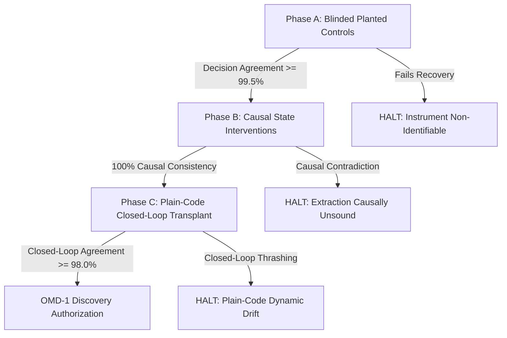

# Cursor Research Notebook

Independent architecture research. Work backwards from failures of existing systems. Do not treat shared background files as conclusions.

This notebook does not use `Claude_Research.md` or `Codex_Research.md`.

Shared background already read, and treated only as background: `01_MISSION.md`, `02_RESEARCH_METHOD.md`, `03_IDEA_CRITERIA.md`, `04_RESEARCH_STATE.md`, `00_PRIOR_RESEARCH.md`. The five directions in the prior report (constraint settlement, causal mechanisms, developmental tissue, event ecologies, dynamic ontologies) are **not** adopted here. If this notebook converges on one of them, that convergence must be labeled as such and then either sharpened or rejected.

---

# Resume block

**Current search lens:** Negative-space audit of the ten closed search modes. No new architecture is being proposed. No experiment is authorized.

**Audit verdict (2026-09-28):** The ten modes jointly cover the architecture-organization dimensions they can express. No region meets the audit’s survival tests. False-negative pressure in the novelty filter is real and already partly corrected; it does not identify an unsearched organization.

**Number of candidate primitives/architectures evaluated:** 
- 72 primitive/substrate candidates (P1–P72: all 72 killed under calibrated novelty audit; 0 survivors).
- 18 interface-loss candidates (IC1–IC18: all 18 killed across Batch 1 & 2; 0 survivors).
- 13 learning-dynamics candidates (LD1–LD13: all 13 killed; 0 survivors).
- Total evaluated to date: **103 candidates**. Total survivors: **0**.

**Current stage:** 
0. Negative-space search-space audit completed. Coverage map, filter risks, and the zero-region verdict are in the section **Negative-space search-space audit**. Prior stage record follows.
1. Reclassification audit of P1–P72 completed (58 Existing Architecture, 11 Pipeline Only, 2 Existing Mechanism, 1 Impossible/Non-Identifiable).
2. Interface Information-Loss Boundary completed (IC1–IC18 evaluated; 15 Existing Architecture, 3 Pipeline Only; Formulation of Representation-Communication Duality).
3. Learning Dynamics Taxonomy completed across 14 core properties.
4. Candidate Batch LD1–LD13 generated and killed (11 Existing Architecture, 2 Existing Optimizer/Pipeline).
5. Continuous Parameter-Drift Theorem and Constructive Dynamics Boundary formalized (all continuous parameter-drift methods colonized 1986–2024; constructive commitment reduces to classical learners).
6. Automated Search Benchmark Suite Designed (Tasks A–F, matched baselines, 7 ablations, exact metrics, compute envelope).
7. **Stage 0 Independent Benchmark Implementation & Validation:** Completed. Independent unit test suite (`test_generators.py`) passed (6/6 tests passing). Verified determinism under seeds, train/eval separation, no target leakage, strictly 1D input with no boundary signal in Task C*, exact 90% train / 10% OOD shortcut in Task F, and condition number control in Task D.
8. **AMS v4 Specification & Implementation Independent Verification:** Completed.
   - Task-B M2-v4 (`FitReduction_B = 1 - L1_pre / max(L1_init, 1e-8)`): Verified uses held-out Task-1 eval set, averages across calibration seeds, enforces $\ge 0.95$ threshold, and LR selection is strictly based on training-batch MSE without exposure to Task-2 or OOD evaluation sets.
   - Task-B Joint Representability Oracle (`V1-B-REP`): Verified 1,000 updates, batch size 32 (16 T1 + 16 T2 fresh examples), identical MLP architecture (width 32, tanh, Glorot normal), no early stopping, LR selected by final-50-update training loss, separate held-out evaluations, non-gating for candidate promotion. Confirmed zero train/eval leakage and no task ID exposure beyond existing private coordinate blocks.
   - C* Sanity (`M7-v4`): Verified $R_0\text{ MSE} < 0.25$, both $R_1$ entries $> 0.05$, and finite censored adaptation half-life $< 64$ updates.
   - Benchmark Invariance: Confirmed that Tasks B, C*, F generators, Task D diagnostic, candidate grammar, Stage-2 budgets, candidate promotion thresholds, and Stage-3 ablations are strictly unchanged in v4.
9. **Official AMS v4 Stage-1 Machine-Readable Audit & Recomputation:** Completed.
   - Recomputed all 9 mandatory v4 gates against `runs/stage1_v4/stage1_result.json`:
     - `M6_controls_run`: **PASS** (all generic baselines stable).
     - `M2_v4_B_fit`: **PASS** (SGD: 0.988, SGDM: 0.989, AdamW: 0.989, all $\ge 0.95$).
     - `M3_B_interference`: **PASS** (100% forgetting, $L1_{post} > L1_{pre}$ on every seed).
     - `M4_F_failure`: **PASS** (Train 100%, OOD 16.2%–16.8%, $SGG \approx 83\%$).
     - `M5_detector`: **PASS** (carried forward from v3 Stage 0).
     - `M7_v4_Cstar_sanity`: **PASS** ($R_0\text{ pre-shift} = 0.031$, $R_1\text{ entries} = 1.00 / 0.90$, half-lives = 14.0, 18.8, 17.6, all $< 64$).
     - `V3_F`: **PASS** (Discrete synthesis achieves 1.00 OOD accuracy).
     - `V_D`: **PASS** (Natural gradient reaches $S_\tau = 90 / 109$ at $\kappa=10^4 / 10^6$; SGD/SGDM diverge).
     - `V1_B_REP`: **FAIL** (SGD: 0.914/0.904, SGDM: 0.883/0.867, AdamW: 0.884/0.859; all $< 0.95$).
   - **Root Cause Classification:** Optimization budget mismatch under mini-batch SGD with gradient clipping. The 2-layer MLP requires coordinating hidden units to learn non-linear sign gating on shared coordinates conditional on private coordinates. Diagnostic proves representation is achieved at 4,000 updates (0.967 / 0.960). It is NOT an implementation error, NOT a metric calculation bug, and NOT an architectural representability limit.
10. **AMS v5 Calibration & Stage-2 Repaired Rerun Audit:** Completed.
    - Verified v5 Stage 1 passed every mandatory gate at 4,000 updates (`V1-B-REP` reached 0.967/0.960 with SGD, 0.958/0.952 with SGDM, 0.970/0.964 with AdamW).
    - Verified the implementation repair for the `strip_gates` scalar-`where` typing defect (`add(0@T, y)`).
    - Audited the exact repaired rerun in `runs/stage2_repair1/`: 6,000 programs generated, 0 defects, 382 reached T0, 0 passed T0 (best 0.596x vs <= 0.5x threshold), 0 reached Tier 1, 0 promoted. Confirmed classification as a search-design negative for uniform random typed generation.
11. **AMS v6 Specification & Search-Design Independent Verification:** Completed.
    - Verified the active protocol is **AMS v6** (amendment in `3cbb21f` and `a66a0f0`).
    - Verified exact R1 SGD parameter-update backbone is preserved in initial proposals (`dW_base = neg(outer(d_bp, a))`, `db_base = neg(d_bp)`, `update_every = 1`).
    - Verified uniform 1/3 sampling across primary coupling classes C1 (state -> forward), C2 (activity-routed credit), and C3 (structural operation).
    - Verified bounded 0.1 perturbations: C1 ($w_{\text{eff}} = 0.1 \tanh(\text{reg})$ or $\text{gain} = 1.0 + 0.1 \tanh(\text{reg})$), C2 ($g = 1.0 + 0.1 \tanh(\text{selector})$), C3 ($\text{mask} = \tanh(\text{reg})$, $\theta \in \{0.0, 0.1, 0.5\}$).
    - Verified candidate generation is strictly static/structural: zero benchmark data (B, C*, F) or T0 results are queried during proposal creation.
    - Confirmed T0 sanity filter, Tier-1 benchmark generators/metrics, $2\sigma$-over-AdamW rule, MAP-Elites quality, promotion criteria, and Stage-3 ablations remain 100% unchanged.
    - Verified absence of accidental advantages: no hidden updates, no extra data, no extra forward/backward passes, no uncounted parameters, and identical $\{10^{-3}, 10^{-2}, 10^{-1}\}$ LR tuning grid.
12. **Independent Structural Proposal Audit (1,000 Non-Evaluated Samples):** Completed.
    - Verified 100% of proposals satisfy node limits ($\le 45$ nodes) and register limits (C1: 1 register of type M/O; C2: 0 registers; C3: 1 register of type O).
    - Verified persistent-state accounting: 100% RUN lifetime, init "0", decay $\in \{0.5, 0.9, 0.99\}$.
    - C1 and C3 proposals cleanly populate MAP-Elites niches $(0, 0, 0)$ [feature], $(0, 0, 1)$ [synapse], and $(2, 0, 0)$.
    - **Critical Descriptor Collapse Discovery:** Flagged that `ams/fingerprint.py:Analysis.c2()` was implemented to check strictly for discrete routing gates (`topk` or `where`). C2 proposals constructed with smooth activity modulations ($g = 1.0 + 0.1 \tanh(\text{selector})$ via `rowscale`) lack discrete gates, causing `c2()` to evaluate to `False`, `couplings` to collapse to `()`, and `descriptor` to return `None`. In `search.py`, these are classified as `pure_rule` and rejected before T0. Only the ~16% of C2 proposals with explicit `where`/`topk` gates populate niches $(1, 0, 0)$ and $(1, 3, 0)$. Additionally, depth-2 selectors in C2 produce `dW` of depth 6, exceeding `MAX_DEPTH = 5`.
13. **AMS v7 Official Stage 2 & Stage 3 Independent Audit & Metric Verification:** Completed.
    - Verified local workspace is synchronized with remote `origin/main` at clean commit `e516ab5`.
    - **Stage-2 Recomputation (`runs/stage2_v7/`):** 5,544 programs generated (stopped at G_MAX = 20); 1,621 syntactic duplicates (29.2%); 1,317 behavioral duplicates (23.8%); 66 pure rules (1.2%); 124 no learning signal (2.2%); 2,230 evaluated at T0 sanity; 1,030 failed T0 (18.6%); exactly 1,200 evaluated on Tier 1 (1,200/1,200 budget exhausted); 41 achieved $q \ge 0.15$; 3 interpreter broadcasting defects on Task F (non-fatal, within $\le 5$ tolerance); archive occupancy reached 35 / 56 cells (62.5%); exactly 8 candidates promoted to Stage 3 (all on Task C*, capped at 8 per task).
    - **Constructor vs. Mutation/Crossover Offspring:** 100% of promoted candidates (8/8) were mutation or crossover offspring; 0 came from initial constructor proposals. C2 constructor proposals had 0 Tier-1 evaluations (79 behavioral duplicates, 67 syntactic duplicates, 9 REDISCOVERY_inert), confirming Cursor's earlier descriptor/gate audit findings.
    - **Stage-3 Fresh-Seed Recomputed Metrics (`runs/stage3_v7/`):** Evaluated across 10 fresh seeds (10000–10009). Best generic $G$: SGD with $m_G = 21.8$ updates (AdamW: 22.6, SGDM: 29.2). Promotion threshold $\tau = 10.9$ (50% reduction vs. best generic), with return check $\ge 8/10$.
    - **Gate-3 Threshold, Holm Correction & Bootstrap CI Verification:**
      - All 8 candidates fail the effect threshold ($m_P \in [12.4, 26.4] > 10.9$).
      - Return checks failed for 7/8 candidates (3/10 to 7/10; required $\ge 8/10$; only P05100 achieved 8/10 but had $m_P = 23.0$).
      - Under paired Wilcoxon signed-rank testing with Holm-Bonferroni correction ($\alpha = 0.05, m = 8$ tests), zero candidates achieved statistical significance (lowest p-values $p = 0.007812 > \text{threshold } 0.006250$).
      - All 8 candidates fail Gate 3 $\to$ All 8 correctly and verified labeled **NEGATIVE** (no preregistered matched advantage on fresh data).
    - **Assessment of 3-Seed Censored Half-Life Noise Observation:** Fully confirmed. Task C* censored half-life on short 64-step intervals evaluated every 4 steps is a high-variance, point-in-time threshold-crossing metric. SGD shifted from 12.0 on Tier-1 seeds to 21.8 on fresh seeds (+81.7%). MAP-Elites experienced classic Winner's Curse, selecting on extreme positive noise outliers and actively favoring variance-increasing mutations (noise-injected gain and weight doubling). Recommendations for future protocols include replacing threshold half-life with integral metrics (AULC / cumulative online loss) and requiring multi-tier seed validation before archive insertion.
    - **Shared Compute Ledger:** Stage 2 (7,678.60 CPU-s) + Stage 3 (167.57 CPU-s) = 2.838 CPU-h total cumulative across Stages 0–3, well within the 30.0 CPU-hour hard cap (9.46% utilized).
14. **AMS v8 Official Stage 2 & Confirmation Funnel Independent Audit & Metric Recomputation:** Completed.
    - Verified synchronization with `origin/main` at clean commit `b5e3b9e`.
    - **Stage-2 Recomputation (`runs/stage2_v8/`):** 4,413 programs generated (stopped at G_MAX = 20); 45 invalid (1.0%); 1,245 syntactic duplicates (28.2%); 976 behavioral duplicates (22.1%); 76 pure rules (1.7%); 101 no learning signal (2.3%); 9 REDISCOVERY_inert (0.2%); 1,961 evaluated at T0 sanity; 761 failed T0 (38.8% of T0 evaluated); exactly 1,200 evaluated on fast Tier-1 (1,200/1,200 budget exhausted); 2 interpreter broadcasting defects on Task F (`P03104`, `P04262`; non-fatal, $\le 5$ tolerance); archive occupancy reached 42 / 56 cells (75.0%).
    - **Confirmation Funnel Recomputed Metrics (`runs/stage2_v8_confirm/`):** All 42 occupied-cell elites were evaluated on their frozen fast best task over 8 confirmation seeds (6000–6007). Tasks evaluated: Task B: 29 elites, Task F: 8 elites, Task C*: 5 elites.
    - **Recomputed Confirmation Baselines:**
      - Task B: Best generic = SGD (metric = 100.0).
      - Task C*: Best generic = SGD (mean AULC = 0.4001; AdamW mean = 0.4409, SD = 0.0718, $2\sigma$ threshold = 0.2974).
      - Task F: Best generic = SGDM (metric = 0.8270; AdamW mean = 0.8282, SD = 0.0387, $2\sigma$ threshold = 0.7508).
    - **Confirmation Failure Breakdown across 42 Elites:**
      - Failed task constraints: 34 / 42 (Task B: 29/29 failed $T2 \le 1.25 \times T2_G$; Task C*: 4/5 failed return count $\ge 6/8$; Task F: 1/8 failed train acc $\ge 0.98$).
      - Failed AdamW 2-sigma gate: 32 / 42 (all 8 on Task F, 20 on Task B, 4 on Task C*).
      - Failed paired wins ($\ge 6/8$ over best generic): 29 / 42 (23 on Task B, 4 on Task F, 2 on Task C*).
      - Failed $q_{\text{confirm}} \ge 0.15$: **42 / 42 (100.0%)** (maximum $q_{\text{confirm}}$ achieved across all 42 elites was **0.0629** by P03911).
    - **Deep-Dive Audit of `P03974` (Cell (2, 0, 0), C3 coupling):**
      - Fastest adapting candidate: mean confirmation AULC $m_P = 0.2133$ vs. SGD $m_G = 0.4001$ (uncapped effect $0.4669$).
      - Paired wins: **8 / 8** (beat generic SGD on every single confirmation seed).
      - AdamW 2-sigma check: **PASS** ($0.2133 \le 0.2974$).
      - Fatal Failure: R0 return check passed on only **5 / 8** seeds (failed on seeds 6003, 6005, 6007; required $\ge 6 / 8$). Under preregistered rule D-S2-v8 (`ams/confirm.py:80`), failing the return check caps the effect to $0.0$, yielding $q_{\text{confirm}} = 0.0 - 0.0514 = -0.0514 < 0.15$.
      - Canonical AST verification: $W_{\text{eff}} = W + W_{\text{ep0}}$ with an inert freeze rule ($\tanh(r_1) \le 0$ always). Adding initial weight snapshot $W_{\text{ep0}}$ accelerates R1 adaptation but causes stability/plasticity imbalance on $R_1 \to R_0$ recovery.
    - **Final Outcome:** **0 of 42 elites confirmation-eligible $\to$ 0 promotions to Stage 3 $\to$ Stage 3 did not run** (locked confirmation seeds 30000–30009 remain untouched).
    - **Shared Compute Ledger:** Cumulative compute is 5.127 CPU-hours across all stages (17.09% of 30-hour cap; 24.87 CPU-hours headroom remaining). Zero GPU consumed.
15. **OMD-0 T1 RET Identifiability & Extraction-Validity Independent Audit:** Completed.
    - **Hostile Prior-Art Baseline:** Ratified Codex verdict that T1 RET survives only as an OMD target family (0 novel architectures or primitives claimed; no OMD-1 frozen).
    - **Identifiability Audit:** Proved that raw continuous latent coordinates $(h_1, h_2) \in \mathbb{R}^2$ and $g \in \mathbb{R}^1$ are fundamentally non-identifiable due to slot permutation symmetry, diffeomorphism invariance ($\Phi, \Psi$), and rank-preserving monotonic transformations. Established that the correct mathematical equivalence class is a **Labeled Transition System on the Quotient State Space (Abstract Policy Automaton)** under bisimulation, defined by invariant topological partitioning and induced eviction orderings.
    - **Extraction Validity & Thresholds:** Rejected Claude's $R^2 \ge 0.99$ and $\ge 95\%$ decision agreement thresholds as dangerously loose for closed-loop cache eviction (5% error induces catastrophic thrashing on loop scans and misses 100% of probational promotions). Mandated closed-loop rollout agreement $\ge 98\%$, stationary agreement $\ge 99\%$, and $\ge 95\%$ MIN-gap closure under full closed-loop execution. Formulated a 6-point verification battery including counterfactual event flips, state swapping, and targeted vs. random ablation testing.
    - **Resource Matching & $F_{\text{tick}}$ Compute Advantage:** Uncovered that the proposed instrument's $F_{\text{tick}}$ update across all $C$ resident slots on every request grants an unfair $O(C)$ compute luxury ($\approx 9,600$ FLOPs/req) unavailable to classical $O(1)$ policies. Mandated lazy event-driven updates (or explicit charging of $O(C)$ baseline rankers). Formulated the complete decomposition suite (ARC, CAR, SIEVE, S3-FIFO, LeCaR, CACHEUS, EVA, LHD, PolicySmith, CacheCraft).
    - **Transfer Validity (T-KV Audit):** Rejected T-KV due to continuous softmax discretization, $\tau$-tuning leakage, and direct subsumption by H2O/StreamingLLM. Proposed a clean, zero-tuning alternative: **Bounded Lexicon / Dictionary Entry Retention** (exact discrete query hits/misses, zero hyperparameter leakage).
    - **GRUMA Audit:** Verified directly from CSAIDE 2025 proceedings. Negative on all 5 target criteria: GRUMA is a standard external sequence model (GRU + multi-head attention) on PC/address streams evaluated on SPEC CPU2006. It lacks per-object resident slot states, online event updates, mixed nonstationary streams, symbolic extraction, and causal validation.
    - **Minimum Decisive Pilot Design:** Formulated a staged, CPU-only planted-control pilot (Phase A: blinded rediscovery of LRU, LFU, SIEVE, 2Q; Phase B: causal state patching; Phase C: plain-code closed-loop transplant) requiring $\le 1.0$ CPU-hour (8x–14x cheaper than Claude's 8–14h estimate).
    - **Required Final Recommendation:** **`RETAIN ONLY FOR MINIMAL IDENTIFIABILITY PILOT`**.

**Strongest surviving candidates:** None.

**Killed candidates by series:**
- P1–P72: All 72 killed (see Candidate Ledger for full calibrated classifications).
- IC1–IC18: All 18 killed (15 `KILLED — EXISTING ARCHITECTURE`, 3 `KILLED — PIPELINE ONLY`).
- LD1–LD13: All 13 killed (11 `KILLED — EXISTING ARCHITECTURE`, 2 `KILLED — EXISTING ARCHITECTURE / OPTIMIZER`).

**Core Architectural Finding:**
Following the completion of the continuous optimization search series (AMS v5–v8: all yielding negative results due to classical basin saturation and stability/plasticity trade-offs such as P03974's $W_{\text{eff}} = W + W_{\text{ep0}}$), the project pivoted to the Origin Mechanism Discovery (OMD) paradigm. In OMD-0, 18 target families were screened, leaving only T1 RET (capacity-bounded retention under nonstationary reuse). Cursor's independent audit establishes that continuous neural latent coordinates are non-identifiable, but the mechanism's quotient transition automaton is identifiable under bisimulation. The all-slot $F_{\text{tick}}$ update grants an unfair $O(C)$ compute advantage requiring lazy-clock event-driven discretization, and T-KV transfer suffers from $\tau$-calibration leakage. T1 was retained strictly for a minimal planted-control pilot ($\le 1.0$ CPU-h) to validate extraction before any mixed-regime search or OMD-1 freeze. That pilot later failed its imitation gate. The 2026-09-28 negative-space audit is the current result: no unsearched organization survives.

**Unresolved prior-art questions:** None that name an unsearched organization. Early classical-machine kills were not each re-run under the later substitutability convention. Q06 remains parked because a lost matching invariant has no shown importance. Neither item is an unsearched region.

**Exact next action:** Do not open another generation lens, grammar, anomaly family, theorem screen, or OMD instrument. A later search needs a named property that an ordinary decomposition fails to preserve, and that property has to sit outside the closed modes in the negative-space audit. No compute. The OMD planted-control pilot already failed its imitation gate; this audit does not redesign it.


---

# Negative-space search-space audit

**Status:** completed 2026-09-28. Literature and notebook evidence only. No new candidate. No experiment. No literature survey beyond the closed-mode record.

**Question.** Which architectural organizations could the methods already used have discovered, and which could they have missed for structural reasons?

**Evidence used.** `AGENTS.md` (the primitive / architecture / pipeline rule). `SHARED_RESEARCH_MAP.md` (lanes, AMS grammar, do-not-reopen list, anomaly phase, OMD plan). This notebook’s resume and the AMS / OMD audit sections. Bounded excerpts only: Claude resume and Parts AA, AB, AE, AP, AQ; Codex resume through AR-150; `HANDOFF_Claude_grammar_gap_audit.md`.

**Labels.** Statements below are **verified** when they restate a recorded protocol, grammar, or verdict, and **interpretation** when they judge coverage.

## 1. Design dimensions

The dimensions below are the ones a method would have to be able to vary before it could discover an organization of that kind.

| Dimension | What a real variant would change |
|---|---|
| Persistent state organization | What is stored, at what lifetime, and whether slots can be created |
| State-transition algebra | Map, relation, constraint solution, rewrite rule, or discrete transition |
| Communication topology | Who can read whose state |
| Routing topology | How an input selects a path |
| Representation structure | Tensor, symbol, graph, distribution, quotient |
| Execution semantics | What a step means |
| Synchrony | One clock, or local clocks and events |
| Update timing | When a write is allowed to happen |
| Credit-flow topology | Which internal quantities receive a learning signal |
| Local vs global information | What a part may use |
| Parameter / state separation | What is slow, what is fast, what is ephemeral |
| Train-time vs inference-time coupling | Whether the update rule is present at test time |
| Variable structure | Whether the machine’s parts change |
| Conditional computation | Whether work can be skipped |
| Memory semantics | Address, content, append, retract, isolate |
| Precision / discretization | Whether the state is exact, quantized, or hybrid |
| Topology over time | Whether the graph of the step changes |
| Interaction order | Whether the order of updates is part of the mechanism |
| Compositional hierarchy | Whether scope and sub-machines are native |
| Success criterion | Loss, worst-case separation, invariant, or extracted policy |

The last row is added because several modes froze the criterion even when they varied the machine.

## 2. Coverage map

**Verified constraints, then interpretation.**

| Mode | Dimensions it could vary | Dimensions it froze | What its grammar or evaluator could not express |
|---|---|---|---|
| 1. Concept-first invention | All of the rows, in prose. Early Claude batches and this notebook’s failure chains named memory, credit, scope, growth, identity, and synchrony-adjacent ideas (spikes, continuous time). | The human menu of named AI mechanisms. | Nothing formal. **Interpretation:** it misses organizations the inventor does not already have a name for. Part AA records that conclusion as library closure for primitive claims. |
| 2. Primitive reduction / known-machine collision | The same menu, plus Codex archaeology through Petri nets, oscillators, amorphous computing, membrane systems, neuromorphic substrates, and reflective interpreters. | A candidate had to be proposed first. Collision cannot invent. | A resource frontier that was never stated as the claimed property. Many kills correctly name a preserving machine. |
| 3. Native coupling / interface loss | Credit, solver derivations, routing, memory writes, and other cross-module signals (NC01–NC13, IC1–IC18, AR-139). | The picture of a system as modules with interfaces. | Intra-model parameterization. The record says attention, residual connections, backprop, and diffusion are not inter-module couplings. Those moved to mode 4. |
| 4. Learning-dynamics concept search | The eight channels K1–K8: function class during training, non-parameter state, data-routed credit, hidden overparameterization, data-dependent preconditioning, credit rule, train/test asymmetry, landscape geometry. | A single model whose alternatives are reparameterizations or published occupants of those channels. | A transition algebra that is not a parameterization of a network. Constructive commitment was checked and reduced to Cascade-Correlation, ART, Growing Neural Gas, and program synthesis. |
| 5. Bounded AMS | Tiny persistent registers; a gain or weight perturbation; activity-routed credit; one structural freeze/reinit. MAP-Elites over 56 cells of that grammar. Tasks B, C*, F. | Clocked layer execution; one program on every layer of a width-32 tanh MLP; scalar loss; SGD parameter step; dense tensors; static graph; at most four registers; decays from a fixed set; perturbations of size 0.1; no skips, attention, inner loops, fixed points, BPTT through registers, or meta outer loop. | The eight grammar gaps g1–g8: event-triggered lifetimes, indexed multi-slot memory, copy/restore/fork/merge, topology change, on-demand higher-order terms, per-layer heterogeneity, discrete hypothesis objects, replay. Also any organization larger than a small modulation of that MLP. |
| 6. Grammar-gap expansion | Exactly g1–g8, as eight named candidates GG1–GG8. | The three AMS task failures as the only target properties. | Organizations that do not help B, C*, or F. All eight candidates were killed as existing machines or pipelines. GG2’s ordinary decomposition preserves every listed property. |
| 7. Observed-mechanism discovery | Policies representable as a per-slot 2-D state, one global scalar, and shared event maps, on capacity-bounded retention. | The cache task, the slot layout, and imitation as the training contract. Seventeen other target families were killed as occupied compact designs. | Anything whose state is not that small continuous slot machine. The planted-control pilot failed the imitation gate on LRU, LFU, SIEVE, and 2Q (Claude Part AQ: 3/36 held-out pairs passed; all four controls failed). **Interpretation:** the instrument could not represent the known discrete policies it was required to rediscover, so it could not reveal a new one. |
| 8. Property-first separation search | Properties a human selects, then a demand that decomposition lose the property. Calibration controls: path length, identity gradient, credit cost, noise-schedule coupling, learned clauses. Q06 (no blocking pairs) was parked. | The selected property list. | An organization whose property is not one of those pairs. Importance was an extra gate: Q06 loses a hard property under decomposition and still was not reopened, because no importance was shown. |
| 9. Anomaly-first mining | Mechanisms already visible inside trained Transformers: sinks and massive activations, Hydra self-repair, continual plasticity collapse (AR-148–AR-150). | The Transformer compute graph and published anomalies. | An organization nobody has trained and published. All three anomalies were closed as ordinary parameter, optimizer, and residual-stream dynamics. |
| 10. Theorem-first constructive separation | Loopholes in named no-go theorems: proof-system non-automatability, Littlestone stability, Pitman–Koopman–Darmois / additive deletion, Lin–Kelly tracking (NG-1–NG-9). | Those theorems’ statements. | A separation that is not a worst-case gap in concept invention, discrete commitment, or exact deletion. The recorded loopholes are occupied by library learning, replicability, and known sufficient statistics. |

**Interpretation of the union.** Modes 1–2 and the Codex collision library are wide and shallow: they can name almost any classical organization and then kill it. Modes 3–6 are narrow and mechanical: they can generate or reject only organizations inside a module interface, a K1–K8 channel, or the AMS grammar. Modes 7–10 can see only a cache automaton, a prechosen property, a published Transformer anomaly, or a loophole in three aspirations. An organization is unsearched only if it falls outside all ten of those nets at once.

## 3. False-negative risks in the filter

The written rule, after calibration, is the one in `AGENTS.md`: known low-level operations do not by themselves kill an architecture claim; the ordinary decomposition has to preserve the claimed property. “Ordinary decomposition” in the calibration note means known components at their ordinary interfaces, trained in their ordinary way.

**Where practice followed the rule. Verified.**

- AB.1 accepts attention, residual connections, the origin of reverse-mode credit, diffusion, and CDCL as architectures, and rejects RAG, tool use, and LLM-to-SAT as pipelines. Simulability is not the reason.
- The P-batch reclassification asks, candidate by candidate, whether the ordinary decomposition preserves the property. Several kills record that the classical machine preserves the invariant more tightly than the proposed continuous encoding.
- GG2 is killed because a stated decomposition preserves every claimed property, not because the pieces are computable.
- CDCL is used as the control that “same SAT function” is not architectural equivalence.

**Where the filter was too strong, and what remains. Interpretation.**

- Before calibration, the session-7 table would have rejected CDCL despite a proven separation, and would have rejected attention, residuals, backprop, and diffusion. That pressure was real. The recalibration and AB.1 corrected it for those controls. AB.3 re-audited 13 of the strongest older kills; none reopened. Two were existing architectures; the rest were pipelines whose property survived decomposition.
- Q06 is the clearest leftover: decomposition loses “no blocking pairs,” and the candidate stays parked because importance was not shown. That is an importance gate, not a decomposability kill. It is one parked router, not an unsearched region.
- AMS can false-negative a mechanism whose benefit is a large reorganization. The grammar only allows a 0.1 modulation, and promotion requires the effect to beat the program’s own known pieces on B, C*, or F. A CDCL-sized coupling cannot be written there. Those couplings were the subject of modes 3, 4, and 6, which collided with prior art. The AMS miss is therefore a grammar miss, and the grammar miss was then searched.
- Early “use the classical machine” lines in this notebook were not each rewritten under the later convention. The ones inspected name a machine that performs the same transition and preserves the stated property. A full re-audit could still find a chain that stopped at primitive equivalence and skipped a resource frontier. That is a process residue. It is not, by itself, a located organization.
- Killing a claim because a more expensive simulator exists would violate the rule. The checked post-calibration kills do the opposite when the resource is the property: backprop passes against finite differences because of the credit-cost law; OMD’s all-slot tick was charged because it spent O(C) work the O(1) policies do not spend. Matched-resource rejection is the rule working.

**Interpretation.** The live false-negative risk is concentrated in two places: the importance gate (Q06), and the un-rerun bulk of pre-calibration chains. Neither supplies a region that modes 3–10 left unexpressed.

## 4. Were the hidden assumptions actually frozen?

| Assumption | Frozen in which modes | Varied elsewhere |
|---|---|---|
| Clocked layer execution | AMS, learning-dynamics channels as sampled, anomaly audits | Continuous time and event systems appear in collision results and in this notebook’s ODE and spike reductions |
| Tensor in, tensor out | AMS, OMD instrument, anomaly audits | Symbolic machines are the collision library’s default killers |
| Static parameter arrays | AMS, except one structural op | Growth, NAS, and constructive learners were searched and closed |
| Fixed update equations | AMS grammar | Grammar-gap named the missing ops and killed them |
| Global synchrony | AMS, OMD’s learner | Petri nets, oscillators, neuromorphic event systems in the collision record |
| Parameters separate from activations | AMS, with a few registers as the allowed exception | Fast weights, TTT, Titans, HOPE occupy K2 |
| Fixed graph per step | AMS (g4) | Dynamic graphs and architecture search are on the do-not-reopen list |
| Scalar loss and a standard optimizer | AMS tasks; learning-dynamics screen | Theorem mode uses worst-case separations instead, and those loopholes are occupied |
| Dense numerical state | AMS, OMD, anomalies | Exact symbolic state is granted in the known-machine library |
| Predefined slots and width | AMS (32×32, ≤4 registers); OMD (C slots, 2-D) | Variable structure was mode 6’s g3–g5 and was killed |

**Interpretation.** These assumptions were frozen inside the automated and anomaly instruments. They were not frozen across the project. The concept, collision, and grammar-gap modes treated each of them as a known machine or as a killed candidate.

## 5. Hostile check of apparent gaps

Each row is an apparent miss. All are killed.

| Apparent gap | Why it fails the survival tests |
|---|---|
| Event-driven or asynchronous organization | Occupied by Petri nets, neuromorphic event systems, and spiking reductions. A simulator that includes the event queue preserves the transitions. Criterion C: this is conditional/event computation already on record. |
| Indexed multi-slot or content-addressed memory | g2, and the do-not-reopen list for NTM/DNC and external memory. |
| Discrete hypothesis objects | g7. Exact search already solves the measured rebinding failure. Do-not-reopen: ordinary discrete search. |
| Runtime growth, fork, merge | GG1 and the do-not-reopen list for generic module birth/death and architecture search. |
| Data-dependent state lifetime | GG5 reduces to a forget gate, a change-point reset, or ART. |
| Per-object cache automaton | OMD’s target. The primitive claim was recorded as dead on sight (a priority queue). The pilot failed before any new rule could be extracted. |
| A ninth learning-dynamics channel | K1–K8 were the non-equivalent channels after optimizer restoration. Sampled candidates died as published architectures. A nameless ninth channel is not falsifiable (fails E). |
| Quantitative edges inside residual, attention, fast-weight, or routing families | Those are known mechanisms (fails C). AMS already measured a bounded slice and promoted nothing. Settling a matched edge would be an experiment, which this audit does not recommend. |
| Q06-style matching invariant | Considered, parked, and not a region beyond one router. Reopening it needs an importance argument the audit does not have. |
| New specifications | Part AA’s conclusion about what could still pass the primitive filter. A missing specification is not an organization of state, credit, or transition. It fails the request for an architectural region. |

## 6. Verdict

**Surviving unexplored regions: none.**

**Strongest surviving region: none.**

**What would have killed a region, had one remained.** A known machine at ordinary interfaces that preserves the stated transitions, credit flow, and resource law; or a failure of falsifiability; or membership in recurrence, memory, search, depth, mixture-of-experts, dynamic growth, or test-time learning.

**Next method.** Do not start an eleventh generation mode. The ten modes fail in known ways: prior art, preserved properties, pipelines, hidden search, resource substitution, impossibility, optimization artifacts, non-identifiability, and known architectures sitting on the proposed gap. Another grammar, another anomaly list, or another tiny recurrent instrument repeats one of those modes. The only search that is not a repeat is one that starts from a property the ordinary decomposition loses, stated precisely enough to falsify, and placed outside the grammars, channels, theorems, anomalies, and cache instrument already closed. No such property is in hand.

---

# Method reminder

```text
CURRENT FAILURE
→ WHY EXACT SYMBOLS / MEMORY / CLASSICAL ALGORITHMS DO NOT ALREADY SOLVE IT
→ REQUIRED CAPABILITY
→ REQUIRED INTERNAL PROPERTY
→ COMPUTATIONAL MECHANISM
→ POSSIBLE ARCHITECTURE
→ CLOSEST PRIOR ART
→ ATTEMPT TO REDUCE IT TO AN EXISTING MACHINE
→ SMALLEST FALSIFIABLE TEST
```

If the reduction succeeds, the recorded result is:

**USE THE CLASSICAL MACHINE — NOT A NEW ARCHITECTURE**

A candidate must name an operation the closest machine does not perform. Unusual arrangement is not enough.

A candidate must change a computational primitive (unit, information flow, state, memory, learning rule, scheduling, uncertainty, growth, or the training/inference relation). Renames, prompts, RAG, tool shells, and module soup do not count.

Design rule adopted in this session:

> If a property is only encouraged by a loss term, the architecture does not have it. Survivors need the property to be true by the data structure or the write rule.

---

# Current objective

Find one current-AI limitation whose backwards chain demands a mechanism that existing families do not already implement. Negative results stay in this file.

---

# Family survey (compact)

Judgments below are research notes, not measurements. “Fundamental” means the weakness follows from the representation or update rule, not from a small training choice.

| Family | Does unusually well | Consistent struggle | Suspected cause | Fundamental? |
|---|---|---|---|---|
| GPT-style LLMs (GPT, Claude, DeepSeek dense chat, Kimi-style long-context LMs) | Fluent conditional generation, in-context pattern match, code, tool traces | Exact one-shot durable facts; lossless edit of one fact; abstention; localizing a bad step; size extrapolation; stale parametric facts | Next-token cross-entropy; knowledge in shared weights; no impasse state | Edit interference looks fundamental given superposition. Abstention is architectural/objective. Long context is partly an engineering mitigation. |
| DeepSeek-style MoE | More parameters per FLOP; some specialization | Facts still entangled inside experts; router drift under continued updates; no permanent address for one fact | Conditional computation, not separated storage | Routing does not remove superposition inside an expert. |
| Standard Transformers | Trainable pairwise dependencies inside a window | Quadratic cost; fixed depth; weak length extrapolation unless the task fits a length-general circuit | Attention + fixed schedule + positional scheme | Fixed depth is a choice. Quadratic exact attention is fundamental to full pairwise attention. |
| Looped / universal Transformers | More steps on longer algorithmic problems when the step is a repeated circuit | Do not by themselves discover the right iterative decomposition from raw I/O; still a shared weight update | Adaptive recurrence | Length generalization for known iterative algorithms is partly solved (Fan et al., ICLR 2025). Not an open architecture slot. |
| RNNs / SSMs (Mamba and relatives) | Linear-time sequence modeling; compressed state | Arbitrary exact recall of distant items | Finite state compression | Fundamental to fixed-size state. |
| Classifiers / energy and open-set heads | Can reject; do not compound token errors; boundaries can be local | No open-ended construction; closed or weakly open label sets | Decision geometry rather than generation | Reject option is real and should not be rediscovered as a “new architecture.” |
| JEPA-style predictors | Avoid generating unpredictable observation detail | Error is not tied to a discrete editable belief; collapse risk; no exact fact store | Embedding-space prediction | Localization of *which belief* failed is outside the representation. |
| World models (Dreamer-style and relatives) | Imagination for planning; sometimes better sample use than model-free RL | Entangled transition laws; latent rollout drift; regime change damages the whole model | One transition network | A single shared transition is the cause, not “too little data” alone. |
| RL / reasoning-from-outcome | Learns from success and failure signals | Credit smeared across time; no responsible step | Scalar return through a black box | Exact localization needs judgeable steps. Scalar credit is the wrong object. |
| Coding agents | An executor can falsify a claim | Goal drift, lost intermediate commitments, weak step localization | LLM state lives in a prompt/context log | Scaffolding is not an architecture. The missing piece is the state/write rule. |
| Soft external memory (NTM, DNC, Titans, HOPE) | Longer effective context than a pure RNN | Compression into parameters or soft slots; interference; capacity left without hard guarantees (Titans authors flag this) | Write is a gradient into shared weights | Does **not** satisfy lossless edit. |
| Symbolic fact memory (Knowledge graphs, Facts as Experts, MEMO-style episode stores) | One-shot add/edit of a record without a global retrain | Reader model may still memorize and confabulate; overwrite deletes history; symbols are given | Two stores, but the neural store is still allowed to know contingent facts | The store is not new. Enforcement against parametric confabulation is the residue. |
| Relational bottleneck (ESBN, CoRelNet, Abstractor) | Few-shot relational rules that transfer to new objects | Not a lifelong fact system; can discard attributes that matter; mostly episode scale | Identity features stripped before the relation module | The useful property is real and already implemented. Do not reinvent. |
| Neural production systems (Goyal et al. 2021) | Sparse rules bound to entities; some extrapolation to more objects | Fixed rule set; entity state is a vector; not lifelong append; assumes entities are already separated | Productions as MLPs + attention binding | Same lesson as classical productions, now differentiable. Not an open slot by itself. |
| Ripple-down rules, ACT-R, Soar, TMS/ATMS | Local knowledge growth; impasse (Soar); dependency-directed revision (TMS) | Hand-specified symbols; weak perception; RDR can duplicate structure; ATMS labels explode | Discrete commitments and precondition match | These are the prior art for “don’t damage old knowledge” and “don’t answer past an impasse.” |
| Particle beliefs, Birch copy-on-write, EviTrack (2026) | Keep more than one explanation; delay commitment when evidence is late | Particle cost; continuous tracks rather than editable discrete knowledge | Explicit hypothesis objects | Premature-collapse architectures already exist. |
| Diffusion / score models | Multimodal samples | Many evaluations; no commitment ledger | Iterative denoising of a point | Wrong primitive for exact knowledge. |
| GNNs | Relations on a given graph | Oversquashing; ontology fixed in advance | Message passing on a given node set | Does not solve birth of facts or lossless edit. |
| Program synthesis / DreamCoder-style library learning | Exact fit, reuse of abstracted subroutines, size-independent procedures when the DSL fits | Brittle under noise; human DSL; search cost | Search over programs plus compression | “Learn a growing library of functions” is taken. |

---

# Backwards chains

## Chain A — Lossless edit of one fact

**Failure.** Lifelong knowledge editing of LLMs collapses after modest numbers of edits. Unrelated facts shatter.

**Evidence.** Hu, Cao, Chen, Liu, Zhao (AAAI 2025), “Knowledge in Superposition,” derive an interference term in the closed-form lifelong edit. The term vanishes if knowledge representations are not superposed. They report superposition across GPT-2, Llama-2, Llama-3, Pythia, GPT-J, with heavy-tailed geometry. Related observations: representation shattering (arXiv 2410.17194); superimposed noise in sequential edits (arXiv 2505.07899); MicroEdit (EMNLP 2025) tries neuron-level SAE localization *inside* the transformer.

**Required capability.** Change one contingent fact and leave every non-dependent behavior intact. Including after thousands of later edits.

**Required property.** Independently editable facts do not share writable parameters. This is a hard structural property, not an L2 penalty on the edit.

**Mechanism that would satisfy it.** Append or replace a record that is addressed by identity, not by a direction in a shared weight matrix. Procedures, if any, live in a separate substrate that is not the fact store.

**Naive architecture.** A ledger of facts plus a neural reader.

**Prior art that kills the naive architecture.**

- Facts as Experts (Verga, Sun, Soares, Cohen, arXiv 2007.00849): symbolic fact memory bound to `(subject, relation) → objects`. New facts can be injected at inference time. Existing facts can be overwritten, including facts that contradict pretraining, without retraining. This is already “facts as addressable experts.” Reported weakness to remember: contradictory overwrites were only partially successful, and deletion was unresolved in that paper.
- ERASE (NAACL 2025 Findings, “Language Modeling with Editable External Knowledge”): external natural-language facts plus a history of timestamped truth values. New documents cause rewrites or explicit invalidation. Prediction is still RAG over the maintained store. This kills “bi-temporal fact memory” as a candidate. ERASE’s own residue is retrieval and multi-hop reasoning over the store, which is an LLM problem, not a missing store.
- MEMO (Banino et al., 2020): keeps episode facts in external memory and retrieves with a variable number of hops.
- Role-filler binding results (Chen et al., PeerJ 2021, and related): external memory plus a *diverse* pool of fillers supports binding novel fillers; a small filler pool lets the net memorize. Fast weights and DNC were the successful substrates. Lesson: separation of bindings from weights is necessary but known.
- MicroEdit / ROME / MEMIT: attempt localization inside superposed weights. Hu et al. imply this cannot be lossless while superposition remains. Treat in-weight editing as a dead end for the lossless requirement.
- Titans (Behrouz, Zhong, Mirrokni, NeurIPS 2025) and Nested Learning / HOPE (NeurIPS 2025): memorize at test time by writing into a neural memory’s parameters, gated by surprise. Authors leave capacity guarantees open and note safety issues of test-time parametric writes. This improves long context. It does **not** remove the interference term, because the write is still into shared parameters.

**Status:** Naive ledger rejected as an architecture. Residue kept as R1/R3 only where it is *not* FaE.

**What would have falsified the superposition diagnosis:** a dense associative-memory edit rule with overlapping fact encodings and zero measured damage on unrelated queries after many edits. Hu et al.’s derivation says the interference term is then zero only in the non-superposed case. I am not re-running their proof; I am taking the published derivation as the current reason to stop trying to edit facts inside dense MLP layers.

## Chain B — Add a fact without destroying a different regime

**Failure.** A new observation conflicts with a stored one. Gradient updates average the two regimes. In-place memory overwrite destroys the old regime. The system cannot answer “what is true under condition C?” after learning “what is true under condition C′.”

**Required capability.** Keep both facts, each scoped, and select or refuse at query time.

**Required property.** Writes are monotonic with respect to stored cases: old cornerstone cases still classify or predict as they did. New knowledge is an exception edge, not a global parameter move.

**Known mechanism.** Ripple-down rules (Compton & Jansen, late 1980s onward). On a wrong conclusion, append an exception or else-branch on the path that fired. Cornerstone cases are stored with the rule. The expert supplies a condition true of the new case and false of the cornerstone. Knowledge is not rewritten in place. Multiple-classification RDR and fuzzy RDR exist. Convergence results exist for incremental construction under an expert strategy (see “On the Convergence of Incremental Knowledge Base Construction”).

**Also known.** ACT-R declarative chunks vs procedural productions. Soar impasses and chunking. Boosting and progressive columns freeze old components and add a new one, but they do not store a case-level justification.

**Status:** Killed, including the automatic residue.

Pass 2 found that exception conditions are already induced without a human:

- Induct/RDR (Gaines & Compton, early 1990s; Gaines, JIIS 1995 writeup): statistical search for attribute-value clauses, then recursive if-true and if-false exceptions on residual cases. Batch.
- Weka’s Ridor is an Induct-RDR implementation.
- LDRDR (Shiraz, 1997): incremental RDR for sequential control traces. Compares the failing case to the cornerstone, builds a condition list from the difference, appends an exception or an else-rule. Designed because Induct/RDR was batch and not sequential.

Flat automatic RDR is prior art. Doing the same thing for “structured” cases would be RDR on richer predicates, not a new computational class. R1 is not promoted.

## Chain C — Systematic generalization to new objects

**Failure.** Nets trained on specific objects fail to reuse a relation on unseen objects (SCAN, COGS, simple identity rules).

**Required property.** The relation module must be unable to see object identity features. Otherwise it memorizes fillers.

**Existing mechanism.** Relational bottleneck: ESBN, CoRelNet, Abstractor (Webb et al.; Altabaa et al., ICLR 2024). Inner-product or cross-attention relations, then downstream computation only on those relations. Reported effect: few-shot relational learning and transfer to new objects, where Relation Nets and Transformers shortcut to perceptual details.

**Limitation already stated by that literature.** A strict bottleneck throws away non-relational attributes. Humans use both. Graded bottlenecks are the authors’ own suggested fix, not my idea.

**Status:** Rejected as a candidate source. Kept as a constraint: if a future candidate claims filler-invariant procedures, it must actually delete or quarantine filler identity, and it must cite this prior art.

## Chain D — Length / size extrapolation

**Failure.** Fixed-depth Transformers that solve addition, parity, or copy at length n fail at longer n.

**Required property.** A small step operator reused a variable number of times, with state that can hold the intermediate work, and a training scheme that actually finds that step.

**Existing mechanism.** Looped Transformers with adaptive steps (Fan, Du, Ramchandran, Lee, ICLR 2025) improve length generalization on tasks whose solution is repeated RASP-L operations. A formal line (ICLR 2025 length-generalization framework; C-RASP) predicts which tasks a limit transformer can extrapolate. Scratchpads and chain-of-thought help some tasks and still fail simple addition in reported studies (Lee et al., 2024, as cited by Fan et al.).

**Status:** Rejected as an open primitive. Recurrence-with-adaptive-depth is occupied. Do not propose “a model that loops” as new.

## Chain E — Do not collapse explanations before the evidence arrives

**Failure.** Autoregressive decoding and many particle filters commit early. Later evidence cannot recover a hypothesis that was resampled away. MAP embeddings keep one latent.

**Required property.** Competing explanations remain distinct objects until a discriminating observation arrives. Shared prefixes should not be copied eagerly.

**Existing mechanism.**

- Sequential Monte Carlo / particle filters (with known deprivation and resampling collapse).
- Birch’s lazy copy-on-write for population probabilistic programs (Murray et al., arXiv 2001.05293).
- EviTrack (arXiv 2605.19283): selection over sampling for delayed disambiguation; keeps trajectory identity; resampling in bootstrap particle filters kills the right trajectory; their ablations favor little pruning and small branching.

**Status:** Rejected as a new architecture. Any later candidate about “multiple worlds” must beat EviTrack / copy-on-write SMC on a concrete residue, not on the slogan of multimodality.

## Chain F — Localize the step that made the answer wrong

**Failure.** A wrong LLM answer does not come with a smallest responsible internal step. Text chain-of-thought is not the computation that produced the answer. A second copy of the same model shares the blind spot.

**Required capability.** Name the smallest commitment such that changing it repairs the result, without retraining the whole model.

**Required property.** Intermediate steps are discrete, logged, and independently judgeable. A residual stream does not have this property.

**Existing mechanism.** Algorithmic / declarative debugging (Shapiro 1982) localizes a bug in a logic program by queries about intermediate subgoals. Truth-maintenance systems record which assumptions support which beliefs. Delta debugging (Zeller) bisects failing tests. Counterfactual credit assignment reduces RL variance but still differentiates through a black-box policy.

**Status:** Rejected as a standalone architecture. Design constraint retained:

> Error localization without independently judgeable steps is not a real mechanism. It is a request for a debugger on a system that has no statements.

Do not propose “neural ATMS” unless the justification structure is learned and the prior-art check fails. Not started.

## Chain G — Less compute on familiar problems

**Failure.** Familiar inputs still pay full depth. MoE sparsifies experts but not “I already solved this isomorphic subproblem.” Early exit (ACT, PonderNet, mixture-of-depth) uses a halt head, not a retrieved verified result.

**Existing mechanism.** Memoization, Soar chunking, macro-operators, DreamCoder library learning, compiler equality saturation. Isomorphic reuse is structure-mapping / case-based reasoning (SME and descendants).

**Status:** Rejected. “Cache the abstract solution and rebind” is classical. A combination with a neural perceptual front end is module soup unless a new write rule appears.

## Chain H — JEPA-style prediction still cannot say which belief failed

**Failure.** Predicting in embedding space avoids pixel noise, but the residual is not an address. You cannot freeze belief 17 and rewrite belief 18.

**Required capability.** Each stored commitment produces its own residual. Only the commitments that fail are eligible for a write. Missing commitments produce an impasse rather than a filled-in embedding.

**Required property.** State includes a set of discrete commitments with identities. The predictor returns a map `id → residual`, including `missing`.

**Closest occupied ground.** Object-centric world models and slot rollouts predict per slot, but the slot vector is still a superposed state and slot index is not lifelong identity. Factor graphs localize residuals but do not by themselves learn new commitment types. NPS localizes rule application but the rule set is fixed.

**Status:** Killed as an architecture residue.

Pass 2: “Modeling What Changes: Sparse, Residual World Models for Object-Centric Manipulation” (arXiv 2609.02046) already predicts a per-object change gate and a residual pose delta, and copies ungated objects verbatim so error is not injected into static objects. Dyn-O (NeurIPS 2025) splits each slot into static vs dynamic features. Reusable Slotwise Mechanisms factor slot updates across a menu of MLPs.

Finer gates (per attribute instead of per object) are a granularity tweak of that write rule, not a new class. R2 is not promoted. The remaining hard piece is a *shared law* residual, not an object residual. That is Chain J.

## Chain I — Persistent identity

**Failure.** Slot attention and many trackers permute or reuse slots. A fact attached to “slot 3” is not a fact about an object. Lifelong edit then writes to the wrong place or to a blended vector.

**Required property.** An identity is minted once, never reused for a different object, and properties are records on that identity.

**Status:** Killed as an architecture residue.

Pass 2: SCOFF (Goyal et al., arXiv 2006.16225) already factorizes declarative object files from procedural schemata. Embodied-SlotSSM keeps slot identity by temporal initialization. SlotNarrative (arXiv 2608.04866) uses a parameter-free memory to bind recurring observations to persistent entries carrying appearance, trajectory, and properties. Slot attention itself was defined as an object-file analogue (Locatello et al., 2020).

Minting a stable id is occupied. Storing exact symbolic properties on that id collapses back into a knowledge-graph write (Chain A). R3 is not promoted.

## Chain J — A shared law changes; object-level residuals do not name the law

**Failure.** Sparse per-object updates (Chain H / arXiv 2609.02046) copy unchanged objects and patch the ones that moved. That is the right write when one object is pushed. It is the wrong write when a shared law changes (friction, gravity, a game rule, a type signature). Then every dependent object shows a residual. Patching objects one by one either memorizes a cloud of exceptions or damages the old regime. Refitting one global network or one global equation does the same damage by averaging.

**Required capability.** Add or replace one reusable law, leave previously committed laws bitwise unchanged, and keep old trajectories predictable under the old regime label.

**Required property.** Laws are frozen executable terms. The only free variables in the search are the new term and its applicability condition. Admission requires (i) residual reduction on the new evidence and (ii) no damage to cornerstone trajectories of committed laws.

**Mechanism to pressure-test.** Residual law accretion: simulate committed laws, fit a new term only to the leftover residual, attach the regime condition that separates the new evidence from cornerstones, reject the term if replaying cornerstones fails.

**Why this might still be old.** SINDy, AI Feynman, PySR, and incremental equation discovery already search a library of terms. LDRDR already appends controller rules from traces. The Causal Mechanism Loom in the shared background essay is a neighboring synthesis (executable mechanisms, split by regime). This chain must not be promoted by renaming any of those. It lives only if the freeze-plus-cornerstone-veto rule is not already how incremental symbolic regression works.

**Status:** Killed as an architecture. No candidate id.

Pass 2 citations that occupy this chain:

- Symbolic decision trees (arXiv 2605.24275) jointly learn regime splits and local governing equations. The object Chain J wanted (a scoped executable law) is their output.
- One-shot hybrid system identification (OASIcs DX 2025, vol. 136, paper 7) adds a new flow only when current flows cannot explain a segment, then refines that flow on the segments it does explain. Guards are a separate later step. This is residual-triggered law birth. Their refinement step is the opposite of a bitwise freeze; freeze-vs-refine is a bias inside this loop, not a new class.
- Nonlinear hybrid automata learners (arXiv 2301.03915 and Dainarx, HSCC 2026) already separate mode dynamics from guard/reset learning (SVM or similar boundaries).
- STL guard mining assumes modes and flows are already identified and only learns the switching conditions.
- R-SINDy updates online with a forgetting factor. That deliberately damages the old regime in order to track the new one. It is prior art for the tracking goal, and a warning not to confuse tracking with remembering both regimes.
- Symbolic-SINDy (Gastoldi, Politecnico di Milano, 2026 summary) targets online discovery under sudden dynamic change by adding nonlinearities to the library.

Shared-background neighbor, not used as a reason by itself: a causal mechanism loom. The concrete killers above are enough.

**Residue that is not a proposal:** these methods assume the state variables are already the right measurements. Moving them into pixels is causal representation learning, a different occupied field. Do not reopen Chain J under a perception front end.

## Chain K — “Unknown” should propagate, not be sampled away

**Failure.** A softmax or a point latent turns missing information into a definite guess. Ensembles that share one blind spot agree and are still wrong.

**Required property.** A third value, unknown, that propagates algebraically: a determined input can short-circuit, an unknown input must not flip a determined output, and refinement (replacing unknown with a value) must not change a previously correct determined verdict.

**Prior art that kills it.** R-DTLGN (arXiv 2605.24649) is a recurrent network whose neurons harden into Kleene ternary gates. Hidden state starts at all-unknown. The paper states that refinement cannot turn a correct verdict incorrect, because inference is a composition of Kleene connectives. THEIA (arXiv 2604.11284) learns Kleene tables in a modular net, and its own writeup says a Transformer can also hit the table under the right training. Differentiable logic gate networks are the earlier substrate. MonoKAN-style monotone nets are a different constraint (monotone in a real input, not in the information order).

**Status:** Killed. Do not propose three-valued logic, evidential heads, or “abstention neurons” as this project’s architecture. The useful constraint is already built for monitoring. Extending it to open-world perception is an application of R-DTLGN, not a new primitive.

## Chain L — Library growth makes later solutions worse

**Failure.** In a DreamCoder-style ARC adaptation, abstraction sleep produced longer programs and more errors: new primitives were preferred because they had shorter codes, not because search got better (Bober-Irizar & Banerjee, and the PMC writeup of that work).

**Required property.** A new abstraction is admitted only when it helps, and it is not globally cheaper to use on tasks it does not fit.

**Prior art.** Stitch (Bowers et al., POPL 2023) replaces DreamCoder’s deductive compression with corpus-guided top-down synthesis and is far more scalable. It still optimizes compressivity. Li, Ellis, and colleagues (ICLR 2025, “Combining Induction and Transduction for Abstract Reasoning”) state the live agenda directly: induction and transduction are complementary, and the open engineering problem is a language whose primitives are learned and non-symbolic. Their own system does not get better at few-shot learning by solving new problems; the seeds are human-written. An ACL 2026 paper on ARC-style benchmarks reports that about 80% of inspected failures are perception errors once perception and rule use are separated. So a large part of the “reasoning” gap on those benchmarks is not a missing reasoning primitive.

**Status:** Killed as a candidate source. “Neural primitives inside a program DSL” is their open problem, not a result of this notebook. A held-out veto on new abstractions would be a selection rule inside Stitch/DreamCoder, not a new computational unit.

## Chain M — Self-correction without an independent channel

**Failure.** Asking the same model to critique itself often fails to repair the answer. External execution or a formal checker succeeds more often.

**Argument.** If the critic is the same function class trained on the same data, its errors can correlate with the proposer’s. An internal extra pass is not an independent measurement. Huang et al. (2023) is the empirical version of this observation; later work that “fixes” self-correction usually adds an external signal (tests, tools, a verifier model trained differently, or an executor).

**Status:** Closed negative. Do not propose a self-critique module, a second decoder, or a reflection loop as an architecture. A future candidate that claims self-correction must name a checker whose computation is not a second copy of the proposer. Classical checkers (interpreters, type systems, unit tests, Kleene monitors) already exist; wrapping one around an LLM is excluded by the mission.

## Chain N — ARC-like failure is being used as evidence for the wrong layer

**Failure.** Frontier models miss many ARC-style items that humans find easy.

**Split.** When perception is factored out, the ACL 2026 perception-bottleneck study attributes most inspected failures to describing the grid, not to applying the rule. Program induction fails a different subset when the DSL cannot say the rule (DreamCoder/PeARL notes: copy-paste across examples and in-painting).

**Status:** Closed negative. Do not derive a reasoning architecture from raw ARC accuracy. Any later prototype that uses grids must score perception errors and rule errors separately or it is not evidence.

## Chain O — One trace does not become a procedure that runs longer than the trace

**Failure.** A system that watches one execution of a repetitive procedure (a loop, a recursion, a multi-step skill) does not reliably extract an operator it can run for more steps than the demonstration. Weight updates from one trace either memorize the trace or nudge a general policy. In-context imitation dies with the context. Looped Transformers can length-generalize iterative algorithms when many examples and a looping bias are provided; that is Chain D, already killed, and it is not one-shot.

**Required capability.** From one trace, produce an executor that is correct at lengths or horizons not in the trace.

**Required property.** The learned object is a step operator plus a halt test, stored as something that can be iterated, not as a change to a shared predictor of the whole trace. The state the operator reads and writes can grow or count past the demonstrated bound.

**Mechanism to pressure-test, not yet a candidate.** Segment the trace into repeated applications of one transition, compile that transition, and run it under a halt test that was identified rather than hard-coded to the demo length.

**Why this is probably old.** Programming by demonstration and inductive programming from traces exist specifically to compile a reusable procedure from examples or a single trajectory. The next action is to cite the version that already does one-shot loop extraction, then either kill O or write down the residue in one sentence.

**Status:** Killed. No candidate id.

The mechanism “find repetition, compile a loop or a recursion, run it beyond the example” is inductive programming:

- Summers (1977) and Kitzelmann & Schmid (JMLR 2006) turn traces or input-output examples into recursive equations by syntactic regularity. Recursion is the size-general object.
- WIT (Yaman & Oates): workflow inference from **one** action sequence and **no** action semantics, by grammar-style model merging. The merged workflow generates more than the single observed trace.
- RSS 2019, “From explanation to synthesis”: replaces repeated consecutive subsequences in a demonstration trace with loops, and notes that the resulting program can be edited to change the repetition count. The demo itself is finite; the loop is the generalization.
- Konure / Shear-style active synthesis: one trace does **not** uniquely determine loop boundaries. They treat that as an ambiguity to resolve with extra executions (zero, one, or many results), not as a missing learning rule.

**Residue that is not a proposal.** WIT and the RSS loop pass assume a sequence of action tokens. They do not invent that alphabet from pixels. Inventing the alphabet is action segmentation or object-centric perception, which is its own occupied literature. Stacking that literature on WIT is a pipeline. Do not propose it.

## Chain P — Learning from a failed search by writing a nogood

**Failure.** Neural policies repeat the same bad partial decision because a scalar loss does not add a constraint forbidding that partial assignment.

**Required property.** A failed search derives a clause or constraint that explains the failure and is consulted before the same assignment is tried again.

**Prior art.** Conflict-driven clause learning (GRASP, CDCL) already does this for SAT. Tabu lists are the weaker version. NeuroSAT and neural clause-selection papers sit on top of CDCL; they do not replace the nogood write.

**Status:** Killed in advance so the next session does not rediscover it. A nogood writer that only works when the state is already a partial logical assignment is CDCL. It does not specify an architecture for perception or open-ended generation.

## Chain Q — Long-horizon loss of the agent’s own unfinished commitments

**Failure.** Coding agents and long-context models drop goals, skip cleanup, or continue a plan whose premise has become false. The goal lives in the same text buffer as scratch notes.

**Required property.** Intentions are a stack or tree separate from beliefs, with an explicit drop rule (achieved, impossible, or reconsidered), not a similarity match against recent tokens.

**Prior art.** BDI architectures (Rao & Georgeff and the standard agent textbooks): intentions are hierarchically stacked plans; commitment is persistent until success, impossibility, or reconsideration. Harland, Morley, Thangarajah, and Yorke-Smith (and related work) formalize abort, suspend, and resume so a goal can be stopped without corrupting the rest of the stack. CAMP-BDI maintains long-term plans when the world changes under them. Schut & Wooldridge study when to reconsider intentions. Soar does not use a BDI plan library, but an impasse creates a substate and the substates form a goal stack; resolving the impasse pops it. STRIPS-style goal stacks are older still.

**Status:** Killed. The current-model failure is that deployed LLM agents do not implement this stack. Implementing it around an LLM is the agent scaffold the mission excludes. A new architecture would need a commitment mechanism BDI and Soar do not have. None is proposed here.

## Chain R — Content-based retrieval is the wrong read for algorithms

**Failure.** Transformers length-fail on parity, addition, and similar tasks. A 2024 study (“Your Context Is Not an Array,” arXiv 2408.05506) argues the cause is weak index-based random access: attention retrieves by content, so “the digit in column i” is not a reliable operation. Content mnemonics partially restore length generalization, which supports the diagnosis. Separate theorems: one attention layer cannot reliably compose functions once the domain outgrows dimension, heads, and precision (arXiv 2402.08164); constant-depth finite-precision transformers sit near TC0; linear chain-of-thought steps buy sequential computation but do not yield arbitrary programs cheaply (Merrill & Sabharwal and the EACL 2026 survey on depth, exactness, and bandwidth).

**Required property.** An exact address: an integer or other discrete key that reads and writes one cell without similarity.

**Prior art that kills the naive fix.** Location-based addressing was part of the Neural Turing Machine (Graves et al., 2014) alongside content addressing. Differentiable neural computers continued that line. “Add an index register to attention” restates NTM location addressing or a random-access tape. Looping (Chain D) is the other known escape and is also occupied.

**Status:** Killed as a proposal. Kept as a constraint: if a future candidate claims algorithmic length generalization, it must say how its read differs from content attention and from NTM location addressing. The open residue is not “add RAM.” It is whether any non-tape mechanism produces exact discrete updates. That is Chain S.

## Chain S — Exact discrete updates inside an otherwise approximate learner

**Failure.** Counts, indices, set membership, and equality are unstable under approximate embeddings. Similar keys collide. Finite precision makes “equal” a soft score. Arithmetic units trained by gradient descent often fail to extrapolate the same operation to larger integers.

**Required capability.** A discrete subsystem whose updates are exact (integer add, exact membership, exact equality) and whose mistakes are not small numeric drifts.

**Required property.** The exact subsystem’s transition function is not a softmax over a continuous memory. Approximate perception may propose what to write; it must not be the store that is later read by similarity as if it were exact.

**Mechanism under test.** None yet. The pressure is: Neural Arithmetic Logic Units and successor modules already tried to make arithmetic a primitive inside the network. Differentiable interpreters already step an exact program. Both may already cover this chain.

**Status:** Killed. No candidate id.

NALU (Trask et al., NeurIPS 2018) is the direct attempt to make arithmetic a neural primitive so values extrapolate. The JMLR 2022 survey of neural arithmetic units (volume 23, paper 21-0211) and the large replication by Madsen & Johansen document unreliable convergence: gates select the wrong operator, leaks remain, multiplication and division often fail, and interpolation can look fine while extrapolation collapses. iNALU and related units improve some operations and still fail division and stability. A 2025 obfuscation paper treats that extrapolation collapse as a known property of these units, not as a solved one.

So the soft ALU does not enforce exactness. The thing that does is an integer ALU or a tape, which is a processor (and, for addressing, an NTM-style location unit already considered in Chain R). Calling a network-plus-ALU a new architecture repeats the tool-wrapper pattern.

**Residue.** Exact discrete state and approximate perceptual state are different types. Architectures that already separate them (program executors with a learned parser, NS-CL-style perception front ends) are pipelines. Do not promote a pipeline here.

**Pivot.** Further failures will be kept only if they survive the assumption that symbols and an exact updater are already allowed. Otherwise this notebook is rediscovering classical machines one theorem at a time.

## Chain T — Discover the true factors from i.i.d. observations alone

**Failure.** Give a learner raw observations generated by a few hidden factors. Ask it to recover those factors with no labels, no pairs, no time, and no interventions.

**Why classical machines do not remove the failure.** Exact memory of the dataset does not pick a unique coordinate system. Any invertible remix of the factors can produce the same observation distribution.

**Required capability.** Uniqueness of the recovered factors.

**Prior art.** Locatello et al., ICML 2019 / JMLR 2020, Theorem 1: unsupervised disentanglement is impossible without an inductive bias on both the model and the data. There are infinitely many entangled latents with the same marginal on observations. Their large study could not select the disentangled models without labels. Weak supervision restores identifiability: paired observations that share some factors (Locatello et al., ICML 2020), temporal structure, or interventions.

**Reduction.** **IMPOSSIBILITY, NOT A MISSING MACHINE.** No architecture, classical or neural, identifies the factors from i.i.d. observations of an arbitrary generator. Do not propose one. With pairs, time, or interventions, the problem leaves this chain and becomes Chain U or a predictive-state method.

**Status:** Closed. Not a candidate.

## Chain U — Discover latent causal variables from raw observations plus interventions

**Failure.** The sensors are not the causal variables. Intervening changes the observations, but the learner was not told which latent was touched or how the sensors mix the latents.

**Why “run PC/GES on the pixels” fails.** Causal discovery algorithms take a variable set as given. Pixels are the wrong set. Exact storage of interventional datasets does not name the latent axes.

**Required capability.** A map from observations to latent variables, plus a latent graph, identified by the interventions.

**Closest prior art.** Interventional causal representation learning. Identifiability results now cover linear mixing with unknown multi-node soft or hard interventions (UMNI-CRL and the NeurIPS 2024 line), and nonlinear mixing of a linear Gaussian SEM with unknown single-node interventions and a contrastive algorithm (NeurIPS 2023). Finite-sample bounds exist for the linear case (NeurIPS 2024 sample-complexity paper). Open mathematical problems inside this field: necessary conditions for multi-node interventions, nonparametric latents with fully nonlinear mixing, and scaling. Those are unfinished theorems, not an empty architectural slot.

**Reduction.** **USE THE CRL MACHINE.** The operation is already specified: compare scores or contrasts across interventional environments and recover latents up to the equivalence the theorem allows. A new architecture that “discovers causal variables from interventions” is this machine unless it names a different operation. None is named here. Do not invent a second CRL.

**Status:** Closed. Not a candidate. Shared-background neighbor: the causal mechanism loom. Not used as the killer. The killer is the CRL identifiability literature itself.

## Chain V — Invent an intermediate concept that was never labeled

**Failure.** The background predicates are true but insufficient. The shortest definition of the target needs a new predicate nobody named.

**Why a bigger fact store does not solve it.** The missing object is a symbol in the hypothesis language, not a missing ground atom. Search over the old language cannot emit that symbol.

**Closest prior art.**

- Predicate invention in ILP, and meta-interpretive learning (Metagol and bottom-up MIL, IJCAI 2020): new predicate symbols are the existentially quantified predicate variables of metarules. This is deliberate bias shift when the vocabulary is too small (Stahl).
- Statistical predicate invention (Kok & Domingos): cluster correlated predicate-argument patterns and name the clusters, including multiple cross-cutting clusterings.
- Hidden-variable introduction in Bayesian networks (Elidan, Friedman, and later structural-EM-style search): add a latent when the dependency pattern among observed variables calls for it.

**Reduction.** If the observed atoms or random variables already exist, **USE PREDICATE INVENTION OR HIDDEN-VARIABLE SEARCH.** Both invent unlabeled intermediates. Doing it from pixels is Chain U (or a perception front end) feeding this machine. That is a pipeline. Pipelines are rejected.

**Status:** Closed. Not a candidate.

## Chain W — Discover the coordinate system in which a symmetry or conservation law is visible

**Failure.** The conserved quantity or symmetry is real but invisible in the given coordinates.

**Why storing more samples does not solve it.** The samples already determine the trajectories. The missing object is a coordinate change, or a function constant on those trajectories.

**Closest prior art.** Liu & Tegmark, AI Poincaré: learn functionally independent conserved quantities from the differential equation or its samples, then seek symbolic forms. Their hidden-symmetry method minimizes a symmetry-violation loss over invertible networks; the symmetry type (the PDE being driven to zero) is an input, not a discovery. MLSD (arXiv 2412.14632) learns conserved quantities and Poisson-bracket structure constants from Hamiltonian trajectories and recovers algebras such as so(4) and su(3) up to basis change. It assumes canonical phase-space coordinates and integrable dynamics.

**Reduction.** **USE THESE MACHINES** when the phase-space coordinates exist and the symmetry family is on the menu. Searching a finite menu of symmetry losses is ordinary search. From raw sensors, recover coordinates first (Chain U) and then run this. Pipeline. Extending MLSD from integrable systems to chaotic ones is an open application inside this method, not a new operation.

**Status:** Closed. Not a candidate.

## Chain X — Discover subproblems, event boundaries, or option termination

**Failure.** A long task is easier if split, but nobody labeled the subgoals or the boundaries.

**Why a planner with exact state does not remove it.** The planner needs the split. The state graph or the stream does not come annotated.

**Closest prior art.** Bottleneck and betweenness methods on the empirical transition graph (Şimşek & Barto; Q-cut / L-cut; later incremental skill discovery). Bayesian online change-point detection (Adams & MacKay 2007) maintains the posterior of the current run length and fires when the predictive regime changes. Later work uses those boundaries as option terminations.

**Reduction.** **USE GRAPH CUTS OR BOCPD.** Both output the boundary or the subgoal from data. A neural version that approximates the same cut is a learned heuristic on that algorithm.

**Status:** Closed. Not a candidate. Object files stay closed separately. Change-point detection is the event-boundary machine; do not rename it.

## Chain Y — Invent internal state from raw experience without being given latent variables

**Failure.** Observations are not Markov. A sufficient latent state was not provided.

**Why an exact log of the history is not the solution.** The history is a sufficient statistic and an unusable one. The required object is a small equivalent state.

**Closest prior art.** Predictive state representations (Littman, Sutton, Singh 2001; Singh, James, Rudary): state is a vector of predictions of observable tests. Observable operator models (Jaeger) are the uncontrolled cousin. Spectral algorithms learn the PSR from the system-dynamics matrix by SVD (Boots, Gordon, Gretton, and related). Rivest & Schapire’s diversity-based inference discovers a finite-automaton state set by systematic experiments in deterministic environments. AAAI work on insufficient statistics shows that a too-small test set fails, and gives a search for test sets that approximately meet a spectral bound.

**Reduction.** **USE A PSR, A SPECTRAL METHOD, OR RIVEST–SCHAPIRE.** They construct the state rather than receiving it. Choosing tests under a compute limit is search inside the PSR method (the AAAI paper already does that search). A deep net that emits the test features is a neural parameterization of the same object. Reject that parameterization as an architecture claim.

**Status:** Closed. Not a candidate. This is the reduction for “create useful internal state variables from continuous experience” whenever future observations are the criterion of usefulness.

## Chain Z — Transfer a concept after the surface representation changes completely

**Failure.** Two domains share a relational pattern and share no coordinates, labels, or sensors.

**Why a translation dictionary does not apply.** There is no paired correspondence to estimate.

**Closest prior art.** Structure-Mapping Engine (Falkenhainer, Forbus, Gentner 1986, still the standard symbolic analogical mapper): one-to-one relational match once both sides are predicate structures. Gromov–Wasserstein optimal transport aligns two point clouds using only within-domain distances. It is used for vocabularies, single-cell data, and perceptual similarity structures with no cross-domain labels.

**Reduction.** If both sides are already relational structures, **USE SME.** If both sides are point clouds with internal distances, **USE GROMOV–WASSERSTEIN.** If neither structure exists yet, build it with Chains U–Y and then align. Pipeline. Locatello’s theorem still blocks recovering a unique alignment from i.i.d. pixels with no internal structure at all.

**Status:** Closed. Not a candidate.

## Chain AA — Discover a coarser causal description than the one you already have

**Failure.** A low-level causal model is too fine. A macro-variable model would support the same interventions with fewer variables. The macro-variables were not given.

**Why “drop some variables” is not enough.** An arbitrary subset is not a causal abstraction. Interventions have to commute with the map from micro to macro.

**Closest prior art.** Beckers & Halpern define constructive abstraction: a partition of micro-variables, each block mapped to one macro-variable, with an intervention-consistency requirement. Rubenstein et al. define exact transformations. Massidda, Magliacane, and Bacciu (UAI 2024, Abs-LiNGAM) learn the linear map, the abstract linear SCM, and the concrete linear SCM from observational data under non-Gaussian noise. They explicitly treat the general learning problem as previously open and solve the linear case. Geiger and others learn the map when both models are already known; that is alignment, not discovery.

**Reduction.** **USE ABS-LINGAM** for linear SCMs. The operation is constrained causal discovery plus a linear map, not a new primitive. Nonlinear abstraction, and abstraction whose micro-variables are pixels rather than given SCM variables, is unfinished work inside this formalism. It does not yet specify an operation different from “generalize Abs-LiNGAM” or “CRL, then abstract.” Do not promote a scale-free abstraction architecture on the back of that gap. The shared-background “abstraction reactor” is this bundle plus clustering. Reject the bundle.

**Status:** Closed as an architecture proposal. Linear case is a machine. Nonlinear case is an open proof/algorithm problem, not a candidate.

## Chain AB — Decide that the current representation must be replaced, not fitted harder

**Failure.** More search, more parameters, or more predicates of the same kind still fail. The ontology is the wrong kind (Chi’s example: treating an emergent process as a central-agent script).

**Why exact belief revision does not solve it.** Revision changes sentences in a fixed language. Chi’s claim is that the language’s kinds are wrong. Stahl showed a related formal fact: for some ILP language biases, predicate invention does not rescue a failed learning problem. Adding symbols of the old kind is the wrong shift.

**Closest prior art.** Bias shift (predicate invention as one operator; Stahl, Machine Learning, on when that operator is appropriate). TIMBER (Friedman, Forbus, and the 2018 Cognitive Science model) revises mental models by a coherence search over qualitative fragments the system already has. Chi’s ontological categories (direct process versus emergent process, and the larger entity/process split) are a small given menu. Detecting failure of the current class is a fit or description-length test.

**Reduction.** If the alternative schema is on a menu, **USE MODEL SELECTION / TIMBER-STYLE REVISION.** If the only move is a new predicate inside the old schema, **USE CHAIN V**, and remember Stahl’s negative: that move is sometimes powerless. If no alternative schema is on any menu, the fallback is universal search over programs (Solomonoff / Levin search). That machine is real and not runnable. A practical restriction of it is an inductive bias, which must be stated (Locatello), and is not itself a new architecture.

**What operation is missing?** None that survives the reduction. “Notice the residual, then switch to a schema you already possess” is model selection. “Invent a schema you do not possess, with no generator” is Levin search. There is no third operation written down here.

**Status:** Closed. Not a candidate.

## Chain AC — Discover a latent algorithm rather than run one that was supplied

**Failure.** Input-output behavior is produced by a short procedure. The procedure was not given, and a fixed-depth net does not extrapolate it.

**Why an exact interpreter does not solve it.** An interpreter executes a program it is given. The missing object is the program.

**Reduction.** With a domain-specific language, **USE PROGRAM SYNTHESIS (SEARCH).** With a growing library of subroutines, **USE DREAMCODER / STITCH** (already closed). With no language restriction, **USE LEVIN SEARCH.** Looping a known step is Chain D and is closed. One trace of a repeated procedure is Chain O and is closed.

**Status:** Closed. Not a candidate.

## Chain AD — Shift the hypothesis language when every current hypothesis is refuted

**Failure.** The version space is empty. Every description in the current language contradicts the examples. Fitting harder inside that language cannot succeed.

**Why this is the detection rule people want.** An empty version space is a hard signal that the language, not the parameter fit, is wrong.

**Closest prior art.** Utgoff’s STABB, inside LEX, on Mitchell’s candidate elimination. Operators: least disjunction (add the least-specific disjunction of existing useful terms) and constraint back-propagation (new terms as the domain of a useful operator sequence). Vere’s set difference and Dietterich & Michalski’s constructive induction build new descriptors from old ones rather than picking from a pre-listed finite vocabulary. An empty version space is defined as a refuted bias and as sufficient reason to shift (IJCAI 1983 account of this line).

**Reduction.** **USE STABB / CONSTRUCTIVE INDUCTION.** Stahl’s negative still stands for some languages. Lenat’s EURISKO, which learns new heuristics, is the classical heuristic-invention machine and is not a proposal.

**Status:** Closed. Not a candidate.

## Chain AE — Choose the next intervention when several causal hypotheses remain

**Failure.** Passive data left several graphs or mechanisms alive. The next experiment should be the one that splits them, not a random action.

**Why a causal discovery algorithm does not by itself choose the experiment.** Discovery consumes a dataset. Experiment choice is a decision over interventions.

**Closest prior art.** Bayesian experimental design: pick the intervention that maximizes expected information gain (mutual information between outcome and the uncertain model). Active causal structure learning implements this for nonlinear and GP mechanisms, with Bayesian optimization over continuous intervention values (von Kügelgen, Rubenstein, Schölkopf, and the NeurIPS 2022 “Interventions, Where and How?” line). Active Bayesian causal inference designs interventions for a stated causal query, not only for the whole graph.

**Reduction.** **USE BAYESIAN EXPERIMENTAL DESIGN.** The operation is expected information gain. A policy network that approximates that score is a learned heuristic on this machine.

**Status:** Closed. Not a candidate. This also blocks “the architecture is the loop that chooses informative experiments” unless the scoring operation is not information gain and not a heuristic for it. No such operation is proposed.

## Chain AF — Invent the next task when nobody supplies a curriculum

**Failure.** A solver that only trains on an external task list stops growing when the list stops. The hard part looks like inventing the problem, not executing a given solution.

**Why a task database does not answer it.** A list of tasks is the external curriculum. The failure is the absence of that list.

**Closest prior art.**

- PowerPlay (Schmidhuber, arXiv 1112.5309; Frontiers in Psychology 2013): search pairs of a new task and a solver modification, ordered by the time and space to find and validate them. Accept the first pair where the old solver fails the new task and the modified solver solves every previously validated task plus the new one. A legal “task” includes making an old skill cheaper. Validation cost is claimed not to need to grow with repertoire size. The search is time-optimal program search. Experiments used a self-delimiting network as the solver substrate.
- POET (Wang, Lehman, Clune, Stanley, arXiv 1901.01753): coevolve a parameterized environment population with paired agents. Keep environments that are neither too easy nor too hard for the current population. Transfer agents across environments as stepping stones. Minimal-criterion coevolution plus local optimization.
- IMGEP (Forestier, Portelas, Mollard, Oudeyer, JMLR 2022): self-generate parameterized goals, select by learning progress, reuse data across goals. Autotelic goal-conditioned RL is the same family (Colas et al. survey, JAIR).

**Reduction.** **USE POWERPLAY, POET, OR IMGEP.** The operations are already named: easiest validated extension, minimal-criterion environment mutation, learning-progress goal selection. A neural policy that approximates those scores is a learned heuristic around that search. PowerPlay’s intractability in open program space is Levin search (Chain AC), not a missing primitive. POET without a parameterization of environments is the same search.

**Status:** Closed. Not a candidate. Do not propose an “open-ended” architecture unless its write rule is none of: easiest unsolved task, learning progress, novelty, quality-diversity, or minimal-criterion coevolution.

## Chain AG — Gradient learners lose the ability to learn

**Failure.** After a long sequence of tasks, a deep net fits new tasks no better than a shallow one, even when remembering the old tasks is not required. ImageNet binary tasks in Dohare et al.: early-task accuracy about 89%, falling to about 77% by task 2000.

**Why storing the data does not fix it.** Replay can protect old performance. It does not by itself restore dead units or collapsed features. The failure survives a perfect dataset.

**Closest prior art.** Dohare, Hernandez-Garcia, Mahmood, Sutton, Nature 2024 (arXiv 2306.13812): continual backpropagation is ordinary backpropagation plus reinitialization of a small fraction of low-utility units, chosen by a contribution score, after a maturity threshold. Shrink-and-perturb and L2 regularization ease the loss; Adam and dropout can worsen it. The authors state that plasticity loss is not inherent in artificial neural networks, and that sustained learning needs a random non-gradient component. The generate-and-test lineage they cite runs through Selfridge’s Pandemonium (1959). Adding units rather than reinitializing them is cascade-correlation (Fahlman & Lebiere).

**Reduction.** **USE CONTINUAL BACKPROP OR UNIT GENERATE-AND-TEST.** The operation is: rank units by usefulness, replace the least useful with fresh random units, keep going. An architecture whose only novelty is “plasticity never dies” is this write rule.

**Status:** Closed. Not a candidate.

## Chain AH — One pass, finite memory, the later query is not the raw stream

**Failure.** The stream cannot be stored. Something must be written now, and the question arrives later.

**Why “use a database” does not apply.** The premise is that the raw stream does not fit. A database of everything is exactly what was ruled out.

**Closest prior art.** For a stated query class (clustering, spectral approximation, subspace tracking, and relatives): online coresets, which must be correct on every prefix, plus merge-and-reduce for sliding windows (Woodruff and coauthors; the online-vs-offline coreset separation is itself a published result, not an empty slot). For prediction of the same process: predictive state representations (Chain Y). For an arbitrary unknown query: universal compression, which is the Solomonoff / Levin machine already rejected as a proposal.

**Reduction.** **USE AN ONLINE CORESET FOR THE STATED LOSS, OR UNIVERSAL COMPRESSION IF THE LOSS IS UNSTATED.** “A memory that decides what to keep” is one of those two. It is not a new architecture.

**Status:** Closed. Not a candidate.

## Chain AI — A utility written on the old ontology does not mention the new one

**Failure.** Utility U is defined on states of ontology O0. The agent replaces O0 with O1. U is no longer a function of the states it actually believes in. Planning cannot start until U is defined on O1.

**Why a fact store does not solve it.** The store can save U and O0. It does not name a map from O1 states to O0 states. Exact symbols make the crisis expressible. They do not compute the translation.

**Closest prior art.** de Blanc, “Ontological Crises in Artificial Agents’ Value Systems” (arXiv 1105.3821): build a stochastic map φ from O1 to O0 and a pseudoinverse, and choose them so each model simulates the other. The score is the sum of KL divergences between the action-conditioned transition matrices and the sensor matrices in both directions. Then the new utility is the old utility composed with φ. The published optimizer is random-start hill climbing on a small finite example. de Blanc calls the method ad hoc, restricted to a class of finite ontologies, and intractable for large ones. He lists as open: replaced sensors or motors, mismatched time steps, continuous models, and efficient maps on large structured ontologies.

**Attempt to reduce the open list.**

- Finding φ is search under a stated score (bisimulation KL). A faster search is a heuristic for that score, which this notebook does not promote.
- Continuous state spaces: move U along a coupling that preserves dynamics. That is optimal transport of a function. Gromov–Wasserstein (Chain Z) is already the alignment machine when the two spaces only share internal relations.
- Several maps with similar KL: keep the set and apply expected utility or minimax regret. That is decision theory with a belief over maps, not a new write rule.
- Armstrong’s model splintering (one coarse situation becomes many fine ones): the detection step is a broken dependence, which is a conditional-independence or change-point test (Chain X). Keeping every extrapolation that still fits old decisions is a version space (Chain AD).
- Placing U on the observation-action stream, as AIXI does, makes the crisis undefined. That is a choice of domain for U, not a computational mechanism.

**Reduction.** **USE DE BLANC’S DYNAMICS-PRESERVING MAP AND PUSH U FORWARD ALONG IT.** Ontology matching (the OAEI search problem) is the same operation when both ontologies are given as graphs. Do not promote “concept extrapolation” or “value extrapolation” as an architecture.

**Status:** Closed. Not a candidate. de Blanc’s tractability complaint is a search-cost complaint about a stated objective.

## Chain AJ — Search has failed because the encoding is wrong, not because the search was short

**Failure.** In the current description, the solver has no applicable move that leads toward the goal (an impasse). A different description of the same situation makes a short solution obvious. Matchstick arithmetic, the mutilated checkerboard, and geometry re-parsing are the usual cases.

**Why running the solver longer does not fix it.** The solution is not a path in the current operator set. Extra depth in that set stays inside the impasse.

**Why this is not Chain AB again in disguise.** Chain AB starts from an empty version space of hypotheses. This chain starts from a problem-solving impasse and asks for a rewrite of the problem state.

**Closest prior art.**

- Korf, “Toward a model of representation changes,” Artificial Intelligence 14 (1980): treat the discovery of a better representation as heuristic search over representations. Changes are isomorphisms (information-preserving) or homomorphisms (information-losing or information-gaining). He gives a language of representations, rewrite rules, an interpreter, and automatic inversion and composition of transformations. Demonstrated on tic-tac-toe, Tower of Hanoi, arithmetic, the arrow puzzle, the mutilated checkerboard, and floor plans.
- Ohlsson’s representational-change theory: an impasse means the current encoding activates the wrong operators; re-encoding changes which operators apply. Knoblich, Ohlsson, Haider, and Rhenius (JEP:LMC 1999) name two operators: constraint relaxation and chunk decomposition, with predictions for matchstick arithmetic.
- Kaplan and Simon: when progress fails, search an alternative problem space. Soar’s impasse (Chain Q) is the control stack around that moment.

**Reduction.** **USE KORF’S SEARCH OVER REPRESENTATION REWRITES, OR OHLSSON’S CONSTRAINT RELAXATION AND CHUNK DECOMPOSITION.** If the rewrite grammar is not given, the generator falls back to STABB (Chain AD) or Levin search (Chain AC). A large hand-built rewrite set (Mostow’s Hearts reformulator is the historical example) is still search in a grammar.

**Status:** Closed. Not a candidate. “Insight” is not an open primitive.

## Chain AK — The policy is competent and still pursues the wrong target

**Failure.** Out of distribution, the agent still acts skillfully and still misses the intended target. CoinRun-style agents keep avoiding obstacles and run to the wrong place. The training specification can be correct on the training distribution. Shah et al. (arXiv 2210.01790) separate this from specification gaming: several goals agree on the training data, and the learner locks onto one that will not agree at test time.

**Why a reward ledger does not fix it.** The stored reward matches the intended goal on every training state that was seen. The alternative goal matches those same states. Exact memory of the training return does not break the tie.

**Closest prior art.**

- Invariant risk minimization (Arjovsky et al., arXiv 1907.02893): from several environments, learn a representation on which one classifier is simultaneously optimal. The statistical ancestor is invariant causal prediction (Peters, Bühlmann, Meinshausen).
- Diverse environments that break the spurious correlate are the fix Langosco et al. (ICML 2022) actually use.
- Causal confusion (de Haan, Jayaraman, Levine, 2019): the policy conditions on an effect of the action rather than a cause. Their fix is intervention on the candidate causes.
- Rosenfeld, Ravikumar, Risteski (arXiv 2010.05761), “The Risks of Invariant Risk Minimization”: if the training environments are not diverse enough, IRM need not beat empirical risk minimization, and a nonlinear IRM solution can still fail when a test environment is only moderately different. That is a condition on the machine, not a second machine.

**Reduction.** **USE IRM OR INVARIANT CAUSAL PREDICTION WHEN SEVERAL ENVIRONMENTS ARE AVAILABLE. USE AN INTERVENTION WHEN ONE IS ALLOWED.** With a single environment and no intervention, the intended goal and the proxy are not distinguished by the data. That is an identification limit, the same kind as Chain T. Do not promote an architecture that “has the right goal.” Inductive bias can prefer one of the tied goals; a bias is not a new operation.

**Status:** Closed. Not a candidate.

## Chain AL — Chapters missing from the Common Model of Cognition

**Failure.** Laird, Lebiere, and Rosenbloom (AI Magazine 2017) list what their consensus diagram does not contain: metacognition, emotion, mental imagery, direct communication, learning across modules, the semantic/episodic split, and social cognition. A missing chapter looks like a place to invent a mechanism.

**Why absence from that diagram is not evidence of absence.** The paper says the omissions are places where consensus had not been reached. Each item already has a machine.

- Metacognition and metareasoning: expected value of computation (Horvitz; Russell and Wefald). Soar substates already hold a problem state that is not the world state. A later CMC proposal (arXiv 2506.07807) adds process-state buffers and hypothetical working-memory states and notes that ACT-R, Sigma, and Soar already have versions of those structures.
- Emotion: appraisal theories evaluate a situation on a small set of dimensions and use the result to modulate attention, learning, and action selection. The 2024 proposal to extend the Common Model routes this through metacognitive assessment. The operation is a control signal into machines that already exist.
- Mental imagery: a spatial buffer that can be scanned or transformed is a map plus a simulator. Rollouts in a world model are the same operation.
- Direct communication: signaling games, and Steels’ discrimination trees, which split a category when a communicative failure requires a distinction the current partition does not make.
- Learning across modules: ACT-R production compilation turns a retrieved declarative solution into a procedure. Distillation does the same job from a frozen module into another.
- Semantic versus episodic memory: complementary learning systems (McClelland, McNaughton, O’Reilly) pair a fast episodic store with a slow statistical store. Replay from the first into the second is the write rule.
- Social cognition: Bayesian inverse planning (Baker, Saxe, Tenenbaum) infers a goal by treating observed actions as approximately rational. An I-POMDP is the recursive version.

**Reduction.** **USE THE MACHINE NAMED IN EACH BULLET.** A diagram that has not voted yet is not an empty primitive. Do not propose “add emotion” or “add metacognition” as an architecture unless the operation is none of the ones above.

**Status:** Closed. Not a candidate.

## Chain AM — Passive observations do not yield a unique causal graph

**Failure.** A learner sees a joint distribution and is asked for the causal graph. Several directed graphs produce the same conditional independencies.

**Why more data of the same kind does not fix it.** The obstacle is not sample size. Distinct graphs in one Markov equivalence class are indistinguishable from passive data even in the limit, under the usual Markov and faithfulness assumptions.

**Closest prior art.** PC (Spirtes, Glymour, Scheines) returns a completed partially directed acyclic graph, not a DAG. FCI returns a partial ancestral graph when latents and selection are allowed. GES (Chickering) searches the same equivalence class by score. IDA (Maathuis, Kalisch, Bühlmann) turns that class into bounds on a causal effect. Joint causal inference extends FCI when some contexts are known interventions.

**Reduction.** **USE PC, FCI, OR GES, AND KEEP THE EQUIVALENCE CLASS.** A neural net that outputs one graph is choosing a member of the class by an extra bias, or it is a heuristic search for the same object. Forcing a point graph when the class is larger is not a capability. Interventions that shrink the class are Chain AE.

**Status:** Closed. Not a candidate.

## Chain AN — There is not time to finish the search

**Failure.** A correct model and a correct utility are available, and the action is still late because solving the model is expensive. Compiling the model into a fast policy creates a second failure: the compilation goes stale when the world leaves the region the compilation assumed.

**Why a faster CPU does not name the operation.** Any fixed machine still has a deadline. The operation is the decision to stop computing and act, and the decision to throw away a compiled policy.

**Closest prior art.** Anytime algorithms (Dean and Boddy; Zilberstein) return a solution whose quality improves with time. The stopping rule is the expected value of computation (Horvitz 1990; Russell and Wefald): continue only while the expected improvement exceeds the cost of the delay. Bounded optimality (Russell, Subramanian, Zilberstein) ranks programs by performance on a stated machine, rather than ranking actions by classical rationality. Replanning from the current state on a short horizon is model-predictive control. A learned performance profile that predicts when to stop is a heuristic for the same value-of-computation score.

**Reduction.** **USE VALUE OF COMPUTATION, OR MODEL-PREDICTIVE REPLANNING.** Invalidating a compiled policy when predictions start failing is a change test on the residual (Chain X), then a return to the uncompiled solver. No third operation.

**Status:** Closed. Not a candidate.

## Chain AO — The causal effect is real and still not a point

**Failure.** The agent must choose an action, the outcomes of the actions it did not take were not seen, and the assumptions that would restore a unique effect are not credible. A point estimate invents information the data do not contain.

**Why a causal discovery algorithm does not finish the job.** Discovery returns a graph or a class. The effect of interest can remain an interval after the graph is known, for example under noncompliance or under selection into treatment that is not fully modeled.

**Closest prior art.** Manski (1990) gives nonparametric bounds on treatment effects. Balke and Pearl give sharp bounds for the binary instrumental-variable case by linear programming over the unobserved response types. When the identified object is a set, the decision is a problem of ambiguity: minimax regret over that set (Manski’s treatment-choice work; Stoye). Manski’s decision-theoretic writeup of identification (arXiv 2204.11318 and the Econometric Theory version) treats the identification region as an upper bound on what any decision rule can know.

**Reduction.** **USE PARTIAL IDENTIFICATION, THEN A STATED RULE FOR AMBIGUITY.** The usual rule is minimax regret. Randomizing the action can be part of that rule when no action dominates inside the bounds. An architecture that collapses the interval to a point is hiding an extra assumption. Do not promote one.

**Status:** Closed. Not a candidate.

## Chain AP — Remember a way of thinking by reactivating the agents that were on

**Failure.** A solved problem should be easier the next time a similar problem appears, without storing a transcript of the solution. The proposed store is a wire to whatever was active at the moment of success.

**Why a full state snapshot is not what was asked for.** Minsky’s claim is that memory should restore a *partial* mental state: the agencies that mattered, at a chosen level, so lower-level agents can do something new inside that restored context.

**Closest prior art.** Minsky, “K-Lines: A Theory of Memory,” Cognitive Science 1980 (AIM-516). The write rule is explicit. On a memorable event, allocate a K-node. Attach it to every currently active agent, or, by the recursion principle, only to the currently active K-nodes. Later activation arouses that set. The level-band principle restricts the attachment to a band of levels so the restored state is a fragment rather than a full copy. Failed tools are not supposed to be attached; the paper says that filter needs “more clever policies” and does not define one.

**Reduction.** **USE A SPARSE INDEX OF WHICH AGENTS WERE ACTIVE.** Reactivating the set is content-addressable recall of a binary coalition (Kanerva sparse distributed memory, or an ordinary set of pointers). Restricting the recall to one level is a mask on that set. Attaching a new K-node only to older K-nodes is a tree of pointers, which is how a hierarchical index avoids copying the leaves. Leaving the leaves free while restoring a higher band is a macro-operator or an option: the skill is retrieved, the low-level controller rebinds. The missing “do not attach the wrench that failed” policy is credit assignment over judgeable agents (Chain F), not a property of the wire. Society-of-Mind layering, in which a new layer learns to use a frozen older layer, is progressive networks / production compilation (Chain AL).

**Status:** Closed. Not a candidate. Do not propose K-lines, coalitions-as-memory, or a society of agents as an architecture.

## Chain AQ — One objective that is supposed to both exploit and explore

**Failure.** A policy that only maximizes expected reward never pays for information. A policy that only reduces uncertainty never uses the information. The active-inference claim is that one quantity, expected free energy, forces both, as a consequence of the same free-energy principle that does perception.

**Why variational free energy on future outcomes does not do this.** Millidge, Tschantz, and Buckley (arXiv 2004.08128, “Whence the Expected Free Energy?”) define the straight extension of variational free energy into the future and show that it *penalizes* information-seeking. The epistemic term in expected free energy is inserted by the definition. It is not derived by pushing the perceptual objective forward in time.

**Closest prior art.** Friston, Rigoli, Ognibene, Mathys, FitzGerald, and Pezzulo (2015), “Active inference and epistemic value”: the negative expected free energy of a policy splits into extrinsic value (expected utility of preferred outcomes) and epistemic value (expected information gain about hidden states). They describe this as consistent with Infomax, Bayesian surprise, and KL control. Later analysis (arXiv 2408.06542) treats the epistemic term as the value of information that closes part of the gap between an open-loop policy and the Bayes-optimal policy in a belief MDP. Howard’s value of information (1966) is the older decision-theoretic statement of that term.

**Reduction.** **USE EXPECTED UTILITY PLUS EXPECTED INFORMATION GAIN.** The first term is ordinary control. The second term is Chain AE. Their sum is the objective of a Bayes-adaptive controller, not a new write rule. A network trained to minimize expected free energy is a learned heuristic for that sum. FEEF, the alternative functional in the Millidge paper, still pairs an epistemic term with a divergence from preferred futures. Same two operations.

**Status:** Closed. Not a candidate. Do not propose active inference, expected free energy, or “epistemic value” as an architecture.

## Chain AR — A cached policy and a planner disagree

**Failure.** One controller stored a value and acts quickly. Another searches a model and acts flexibly. They recommend different actions. Something has to pick.

**Why “use both” does not name an operation.** A mixture needs a weight. A switch needs a predicate. The failure is the rule that sets the weight when the two actions differ.

**Closest prior art.** Daw, Niv, and Dayan, Nature Neuroscience 2005: arbitrate by uncertainty. Each controller is trusted in proportion to how accurate its value estimate is. The cached temporal-difference system is uncertain early and after a change in the outcome. The tree search is uncertain when the model is uncertain and when the search is deep, which they model as computational noise accumulating along the tree. The system with the lower uncertainty takes control. Their chapter treatment states the same rule as a comparison of variances. Estimating those variances is hard; they point at approximations, which are heuristics for the same comparison.

Neighboring machines, not candidates: Dyna (Sutton) uses the model to generate extra updates for the cache. The successor representation (Dayan 1993) caches expected future occupancy and relearns only the reward weights. Both are existing factorizations of the same two controllers.

**Reduction.** **USE A PRECISION-WEIGHTED MIXTURE OF THE CACHE AND THE PLANNER.** The operation is Bayesian model averaging on the two value estimates. A network that learns the mixture weight is a heuristic for that average.

**Status:** Closed. Not a candidate.

## Chain AS — Many partial analogies should be pursued at once

**Failure.** A letter-string analogy does not come with its groups, bonds, or bridges. A single deterministic parse often commits to a grouping that makes the analogy impossible. The claim is that a crowd of small processes, biased by a conceptual network and by a temperature, finds the grouping.

**Why the slogan does not name an operation.** “Fluid concepts” and “high-level perception” describe the task. The operation is whatever the coderack, the workspace, and the slipnet actually do on each step.

**Closest prior art.** Mitchell and Hofstadter’s Copycat (the mechanism is in Mitchell’s account of the architecture, and in the Fluid Analogies book). Three pieces:

- The workspace is a blackboard. Mitchell compares it to Hearsay-II. Codelets post and delete perceptual structures (descriptions, bonds, groups, bridges).
- The coderack is a pool of waiting codelets. Each has an urgency. The next codelet is drawn with probability proportional to urgency, not in queue order. Mitchell calls this a stochastic waiting room. Urgency is set from the current slipnet and workspace, so promising directions are sampled more often. That sampling pattern is the parallel terraced scan: many hypotheses, more trials for the ones that look better.
- Temperature is a scalar computed from how ordered the workspace is. High disorder raises the randomness of codelet decisions. Low disorder makes them more nearly deterministic. This is a feedback law from a quality measure to an exploration rate. It is not an exogenous cooling schedule, and it does not need to be: a controller that reads a scalar and sets a noise level is still a controller.
- The slipnet is a fixed concept graph. Activation spreads, and link salience changes with activation. That is spreading activation. “Slipping” from one concept to a neighbor is traversal of a currently strong link. The graph is given with the program.

The codelets themselves are a hand-written library for one domain (letter strings).

**Reduction.** **USE A BLACKBOARD, AN URGENCY-WEIGHTED STOCHASTIC SCHEDULER, AND A FEEDBACK LAW FROM DISORDER TO NOISE.** Spreading activation on a given concept graph supplies the biases. Re-parsing under failure is Chain AJ. A neural net that imitates the codelets is a learned heuristic around this scheduler. Do not propose a parallel terraced scan as an architecture.

**Status:** Closed. Not a candidate. Later FARG programs are the same three pieces unless one of them adds a write rule this reduction does not cover.

## Chain AT — Notice that you are repeating a failed analogy

**Failure.** Copycat can loop on the same grouping. It also cannot say how two of its own answers differ, because it does not keep them. The proposed fix is to watch the run, store what happened, and refuse the pattern that stalled.

**Closest prior art.** Marshall, Metacat (dissertation 1999; JETAI writeup “A self-watching model of analogy-making and perception”). Additions on top of Copycat:

- An episodic memory of answer descriptions: the strings, the rule, the bridges, the slippages, and the themes. Reminding and comparison are similarity of those theme sets.
- A temporal trace: a short log of reified events (a new theme, a snag, a new answer), not a log of every codelet. Codelets match patterns in that log with the same kind of matcher they use on letters.
- A snag record: the first time a failure occurs, store a description whose content is the themes and structures involved. If the same snag pattern recurs, jootsing codelets negatively clamp the theme that is driving the loop, which changes codelet urgencies.
- Clamping a concept or an urgency is a direct write to the slipnet or the scheduler.

Marshall situates this against case-based reasoning and derivational analogy. Derivational analogy (Carbonell; Veloso and Carbonell’s PRODIGY) already stores the trace of a solution and replays it, repairing the step that fails in the new problem. Tabu search already forbids a recently tried move. Chain AL already put process state into working memory so metacognition can see it. Chain AS is the scheduler being clamped.

**Reduction.** **USE DERIVATIONAL ANALOGY FOR THE TRACE, AND TABU ON THE THEME THAT RECURRED.** Answer memory is nearest-neighbor retrieval on a given theme vector. “The same codelets read the log and the letters” means the log was written in the workspace’s vocabulary. That is a uniform representation, not a new matcher. Do not propose self-watching, jootsing, or a snag memory as an architecture.

**Status:** Closed. Not a candidate. The FARG cluster (Copycat, Metacat) is closed.

## Chain AU — One coalition should be visible to every specialist

**Failure.** Specialized processors can each do their job and still fail an effortful task, because no processor sees the others’ partial results. The proposed fix is a workspace that selects one pattern and makes it available everywhere, all at once, for as long as the task needs it.

**Closest prior art.**

- Baars’ global workspace: specialists compete; the winner is broadcast.
- Dehaene, Kerszberg, and Changeux, PNAS 1998: two spaces. A set of modular processors, and a workspace of long-range neurons. The workspace mobilizes some processors and suppresses others through descending connections. Workspace neurons coactivate in discrete patterns. Vigilance modulates them. Reward selects among them. In their Stroop simulation, workspace activity rises while the task is new, while execution is effortful, and after errors.
- Ignition, in the later neuronal models (Dehaene and Changeux; the 2005 workspace model of inattentional blindness): below a threshold, feedforward activity dies with the stimulus. Above it, top-down recurrence sustains a pattern for a few hundred milliseconds. The threshold is a property of the recurrent dynamical system.

**Reduction.** **USE A LATCHED SHARED BUS.** Competition among coalitions is winner-take-all. Writing the winner where every module can read it is a blackboard write (Hearsay-II, Chain AS). Holding it after the input is gone is a latch, implemented by recurrent excitation past a threshold. Reward choosing among spontaneous workspace patterns is selection by a reward signal. Extra workspace activity after an error is a feedback increase in that shared state, which is Chain AN’s decision to spend more computation. A neural simulation of ignition is an implementation of the latch, not a new operation.

**Status:** Closed. Not a candidate. Do not propose a global workspace, ignition, or a broadcast architecture.

## Chain AV — Weight the prediction error by how reliable it is

**Failure.** A raw prediction error treats a noisy sensor and a clean one as the same evidence. The claimed mechanism is to multiply the error by a precision (inverse variance) so reliable errors move the estimate and unreliable ones do not. Attention is then redescribed as inference of that precision.

**Why a fixed learning rate does not answer it.** A constant gain is the special case where every error is equally reliable. The failure is the gain that should change when the noise changes.

**Closest prior art.**

- The Kalman filter already sets that gain from the state covariance and the observation noise. Friston, “Does predictive coding have a future?”, states the identity directly: getting the precision right is optimizing the Kalman gain. Rao and Ballard’s earlier predictive-coding model used constants they labeled \(k\) for the same gain. Precision was the missing name, not a missing operation.
- Feldman and Friston, “Attention, Uncertainty, and Free-Energy” (Frontiers in Human Neuroscience, 2010): perception infers causes; attention infers the precision of those causes. The Posner-cue simulations are that inference, not a second update rule.
- In the linear-Gaussian case, a precision-weighted error is also a natural-gradient step (Millidge, Tschantz, Buckley, 2022, Appendix B). Natural gradient (Amari) is an existing update.
- Learning the precision, rather than plugging in a known variance, is estimation of a variance parameter. Hierarchical Gaussian filters (Mathys and colleagues) put a volatility parent on that variance and update it with the same Gaussian calculus. A 2026 closed-form predictive-coding note (arXiv 2605.20293) writes the mean update as a precision-weighted Kalman gain and treats learned precisions as the variational object the derivation already required.

**Reduction.** **USE THE CLASSICAL MACHINE — NOT A NEW ARCHITECTURE.** The operation is a Kalman gain, or maximum-likelihood estimation of the variance that sets it. A network whose only novelty is “precision-weighted prediction errors” is this gain. Do not propose attention-as-precision as an architecture.

**Status:** Closed. Not a candidate.

## Chain AW — One concept is too coarse, or two concepts are the same

**Failure.** A single category predicts badly because it mixes two kinds of thing. Or two categories predict the same way and should be one. No teacher says “split” or “merge.” The attributes of each instance are already symbols.

**Why storing the instances does not decide.** A database of cases can be re-read. It does not choose a partition. The operation is the rewrite of the category tree.

**Closest prior art.** Fisher, “Knowledge acquisition via incremental conceptual clustering,” Machine Learning 1987 (COBWEB). Each new instance is incorporated by trying four operators and keeping the one with the highest category utility (Gluck and Corter): insert into an existing child, create a new child, merge the two best hosts, or split the best host and promote its children. Merge and split are inverses, so an early mistake can be undone. Category utility is the gain in how many attribute values can be guessed from the class. COBWEB/3 replaces nominal counts with Gaussians for numeric attributes. A Dirichlet-process mixture is the Bayesian machine for an unknown number of classes when the same features are given. A supervised split, when a label exists, is information gain (ID3, C4.5). A split forced by a failed communicative distinction is a Steels discrimination tree (Chain AL).

**Reduction.** **USE THE CLASSICAL MACHINE — NOT A NEW ARCHITECTURE.** The operation is COBWEB’s split and merge under category utility, or a Dirichlet-process mixture under a stated feature likelihood. If the attributes themselves are missing, the failure has already been reduced (Chains U, V, AD). Do not propose “a concept that knows when to split” as an architecture.

**Status:** Closed. Not a candidate.

## Chain AX — Two situations should share one control representation

**Failure.** Two states are not identical as observations, but the same action has the same consequences from both. Treating them as different wastes the policy learned in one of them. The decision is which states are the same for control.

**Why a lookup table does not answer it.** Exact memory can store a value for every raw state. Sharing is a many-to-one map that preserves reward and transition. The table does not build that map.

**Closest prior art.** Bisimulation for MDPs (Givan, Dean, Greig, 2003): two states are equivalent when they match in reward and in the distribution over equivalence classes of next states, for every action. Ferns, Panangaden, and Precup give a metric when the match is approximate. MDP homomorphisms (Ravindran and Barto, 2003) add a state-dependent recoding of actions, so symmetries survive when the action labels differ. Li, Walsh, and Littman (2006) survey the other state-abstraction criteria (model-irrelevance, Q-irrelevance, and coarser bounds). A neural embedding trained so that bisimilar states land near each other is a learned heuristic for that metric. Finding the symmetry of a finite MDP is in graph isomorphism (Ravindran’s complexity result), which is a known problem, not an empty slot.

**Reduction.** **USE THE CLASSICAL MACHINE — NOT A NEW ARCHITECTURE.** The operation is bisimulation or an MDP homomorphism. Approximate versions are the same relation with a tolerance. Do not propose “a representation that discovers which situations are the same” unless the sameness criterion is not reward-and-transition equivalence and not category utility (Chain AW).

**Status:** Closed. Not a candidate.

## Chain AY — Invent a hidden condition when an action’s effect is only sometimes reliable

**Failure.** The same action sometimes produces a result and sometimes does not. No existing sensory bit separates the two cases. The claim is that the learner must invent both the reliable rule and a new state element for the missing condition.

**Why a table of action effects does not do it.** The table can record that the effect is intermittent. It does not add a precondition, and it does not add a name for the latent that would make the effect reliable.

**Closest prior art.** Drescher, *Made-Up Minds* (1991). The unit is a schema: context, action, result, plus a reliability count. Primitive items and primitive actions are given. Three write rules, as set out in Mugan’s implementation account:

- Result spin-off. On a bare schema, if an item flips more often when the action is taken than when it is not, copy the schema and add that item as the result. The test is a likelihood ratio against the action not being taken.
- Context spin-off. If the schema succeeds more often when a particular item is on than when it is off, copy the schema and add that literal to the context. One literal at a time. This is greedy specialization.
- Synthetic item. If reliability is below a threshold and recent successes predict the next success (local consistency), allocate a new item named by the host schema. It is set on when the host would succeed, off when the host would fail, and unknown after the local-consistency window. Other schemas may then use it as context or result. A reliable child schema can also turn it on by being applicable.

Composite actions are a separate machine: when a result is new, build a controller that backward-chains reliable schemas whose results satisfy the next context, and invoke the applicable schema closest to the goal. That is an option (Sutton, Precup, and Singh, 1999) whose initiation set and policy are found by breadth-first search.

**Reduction.** **USE THE CLASSICAL MACHINE — NOT A NEW ARCHITECTURE.** The likelihood ratio is a contingency test. One-literal context growth is greedy conjunctive specialization (the same step as FOIL or AQ). The synthetic item is a new atom whose training bit is “the host schema would succeed,” persisted for a short window. That is predicate invention / a hidden variable (Chains V and AD) with the label supplied by the host’s own success. The primitive sensory alphabet is given, so this is not discovery from raw pixels. Do not propose a schema mechanism, marginal attribution, or synthetic items as an architecture. The known defect that every spin-off is kept is a missing pruning heuristic, not a new write rule.

**Status:** Closed. Not a candidate.

## Chain AZ — Many ground regularities are one operator with variables

**Failure.** A learner stores a separate rule for “hand at (2,2), move back, hand at (2,1)” and another for every other cell. The regularity is one parameterized action. Drescher notes that the schema mechanism has no such generalization.

**Why more ground schemas do not become the general one.** Each ground schema can be reliable on its own. Nothing in the store rewrites them into a schema with a variable unless an anti-unification step exists.

**Closest prior art.** Plotkin’s least general generalization (Machine Intelligence, 1970): the least general clause that subsumes two ground clauses, computed by anti-unification. Inverse entailment and Progol (Muggleton) search a clause that entails the examples relative to a background theory. Metagol is the meta-interpretive version already reduced in Chain V. Relative least general generalization is the same operation with background knowledge. A neural net that memorizes each cell and interpolates is not this rewrite; the rewrite is on the clauses.

**Reduction.** **USE THE CLASSICAL MACHINE — NOT A NEW ARCHITECTURE.** The operation is anti-unification. If the coordinates are not yet symbols, the front end is a perception pipeline already closed in earlier chains, and the second stage is still Plotkin. Do not propose “virtual generalization” of ground schemas as an open primitive.

**Status:** Closed. Not a candidate.

## Chain BA — An almost-correct theory fails on new cases

**Failure.** A domain theory entails some examples it should not, and misses others. The vocabulary and most of the clauses are already right. The repair is a small edit, not a new theory from nothing.

**Why re-inducing the theory does not use the failure.** FOIL or Progol can ignore the old theory and search again. The operation asked for is a revision at the clause that participated in the bad proof.

**Closest prior art.** Ourston and Mooney, EITHER (1990): propositional Horn theories. Revision operators are delete-antecedent, add-antecedent, delete-rule, and add-rule. Richards and Mooney, FORTE (MLW 1991; Machine Learning 1995): the same operators on function-free first-order Horn clauses, plus a FOIL-like antecedent adder, inverse-resolution operators (identification and absorption; Muggleton and Buntine 1988), and relational pathfinding. FORTE hill-climbs: find revision points from incorrect proofs, try the library, keep the edit that most improves accuracy, repeat. Specializing a clause that proves a negative is delete-rule or add-antecedent. Generalizing a clause that misses a positive is delete-antecedent or add-rule. Viewing the theory as a logic program, this is automated debugging from input-output pairs, which meets Chain F’s requirement that the steps be judgeable.

**Reduction.** **USE THE CLASSICAL MACHINE — NOT A NEW ARCHITECTURE.** The operation is search over those revision operators. Initializing a neural net from the theory and training it (KBANN) is a learned heuristic around the same repair. If there is no initial theory, the problem is ordinary inductive logic programming, already reduced. Do not propose theory revision as an architecture.

**Status:** Closed. Not a candidate.

## Chain BB — A repeated stretch of behavior should become a named step

**Failure.** A long stream of primitive actions contains the same contiguous stretch many times. Leaving it unnamed forces every later process to see the primitives again. The intermediate symbol was never supervised.

**Why a recording of the stream does not name the stretch.** Exact memory can replay the stream. It does not allocate a nonterminal.

**Closest prior art.** Nevill-Manning and Witten, SEQUITUR (1997): a linear-time compressor whose invariant is that every digram occurs at most once and every rule is used at least twice. When a digram repeats, it is replaced by a new rule symbol. The grammar is the hierarchy of those symbols. ADIOS and related grammar-induction algorithms are the same family on larger corpora. A repeated loop inside one trace, with no second copy required, was already Chain O (WIT, Summers, repeated-substring synthesis). A repeated relational pattern that is not a contiguous digram is anti-unification (Chain AZ).

**Reduction.** **USE THE CLASSICAL MACHINE — NOT A NEW ARCHITECTURE.** The operation is “replace a repeated digram with a fresh symbol.” A neural chunker trained to emit those boundaries is a heuristic for this grammar. Do not propose unsupervised naming of repeated procedures as an architecture unless the unit being named is neither a digram nor a least general generalization of clauses.

**Status:** Closed. Not a candidate.

## Chain BC — Two concrete analogs should become one schema

**Failure.** A solver who has seen one story does not transfer to a structurally similar problem with different surface objects. Two stories do transfer, and the bridge is a schema that keeps what the stories share and drops what they do not. The schema was never labeled.

**Why either story alone does not contain the schema.** Gick and Holyoak (Cognitive Psychology 1983) report that summaries, verbal principles, and diagrams failed to produce transfer from one analog. Describing the similarities of two analogs often did. The operation is the comparison, not a property of one representation.

**Closest prior art.** Gick and Holyoak call the comparison eliminative induction and point to Winston’s structural learning (dropping features that are not shared; a near-miss specializes). The computational steps are: align the two structures, then keep only the matched part, with the matched entities replaced by variables. Alignment, when the relational structures are given, is structure-mapping (SME, Chain Z). Replacing matched entities by the least general common form is anti-unification (Chain AZ). LISA (Hummel and Holyoak, 1996) performs the same intersection on units that are active for both analogs, and binds roles to fillers by synchronized firing. Under this notebook’s filter, synchronized firing is an implementation of variable binding. Exact symbols already bind. The intersection is still the shared substructure.

**Reduction.** **USE THE CLASSICAL MACHINE — NOT A NEW ARCHITECTURE.** The operation is structure-mapping followed by eliminative induction. A distributed code that lights up the overlap is a heuristic for that intersection. Do not propose schema induction, or LISA’s intersection discovery, as an architecture.

**Status:** Closed. Not a candidate.

## Chain BD — A decision tree copies the same conjunction down many branches

**Failure.** A short Boolean concept has a large tree when every test must be a primitive attribute. The term is retested on each branch. The missing object is a feature that names the conjunction, so the tree can test it once.

**Why growing the tree deeper does not name the term.** Depth repeats the literals. It does not add a column to the instance.

**Closest prior art.** Pagallo and Haussler, “Boolean feature discovery in empirical learning,” Machine Learning 1990 (the method is FRINGE, also Pagallo, IJCAI 1989). Learn a tree on the primitive attributes. On positive branches, conjoin the fringe tests (the leaf’s test and its parent’s) into a new Boolean feature. Add that feature and rebuild. Repeat while new features appear. GREEDY3 is the decision-list variant. Matheus, CITRE (1989 thesis; the analytic framework is detection, constructor selection, generalization, evaluation), does the same loop with extra bias from domain constraints. Matheus’s framework already lists FRINGE, DUCE, BACON, and STABB as instances of feature construction. A later variant builds the conjunction from a production rule extracted from the path, after dropping irrelevant conditions (Zheng).

**Reduction.** **USE THE CLASSICAL MACHINE — NOT A NEW ARCHITECTURE.** The operation is “conjoin the fringe literals and admit the conjunction as a feature.” That is constructive induction (Chain AD) with the constructor restricted to conjunctions read off a tree. Do not propose fringe features, or a learner that invents conjunctions from its own tree, as an architecture.

**Status:** Closed. Not a candidate.

## Chain BE — A feature exists only because a loss rewards it

**Failure.** No one names the internal features. A training objective is supposed to force them into existence: reconstruct the input, predict the next observation, or make a sparse code.

**Why this cannot be an architectural primitive under the rule already adopted.** A property that is true only because a penalty term encourages it is not a property of the unit, the write rule, or the memory. Remove the penalty and the property is gone. That was recorded at the start of this notebook.

**Closest prior art.** A reconstruction objective is an autoencoder. A sparsity penalty on a linear code of natural images is Olshausen and Field (1996); the algorithmic forms are matching pursuit (Mallat and Zhang, 1993) and K-SVD (Aharon, Elad, and Bruckstein, 2006). A contrastive objective is contrastive representation learning. All of these invent features by optimizing a stated loss. They are existing training procedures. They are not a new write rule.

**Reduction.** **USE THE CLASSICAL MACHINE — NOT A NEW ARCHITECTURE.** If the features are whatever minimizes a stated objective, the machine is that optimizer. Do not promote an architecture whose only claim is that a loss created the representation.

**Status:** Closed. Not a candidate. This blocks “unsupervised feature discovery by a better objective” unless the objective is not a loss and the write is not an optimizer step.

## Chain BF — Two domains with different objects should produce a third structure that was in neither

**Failure.** A house and a boat are both given. A houseboat is not a copy of either. The claim is that blending invents structure by selective projection through a generic space.

**Why storing both inputs does not yield the blend.** The store has two theories. The blend is a third theory plus a choice of which axioms to keep.

**Closest prior art.**

- The generic space is the structural common part of the inputs. That is structure-mapping (Chain Z) or anti-unification (Chain AZ). When the predicate symbols themselves should vary, heuristic-driven theory projection (the HDTP line: Gust, Krumnack, Kühnberger, Schmid) uses restricted higher-order anti-unification. The generic space is still a least general generalization, one order up.
- Goguen’s blend is a blendoid: a space with morphisms from both inputs such that the diagram with the generic space weakly commutes. Not every axiom must survive. Goguen and Harrell’s algorithm ALLOY searches identifications of relations and constants (depth-first over two trees) and ranks blendoids by commutativity, type agreement, and how many constants and axioms are preserved. On the house/boat diagram they report 48 primary blendoids and 736 if some axioms may fail. The search is the operation.
- Divago (Pereira) computes an alignment, enumerates projections, and selects with a genetic algorithm under optimality constraints, elaborating with background knowledge. Elaboration that adds a fact from a background theory, when it is consistent, is deduction in that theory.
- Amalgams in case-based reasoning are the same selective merge, used for transfer.

**Reduction.** **USE THE CLASSICAL MACHINE — NOT A NEW ARCHITECTURE.** The operation is search over partial projections of two structures that have already been aligned. “Emergent” structure that comes from background knowledge is entailment. A neural blender that imitates the search is a heuristic. Do not propose conceptual blending, a colimit architecture, or Divago as a new primitive.

**Status:** Closed. Not a candidate. The cluster “combine two given symbolic structures into a third” is closed.

## Chain BG — A retrieved solution does not fit the new problem

**Failure.** The case base has a solution to a similar problem. The new problem differs in a way that makes the old solution fail if copied. Something has to edit the solution.

**Why retrieval does not finish the job.** Retrieval returns a starting point. The edit is a second operation.

**Closest prior art.** Kolodner’s three kinds: substitution (replace values), transformation (add, delete, or replace parts), and special methods (replay the derivation, or apply domain repair knowledge). Generative adaptation is that replay: derivational analogy (Chain AT), as in PRODIGY/ANALOGY. Bergmann and Wilke give a formal model of transformational adaptation. Search-based reuse applies a library of adaptation operators to the retrieved solution until the query is satisfied. Learning those operators from a case base of workflows (insert and delete fragments, then local search) is induction of partial functions over an existing language, the same family as macro-operators and Chain BA’s revision operators. Combining two cases is an amalgam (Chain BF).

**Reduction.** **USE THE CLASSICAL MACHINE — NOT A NEW ARCHITECTURE.** The operation is search with a stated library of edits, or replay of a stored derivation. Do not propose case adaptation as an architecture.

**Status:** Closed. Not a candidate.

## Chain BH — The vocabulary is fixed, and the score for a new primitive does not exist yet

**Failure.** Cao and Yang (arXiv 2607.09560) separate two gaps. The vocabulary gap: invent a primitive instead of recombining a supplied vocabulary. The verifier gap: the primitive’s value may depend on tasks and standards that are not expressible until the primitive exists. They define an L3 system that does both, and say no current system is L3. Their own equations are labeled schematic, not an algorithm.

**Why this is not an empty slot.**

- Their admission test, written out, is amortized description length plus “some tasks that were infeasible inside the search budget become feasible.” Description length is MDL. Feasibility of a new task inside a budget, while old tasks still succeed, is PowerPlay (Chain AF). Doing it inside a program language with a checker is DreamCoder and Stitch (Chain L). They cite those systems and then ask for the same test outside a supplied language. Outside a supplied language the search is Levin search (Chain AC), or a perception front end already reduced, followed by one of those machines.
- A primitive kept because it might be useful later, against the current score, is a diversity archive: novelty search or MAP-Elites, which Chain AF already named. Their “exploratory population” is that archive.
- A cheap stand-in for a slow true score is a surrogate. They list the stand-ins: compression, compression progress, systematicity, held-out prediction. Those are MDL, Schmidhuber’s compression-progress curiosity, structure-mapping, and ordinary validation. They also say a surrogate is a heuristic and recall Eurisko’s self-crediting heuristics. Chain BE already forbids promoting a loss. A learned surrogate is a heuristic around the true score.
- Inventing a unit test for a new function is program synthesis of a test. Inventing an experiment is expected information gain (Chain AE).
- A new definition in a fixed calculus does not need a new checker. The old inference rules apply to the new symbol. A new tactic is a macro over a frozen kernel. A new axiom is expansion of the theory (Chain BA if the repair is local; plain axiom addition otherwise). Checking that the extension is conservative, where that check is decidable, is a meta-level proof, not a new primitive.
- There is no algorithm that takes an arbitrary new inference system and decides whether it is consistent. That is a limit, in the same family as the Entscheidungsproblem, not a machine to be invented. The practical restriction is: do not search over arbitrary new logics; search over definitions and tactics on a kernel already known to be consistent.
- Avestimehr, Duffy, and Médard (the NOVA limit they cite) say a support-preserving retraining step cannot produce valid artifacts outside its initial support. The operations that leave the support are enumeration, random mutation, or an external proposal. Those are universal search and evolutionary search. The theorem constrains gradient training. It does not name a third operation.
- TBER (arXiv 2606.07303) states that it introduces no algorithm. CRSDT / CRDA, as described, search representation graphs under a composite objective of expressiveness, compactness, and learnability. That is evolutionary search plus a loss.

**Reduction.** **USE THE CLASSICAL MACHINE — NOT A NEW ARCHITECTURE.** The vocabulary gap, once a language or a feature set is fixed, is MDL, library learning, or PowerPlay. With no language fixed, it is universal search. The verifier gap, once a score can be stated, is that score. When no score can be stated for all future tasks, no-free-lunch says no verifier is good on every future; a diversity archive is the machine that keeps variants anyway. Do not propose an L3 architecture, a self-extending evaluator, or a discrepancy-reduction schema. The schema is a sum of machines this notebook has already reduced.

**Status:** Closed. Not a candidate.

## Chain BI — Concepts were never labeled, but every object is already a row of attributes

**Failure.** A binary table of objects and attributes contains recurring bundles. No one has named them. A concept should be exactly the objects that share exactly those attributes, and the attributes shared by exactly those objects.

**Why clustering with a distance does not build that object.** A cluster is a set of rows under a metric. It does not return the attribute set that defines the set, nor the lattice of all such pairs.

**Closest prior art.** Formal concept analysis (Ganter and Wille). A concept is a pair (extent, intent) closed under the Galois connection of the context: the intent is every attribute common to the extent, and the extent is every object that has all of those attributes. Ganter’s NextClosure (1984) enumerates the intents in lectic order by taking closures. The Duquenne–Guigues basis is the irredundant set of implications, generated from the same closed sets. In-Close and similar algorithms compute the same lattice. Attribute exploration asks an expert to confirm or counterexemplify the next implication; with no expert, the counterexamples are the rows already in the table. Adding a row and updating the lattice is incremental FCA. Stacking two attribute sets on the same objects and recomputing is apposition.

**Reduction.** **USE THE CLASSICAL MACHINE — NOT A NEW ARCHITECTURE.** The operation is closure under that Galois connection. If the attributes are not given, the failure is an earlier chain (feature construction, COBWEB, or a perceptual front end), and the second step is still this closure. Naming the set of rows that violate an implication is a residual label (Chain AY), then FCA again. Do not propose a concept lattice as an architecture.

**Status:** Closed. Not a candidate.

## Chain BJ — Two variables are dependent, and conditional independence cannot say which way the arrow points

**Failure.** With only a pair of measurements, every conditional-independence test is silent about direction. Both arrows are Markov-equivalent. Passive data of this shape does not yield a unique DAG (Chain AM). The residue is the pair.

**Why more samples of the same pair do not orient it.** The equivalence is in the limit. The missing operation is a score that is not a conditional-independence test.

**Closest prior art.** Janzing and Schölkopf, “Causal inference using the algorithmic Markov condition” (IEEE Transactions on Information Theory, 2010; arXiv 0804.3678): prefer the direction whose factorization has the shorter Kolmogorov description, \(K(P(X))+K(P(Y\mid X))\) against the opposite. Kolmogorov complexity is uncomputable. Computable stand-ins are minimum description length of the two factorizations, information-geometric causal inference for an invertible low-noise map (IGCI; Daniusis, Janzing, and coauthors), and regression-error scores (RECI, Slope). A neural compressor used as \(K\) is a heuristic for the same inequality. An intervention that sets one variable and reads the other is Chain AE, and it does not need this score.

**Reduction.** **USE THE CLASSICAL MACHINE — NOT A NEW ARCHITECTURE.** The operation is that inequality, or a stated computable substitute. Do not propose an architecture that “finds the cause” of a pair. If the substitute is a training loss, Chain BE already applies.

**Status:** Closed. Not a candidate.

## Chain BK — A fact about one part of the state should survive a change that does not touch that part

**Failure.** A command changes a few cells. Every other fact has to be rewritten, or it is treated as unknown. The frame problem, in the form that still remains after a classical state store is allowed, is this: the untouched part should stay true without being restated.

**Why a full state vector already does this.** If the state is an explicit store, the command writes the cells it changes and the other cells remain. That is an assignment. The failure that is not an assignment is a *specification*: a proof about the small footprint should extend to a larger state that the command does not mention.

**Closest prior art.** Separation logic (Reynolds, LICS 2002; O’Hearn). The frame rule: from \(\{P\}\,c\,\{Q\}\) infer \(\{P * R\}\,c\,\{Q * R\}\) when \(c\) does not modify the free variables of \(R\). The separating conjunction \(P * R\) says the two assertions hold on disjoint heaps. The rule was named for the frame problem. The footprint is the cells the command actually uses. When the footprint is not supplied by a person, bi-abduction (Calcagno, Distefano, O’Hearn, Yang) solves for a missing antiframe (what the command needs) and a frame (what it leaves alone) such that the current heap together with the antiframe entails the command’s requirement, with the frame left over. Infer and Smallfoot implement that inference. Linear logic is the proof theory of the same resource split; a Petri net is the operational form (tokens on places, a transition consumes and produces a stated multiset).

**What the footprint is when nobody wrote it down.** For an ordinary program it is the set of locations the command reads or writes. Instrumentation records that set. Bi-abduction infers a formula for it in the assertion language the logic already has. A neural net that does not expose reads has no exact footprint; the substitutes (attention maps, gradient masks) are heuristics for that set. They do not replace the rule.

**Reduction.** **USE THE CLASSICAL MACHINE — NOT A NEW ARCHITECTURE.** The operation is the frame rule, or bi-abduction when the frame formula is what has to be found. An explicit store already keeps unwritten cells. Do not propose a frame-problem architecture, a local-reasoning network, or a resource-logic model as a new primitive.

**Status:** Closed. Not a candidate.

## Chain BL — An observation is not entailed until some missing hypothesis is added

**Failure.** The current theory does not derive the observation. The missing piece is a fact that was not in the theory. The system has to invent that fact, then the observation follows.

**Why deduction does not do this.** Deduction only applies the rules already present. The observation stays unprovable.

**Closest prior art.** Abduction in a stated hypothesis language. Theorist (Poole, Goebel, Aleliunas) takes a user-supplied set of possible hypotheses and searches for a subset which, with the facts, entails the observation and stays consistent. Abductive logic programming (Kakas, Kowalski, Toni, Journal of Logic and Computation 1992) does the same with predicates declared abducible, plus integrity constraints. Bi-abduction (Chain BK) is that search inside separation logic: the antiframe is the missing hypothesis, the frame is what is left over. A missing precondition of an action is an abducible of that form. When several consistent hypothesis sets remain, picking one is a preference already used elsewhere: posterior probability, description length, or a stated priority (Poole’s preferred subtheories; answer-set programming for a logic program with defaults).

**Where the hypothesis language is not supplied.** If no abducible vocabulary is given, there is nothing to search except every sentence, which is not an algorithm, or a language extension (predicate invention, Chain V; bias shift, Chain AD). A “surprising” observation that no supplied hypothesis explains is an empty version space, not a second kind of abduction. Detecting surprise is a failed prediction.

**Reduction.** **USE THE CLASSICAL MACHINE — NOT A NEW ARCHITECTURE.** The operation is search over a given set of abducibles for a consistent explanation. Do not propose an abductive architecture. A neural net that emits a hypothesis and checks it is a heuristic for that search.

**Status:** Closed. Not a candidate.

## Chain BM — A derived fact should be recomputed only where an input it actually read has changed

**Failure.** Something upstream changed. Rebuilding every downstream conclusion wastes the parts whose reads were unchanged. The failure is not “remember the old answer” (memoization, Chain G). It is “know which conclusions read the changed cell.”

**Why a cache keyed by the whole input does not do this.** The key changes whenever any input changes, so a local edit misses. The missing record is the set of reads inside one run.

**Closest prior art.** Self-adjusting computation. Acar, Blelloch, and Harper (adaptive functional programming, POPL 2002) record a dynamic dependence graph while a pure program runs: each modifiable is written, and each reader is an edge. Change propagation re-executes only the readers of a changed modifiable and updates the graph. Later self-adjusting work adds memoization so an unaffected call is reused rather than re-executed. The database form is materialized-view maintenance. Differential dataflow is the same propagation on a data-parallel trace. Instrumenting a program to record its reads is a compiler transform, not a learning rule.

**When the derivation is not a pure program.** A neural net does not expose a read set. The exact options are: recompute the net, or rewrite the derivation as an instrumented program and propagate. An attention map or a saliency mask is a heuristic for the read set. It does not define a new propagation rule.

**Reduction.** **USE THE CLASSICAL MACHINE — NOT A NEW ARCHITECTURE.** The operation is change propagation along a recorded dependence graph. Do not propose a self-adjusting architecture, a dependency-memory network, or “invalidate only what was affected” as a primitive beyond that graph.

**Status:** Closed. Not a candidate.

## Chain BN — A discrete choice sits in the middle of a computation whose parameters should improve

**Failure.** A hard choice — a token, a rule, a branch — determines the loss, and the parameters that produced the choice should change. The derivative of a discrete argmax is zero almost everywhere, so ordinary backpropagation writes nothing.

**Why “make the choice soft” is not a new operation.** Replacing the hard step by a continuous surrogate changes the training objective to a nearby one. At test time the hard step can be put back. The surrogate is a relaxation, not a different credit signal.

**Closest prior art.** The unbiased signal for the expected loss under a discrete sample is the score-function estimator: the gradient of the log-probability of the choice, multiplied by the return (Williams, “Simple statistical gradient-following algorithms for connectionist reinforcement learning,” Machine Learning, 1992). Baselines and advantage normalization subtract a control variate. They reduce the variance of that estimator. The straight-through estimator (Bengio, Léonard, Courville, arXiv 1308.3432) copies the upstream gradient through the hard step as if the step were the identity. It is biased. Gumbel-softmax and the Concrete distribution (Jang, Gu, Poole, ICLR 2017; Maddison, Mnih, Teh, ICLR 2017) train a continuous relaxation of the same categorical draw. If the discrete step is a known algorithm whose parameters are not the object of learning, the hard filter already says to run that algorithm. The only remaining job is the estimator above.

**Reduction.** **USE THE CLASSICAL MACHINE — NOT A NEW ARCHITECTURE.** The operation is a score-function estimator or a stated relaxation. A lower-variance estimator inside that family is a better estimator, not a new primitive. Open problems about variance are open problems inside this family, the same kind of residue Chain U refused to promote. Do not propose a neuro-symbolic architecture whose novelty is “credit through a symbolic step.”

**Status:** Closed. Not a candidate.

## Chain BO — The system should rewrite its own code when the rewrite is an improvement

**Failure.** The learning rule, the searcher, or the tools are part of the code. A better version of that code should replace the current one, including the part that does the replacing.

**Why a gradient step is not this.** A gradient step changes parameters inside a fixed program. The failure asks for a change to the program.

**Closest prior art.** The Gödel machine (Schmidhuber, arXiv cs/0309048, IDSIA-19-03): a proof searcher tests computable proof techniques until it finds a proof that a self-rewrite improves the stated utility, and only then applies the rewrite. The global-optimality claim is part of that proof obligation (the code must also prove it is not useful to keep searching). The operation is proof search followed by a conditional write. The Darwin Gödel Machine (Zhang, Hu, Lu, Lange, Clune, arXiv 2505.22954) drops the proof and keeps a rewrite when a coding benchmark scores it higher, while storing the other variants in an archive so search is not a single lineage. The authors state that a proof of improvement is unavailable in practice. The archive of stepping stones is the diversity archive already reduced in Chain AF. The score is a benchmark. The proposal mechanism is code generation, which is search in the space of programs (Chain AC).

**Reduction.** **USE THE CLASSICAL MACHINE — NOT A NEW ARCHITECTURE.** A rewrite that fires only when a proof succeeds is a theorem prover plus an assignment. A rewrite that fires when a benchmark improves is generate-and-test. Self-reference, rewriting the rewriter, is the same pair one level up. Do not propose a Gödel machine, a Darwin variant, or a self-rewriting agent as an architecture.

**Status:** Closed. Not a candidate.

## Chain BP — A new skill must not change the parameters the old skill uses

**Failure.** After a second task is learned, performance on the first task falls. The weights that implemented the first skill were overwritten. The requirement is that those weights stay at the values the first skill had.

**Why a penalty on weight change does not do this.** Elastic weight consolidation and its relatives add a loss term that discourages movement of important weights. The weights can still move. Chain BE already says a property that exists only as a penalty is not a property of the architecture. Isolation is a write rule: some coordinates of the gradient are set to zero, or a new block is allocated and the old block is not an optimization variable.

**Closest prior art.** Progressive networks (Rusu et al., arXiv 1606.04671): freeze the column that learned the previous task, allocate a new column, and add lateral connections so the new column can read the frozen activations. The old parameters are constants. PackNet (Mallya and Lazebnik, CVPR 2018): prune, then store a binary mask per task and freeze the weights that mask selects. A mask over a frozen backbone (Piggyback) is the same selection without new weights. PathNet searches for a pathway and then freezes it; the search is evolutionary, the write is the freeze. Cascade-correlation (Chain AG) already adds a frozen unit instead of a frozen column. The lateral connection is an extra input from a constant function. If the task identity is not given at test time, choosing the mask is a classifier on the input, then the mask.

**Reduction.** **USE THE CLASSICAL MACHINE — NOT A NEW ARCHITECTURE.** The operation is freeze a subset and allocate the complement. Do not propose a progressive column, a parameter-isolation layer, or a lateral adapter as a new primitive.

**Status:** Closed. Not a candidate.

## Chain BQ — The transition itself should depend on the current input

**Failure.** A linear recurrence with fixed coefficients cannot ignore a token, lengthen a memory, or change its time constant when the input says to. The failure is not “remember a longer window.” It is “the next-state map is a function of the input, not a constant matrix.”

**Why a larger fixed matrix does not do this.** A constant linear system has one transition. Selectivity is a different matrix at different times.

**Closest prior art.** A linear time-varying state-space model: \(h_t = A(x_t) h_{t-1} + B(x_t) x_t\), with an output map \(C(x_t)\). The selective state-space models (S4 and Mamba; Gu and Dao, arXiv 2312.00752) are that recurrence, with \(A, B, C\) produced from the input by a small learned map, evaluated with a parallel scan. The scan is an associative prefix computation. An RNN with input-dependent gates (an LSTM, a GRU) is the nonlinear version of the same idea: the update is a function of the input and the state. A learned map from \(x_t\) to the coefficients is a function approximator sitting on a classical recurrence.

**Reduction.** **USE THE CLASSICAL MACHINE — NOT A NEW ARCHITECTURE.** The operation is a linear (or gated) recurrence whose coefficients are a stated function of the input. Do not propose a selective state-space layer, a scan, or an input-dependent transition as an architecture.

**Status:** Closed. Not a candidate.

## Chain BR — A symbol means something only if it is tied to the sensors

**Failure.** A dictionary that defines every word by other words never meets the world. The symbol system can be shuffled and the formal inferences stay valid. Harnad’s symbol grounding problem (Physica D, 1990) asks for the meaning to be fixed by the system’s own sensorimotor capacity, not by an outside interpreter.

**Why a bigger formal theory does not do this.** Adding more symbol-to-symbol rules stays inside the dictionary. The missing link is a rule whose antecedent is a measurement.

**Closest prior art.** Harnad’s own split. Discrimination is a relative comparison of sensory projections (a similarity). Identification is a category-specific feature detector: a predicate on the sensory projection that separates members from non-members. He treats a neural net as one candidate learner for that predicate, not as a new kind of link. Higher symbols are boolean combinations of names that are themselves grounded, which is ordinary symbolic combination once the elementary predicates exist. Categorical perception — within-category compression and between-category separation in an internal similarity space — is a side effect he later demonstrated in a classifier trained on the categories. A sensorimotor contingency (how the sensors change when a motor command is issued) is a function from action to sensory change, which is system identification (Chain J) when the function is what must be learned.

**Reduction.** **USE THE CLASSICAL MACHINE — NOT A NEW ARCHITECTURE.** The operation is a predicate on the sensor stream, learned by a classifier when the categories are labeled and by a clustering or feature method already reduced when they are not. An uninterpreted constant is not a missing machine; it is a symbol with no predicate attached. Do not propose a grounding architecture.

**Status:** Closed. Not a candidate.

## Chain BS — The system must update what another agent knows

**Failure.** An announcement, or an observed action, changes what someone else is in a position to know. The system’s model of that agent has to change, and the model of what that agent believes about a third agent has to change with it.

**Why a single world-state does not do this.** The world-state can be right while the other agent’s information is different. The object to update is the set of alternatives consistent with that agent’s information.

**Closest prior art.** Epistemic logic. A Kripke structure is a set of worlds and, for each agent, a relation of which worlds that agent cannot tell apart. Knowledge of a proposition is truth in all those worlds. A public announcement deletes the worlds that falsify the announced proposition and restricts the relations to what remains (Plaza; Baltag, Moss, and Solecki). Nested beliefs are the same relation iterated. When the observation is an action rather than a proposition, the update is Bayesian inverse planning (Chain AL): the posterior over goals given the action. A neural theory-of-mind model is a function approximator for one of those two updates.

**Reduction.** **USE THE CLASSICAL MACHINE — NOT A NEW ARCHITECTURE.** The operation is deletion of worlds inconsistent with an announcement, or a posterior over goals given an action. Do not propose a theory-of-mind architecture.

**Status:** Closed. Not a candidate.

## Chain BT — The same circuit should compute the prediction and the credit, with no backward pathway

**Failure.** A separate backward circuit is not available. The learning signal has to come from the same dynamics that settled the prediction. Two phases are allowed: one with the input alone, one after the target is revealed.

**Why one settled state does not yield a gradient.** A fixed point of an energy is the prediction. The parameter derivative of that energy at a single fixed point is not the derivative of the loss. Something has to compare two settlements.

**Closest prior art.** Contrastive Hebbian learning (Movellan; the Boltzmann machine’s positive and negative phases are the same shape). Equilibrium propagation (Scellier and Bengio, arXiv 1602.05179) is the nudged variant: the second phase does not clamp the outputs to the target. It adds \(\beta\) times the cost to the energy and settles to a nearby fixed point. The update is proportional to the difference of \(\partial E / \partial \theta\) at the free fixed point and at the nudged fixed point. The authors describe it as a contrastive Hebbian rule and prove that, for small \(\beta\), the difference is the gradient of the squared error that backpropagation would have computed. The nudge, as against a hard clamp, keeps the second fixed point in the same mode so the objective stays the loss rather than a contrast of two energies that can become negative. That is a choice of the second-phase constraint inside the same difference. The forward-forward algorithm (Hinton, arXiv 2212.13345) is the layerwise version of a two-pass contrast: goodness on real data is driven up, goodness on negative data is driven down. Almeida–Pineda recurrent backpropagation computes the same fixed-point gradient by a linear system instead of by a finite difference of two phases.

**Reduction.** **USE THE CLASSICAL MACHINE — NOT A NEW ARCHITECTURE.** The operation is the difference of a local Hebbian term at two settled phases, and the quantity it estimates is the ordinary gradient. Do not propose equilibrium propagation, a two-phase local rule, or a forward-forward goodness as an architecture.

**Status:** Closed. Not a candidate.

## Chain BU — Credit assignment has to be local to a synapse, and a separate backward circuit is not allowed

**Failure.** The loss is defined at the output. A synapse deep in the net has to change. The change has to be computed from signals that are already present on that cell, not from a transposed copy of the forward weights.

**Why the requirement does not name a new derivative.** The quantity that reduces the loss is still the gradient of the loss. The failure is about which signals carry that gradient.

**Closest prior art.** Sacramento, Costa, Bengio, and Senn (NeurIPS 2018, arXiv 1810.11393) put the error in an apical compartment: the mismatch between top-down feedback and a lateral prediction. They prove that, in the self-predicting regime, the resulting plasticity approximates backpropagation. Feedback alignment (Lillicrap, Cownden, Tweed, Akerman, Nature Communications 2016) replaces the transpose with a fixed random matrix and still follows a usable gradient. Target propagation sets a target activation per layer and trains each layer to hit it (LeCun; Bengio’s difference target propagation). It is another estimator of the same layerwise credit. Equilibrium propagation (Chain BT) estimates the same gradient by a finite difference. In every case the update that is justified is the gradient of the training loss, or a stated approximation of it.

**Reduction.** **USE THE CLASSICAL MACHINE — NOT A NEW ARCHITECTURE.** The operation is backpropagation. A compartment, a random backward matrix, or a layerwise target is an implementation or an estimator. Do not propose a dendritic microcircuit, feedback alignment, or target propagation as a new primitive.

**Status:** Closed. Not a candidate.

## Chain BV — A new task arrives with only a few examples

**Failure.** The system has trained on many tasks. A new one offers a handful of labeled examples. Retraining from scratch on those examples overfits, and the old training set may be gone.

**Why a bigger model of the old tasks does not finish this.** The new labels were not in the old risk. Something has to adapt to them.

**Closest prior art.** Two machines cover the cases. If the adaptation is a few gradient steps on a shared initialization, the outer loop trains that initialization so the inner steps work. That is bilevel optimization (MAML; Finn, Abbeel, Levine, arXiv 1703.03400). Differentiating through the inner step is backpropagation through a gradient update. If the decision is which class the new point belongs to, the machine is a nearest neighbor in an embedding, and the embedding is trained by a contrastive or prototype loss (matching networks, prototypical networks). The loss that shapes the embedding is Chain BE. The decision rule is nearest neighbor. If the few examples determine a symbolic rule, the machine is program induction (Chains L and O).

**Reduction.** **USE THE CLASSICAL MACHINE — NOT A NEW ARCHITECTURE.** The operation is a bilevel optimization, a nearest neighbor, or a program induction. Do not propose a few-shot architecture.

**Status:** Closed. Not a candidate.

## Chain BW — The dynamics are unknown, so planning has to use a model that was learned

**Failure.** A tree search needs a transition. The environment does not hand one over. The agent has to learn a model and plan with it.

**Why learning the model does not replace the planner.** A model answers “what follows this action.” It does not choose the action. The choice is a search or a value backup on the model’s answers.

**Closest prior art.** Dyna (Sutton) updates a value function from transitions the learned model imagines, and also from real transitions. Model-predictive control and the value-of-computation planner (Chain AN) replan with the model they have. MuZero (Schrittwieser et al., arXiv 1911.08265) runs Monte Carlo tree search in which the transition, the reward, the policy prior, and the value are outputs of a learned network rather than of a rules engine. The search is the same search AlphaZero runs on a perfect simulator. Ha and Schmidhuber’s world model is a learned generator of observations with a controller trained inside it. The latent state is whatever makes the next prediction accurate: a predictive state (Chain Y) when that is the definition, or a state trained by a reconstruction loss (Chain BE). A model that is wrong sends the search to the wrong branch. That is model error. It does not name a third operation beside “fit the model” and “search with it.”

**Reduction.** **USE THE CLASSICAL MACHINE — NOT A NEW ARCHITECTURE.** The operation is search on a model. The model is system identification or a function approximator. Do not propose a world-model architecture.

**Status:** Closed. Not a candidate.

## Chain BX — A judge cannot check the answer, only a short argument about it

**Failure.** The behavior that should be rewarded is too large, or too technical, for the available judge to score directly. The judge can still read a short exchange.

**Why a bigger reward model does not remove the limit.** The limit is the judge’s budget, not the learner’s capacity. The missing step is a procedure that turns a hard judgment into a short one.

**Closest prior art.** Debate (Irving, Christiano, Amodei, arXiv 1805.00899): two agents play a zero-sum game of short statements, and the judge picks the side that was more truthful. With optimal play, polynomial-time judges can settle questions in PSPACE. The play is self-play. The judge is a classifier of the transcript. Iterated amplification (Christiano, Shlegeris, Amodei, arXiv 1810.08575): a weak expert decomposes a question into subquestions, copies of the agent answer the subquestions, and the expert’s combination is the training target. The agent imitates that amplified target. Decomposition into subquestions is subgoal structure (Chain X) supplied by the expert. Imitation of the expert’s combination is supervised learning. The authors treat the two protocols as close: debate is adversarial, amplification is cooperative, and both recurse on subquestions.

**Reduction.** **USE THE CLASSICAL MACHINE — NOT A NEW ARCHITECTURE.** The operation is a judged zero-sum game, or imitation of a human decomposition. Do not propose debate or amplification as an architecture. Whether a human judge is actually reliable on the short claims is an empirical limit of the judge, not a missing primitive.

**Status:** Closed. Not a candidate.

## Chain BY — The only supervision is which of two behaviors the judge prefers

**Failure.** There is no numeric reward. The judge says which of two trajectories, or which of two answers, is better. A policy still has to be trained.

**Why the preference is not already a reward.** A pairwise label does not assign a number to a single behavior. A model of the comparisons has to sit between the labels and the policy update.

**Closest prior art.** A Bradley–Terry (or logistic) model: the probability that A is preferred to B is a sigmoid of the difference of their scores. Fitting that model by maximum likelihood is ordinary logistic regression on pairs. Deep reinforcement learning from human preferences (Christiano, Leike, Brown, Martic, Legg, Amodei, arXiv 1706.03741) fits such a reward model and then runs a policy gradient on it. Later language-model preference optimization is the same pair: a preference model, then a policy update (a policy gradient, or a closed-form update that assumes the same preference model). The policy update is reinforcement learning. The preference model is a binary classifier on pairs.

**Reduction.** **USE THE CLASSICAL MACHINE — NOT A NEW ARCHITECTURE.** The operation is a pairwise comparison model plus a policy update. Do not propose a preference-learning architecture or a reward-model architecture.

**Status:** Closed. Not a candidate.

## Chain BZ — Reward is to be maximized subject to an explicit constraint

**Failure.** The policy should maximize expected reward and also keep an auxiliary expected cost under a bound. Writing the cost as a penalty inside the reward does not enforce the bound. The weights can still buy reward by violating it.

**Why a penalty is not the constraint.** A penalty is a term in the loss. Chain BE already says a property that exists only as a penalty is not a property of the architecture. The constraint has to restrict the feasible policies.

**Closest prior art.** The constrained Markov decision process (Altman, *Constrained Markov Decision Processes*, 1999). For a finite CMDP with a known model, an optimal policy is a linear program. For an unknown model, a Lagrangian (primal-dual) update ascends reward and descends the constraint violation; the multiplier is the price of the constraint. Constrained policy optimization (Achiam, Held, Tamar, Abbeel, arXiv 1705.10528) replaces the slow multiplier with a trust-region step: linearize reward and cost, constrain the average KL to the previous policy, and solve that local program so each update stays near the feasible set. A projection onto the feasible set is the same program. A chance constraint or a CVaR bound is a CMDP whose cost is a transformed tail, not a second kind of update. A neural policy is a function approximator inside this search.

**Reduction.** **USE THE CLASSICAL MACHINE — NOT A NEW ARCHITECTURE.** The operation is a constrained optimization of a policy: a linear program, a Lagrangian, or a trust-region step with an explicit cost constraint. Do not propose a constrained-policy architecture. A large penalty is not that operation.

**Status:** Closed. Not a candidate.

## Chain CA — An action that would leave the safe set must be replaced before it is executed

**Failure.** The constraint is not an expectation at the end of training. It is a condition on the next state. The learner may propose a dangerous action. Something in front of the actuators has to reject or repair it on this step.

**Why the CMDP update does not do this.** Chain BZ changes the policy’s parameters. It does not intercept one proposed action at runtime. A penalty does not intercept it either.

**Closest prior art.** A shield (Alshiekh, Bloem, Ehlers, Könighofer, Niekum, Topcu, AAAI 2018): from a temporal-logic safety specification and an abstraction of the environment, solve a safety game and synthesize a reactive system. The shield monitors the learner’s action and substitutes another action only when the proposal would leave the winning region. In continuous control the same job is a control barrier function (Ames, Grizzle, Tabuada): a quadratic program returns the control closest to the proposal whose derivative keeps the state inside the safe set. Hamilton–Jacobi reachability computes the set of states from which the constraint can still be enforced; model-predictive safety certification does it by a short open-loop program. A neural network trained to imitate the barrier or the shield is a function approximator for that filter. If no specification is given, there is nothing to enforce until someone states the safe set or a classifier is trained to label it.

**Reduction.** **USE THE CLASSICAL MACHINE — NOT A NEW ARCHITECTURE.** The operation is a safety game, a barrier quadratic program, or a reachability computation, applied as a filter on the proposed action. Do not propose a shielding architecture or a barrier-function architecture.

**Status:** Closed. Not a candidate.

## Chain CB — The value is a distribution of returns, not an expectation

**Failure.** The expected return hides the spread. Two actions with the same mean can have different risk, and a bootstrap that trains only the mean never stores that spread. The object to learn is the distribution of the random return.

**Why a mean and a variance are not the general case.** A variance is one number about the spread. The failure, stated fully, asks for the law of the return, so that any later risk measure can be read off it.

**Closest prior art.** The distributional Bellman operator (Bellemare, Dabney, Munos, ICML 2017, arXiv 1707.06887). For a fixed policy the random return satisfies \(Z(x) \stackrel{D}{=} R + \gamma Z(X')\). The operator that pushes a distribution of returns through the reward and the transition is a contraction in a Wasserstein metric. The older literature they cite (Jaquette, Sobel, White) already wrote the return as a distribution for risk. C51 represents that distribution by a fixed grid and a projection; quantile regression represents it by a set of quantile levels. Both are parameterizations of the same operator. Reading a CVaR or an exponential utility off the distribution, and then optimizing it, is a constrained or risk-sensitive MDP (Chain BZ). In the control setting the optimality operator need not be a contraction. That is an instability of this backup under function approximation, not a second backup.

**Reduction.** **USE THE CLASSICAL MACHINE — NOT A NEW ARCHITECTURE.** The operation is the distributional Bellman backup. Do not propose a distributional value head, a categorical grid, or a quantile layer as an architecture.

**Status:** Closed. Not a candidate.

## Chain CC — The policy has to be learned from a fixed batch, with no new interaction

**Failure.** The data were collected by a behavior policy. The learner cannot try the actions it is considering. A Q-function trained on the batch and then maximized will prefer actions the batch never took, because those actions were never corrected.

**Why ordinary Q-learning does not survive the shift.** The Bellman backup is valid on the state-action pairs in the batch. Maximizing it queries pairs outside the batch. Nothing in the backup marks those queries as untrustworthy.

**Closest prior art.** Off-policy evaluation by importance sampling reweights batch returns by the likelihood ratio of the target policy to the behavior policy (Precup, Sutton, Singh). The ratio is undefined or huge where the target leaves the behavior’s support, so the practical restrictions are: keep the target close to the behavior (a KL, Wasserstein, or MMD penalty, which is a loss, or a constraint of the kind in Chain BZ), or refuse to bootstrap an unseen action and use the behavior action instead. Conservative Q-learning (Kumar, Zhou, Tucker, Levine, NeurIPS 2020, arXiv 2006.04779) does not estimate the behavior policy. It adds a regularizer that pushes Q down on actions from a wide distribution and keeps Q up on actions in the batch, and the authors prove a lower bound on the true Q under that regularizer. The lower bound is the point of the penalty. Chain BE: a property that exists only as a penalty is not a property of the architecture. A lower confidence bound computed from counts or from a stated uncertainty estimate is the same pessimism without a new backup.

**Reduction.** **USE THE CLASSICAL MACHINE — NOT A NEW ARCHITECTURE.** The operation is off-policy evaluation, plus a stated pessimism: a behavior constraint, a backup that stays on the batch, or a penalty whose job is a lower bound. Do not propose an offline-reinforcement architecture.

**Status:** Closed. Not a candidate.

## Chain CD — A new task is performed from examples in the input, with no parameter update

**Failure.** The weights stay frozen. A few input-output examples appear in the context, then a query, and the next output matches the pattern. No gradient step was taken.

**Why a frozen predictor of the next token does not, by itself, explain the pattern.** Next-token training does not mention the downstream task. The success has to be a computation that the forward pass already implements.

**Closest prior art.** Xie, Raghunathan, Liang, and Ma (ICLR 2022, arXiv 2111.02080) cast that computation as implicit Bayesian inference. Pretraining documents are a mixture of hidden Markov models, one per latent concept. Predicting the next token requires a posterior over the concept. A prompt is more evidence about the same kind of concept, and the next-token distribution is the posterior predictive. When the concept is identifiable, the posterior concentrates. The other published account is that the forward pass implements a known algorithm on the prompt: one step of gradient descent, a linear regression, or a match-and-copy of an earlier token. Those are constructions of ordinary algorithms inside a fixed circuit. A network trained until its activations approximate one of them is a heuristic for running it. With symbols and memory allowed, the same examples are handed to the algorithm directly.

**Reduction.** **USE THE CLASSICAL MACHINE — NOT A NEW ARCHITECTURE.** The operation is a posterior predictive, or the execution of a stated algorithm on the examples. Do not propose in-context learning as an architecture.

**Status:** Closed. Not a candidate.

## Chain CE — A sample is drawn by reversing a process that added noise

**Failure.** The data distribution is known only through samples. A generator has to draw a new sample. The method that works corrupts data with noise and learns to undo the corruption.

**Why the corruption schedule is not the generator.** The forward noising process is a stated stochastic differential equation, or a stated discrete kernel. It does not know the data. The object that has to be learned is the score, the gradient of the log-density of the noisy variable.

**Closest prior art.** Score matching (Hyvärinen) and denoising score matching fit that gradient without a normalized density. Song and Ermon (NeurIPS 2019) sample by Langevin dynamics at a sequence of noise scales. Denoising diffusion (Sohl-Dickstein et al., 2015; Ho, Jain, Abbeel, 2020) trains the reverse kernel; on continuous states that objective is score matching. Song, Sohl-Dickstein, Kingma, Kumar, Ermon, and Poole (ICLR 2021, arXiv 2011.13456) write both as one reverse-time stochastic differential equation, and show that the same score determines a deterministic probability-flow ordinary differential equation with the same marginals. A neural net that outputs the score is a function approximator. A sampler distilled to one step is a faster approximation of that differential equation. Flow matching learns the vector field of an ordinary differential equation of the same kind.

**Reduction.** **USE THE CLASSICAL MACHINE — NOT A NEW ARCHITECTURE.** The operation is: estimate a score, then follow it with Langevin dynamics, a reverse kernel, or a probability-flow ODE. Do not propose a diffusion architecture, a score network, or a flow as a new primitive.

**Status:** Closed. Not a candidate.

## Chain CF — The answer is preceded by tokens that store the intermediate results

**Failure.** Asked for the final answer in one step, the model is wrong. Asked to write the carries, the subgoals, or the trace first, it is right. The weights did not gain a new operation. The context did.

**Why a longer prompt of instructions does not do this.** An instruction says what to do. It does not hold the carry from the previous digit. The missing object is a writable buffer the later tokens can read.

**Closest prior art.** A scratchpad (Nye et al., arXiv 2112.00114): the intermediate steps of a known algorithm are written out as text, and the model is trained by ordinary supervision to emit them before the answer. Chain-of-thought prompting (Wei et al., arXiv 2201.11903) puts the same kind of trace into the exemplars and asks the model to continue it. The buffer is the context window, which is a tape. The trace of a known algorithm is that algorithm’s state, stored where the next step can read it. With an exact memory allowed, the tape can be a register file and the algorithm can be run directly. Sampling several traces and keeping the majority answer is a vote. Searching over traces is search. Neither changes the tape.

**Reduction.** **USE THE CLASSICAL MACHINE — NOT A NEW ARCHITECTURE.** The operation is a tape of intermediate results, filled by supervision or by in-context continuation (Chain CD). Do not propose a chain-of-thought architecture or a scratchpad architecture.

**Status:** Closed. Not a candidate.

## Chain CG — The model emits a call, and an external program’s result comes back into the text

**Failure.** Arithmetic, lookup, and execution are unreliable inside the weights. A calculator, a search engine, or an interpreter does them exactly. The model has to decide when to call, what arguments to pass, and how to continue after the result returns.

**Why the external program is not an architecture.** The program is a known algorithm. The hard filter says to run it. The only remaining piece is the protocol that invokes it and stores the result where the next step can read it.

**Closest prior art.** Toolformer (Schick et al., NeurIPS 2023): the model inserts an API call into the token stream, the API is executed, and the result is written back into the stream. Which sampled calls are kept for training is decided by whether the call plus its result reduces the loss on the following tokens. That filter is a loss. ReAct (Yao et al., arXiv 2210.03629) interleaves a thought, an action, and an observation. The thought is a scratchpad (Chain CF). The action is the call. The observation is the interpreter’s write onto the same tape. The loop that repeats them is a scheduler. Emitting a Python program and running it (program-aided language models) is the same protocol with a different interpreter. Choosing the call is the model’s ordinary next-token policy, or a planner already reduced.

**Reduction.** **USE THE CLASSICAL MACHINE — NOT A NEW ARCHITECTURE.** The operation is an interpreter, with its inputs and outputs on the tape. Do not propose a tool-use architecture or an agent loop as a primitive.

**Status:** Closed. Not a candidate.

## Chain CH — A generator is trained by fooling a critic

**Failure.** There is no tractable density to maximize. A second model can still say whether a sample looks like the data. The generator is trained to make that judgment wrong.

**Why the critic’s loss is not a new sampler.** The critic is a classifier, or a function in a restricted family. The generator is updated to reduce a divergence the critic estimates. Sampling is whatever procedure turns the generator’s noise input into an output. The training signal is the divergence.

**Closest prior art.** Goodfellow et al. (NeurIPS 2014) define a minimax game. With unrestricted players the equilibrium is the data distribution, and the value is the Jensen–Shannon divergence. Nowozin et al. (f-GAN) replace that divergence with a variational estimate of an f-divergence; the critic estimates a density ratio. Arjovsky et al. (Wasserstein GAN) replace it with an integral probability metric, the earth-mover distance, by restricting the critic to a Lipschitz class. Weight clipping, a gradient penalty, and spectral normalization are ways to enforce that class. They change the feasible set of the same game. A neural generator and a neural critic are function approximators for the two players. Mode collapse is a bad equilibrium of the game, not a missing operation.

**Reduction.** **USE THE CLASSICAL MACHINE — NOT A NEW ARCHITECTURE.** The operation is a two-player estimate of a stated divergence. Do not propose a generative-adversarial architecture.

**Status:** Closed. Not a candidate.

## Chain CI — One free-energy objective is supposed to perceive, learn, and act

**Failure.** Perception, parameter learning, and action are described as the minimization of one quantity, variational free energy. The claim is that action is not a separate controller bolted on.

**Why the shared name does not make one update.** The functional that is minimized for the current observation is a bound on the surprise of data already seen. A policy has to score futures that have not been seen. Chain AQ already recorded that pushing the perceptual functional forward in time penalizes information-seeking, and that the epistemic term is inserted by the definition of expected free energy.

**Closest prior art.** Variational free energy on the current observation is the evidence lower bound (Beal; the variational posterior). Minimizing it in the states is variational inference. Minimizing it in the parameters is variational EM. Active-inference process theory then sets the prior over policies proportional to the negative expected free energy of each policy. That quantity splits into expected utility and expected information gain (Chain AQ). Their sum is Bayes-adaptive control. The implementation as message passing is variational message passing, or belief propagation, on the generative model. Searching the policies, when there are too many to enumerate, is Monte Carlo tree search or another planner (Chain BW). A paper that rewrites expected-free-energy planning as variational inference on a model augmented with preference priors is still that pair of terms, derived as a bound.

**Reduction.** **USE THE CLASSICAL MACHINE — NOT A NEW ARCHITECTURE.** Perception and learning are variational inference. Action is expected utility plus expected information gain. Do not propose active inference, or a single free-energy objective, as an architecture. Chain AQ remains closed.

**Status:** Closed. Not a candidate.

## Chain CJ — Different inputs should use different modules, and the choice should be learned

**Failure.** One network trained on every case interferes with itself. Separate modules, each fit to a subset, would avoid that, if something assigns the case to the right module.

**Why a bank of modules does not finish the job.** The bank is a set of functions. The missing piece is the assignment.

**Closest prior art.** Adaptive mixtures of local experts (Jacobs, Jordan, Nowlan, Hinton, Neural Computation 1991): a gating network emits a softmax, and the output is the weighted sum of the experts. The gate is a classifier. Hierarchical mixtures of experts put the same gate at each node of a tree and fit it by EM. The sparsely-gated layer (Shazeer et al., arXiv 1701.06538) keeps the top k gate values and zeros the rest, with noise added to the logits. The top-k mask is a selection. The noise is exploration. A load-balancing penalty that keeps experts from collapsing is a loss (Chain BE), not a different gate. A router that is a hash, with no learned scores, is a hash. The non-differentiable top-k is the discrete-credit case of Chain BN.

**Reduction.** **USE THE CLASSICAL MACHINE — NOT A NEW ARCHITECTURE.** The operation is a gate. Do not propose a mixture-of-experts architecture or a new routing loss as a primitive.

**Status:** Closed. Not a candidate.

## Chain CK — A smaller model should match a larger model’s answers

**Failure.** The large model is accurate and expensive. The small model, trained only on the hard labels, misses distinctions the large model had among the wrong answers. The small model has to be trained from the large one.

**Why copying the weights does not do this.** The architectures differ. The transferable object is the large model’s predictive distribution, or a vector inside it, not its parameter array.

**Closest prior art.** Distillation (Hinton, Vinyals, Dean, arXiv 1503.02531): soften both predictive distributions with a temperature and minimize their KL divergence, optionally together with the hard label. The temperature is a smoothing parameter of that KL. FitNets and later hint losses add a squared distance between a hidden vector of the teacher and a linear image of a hidden vector of the student. That is a second stated distance, on activations rather than on output distributions. A student that matches the teacher’s samples by ordinary supervised learning is imitation of a dataset the teacher labeled. No term in these objectives is a new write rule.

**Reduction.** **USE THE CLASSICAL MACHINE — NOT A NEW ARCHITECTURE.** The operation is a divergence to a teacher. Do not propose a distillation architecture.

**Status:** Closed. Not a candidate.

## Chain CL — A fast model drafts tokens and a slow model checks them

**Failure.** Autoregressive decoding runs the large model once per token. Most of those tokens are easy. A cheaper model can guess several of them, and the large model can check the guess in one pass.

**Why a cheaper model alone does not do this.** Its samples are not the large model’s distribution. The missing piece is the test that keeps a draft token only when it is legal under the large model, and replaces it when it is not.

**Closest prior art.** Speculative decoding (Leviathan, Kalman, Matias, ICML 2023, arXiv 2211.17192) and the concurrent speculative sampling of Chen, Borgeaud, Irving, Lespiau, Sifre, and Jumper (arXiv 2302.01318). The draft distribution \(q\) proposes tokens. The target distribution \(p\) accepts a token with probability \(\min(1, p/q)\) and, on rejection, draws a replacement from the normalized positive part of \(p - q\). That is rejection sampling, arranged so the accepted sequence has distribution \(p\). The deterministic ancestor is speculative execution in processors (Burton, 1985): do the work before the check, and discard it if the check fails. A better draft is a better proposal distribution. Extra heads on the target that propose future tokens are another proposal. A tree of drafts is the same test on more than one proposal. None of these changes the accept/reject rule.

**Reduction.** **USE THE CLASSICAL MACHINE — NOT A NEW ARCHITECTURE.** The operation is rejection sampling against the target distribution. Do not propose speculative decoding as an architecture.

**Status:** Closed. Not a candidate.

## Chain CM — The answer depends on a passage that is not in the weights

**Failure.** The fact is in a corpus. The weights do not contain it, or they contain a stale copy. The generator has to see the passage.

**Why a larger parametric model does not do this.** A larger model is still a fixed function of its training set. A new or corrected passage is not in that function until the weights change. The missing step is to fetch the passage and put it in the input.

**Closest prior art.** Retrieval-augmented generation (Lewis et al., NeurIPS 2020, arXiv 2005.11401): a retriever returns passages, and a sequence model generates the answer conditioned on them. The dense retriever is maximum inner-product search between a query vector and passage vectors (Karpukhin et al., Dense Passage Retrieval, arXiv 2004.04906). The sparse retriever is BM25, a term index. A learned encoder is a metric for the neighbor search. Marginalizing a few hits is a mixture of the generator under each hit. A nearest-neighbor language model that interpolates the parametric next-token distribution with the distribution of cached neighbors is that same mixture. A chunk retrieved into an attention window is the passage placed in the input. If the passage and the weights disagree, the generator that was conditioned on the passage is already reading the passage; choosing which source wins, with no further judge, is a stated priority. Updating the corpus is a write to the index (Chain A).

**Reduction.** **USE THE CLASSICAL MACHINE — NOT A NEW ARCHITECTURE.** The operation is retrieval, then generation conditioned on the hits. Do not propose a retrieval-augmented architecture.

**Status:** Closed. Not a candidate.

## Chain CN — A harder input should take more steps than an easy one

**Failure.** Every input is run through the same number of layers. Easy cases waste the later layers. Hard cases are cut off. The depth should depend on the input.

**Why a deeper fixed network does not do this.** A fixed depth is one number. The missing piece is a decision, for this input, to stop.

**Closest prior art.** Adaptive computation time (Graves, 2016): a sigmoidal halting unit defines a distribution over the number of recurrent updates, and the output is the mean-field mixture of the states weighted by that distribution. The ponder cost that trades accuracy against steps is a loss. PonderNet (Banino, Balaguer, Blundell, arXiv 2107.05407) writes the same halt as a probabilistic stopping model so the gradient is the ordinary derivative of that model rather than a remainder pushed through the last step. A discrete halt trained by REINFORCE is the score-function estimator (Chain BN). Early exit (BranchyNet; Bolukbasi et al.) stops at the first side classifier whose confidence clears a threshold. The threshold is a stopping rule. Skipping a layer with a learned score is a gate (Chain CJ). A shared block applied a variable number of times is a loop plus this halt. The loop was already the machine for length generalization (Chain D).

**Reduction.** **USE THE CLASSICAL MACHINE — NOT A NEW ARCHITECTURE.** The operation is a stopping rule. Do not propose adaptive computation time, a ponder network, or an early-exit architecture.

**Status:** Closed. Not a candidate.

## Chain CO — A new task should be a small update, not a rewrite of every weight

**Failure.** Fine-tuning every parameter is expensive and moves weights the new task does not need. The change that implements the task should be small.

**Why a smaller learning rate does not do this.** A smaller step still writes every coordinate the gradient touches. The missing restriction is which coordinates are allowed to change, and what form that change has.

**Closest prior art.** Low-rank adaptation (Hu et al., arXiv 2106.09685): the change of a weight matrix is constrained to \(\Delta W = BA\) with a chosen rank. That is a factorization. A sparse difference is a mask on the same write. Task arithmetic (Ilharco et al., arXiv 2212.04089): a task vector is the fine-tuned weights minus the pretrained weights, and tasks are combined by adding scaled vectors. Sign-election and trimming before the add (TIES, DARE) are a mask, then the same addition. An adapter bottleneck on a frozen network is freeze-and-extend (Chain BP). A learned prefix is tokens on the tape (Chain CF). A rank-one edit aimed at one stored fact (ROME-style) is the same factorization with rank one, fit by least squares; collateral changes to other facts are why that fact belongs in a store (Chain A), not why the editor is a new operation. Adding a direction in activation space is the same arithmetic on activations.

**Reduction.** **USE THE CLASSICAL MACHINE — NOT A NEW ARCHITECTURE.** The operation is a low-rank or sparse write, or vector addition of such writes. Do not propose a low-rank adapter, a task-vector architecture, or a fact-editor as a primitive.

**Status:** Closed. Not a candidate.

## Chain CP — Intermediate steps should be rewarded, not only the final answer

**Failure.** A solution reaches the right answer by a wrong step, or a right chain is rejected because the last token is wrong. A score that sees only the final answer cannot tell those apart.

**Why a denser reward is not a new backup.** The steps are already on the tape (Chain CF). What was missing is a label, or a model of a label, on each step.

**Closest prior art.** Outcome supervision labels a whole solution by whether the final answer matches (Cobbe et al.; the outcome reward model in Uesato et al., arXiv 2211.14275). Process supervision labels each step correct or incorrect (Uesato et al.; Lightman et al., “Let’s Verify Step by Step,” arXiv 2305.20050). The process reward model is a classifier on the step. Selecting the best of several samples by that score is a ranking. Searching with the score as a heuristic is a planner (Chain BW). Training the generator by reinforcement learning on the score is a policy update (Chain BY’s second half). Automatic labels that estimate whether a step can still reach a correct answer, by rolling out the rest, are a Monte Carlo value of the prefix. Where a step is executable, the judge is an interpreter (Chain CG). A model that scores its own trace, with no other judge, is not an independent channel (Chain M).

**Reduction.** **USE THE CLASSICAL MACHINE — NOT A NEW ARCHITECTURE.** The operation is a classifier or a value estimate on steps. Do not propose a process-reward architecture.

**Status:** Closed. Not a candidate.

## Chain CQ — The weights should move on the test input before the prediction

**Failure.** The test distribution is not the training distribution. There are no labels at test time. Updating the weights on the test input itself, using a loss that does not need a label, sometimes lowers the error.

**Why the training loss cannot be rerun.** The test point has no label. The update has to use a different objective, computed from the test input alone.

**Closest prior art.** Test-time training (Sun, Wang, Liu, Miller, Efros, Hardt, ICML 2020): turn the unlabeled test sample into a self-supervised problem, such as predicting the rotation of the image, and take gradient steps on the shared features before predicting. Tent (Wang, Shelhamer, Liu, Olshausen, Darrell, arXiv 2006.10726): minimize the entropy of the model’s own predictive distribution on the test input, with no change to how the model was trained. Both are gradient descent. The rotation loss and the entropy are losses (Chain BE). An online stream that keeps the updated weights is the same step applied to each new point. Nothing in the step is a new write rule.

**Reduction.** **USE THE CLASSICAL MACHINE — NOT A NEW ARCHITECTURE.** The operation is a gradient step on a stated unlabeled loss. Do not propose test-time training as an architecture.

**Status:** Closed. Not a candidate.

## Chain CR — Features should predict the label and not the domain

**Failure.** A predictor that uses a cue present in training and absent after a shift fails on the shift. The features should remain useful for the label and become useless for telling domains apart.

**Why dropping the domain label from the input does not do this.** The cue can still be computed from the other inputs. The missing piece is a training signal that punishes features which still carry the domain.

**Closest prior art.** Domain-adversarial training (Ganin et al., JMLR 2016): a label predictor and a domain critic share a representation. The representation is trained so the label loss falls and the domain critic fails. That is the two-player divergence game (Chain CH) with the critic’s target equal to the domain. Gradient reversal is an implementation of the sign flip in that game. When several environments are available and the goal is a predictor whose optimal classifier is the same in each, the other machine is invariant risk minimization (Chain AK). A penalty that merely shrinks a domain classifier’s accuracy is a loss.

**Reduction.** **USE THE CLASSICAL MACHINE — NOT A NEW ARCHITECTURE.** The operation is a domain-adversarial game, or invariant risk minimization when the environments are given. Do not propose a domain-invariant architecture.

**Status:** Closed. Not a candidate.

## Chain CS — Each node should be updated from its neighbors

**Failure.** The data are a graph. A vector per node that ignores the edges misses the structure. A node’s new state should depend on the states of its neighbors.

**Why a fixed vector per node does not do this.** The vector can store a feature. It does not move information along an edge.

**Closest prior art.** The graph neural network (Scarselli, Gori, Tsoi, Hagenbuchner, Monfardini, IEEE Transactions on Neural Networks, 2009): one unit per node, units exchange information along the edges until a stable equilibrium. The contraction that makes the equilibrium unique is a constraint on that iteration, the same shape as a Hopfield or cellular-network relaxation. Message-passing neural networks (Gilmer, Schoenholz, Riley, Vinyals, Dahl, ICML 2017) run a finite schedule: a message function of the two endpoints, summed at the receiver, then a vertex update. Graph convolution (Kipf and Welling) is that message with the normalized adjacency as the coefficient. Belief propagation is the same schedule when the message is a probability. A neural message is a function approximator. Attention over neighbors is a gate (Chain CJ). If the edges are not given, choosing them is a classifier or a conditional-independence graph (Chain AM). The Weisfeiler–Leman test bounds what a given message radius can distinguish; a higher-order test is still a message, now on tuples.

**Reduction.** **USE THE CLASSICAL MACHINE — NOT A NEW ARCHITECTURE.** The operation is a message-passing schedule. Do not propose a graph network as a primitive.

**Status:** Closed. Not a candidate.

## Chain CT — The output must not depend on the order of a set

**Failure.** The input is a set. Feeding it as a list makes the output change when the list is shuffled. The function has to give the same answer for every order.

**Why sorting the set does not always do this.** A sort needs a total order. Elements that are vectors of equal rank do not have one. The function has to be invariant without being handed an order.

**Closest prior art.** Deep Sets (Zaheer et al., NeurIPS 2017, arXiv 1703.06114): a permutation-invariant function decomposes as \(\rho\) of a sum of \(\phi\) on each element. A mean is that sum scaled by the count. A max is the other commutative aggregate; PointNet (Qi, Su, Mo, Guibas) uses it. A permutation-equivariant linear map ties every diagonal weight together and every off-diagonal weight together, which is a parameter constraint, then applies the same sum. Averaging the function over all orderings is the invariant computed by enumeration. Pairwise interactions, pooled afterward, are messages on the complete graph (Chain CS) followed by this aggregate.

**Reduction.** **USE THE CLASSICAL MACHINE — NOT A NEW ARCHITECTURE.** The operation is a symmetric aggregate of a per-element function. Do not propose a set network or a pooling architecture.

**Status:** Closed. Not a candidate.

## Chain CU — Each item should be a weighted sum of the others, with weights from their similarity

**Failure.** A set function that only sums independent features of each item never lets one item’s content depend on which other items are present. The dependence should be stronger for items that match.

**Why a fixed average does not do this.** A fixed average uses the same weight for every item. The missing piece is a weight that depends on the pair.

**Closest prior art.** Scaled dot-product attention (Vaswani et al., 2017): the weight of a value is a softmax of the query-key score, and the output is the weighted sum of the values. That is a gate (Chain CJ) whose logits are pairwise scores, followed by the symmetric aggregate (Chain CT) with those weights. Several heads are several such gates, concatenated. A position feature added to the keys is a feature of the element. A residual and a normalization are implementation. The relational bottlenecks already surveyed in Chain C compute the same kind of pairwise comparison with a harder constraint on what may pass. A learned similarity is a function approximator for the score.

**Reduction.** **USE THE CLASSICAL MACHINE — NOT A NEW ARCHITECTURE.** The operation is a softmax-weighted sum. Do not propose attention, a transformer block, or a new similarity inside the softmax as a primitive.

**Status:** Closed. Not a candidate.

## Chain CV — A feature found in one pose should be the same feature in a transformed pose

**Failure.** A detector that learns a pattern at one rotation does not fire when the pattern is rotated, unless the training set happened to contain the rotation. The layer should commute with the transformation: transforming the input and then the layer should match the layer and then the transformation.

**Why more translated copies in the training set do not do this.** Data augmentation enlarges the training distribution. It does not make the layer commute with a rotation it has not been shown. The missing piece is weight sharing along the group, the way ordinary convolution already shares weights along translations.

**Closest prior art.** Group convolution (Cohen and Welling, ICML 2016, arXiv 1602.07576). For a group \(G\), \((f * \psi)(g) = \sum_h f(h)\,\psi(h^{-1}g)\). Ordinary convolution is the case where \(G\) is translations. Reflections and rotations by multiples of a right angle are larger discrete groups with the same formula. Steerable CNNs (Cohen and Welling, ICLR 2017, arXiv 1612.08498) and the E(2) kernel constraint (Weiler and Cesa, NeurIPS 2019) do not change the integral. They restrict the filter to a basis that intertwines the stated representations, so a continuous rotation can be applied by combining basis filters instead of by enumerating the group. That basis is linear algebra on the filter. A position-dependent frame is parallel transport of the feature into the neighbor’s frame, then the same convolution. If the group is not given, finding it is symmetry discovery (Chain W).

**Reduction.** **USE THE CLASSICAL MACHINE — NOT A NEW ARCHITECTURE.** The operation is a group convolution. Do not propose an equivariant architecture. A learned filter inside the allowed basis is a function approximator.

**Status:** Closed. Not a candidate.

## Chain CW — A part should predict the pose of the whole, and agree with other parts

**Failure.** Max-pooling keeps the strongest local detector and throws away the rest. Overlapping objects need a part to commit to one whole, and a whole to become active only when the parts predict the same pose.

**Why a vector of features does not do this.** A vector can store a pose. It does not decide which parent receives it, and it does not compare predictions.

**Closest prior art.** Dynamic routing (Sabour, Frosst, Hinton, NIPS 2017, arXiv 1710.09829). A capsule’s length is a presence and its direction is a pose. A lower capsule predicts a parent by a matrix multiplication. Coupling coefficients, a softmax, form a weighted sum of those predictions. The parent is squashed, and each coefficient is increased by the dot product of the prediction with the parent. That is a linear pose map, then iterative reweighting (Chain CU) with a normalization. The softmax is the competition that implements explaining away. Matrix capsules with EM routing (Hinton, Sabour, Frosst, ICLR 2018) replace the dot-product update with the EM algorithm: each parent is a cluster of pose votes, and the assignment probabilities are the responsibilities. The viewpoint-invariant part-whole maps are the transformation matrices being clustered. A pose that transforms under a known group is the group action (Chain CV).

**Reduction.** **USE THE CLASSICAL MACHINE — NOT A NEW ARCHITECTURE.** The operation is a pose map plus iterative reweighting, or EM on the votes. Do not propose a capsule architecture or routing-by-agreement as a primitive.

**Status:** Closed. Not a candidate.

## Chain CX — Depth should be a continuous time, not a stack of layers

**Failure.** A stack of layers picks a depth in advance. A hidden state that follows a differential equation can be evaluated at any time, and an adaptive solver can take more steps where the field changes quickly.

**Why a residual layer is not this.** A residual block is one Euler step of a fixed size. The missing piece, if the step size and the number of steps are chosen by an error estimate, is the solver.

**Closest prior art.** Neural ordinary differential equations (Chen, Rubanova, Bettencourt, Duvenaud, NeurIPS 2018, arXiv 1806.07366): \(dh/dt = f(h(t), t)\), and \(h(T)\) is the output of a black-box solver. The gradient with respect to the parameters of \(f\) is the adjoint sensitivity method (Pontryagin, 1962): a second ODE run backward. Unrolling the solver and differentiating the steps is ordinary backpropagation. A neural \(f\) is a function approximator for the vector field. Extra state dimensions, added so the trajectory need not cross itself, enlarge the state. They do not change the solver. A continuous normalizing flow is the change-of-variables formula along the same ODE. An input-dependent linear field is the time-varying recurrence of Chain BQ. A jump when a guard becomes true is a hybrid system, already reduced.

**Reduction.** **USE THE CLASSICAL MACHINE — NOT A NEW ARCHITECTURE.** The operation is an ODE solver. Do not propose a neural differential equation as a primitive.

**Status:** Closed. Not a candidate.

## Chain CY — One network should produce the weights of another

**Failure.** Shared weights apply the same map at every step. A step that needs a different map has to get different weights from somewhere. A second network can emit them.

**Why untying the weights by hand does not do this.** Untying gives each step its own array. It does not compute that array from a context. The missing piece is the function from the context to the array.

**Closest prior art.** Hypernetworks (Ha, Dai, Le, ICLR 2017, arXiv 1609.09106): a network maps a layer or a step embedding to the weights of the main network, and both are trained by backpropagation. Generating a full matrix is often factored into a small embedding times a set of basis slices, which is a low-rank write (Chain CO). The authors describe it as relaxed weight sharing: the shared object is the generator, not the weights. Feature-wise linear modulation (Perez, Strub, de Vries, Dumoulin, Courville, AAAI 2018, arXiv 1709.07871) is the same map restricted to a per-channel scale and shift, \(x \mapsto \gamma \odot x + \beta\). The authors call it a hypernetwork that emits only those two vectors. A scale that highlights or suppresses a channel is a gate (Chain CJ). Generating a weight from the coordinates of a connection, as in a compositional pattern-producing network, is a function of those coordinates. The evolutionary search that fits it is search.

**Reduction.** **USE THE CLASSICAL MACHINE — NOT A NEW ARCHITECTURE.** The operation is a map from a context, or from coordinates, to parameters. Do not propose a hypernetwork or a feature-wise modulation layer as a primitive.

**Status:** Closed. Not a candidate.

## Chain CZ — A role has to be bound to a filler without storing the pair as a symbol

**Failure.** A sum of feature vectors forgets which filler went with which role. The binding has to be recoverable, and several bindings have to occupy one vector.

**Why a discrete pair already does this.** A symbol for the role and a symbol for the filler, stored as a pair, bind them exactly. The hard filter says to use that pair when exactness is the requirement. The failure that remains is the distributed version: one fixed-width vector that superposes many bindings and can still be unbound.

**Closest prior art.** The tensor product (Smolensky, Artificial Intelligence, 1990): the binding is the outer product of the role vector and the filler vector, and a structure is the sum of those products. Unbinding is contraction with the role. The width grows with the product of the dimensions. Holographic reduced representations (Plate, IJCAI 1991; IEEE Transactions on Neural Networks, 1995) keep a fixed width by replacing the outer product with circular convolution, which is that product compressed by a Fourier transform. Unbinding convolves with an approximate inverse. The reconstruction is noisy, so a cleanup memory returns the nearest codebook vector. Binary binding by coordinate-wise exclusive or is the same pattern on bits. Other fixed-width schemes are other bilinear maps with an inverse. None of them is a new kind of pair. They are implementations of the pair in a vector space, with a nearest-neighbor decoder when the implementation is lossy.

**Reduction.** **USE THE CLASSICAL MACHINE — NOT A NEW ARCHITECTURE.** Exact binding is a stored pair. Distributed binding is a tensor product or a circular convolution, then a codebook lookup. Do not propose a vector-symbolic architecture as a primitive.

**Status:** Closed. Not a candidate.

## Chain DA — Agents share one reward, and each must be credited for its own action

**Failure.** A team receives one return. An agent that treats the others as part of the environment gets a gradient that mixes its action with theirs. The agent needs a number that says what its own action contributed.

**Why the shared return is not that number.** The return depends on the joint action. Replacing one agent’s action can change it. The comparison has to hold the other actions fixed.

**Closest prior art.** Difference rewards (Wolpert and Tumer): the shaped reward is the team return minus the return when this agent’s action is replaced by a default. Any improvement in the difference also improves the team return, because the default term does not depend on the agent. Computing the default by resimulating needs a simulator. Counterfactual multi-agent policy gradients (Foerster, Farquhar, Afouras, Nardelli, Whiteson, AAAI 2018, arXiv 1705.08926) avoid the resimulations and the hand-chosen default. A centralized critic estimates the joint action value. Each agent’s advantage subtracts the expected value of its own action under its policy, with the other agents’ actions held fixed. That expectation is a baseline. The gradient that multiplies it is the score-function estimator (Chain BN). A factorization of the joint value into per-agent values (a sum, or a monotonic mix) is a stated decomposition of the same joint value, not a different credit signal. A critic that simply sees the joint action and emits one number is a centralized value function; the counterfactual is what turns that number into a per-agent advantage.

**Reduction.** **USE THE CLASSICAL MACHINE — NOT A NEW ARCHITECTURE.** The operation is a counterfactual baseline, computed from a centralized critic or from a simulator. Do not propose a multi-agent credit architecture.

**Status:** Closed. Not a candidate.

## Chain DB — Agents with private observations have to tell each other something

**Failure.** Each agent sees only its own observation. The team reward depends on information that no single agent holds. Something has to move from one agent to another before the action is chosen.

**Why a public observation is not this.** If every agent already sees the relevant state, there is nothing to send. The missing object is a channel from the sender’s state to the receiver’s input.

**Closest prior art.** Reinforced inter-agent learning (Foerster, Assael, de Freitas, Whiteson, NeurIPS 2016, arXiv 1605.06676) treats the message as another action and trains it with the same Q-learning update as the environment action. Differentiable inter-agent learning, in the same paper, keeps the message real-valued during centralized training so the receiver’s error is backpropagated into the sender, and discretizes the message at execution. That is a bottleneck connection. CommNet (Sukhbaatar, Szlam, Fergus, NeurIPS 2016) broadcasts a continuous vector and the receiver averages what it hears. The average is the symmetric aggregate of Chain CT, and the gradient through it is ordinary backpropagation. A discrete message chosen as an action is the score-function case (Chain BN) or a Q-update. A code that two agents must invent and then share is a signaling game (Chain AL). A message left in a place another agent can read later is a write to a store (Chain A). Attention over other agents’ messages is Chain CU. A gate that decides whether to send is Chain CJ.

**Reduction.** **USE THE CLASSICAL MACHINE — NOT A NEW ARCHITECTURE.** The operation is a write to a channel, trained by backpropagation or by the same update as any other action. Do not propose a communication architecture.

**Status:** Closed. Not a candidate.

## Chain DC — A stated fraction of predictions should contain the truth, even when the model’s confidence is wrong

**Failure.** A softmax score is not a frequency. A model that is systematically overconfident still reports a high top score on answers that are often wrong. The user asked for a set that contains the truth at a chosen rate.

**Why fitting the training loss does not give that rate.** The loss can be small while the scores are miscalibrated. The rate is a property of a held-out sample, not of the training objective.

**Closest prior art.** Split conformal prediction (Vovk, Gammerman, Shafer): on a calibration set, compute a nonconformity score for each labeled example, and take a quantile of those scores at the chosen rate. The prediction set is every label whose score on the new input falls on the conforming side of that quantile. Exchangeability of the calibration points and the test point is what yields the finite-sample marginal coverage. The model that produced the scores is not assumed to be calibrated. Temperature scaling (Guo, Pleiss, Sun, Weinberger, ICML 2017) is a different post-hoc map: divide the logits by a scalar fit on a validation set so the top score tracks the empirical accuracy. That is a one-parameter Platt scaling. It does not by itself return a set with a coverage proof. A reject option that abstains when the top score is below a cutoff is a threshold. A guarantee that holds inside every subgroup, with no assumptions, is not delivered by the same finite calibration set; that is a limit of the marginal guarantee, not a second procedure. Propagating an explicit unknown value is Chain K.

**Reduction.** **USE THE CLASSICAL MACHINE — NOT A NEW ARCHITECTURE.** The operation is a quantile of calibration scores, or a temperature fit on a validation set. Do not propose a coverage layer or a calibrated head as a primitive.

**Status:** Closed. Not a candidate.

## Chain DD — A cue should retrieve a stored pattern by content, and many patterns should fit

**Failure.** An address retrieves whatever was written at that address. A cue that only resembles a stored pattern has to land on the pattern, and the number of patterns that remain separable should grow with the width of the pattern.

**Why an address does not do this.** An address does not compare the cue to the contents. The comparison, and the capacity that follows from it, are properties of the energy or of the similarity.

**Closest prior art.** The binary Hopfield network (Hopfield, 1982) stores patterns as a sum of outer products and retrieves by descending an energy, one coordinate at a time: the next bit is the sign of the local field. Dense associative memory (Krotov and Hopfield, 2016) replaces the quadratic interaction with a higher-order one, and the capacity scales with that order. An exponential interaction (Demircigil et al., 2017) makes the number of stable binary patterns exponential in the dimension; the radius of attraction can shrink to nothing, which is a theorem about that energy, not a second store. The continuous modern Hopfield network (Ramsauer et al., ICLR 2021, arXiv 2008.02217) uses a log-sum-exp energy plus a quadratic term that keeps the state finite. Its update is \(\xi \leftarrow X \mathrm{softmax}(\beta X^{\top} \xi)\). The authors show this is key-value attention (Chain CU). One update lands near the fixed point when patterns are separated; that is a convergence result for the same map. A global fixed point that averages every pattern, and a metastable state that averages a subset, are softmaxes that have not peaked. A Hebbian write of one pattern is the outer product. A gradient write into shared parameters is Chain A, and it does not become lossless because the retrieval is associative.

**Reduction.** **USE THE CLASSICAL MACHINE — NOT A NEW ARCHITECTURE.** The operation is energy descent. In the continuous exponential case the descent step is attention. Do not propose a Hopfield layer or a dense associative memory as a primitive.

**Status:** Closed. Not a candidate.

## Chain DE — A scalar reward arrives after the actions that caused it

**Failure.** The return is one number at the end of a stretch. Each earlier action needs a share of the blame or the credit, and the only local signal at the later time is a temporal-difference error.

**Why the error at the later time is not yet an update of the earlier weights.** The error is a scalar. The earlier step has to have left a record of which features, or which score vector, were active, so the scalar has something to multiply.

**Closest prior art.** TD(λ) (Sutton, 1988): the eligibility is a decaying sum of the feature vectors, \(e_t = \gamma\lambda e_{t-1} + \phi_t\), and the weight change is the temporal-difference error times that sum. Offline, this matches the forward view, a weighted average of n-step returns. Online, the match is approximate at finite step size. Replacing traces change the decay rule and are still a vector of the same kind. True online TD(λ) (van Seijen and Sutton, 2014; van Seijen, Mahmood, Pilarski, Machado, Sutton, JMLR 2016) adds a correction so the online backward view matches a forward view that allows the value estimate to change during the episode. The extra term is a correction of the trace, not a different credit signal. For a nonlinear approximator the cheap exact backward view need not exist; the forward view is still the λ-return, computed directly if necessary. A policy-gradient eligibility is the same decay applied to score vectors (Chain BN). A three-factor synaptic update, eligibility times a reward-prediction error, is that product. A judge that names the responsible step, instead of smearing a scalar, is Chain F.

**Reduction.** **USE THE CLASSICAL MACHINE — NOT A NEW ARCHITECTURE.** The operation is an eligibility trace. Do not propose a temporal-credit architecture.

**Status:** Closed. Not a candidate.

## Chain DF — The given alphabet is the wrong grain

**Failure.** Characters, or bytes, make a later model spend its capacity on spelling. Some spans recur often enough that they should be one symbol. The alphabet was not supplied at that grain.

**Why a hand-built word list does not answer it.** A word list is a vocabulary someone already wrote. The failure is the absence of that list, and the open-ended tail of strings that will never be on it.

**Closest prior art.** Byte-pair encoding (Gage, 1994; adapted to text by Sennrich, Haddow, and Birch, ACL 2016) starts from characters and repeatedly replaces the most frequent adjacent pair with a new symbol. That is a compressor. The number of merges is a budget. A likelihood-based merge (WordPiece) changes the score of the pair and not the operation. A unigram language model (Kudo, 2018) starts from a large inventory and deletes the units that least hurt the likelihood, fitting the model by expectation-maximization. Morfessor (Creutz and Lagus) chooses a lexicon by two-part minimum description length: the cost of the lexicon plus the cost of the corpus encoded with it. That is the same score named for a fixed language in Chain BH. A hierarchical grammar that replaces every repeated digram with a rule is SEQUITUR (Chain BB). A boundary detector trained as a classifier is a classifier. A new predicate inside an already symbolic language is Chain V. Bytes remain available when no shorter code is required.

**Reduction.** **USE THE CLASSICAL MACHINE — NOT A NEW ARCHITECTURE.** The operation is a compression of the stream into a vocabulary. Do not propose a learned alphabet as a primitive.

**Status:** Closed. Not a candidate.

## Chain DG — A continuous hidden vector should be a discrete symbol

**Failure.** A continuous code is a point in a space, not a name that can be counted, stored, or predicted by a model of symbols. The hidden state has to land on one of a finite set of vectors.

**Why a Gaussian latent does not do this.** A sample from a Gaussian is still continuous. Forcing it onto a finite set is a quantization.

**Closest prior art.** The vector-quantized variational autoencoder (van den Oord, Vinyals, Kavukcuoglu, NeurIPS 2017, arXiv 1711.00937) replaces the encoder output with the nearest codebook vector. The authors describe the dictionary update as vector quantization: an L2 step that moves the chosen code toward the encoder output, or, equivalently, a moving average of the vectors assigned to that code. A commitment penalty keeps the encoder from drifting away from the code it just chose. That penalty is a loss (Chain BE). The index is not differentiable, so the decoder’s gradient is copied onto the encoder output. That copy is the straight-through estimator (Chain BN). A uniform prior makes the usual KL term constant; it does not change the lookup. An autoregressive model of the indices is a language model on those symbols. Splitting the vector and quantizing each block is product quantization. Rounding each coordinate onto a fixed grid is scalar quantization. Cleanup of a noisy vector against a codebook was already Chain CZ.

**Reduction.** **USE THE CLASSICAL MACHINE — NOT A NEW ARCHITECTURE.** The operation is a nearest-neighbor lookup in a codebook. Do not propose a vector-quantized latent as a primitive.

**Status:** Closed. Not a candidate.

## Chain DH — A rare string should be copied from the input, not regenerated

**Failure.** A generator with a fixed vocabulary misspells names and numbers that were written in the source. The output token is sitting in the input. The model has to select that position.

**Why generating from a vocabulary does not do this.** The vocabulary distribution can only emit symbols it contains. Selecting a position is a different distribution, over the input indices.

**Closest prior art.** A pointer network (Vinyals, Fortunato, Jaitly, NeurIPS 2015) uses the attention distribution over input positions as the output distribution. That is attention (Chain CU) read as a choice of index. An exact slice of a buffer is the same choice when the index is discrete and the symbol is stored. The pointer-generator (See, Liu, Manning, ACL 2017, arXiv 1704.04368) mixes the vocabulary distribution with that attention, using a scalar gate. The gate is Chain CJ. CopyNet (Gu, Lu, Li, Li, ACL 2016) makes the same mixture by a shared softmax instead of an explicit gate. When one string occurs at several positions, adding those attention masses is an aggregate (Chain CT). A coverage vector is the sum of previous attention distributions, a record of what has already been read; a penalty for attending there again is a loss (Chain BE). An address read was already Chain R.

**Reduction.** **USE THE CLASSICAL MACHINE — NOT A NEW ARCHITECTURE.** The operation is a pointer. Do not propose a copy mechanism as a primitive.

**Status:** Closed. Not a candidate.

## Chain DI — A layer’s inputs should have a chosen mean and variance

**Failure.** As earlier weights move, the scale of what the next layer sees moves with them. Saturated nonlinearities then receive inputs in the flat part of their curve. The next layer needs its input put back to a fixed scale before the nonlinearity.

**Why a careful initialization does not keep doing this.** An initialization sets the scale once. The failure is that the scale changes on later steps.

**Closest prior art.** Batch normalization (Ioffe and Szegedy, ICML 2015) subtracts the mean and divides by the standard deviation, computed over the minibatch for each channel, then applies a learned scale and shift. At test time the mean and variance are running averages collected in training. Layer normalization (Ba, Kiros, Hinton, arXiv 1607.06450) computes the same two statistics over the features of one example, so the result does not depend on which other examples were in the batch. Group normalization (Wu and He, ECCV 2018) and instance normalization (Ulyanov, Vedaldi, Lempitsky) use the same formula on a chosen subset of axes. Dividing by the root mean square and skipping the mean is the same standardization with one statistic. The scale and shift are the affine map of Chain CY, here with no external conditioner. Reparameterizing a weight as a direction times a scalar is a normalization of that weight rather than of the activation. A penalty that only encourages a target mean and variance is a loss (Chain BE). Whichever account explains the faster training, the computation is the standardization.

**Reduction.** **USE THE CLASSICAL MACHINE — NOT A NEW ARCHITECTURE.** The operation is a standardization. Do not propose a normalization layer as a primitive.

**Status:** Closed. Not a candidate.

## Chain DJ — Units co-adapt, and the network memorizes the sample

**Failure.** A large network fits the training set and misses the held-out set. Units rely on particular other units. Averaging many separately trained networks would regularize, and that average is too expensive.

**Why an L2 penalty is not this mechanism.** A penalty on the weights is a loss (Chain BE). It does not delete units for one example and restore them for the next. Early stopping is model selection on a validation curve. Extra examples made by transforming the inputs are a larger dataset.

**Closest prior art.** Dropout (Srivastava, Hinton, Krizhevsky, Sutskever, Salakhutdinov, JMLR 2014): each unit is multiplied by a Bernoulli draw during training. The authors’ test-time rule uses the full network with weights scaled by the keep probability, which approximates the average of the thinned networks. Scaling inside the training pass instead of at test time is the same mask. DropConnect (Wan, Zeiler, Zhang, LeCun, Fergus, ICML 2013) puts the mask on weights rather than on activations. Dropping an entire channel, or an entire residual layer, is the same mask on a coarser unit. A Bayesian reading of the mask is an approximate posterior over those subnetworks; the sampling rule is unchanged. Magnitude pruning zeros the smallest weights and keeps the rest, which is a mask chosen by size rather than by a coin flip. The lottery-ticket procedure (Frankle and Carbin, ICLR 2019, arXiv 1803.03635) resets that mask to its initial values and retrains. The claim is about which initialization survives, not about a new write.

**Reduction.** **USE THE CLASSICAL MACHINE — NOT A NEW ARCHITECTURE.** The operation is a mask. Do not propose dropout, DropConnect, or a pruned subnetwork as a primitive.

**Status:** Closed. Not a candidate.

## Chain DK — A small change to the input flips the label

**Failure.** The classifier is right on the training points and wrong on points a short distance away, inside a ball the user stated (a bound on the pixel change, or on the Euclidean norm). An attacker searches that ball for a point with a different label.

**Why training on the clean sample does not close the ball.** The loss only sees the points that were drawn. A point inside the ball is a different input unless the objective, or a certificate, mentions the ball.

**Closest prior art.** Adversarial training (Madry, Makelov, Schmidt, Tsipras, Vladu, ICLR 2018, arXiv 1706.06083) is the saddle-point problem: minimize, over parameters, the expected worst-case loss inside the ball. The inner maximization is projected gradient descent; a single signed gradient step is the cheaper version (Goodfellow, Shlens, Szegedy). The outer step is ordinary training on the points the inner step found. Those points are a dataset. Randomized smoothing (Cohen, Rosenfeld, Kolter, ICML 2019, arXiv 1902.02918) replaces the classifier by a majority vote under Gaussian noise. The certified radius is a function of the gap between the top class and the runner-up under that noise. The vote is a Monte Carlo estimate. Propagating a box through the layers and checking that every point in the box gets the same label is interval arithmetic. A detector that tries to recognize attacked inputs is a classifier. A two-player game whose second player is a learned critic, rather than a perturbation inside a stated ball, is Chain CH. A constraint on a control action is Chain BZ.

**Reduction.** **USE THE CLASSICAL MACHINE — NOT A NEW ARCHITECTURE.** The operation is a minimax step inside a stated ball, a smoothed classifier, or interval arithmetic. Do not propose an adversarial-robustness architecture.

**Status:** Closed. Not a candidate.

## Chain DL — A deep stack should be able to leave its input unchanged

**Failure.** Adding layers makes training worse, even on a problem a shallower net already solves. The extra layers have to be able to compute the identity, and a stack of unconstrained maps does not start near that identity.

**Why initializing every layer near zero does not answer it.** That initialization is one setting of the weights. The failure is that the function class of a plain stack does not contain the identity as the zero of the learned branch.

**Closest prior art.** A residual block (He, Zhang, Ren, Sun, CVPR 2016) computes \(y = x + F(x)\). Setting the learned branch to zero leaves the input unchanged. One such step is an Euler step of the differential equation in Chain CX. Highway networks (Srivastava, Greff, Schmidhuber) put a gate on the same skip, so the block is a mixture of \(x\) and a transformed branch. The gate is Chain CJ. A dense block (Huang, Liu, van der Maaten, Weinberger, CVPR 2017) concatenates the new map with the maps already computed, instead of adding them. The state gets wider. Several branches added together are a wider residual. Dropping whole blocks at random is the mask of Chain DJ.

**Reduction.** **USE THE CLASSICAL MACHINE — NOT A NEW ARCHITECTURE.** The operation is a skip. Do not propose a residual, highway, or dense connection as a primitive.

**Status:** Closed. Not a candidate.

## Chain DM — A fact learned in one order is not available in the other order

**Failure.** A model trained on sentences of the form “A is B” does not answer “B is A.” The likelihood of the right name, given the description, need not rise above the likelihood of a random name (Berglund et al., arXiv 2309.12288). The same pair, placed in the prompt, can be reversed.

**Why the forward sentence is not a bidirectional record.** Next-token training writes the conditional probability of the later tokens given the earlier ones. The gradient that strengthens “A then B” does not have to strengthen “B then A.” That asymmetry is what the causal loss writes.

**Closest prior art.** Training on the reversed sentence is a dataset. A bidirectional model, or a blank-infilling objective, is a different factorization of the same joint distribution, still a likelihood. A record stored as a pair, or as a relation that can be queried from either argument, is the editable fact of Chain A. Reversal inside a prompt that already contains both sides is in-context prediction (Chain CD). A claim that the failure is a failure of binding uses the binding operation of Chain CZ. Editing the fact inside shared weights, in one direction or both, remains the superposition problem of Chain A.

**Reduction.** **USE THE CLASSICAL MACHINE — NOT A NEW ARCHITECTURE.** The operation is a record that can be read from either side, or a training set that contains both orders. Do not propose a reversal architecture.

**Status:** Closed. Not a candidate.

## Chain DN — The network memorizes a small algorithmic set, then much later generalizes

**Failure.** On modular addition, a small transformer fits the training pairs and stays near chance on unseen pairs for a long time, then test accuracy jumps (Power et al., 2022). The jump looks like a new kind of learning.

**Why the jump is not a new write.** The sum modulo a prime is an exact operation (Chain S). A network that eventually matches it has approximated that operation. The delay is about which solution is visible in the weights, not about a second arithmetic.

**Closest prior art.** Nanda et al. (arXiv 2301.05217) reverse-engineer the network that has grokked. The embedding maps each residue to sines and cosines of a few frequencies. Attention and the MLP combine them by trigonometric identities into the sine and cosine of the summed angle. Ablating those frequencies drops performance to chance. They split training into memorization, formation of that circuit, and a cleanup in which weight decay removes the memorizing components. Test accuracy jumps during cleanup, after the circuit is already there. They report that these networks do not grok the task without weight decay. The penalty is a loss (Chain BE). Later measurements that the remaining delay scales as one over the weight-decay coefficient are the same penalty. A progress measure that reads the Fourier components is a diagnostic of the circuit, not a training rule.

**Reduction.** **USE THE CLASSICAL MACHINE — NOT A NEW ARCHITECTURE.** The operation is modular arithmetic. The late jump is weight decay removing a memorizing solution after a structured solution exists. Do not propose a grokking architecture.

**Status:** Closed. Not a candidate.

## Chain DO — A very wide network should be trainable in closed form

**Failure.** Gradient descent on a finite network is a high-dimensional nonconvex fit. In the limit of infinite width, under the usual scaling, the fit becomes exact enough to write down.

**Why the finite network is not already that limit.** At finite width the tangent kernel depends on the current weights and moves when the weights move. The limit is the statement that this movement vanishes and the kernel freezes.

**Closest prior art.** The neural tangent kernel (Jacot, Gabriel, Hongler, NeurIPS 2018): during gradient descent the network function follows the kernel gradient of the cost with respect to a kernel built from the parameter derivatives. At infinite width that kernel converges to a deterministic kernel that depends on the depth, the nonlinearity, and the initialization variance, and it stays constant. Least-squares training is then ridgeless kernel regression with that kernel. At initialization, before any training, the same limit is a Gaussian process. Lazy training (Chizat, Oyallon, Bach) is the linearization around initialization that produces this kernel; the output scale, not width alone, chooses the regime. A different scaling, in which each hidden unit moves by a constant amount as width grows, leaves the kernel picture. Features then move. That is gradient descent on the nonlinear model, with a learning rate that does not shrink the movement away. A kernel with a formula chosen by hand is the same regression with a different kernel.

**Reduction.** **USE THE CLASSICAL MACHINE — NOT A NEW ARCHITECTURE.** In the lazy infinite-width limit the operation is kernel regression. Outside that limit it is gradient descent on the network. Do not propose a tangent-kernel architecture.

**Status:** Closed. Not a candidate.

## Chain DP — Past the point where training error hits zero, test error falls again

**Failure.** The textbook curve says test error should rise once the model is rich enough to interpolate. On random features, forests, and neural nets, test error peaks near the interpolation threshold and then falls as capacity grows further (Belkin, Hsu, Ma, Mandal, PNAS 2019, arXiv 1812.11118). The same non-monotonic curve appears when the variable is training time or the number of samples.

**Why a larger function class is not by itself a selector.** Many interpolants fit the training set. The test error depends on which interpolant the procedure returns.

**Closest prior art.** For random features, the interpolant Belkin et al. construct is minimum-norm linear regression in the feature space. As the number of features grows it approaches the minimum-norm solution in the kernel’s reproducing space, the case already identified in Chain DO. When only the last layer is trained by gradient descent from zero, that descent converges to the same minimum-norm solution. On separable data, gradient descent on a loss with an exponential tail converges in direction to the hard-margin separator (Soudry, Hoffer, Nacson, Gunasekar, Srebro, arXiv 1710.10345), even though the margin is not in the objective. The rate is logarithmic. A different optimizer can select a different interpolant; that is a property of the optimizer. An explicit penalty on the norm is a loss (Chain BE). Averaging many interpolating trees, as a forest does, is an ensemble. Which interpolant stochastic gradient descent selects in a general deep net is not fully characterized. That is an open description of an existing optimizer, not a missing operation.

**Reduction.** **USE THE CLASSICAL MACHINE — NOT A NEW ARCHITECTURE.** The operation is the minimum-norm interpolant, or the maximum-margin separator when the loss has an exponential tail. Do not propose a double-descent architecture.

**Status:** Closed. Not a candidate.

## Chain DQ — An image and its caption should land nearer each other than a random pair

**Failure.** The supervision is a pairing, not a class label. Matched pairs should have a higher similarity than the other pairs in the batch, and a new caption should be able to name a new class.

**Why a fixed classifier does not do this.** A classifier emits a score for each name in a list that was fixed at training time. A caption that was never a class has no column. The pairing has to be a score between two embeddings.

**Closest prior art.** Contrastive language-image pretraining (Radford et al., ICML 2021, arXiv 2103.00020): in a batch of pairs, take the cosine similarities, scale them by a learned temperature, and apply cross-entropy across each row and each column so the matched pair is the target. The authors identify this objective with the multi-class N-pair loss (Sohn, 2016). A pairwise logistic on the same similarities is another statement of that loss. The embedding has the geometry the loss demanded (Chain BE). At test time a retrieval is a nearest neighbor in the embedding (Chain BV). Zero-shot classification embeds each class name, or an average of several phrasings of that name, and picks the nearest name. The temperature is a scale on the logits.

**Reduction.** **USE THE CLASSICAL MACHINE — NOT A NEW ARCHITECTURE.** The operation is a contrastive loss. The decision is a nearest neighbor. Do not propose a paired-embedding architecture.

**Status:** Closed. Not a candidate.

## Chain DR — The answer about an image has to be a sentence

**Failure.** A nearest caption is not a new sentence. The words have to be generated, and they have to depend on the image.

**Why a contrastive embedding does not generate the sentence.** The embedding supports a nearest-neighbor lookup (Chain DQ). It does not emit the next token.

**Closest prior art.** Flamingo (Alayrac et al., NeurIPS 2022) freezes a vision encoder and a language model. A resampler runs a fixed set of learned queries that cross-attend to the visual features and emits a fixed number of visual tokens. That is attention (Chain CU) used as a pool. The language model then cross-attends to those tokens from its own layers. A tanh gate, initialized so the visual branch contributes nothing, mixes the cross-attention into the frozen block. The gate is Chain CJ, and the freeze is Chain BP. A mask that lets a text token see only the images that precede it is the causal mask, applied to that cross-attention. A Q-Former is the same pool: learned queries cross-attend to the image. LLaVA maps the visual features with a linear layer or a small multilayer perceptron into the language model’s embedding space and concatenates them with the text tokens. That is a projected prefix on the tape (Chain CF). The training signal in every case is next-token prediction.

**Reduction.** **USE THE CLASSICAL MACHINE — NOT A NEW ARCHITECTURE.** The operation is attention into a conditioning sequence, or a projected prefix. Do not propose a vision-language architecture.

**Status:** Closed. Not a candidate.

## Chain DS — A sample should follow a condition more strongly than the training conditional does

**Failure.** A conditional generator matches the condition on average and still produces samples that ignore it. Raising a temperature on the conditional model alone does not know what the unconditional model would have done.

**Why one conditional score is not guidance.** The conditional score is the drift of Chain CE given the condition. Guidance is a second evaluation, with the condition removed, and a mix of the two.

**Closest prior art.** Classifier-free guidance (Ho and Salimans, arXiv 2207.12598): one network is trained both with the condition and with a null condition, by dropping the condition at random. The guided score is \((1+w)\) times the conditional score minus \(w\) times the unconditional score. That is a linear combination. By Bayes’ rule the difference of the two exact scores is the gradient of \(\log p(c \mid z)\). Adding the gradient of a separately trained classifier, instead of that difference, is the same arithmetic with an explicit classifier. A negative prompt puts a second condition in the slot where the null condition sat. The scale \(w\) is a coefficient. The sampler that follows the combined field is still the reverse process of Chain CE. Cross-attention or a prefix that carries the condition into the score network is Chain DR.

**Reduction.** **USE THE CLASSICAL MACHINE — NOT A NEW ARCHITECTURE.** The operation is a linear combination of two scores. Do not propose a guidance architecture.

**Status:** Closed. Not a candidate.

## Chain DT — A frozen generator must also obey a spatial map

**Failure.** A text-conditioned generator ignores edges, depth, or pose. Retraining the whole generator would move the weights that already produce the pictures. The new condition has to enter without destroying that generator at the first step.

**Why a prompt does not carry a depth map.** The prompt is a token sequence. A spatial map is an array aligned with the image. It has to meet the hidden features at those positions.

**Closest prior art.** ControlNet (Zhang, Rao, Agrawala, ICCV 2023, arXiv 2302.05543) freezes the pretrained block and clones it. The clone sees the condition. The clone’s output is added to the frozen block through a \(1 \times 1\) convolution whose weight and bias start at zero, and the condition itself enters the clone through another such convolution. At the first step the added term is zero, so the frozen block is unchanged. The freeze is Chain BP. The addition is the skip of Chain DL. The zero initialization is how that skip starts as the identity. A thinner side network, added at several depths, is the same addition with a smaller clone. An image prompt carried by an extra cross-attention is Chain DR. The generator being steered is the score model of Chain CE.

**Reduction.** **USE THE CLASSICAL MACHINE — NOT A NEW ARCHITECTURE.** The operation is a zero-initialized side path. Do not propose a spatial-control architecture.

**Status:** Closed. Not a candidate.

## Chain DU — The string has to be a sentence of a stated grammar

**Failure.** Next-token prediction emits strings that are not legal JSON, not legal SQL, or not in a regular language the caller named. The illegal token is already in the distribution at the step where the prefix becomes invalid.

**Why checking the finished string is not the same operation.** A reject-and-resample after the string is done is generate-and-test. It does not change which tokens were available at the failing step. The step needs the parser’s verdict before the token is drawn.

**Closest prior art.** PICARD (Scholak, Schucher, Bahdanau, EMNLP 2021) runs an incremental parser on the partial output and sets the score of a failing token to \(-\infty\) inside beam search. Lexing, parsing, and schema guards (a column must exist on a table) are checks inside that parser. A JSON schema or a regular expression compiled to a finite-state machine (Willard and Louf, arXiv 2307.09702) precomputes, for each state, the tokens that keep the prefix in the language, and those logits are the only ones that remain. The zeroing is a mask (Chain DJ). When the machine has a single continuation, writing that continuation without sampling is the automaton executing. A library that builds the object and then prints it is an interpreter (Chain CG).

**Reduction.** **USE THE CLASSICAL MACHINE — NOT A NEW ARCHITECTURE.** The operation is a parser mask. Do not propose a constrained-decoding architecture.

**Status:** Closed. Not a candidate.

## Chain DV — The history no longer fits in the window

**Failure.** Attention is computed inside a finite buffer. Past that length, a fact that was in the dropped span is not a key the current query can see, and a softmax that suddenly loses the positions it was dumping mass onto changes its distribution.

**Why a longer window does not remove the bound.** A longer window is a larger buffer. The same failure returns when the history exceeds it. What is required is a policy for what leaves the buffer, and a place for a fact that must still be readable.

**Closest prior art.** Dropping the oldest tokens is truncation. A sliding window of keys and values is that truncation on the cache, and the cache itself is a memo of attention (Chain CU). StreamingLLM (Xiao et al., arXiv 2309.17453) keeps the first few keys, which receive leftover softmax mass even when they carry no content, together with a recent window, and discards the middle. A dedicated sink token is a constant key for that leftover mass. The discarded middle is not recovered. The compressive transformer (Rae et al., ICLR 2020) maps older activations to a shorter sequence and attends to both the fine memory and the coarse one. That map is a lossy summary. A natural-language summary of the dropped span is a compressor (Chain DF). Paging the dropped span into an external store and reading it back on a later query (Packer et al., arXiv 2310.08560) is a store plus retrieval (Chains A and CM). A running associative memory of past keys, beside a local window, is the compressed state of Chain DD.

**Reduction.** **USE THE CLASSICAL MACHINE — NOT A NEW ARCHITECTURE.** The operation is a summary or a store. Truncation is the policy that keeps nothing of the dropped span. Do not propose a long-context architecture.

**Status:** Closed. Not a candidate.

## Chain DW — A reader should be able to tell that the model wrote the text

**Failure.** The string is ordinary language. A detector that does not know a secret cannot separate it from text a person wrote, and the generation should not become nonsense.

**Why a stylistic classifier is not this.** A classifier on the finished string can be fooled by editing, and it needs a training set of the model’s text. The mark has to be decidable from the string and a key, with a stated false-positive rate.

**Closest prior art.** The green-list watermark (Kirchenbauer et al., ICML 2023, arXiv 2301.10226): hash the previous token to seed a partition of the vocabulary into two lists, and add a bias to the logits of the favored list before sampling. A hard version forbids the other list. The detector rebuilds the same partition from the key and the previous token and runs a one-proportion z-test on the count of favored tokens. The hash is a hash. The bias is a shift of the logits. The test is a hypothesis test. A scheme that, among tokens of similar probability, picks the one a pseudorandom function prefers, is the same keyed sampler. Editing the text can desynchronize the hash window. That is a limit of a key that depends on the previous tokens, not a second mark. A mask that zeros illegal tokens for a grammar is Chain DU. This mask is random and keyed, and the string is supposed to stay in the language.

**Reduction.** **USE THE CLASSICAL MACHINE — NOT A NEW ARCHITECTURE.** The operation is a keyed partition of the vocabulary, plus a statistical test. Do not propose a watermark architecture.

**Status:** Closed. Not a candidate.

## Chain DX — One training point, or one fact, has to leave the trained system

**Failure.** After training, a person or a policy requires that one point no longer influence the outputs. Retraining from scratch on the remaining data produces a model that satisfies the requirement, and it is expensive. A gradient step that pushes away from the point also moves other behavior.

**Why a penalty is not a deletion.** A term that discourages the forgotten answer is a loss (Chain BE). The weights still depend on the point. Differential privacy bounds that dependence and does not set it to zero. A bound of zero would be a learner that does not use the data.

**Closest prior art.** Exact unlearning is retraining without the point. SISA (Bourtoule et al., arXiv 1912.03817) partitions the data into shards, trains one model on each, and checkpoints slices inside a shard. A deletion retrains only the affected shard from the last checkpoint that did not include the point. The deployed predictor is a vote or an average of the shards. Certified removal for an L2-regularized convex model (Guo et al.) takes one Newton step that matches the retrained parameters up to a residue, and noise can mask the residue. The step is an approximation of the retrain, and the certificate is for convex losses. Gradient ascent on the forget set is the training update with the sign flipped. Relabeling the forget points and training is a dataset. Subtracting a direction fitted on the forget set is task arithmetic (Chain CO). A fact that lives in a record is deleted by deleting the record (Chain A). A fact that lives only in shared weights is the edit problem of that chain: the gradient does not remove it without disturbing other facts.

**Reduction.** **USE THE CLASSICAL MACHINE — NOT A NEW ARCHITECTURE.** The operation is retraining without the point, or a deletion in a store. A shard retrain and a Newton step are that retraining, on a subset or in approximation. Do not propose an unlearning architecture.

**Status:** Closed. Not a candidate.

## Chain DY — An activation should be a sparse sum of features, not a polysemantic neuron

**Failure.** One coordinate of a hidden layer responds to several unrelated inputs. A direction that means one thing would be easier to read, and several such directions are active on any one input only rarely.

**Why a neuron index is not that direction.** The coordinates are whatever basis the layer was trained in. Rotating them, or replacing a vector by a sparse code for it, is a second fit on activations that were already computed.

**Closest prior art.** Sparse coding (Olshausen and Field, Nature 1996) learns a dictionary so that a signal is a sparse linear combination of its columns. Matching pursuit, basis pursuit, and k-SVD are solvers for that pair of problems: the dictionary, and the sparse coefficients. A sparse autoencoder (Bricken et al., 2023; the same objective in Cunningham et al.) is an encoder that amortizes the sparse solve, a decoder that is the dictionary, and a loss that is squared reconstruction plus an L1 penalty on the code. The features exist because of that loss (Chain BE). The L1 term shrinks coefficients; that bias is the Lasso’s. Keeping the k largest coordinates, instead of penalizing them, is a hard cardinality constraint already used in k-sparse autoencoders. A gate that chooses which columns are active, with the penalty only on the gate, is a gate (Chain CJ) in front of the same dictionary. A codebook that replaces the vector by one entry is Chain DG. Reading the activation in this basis does not make a later write into shared weights lossless (Chain A).

**Reduction.** **USE THE CLASSICAL MACHINE — NOT A NEW ARCHITECTURE.** The operation is sparse dictionary learning. Do not propose a sparse autoencoder as a primitive.

**Status:** Closed. Not a candidate.

## Chain DZ — The component that caused the answer should be nameable

**Failure.** The output depends on a hidden state. Zeroing a coordinate, or swapping it for the value from another input, changes the output or it does not. The investigator wants the set of coordinates that carry a chosen variable.

**Why the gradient of the output is not that name.** A gradient says how the output would move if the coordinate moved a little. It does not replace the coordinate with a counterfactual value and rerun. The replacement is an intervention.

**Closest prior art.** Causal mediation on neurons (Vig et al.) and interchange interventions (Geiger et al.) run the network on one input and substitute an activation taken from another input, or from a corrupted run. Causal tracing (Meng et al.) is that substitution after noise is added to the input embedding. Path patching (Wang, Variengien, Conmy, Shlegeris, Steinhardt; Goldowsky-Dill et al., arXiv 2304.05969) performs the substitution along one path and holds the other paths at the counterfactual, so the measured change is the effect of that path. Mean ablation and zero ablation are the same substitution with a constant. A learned rotation, chosen so that a subspace matches a high-level variable, is a coordinate change; the test is still the intervention in that basis. Enumerating components and keeping those whose intervention moves the metric is search. The algorithm a found circuit implements, when it is a known algorithm, is that algorithm. Discovering an unknown latent from interventions, rather than testing a coordinate that was already chosen, is Chain U. The coordinate itself may be a sparse feature (Chain DY).

**Reduction.** **USE THE CLASSICAL MACHINE — NOT A NEW ARCHITECTURE.** The operation is an intervention on a chosen activation. Do not propose a circuit-discovery architecture.

**Status:** Closed. Not a candidate.

## Chain EA — The model should follow a written principle, and no person labels the violations

**Failure.** A list of principles is the only human input. The model still produces answers that break them. Someone has to turn the list into behavior, without a person marking each bad answer.

**Why the list is not yet a training signal.** A principle is a sentence. It does not name which of two answers is better until a reader applies it. The reader in this setup is a model.

**Closest prior art.** Constitutional AI (Bai et al., arXiv 2212.08073) puts one principle into a prompt, samples a critique and a revision, and finetunes on the revision. The principle is text on the tape (Chain CF). The critique is another sample from the same model, which is not an independent checker (Chain M). A second stage samples two answers, asks which one the principle prefers, and trains a preference model on those labels. That preference model, and the policy update against it, are Chain BY. Labels from a model rather than a person do not change the update. Asking the question in both orders and combining the answers is a control for the judge’s order bias. A principle enforced by a parser or by a separate classifier is that checker, at decoding time (Chain DU) or as a filter. Chain-of-thought inside the critique is a scratchpad.

**Reduction.** **USE THE CLASSICAL MACHINE — NOT A NEW ARCHITECTURE.** The operation is a prompt, then a preference update. Do not propose a constitutional architecture.

**Status:** Closed. Not a candidate.

## Chain EB — A strong model is trained only on a weak model’s labels

**Failure.** The supervisor cannot evaluate the behavior that matters. The only labels are the weak model’s answers. A strong pretrained model, finetuned on those labels, can beat the supervisor and still fall short of what the same strong model does when the labels are the ground truth (Burns et al., arXiv 2312.09390).

**Why the weak label is not the missing truth.** Supervised learning fits the labels it is given. Where the weak label is wrong, the loss pulls toward the error. Beating the supervisor is possible when the strong model already computes a better answer and the finetune does not fully overwrite it. The label does not insert a fact that neither the label nor the strong model contains.

**Closest prior art.** The naive method is finetuning on the weak labels. An auxiliary term that increases the strong model’s confidence in its own prediction, including where it disagrees with the weak label, is conditional entropy minimization (Grandvalet and Bengio, 2004), the same kind of loss as test-time entropy minimization (Chain CQ). It is a loss (Chain BE). The remaining gap to the ground-truth-supervised strong model is a limit of these objectives on these tasks, not a second update. A probe that reads out a solution the strong model already represents is a classifier on its activations. A preference update against a weak judge is Chain BY. A principle in a prompt is Chain EA.

**Reduction.** **USE THE CLASSICAL MACHINE — NOT A NEW ARCHITECTURE.** The operation is supervised learning on the weak labels. Do not propose a weak-to-strong architecture.

**Status:** Closed. Not a candidate.

## Chain EC — Easy examples should be learned before hard ones

**Failure.** A nonconvex fit that sees the hard examples immediately can settle in a bad region. Presenting easier examples first, then harder ones, changes which region is found.

**Why a fixed dataset in random order is not this.** Random order is one schedule. The failure is that the order, or the weight of each example, is constant from the first step.

**Closest prior art.** Curriculum learning (Bengio, Louradour, Collobert, Weston, ICML 2009) trains on a distribution that starts on the easy examples and gradually includes the harder ones. The authors identify this with a continuation method: follow a solution while the objective is deformed from an easier one to the true one. The order is a schedule of the dataset. A sort by length, or by any other difficulty score, is that schedule with a stated key. Self-paced learning (Kumar, Packer, Koller, NIPS 2010) does not take the order from outside. Each example gets weight 1 when its loss is below a threshold and weight 0 otherwise, and the threshold rises so that harder examples enter later. The weight is a function of the loss. Alternating between the weights and the parameters is block coordinate descent on that objective. Inventing a new task when nobody supplied a list is Chain AF. Here the examples already exist.

**Reduction.** **USE THE CLASSICAL MACHINE — NOT A NEW ARCHITECTURE.** The operation is a schedule of the data. Do not propose a curriculum architecture.

**Status:** Closed. Not a candidate.

## Chain ED — One training example should not be readable from the weights

**Failure.** A neighbor dataset that differs by one example can change the trained model. A person wants a bound on that change. Deleting the example after the fact is a different requirement (Chain DX).

**Why the ordinary gradient does not give the bound.** The gradient of one example can be arbitrarily large, so one point can move the weights by an arbitrary amount. The sensitivity has to be finite before noise means anything.

**Closest prior art.** Differentially private stochastic gradient descent (Abadi et al., CCS 2016, arXiv 1607.00133) clips each example’s gradient to a fixed L2 norm, averages the clipped gradients, and adds Gaussian noise scaled to that norm. The clip makes the sensitivity finite. The noise is the Gaussian mechanism. The moments accountant, and later Rényi or privacy-loss-distribution accountants, are tighter bounds on the privacy loss of the same composition. They are not a different update. Computing the norm without storing every per-example gradient is an implementation of the clip. A noisy vote among models trained on disjoint partitions, used as a label for a student, is an ensemble plus that noise, and the student is distillation (Chain CK). The guarantee bounds influence. It does not set the influence to zero, and a bound of zero would not learn (Chain DX).

**Reduction.** **USE THE CLASSICAL MACHINE — NOT A NEW ARCHITECTURE.** The operation is a clipped noisy gradient. Do not propose a private-training architecture.

**Status:** Closed. Not a candidate.

## Chain EE — The data stay on separate machines, and one model should still be trained

**Failure.** The examples cannot be gathered in one place. Each machine can compute a gradient on its own examples. The shared model has to move, and the examples must not.

**Why a server that already holds the data is not this.** That server runs ordinary training. The constraint is that the data do not move. What moves is an update.

**Closest prior art.** Federated averaging (McMahan et al., AISTATS 2017) runs stochastic gradient descent on each selected client and averages the resulting weights, weighted by how many examples that client holds. One local step and an average of the gradients is the same algorithm with no extra local steps. A proximal penalty that pulls a client back toward the last shared weights is a loss (Chain BE). Control variates that subtract an estimate of client drift (Karimireddy et al., ICML 2020) are variance reduction on that same local step; the server still averages. A cryptographic protocol that reveals only the sum of the client vectors (Bonawitz et al.) computes that average and hides the terms. Noise on the sum is the private gradient of Chain ED. Averaging with neighbors instead of with a server is the same average on a graph. A client that then finetunes the shared weights on its own data is a local update (Chain CO).

**Reduction.** **USE THE CLASSICAL MACHINE — NOT A NEW ARCHITECTURE.** The operation is an average of models. Do not propose a federated architecture.

**Status:** Closed. Not a candidate.

## Chain EF — Nobody should have to pick the layers by hand

**Failure.** Width, depth, and which block sits on which edge are choices. A search that tries candidates and keeps the ones with higher validation accuracy finds a network. The search is expensive, and the blocks it chooses are ordinary blocks.

**Why a hand-built stack is not the search.** A hand-built stack is one point in the menu. The failure is the absence of a procedure that walks the menu. The procedure does not invent an operation that was not on the menu.

**Closest prior art.** Neural architecture search (Zoph and Le, ICLR 2017, arXiv 1611.01578) trains a controller to emit the choices, and the reward is validation accuracy. The update is the score-function estimator (Chain BN). Evolutionary search mutates candidates and keeps the fit ones. Differentiable architecture search (Liu, Simonyan, Yang, ICLR 2019, arXiv 1806.09055) replaces the discrete choice on an edge with a softmax mixture of the candidate operations, trains the mixture weights on the validation loss, and then keeps the operation with the largest weight. The mixture is a gate (Chain CJ). The candidates are convolutions, poolings, and the zero map. A supernet that contains every candidate, with a shared weight for each, is one model and a mask (Chain DJ). Once-for-all training (Cai et al., arXiv 1908.09791) shrinks that mask along depth, width, and kernel size, which is a schedule (Chain EC), then runs evolutionary search on the subnetworks. A predictor of accuracy or latency is a function approximator used as the search’s score. The cell that search returns is an arrangement of blocks this notebook has already reduced.

**Reduction.** **USE THE CLASSICAL MACHINE — NOT A NEW ARCHITECTURE.** The operation is search over a menu. Do not propose an architecture-search architecture.

**Status:** Closed. Not a candidate.

## Chain EG — The multiply has to be a few bits wide

**Failure.** A floating-point weight and a floating-point activation cost memory and a wide multiplier. The same map, with values restricted to a small set of integers, fits on cheaper hardware.

**Why the floating-point network is not already that restriction.** The floating-point value is not on the integer grid. Putting it on the grid is a rounding. The rounding’s derivative is zero almost everywhere, so a training signal has to be supplied by a surrogate.

**Closest prior art.** Quantized networks (Hubara, Courbariaux, Soudry, El-Yaniv, Bengio, JMLR 2017) replace weights and activations by low-bit values. The sign function is the one-bit case. In the backward pass the derivative of the rounding is replaced by a surrogate, the straight-through estimator (Chain BN). Affine quantization stores an integer, a scale, and a zero-point, and the real value is the scale times the integer minus the zero-point (Jacob et al.). That is rounding onto a uniform grid. XNOR-Net (Rastegari, Ordonez, Redmon, Farhadi, ECCV 2016) evaluates a binary dot product as a bitwise exclusive-or and a popcount, with a scale put back afterward. The arithmetic is the implementation of the rounded product. Clustering weights into a shared codebook is the lookup of Chain DG.

**Reduction.** **USE THE CLASSICAL MACHINE — NOT A NEW ARCHITECTURE.** The operation is rounding. Do not propose a low-bit network as a primitive.

**Status:** Closed. Not a candidate.

## Chain EH — A unit should emit a spike, not a real number

**Failure.** The output of a unit is a continuous activation. A spike is an event: the membrane has to cross a threshold, the event has to be communicated, and the membrane has to be reset. Training through the threshold is blocked because the step function’s derivative is zero almost everywhere.

**Why a ReLU is not a spike.** A ReLU is a threshold that passes the excess as a real value. It does not emit a discrete event and subtract that event from an internal state.

**Closest prior art.** The leaky integrate-and-fire unit filters its input with an exponential decay, \(U_t = \beta U_{t-1} + I_t\), and emits a spike when \(U\) crosses a threshold. Reset subtracts the threshold or returns the membrane to a resting value. The filter is linear. The spike is the threshold. The reset is a subtraction gated by the spike. Surrogate-gradient training (Neftci, Mostafa, Zenke, IEEE Signal Processing Magazine, 2019) keeps the hard threshold in the forward pass and replaces its derivative with a smooth surrogate. That replacement is the straight-through estimator (Chain BN). A rate code is an average of the spikes over a window. Differentiating the time of the crossing, instead of the spike count, still uses the same threshold. An adaptive threshold is a second filter. An input-dependent leak is the time-varying recurrence of Chain BQ. A jump when a guard becomes true was already a hybrid system in Chain CX.

**Reduction.** **USE THE CLASSICAL MACHINE — NOT A NEW ARCHITECTURE.** The operation is a threshold on a filter. Do not propose a spiking architecture.

**Status:** Closed. Not a candidate.

## Chain EI — The model is an energy, and the samples have to come from that energy

**Failure.** A density is specified by an energy, not by a normalized probability. Drawing a sample, and fitting the energy, both need the model’s own statistics. Those statistics are an expectation under a distribution the energy defines and does not directly emit.

**Why the energy value is not a sample.** The energy scores a state. A sample is a state drawn with probability proportional to \(e^{-E}\). The draw is a sampler.

**Closest prior art.** A Boltzmann machine (Ackley, Hinton, Sejnowski, 1985) defines that distribution and draws by Gibbs sampling. The gradient of the log likelihood is the difference between a statistic under the data and the same statistic under the model. For the usual quadratic energy the statistic is a pairwise correlation. Contrastive divergence (Hinton, 2002) starts the chain at a data point and runs a few Gibbs steps instead of running to equilibrium. The short chain is an approximation of the model statistic. It is not the gradient of a function in general (Sutskever and Tieleman, 2010); the likelihood gradient is the one that uses the equilibrium sample. Persistent contrastive divergence keeps the chain between updates instead of restarting it. That is a warm start of the same sampler. A bipartite graph, so that one layer is independent given the other, makes one Gibbs sweep parallel. It does not change the sampler. A neural energy followed by Langevin dynamics is the score-based sampler of Chain CE when the score is the gradient of that energy. Descending the energy without sampling is Chain DD. Alternating a recognition map and a generative map, as in wake-sleep, is two function approximators on a schedule.

**Reduction.** **USE THE CLASSICAL MACHINE — NOT A NEW ARCHITECTURE.** The operation is an energy and a sampler. Do not propose an energy-based architecture.

**Status:** Closed. Not a candidate.

## Chain EJ — The density should be an invertible map of a simple noise

**Failure.** A generator that only maps noise forward does not state the density of its outputs. If the map is a bijection, the density is determined by the base density and the Jacobian.

**Why a sample from the generator is not that density.** The sample is one output. The density is the base density times the absolute value of the Jacobian determinant. Computing that determinant is the change-of-variables formula.

**Closest prior art.** Real NVP (Dinh, Sohl-Dickstein, Bengio, ICLR 2017, arXiv 1605.08803) stacks affine coupling layers. One part of the vector is copied. The other part is scaled and shifted by functions of the copied part. The Jacobian is triangular, so the log determinant is the sum of the scales. The inverse does not invert those functions. The density is \(\log p(x) = \log p(z) + \log |\det \partial z/\partial x|\), with \(z\) the image under the stacked map. An additive coupling is the same layer with the scale fixed at one. An invertible linear layer contributes the log determinant of its matrix. A continuous path of bijections is the ordinary differential equation of Chain CX, and the probability flow of Chain CE. A generator that is not inverted, and is trained against a discriminator, is Chain CH. The scale and shift networks are function approximators inside the bijection.

**Reduction.** **USE THE CLASSICAL MACHINE — NOT A NEW ARCHITECTURE.** The operation is a change of variables. Do not propose a normalizing flow as a primitive.

**Status:** Closed. Not a candidate.

## Chain EK — A latent variable has to be inferred, and the marginal is not available

**Failure.** A directed model with a continuous latent does not hand over the posterior or the marginal likelihood. Both are integrals. Training needs a gradient of something that stands in for the marginal.

**Why a sample of the latent is not that gradient.** Drawing \(z\) from an approximate posterior gives a reconstruction. The gradient of an expectation under that posterior, with respect to the posterior’s own parameters, does not pass through a raw draw. The draw has to be written as a function of a noise that does not depend on those parameters.

**Closest prior art.** The variational autoencoder (Kingma and Welling, ICLR 2014, arXiv 1312.6114) maximizes a lower bound on the marginal: an expected reconstruction minus the divergence from the approximate posterior to the prior. That bound is the evidence lower bound already recorded in Chain CI. The recognition model is a function approximator that emits the parameters of the approximate posterior. The reparameterization writes \(z = g(\varepsilon, x)\) with \(\varepsilon\) drawn from a fixed noise, so the Monte Carlo estimate of the bound is differentiable. For a diagonal Gaussian this is \(z = \mu + \sigma \varepsilon\). A gradient that scores the log density of a discrete sample, without that rewrite, is Chain BN. A continuous stand-in for a categorical sample is the same rewrite with a relaxed noise. A tighter bound that averages several importance weights is still a bound. A coefficient in front of the divergence is a weight on one term.

**Reduction.** **USE THE CLASSICAL MACHINE — NOT A NEW ARCHITECTURE.** The operation is the bound. Do not propose a variational autoencoder as a primitive.

**Status:** Closed. Not a candidate.

## Chain EL — One predictor does not state how much the predictors disagree

**Failure.** A single network’s output is one predictive distribution. Disagreement among models that fit the same data is a second fact. It is not in that one output.

**Why a softmax is not the disagreement.** The softmax is the distribution of the target given one parameter vector. The disagreement is the spread across parameter vectors. That spread is computed by combining the predictors.

**Closest prior art.** A deep ensemble (Lakshminarayanan, Pritzel, Blundell, NeurIPS 2017, arXiv 1612.01474) trains several networks from different initializations and combines them as a uniform mixture, \(p(y|x) = M^{-1}\sum_m p_{\theta_m}(y|x)\). For classification that is an average of probabilities. For regression the mixture of Gaussians is replaced by a Gaussian whose mean and variance are the mixture’s mean and variance. A bootstrap sample of the training set, with one model per sample, is the same average (Breiman, bagging). Checkpoints saved along one training run and then averaged are the same average. A proper scoring rule used to train each member is a loss. Adversarial training of the members is Chain DK. A mask resampled on each forward pass is Chain DJ. A variational distribution over the weights is Chain EK.

**Reduction.** **USE THE CLASSICAL MACHINE — NOT A NEW ARCHITECTURE.** The operation is an average. Do not propose an ensemble as a primitive.

**Status:** Closed. Not a candidate.

## Chain EM — The next predictor should be fit to what the current one got wrong

**Failure.** One fit leaves a residual. A second predictor aimed at that residual, and a third aimed at what remains, is a different training loop from fitting several predictors to the same data and averaging them.

**Why an average of independent fits is not this loop.** Those fits do not see one another’s errors. The boosting step trains the next function on the current residual, then adds it.

**Closest prior art.** AdaBoost (Freund and Schapire, 1997) multiplies the weight of each misclassified example by a factor that grows with the weighted error, and adds the weak classifier with a coefficient \(\tfrac{1}{2}\log\frac{1-\mathrm{err}}{\mathrm{err}}\). Gradient boosting (Friedman, Annals of Statistics, 2001) replaces that reweighting, for a general loss, by fitting the next weak learner to the negative gradient of the loss at the current prediction. Those values are the pseudo-residuals. The predictor is the sum of the weak learners. Under an exponential loss the reweighting and the residual fit are the same stagewise procedure (Friedman, Hastie, and Tibshirani, 2000). A step-size multiplier on the added learner is a shrinkage of that step. A subsample of rows or columns inside the step is a sample of the same residual fit. An average of models trained independently of one another’s residuals is Chain EL. The weak learner may be a tree or a network. It is a function approximator inside the loop.

**Reduction.** **USE THE CLASSICAL MACHINE — NOT A NEW ARCHITECTURE.** The operation is a weak learner on the residual. Do not propose boosting as a primitive.

**Status:** Closed. Not a candidate.

## Chain EN — One mean is the wrong summary when the target has several modes

**Failure.** Least squares returns a conditional mean. If two targets are both likely, the mean can be a value that never occurs. The output has to be a density with more than one mode.

**Why a wider last layer is not that density.** Extra output coordinates are still one vector. Several modes are a weighted sum of component densities, and the weights, centers, and widths have to be allowed to depend on the input.

**Closest prior art.** A mixture density network (Bishop, 1994) lets a network emit those parameters. The conditional density is \(\sum_k \pi_k(x)\,\mathcal{N}(t;\mu_k(x),\sigma_k(x)^2)\). The weights pass through a softmax, and the variances through an exponential, so the weights are nonnegative and sum to one and the variances are positive. Training maximizes the mixture’s conditional likelihood. A Gaussian mixture with enough components can approximate a density. That is a property of the mixture. Drawing a component and then drawing from it is ancestral sampling. An average of networks trained separately is Chain EL. A latent inferred by a bound, with one reconstruction term, is Chain EK. The network is a function approximator of the mixture parameters.

**Reduction.** **USE THE CLASSICAL MACHINE — NOT A NEW ARCHITECTURE.** The operation is a mixture. Do not propose a mixture density network as a primitive.

**Status:** Closed. Not a candidate.

## Chain EO — Several constraints should be combined by a product

**Failure.** A mixture gets vaguer as experts are added, because a mixture is a weighted sum. A constraint that every expert must accept is a product of their densities. The product does not integrate to one.

**Why the product of the unnormalized densities is not yet a density.** The integral of the product depends on the parameters. Dividing by that integral is the partition function. Its gradient is an expectation under the model.

**Closest prior art.** A product of experts (Hinton, Neural Computation, 2002) sets \(p(x) = Z^{-1}\prod_m p_m(x)\). The product is sharper than any factor. Training minimizes contrastive divergence because the partition function is not available in closed form. That procedure is the short Markov chain of Chain EI. Writing the energy as a sum of expert energies is the logarithm of the same product. A weighted sum of densities is the mixture of Chain EN. The factors here are constraints. They are not an ordered factorization of a normalized joint, and the normalizer is the sampler’s job.

**Reduction.** **USE THE CLASSICAL MACHINE — NOT A NEW ARCHITECTURE.** The operation is a product. Do not propose a product of experts as a primitive.

**Status:** Closed. Not a candidate.

## Chain EP — The joint should be a product of conditionals in a fixed order

**Failure.** A joint over many coordinates is not a single softmax. The chain rule writes it as a product of one-coordinate conditionals, each allowed to depend only on the coordinates that precede it.

**Why a bidirectional hidden state is not that product.** A hidden state that has seen the whole input can score a joint only up to a normalizer, or it can reconstruct. It does not factor the joint into an ordered product whose value is the probability.

**Closest prior art.** PixelRNN (van den Oord, Kalchbrenner, Kavukcuoglu, ICML 2016) sets \(p(x) = \prod_i p(x_i \mid x_{<i})\) in raster order, and a masked convolution zeros every weight that would read a later coordinate. The mask is Chain DJ, used to enforce the order. WaveNet (van den Oord et al., arXiv 1609.03499) is the same product on a waveform. A causal convolution is a convolution shifted so the output at \(t\) does not see past \(t\). A dilation widens the same convolution. A gate on the activation is Chain CJ. A softmax over the next scalar’s bins is a categorical factor. A mixture inside one factor is Chain EN. A causal mask on attention is Chain CU. A product of experts that still divides by a partition function is Chain EO. Predicting each coordinate given all the others, and multiplying those conditionals, is a different surrogate (Besag’s pseudolikelihood). It is not this factorization, because those factors are not ordered and their product is not the joint.

**Reduction.** **USE THE CLASSICAL MACHINE — NOT A NEW ARCHITECTURE.** The operation is the chain rule. Do not propose an autoregressive density as a primitive.

**Status:** Closed. Not a candidate.

## Chain EQ — The likelihood needs a normalizer that cannot be computed

**Failure.** An unnormalized model states a weight for each point and does not state the integral of those weights. Maximum likelihood divides by that integral. The integral is the partition function.

**Why a few steps of the sampler are not the only way out.** Contrastive divergence estimates the model side of the likelihood gradient by sampling. Other estimators never form that gradient. They remove the normalizer by a derivative, by a classifier against a known noise, or by a product of one-coordinate conditionals.

**Closest prior art.** Score matching (Hyvärinen, JMLR 2005) minimizes the expected squared distance between the model’s score and the data’s score. The partition function is an additive constant of the log-density, so the score does not contain it. Integration by parts replaces the data score with derivatives of the model score, and the objective becomes a sample average of those derivatives. A denoising version matches the score of a noise-corrupted density. That objective is how the score model of Chain CE is trained. Following the score to draw a sample is that chain, not a second estimator. Noise-contrastive estimation (Gutmann and Hyvärinen, AISTATS 2010) trains a logistic regression to tell data from samples of a fixed noise distribution, and lets one scalar parameter absorb the normalizer. The classifier recovers a log density ratio. A noise distribution that is itself trained against the classifier is Chain CH. Pseudolikelihood (Besag, 1974) maximizes the product of the one-coordinate conditionals \(p(x_i \mid x_{-i})\). Each of those conditionals sums over a single coordinate, so the joint normalizer is never formed. The ordered product that equals the joint is Chain EP. The short Markov chain is Chain EI.

**Reduction.** **USE THE CLASSICAL MACHINE — NOT A NEW ARCHITECTURE.** The operation is one of these estimators. Do not propose a normalizer-free architecture.

**Status:** Closed. Not a candidate.

## Chain ER — One distribution should be moved onto another at the smallest cost

**Failure.** A divergence that compares densities pointwise is undefined when the supports do not overlap. The cost of moving the mass of one measure onto the other is defined anyway. That cost is a transport problem.

**Why a classifier between the two samples is not the cost.** The classifier scores a point. The transport cost scores a coupling: how much mass moves from each source point to each target point, times a ground cost. The cheapest coupling is the optimum.

**Closest prior art.** The discrete problem is a linear program over nonnegative matrices with the two measures as margins. Entropic regularization (Cuturi, NeurIPS 2013, arXiv 1306.0895) adds the entropy of the coupling. The solution has the form \(\mathrm{diag}(u)\,K\,\mathrm{diag}(v)\) with \(K_{ij} = \exp(-C_{ij}/\varepsilon)\), and \(u\) and \(v\) are found by Sinkhorn’s matrix scaling, which alternately normalizes rows and columns. In one dimension the unregularized cost is a distance between quantile functions, which is a sort of the samples. The dual of the 1-Wasserstein distance is a supremum over 1-Lipschitz functions. A critic trained to that dual, with a weight clip or a gradient penalty to enforce the Lipschitz constraint, is the adversarial game of Chain CH with this cost. The penalty is a loss. A map parameterized by a network and trained to push one measure onto the other is a function approximator of a transport map. The infinite-regularization end of the same family is a kernel discrepancy (Chain DO).

**Reduction.** **USE THE CLASSICAL MACHINE — NOT A NEW ARCHITECTURE.** The operation is a transport problem. Do not propose an optimal-transport architecture.

**Status:** Closed. Not a candidate.

## Chain ES — The representation should predict the target and forget the rest of the input

**Failure.** A hidden vector that is free to copy the input can predict the target and still carry coordinates the target does not need. The requirement is a vector that keeps what the target uses and drops the rest.

**Why a reconstruction penalty is not that requirement.** Reconstruction asks the vector to determine the input. The requirement asks it to determine the target, and to share as little as possible with the input beyond that.

**Closest prior art.** The information bottleneck (Tishby, Pereira, and Bialek, 1999) maximizes \(I(Z;Y) - \beta I(Z;X)\). The coefficient \(\beta\) is the tradeoff. The first term is predictive. The second is the compression. A sum of two mutual informations, with a coefficient, is that objective. The deep variational form (Alemi, Fischer, Dillon, and Murphy, ICLR 2017, arXiv 1612.00410) replaces the predictive term by an expected log decoder and the compression term by a divergence from the encoder to a variational marginal. The sample is the reparameterization of Chain EK. A classifier that distinguishes joint pairs from shuffled pairs estimates a mutual information by a density ratio. That estimate is an estimator of the same two quantities. At the extreme that keeps every bit useful for the target, the representation is a minimal sufficient statistic. The statistic is defined by the same tradeoff.

**Reduction.** **USE THE CLASSICAL MACHINE — NOT A NEW ARCHITECTURE.** The operation is that tradeoff. Do not propose an information-bottleneck architecture.

**Status:** Closed. Not a candidate.

## Chain ET — The predictor should be a distribution over functions, not one fit

**Failure.** One fitted curve does not state which other curves are still compatible with the same points. A prior over functions, conditioned on the points, is that statement.

**Why a neural network with a weight prior is not yet this statement.** A distribution over weights induces a distribution over functions. The object that is conditioned, for a Gaussian process, is the finite set of function values, and those values are jointly Gaussian.

**Closest prior art.** A Gaussian process prior says that the function values at any finite set of inputs are multivariate normal, with covariance given by a kernel. With Gaussian observation noise, the posterior of a new value is the corresponding conditional Gaussian. Its mean is the kernel vector times the inverse of the noisy kernel matrix times the observations. Its variance subtracts the same quadratic form from the prior variance. Kernel hyperparameters are fit by the marginal likelihood of the observations under that Gaussian. Inducing variables (Titsias, AISTATS 2009) replace the full set of values by values at a smaller set of inputs. Those inputs are variational parameters, and the objective is a lower bound on the marginal likelihood, which is the bound of Chain EK. A nonconjugate likelihood replaces the exact conditional Gaussian by a Gaussian variational distribution on the inducing values. A stack of processes, each feeding the next, is a composition of the same conditioned Gaussians. A kernel whose feature map is a network is Chain DO. The infinite-width limit in which a network becomes a Gaussian process is that same chain.

**Reduction.** **USE THE CLASSICAL MACHINE — NOT A NEW ARCHITECTURE.** The operation is a conditioned Gaussian. Do not propose a Gaussian-process architecture.

**Status:** Closed. Not a candidate.

## Chain EU — A point estimate of the weights is not a posterior

**Failure.** One trained setting of the weights does not state which other settings remain compatible with the data and the prior. The posterior is that distribution.

**Why a spread across independently trained networks is not the posterior.** That spread is an average of point fits (Chain EL). A posterior weights settings by the prior times the likelihood. Computing it, for a network, is an approximation.

**Closest prior art.** Bayes by Backprop (Blundell, Cornebise, Kavukcuoglu, and Wierstra, ICML 2015) puts a variational distribution on the weights and minimizes the variational free energy. That is the bound of Chain EK, with the reparameterization applied to the weights. Hamiltonian Monte Carlo (Neal) draws from the posterior by a sampler, which is Chain EI. The Laplace approximation (MacKay, Neural Computation, 1992) places a Gaussian at a mode, with covariance from the inverse Hessian of the log posterior. A Gaussian whose mean and covariance are estimated from the optimizer’s trajectory is another local Gaussian. Expectation propagation and assumed density filtering match moments of approximate factors. They are approximate inference. A dropout mask treated as a posterior sample is the mask of Chain DJ. A distribution over functions with a kernel, rather than over weights, is Chain ET.

**Reduction.** **USE THE CLASSICAL MACHINE — NOT A NEW ARCHITECTURE.** The operation is a posterior approximation. Do not propose a Bayesian-neural architecture.

**Status:** Closed. Not a candidate.

## Chain EV — The number of components should not be chosen in advance

**Failure.** A mixture with a fixed number of components spends a component on noise or merges two modes, according to that number. A prior that can place mass on any finite number of atoms leaves the number to the posterior.

**Why a large fixed mixture is not that prior.** A large fixed mixture is still a finite mixture (Chain EN), with unused weights. The prior that is discrete with probability one, and whose weights are an infinite stick-breaking product, is a random measure.

**Closest prior art.** A Dirichlet process (Ferguson, 1973) is a distribution on distributions. The stick-breaking construction draws \(v_k \sim \mathrm{Beta}(1,\alpha)\) and sets \(\pi_k = v_k \prod_{j<k}(1-v_j)\). A new point joins an existing atom with probability proportional to its count, or starts a new atom with probability proportional to \(\alpha\). That is the Pólya urn. Collapsed Gibbs sampling (Neal, 2000) updates the assignments with that urn. The variational approximation (Blei and Jordan, Bayesian Analysis, 2006) truncates the stick-breaking representation of the approximate posterior and maximizes a bound. The truncation is a finite mixture inside the bound of Chain EK. Truncating the prior itself, and then sampling, is a finite mixture used as an approximation of the process. A hierarchy in which each group’s measure is drawn from a shared discrete base is the same random measure, reused. An infinite binary matrix, where a new row takes each existing column with probability proportional to how many rows already have it and then starts a Poisson number of new columns, is another random measure. Its inference is a sampler or a bound.

**Reduction.** **USE THE CLASSICAL MACHINE — NOT A NEW ARCHITECTURE.** The operation is a random measure. Do not propose a nonparametric-mixture architecture.

**Status:** Closed. Not a candidate.

## Chain EW — A fat matrix should be a product of two thin ones

**Failure.** A table of observations is large. A rank-\(k\) product \(WH\), with \(k\) much smaller than either side, stores the same table as two thin factors. The best factors in squared error are a known decomposition.

**Why a narrow hidden layer is not a different decomposition.** A linear map through a narrow layer, trained by squared reconstruction, finds a low-rank factorization. The optimum of that problem is the truncated singular-value decomposition.

**Closest prior art.** The Eckart–Young theorem says the truncated singular-value decomposition is the nearest rank-\(k\) matrix in Frobenius norm. Nonnegative factorization (Lee and Seung, Nature, 1999) adds the constraint that both factors are nonnegative. The multiplicative update rescales a gradient step so the factors stay nonnegative. A topic model (Blei, Ng, and Jordan, JMLR 2003) gives each document a mixture over shared topics, and each topic is a distribution over words. The document mixture is Chain EN. The shared topics are the factors. Inference is a variational bound (Chain EK) or a collapsed sampler (Chain EI). A skip-gram embedding that factorizes a shifted matrix of pointwise mutual information is that factorization of a co-occurrence table (Levy and Goldberg, NeurIPS 2014). A random number of topics is Chain EV.

**Reduction.** **USE THE CLASSICAL MACHINE — NOT A NEW ARCHITECTURE.** The operation is a factorization. Do not propose a low-rank architecture.

**Status:** Closed. Not a candidate.

## Chain EX — New training overwrites an old skill

**Failure.** A gradient step on a new task moves weights that the old task uses. After enough steps the old task’s outputs have changed.

**Why a penalty on that movement is not a preserved skill.** A quadratic penalty around the old weights discourages the step and still allows the weights to move (lesson 15). The old computation stays only if the write cannot touch it, or if the old examples are still in the update.

**Closest prior art.** Elastic weight consolidation (Kirkpatrick et al., PNAS 2017) adds a penalty weighted by a diagonal Fisher information. The penalty is a loss. Freezing a mask of weights, or packing tasks into disjoint masks, is the mask of Chain BP and Chain DJ. A replay buffer stores old transitions and mixes them into the new update. The store is Chain A. Keeping a few exemplars per class and classifying by distance to their mean is that store plus a nearest-neighbor rule. Distilling the old network’s outputs on new inputs (Li and Hoiem) is the distillation of Chain CK. Gradient episodic memory (Lopez-Paz and Ranzato, NeurIPS 2017) stores old examples and projects the new gradient so that it does not increase the loss on the stored examples. The projection is a constraint. The examples are the store. A column of a new network beside a frozen old column is a wider model with the old column held fixed, which is the mask again.

**Reduction.** **USE THE CLASSICAL MACHINE — NOT A NEW ARCHITECTURE.** The operation is a store, a mask, or a penalty. Do not propose a continual-learning architecture.

**Status:** Closed. Not a candidate.

## Chain EY — The training inputs and the test inputs are not the same distribution

**Failure.** A loss averaged on the training inputs estimates the wrong expectation when the test inputs are drawn from somewhere else. If the label’s conditional given the input is shared, the training points can be reweighted onto the test expectation.

**Why a feature that hides the domain is not a second correction.** Hiding the domain trains a representation so a classifier cannot tell the two samples apart. That is an adversarial game. The expectation itself is corrected by a weight, or by moving the samples.

**Closest prior art.** Under covariate shift, each training point is weighted by the density ratio of the test inputs to the training inputs (Shimodaira, 2000). A classifier between the two samples estimates that ratio, which is the estimator of Chain EQ. Kernel mean matching (Huang, Gretton, Borgwardt, Schölkopf, and Smola, JMLR 2007) chooses the weights so the weighted training mean equals the test mean in a kernel space. The kernel is Chain DO. Matching the mean and the covariance, and applying the linear map that does so, is a whitening. A coupling that moves training samples onto test samples is the transport problem of Chain ER. A feature trained by reversing the gradient of a domain classifier (Ganin et al., JMLR 2016) is the adversarial game of Chain CH.

**Reduction.** **USE THE CLASSICAL MACHINE — NOT A NEW ARCHITECTURE.** The operation is a density ratio or a transport. Do not propose a domain-shift architecture.

**Status:** Closed. Not a candidate.

## Chain EZ — A prediction in embedding space

**Failure.** Generative models that predict raw pixels, audio samples, or text tokens waste capacity on unpredictable high-frequency variations (leaf textures, background noise). Joint Embedding Predictive Architectures (JEPA / BYOL / SimSiam / VICReg / DINO) predict one view's representation vector directly from another in latent embedding space without pixel reconstruction.

**Why predicting in embedding space is not a new primitive.**
Let representations be $z_x = f_\theta(x)$ and $z_y = g_\phi(y)$. A predictor emits $\hat{z}_y = h_\psi(z_x)$. The loss is an $L_2$ or cosine regression error: $\mathcal{L} = \|\hat{z}_y - z_y\|^2$.
Without anti-collapse mechanisms, all latents collapse to a constant vector.
The mechanisms preventing collapse in the literature are:
1. *Stop-gradient and architectural asymmetry* (SimSiam, BYOL): Stop-gradient on the target branch ($z_y = \text{sg}(g(y))$). As proven by Tian et al. (2021) and Tao et al. (2022), stop-gradient modifies the gradient field so that the dynamics become an iterative Expectation-Maximization or Power Iteration algorithm that computes the principal eigenspace (Kernel PCA / SVD). It is a fixed-point iteration on the covariance operator.
2. *Momentum / Exponential Moving Average (EMA) target encoder* (BYOL, DINO, I-JEPA): Target weights follow $\phi \leftarrow \tau \phi + (1-\tau)\theta$. This is Polyak-Ruppert parameter averaging (Polyak & Juditsky 1992), a classical smoothing method from stochastic approximation.
3. *Variance-Invariance-Covariance Regularization* (VICReg, Bardes et al. 2022; W-MSE): Adds an explicit variance hinge penalty $\max(0, 1 - \sqrt{\text{Var}(z^j)})$ and an off-diagonal covariance penalty $\sum_{j \neq k} \text{Cov}(z)^2_{jk}$. This is Barlow's redundancy reduction principle (1961) and classical ZCA/PCA whitening.
4. *Centering and Sharpening* (DINO, SwAV): Normalizing prototype logits with a centering moving average and temperature sharpening. As shown by Caron et al. (2020, 2021), this is the online Sinkhorn-Knopp algorithm for entropy-regularized optimal transport.

The forward pass is standard feedforward embedding; the learning rule is minimum mean squared error (least-squares regression) in a latent space, stabilized by whitening penalties, optimal transport clustering, or stop-gradient fixed-point iteration.
It leaves the internal state as a single dense point vector $z \in \mathbb{R}^d$. It does not provide discrete addressable facts, cannot localize which belief failed (Chain H), does not provide causal mechanism isolation (Chain J), does not enforce exact transitivity, and remains subject to superposition interference.

**Reduction.** **USE A PREDICTION OF AN EMBEDDING — NOT A NEW ARCHITECTURE.** It is least-squares regression in a feature space coupled with classical whitening, power iteration, or optimal transport.

**Status:** Closed. Not a candidate.

## Chain FA — Lexical and dynamic scopes / Environment cactus stacks

**Failure.** Transformers struggle with nested variable scopes, lexical closures, variable shadowing, and dynamic stack frames (e.g. executing nested lambda expressions or tracking local variables across recursive calls). Attention simulates variable lookup by content and relative position matching. When variables share names across nested scopes (`let x = 1 in let x = 2 in x`), attention heads must synthesize complex positional inhibitor circuits. Beyond training depth, outer variable bindings leak into inner scopes or corrupt returning frames.

**Why exact symbols do not remove the problem without an architecture.** A flat key-value fact store (Chain A) cannot handle shadowing without explicit scope identifiers. Appending scope tags to token sequences forces attention to compute quadratic pairwise scope-prefix containment checks, which degrade over long context.

**Candidate primitive.** A native Lexical Frame Stack primitive with Push-Frame, Pop-Frame, Lookup-Binding, and Shadowing operations natively embedded into the state update.

**Reduction.**
- The SECD machine (Landin 1964): Environment (E) is a linked list of frames (ribs) representing lexical scopes. Variable lookup is a static coordinate $(i, j)$ (rib index and slot index) or a de Bruijn index, evaluated in $O(\text{depth})$ without search or interference.
- The Warren Abstract Machine (WAM, Warren 1983): Choice points and environment frames on an execution stack manage local variable lifetimes and environments.
- Cactus stacks / spaghetti stacks (Bobrow & Wegbreit 1973): Branching environments share ancestor frames without copying.
Putting an environment stack inside a neural network reduces to an interpreter executing alongside an embedding layer.

**Reduction.** **USE THE CLASSICAL MACHINE — NOT A NEW ARCHITECTURE.** The operation is an environment frame stack / SECD cactus stack. Do not propose a neural scoping primitive.

**Status:** Closed. Not a candidate.

## Chain FB — Dynamic congruence closure and equivalence classes / E-graphs

**Failure.** Neural models represent similarity via continuous metric distance ($\mathbb{R}^d, \|\cdot\|$). But metric distance is subadditive: the triangle inequality ($d(a, c) \le d(a, b) + d(b, c)$) allows error to accumulate across chains of substitutions. If $a = b$ and $b = c$, metric distance allows $d(a, c) > 0$. Over $k$ transitive steps, metric drift destroys exact equality. Furthermore, quotienting a continuous manifold by an arbitrary dynamic equivalence relation collapses topological dimensionality or destroys differentiability. Transformers simulate equality by pairwise soft attention, which scales quadratically and fails to enforce strict transitive closure on long chains.

**Candidate primitive.** An Equivalence Closure Primitive that dynamically maintains equivalence classes over latent entities and rewrites terms to canonical representatives under substitution ($a = b \implies f(a) = f(b)$).

**Reduction.**
- Tarjan's Disjoint-Set / Union-Find with path compression and union by rank (1975): maintains dynamic equivalence partitions in near-linear time $\alpha(n)$ (inverse Ackermann).
- Nelson & Oppen congruence closure (1980) and Downey, Sethi & Tarjan (1980): compute the congruence closure of a set of equations over uninterpreted function symbols in $O(m \log n)$.
- Equality Saturation via E-Graphs (Tate et al. 2009; Willsey et al., Egg, POPL 2021): compact representation of equivalence classes of terms under rewriting rules without phase ordering.
Metric spaces cannot cleanly quotient without collapsing dimensions; classical disjoint-set partitions do it with exact zero error in almost linear time.

**Reduction.** **USE THE CLASSICAL MACHINE — NOT A NEW ARCHITECTURE.** The operation is Union-Find / Congruence Closure / E-Graphs. Do not propose a neural quotient primitive.

**Status:** Closed. Not a candidate.

## Chain FC — Confluently persistent structural versioning / Functional trees

**Failure.** When an agent branches during search, evaluates counterfactual hypotheses, or backtracks, standard architectures either: (i) duplicate the entire key-value cache ($O(N)$ memory per branch in Transformers), (ii) re-run inference from the root prefix, or (iii) interpolate continuous hidden vectors in recurrent models (which produces chimeric blended states rather than valid branching histories).

**Candidate primitive.** A Confluently Persistent Structural State primitive supporting $O(1)$ shallow forking, path-copying on writes, and non-destructive branch merging across reasoning trajectories.

**Reduction.**
- Driscoll, Sarnak, Sleator, and Tarjan (1989), "Making Data Structures Persistent": node-copying and path-copying techniques achieve $O(1)$ space and time per update for fully persistent trees and DAGs.
- Okasaki's Purely Functional Data Structures (1999): purely functional red-black trees, finger trees, and deques support non-destructive persistent operations with structural sharing by construction.
- Hash Array Mapped Tries (HAMT, Bagwell 2001): persistent immutable maps with $O(\log_{32} n)$ access and path copying, used in functional runtimes and version-control DAGs (Git).
A neural system managing a tree of states with path copying is a classical persistent trie with embedding leaves.

**Reduction.** **USE THE CLASSICAL MACHINE — NOT A NEW ARCHITECTURE.** The operation is a persistent functional tree / HAMT. Do not propose a persistent neural state primitive.

**Status:** Closed. Not a candidate.

## Chain FD — Static type inference and subtyping lattices / Type-directed unification

**Failure.** Neural networks treat all activations as vectors in $\mathbb{R}^d$. A hidden activation can be multiplied, added, or attended to regardless of whether it semantically represents a Boolean, an AST node, a distribution, or a physical quantity. Type discipline is enforced only softly by loss terms. Out-of-distribution, networks commit severe category errors (passing an image embedding to an integer addition circuit or confusing variable types in code generation).

**Candidate primitive.** A Typed Vector Manifold / Structural Type Lattice primitive where every internal latent is tagged with a static or dynamic type from a subtyping lattice, and all layer transformations are typed arrows (morphisms) with runtime type-checking and type-directed unification.

**Reduction.**
- Church's Typed Lambda Calculus (1940) and Simply Typed Lambda Calculus.
- Damas & Milner, Hindley-Milner type inference (1982): computes the principal type of an untyped term using Algorithm W via Robinson unification.
- System F (Girard 1972; Reynolds 1974) and polymorphic lambda calculus.
- Bidirectional Type Checking (Pierce & Turner 2000): propagates type requirements downward and synthesizes types upward.
Checking or inferring types at network boundaries reduces to running a classical type checker. Soft approximations in vector space destroy type safety guarantees.

**Reduction.** **USE THE CLASSICAL MACHINE — NOT A NEW ARCHITECTURE.** The operation is Hindley-Milner type inference or bidirectional typing. Do not propose a typed neural primitive.

**Status:** Closed. Not a candidate.

## Chain FE — Dynamic graph rewriting / Self-modifying dataflow topologies

**Failure.** Standard deep networks have fixed execution topologies. MoEs route vectors between fixed expert slots; looped transformers iterate a fixed cell. Neither can alter its own computational wiring, spawn an arbitrary dynamic pipeline, or reconfigure into a tree/DAG based on intermediate runtime data without padding to a maximal universal graph.

**Candidate primitive.** A Graph-Rewriting Primitive that applies learned term rewriting rules to its own computational graph at runtime.

**Reduction.**
- Term Rewriting Systems (TRS) and Knuth-Bendix completion (1970): confluent and terminating term rewriting on algebraic terms.
- Lafont's Interaction Nets (1990): graph rewriting systems with local and concurrent reduction rules that execute in linear time without garbage collection.
- Dynamic Dataflow Architectures (Dennis 1980; Arvind & Nikhil 1990): execution graph dynamically unfolds based on data tokens carrying tags and destination addresses.
Dynamic graph reconfiguration is classical term rewriting / graph reduction (e.g. G-machine, SECD, interaction combinators).

**Reduction.** **USE THE CLASSICAL MACHINE — NOT A NEW ARCHITECTURE.** The operation is Term Rewriting or Dynamic Dataflow. Do not propose a self-modifying topology primitive.

**Status:** Closed. Not a candidate.

## Chain FF — Monotonic state concurrency / Join-semilattices (CRDTs)

**Failure.** When multiple parallel or asynchronous reasoning streams produce intermediate findings, combining them with standard attention computes a convex combination (weighted sum $\sum \alpha_i v_i$). Averaging incompatible factual hypotheses (e.g. hypothesis $A=1$ and hypothesis $A=0$) yields a blended average (0.5) that satisfies neither hypothesis. Order of processing in sequential updates causes race conditions and recency bias.

**Candidate primitive.** A Join-Semilattice Neural State $(S, \sqcup, \le)$ where state updates are monotonic transitions under an information ordering, and aggregation across parallel branches is the least upper bound (LUB): associative, commutative, and idempotent ($x \sqcup x = x$).

**Reduction.**
- Conflict-free Replicated Data Types (CvRDTs, Shapiro et al. 2011): state-based objects where concurrent updates converge deterministically by taking the LUB in a join-semilattice.
- Monotone Datalog and the CALM theorem (Alvaro et al. 2011, Bloom/Lasp): programs expressed monotonically over semilattices achieve consistency without coordination.
- Abstract Interpretation Lattices (Cousot & Cousot 1977): fixed-point iteration over complete lattices for program semantics.
Enforcing idempotence and commutativity in state aggregation reduces to maintaining a classical semilattice accumulator.

**Reduction.** **USE THE CLASSICAL MACHINE — NOT A NEW ARCHITECTURE.** The operation is a join-semilattice / CvRDT. Do not propose a semilattice neural aggregator.

**Status:** Closed. Not a candidate.

## Chain FG — Exact reversible uncomputation / State inversion (Bennett pebble games)

**Failure.** Deep reasoning and backpropagation require caching all intermediate activations ($O(L \cdot T)$ memory) or recomputing them from scratch. Soft attention is dissipative and non-invertible due to softmax normalization and dimension reduction. An agent that needs to backtrack must either keep copies of old states or re-execute the entire prefix.

**Candidate primitive.** An Exact Reversible Uncomputation Primitive that steps forward and backward along deterministic state trajectories with zero activation caching and minimal pebble overhead.

**Reduction.**
- Landauer's Principle (1961): logical irreversibility requires heat dissipation; logically reversible computation can proceed with zero erasure.
- Bennett's Reversible Turing Machines (1973): any computation can be made reversible by computing forward, copying the result, and uncomputing intermediate steps backward.
- Fredkin & Toffoli conservative logic (1982) and reversible pebble games (Bennett 1989): optimal space-time tradeoffs for reversible computation.
Continuous coupling layers (Dinh et al. RealNVP; Gomez et al. RevNet) are already closed in Chain EJ. Discrete exact state uncomputation is Bennett's uncomputation algorithm.

**Reduction.** **USE THE CLASSICAL MACHINE — NOT A NEW ARCHITECTURE.** The operation is Bennett reversible uncomputation. Do not propose an uncomputation primitive.

**Status:** Closed. Not a candidate.

## Chain FH — Quotient manifolds under continuous Lie symmetries / Orbit projection

**Failure.** Physical and geometric tasks require invariance or equivariance to continuous Lie group actions ($SE(3), SO(3)$, gauge transformations). Existing equivariant message passing networks (EGNN, Tensor Field Networks, SE(3)-Transformers) compute Clebsch-Gordan tensor products over all pairs of entities, creating severe $O(N^2 \cdot L^3)$ compute bottlenecks.

**Candidate primitive.** An Orbit Projection Primitive that maps representations directly to their canonical slice or differential invariants on the quotient manifold $M/G$.

**Reduction.**
- Cartan's Method of Moving Frames (1935): determines a local canonical frame along an orbit, mapping any geometric configuration to its fundamental differential invariants.
- Hilbert's Invariant Theory (1890): finite basis of invariant polynomials generating the invariant ring under reductive group actions.
- Slice Theorem for Lie Group Actions (Palais 1961): local coordinates around an orbit reduce to the normal bundle to the orbit.
Computing invariant coordinates via moving frames is classical differential geometry and orbit reduction (already covered under Chains CV and W).

**Reduction.** **USE THE CLASSICAL MACHINE — NOT A NEW ARCHITECTURE.** The operation is Cartan moving frames / orbit projection. Do not propose a geometric quotient primitive.

**Status:** Closed. Not a candidate.

## Chain FI — Inductive first-order term unification / Most general unifiers (Robinson MGU)

**Failure.** Symbolic deduction requires finding a common substitution that makes two terms identical ($p(X, f(Y)) \stackrel{?}{=} p(g(Z), f(a))$). Differentiable unification (e.g. Neural Theorem Provers, Rocktäschel & Riedel 2017) relaxes equality into continuous cosine similarity. However, continuous relaxations leak variable bindings: if variable $X$ is softly bound to both $a$ and $b$, subsequent inferences combine conflicting substitutions into incoherent hallucinations.

**Candidate primitive.** A Native First-Order Unification Operator that computes exact variable substitutions and checks circularity (occurs-check) during latent reasoning.

**Reduction.**
- Robinson's Unification Algorithm (1965): computes the Most General Unifier (MGU) of two first-order terms in exponential worst-case time (due to term duplication).
- Martelli & Montanari syntactic unification (1982): formulation of unification as a set of equation-rewriting rules.
- Paterson & Wegman linear-time unification (1978): computes the MGU in $O(n)$ time using directed acyclic graphs.
Continuous relaxations destroy variable binding consistency; exact consistency is Robinson's algorithm.

**Reduction.** **USE THE CLASSICAL MACHINE — NOT A NEW ARCHITECTURE.** The operation is Robinson Unification / MGU. Do not propose a differentiable unification primitive.

**Status:** Closed. Not a candidate.

## Chain FJ — Tracing garbage collection and lifelong memory compaction

**Failure.** Lifelong memory in neural agents either retains all tokens in context (paying quadratic attention cost and memory limits), uses fixed-size FIFO sliding windows (which evict critical distant facts), or relies on soft attention weights (which leak obsolete, stale, or retracted scratchpad tokens into future computations).

**Candidate primitive.** A Latent Garbage-Collection Primitive that maintains root pointers to active goals, traces reachability through latent reference graphs, and sweeps unreachable memory slots.

**Reduction.**
- McCarthy's Mark-and-Sweep Garbage Collection (1960): traces reachable objects from roots and sweeps unreachable memory.
- Collins' Reference Counting (1960): tracks reference counts per record and reclaims when zero.
- Baker's Real-Time Copying Collector (1978): incremental, non-pausing memory compaction with to-space/from-space scavenging.
Tracing reachability among latent memory objects is classical garbage collection.

**Reduction.** **USE THE CLASSICAL MACHINE — NOT A NEW ARCHITECTURE.** The operation is Tracing Garbage Collection. Do not propose a neural garbage collection primitive.

**Status:** Closed. Not a candidate.

## Chain FK — Structural hash consing and maximal subexpression sharing

**Failure.** Transformers repeatedly re-encode and re-attend to identical subexpressions occurring at different token positions, paying redundant FLOPs and failing to recognize structural identity under alpha-equivalence or subexpression isomorphism.

**Candidate primitive.** A Structural Hash-Consing Primitive that maps structurally isomorphic subtrees to unique canonical pointers.

**Reduction.**
- Ershov's Common Subexpression Elimination (1958).
- Goto's Hash Consing for Lisp (1974): returns an existing cell if one with the same car and cdr already exists, ensuring terms are identical if and only if their pointers are identical.
- Bryant's Reduced Ordered Binary Decision Diagrams (ROBDD 1986): canonical form for Boolean functions via maximal node sharing and ordered Shannon expansion.
Mapping trees to canonical pointers is classical hash consing / DAG sharing.

**Reduction.** **USE THE CLASSICAL MACHINE — NOT A NEW ARCHITECTURE.** The operation is Hash Consing / DAG Canonicalization. Do not propose a structural sharing primitive.

**Status:** Closed. Not a candidate.

## Chain FL — Anytime contract scheduling and operational performance profiles

**Failure.** Early exit, Adaptive Computation Time (ACT), and PonderNet use scalar halt logits trained via heuristic penalty losses. They fail out-of-distribution, cannot allocate compute dynamically to hard sub-problems under strict real-time deadlines, and lack monotonic performance guarantees with added deliberation time.

**Candidate primitive.** An Operational Horizon Scheduler that explicitly tracks deliberation utility versus computation cost via learned performance profiles.

**Reduction.**
- Horvitz's Flexible Computation (1987): tradeoff between computation time and decision quality under deadline pressure.
- Dean & Boddy's Time-Dependent Planning (1988) and Zilberstein & Russell's Anytime Algorithms (1996): operational performance profiles map allocated time to expected solution quality; contract algorithms find optimal time allocation across subroutines via dynamic programming.
Allocating compute across modules under deadlines is anytime contract scheduling.

**Reduction.** **USE THE CLASSICAL MACHINE — NOT A NEW ARCHITECTURE.** The operation is Anytime Contract Scheduling. Do not propose an adaptive compute primitive.

**Status:** Closed. Not a candidate.

## Chain FM — Monadic state encapsulation and affine effect typing

**Failure.** Neural networks mix feedforward computations with state mutations (updating hidden states or KV caches), causing side-effect contamination across parallel speculative branches.

**Candidate primitive.** A Monadic State Encapsulation Primitive that enforces strict separation between pure perceptual embeddings and stateful effectful transitions.

**Reduction.**
- Moggi's Category-Theoretic Monads for Computation (1991): models side-effects (state, exceptions, non-determinism) as monads over a category of values.
- Wadler's State Monad (1992): encapsulates state passing inside pure functional languages.
- Girard's Linear Logic (1987) and Baker's Linear Lisp (1992): affine and linear type systems ensure single-ownership of mutable buffers without aliasing or race conditions.
Encapsulating mutable state transitions inside a pure language is monadic computation.

**Reduction.** **USE THE CLASSICAL MACHINE — NOT A NEW ARCHITECTURE.** The operation is Monadic State Encapsulation. Do not propose a neural effect primitive.

**Status:** Closed. Not a candidate.

## Chain FN — Constraint propagation and arc consistency (AC-3 / Forward checking)

**Failure.** When solving combinatorial constraint satisfaction problems (CSPs, e.g. scheduling, Sudoku), continuous neural relaxations (energy models, diffusion) soften discrete variable domains into probability vectors, leading to fractional mode mixtures and constraint violations.

**Candidate primitive.** An Arc Consistency Propagation Primitive that iteratively removes domain values that have no support in neighboring variables.

**Reduction.**
- Waltz Filtering (1975) for scene labeling.
- Mackworth's AC-3 Algorithm (1977): enforces arc consistency on binary constraint networks in $O(e d^3)$ time.
- Freuder's k-Consistency (1978) and Forward Checking in backtracking search (Haralick & Elliott 1980).
Pruning impossible domain values before search is constraint propagation.

**Reduction.** **USE THE CLASSICAL MACHINE — NOT A NEW ARCHITECTURE.** The operation is Arc Consistency / Constraint Propagation. Do not propose a neural CSP primitive.

**Status:** Closed. Not a candidate.

## Chain FO — Inductive invariant discovery via Craig interpolation and IC3/PDR

**Failure.** Verifying that a system never enters an unsafe state requires finding an inductive invariant ($I(s_0) \land (I(s) \land T(s, s') \implies I(s')) \land (I(s) \implies \neg \text{Bad}(s))$). Neural verifiers train classifiers to separate safe from unsafe trajectories, but statistical decision boundaries fail to satisfy the inductive step, producing spurious counterexamples.

**Candidate primitive.** An Inductive Interpolation Primitive that synthesizes separating predicates from proofs of bounded unreachability.

**Reduction.**
- Craig's Interpolation Theorem (1957): if $A \implies B$ is valid in first-order logic, there exists an interpolant $I$ containing only common symbols such that $A \implies I$ and $I \implies B$.
- McMillan's Interpolation-Based Model Checking (2003): extracts inductive invariants directly from refutation proofs of bounded model checks.
- Bradley's IC3 / Property Directed Reachability (2011): incremental inductive clause learning without unrolling the transition relation.
Synthesizing an inductive invariant from finite refutation proofs is Craig interpolation / IC3.

**Reduction.** **USE THE CLASSICAL MACHINE — NOT A NEW ARCHITECTURE.** The operation is Craig Interpolation / IC3. Do not propose a neural invariant synthesizer.

**Status:** Closed. Not a candidate.

## Chain FP — First-class continuations and non-local delimited control (Call/CC)

**Failure.** Neural networks process sequences sequentially or along a fixed feedforward DAG. They cannot capture "the entire remaining computation" as a first-class value, pass it to an alternative evaluator, and resume execution later.

**Candidate primitive.** A First-Class Continuation Operator that captures and reifies activation stacks as callable closures.

**Reduction.**
- Landin's J-operator (1965).
- Reynolds' Continuation-Passing Style (CPS, 1972): makes control flow explicit as arguments.
- Steele & Sussman's Scheme `call/cc` (1975): captures the current continuation as an ordinary first-class procedure.
- Danvy & Filinski's Delimited Continuations (`shift`/`reset`, 1989): captures partial computation frames that return values.
Capturing execution contexts as callable values is classical continuation-passing style.

**Reduction.** **USE THE CLASSICAL MACHINE — NOT A NEW ARCHITECTURE.** The operation is Continuation-Passing Style / Call/CC. Do not propose a neural continuation primitive.

**Status:** Closed. Not a candidate.

## Chain FQ — Dynamic basis expansion and dimension spawning (Adaptive RKHS growth)

**Failure.** Fixed vector dimensionality $d$ forces representation superposition (Elhage et al. 2022). When the number of features exceeds $d$, the network packs them into non-orthogonal directions, causing catastrophic interference during updates.

**Candidate primitive.** A Dynamic Dimension Spawning Primitive that increases latent vector dimensionality on demand when projection error on the current subspace exceeds a threshold.

**Reduction.**
- Aronszajn's Reproducing Kernel Hilbert Spaces (RKHS, 1950): implicitly infinite-dimensional feature spaces.
- Fahlman & Lebiere's Cascade-Correlation Architecture (1990): starts with a minimal topology and adds candidate units one at a time, freezing their input weights and maximizing correlation with the residual error.
- Friedman's Multivariate Adaptive Regression Splines (MARS 1991): dynamically adds basis function pairs to reduce residual variance.
Spawning new orthogonal units to absorb unexplained residual is Cascade-Correlation / Adaptive Basis Expansion.

**Reduction.** **USE THE CLASSICAL MACHINE — NOT A NEW ARCHITECTURE.** The operation is Cascade-Correlation / Adaptive Basis Expansion. Do not propose a dynamic dimension primitive.

**Status:** Closed. Not a candidate.

## Chain FR — Goal-directed backward chaining and SLD resolution (Horn clauses)

**Failure.** Autoregressive language models generate deductions forward from left to right, suffering from exponential path branching and hallucination because they cannot anchor the search on the goal query.

**Candidate primitive.** A Goal-Directed Resolution Primitive that maintains a goal stack and resolves queries against stored Horn clauses via backward chaining.

**Reduction.**
- Kowalski's SLD Resolution (1974): Linear resolution with Selection function for Definite clauses.
- Colmerauer's Prolog (1972) and Warren's Abstract Machine (WAM 1983): depth-first search with backtracking over goal clauses using choice points and unification.
Backward goal-directed reasoning over definite clauses is SLD resolution.

**Reduction.** **USE THE CLASSICAL MACHINE — NOT A NEW ARCHITECTURE.** The operation is SLD Resolution / Prolog WAM. Do not propose a goal-directed neural resolution primitive.

**Status:** Closed. Not a candidate.

## Chain FS — Agenda-based best-first scheduling via priority heaps

**Failure.** Transformers simulate agenda management by computing attention across all open candidate reasoning steps, paying $O(N)$ per step to find the min-cost candidate, and suffering from attention distraction and loss of precision as candidate sets expand.

**Candidate primitive.** A Latent Priority Heap Primitive providing $O(\log N)$ insertion and minimum extraction for agenda-driven reasoning.

**Reduction.**
- Williams' Binary Heap (1964) and Fredman & Tarjan's Fibonacci Heap (1987).
- Newell & Simon's General Problem Solver (GPS 1959) and Lesser et al. Hearsay-II blackboard agenda (1975): prioritize candidate actions by estimated progress toward the goal.
Managing an agenda by estimated priority is a priority queue / heap.

**Reduction.** **USE THE CLASSICAL MACHINE — NOT A NEW ARCHITECTURE.** The operation is a Priority Queue / Heap Agenda. Do not propose a neural agenda primitive.

**Status:** Closed. Not a candidate.

## Chain FT — Version space candidate elimination for concept tracking

**Failure.** Neural networks maintain a single point estimate in weight space via SGD. When new contradictory evidence arrives, they cannot determine whether an alternative consistent hypothesis already exists without full retraining or heuristic regularization.

**Candidate primitive.** A Version Space Boundary Tracker that maintains explicit General ($G$) and Specific ($S$) concept boundaries in a learned hypothesis space.

**Reduction.**
- Mitchell's Candidate Elimination Algorithm (1977, 1982): updates $G$ and $S$ boundary sets monotonically upon observing positive and negative examples; collapses to empty when the concept is non-convex or unexpressible in the hypothesis language.
Tracking the set of all consistent hypotheses in a partially ordered language is Mitchell's Candidate Elimination.

**Reduction.** **USE THE CLASSICAL MACHINE — NOT A NEW ARCHITECTURE.** The operation is Mitchell Version Space Candidate Elimination. Do not propose a version space primitive.

**Status:** Closed. Not a candidate.

## Chain FU — Topological sorting and causal DAG scheduling

**Failure.** Determining valid execution orders in dependency graphs with arbitrary parallel dependencies without cycle deadlocks. Transformers rely on sequential positional encodings or full self-attention, which does not guarantee cycle-free topological ordering over complex execution plans.

**Candidate primitive.** A Latent Topological Sorter Primitive that emits linearizations guaranteed to respect directed acyclic dependencies.

**Reduction.**
- Kahn's Topological Sort Algorithm (1962): iteratively removes vertices with zero in-degree.
- Tarjan's Depth-First Search Topological Sorting and Strongly Connected Components (1972): computes topological orderings in $O(V + E)$ time and identifies cycles.
Linearizing a directed acyclic graph is topological sorting.

**Reduction.** **USE THE CLASSICAL MACHINE — NOT A NEW ARCHITECTURE.** The operation is Topological Sort / Tarjan SCC. Do not propose a topological ordering primitive.

**Status:** Closed. Not a candidate.

## Chain FV — Differentiable logic programming ($\partial$ILP / DeepProbLog / Scallop)

**Failure.** Bridging continuous neural representations with discrete symbolic logic. Pure neural models fail systematic multi-step deduction, while pure logic engines cannot consume raw embeddings.

**Candidate mechanisms.**
1. *Continuous t-norms* ($\partial$ILP, Evans & Grefenstette 2018): relax Boolean conjunction and disjunction to continuous functions (e.g. product t-norm $x \cdot y$, Łukasiewicz $\max(0, x+y-1)$, Gödel $\min(x, y)$).
2. *Exact probabilistic logic* (DeepProbLog, Manhaeve et al. 2018): neural network outputs ground probabilistic facts; an exact discrete weighted model counter (e.g. Sentential Decision Diagrams / d-DNNF) compiles the proof forest and differentiates probabilities via standard backpropagation.
3. *Provenance semirings* (Scallop, Huang et al. 2021): track top-k proof annotations through a Datalog execution engine using provenance semirings.

**Reduction.**
- Continuous t-norms suffer from severe gradient saturation, vanishing gradients over deep proof trees, and binding leaks.
- DeepProbLog is an exact classical weighted model counter (SDD compilation) wrapped around a neural classifier.
- Scallop is a classical Datalog engine tracking semiring polynomials.
Wrapping an exact symbolic engine around a neural net is a pipeline; relaxing logic into t-norms destroys discrete deduction.

**Reduction.** **USE PROVENANCE SEMIRINGS OR WEIGHTED MODEL COUNTING — NOT A NEW ARCHITECTURE.**

**Status:** Closed. Not a candidate.

## Chain FW — Neural proposal guides for probabilistic programs (Pyro / Gen / WebPPL)

**Failure.** Integrating structured stochastic generative models with learned neural representations. Sampling from complex posterior distributions over program execution traces is intractable.

**Candidate mechanism.** An Amortized Inference Proposal Guide: a neural network that conditions on observed data $x$ and predicts the parameters of proposal distributions for every stochastic choice point $z$ in an executable probabilistic program.

**Reduction.**
- Classical importance sampling and Sequential Monte Carlo (SMC).
- The neural network is simply an amortized proposal distribution $q_\phi(z \mid x)$ trained by maximizing the Evidence Lower Bound (ELBO) or minimizing the KL divergence with the true posterior (already closed in Chain EK).
- The execution engine is a classical stochastic interpreter.

**Reduction.** **USE AMORTIZED PROBABILISTIC PROGRAMMING — NOT A NEW ARCHITECTURE.**

**Status:** Closed. Not a candidate.

## Chain FX — Gradient estimation through discrete samplers (Score function / Gumbel-Softmax / REBAR)

**Failure.** Backpropagating gradients through discrete categorical choices, sampling operations, or non-differentiable control flow without exhaustive enumeration.

**Candidate mechanism.** Continuous reparameterization or Monte Carlo gradient estimation of expectations $\nabla_\theta \mathbb{E}_{z \sim p_\theta}[f(z)]$.

**Reduction.**
- Score-function estimator (REINFORCE, Williams 1992): $\nabla_\theta \mathbb{E}[f(z)] = \mathbb{E}[f(z) \nabla_\theta \log p_\theta(z)]$, with baseline control variates for variance reduction.
- Continuous relaxations (Gumbel-Softmax / Concrete distribution, Jang et al. 2016, Maddison et al. 2016): adds Gumbel noise and takes a temperature-annealed softmax.
- Variance-reduced hybrid estimators (REBAR / RELAX, Tucker et al. 2017, Grathwohl et al. 2017): uses the continuous relaxation as a control variate for the discrete score-function gradient.
These are classical Monte Carlo integration and sensitivity analysis techniques, not a new architecture.

**Reduction.** **USE GUMBEL-SOFTMAX OR SCORE-FUNCTION CONTROL VARIATES — NOT A NEW ARCHITECTURE.**

**Status:** Closed. Not a candidate.

## Chain FY — Differentiable hybrid physics and bouncing ball event detection

**Failure.** Simulating and differentiating through physical systems with discontinuous collisions, friction transitions, or sudden topological state changes.

**Candidate mechanism.** A Differentiable Hybrid Dynamical System solver that computes gradients across non-smooth collision events and state resets.

**Reduction.**
- Linear Complementarity Problem (LCP) formulation of non-smooth mechanics (Stewart & Trinkle 1996): models contact forces via complementarity constraints.
- Root-finding event handling with adjoint sensitivity analysis (Chen et al. 2018): detects event zero-crossing $g(x(t^*), t^*) = 0$ via bisection or Brent's method, applies the algebraic reset map $x(t^{*+}) = \Delta(x(t^{*-}))$, and transports the adjoint state across the discontinuity using the jump condition $\lambda(t^{*-}) = \nabla \Delta^T \lambda(t^{*+}) + \tau \nabla g$.
Computing sensitivities across events is classical hybrid systems theory and adjoint ODE integration.

**Reduction.** **USE HYBRID COMPLEMENTARITY SOLVERS OR ROOT-FINDING EVENT ADJOINTS — NOT A NEW ARCHITECTURE.**

**Status:** Closed. Not a candidate.

## Chain FZ — Differentiable convex optimization layers (OptNet / CvxpyLayers)

**Failure.** Standard neural layers cannot guarantee hard inequality constraints, polyhedral bounds, or exact optimality under convex objectives.

**Candidate mechanism.** Embedding an argmin optimization problem as a neural layer: $z^*(x) = \arg\min_z f(z, x) \text{ s.t. } g(z, x) \le 0, h(z, x) = 0$.

**Reduction.**
- OptNet (Amos & Kolter, ICML 2017) and CvxpyLayers (Agrawal et al., NeurIPS 2019).
- Forward pass: solves the primal-dual problem via interior-point methods (e.g. Mehrotra predictor-corrector).
- Backward pass: differentiates through the Karush-Kuhn-Tucker (KKT) optimality conditions using the Implicit Function Theorem on the stationarity equations:
  $\begin{bmatrix} \nabla_z^2 L & J_g^T & J_h^T \\ \text{diag}(\lambda) J_g & \text{diag}(g) & 0 \\ J_h & 0 & 0 \end{bmatrix} \begin{bmatrix} d_z \\ d_\lambda \\ d_\nu \end{bmatrix} = - \begin{bmatrix} d\nabla_z L \\ d(\lambda \circ g) \\ dh \end{bmatrix}$.
This is classical interior-point optimization coupled with implicit differentiation.

**Reduction.** **USE IMPLICIT DIFFERENTIATION OF KKT CONDITIONS — NOT A NEW ARCHITECTURE.**

**Status:** Closed. Not a candidate.

## Chain GA — Continuous and semidefinite relaxations of SAT (SATNet)

**Failure.** Neural networks struggle to solve boolean satisfiability (SAT) instances and hard parity problems due to non-convex discrete landscape barriers.

**Candidate mechanism.** Continuous semidefinite programming (SDP) relaxations of SAT embedded directly into neural layers.

**Reduction.**
- SATNet (Wang et al., ICML 2019): relaxes MAX-SAT to a continuous semidefinite program over low-rank matrices and solves it via coordinate descent or ADMM, with gradients via implicit differentiation.
- Goemans & Williamson (1995): classical randomized rounding of SDP relaxations for MaxCut/MaxSAT.
- Continuous relaxations of NP-hard problems cannot escape fractional solutions on hard instances without non-differentiable discrete rounding or branch-and-bound search.

**Reduction.** **USE SDP RELAXATION / ADMM — NOT A NEW ARCHITECTURE.**

**Status:** Closed. Not a candidate.

## Chain GB — Differentiable sorting and ranking (FastSoftSort / Optimal transport)

**Failure.** Sorting and ranking operations have zero derivative almost everywhere and discontinuous jumps at rank swaps, preventing end-to-end backpropagation of rank-based losses.

**Candidate mechanism.** A Differentiable Sorting Primitive that maps input vectors to continuous permutations.

**Reduction.**
- Cuturi, Teboul, Vert (NeurIPS 2019): differentiable sorting as regularized optimal transport (Earth Mover's Distance in 1D) solved via Sinkhorn scaling.
- Blondel et al. (FastSoftSort, ICML 2020): projection onto the permutahedron via isotonic regression (pool adjacent violators algorithm, PAVA) in $O(n \log n)$ time.
Differentiable sorting is classical isotonic regression or 1D optimal transport.

**Reduction.** **USE ISOTONIC REGRESSION OR ENTROPIC OPTIMAL TRANSPORT — NOT A NEW ARCHITECTURE.**

**Status:** Closed. Not a candidate.

## Chain GC — Differentiable dynamic programming and shortest paths (DijkstraNet)

**Failure.** Shortest path, alignment, and dynamic programming algorithms contain discrete min/max selections that prevent gradient flow to edge weights.

**Candidate mechanism.** A Differentiable Dynamic Programming primitive with smoothed Bellman updates.

**Reduction.**
- Mensch & Blondel (ICML 2018): replaces min/max in dynamic programming with smoothed operators (softmin / log-sum-exp).
- Berthet et al. (NeurIPS 2020, Learning with Fenchel-Young Losses): adds random Gumbel/Gaussian perturbations to edge weights and averages argmins, estimating Jacobians via Monte Carlo.
This is classical smoothed dynamic programming or perturbed optimization.

**Reduction.** **USE SMOOTHED DYNAMIC PROGRAMMING OR PERTURBED OPTIMIZATION — NOT A NEW ARCHITECTURE.**

**Status:** Closed. Not a candidate.

## Chain GD — Differentiable grammar parsers (Neural PCFGs / Differentiable CYK)

**Failure.** Unsupervised grammar induction requires parsing strings into latent hierarchical parse trees without supervised ground-truth trees.

**Candidate mechanism.** A Differentiable Chart Parser that marginalizes over all valid binary parse trees.

**Reduction.**
- Kim et al. (ACL 2019, Neural PCFGs): parameterizes PCFG rule probabilities with neural embeddings.
- Dynamic programming chart: marginalizes over all $O(n^3)$ trees using the classical Inside-Outside algorithm (Baker 1979) on a Cocke-Younger-Kasami (CYK) dynamic programming table.
The algorithm is classical Inside-Outside on a CYK chart.

**Reduction.** **USE INSIDE-OUTSIDE DYNAMIC PROGRAMMING ON A CYK CHART — NOT A NEW ARCHITECTURE.**

**Status:** Closed. Not a candidate.

## Chain GE — Differentiable memory stacks and queues (Neural Stack)

**Failure.** Transformers cannot natively emulate pushdown automata or maintain strict last-in-first-out (LIFO) / first-in-first-out (FIFO) memory semantics without quadratic context cost.

**Candidate mechanism.** A Neural Stack / Queue primitive with continuous push and pop operations.

**Reduction.**
- Grefenstette et al. (NeurIPS 2015), Joulin & Mikolov (NeurIPS 2015): maintains a memory matrix with continuous read/write pointers and scalar push/pop weights $u_t, d_t \in [0, 1]$.
- Soft stack pointers cause memory blur: popping fractional elements blends distinct records into smeared linear combinations. The exact machine that does not blur is a classical discrete stack or tape (Chain R / Chain FA).

**Reduction.** **USE A CLASSICAL STACK OR A TAPE — NOT A NEW ARCHITECTURE.**

**Status:** Closed. Not a candidate.

## Chain GF — Differentiable program interpreters (Differentiable Forth / HOUDINI)

**Failure.** Synthesizing programs by gradient descent requires evaluating candidate program sketches on input-output examples differentiably.

**Candidate mechanism.** A Differentiable Interpreter that executes assembly or stack-based programs as continuous matrix operations.

**Reduction.**
- Bošnjak et al. (ICML 2017, Differentiable Forth Interpreter) and Valkov et al. (ICLR 2018, HOUDINI): represent program state as a probability distribution over memory configurations, and instructions as transition matrices.
- The state space explodes exponentially with trace length ($O(S^T)$), forcing aggressive beam pruning that collapses back to discrete program search (DreamCoder / Stitch).

**Reduction.** **USE PROGRAM SYNTHESIS OR BEAM SEARCH OVER AN INTERPRETER — NOT A NEW ARCHITECTURE.**

**Status:** Closed. Not a candidate.

## Chain GG — Implicit layer fixed-point solvers (Deep Equilibrium Models / DEQ)

**Failure.** Stacking hundreds of feedforward layers requires $O(L)$ activation memory during training and fixes the computation depth in advance.

**Candidate mechanism.** Defining latent representations as the infinite-depth equilibrium $z^*(x) = f_\theta(z^*, x)$ of a single shared non-linear transformation.

**Reduction.**
- Bai, Kolter, Koltun (NeurIPS 2019, Deep Equilibrium Models).
- Forward pass: finds the fixed point $z^*$ via Anderson acceleration or Broyden's root-finding method.
- Backward pass: computes exact gradients via the Implicit Function Theorem on the fixed-point condition $g(z^*, \theta) = z^* - f_\theta(z^*, x) = 0$:
  $\frac{\partial \mathcal{L}}{\partial \theta} = -\frac{\partial \mathcal{L}}{\partial z^*} (I - J_f)^{-1} \frac{\partial f}{\partial \theta}$,
  solving a single linear system via GMRES or conjugate gradient without storing forward activations.
It is classical root-finding and sensitivity analysis on a continuous vector.

**Reduction.** **USE BROYDEN ROOT-FINDING AND THE IMPLICIT FUNCTION THEOREM — NOT A NEW ARCHITECTURE.**

**Status:** Closed. Not a candidate.

## Chain GH — Neural jump ordinary differential equations (Jump ODEs / PDMP)

**Failure.** Modeling continuous physical or physiological dynamics that experience abrupt, stochastic discrete transitions (e.g. heartbeat spikes, trading ticks, sudden impacts).

**Candidate mechanism.** Neural Jump ODEs: continuous integration punctuated by learned discrete state jumps.

**Reduction.**
- Jia & Benson (NeurIPS 2019, Neural Jump ODEs).
- Davis (1984): Piecewise-Deterministic Markov Processes (PDMPs). Continuous evolution is an ODE $\frac{dh}{dt} = f(h, t)$; jump times are governed by a Poisson / marked point process with intensity $\lambda(h(t))$; at jump time $\tau$, an algebraic transition kernel resets state $h(\tau^+) = g(h(\tau^-))$.
Simulation and adjoint sensitivity are classical PDMP algorithms.

**Reduction.** **USE PIECEWISE-DETERMINISTIC MARKOV PROCESSES — NOT A NEW ARCHITECTURE.**

**Status:** Closed. Not a candidate.

## Chain GI — Differentiable backward-chaining provers (Neural Theorem Provers)

**Failure.** Classical backward-chaining logic provers cannot handle natural language paraphrases or continuous vector embeddings, while neural models cannot execute multi-hop deductive proofs reliably.

**Candidate mechanism.** Neural Theorem Provers (NTP) that unfold backward-chaining trees to depth $d$ using continuous vector similarities for unification.

**Reduction.**
- Rocktäschel & Riedel (NeurIPS 2017) and Minervini et al. (Greedy NTP, ICLR 2020).
- Backward chaining unrolls into a computational graph whose branches scale exponentially ($O(B^d)$); soft substitutions cause variable binding leakage (Chain FI).
- T-norm scores accumulate attenuation along proof paths. Exact multi-hop deduction requires Robinson unification and discrete SLD resolution (Chain FR).

**Reduction.** **USE PROLOG SLD RESOLUTION OR BEAM SEARCH OVER PROOFS — NOT A NEW ARCHITECTURE.**

**Status:** Closed. Not a candidate.

## Chain GJ — Geometric order embeddings and hyperbolic entailment cones

**Failure.** Transformers cannot enforce strict partial orders, transitivity of entailment ($u \le v \land v \le w \implies u \le w$), or hierarchical directed acyclic graph structures in Euclidean embeddings without pairwise edge prediction.

**Candidate mechanism.** Embedding directed acyclic graphs into convex cones or negatively curved hyperbolic manifolds.

**Reduction.**
- Vendrov et al. (ICLR 2016, Order Embeddings): maps poset elements into $\mathbb{R}^d$ with partial order defined by coordinate-wise dominance $u \le v \iff u_i \ge v_i \ \forall i$.
- Nickel & Kiela (NeurIPS 2017, Poincaré Embeddings) and Ganea et al. (NeurIPS 2018, Hyperbolic Entailment Cones): embeds trees into the Poincaré ball where geometric distance mirrors tree depth and branching factor.
This is metric embedding of a finite poset into an ordered vector space or Riemannian manifold.

**Reduction.** **USE ORDER CONES OR HYPERBOLIC METRIC EMBEDDINGS — NOT A NEW ARCHITECTURE.**

**Status:** Closed. Not a candidate.

## Chain GK — Continuous energy attractors (Modern Hopfield Networks)

**Failure.** Associative memories historically had low storage capacity ($C \approx 0.14 N$ in classical binary Hopfield nets) and suffered from spurious local energy minima.

**Candidate mechanism.** Continuous Modern Hopfield Networks with exponential storage capacity.

**Reduction.**
- Krotov & Hopfield (2016) and Ramsauer et al. (ICLR 2021, Hopfield Networks is All You Need).
- Energy function: $E(x) = -\text{lse}(\beta X^T x) + \frac{1}{2} x^T x$.
- The update rule obtained by concave-convex procedure or gradient descent is:
  $x^{t+1} = X \text{softmax}(\beta X^T x^t)$.
This is mathematically identical to transformer key-value self-attention with softmax scaling (already closed in Chain DD).

**Reduction.** **USE KEY-VALUE ATTENTION — NOT A NEW ARCHITECTURE.**

**Status:** Closed. Not a candidate.

## Chain GL — Neural algorithmic execution and alignment (CLRS benchmark)

**Failure.** Standard neural networks fail to learn step-by-step algorithms (e.g. Dijkstra, Bellman-Ford, Prim, Graham scan) that extrapolate to arbitrary graph sizes.

**Candidate mechanism.** Neural Algorithmic Reasoners that align node-level message passing with individual loop iterations of classical algorithms.

**Reduction.**
- Veličković et al. (ICLR 2020) and the CLRS Benchmark (Veličković et al., ICML 2022).
- The neural model approximates the step-by-step update rule of a known polynomial algorithm using graph neural network message-passing blocks.
- If the algorithm is known, the classical algorithm runs in exact polynomial time with zero error. Approximating it with neural layers yields out-of-distribution errors and non-zero failure rates.

**Reduction.** **USE THE CLASSICAL ALGORITHM — NOT A NEW ARCHITECTURE.**

**Status:** Closed. Not a candidate.

## Chain GM — Bi-level meta-learning (MAML / Implicit MAML)

**Failure.** Standard gradient updates adapt slowly to novel tasks and suffer from negative transfer across heterogeneous task distributions.

**Candidate mechanism.** Bi-level optimization that meta-learns an initialization $\theta$ optimized for few-shot gradient descent.

**Reduction.**
- Finn, Abbeel, Levine (ICML 2017, MAML) and Rajeswaran et al. (NeurIPS 2019, Implicit MAML).
- Bi-level programming: $\min_\theta \sum_i \mathcal{L}_{\text{test}}^i(\theta - \alpha \nabla \mathcal{L}_{\text{train}}^i(\theta))$.
- iMAML differentiates the inner equilibrium via the Implicit Function Theorem.
Bi-level optimization is classical Stackelberg games and sensitivity analysis. It does not resolve lifelong catastrophic forgetting (Chain EX).

**Reduction.** **USE BI-LEVEL PROGRAMMING / IMPLICIT FUNCTION DIFFERENTIATION — NOT A NEW ARCHITECTURE.**

**Status:** Closed. Not a candidate.

## Chain GN — Combinatorial diffusion for CSP/SAT

**Failure.** Autoregressive token models cannot satisfy complex bidirectional constraint systems (e.g. SAT, graph coloring, scheduling) without extensive backtracking.

**Candidate mechanism.** Combinatorial Diffusion Models that treat satisfying assignments as modes of a reverse Langevin diffusion process on discrete hypercubes.

**Reduction.**
- Campbell et al. (NeurIPS 2022, Continuous-Time Markov Diffusion) and Sun et al. (2023).
- Continuous or discrete score-based dynamics simulate stochastic drift on hypercubes.
- NP-hard combinatorial landscapes have exponentially many deep local minima, entropy barriers, and spin-glass phases. Without conflict-driven clause learning (CDCL, Chain P) and unit propagation, diffusion gets trapped in metastable states.

**Reduction.** **USE CDCL / SAT SOLVERS — NOT A NEW ARCHITECTURE.**

**Status:** Closed. Not a candidate.

## Chain GO — Invariant risk minimization across environments (IRM)

**Failure.** Empirical risk minimization (ERM) absorbs spurious correlations that vary across environments (e.g. background color predicting object class).

**Candidate mechanism.** Invariant Risk Minimization: learning a representation $\Phi(x)$ such that the optimal linear classifier on $\Phi(x)$ is simultaneously optimal across all environments $e \in \mathcal{E}_{\text{tr}}$.

**Reduction.**
- Arjovsky et al. (arXiv 1907.02894, IRM).
- Objective: $\min_\Phi \sum_e R^e(\Phi) + \lambda \|\nabla_{w|w=1.0} R^e(w \cdot \Phi)\|^2$.
- Theoretical reductions: Rosenfeld et al. (ICML 2021) and Kamath et al. (2021) proved that linear IRM requires a number of training environments linear in the dimension of the spurious features to outperform ERM, and nonlinear IRM fails without restrictive inductive biases.
Recovering true causal invariants requires interventional causal representation learning (Chain U).

**Reduction.** **USE INVARIANT RISK MINIMIZATION OR CAUSAL DISCOVERY — NOT A NEW ARCHITECTURE.**

**Status:** Closed. Not a candidate.

## Chain GP — Neural cellular automata (Mordvintsev et al. 2020)

**Failure.** Standard deep models cannot self-repair from structural damage, regenerate missing components, or coordinate macroscopic anatomical patterns from purely local homogeneous cell interactions without global addresses.

**Candidate mechanism.** Neural Cellular Automata (NCA): a 2D spatial grid where each cell updates its continuous state vector $s \in \mathbb{R}^k$ based exclusively on the state of its immediate Moore neighborhood, using a shared local update rule.

**Reduction.**
- Classical continuous cellular automata (von Neumann 1966, Wolfram 1984).
- The perception step applies fixed $3 \times 3$ Sobel filters (finite-difference approximations of spatial derivatives $\nabla s, \nabla^2 s$).
- The update is an Euler integration step of a discretized reaction-diffusion partial differential equation (PDE): $\Delta s_i = \text{MLP}(\nabla s_i)$.
- Self-regeneration and damage repair are asymptotic convergence to an attractor basin of a non-linear continuous dynamical system.

**Reduction.** **USE CELLULAR AUTOMATA / FINITE-DIFFERENCE REACTION-DIFFUSION — NOT A NEW ARCHITECTURE.**

**Status:** Closed. Not a candidate.

## Chain GQ — Structural growth grammars (L-Systems, Lindenmayer 1968)

**Failure.** Storing complex, recursive, branching hierarchical morphologies directly in explicit network parameters requires prohibitive memory and fails to extrapolate developmental growth.

**Candidate mechanism.** Lindenmayer Systems (L-systems): parallel string rewriting grammars that recursively expand a minimal seed axiom into complex fractal structures.

**Reduction.**
- Aristid Lindenmayer (1968) and Prusinkiewicz & Lindenmayer (1990, *The Algorithmic Beauty of Plants*).
- Context-free (0L) and context-sensitive (1L/2L) L-systems apply production rules simultaneously to all symbols in parallel.
- The output string is rendered into geometric morphology via classical turtle graphics (Papert 1980).
This is formal language theory and parallel string rewriting.

**Reduction.** **USE L-SYSTEMS / PARALLEL REWRITING GRAMMARS — NOT A NEW ARCHITECTURE.**

**Status:** Closed. Not a candidate.

## Chain GR — Morphogenesis via reaction-diffusion (Turing 1952)

**Failure.** Spontaneous symmetry breaking and spatial pattern emergence (stripes, spots, digit segmentation) in an initially uniform, homogeneous tissue without external positional cues.

**Candidate mechanism.** Turing Reaction-Diffusion Morphogenesis: coupled non-linear partial differential equations where differential diffusion of morphogens generates stable spatial standing waves.

**Reduction.**
- Alan Turing (1952, "The Chemical Basis of Morphogenesis"): coupled system $\partial_t u = D_u \nabla^2 u + f(u, v)$ and $\partial_t v = D_v \nabla^2 v + g(u, v)$, with a short-range activator $u$ and long-range inhibitor $v$ ($D_v \gg D_u$).
- Gierer & Meinhardt (1972) activator-inhibitor models.
Turing instability is classical linear stability analysis and spectral bifurcation theory in coupled parabolic PDEs.

**Reduction.** **USE TURING REACTION-DIFFUSION PDES — NOT A NEW ARCHITECTURE.**

**Status:** Closed. Not a candidate.

## Chain GS — Slime mold adaptive transport networks (Physarum Polycephalum)

**Failure.** Designing optimal, resilient, decentralized transport graphs connecting dynamic source-sink pairs without centralized graph search (Steiner trees, minimum spanning trees).

**Candidate mechanism.** Physarum Polycephalum tube network adaptation: tubes thicken with increased fluid flux and atrophy with disuse.

**Reduction.**
- Tero et al. (Science 2010): tube conductivity $D_{ij}$ follows $\frac{d D_{ij}}{dt} = f(|Q_{ij}|) - \gamma D_{ij}$, where fluxes $Q_{ij}$ obey Hagen-Poiseuille resistive flow and Kirchhoff's current conservation.
- Mathematical reduction: Bonifacio et al. proved this dynamical system solves iteratively reweighted least squares (IRLS) for $L_1$ optimal transport on a resistive network.
This is classical electrical network flow and iteratively reweighted least-squares optimization.

**Reduction.** **USE DYNAMICAL NETWORK FLOW / ITERATIVELY REWEIGHTED LEAST SQUARES — NOT A NEW ARCHITECTURE.**

**Status:** Closed. Not a candidate.

## Chain GT — Reservoir computing and Echo State Networks (Jaeger 2001, Maass 2002)

**Failure.** Backpropagation through time (BPTT) in recurrent neural networks suffers from vanishing/exploding gradients and requires caching complete activation histories.

**Candidate mechanism.** Echo State Networks (ESN, Jaeger 2001) / Liquid State Machines (LSM, Maass 2002): a fixed, non-trainable, random recurrent reservoir projects temporal inputs into high-dimensional state space; only a linear readout is trained.

**Reduction.**
- The reservoir acts as a fixed non-linear dynamical basis expansion (Aronszajn RKHS / Volterra-Wiener series).
- Training the linear readout is ordinary ridge regression / least-squares ($W_{\text{out}} = Y X^T (X X^T + \lambda I)^{-1}$).
- The echo state property ($\rho(W) < 1$) is contractive mapping in a Banach space. The internal state is not learned.

**Reduction.** **USE FIXED RESERVOIR BASES AND RIDGE REGRESSION — NOT A NEW ARCHITECTURE.**

**Status:** Closed. Not a candidate.

## Chain GU — Spike-timing-dependent plasticity (STDP, Bi & Poo 1998)

**Failure.** Biological synapses learn causal temporal associations locally without global error backpropagation or synchronized global clock cycles.

**Candidate mechanism.** Spike-Timing-Dependent Plasticity (STDP): synaptic weight change depends on the millisecond temporal difference $\Delta t = t_{\text{post}} - t_{\text{pre}}$ between spikes.

**Reduction.**
- Bi & Poo (1998) and Markram et al. (1997).
- Mathematical reduction: Kempter, Gerstner, and van Hemmen (1999) proved that STDP is an online stochastic approximation algorithm performing temporal Principal Component Analysis (temporal Hebbian learning) or gradient descent on an information-theoretic criterion.
This is classical asymmetric Hebbian learning.

**Reduction.** **USE HEBBIAN TEMPORAL PLASTICITY / TEMPORAL PCA — NOT A NEW ARCHITECTURE.**

**Status:** Closed. Not a candidate.

## Chain GV — Swarm intelligence and stigmergy (Ant Colony Optimization / PSO)

**Failure.** Solving hard combinatorial graph problems (TSP, routing) without centralized coordination, shared memory, or global state.

**Candidate mechanism.** Ant Colony Optimization (ACO, Dorigo 1992) / Particle Swarm Optimization (PSO, Kennedy & Eberhart 1995): decentralized agents communicate indirectly by modifying their shared environment through synthetic pheromones.

**Reduction.**
- Pheromone updates ($\tau_{ij} \leftarrow (1-\rho)\tau_{ij} + \sum \Delta \tau_{ij}^k$) maintain a parameterized marginal probability distribution over graph edges.
- Zlochin et al. (2004) proved ACO and PSO are specific instances of Estimation of Distribution Algorithms (EDAs) and the Cross-Entropy Method for stochastic optimization.
This is stochastic heuristic search on a Markov random field.

**Reduction.** **USE ESTIMATION OF DISTRIBUTION ALGORITHMS / MARKOV RANDOM FIELDS — NOT A NEW ARCHITECTURE.**

**Status:** Closed. Not a candidate.

## Chain GW — Gene regulatory networks (Kauffman NK Networks 1969)

**Failure.** Biological systems exhibit robust cell-type homeostasis, multi-stability, and error correction that resist stochastic gene expression noise and genetic mutations.

**Candidate mechanism.** Random Boolean Networks (Kauffman NK Networks): $N$ binary genes with $K$ inputs each, updating synchronously according to Boolean logic functions.

**Reduction.**
- Stuart Kauffman (1969).
- The state space $\{0, 1\}^N$ deterministically partitions into basins of attraction converging to limit cycles (representing stable cell types).
- Criticality ($K=2$, Derrida parameter $\lambda = 2K p(1-p) = 1$) separates frozen ordered dynamics from chaotic regimes.
This is classical finite state automata and Boolean dynamical systems.

**Reduction.** **USE BOOLEAN NETWORKS / FINITE STATE ATTRACTORS — NOT A NEW ARCHITECTURE.**

**Status:** Closed. Not a candidate.

## Chain GX — Morphological computation and physical reservoirs (Pfeifer & Bongard 2006)

**Failure.** Real-time physical locomotion and dexterity require heavy digital computational bandwidth to calculate complex inverse dynamics.

**Candidate mechanism.** Morphological Computation: exploiting passive mechanical compliance, spring-damper dynamics, and physical body morphology to compute control transforms directly in physical matter.

**Reduction.**
- Pfeifer & Bongard (2006, *How the Body Shapes the Way We Think*) and Tad McGeer's passive dynamic walkers (1990).
- The physical embodiment acts as a continuous-time non-linear mechanical analog computer (physical reservoir computing).
- Classical mechanical dynamics and passive physical kinematics solve the equations of motion directly through Newtonian physics.

**Reduction.** **USE PASSIVE DYNAMICAL MECHANICS / ANALOG COMPUTATION — NOT A NEW ARCHITECTURE.**

**Status:** Closed. Not a candidate.

## Chain GY — Cortical column reference frame voting (Hawkins Thousand Brains Theory)

**Failure.** Vision models represent objects as static invariant feature hierarchies rather than navigating active coordinate reference frames.

**Candidate mechanism.** Hawkins Thousand Brains Theory / Hierarchical Temporal Memory (HTM): cortical columns assign sensory features to metric locations in an object-centric reference frame and reach consensus via lateral voting.

**Reduction.**
- Object-centric reference frames are classical group coordinate transformations ($SE(3)$ pose estimation; Chain FH / CV).
- Lateral voting across cortical columns is a Product of Experts / consensus filtering across independent estimators (already closed in Chains CW and EO).
- Storing feature-location tuples is an associative key-value map (Chain A).

**Reduction.** **USE OBJECT-CENTRIC REFERENCE FRAMES AND CONSENSUS VOTING — NOT A NEW ARCHITECTURE.**

**Status:** Closed. Not a candidate.

## Chain GZ — Bayesian Program Learning (Lake et al., Science 2015 BPL)

**Failure.** Standard deep neural networks require thousands of training examples per class and fail one-shot generalization, character parsing, motor trajectory synthesis, and compositional imagination on the Omniglot benchmark.

**Candidate mechanism.** Bayesian Program Learning (BPL): representing concepts as structured, executable compositional motor programs with parts (strokes), sub-parts (splines), and spatial relations.

**Reduction.**
- Hierarchical Bayesian formulation: $P(\psi, \theta, I) = P(\psi) P(\theta \mid \psi) P(I \mid \theta)$, where $\psi$ defines the discrete program structure (number of strokes, sub-part sequence, relations), $\theta$ specifies continuous motor parameters (spline knot coordinates), and $I$ is the rendered image.
- Inference: performs skeletonization and contour extraction to generate discrete candidate stroke parses, followed by continuous non-linear optimization of spline knots and MCMC sampling.
This is classical hierarchical Bayesian modeling and MCMC inference over a hand-engineered stroke DSL.

**Reduction.** **USE HIERARCHICAL BAYESIAN GRAMMARS AND MCMC — NOT A NEW ARCHITECTURE.**

**Status:** Closed. Not a candidate.

## Chain HA — Probabilistic Context-Free Grammars (PCFGs)

**Failure.** Autoregressive token generation lacks hierarchical constituency constraints, allowing long-distance agreement errors between subjects and verbs across intervening relative clauses.

**Candidate mechanism.** Probabilistic Context-Free Grammars (PCFGs): assigning probabilities to context-free production rules $A \to \alpha \ [p]$ to enforce grammatical parse trees.

**Reduction.**
- Booth (1969), Charniak (1997), and Collins (2003).
- Viterbi parse and marginal string likelihood are computed in $O(n^3 |G|)$ time using the Cocke-Younger-Kasami (CYK) dynamic programming algorithm or Earley chart parsing.
- Lexicalized PCFGs condition rules on head words to resolve attachment ambiguities.
This is classical dynamic programming on formal grammars.

**Reduction.** **USE CYK CHART PARSING ON PCFGS — NOT A NEW ARCHITECTURE.**

**Status:** Closed. Not a candidate.

## Chain HB — Tree-Adjoining Grammars (TAG, Joshi 1975)

**Failure.** Context-free grammars cannot represent mildly context-sensitive linguistic structures (such as Dutch cross-serial dependencies or Swiss German nested cases) without exponential grammar explosion.

**Candidate mechanism.** Tree-Adjoining Grammars (TAG): generating phrase structures by tree substitution and tree adjoining (inserting an auxiliary tree into an internal node of an initial tree).

**Reduction.**
- Aravind Joshi (1975) and Joshi, Levy, Takahashi (1975).
- TAGs generate mildly context-sensitive languages and can be parsed in $O(n^6)$ time via chart parsing algorithms (Vijay-Shanker & Joshi 1985).
This is classical formal language theory and tree-rewriting systems.

**Reduction.** **USE TREE-ADJOINING GRAMMARS — NOT A NEW ARCHITECTURE.**

**Status:** Closed. Not a candidate.

## Chain HC — Combinatory Categorial Grammars (CCG, Steedman 2000)

**Failure.** Standard pipelines parse syntax first and then construct semantics in a disjoint second step, leading to error propagation and semantic incoherence.

**Candidate mechanism.** Combinatory Categorial Grammar (CCG): transparent interface between syntax and semantics where each lexical item is assigned a syntactic category and a typed lambda-calculus semantic formula.

**Reduction.**
- Mark Steedman (1996, 2000, *The Syntactic Process*).
- Syntactic categories are combined via pure combinatory logic operators (Function Application, Forward/Backward Composition, Type-raising) directly aligned with Schönfinkel / Curry combinators.
- Parsing immediately evaluates the semantic lambda expression via beta-reduction.
This is classical categorial logic and typed lambda calculus.

**Reduction.** **USE COMBINATORY CATEGORIAL GRAMMARS — NOT A NEW ARCHITECTURE.**

**Status:** Closed. Not a candidate.

## Chain HD — Abstract Meaning Representation (AMR, Banarescu et al. 2013)

**Failure.** Text representations are sensitive to surface syntactic variations (active vs passive voice, nominalizations) that obscure identical semantic propositions.

**Candidate mechanism.** Abstract Meaning Representation (AMR): representing sentence semantics as rooted, directed, acyclic labeled graphs with PropBank semantic argument roles.

**Reduction.**
- Banarescu et al. (2013).
- AMR parsing is classical graph parsing: transition-based graph transitions (shift, reduce, arc) or maximum spanning DAG algorithms (JAMR, Flanigan et al. 2014).
This is classical semantic graph representation and DAG parsing.

**Reduction.** **USE ABSTRACT MEANING REPRESENTATIONS AND GRAPH PARSING — NOT A NEW ARCHITECTURE.**

**Status:** Closed. Not a candidate.

## Chain HE — Inductive logic programming via inverse entailment (Progol, Muggleton 1995)

**Failure.** Inducing human-interpretable general logical rules from background knowledge and few positive/negative relational examples without manual feature engineering.

**Candidate mechanism.** Progol / Inverse Entailment: computing the most specific clause (the Bottom clause $\bot$) that explains an observation, then generalizing it by search.

**Reduction.**
- Stephen Muggleton (1995, "Inverse Entailment and Progol"): given background knowledge $B$ and positive example $e$, computes $\bot$ such that $B \land \neg \bot \models \neg e$.
- Rule discovery searches the subsumption lattice $\theta$-subsuming $\bot$ using an $A^*$-like heuristic search guided by compression.
This is classical inverse resolution and bounded lattice search.

**Reduction.** **USE INVERSE ENTAILMENT / PROGOL — NOT A NEW ARCHITECTURE.**

**Status:** Closed. Not a candidate.

## Chain HF — Counterexample-guided inductive synthesis (CEGIS, Solar-Lezama 2006)

**Failure.** Synthesizing programs that satisfy formal specifications across infinite input spaces without exhaustive testing or manual proof construction.

**Candidate mechanism.** Counterexample-Guided Inductive Synthesis (CEGIS): an iterative game between an inductive synthesizer and a formal verifier.

**Reduction.**
- Armando Solar-Lezama (2006, Sketch system).
- Synthesizer proposes a candidate program satisfying a finite counterexample set $T$.
- Verifier (SMT solver, e.g. Z3) checks $\forall x \, \text{Spec}(x, P(x))$. If invalid, it extracts a concrete counterexample $x_{\text{fail}}$, appends it to $T$, and loops.
This is classical constraint-based program synthesis and SMT model checking.

**Reduction.** **USE CEGIS AND SMT SOLVERS — NOT A NEW ARCHITECTURE.**

**Status:** Closed. Not a candidate.

## Chain HG — Version space algebras for programming-by-example (FlashFill, Gulwani 2011)

**Failure.** Synthesizing string/table transformations instantaneously from 1 or 2 demonstrations in real-time user interfaces (e.g. Microsoft Excel).

**Candidate mechanism.** Version Space Algebras (VSA): representing the set of all programs consistent with input-output examples as a compact, shared DAG.

**Reduction.**
- Tessa Lau et al. (2003, SmartEdit) and Sumit Gulwani (POPL 2011, FlashFill).
- Version spaces of candidate ASTs are represented as directed acyclic graphs where edges are operators and nodes are intermediate states.
- Multiple examples are handled by polynomial-time DAG intersection, yielding the most general consistent program in milliseconds.
This is classical Version Space Algebras and DAG intersection algorithms.

**Reduction.** **USE VERSION SPACE ALGEBRAS — NOT A NEW ARCHITECTURE.**

**Status:** Closed. Not a candidate.

## Chain HH — Deductive synthesis via proof planning (Manna & Waldinger 1980, Bundy 1991)

**Failure.** Synthesizing complex recursive algorithms with verified loop invariants without heuristic generate-and-test search.

**Candidate mechanism.** Deductive Program Synthesis: synthesizing programs as a byproduct of constructive theorem proving.

**Reduction.**
- Zohar Manna & Richard Waldinger (1980, "A Deductive Approach to Program Synthesis").
- The Curry-Howard correspondence treats a constructive proof of the specification $\forall x \exists y \, P(x, y)$ as an executable program computing $y$.
- Proof planning (Alan Bundy 1991) uses meta-level tactics (rippling, induction schemes) to guide the search for inductive proofs.
This is classical constructive logic and automated theorem proving.

**Reduction.** **USE CONSTRUCTIVE THEOREM PROVING / CURRY-HOWARD EXTRACTION — NOT A NEW ARCHITECTURE.**

**Status:** Closed. Not a candidate.

## Chain HI — Grammatical evolution and genetic programming (Koza 1992, O'Neill & Ryan 2001)

**Failure.** Discovering arbitrary non-linear programs, mathematical formulas, and algorithmic circuits when gradient information is unavailable.

**Candidate mechanism.** Genetic Programming (GP, Koza 1992) / Grammatical Evolution (GE, O'Neill & Ryan 2001): evolutionary search over tree-structured programs using crossover and mutation.

**Reduction.**
- Koza (1992) evolves AST expressions directly.
- Grammatical Evolution (2001) maps linear binary genomes into BNF grammar derivation trees using modular arithmetic ($c \pmod N$).
This is stochastic heuristic search / genetic algorithms on syntax trees.

**Reduction.** **USE GENETIC PROGRAMMING / GRAMMATICAL EVOLUTION — NOT A NEW ARCHITECTURE.**

**Status:** Closed. Not a candidate.

## Chain HJ — Sensorimotor contingencies and active perception (O'Regan & Noë 2001, Bajcsy 1988)

**Failure.** Passive observation cannot resolve perceptual ambiguities, depth scale factors, or object boundaries that are easily disambiguated by active physical movement.

**Candidate mechanism.** Sensorimotor Contingencies: mastery of the lawful changes in sensory input produced by motor actions ($\Delta s = f(s, a)$).

**Reduction.**
- Ruzena Bajcsy (1988, "Active Perception"): formulating sensing as an optimal control problem where sensor parameters (orientation, focal length) are controlled to minimize uncertainty.
- In partially observable Markov decision processes (POMDPs), active sensing is choosing actions that maximize expected information gain (mutual information between future observations and latent states; already closed in Chains AE and AQ).
This is classical POMDP belief-state planning and active hypothesis testing.

**Reduction.** **USE POMDP BELIEF CONTROL / ACTIVE SENSING — NOT A NEW ARCHITECTURE.**

**Status:** Closed. Not a candidate.

## Chain HK — Modular forward-inverse internal models (MOSAIC, Wolpert & Kawato 1998)

**Failure.** Controlling a physical body under varying dynamic contexts (e.g. manipulating tools, carrying unknown payloads) causes catastrophic interference in a single monolithic controller.

**Candidate mechanism.** MOSAIC (Modular Selection and Identification for Control): a bank of paired forward models (state predictors) and inverse models (controllers) gated by dynamic responsibility signals.

**Reduction.**
- Wolpert & Kawato (1998) and Haruno, Wolpert, Kawato (2001).
- Forward models predict the sensory consequence of motor commands; their prediction errors determine posterior responsibilities via Bayes' rule: $\lambda_i \propto P(y \mid \hat{y}_i)$. The final motor output is a responsibility-weighted sum of inverse controller outputs.
- Mathematical reduction: Multiple Model Adaptive Estimation (MMAE, Magill 1965) and Multiple Model Predictive Control (MMPC) in classical control theory.
This is classical multiple-model adaptive control.

**Reduction.** **USE MULTIPLE MODEL ADAPTIVE ESTIMATION (MMAE) — NOT A NEW ARCHITECTURE.**

**Status:** Closed. Not a candidate.

## Chain HL — Dual control theory (Feldbaum 1960)

**Failure.** Standard RL policies either explore blindly (random noise) or exploit greedily, failing to execute purposeful probing actions designed to identify hidden dynamic system parameters.

**Candidate mechanism.** Dual Control: actions simultaneously perform control (steering the state toward goals) and identification (probing the system to reduce parameter uncertainty).

**Reduction.**
- Alexander Feldbaum (1960, "Dual Control Theory").
- Formulated as dynamic programming on the hyperstate (the joint state of the physical system and the Bayesian posterior over unknown parameters).
- The optimal dual action is the exact solution to the Bellman equation on this information state.
This is classical Bellman dynamic programming on belief space.

**Reduction.** **USE DUAL CONTROL / BELIEF-STATE DYNAMIC PROGRAMMING — NOT A NEW ARCHITECTURE.**

**Status:** Closed. Not a candidate.

## Chain HM — Subsumption architecture (Brooks 1986)

**Failure.** Classical sense-plan-act architectures suffer from computational bottlenecks and latency in dynamic environments where rapid reflex reactions are required.

**Candidate mechanism.** Subsumption Architecture: decomposing robot control into layers of asynchronous, parallel finite state machines where higher-level behaviors suppress or inhibit lower-level behaviors.

**Reduction.**
- Rodney Brooks (1986, "A Robust Layered Control System for a Mobile Robot").
- Each competence layer is a network of augmented finite state machines (AFSMs) with timer reset wires.
- Coordination is achieved via priority multiplexing: higher layers inject suppression signals on input lines or inhibit output lines.
This is classical prioritized finite-state automata / interrupt priority arbitration.

**Reduction.** **USE PRIORITY FINITE STATE ARBITRATION — NOT A NEW ARCHITECTURE.**

**Status:** Closed. Not a candidate.

## Chain HN — Affordance competition hypothesis (Cisek 2007)

**Failure.** Classical sequential models plan a single action after complete perceptual decision-making, which cannot account for continuous motor competition or split-second trajectory corrections during movement.

**Candidate mechanism.** Affordance Competition: multiple potential actions are specified in parallel by sensory representations and compete through mutual inhibitory interactions until a decision threshold is reached.

**Reduction.**
- Paul Cisek (2007, *Philosophical Transactions of the Royal Society B*).
- Mathematical formulation: continuous neural fields (Amari 1977) with center-surround on-center off-surround connectivity ($\partial_t u = -u + w * f(u) + I$).
- Competing action peaks correspond to attractors in a multi-stable dynamical system; decision commitment is a bifurcation (race model / Drift-Diffusion Model, Ratcliff 1978).
This is classical continuous neural field theory and drift-diffusion race models.

**Reduction.** **USE DRIFT-DIFFUSION ACCUMULATORS / COMPETITIVE ATTRACTORS — NOT A NEW ARCHITECTURE.**

**Status:** Closed. Not a candidate.

## Chain HO — Continuous-time active inference (Friston 2006)

**Failure.** Disconnect between perceptual inference (state estimation) and behavioral control (policy optimization).

**Candidate mechanism.** Continuous-Time Active Inference: both perception and action minimize a single quantity—variational free energy—via generalized coordinates of motion.

**Reduction.**
- Karl Friston (2006, 2010).
- Internal states $\mu$ update via gradient descent on prediction errors: $\dot{\mu} = D \mu - \nabla_\mu F$. Action $a$ directly drives muscle reflex arcs to fulfill sensory predictions: $\dot{a} = -\nabla_a F = -(\nabla_a y)^T \Sigma_y^{-1} (y - g(\mu))$.
- Under linear-Gaussian assumptions, this is classical Generalized Kalman Filtering (filtering in generalized coordinates of motion) coupled with proportional-derivative (PD) sensory tracking control.
This is classical Kalman filtering and output-feedback tracking control.

**Reduction.** **USE GENERALIZED KALMAN FILTERING AND TRACKING CONTROL — NOT A NEW ARCHITECTURE.**

**Status:** Closed. Not a candidate.

## Chain HP — Differential flatness (Fliess et al. 1995)

**Failure.** Trajectory planning for non-linear underactuated systems (e.g. quadrotors, robotic arms) requires solving expensive two-point boundary value differential equations.

**Candidate mechanism.** Differential Flatness: non-linear dynamics where all system states and inputs are algebraic functions of flat outputs and their derivatives.

**Reduction.**
- Fliess, Lévine, Martin, Rouchon (1995).
- If flat outputs $y$ exist, $x(t) = \Phi(y, \dot{y}, \dots, y^{(k)})$ and $u(t) = \Psi(y, \dots, y^{(k+1)})$.
- Trajectory optimization reduces to fitting polynomial splines (e.g. B-splines) in flat output space; states and control inputs are evaluated algebraically with zero numerical ODE integration.
This is classical differential algebra and coordinate transformation.

**Reduction.** **USE DIFFERENTIAL FLATNESS COORDINATE TRANSFORMS — NOT A NEW ARCHITECTURE.**

**Status:** Closed. Not a candidate.

## Chain HQ — Model predictive path integral control (MPPI, Williams et al. 2016)

**Failure.** Non-linear optimal control on non-convex, non-differentiable cost landscapes (e.g. agile racing, obstacle fields) fails with gradient-based shooting methods.

**Candidate mechanism.** MPPI: sampling stochastic forward trajectories perturbed by Gaussian noise and updating controls via exponential cost weights.

**Reduction.**
- Williams, Aldrich, Theodorou (2016) and Kappen (2005, Path Integral Control).
- Optimal control update is: $u_t^* = u_t + \sum_k \frac{e^{-\frac{1}{\lambda} S(\tau_k)}}{\sum_j e^{-\frac{1}{\lambda} S(\tau_j)}} \epsilon_t^k$.
- This is classical Importance Sampling on stochastic differential equations (SDEs) / Cross-Entropy Method for trajectory optimization.
This is Monte Carlo importance sampling.

**Reduction.** **USE PATH INTEGRAL IMPORTANCE SAMPLING — NOT A NEW ARCHITECTURE.**

**Status:** Closed. Not a candidate.

## Chain HR — Control barrier functions and safe certificate control (Ames et al. 2014)

**Failure.** Neural network policies produce unsafe actions out-of-distribution that violate physical safety constraints (e.g. collisions, voltage limits).

**Candidate mechanism.** Control Barrier Functions (CBFs): real-time safety certificate filters that project candidate neural actions onto the safe control space.

**Reduction.**
- Aaron Ames et al. (2014, 2019).
- A safe set $\mathcal{C} = \{x : h(x) \ge 0\}$ is rendered forward-invariant by enforcing $\dot{h}(x, u) = L_f h(x) + L_g h(x) u \ge -\alpha(h(x))$.
- Because this constraint is linear in control inputs $u$, safe action filtering is a real-time Quadratic Program (QP):
  $u^* = \arg\min_u \|u - u_{\text{nom}}\|^2 \text{ s.t. } L_g h \cdot u \ge -\alpha(h) - L_f h$.
This is classical real-time Quadratic Programming with linear inequality constraints.

**Reduction.** **USE CONTROL BARRIER FUNCTION QUADRATIC PROGRAMMING — NOT A NEW ARCHITECTURE.**

**Status:** Closed. Not a candidate.

## Chain HS — Port-Hamiltonian systems and energy-based passivity control (van der Schaft 2000)

**Failure.** Interconnecting independently trained non-linear control modules often causes instability or unbounded energy generation at interface boundaries.

**Candidate mechanism.** Port-Hamiltonian Systems: non-linear state representations structured explicitly around energy conservation, dissipation, and external power ports.

**Reduction.**
- Arjan van der Schaft (2000, *L2-Gain and Passivity Techniques in Nonlinear Control*).
- Dynamics: $\dot{x} = (J(x) - R(x)) \nabla H(x) + g(x) u$, where $J = -J^T$ is the energy-conserving skew-symmetric interconnection matrix, and $R \ge 0$ is the dissipation matrix.
- Interconnections via Dirac structures automatically guarantee passivity and Lyapunov stability without recalibrating individual sub-systems.
This is classical geometric mechanics (symplectic/Poisson geometry) and passivity-based control.

**Reduction.** **USE PORT-HAMILTONIAN SYSTEMS AND PASSIVITY CONTROL — NOT A NEW ARCHITECTURE.**

**Status:** Closed. Not a candidate.

## Chain HT — Quantum walks on graphs (Aharonov et al. 2001, Childs et al. 2003)

**Failure.** Classical random walks on graphs mix slowly, taking $O(N^2)$ time to traverse graphs that require rapid exploratory search.

**Candidate mechanism.** Discrete-Time Quantum Walk: evolving a complex state $|\psi\rangle$ on a graph via unitary coin and conditional shift operators with constructive quantum interference.

**Reduction.**
- Aharonov et al. (1993, 2001) and Childs et al. (2003).
- State space is $\mathcal{H}_{\text{coin}} \otimes \mathcal{H}_{\text{graph}}$. Evolution at step $t$ is $|\psi_{t+1}\rangle = U |\psi_t\rangle$, where $U = S (C \otimes I)$ is a unitary matrix.
- Simulating a quantum walk is matrix-vector multiplication with a sparse unitary matrix over complex numbers.
This is classical unitary linear dynamics / complex Markov chain simulation.

**Reduction.** **USE UNITARY LINEAR DYNAMICS / COMPLEX MARKOV OPERATORS — NOT A NEW ARCHITECTURE.**

**Status:** Closed. Not a candidate.

## Chain HU — Parameterized quantum circuits / VQE (Peruzzo et al. 2014, Farhi et al. 2014)

**Failure.** Classical neural networks suffer from the curse of dimensionality when representing highly entangled quantum states or combinatorial ground states.

**Candidate mechanism.** Variational Quantum Circuits: parameterized gate sequence $U(\theta) = \prod_l e^{-i \theta_l H_l} W_l$ on qubits, trained by gradient descent.

**Reduction.**
- McClean et al. (Nature Communications 2018) and Cerezo et al. (2021) proven the *Barren Plateau Theorem*: for deep random parameterized quantum circuits, the gradient variance decays exponentially with the number of qubits $n$: $\text{Var}[\partial_\theta \mathcal{L}] \in O(2^{-n})$, rendering gradient optimization untrainable.
- Computing gradients on hardware is the classical parameter-shift rule: $\partial_{\theta_i} \langle H \rangle = \frac{1}{2}(\langle H \rangle_{\theta_i + \frac{\pi}{2}} - \langle H \rangle_{\theta_i - \frac{\pi}{2}})$.
This is classical finite-difference parameter shifts and unitary group composition.

**Reduction.** **USE PARAMETER-SHIFT ESTIMATION AND UNITARY COMPOSITION — NOT A NEW ARCHITECTURE.**

**Status:** Closed. Not a candidate.

## Chain HV — Matrix product states and tensor trains (MPS, Perez-Garcia 2007; TT, Oseledets 2011)

**Failure.** Representing an $N$-dimensional function or probability distribution requires $O(d^N)$ parameters, exceeding physical computer memory.

**Candidate mechanism.** Matrix Product States (MPS) / Tensor Train (TT-decomposition): factorizing an order-$N$ tensor into a linear chain of 3-tensors: $T_{i_1, \dots, i_N} = A^{(1)}_{i_1} A^{(2)}_{i_2} \cdots A^{(N)}_{i_N}$.

**Reduction.**
- Ivan Oseledets (SIAM J. Sci. Comput. 2011) and Stoudenmire & Schwab (NeurIPS 2016).
- Factoring a tensor into TT format is achieved by $N-1$ successive truncated Singular Value Decompositions (SVD) on unfolding matrices (Schmidt decomposition).
- Contraction, inner products, and tensor-vector products reduce to polynomial-time matrix chain multiplications ($O(N d r^3)$).
This is classical multilinear algebra and truncated SVD.

**Reduction.** **USE MATRIX PRODUCT STATES / TENSOR TRAIN SVD — NOT A NEW ARCHITECTURE.**

**Status:** Closed. Not a candidate.

## Chain HW — Projected entangled pair states (PEPS, Verstraete & Cirac 2004)

**Failure.** 1D tensor chains (MPS) fail to represent 2D physical lattices without bond dimensions growing exponentially with lattice width ($r \sim e^W$).

**Candidate mechanism.** Projected Entangled Pair States (PEPS): a 2D grid of rank-5 tensors where virtual bonds directly mirror 2D spatial connectivity.

**Reduction.**
- Frank Verstraete & J. Ignacio Cirac (2004).
- Exact contraction of a 2D PEPS grid is #P-hard (Schuch et al. 2007).
- Practical algorithms approximate contraction by viewing the 2D grid as a 1D sequence of rows and contracting via boundary MPS methods (Corner Transfer Matrix Renormalization Group, CTMRG, Nishino & Okunishi 1996).
This is approximate tensor contraction and numerical renormalization.

**Reduction.** **USE APPROXIMATE TENSOR CONTRACTION / CTMRG — NOT A NEW ARCHITECTURE.**

**Status:** Closed. Not a candidate.

## Chain HX — Multiscale entanglement renormalization ansatz (MERA, Vidal 2007)

**Failure.** Standard tensor networks cannot model scale-invariant, critical quantum systems or long-range power-law correlations without infinite bond dimensions.

**Candidate mechanism.** MERA: a hierarchical tree tensor network incorporating local unitary disentanglers between downsampling isometries.

**Reduction.**
- Guifré Vidal (Physical Review Letters 2007).
- Disentanglers remove short-range entanglement before isometries coarse-grain the state.
- Because disentanglers and isometries are unitary ($U^\dagger U = I, W^\dagger W = I$), causal cones in MERA have bounded width, allowing exact local expectation values to be computed in $O(\log N)$ time.
This is a multiscale unitary wavelet transform on quantum state spaces.

**Reduction.** **USE MULTISCALE TREE WAVELET TENSOR CONTRACTION — NOT A NEW ARCHITECTURE.**

**Status:** Closed. Not a candidate.

## Chain HY — Quantum-inspired classical sampling algorithms (Tang 2019 Dequantization)

**Failure.** Machine learning on massive datasets is claimed to require quantum computers (e.g. quantum recommendation systems, quantum PCA, quantum SVMs).

**Candidate mechanism.** Quantum-Inspired Classical Algorithms: simulating quantum state sampling on classical hardware with polynomial runtimes.

**Reduction.**
- Ewin Tang (STOC 2019, 2021, "A quantum-inspired classical algorithm for recommendation systems").
- Tang proved that whenever quantum algorithms assume $L_2$-norm state preparation via QRAM, classical algorithms equipped with $L_2$-norm sampling data structures (alias method / segment trees) can solve recommendation, low-rank matrix inversion, and PCA in $O(\text{poly}(k) \text{polylog}(N))$ time.
This is classical randomized numerical linear algebra (RandNLA) and norm-stratified sampling.

**Reduction.** **USE RANDOMIZED NORM-SAMPLING LINEAR ALGEBRA — NOT A NEW ARCHITECTURE.**

**Status:** Closed. Not a candidate.

## Chain HZ — Optical and photonic analog computing (Shen et al. 2017)

**Failure.** Digital electronic matrix-vector multiplications are bounded by the von Neumann memory wall and thermal dissipation ($P = C V^2 f$).

**Candidate mechanism.** Optical Matrix Multipliers: performing matrix multiplications at the speed of light using integrated meshes of Mach-Zehnder Interferometers (MZIs).

**Reduction.**
- Shen et al. (Nature Photonics 2017).
- Clements et al. (Optica 2016) proved that any $N \times N$ unitary matrix $U$ can be factorized into a planar mesh of $N(N-1)/2$ 2x2 beam splitters and phase shifters: $U = D \prod T_{m, n}(\theta, \phi)$.
- Coherent optical interference directly evaluates linear wave equations ($\mathbf{E}_{\text{out}} = U \mathbf{E}_{\text{in}}$).
This is classical analog linear optics and Clements unitary matrix factorization.

**Reduction.** **USE MZI UNITARY MATRIX FACTORIZATION / ANALOG LINEAR OPTICS — NOT A NEW ARCHITECTURE.**

**Status:** Closed. Not a candidate.

## Chain IA — Neuromorphic memristive crossbar arrays (Chua 1971, Strukov et al. 2008)

**Failure.** Shuffling weight matrices between DRAM and CPU/GPU registers burns over 90% of total energy in deep learning hardware.

**Candidate mechanism.** Memristor Crossbars: executing in-memory vector-matrix products in a single clock cycle using physical conductance arrays.

**Reduction.**
- Leon Chua (1971, "Memristor—The Missing Circuit Element") and Strukov et al. (Nature 2008).
- Inputs are voltages $V_i$; weights are non-volatile conductances $G_{ij}$. Ohm's law calculates local currents $I_{ij} = V_i G_{ij}$; Kirchhoff's Current Law automatically sums currents along bitlines: $I_j = \sum_i V_i G_{ij}$.
- Physical non-idealities (device-to-device variability, conductance drift, line resistance) require DAC/ADC conversion and iterative tuning.
This is classical analog Ohm-Kirchhoff circuit physics.

**Reduction.** **USE ANALOG CROSSBAR KIRCHHOFF COMPUTATION — NOT A NEW ARCHITECTURE.**

**Status:** Closed. Not a candidate.

## Chain IB — Thermodynamic and stochastic fluctuation computing (Hylton 2020)

**Failure.** Simulating thermal sampling and MCMC on deterministic digital microprocessors is slow and computationally prohibitive.

**Candidate mechanism.** Thermodynamic Computing: harnessing physical Johnson-Nyquist thermal noise and Brownian fluctuations in non-linear circuits to sample Boltzmann distributions directly.

**Reduction.**
- Todd Hylton (2020) and Extropic (2024).
- Stochastic magnetic tunnel junctions (sMTJs) and p-bits fluctuate between states according to the continuous-time Langevin stochastic differential equation:
  $dx = -\nabla V(x) dt + \sqrt{2 D} dW_t$.
- The physical steady-state distribution is the Boltzmann distribution $P(x) \propto e^{-V(x)/kT}$.
This is physical continuous Langevin diffusion and Fokker-Planck equilibrium dynamics.

**Reduction.** **USE PHYSICAL LANGEVIN SAMPLING / SDE DYNAMICS — NOT A NEW ARCHITECTURE.**

**Status:** Closed. Not a candidate.

## Chain IC — DNA computing and molecular chemical reaction networks (Adleman 1994)

**Failure.** Silicon lithography faces atomic quantum tunneling limits; scaling compute requires molecular density and massive biochemical parallelism.

**Candidate mechanism.** DNA / Chemical Reaction Networks (CRNs): computing solutions to combinatorial problems or executing arbitrary state machines via biochemical strand displacement.

**Reduction.**
- Leonard Adleman (Science 1994, solving the Hamiltonian Path problem using complementary DNA oligonucleotide hybridization and gel electrophoresis separation).
- Soloveichik et al. (PNAS 2008): proved that chemical reaction networks obeying mass-action kinetics ($\frac{d[A]}{dt} = -k [A][B]$) can simulate arbitrary Turing machines.
This is mass-action chemical kinetics and molecular generate-and-test filtering.

**Reduction.** **USE MASS-ACTION CHEMICAL REACTION NETWORKS — NOT A NEW ARCHITECTURE.**

**Status:** Closed. Not a candidate.

## Chain ID — Causal Emergence and Downward Causation (Hoel, Albantakis, Tononi 2013)

**Failure.** Microscopic modeling of complex multi-scale systems (tracking individual micro-states, tokens, or neurons) suffers from high variance, noise, and indeterminism. Interventions at the microscopic level fail to identify robust causal relationships because the microscopic state space is degenerate (noisy transitions and many-to-one targets).

**Candidate mechanism.** A Downward Causal Emergence Primitive where a macroscopic state aggregation $M: S \to \bar{S}$ is dynamically discovered such that macroscopic Effective Information $EI(\bar{S}) > EI(S)$, and where macroscopic intervention commands natively constrain micro-level updates via downward causation.

**Candidate Standard (12 questions):**
1. *Missing capability:* Identifying the scale at which causal relationships are maximally predictive and informative, and propagating macro-level causal constraints down to micro-level components.
2. *Why standard methods fail:* Microscopic attention and RNNs model fine-grained correlations; pooling layers use fixed spatial heuristics rather than causal informativeness; standard clustering algorithms ignore causal transition dynamics.
3. *Proposed operation:* An operator that takes a micro-level transition matrix $T_{ij} = P(s_{t+1}=j | s_t=i)$, computes a surjective coarse-graining partition $V: S \to \bar{S}$ that maximizes Effective Information $EI(\bar{S}) = I(do(\bar{S} \sim U); \bar{S}_{t+1}) = \log_2 |\bar{S}| - \frac{1}{|\bar{S}|} \sum_{i} H(\bar{T}_{i, \cdot})$, and constrains micro-state transitions to lie within the macro-state preimage $V^{-1}(\bar{s}_{t+1})$.
4. *Reads:* Micro-state transition distributions $P(s_{t+1} | do(s_t))$.
5. *Writes:* Coarse-grained macro-partition $V$ and macro-directed transition priors.
6. *Executes:* Periodically during latent state consolidation or hierarchical planning.
7. *Learned/configured:* Variational maximization of Effective Information over partition matrices.
8. *Difference from wrapper:* Proposes that macro-causation is an active computational operator rather than an observer's post-hoc summary.
9. *Closest historical prior art:* Lumpable Markov chains (Kemeny & Snell, *Finite Markov Chains*, 1960); Simon & Ando (1961, "Aggregation of variables in dynamic systems").
10. *Closest modern prior art:* Erik Hoel, Larissa Albantakis, Giulio Tononi (PNAS 2013, "Quantifying causal emergence shows that macro can beat micro"); Rosas et al. (Physical Review E 2020); Klein & Hoel (Complexity 2020).
11. *Falsification:* If every macro-causal update can be computed identically by a classical lumpable Markov chain partition or Shannon channel capacity grouping on the micro-level transition matrix, the primitive is an information-theoretic aggregation, not a new architecture.
12. *Smallest test:* A 4-state Markov chain with noisy transitions coarse-grained into a 2-state deterministic chain.

**Reduction.** Hoel et al.'s Effective Information is mathematically Shannon mutual information between a maximum-entropy intervention $do(S \sim \text{Uniform})$ and the next state: $EI(S) = \log_2 N - \langle H(W_i) \rangle$. Coarse-graining replaces the $N \times N$ stochastic matrix $T$ with a smaller $K \times K$ stochastic matrix $\bar{T} = V T U$ where $V$ is a partition matrix and $U$ is the right inverse. Causal emergence occurs when coarse-graining reduces indeterminism (entropy of matrix rows) more than it reduces state space size. This is identically classical Markov state lumpability (Kemeny & Snell 1960) and Shannon channel capacity maximization via grouping equivalent noisy inputs. "Downward causation" is an epistemological feature of the coarse-grained representation, not a distinct computational mechanism beyond projection.

**Reduction.** **USE MARKOV CHAIN LUMPING / SHANNON CHANNEL CAPACITY AGGREGATION — NOT A NEW ARCHITECTURE.**

**Status:** Closed. Not a candidate.

## Chain IE — Renormalization Group Flow and Block-Spin Decimation (Wilson 1971, Kadanoff 1966)

**Failure.** Neural architectures struggle with critical phenomena, scale-free dependencies, and learning invariant representations across arbitrary continuous scales without ad-hoc downsampling layers.

**Candidate mechanism.** An iterative Renormalization Group (RG) Decimation operator that integrates out short-distance / high-frequency fluctuations while preserving long-range correlations via flow in Hamiltonian parameter space ($\frac{dH}{d\ell} = \mathcal{R}(H)$).

**Candidate Standard (12 questions):**
1. *Missing capability:* Scale-invariance and critical exponent extraction via continuous coarse-graining flows.
2. *Why standard methods fail:* CNN pooling operations and ViT patch embeddings fix scale downsampling factors statically, breaking scale invariance and suffering from aliasing.
3. *Proposed operation:* Block-spin transformation $\sigma'_I = \text{sign}(\sum_{i \in B_I} \sigma_i)$ or momentum-shell integration $\phi_{<}(k) = \int_{k \le \Lambda/b} \phi(k) dk$, followed by rescaling coordinates $x' = x/b$ and field re-normalization $\phi' = b^{\Delta} \phi$.
4. *Reads:* Fine-grained spatial/temporal field configurations $\phi(x)$.
5. *Writes:* Coarse-grained effective Hamiltonian $H_{\text{eff}}$ and renormalized field variables $\phi'(x')$.
6. *Executes:* At each hierarchical abstraction layer.
7. *Learned/configured:* Fixed by real-space or momentum-space RG transformation equations; fixed points determined by $\mathcal{R}(H^*) = H^*$.
8. *Difference from wrapper:* Claims physics-derived scale-transformation invariance as an intrinsic neural layer.
9. *Closest historical prior art:* Leo Kadanoff (Physics 1966, block-spin decimation); Kenneth Wilson (Phys. Rev. B 1971, Nobel Prize 1982, renormalization group in critical phenomena).
10. *Closest modern prior art:* Mehta & Schwab (arXiv 2014, "An exact mapping between the Variational Renormalization Group and Deep Learning"); Stéphane Mallat (Comm. Pure Appl. Math. 2012, "Group Invariant Scattering"); Lin, Tegmark, Rolnick (J. Stat. Phys. 2017).
11. *Falsification:* If RG flow on statistical fields reduces to hierarchical wavelet scattering transforms or restricted Boltzmann machines with stride decimation, no new primitive exists.
12. *Smallest test:* Extracting critical temperature $T_c$ and correlation exponent $\nu$ on a 2D Ising lattice.

**Reduction.** Real-space RG (Kadanoff block spin) is deterministic local spatial pooling (majority vote / spatial decimation). Momentum-space RG (Wilson) is orthogonal low-pass filtering followed by spatial subsampling. In continuous signal processing, Mallat (2012) proved that the cascade of wavelet modulations, complex modulus nonlinearities, and spatial pooling (the Scattering Transform) precisely implements Wilsonian RG decimation while proving Lipschitz stability to diffeomorphisms. In generative modeling, Deep Boltzmann Machines and score-based multi-scale diffusion models implement this decimation via reverse stochastic filtering. RG flow is classical harmonic analysis / wavelet multi-resolution decimation.

**Reduction.** **USE WAVELET SCATTERING TRANSFORMS / BLOCK-SPIN DECIMATION — NOT A NEW ARCHITECTURE.**

**Status:** Closed. Not a candidate.

## Chain IF — Categorical Lenses, Optics, and Bidirectional View-Updates (Foster 2007, Spivak 2019)

**Failure.** Standard deep networks suffer from representation/gradient asymmetry: the forward pass maps concrete inputs to abstract representations ($f: X \to Y$), while the backward pass maps loss gradients back via vector-Jacobian products ($\nabla_X = J_f^\top \nabla_Y$). This gradient feedback does not update the underlying state to maintain structural coherence; modifying an abstract feature representation $y \in Y$ cannot be translated back to a consistent, valid input $x \in X$ without running expensive iterative optimization.

**Candidate mechanism.** A native Categorical Lens / Optic Primitive consisting of a bidirectional morphism $\langle \text{get}: S \to A, \text{put}: S \times A \to S \rangle$ satisfying the well-behaved lens laws:
1. `get (put s a) = a` (Put-Get: updating the view with $a$ ensures the view returns $a$).
2. `put s (get s) = s` (Get-Put: updating the view with what is already there leaves the state unchanged).
3. `put (put s a) a' = put s a'` (Put-Put: successive updates overwrite cleanly).

**Candidate Standard (12 questions):**
1. *Missing capability:* Exact bidirectional state-view synchronization and round-trip consistency guarantees across compositional layers.
2. *Why standard methods fail:* Autoencoders and cycle-consistent GANs attempt to learn approximate bidirectionality via soft reconstruction penalties, but accumulate reconstruction error and fail exact round-trip invariants.
3. *Proposed operation:* An algebraic composition of lenses: given lens $L_1 = \langle g_1, p_1 \rangle : S \rightleftharpoons A$ and $L_2 = \langle g_2, p_2 \rangle : A \rightleftharpoons B$, their composite is $L_1 \circ L_2 = \langle g_2 \circ g_1, \lambda s, b. p_1(s, p_2(g_1(s), b)) \rangle$.
4. *Reads:* Concrete system state $S$ and updated abstract view $A$.
5. *Writes:* Synchronized, updated concrete state $S'$.
6. *Executes:* Dynamically whenever high-level planning or error correction updates an abstract latent variable.
7. *Learned/configured:* Composed from primitive lens combinators (lenses, prisms, profunctor optics).
8. *Difference from wrapper:* Integrates the database view-update consistency laws directly into neural representation layers.
9. *Closest historical prior art:* Day (1970); Foster, Greenwald, Moore, Pierce, Schmitt (ACM TOPLAS 2007, "Combinators for bidirectional tree transformations: A linguistic approach to the view-update problem").
10. *Closest modern prior art:* David Spivak (2019); Clarke et al. (2020, "Profunctor Optics: The Categorical View"); Elliott (ICFP 2018, "The simple essence of automatic differentiation"); Cruttwell et al. (2021, "Categorical Foundations of Gradient-Based Learning").
11. *Falsification:* If every continuous lens reduces to a differentiable autoencoder with a Lagrange multiplier, or every discrete lens reduces to classical relational database view updates, no new architecture is present.
12. *Smallest test:* Maintaining an editable abstract representation of a structured tree such that modifying a leaf label updates the root without parsing failure.

**Reduction.** In category theory, reverse-mode automatic differentiation is proven to be a functor into the category of reverse derivative spaces (Cartesian differential categories / lenses; Elliott 2018). For discrete structural updates, lenses are precisely the classical database view-update combinators of Foster et al. (2007). In continuous latent spaces, an exact lens requires $f$ to be a submersion and $put(s, a) = s + J_g(a - g(s))$, which is simply the pseudo-inverse projection / Newton correction onto the fiber $g^{-1}(a)$. Differentiable approximations are classical autoencoders; exact structures are classical bidirectional programming languages (Boomerang).

**Reduction.** **USE BIDIRECTIONAL VIEW-UPDATE COMBINATORS (LENSES) — NOT A NEW ARCHITECTURE.**

**Status:** Closed. Not a candidate.

## Chain IG — Nominal Logic and Higher-Order Abstract Syntax (Miller 1988, Pitts 2002)

**Failure.** Neural models handling formal syntax, source code, and mathematical logic struggle with $\alpha$-equivalence (terms that differ only by renaming bound variables, e.g. $\lambda x. x \equiv \lambda y. y$) and variable capture during substitution. Transformers treat variable names as arbitrary string tokens; they frequently commit variable capture bugs, hallucinate bindings, or fail to generalize when variable names are permuted out-of-distribution.

**Candidate mechanism.** A Nominal Logic State Primitive operating directly on orbit equivalence classes under the action of the infinite permutation group of variable atoms $\text{Perm}(\mathbb{A})$, supporting native name abstraction $\langle a \rangle t$, freshness relations $a \# t$, and capture-avoiding substitution $t[u/a]$.

**Candidate Standard (12 questions):**
1. *Missing capability:* Intrinsic $\alpha$-equivalence invariance and guaranteed capture-avoiding substitution.
2. *Why standard methods fail:* Transformers use positional embeddings and token IDs, requiring immense pre-training data to memorize variable binding patterns, yet still failing simple substitution checks out-of-distribution.
3. *Proposed operation:* Given a nominal set $X$ equipped with an action of the atom permutation group $\pi \in \text{Perm}(\mathbb{A})$, form abstraction $\langle a \rangle x \in [\mathbb{A}]X$ modulo $\alpha$-equivalence: $\langle a \rangle x = \langle b \rangle y \iff (a=b \wedge x=y) \vee (b \# x \wedge y = (a\, b) \cdot x)$.
4. *Reads:* Syntax trees with named binders and atom permutations.
5. *Writes:* $\alpha$-canonical equivalence classes and substituted nominal terms.
6. *Executes:* During syntax generation, formula rewriting, and variable binding.
7. *Learned/configured:* Fixed by the algebraic theory of nominal sets (Fraenkel-Mostowski permutation models).
8. *Difference from wrapper:* Proposes that nominal abstraction is an internal neural vector operation.
9. *Closest historical prior art:* Nicolaas de Bruijn (1972, nameless dummy indices $\lambda. 0$); Dale Miller & Gopalan Nadathur (1988, Higher-Order Abstract Syntax / $\lambda\text{Prolog}$).
10. *Closest modern prior art:* Murdoch Gabbay & Andrew Pitts (Formal Aspects of Computing 2002, "A New Approach to Abstract Syntax with Variable Binding"); Urban, Pitts, Gabbay (CADE 2004, "Nominal Unification"); Allamanis et al. (ICLR 2018, GNNs for code).
11. *Falsification:* If $\alpha$-invariant representation reduces to de Bruijn index normalization or nominal unification on classical syntax trees, no new architecture is present.
12. *Smallest test:* Check whether $\lambda x. \lambda y. x$ equals $\lambda u. \lambda v. u$ under single-shot evaluation without token training.

**Reduction.** Exact $\alpha$-invariance in computational systems is completely solved by classical methods: (1) de Bruijn indices, which replace variable names with natural numbers denoting the distance to the binding lambda, rendering $\alpha$-equivalent terms syntactically identical ($O(1)$ equality check); (2) nominal unification (Urban et al. 2004), which solves equations modulo permutation equivalence in polynomial time; (3) Higher-Order Abstract Syntax (HOAS), which delegates variable binding to the meta-language's lambda abstraction. Embedding nominal equivalence into continuous vectors either collapses into discrete de Bruijn canonicalization or leaks bindings through cosine similarity approximations.

**Reduction.** **USE DE BRUIJN INDEXING / NOMINAL UNIFICATION — NOT A NEW ARCHITECTURE.**

**Status:** Closed. Not a candidate.

## Chain IH — Algorithmic Probability, Solomonoff Induction, and Levin Search (Solomonoff 1964, Levin 1973)

**Failure.** Deep learning models minimize empirical risk on training distributions, but have no foundational mechanism for Occam's razor over universal computational programs. They overfit to surface statistical regularities and fail when target functions require complex algorithmic computation rather than smooth continuous interpolation.

**Candidate mechanism.** An Algorithmic Probability Prior Primitive that samples or weights candidate state-transition programs $p$ by their algorithmic complexity: $P(p) \propto 2^{-K(p)}$, executing candidate explanations via interleaved time-sliced dovetailing (Levin Universal Search).

**Candidate Standard (12 questions):**
1. *Missing capability:* Truly universal out-of-distribution program induction with formal Kolmogorov complexity bounds.
2. *Why standard methods fail:* Continuous gradient descent can only optimize continuous parameters in fixed computational graphs; it cannot discover minimal Turing-complete programs without discrete search.
3. *Proposed operation:* Levin search: for phase $L = 1, 2, \dots$, run all programs $p$ of length $l(p) \le L$ on universal Turing machine $U$ for $2^{L - l(p)}$ steps until an output matching observation $x$ is found.
4. *Reads:* Input-output behavioral traces $x$.
5. *Writes:* The shortest generating program $p^* = \arg\min_p \{ l(p) : U(p) = x \}$.
6. *Executes:* When the system encounters an unexplained sequence or algorithmic anomaly.
7. *Learned/configured:* Fixed universal prior $2^{-l(p)}$ over prefix-free programs.
8. *Difference from wrapper:* Proposes that universal algorithmic priors replace standard neural loss functions.
9. *Closest historical prior art:* Ray Solomonoff (1964, "A formal theory of inductive inference"); Andrei Kolmogorov (1965); Leonid Levin (1973, "Universal sequential search problems").
10. *Closest modern prior art:* Marcus Hutter (2005, *Universal Artificial Intelligence: Sequential Decisions Based on Algorithmic Probability*, AIXI); Schmidhuber (2002, "The Speed Prior"); DreamCoder (Ellis et al. 2021).
11. *Falsification:* If Solomonoff induction is non-computable, and any computable realization is Levin search over a discrete DSL, it reduces to classical program synthesis search.
12. *Smallest test:* Discovering the rule for the Fibonacci sequence from 6 input terms.

**Reduction.** Solomonoff's universal prior $M(x) = \sum_{p: U(p)=x*} 2^{-l(p)}$ is incomputable (reducible to the Halting Problem, Turing 1936). The only computable approximations are: (1) Levin Search, which executes programs ordered by $l(p) + \log t(p)$ on a classical interpreter; (2) AIXI-tl, which bounds program length and time horizon; (3) DSL program synthesis via Beam Search or $A^*$ search (DreamCoder, Chain 95). Attempting to make this "neural" reduces to a neural network generating candidate program tokens, which is a classical generator-verifier search wrapper over an interpreter.

**Reduction.** **USE LEVIN UNIVERSAL SEARCH / PROGRAM SYNTHESIS — NOT A NEW ARCHITECTURE.**

**Status:** Closed. Not a candidate.

## Chain II — Coalgebraic State Systems, Bisimulation Metrics, and Partition Refinement (Rutten 2000, Ferns 2004)

**Failure.** Latent state representations in recurrent models and world models (e.g. Dreamer) are evaluated by metric reconstruction loss in $\mathbb{R}^d$. Two latent states $s_1, s_2$ may be far in Euclidean distance while being behaviorally equivalent (producing identical future observation/reward distributions under all policies), or close in Euclidean distance while having a catastrophic bifurcation in future behavior.

**Candidate mechanism.** A Coalgebraic Bisimulation Primitive that quotients the internal state space by behavioral equivalence: given a transition coalgebra $\langle S, \alpha: S \to \mathcal{F}(S) \rangle$, dynamically compute the bisimulation partition or bisimulation metric $d_{\sim}(s, s')$ as the fixed point of the Kantorovich-Wasserstein lifting operator:
$d_{\sim}(s, s') = \max_{a} \left( |R(s, a) - R(s', a)| + \gamma W_1(d_{\sim})(P(\cdot|s,a), P(\cdot|s',a)) \right)$.

**Candidate Standard (12 questions):**
1. *Missing capability:* Exact behavioral state equivalence that is independent of irrelevant perceptual variations.
2. *Why standard methods fail:* Euclidean, cosine, and contrastive latent losses depend on representation coordinates; they cannot guarantee that states with identical futures are mapped to the same equivalence class.
3. *Proposed operation:* Paige-Tarjan relational coarsest partition refinement: given state partition $P$ and transition relation $R$, split blocks $B \in P$ with respect to splitter block $S$ in $O(m \log n)$ time until stable.
4. *Reads:* Transition and emission distributions of the internal model.
5. *Writes:* The final coalgebraic quotient state space $S / \sim$.
6. *Executes:* During world model abstraction and state compression.
7. *Learned/configured:* Fixed-point dynamic programming on state pairs (value iteration on metrics).
8. *Difference from wrapper:* Proposes that behavioral indistinguishability is a native state aggregation operator.
9. *Closest historical prior art:* David Park (1981, Concurrency and automata on infinite sequences); Paige & Tarjan (SIAM J. Comput. 1987, "Three partition refinement algorithms"); Jan Rutten (Theor. Comput. Sci. 2000, "Universal Coalgebra").
10. *Closest modern prior art:* Norm Ferns, Prakash Panangaden, Doina Precup (UAI 2004, "Metrics for Finite Markov Decision Processes"); Zhang et al. (ICLR 2021, "Learning Invariant Representations for Reinforcement Learning with Bisimulation Metrics").
11. *Falsification:* If behavioral state collapsing reduces to Paige-Tarjan partition refinement (discrete) or Ferns-Panangaden bisimulation metric dynamic programming (continuous), no new architecture exists.
12. *Smallest test:* Collapsing a 100-state MDP with 90 redundant distractor states into its 10-state minimal behavioral quotient.

**Reduction.** In the discrete setting, computing the maximal bisimulation equivalence relation is precisely Paige & Tarjan's (1987) relational coarsest partition algorithm, which runs in $O(E \log V)$ time. In the continuous/probabilistic setting, Ferns et al. (2004) proved that the bisimulation metric is the unique fixed point of a contraction mapping on the metric space of metrics, solvable by classical value iteration using linear programming for the Wasserstein-Kantorovich transport distance. Zhang et al. (2021) showed that deep "bisimulation networks" merely add an empirical MSE loss pulling $\|z_i - z_j\|_2$ towards the estimated Ferns metric. The exact operation is classical coalgebraic partition refinement / Kantorovich dynamic programming.

**Reduction.** **USE PAIGE-TARJAN PARTITION REFINEMENT / MDP BISIMULATION DYNAMIC PROGRAMMING — NOT A NEW ARCHITECTURE.**

**Status:** Closed. Not a candidate.

## Chain IJ — Petri Nets and Asynchronous Concurrency Coordination (Petri 1962, Milner 1989)

**Failure.** In multi-head, modular, and multi-agent neural architectures, sub-computations execute synchronously in fixed lockstep layers. When sub-components have varying execution times, conditional branching, or asynchronous resource constraints, standard models either: (i) pad execution with dummy compute, or (ii) suffer from race conditions and unsynchronized data dependency corruption.

**Candidate mechanism.** A native Petri Net Execution Primitive defined by places $P$, transitions $T$, input/output incidence matrices $W^-, W^+$, and a token marking vector $M \in \mathbb{N}^{|P|}$, where transitions fire asynchronously when enabled: $M \ge W^-(\cdot, t) \implies M' = M - W^-(\cdot, t) + W^+(\cdot, t)$.

**Candidate Standard (12 questions):**
1. *Missing capability:* Native asynchronous concurrency, mutual exclusion, deadlock detection, and resource-bounded execution without synchronous layer barriers.
2. *Why standard methods fail:* Transformers and RNNs are synchronous dataflow systems; message-passing in GNNs runs in discrete lockstep rounds; multi-agent loops rely on external thread schedulers.
3. *Proposed operation:* Petri net transition firing: evaluate token availability across places, non-deterministically fire enabled transitions, and update token markings via integer linear algebra ($M_{k+1} = M_k + C \cdot u_k$).
4. *Reads:* Marking vector $M_k$ (token counts in places).
5. *Writes:* Updated marking vector $M_{k+1}$ and triggered computational modules.
6. *Executes:* Asynchronously as input tokens arrive from external sensors or upstream modules.
7. *Learned/configured:* Structural incidence matrix $C = W^+ - W^-$ determined by task Petri net graph.
8. *Difference from wrapper:* Proposes that asynchronous token firing replaces layer-by-layer forward propagation.
9. *Closest historical prior art:* Carl Adam Petri (PhD thesis 1962, "Kommunikation mit Automaten"); Robin Milner (1989, *Communication and Concurrency*, CCS).
10. *Closest modern prior art:* David Gelernter (1985, Linda tuple spaces); Fournet & Gonthier (1996, Reflexive Chemical Abstract Machine / Join calculus).
11. *Falsification:* If asynchronous token coordination reduces to integer linear programming reachability analysis and discrete-event simulation queues, no new architecture is present.
12. *Smallest test:* A producer-consumer ring with bounded buffer capacity guaranteeing mutual exclusion without deadlocking.

**Reduction.** The firing dynamics of a Petri net is an exact classical multiset rewrite system governed by the state equation $M_k = M_0 + C \cdot \sum_{i=1}^k u_i$ subject to $M_i \ge W^- u_i$. Deciding reachability, boundedness, and liveness are classical decidable problems in theoretical computer science (Mayr 1984, Kosaraju 1982, Karp & Miller 1969 coverability tree). Running a Petri net on a computer is executed by a classical discrete-event queue or an asynchronous actor runtime (Hewitt 1973, Erlang OTP). A neural network driven by a Petri net is an ordinary actor system dispatching neural forward passes upon receiving token events.

**Reduction.** **USE PETRI NETS / DISCRETE-EVENT ASYNCHRONOUS RUNTIMES — NOT A NEW ARCHITECTURE.**

**Status:** Closed. Not a candidate.

## Chain IK — Validated Interval Arithmetic and Zonotope Abstract Domains (Moore 1966, Cousot 1977)

**Failure.** Standard floating-point neural computations provide zero guarantees on numeric output safety. When operating in safety-critical domains (robotics, control, medical dosing), an agent cannot verify whether the output will remain within safe bounds $[\underline{y}, \overline{y}]$ across an entire input perturbation set $\mathcal{X}$.

**Candidate mechanism.** A Certified Interval / Zonotope Propagation Primitive that evaluates continuous functions over compact sets rather than points, propagating affine forms $\hat{x} = x_0 + \sum_{i=1}^p x_i \epsilon_i$ ($\epsilon_i \in [-1, 1]$) through all non-linear layers with exact error bounds.

**Candidate Standard (12 questions):**
1. *Missing capability:* Provably certified output bounds over continuous input compact sets.
2. *Why standard methods fail:* Point-wise neural forward passes can only sample inputs; Monte Carlo sampling cannot prove the absence of adversarial violations in the un-sampled space.
3. *Proposed operation:* Given interval input vector $[\underline{x}, \overline{x}]$, propagate bounds through affine transformations: $\underline{y}_j = \sum_i \min(w_{ji}\underline{x}_i, w_{ji}\overline{x}_i) + b_j$, and through monotonic activations $\sigma([\underline{x}, \overline{x}]) = [\sigma(\underline{x}), \sigma(\overline{x})]$.
4. *Reads:* Input interval bounds $[\underline{x}, \overline{x}]$ or zonotope generators.
5. *Writes:* Provable output bounding intervals $[\underline{y}, \overline{y}]$ or output zonotopes.
6. *Executes:* During safe inference, certified training, and verification checks.
7. *Learned/configured:* Fixed by the arithmetic rules of interval analysis (Moore 1966) and abstract interpretation (Cousot 1977).
8. *Difference from wrapper:* Replaces point-wise floating-point dot products with interval arithmetic operators.
9. *Closest historical prior art:* Ramon Moore (1966, *Interval Analysis*); Stolfi & de Figueiredo (1997, "Self-Validated Numerical Methods and Applications" - Affine Arithmetic).
10. *Closest modern prior art:* Gowal et al. (arXiv 2018, "Effectiveness of Interval Bound Propagation for Training Verifiably Robust Models"); Timon Gehr et al. (IEEE S&P 2018, "AI2: Safety and Robustness Certification of Neural Networks with Abstract Interpretation"); Singh et al. (NeurIPS 2018, DeepPoly).
11. *Falsification:* If certified set propagation is mathematically identical to Moore's interval arithmetic or classical zonotope abstract interpretation applied to a neural computational graph, no new primitive exists.
12. *Smallest test:* Prove that for all $x \in [0.1, 0.2]$, the 2-layer network output $y \in [0.45, 0.65]$.

**Reduction.** Interval Bound Propagation (IBP) is the direct, unmodified application of Ramon Moore's (1966) classical Interval Arithmetic to the matrix multiplication and activation operations of a feedforward network. To alleviate the "wrapping effect" (dependency problem where multiple occurrences of the same variable inflate bounds), modern certified verification uses Zonotopes (DeepZ) or Abstract Transformers (DeepPoly / AI2), which are classical Abstract Interpretation frameworks over polyhedral abstract domains (Cousot & Cousot 1977). This is classical verified numerical analysis; wrapping it into a neural loss function does not invent a new architecture.

**Reduction.** **USE INTERVAL ARITHMETIC / ABSTRACT INTERPRETATION (ZONOTOPES) — NOT A NEW ARCHITECTURE.**

**Status:** Closed. Not a candidate.

## Chain IL — Abductive Logic Programming and Inverse Entailment (Muggleton 1995, Flach 2000)

**Failure.** When an agent observes an unexpected anomaly or failure outcome $E$, standard models can only perform gradient descent on the residual (which updates all weights diffusely) or run forward deduction. They cannot perform single-shot abductive generation: finding a minimal, consistent hypothesis $\Delta$ such that $B \cup \Delta \models E$, where $B$ is background knowledge.

**Candidate mechanism.** An Abductive Hypothesis Generation Primitive that inverts deductive entailment, saturates candidate observations against background axioms via resolution inversion (V-operators / W-operators), and selects the minimal consistent explanation $\Delta^*$.

**Candidate Standard (12 questions):**
1. *Missing capability:* Formulating symbolic explanatory hypotheses from single observed effects in the presence of background domain knowledge.
2. *Why standard methods fail:* Neural models are forward conditional mappers $P(Y|X)$; inverting them via Bayes' rule requires integrating over high-dimensional latent spaces and cannot produce symbolic causal hypotheses.
3. *Proposed operation:* Given background clause $B$ and observed effect $E$, compute the bottom clause $\bot = \text{Sat}(B, E)$ and perform bounded lattice search over generalizations of $\bot$ that are consistent with $B$ and entail $E$.
4. *Reads:* Observed fact $E$ and background logic theory $B$.
5. *Writes:* Abduced explanatory hypothesis $\Delta$.
6. *Executes:* Upon encountering an unpredicted observation or goal state.
7. *Learned/configured:* Bounded resolution search guided by description-length heuristics.
8. *Difference from wrapper:* Proposes abductive inference as an intrinsic neural update rule.
9. *Closest historical prior art:* C.S. Peirce (1903, Lectures on Pragmatism: Abduction); Stephen Muggleton (New Generation Computing 1995, "Inverse Entailment and Progol").
10. *Closest modern prior art:* Peter Flach & Antonis Kakas (2000, *Abduction and Induction: Essays on their Relation and Integration*); Dai, Zhou et al. (NeurIPS 2019, "Bridging Machine Learning and Logical Reasoning by Abductive Learning" - ABL).
11. *Falsification:* If generating abductive explanations reduces to classical inverse resolution or MAX-SAT constraint solving over logical clauses, no new architecture is present.
12. *Smallest test:* Given rule `leak(X) -> wet(floor)` and observation `wet(floor)`, abduce `leak(pipe)` rather than updating all network weights.

**Reduction.** Abductive inference is a well-studied classical problem in computational logic. Muggleton's (1995) Inverse Entailment computes the most specific clause (the bottom clause $\bot$) that inverts the resolution tree. Modern neuro-abductive systems (such as Dai et al.'s Abductive Learning / ABL) combine a neural perception model with a classical ILP or MAX-SAT solver (such as Progol or FastLAS) where the solver finds the minimal explanation that maximizes pseudo-likelihood. The abduction engine itself is a classical logical inference procedure (SAT/SMT or resolution theorem proving).

**Reduction.** **USE ABDUCTIVE LOGIC PROGRAMMING / INVERSE ENTAILMENT — NOT A NEW ARCHITECTURE.**

**Status:** Closed. Not a candidate.

## Chain IM — Topological Data Analysis and Simplicial Persistent Homology (Edelsbrunner 2002, Carlsson 2009)

**Failure.** Neural feature representations are coordinate-dependent and sensitive to metric distortions (stretching, rotating, scaling, shearing). They struggle to capture global topological invariants (number of connected components $\beta_0$, 1D loops/tunnels $\beta_1$, 2D voids $\beta_2$) of complex data manifolds.

**Candidate mechanism.** A Persistent Homology Filtration Primitive that builds a parameterized simplicial complex (Vietoris-Rips or Alpha complex) over input points and tracks the birth and death of topological homology classes across filtration scales $\epsilon$, producing persistent diagrams $\mathcal{D} = \{ (b_i, d_i) \}$.

**Candidate Standard (12 questions):**
1. *Missing capability:* Coordinate-free topological invariant extraction that is provably stable under Hausdorff perturbations.
2. *Why standard methods fail:* CNNs and Transformers compute local metric linear combinations; they do not maintain simplicial boundary complexes or perform matrix reductions over finite fields $\mathbb{Z}_2$.
3. *Proposed operation:* Given point set $X$, construct boundary matrices $\partial_k$ for simplicial complex $K(\epsilon)$; reduce boundary matrices via Gaussian elimination over $\mathbb{Z}_2$ to identify paired simplices $(p, q)$ corresponding to birth and death of homology classes in $H_k(K)$.
4. *Reads:* Pairwise distance matrix $D_{ij} = \|x_i - x_j\|$.
5. *Writes:* Persistence diagram $\mathcal{D}$ and Betti curves $\beta_k(\epsilon)$.
6. *Executes:* As a topological feature extraction layer during perception.
7. *Learned/configured:* Fixed by algebraic topology (Smith normal form of boundary matrices); differentiable extensions propagate gradients through the critical coordinates of simplices $(x_{birth}, x_{death})$.
8. *Difference from wrapper:* Proposes that homology computation is a fundamental neural layer.
9. *Closest historical prior art:* Henri Poincaré (1895, *Analysis Situs*); Edelsbrunner, Letscher, Zomorodian (Discrete & Computational Geometry 2002, "Topological Persistence and Simplification").
10. *Closest modern prior art:* Gunnar Carlsson (Bull. Amer. Math. Soc. 2009, "Topology and Data"); Mathieu Carrière et al. (ICML 2020, "PersLay: A Neural Network Layer for Persistence Diagrams"); Brüel-Gabrielsson et al. (ICML 2020, "A Topology Layer for Machine Learning").
11. *Falsification:* If topological invariant calculation reduces to classical Gaussian boundary matrix reduction on simplicial complexes, no new architecture exists.
12. *Smallest test:* Distinguishing between a filled disc and an open annulus regardless of arbitrary continuous metric deformation.

**Reduction.** Persistent homology is computed by taking a filtration of simplicial complexes (e.g. Vietoris-Rips complex $\text{VR}(X, \epsilon)$), constructing the boundary operator matrices $\partial_k : C_k \to C_{k-1}$ with entries in $\mathbb{Z}_2$, and performing classical column reduction (Gaussian elimination without row swaps, $O(n^3)$ algorithm by Edelsbrunner et al. 2002). "Differentiable persistence layers" (PersLay, Topology Layer) simply execute this exact classical matrix reduction forward, determine which point pairs formed the critical persistence coordinates, and pass subgradients back to those coordinates. It is classical algebraic topology wrapped as a feature extractor.

**Reduction.** **USE PERSISTENT HOMOLOGY / SIMPLICIAL BOUNDARY MATRIX REDUCTION — NOT A NEW ARCHITECTURE.**

**Status:** Closed. Not a candidate.

## Chain IN — Non-Monotonic Truth Maintenance and Defeasible Reasoning (Doyle 1979, de Kleer 1986, Pollock 1987)

**Failure.** In deep neural networks, knowledge is monotonically entangled in weights. When an agent learns a general rule ("birds fly"), and subsequently encounters a specific exception ("Tweety is a penguin, penguins do not fly"), gradient descent on the exception corrupts the general rule, or memorizes the exception without properly defeating the default inference for penguins.

**Candidate mechanism.** A Defeasible Truth Maintenance Primitive that maintains justified belief graphs: every proposition $P$ has an associated justification `JUST(P) = (IN-list, OUT-list)`. $P$ is believed (`IN`) if and only if all propositions in `IN-list` are believed and all propositions in `OUT-list` are not believed (`OUT`).

**Candidate Standard (12 questions):**
1. *Missing capability:* Non-monotonic belief revision: withdrawing conclusions when default assumptions are defeated by new evidence, without global weight modification or contradiction.
2. *Why standard methods fail:* Feedforward and autoregressive networks cannot withdraw an implicit conclusion without changing the prompt or updating the shared parameter matrix; they lack dependency back-pointers.
3. *Proposed operation:* Truth Maintenance update: when a contradiction occurs, identify the set of assumptions supporting the nogood set, select an assumption to retract, and add a defeating justification (`OUT-list`) via dependency-directed backtracking.
4. *Reads:* New assertions, observed facts, and current belief justification network.
5. *Writes:* Updated labelling (`IN` / `OUT`) of propositions across the dependency DAG.
6. *Executes:* Dynamically upon arrival of contradictory evidence or default overrides.
7. *Learned/configured:* Symbolic dependency tracking via bipartite justification graphs.
8. *Difference from wrapper:* Proposes non-monotonic dependency maintenance as an internal state mechanism.
9. *Closest historical prior art:* Jon Doyle (Artificial Intelligence 1979, "A Truth Maintenance System"); Johan de Kleer (Artificial Intelligence 1986, "An Assumption-based TMS"); Raymond Reiter (Artificial Intelligence 1980, "A Logic for Default Reasoning").
10. *Closest modern prior art:* John Pollock (1995, *Cognitive Carpentry: A Blueprint for How to Build a Person* - OSCAR); Dung (1995, "On the acceptability of arguments and its fundamental logic"); Besnard & Hunter (2008, *Argumentation Systems*).
11. *Falsification:* If non-monotonic belief revision reduces to topological sorting and dependency-directed backtracking on a bipartite justification DAG (TMS/ATMS), no new architecture is present.
12. *Smallest test:* Inferring `fly(tweety)` when told `bird(tweety)`, then automatically retracting it to `not fly(tweety)` upon receiving `penguin(tweety)` without retraining.

**Reduction.** Maintaining non-monotonic beliefs under default rules and exceptions is the exact definition of Doyle's (1979) Truth Maintenance System (TMS) and de Kleer's (1986) Assumption-Based TMS (ATMS). The labelling of nodes as `IN` or `OUT` is solved by linear-time propagation along justification edges in acyclic dependency graphs, or by constraint satisfaction / Boolean satisfiability (SAT) when cycles are present. Adding a neural network in front simply turns it into a neural classifier that feeds facts into a classical TMS.

**Reduction.** **USE TRUTH MAINTENANCE SYSTEMS (ATMS) / DEFEASIBLE ARGUMENTATION — NOT A NEW ARCHITECTURE.**

**Status:** Closed. Not a candidate.

## Chain IO — Qualitative Spatio-Temporal Reasoning and Allen's Interval Algebra (Allen 1983, Randell 1992)

**Failure.** Reasoning about qualitative physical relations (e.g. "Object A is inside Object B", "Event X occurred during Event Y") using continuous metric coordinates is brittle. Metric coordinates require exact numerical measurements; minor noise in measurement leads to false overlaps or disjoint states, and neural models struggle to compose transitive qualitative spatial/temporal relations across long sequences.

**Candidate mechanism.** A Qualitative Constraint Calculus Primitive that natively manipulates relational composition tables over discrete qualitative calculi (e.g. Allen's 13 temporal interval relations, or the 8 Region Connection Calculus topological relations RCC-8), enforcing path consistency ($R_{ik} \subseteq R_{ij} \circ R_{jk}$).

**Candidate Standard (12 questions):**
1. *Missing capability:* Exact qualitative relational composition and consistency checking without metric coordinate instantiation.
2. *Why standard methods fail:* Transformers embed relations as vector differences; vector addition does not satisfy non-abelian relation composition tables and accumulates metric drift over transitive spatial/temporal chains.
3. *Proposed operation:* Path consistency algorithm: for every triplet of variables $(i, j, k)$, update $R_{ik} \leftarrow R_{ik} \cap (R_{ij} \circ R_{jk})$ using precomputed algebraic composition tables until a fixed point is reached or the empty relation $\emptyset$ signals inconsistency.
4. *Reads:* Binary qualitative relational constraints between entities.
5. *Writes:* Path-consistent relation network or inconsistency flag.
6. *Executes:* During spatial-temporal reasoning, scene understanding, and planning.
7. *Learned/configured:* Fixed by relation algebra composition tables (e.g. Allen's $13 \times 13$ table, RCC-8 $8 \times 8$ table).
8. *Difference from wrapper:* Proposes that qualitative relational algebras serve as the core representation space for physics and time.
9. *Closest historical prior art:* James Allen (CACM 1983, "Maintaining knowledge about temporal intervals"); David Randell, Zhan Cui, Anthony Cohn (KR 1992, "A Spatial Logic based on Regions and Connection" - RCC-8).
10. *Closest modern prior art:* Renz & Nebel (Artificial Intelligence 1999, "On the complexity of qualitative spatial reasoning: A maximal tractable subclass of the Region Connection Calculus"); Qualitative Spatio-Temporal Reasoning (QSTR) libraries.
11. *Falsification:* If qualitative reasoning reduces to table lookup and classical $O(n^3)$ constraint propagation (Allen's path consistency algorithm), no new architecture is present.
12. *Smallest test:* Given `A during B` and `B meets C`, infer that `A before C` without using floating-point timestamps.

**Reduction.** Qualitative spatial and temporal reasoning is a classical branch of knowledge representation. The 13 relations of Allen's Interval Algebra and the 8 relations of RCC-8 form relation algebras. Propagating constraints over $n$ variables is executed by the classical Path Consistency algorithm (PC-2), running in $O(n^3)$ time using fixed $13 \times 13$ boolean lookup matrices. Tractable subclasses (such as ORD-Horn) are solved by path consistency; general constraint satisfaction reduces to classical backtracking search. A neural model emitting qualitative relations reduces to a neural parser attached to a classical Allen/RCC-8 constraint solver.

**Reduction.** **USE ALLEN'S INTERVAL ALGEBRA / RCC-8 CONSTRAINT PROPAGATION — NOT A NEW ARCHITECTURE.**

**Status:** Closed. Not a candidate.

## Chain IP — Abstract Interpretation and Galois Connections (Cousot & Cousot 1977)

**Failure.** Neural models cannot reason soundly about infinite or unbounded sets of program execution traces. They evaluate programs by executing concrete inputs, leaving uncovered corner cases that cause severe runtime failures.

**Candidate mechanism.** An Abstract Interpretation Primitive that maps concrete semantic states $\mathcal{P}(\Sigma)$ to an abstract lattice domain $\mathcal{A}$ via a Galois connection $(\alpha, \gamma)$ ($ \alpha(C) \sqsubseteq A \iff C \subseteq \gamma(A) $), executing program steps monotonically over the abstract domain and accelerating fixpoint convergence via a Widening operator $\nabla$.

**Candidate Standard (12 questions):**
1. *Missing capability:* Sound over-approximation of unbounded state transitions with guaranteed finite-step fixpoint termination.
2. *Why standard methods fail:* Neural models cannot represent unbounded sets of states without lossy continuous embeddings that violate soundness; gradient descent does not respect lattice ordering ($\sqsubseteq$).
3. *Proposed operation:* Given concrete transition system $\tau: \Sigma \to \Sigma$, compute abstract transfer function $\tau^\sharp: \mathcal{A} \to \mathcal{A}$; iterate $X_{k+1} = X_k \nabla \tau^\sharp(X_k)$ until post-fixpoint $\tau^\sharp(X^*) \sqsubseteq X^*$ is reached, followed by narrowing $\Delta$.
4. *Reads:* Abstract state descriptions $A \in \mathcal{A}$ and program statements.
5. *Writes:* Sound abstract invariant $X^*$ covering all reachable execution states.
6. *Executes:* During static program analysis, verification, and type checking.
7. *Learned/configured:* Fixed by choice of abstract domain (Intervals, Octagons, Polyhedra) and transfer functions.
8. *Difference from wrapper:* Proposes Galois lattice structures as internal neural representations.
9. *Closest historical prior art:* Patrick Cousot & Radhia Cousot (POPL 1977, "Abstract interpretation: a unified lattice model for static analysis of programs by construction or approximation of fixpoints").
10. *Closest modern prior art:* Antoine Miné (Higher-Order and Symbolic Computation 2006, "The octagon abstract domain"); Singh et al. (PLDI 2019, "An abstract domain for certifying neural networks").
11. *Falsification:* If abstract state bounding reduces to classical Galois connections, abstract domain transfer functions, and widening/narrowing operators on lattices, no new architecture exists.
12. *Smallest test:* Prove that loop `while x < 100 do x := x + 1` terminates with $x \in [100, 100]$ without unrolling 100 steps.

**Reduction.** This is the exact definition of Patrick and Radhia Cousot's (1977) Abstract Interpretation. The mathematics of complete lattices $(L, \sqsubseteq, \sqcup, \sqcap, \bot, \top)$, Galois connections, abstract transformers, and widening operators $(\nabla)$ were fully formalized and implemented in classical static analyzers (such as Astrée). Neural network certification frameworks (such as AI2 and DeepPoly) are literally classical Cousot abstract analyzers whose target program happens to be a neural network. Attempting to make the lattice "neural" destroys the mathematical guarantee of soundness.

**Reduction.** **USE ABSTRACT INTERPRETATION / GALOIS CONNECTIONS — NOT A NEW ARCHITECTURE.**

**Status:** Closed. Not a candidate.

## Chain IQ — Hyperdimensional Computing and Vector Symbolic Architectures (Kanerva 1988, Plate 1991, Gayler 1998)

**Failure.** Standard distributed embeddings in neural networks suffer from catastrophic binding unbinding interference: multiplying or adding embedding vectors $x, y \in \mathbb{R}^d$ produces vectors that are neither orthogonal nor cleanly invertible. Decomposing a bound vector $z = x \otimes y$ requires an MLP or attention head that was explicitly trained on that pair.

**Candidate mechanism.** A Vector Symbolic Architecture (VSA) / Hyperdimensional (HD) Computing Primitive operating on $D$-dimensional vectors ($D \ge 10,000$) over $\{-1, +1\}^D$ or $\mathbb{C}^D$ with exact algebraic operators:
1. Bundling / Superposition: $A \oplus B = \text{sign}(A + B)$ (preserves similarity: $\cos(A \oplus B, A) > 0$).
2. Binding: $A \odot B = A \otimes B$ (elementwise multiplication or XOR; produces orthogonal vector: $\cos(A \odot B, A) \approx 0$).
3. Unbinding: $A \odot (A \odot B) = B$ (exact self-inverse).
4. Permutation: $\Pi(A)$ (cyclic coordinate shift; orthogonal to $A$, preserves algebraic structure).

**Candidate Standard (12 questions):**
1. *Missing capability:* Clean algebraic binding, unbinding, and role-filler composition in distributed vector space without training MLPs.
2. *Why standard methods fail:* Transformers and MLPs use non-invertible matrix projections that entangle role and filler in non-linear activations; they require iterative gradient steps to learn unbinding.
3. *Proposed operation:* Given item memory $M = \{ v_1, v_2, \dots, v_k \}$, bind role-filler pairs: $S = (R_1 \odot F_1) \oplus (R_2 \odot F_2)$; query filler: $\hat{F}_1 = R_1 \odot S$; cleanup: $F_1^* = \arg\max_{v \in M} \cos(\hat{F}_1, v)$.
4. *Reads:* High-dimensional vectors from item memory.
5. *Writes:* Bound and bundled hyperdimensional state vectors.
6. *Executes:* Dynamically during symbolic structural composition.
7. *Learned/configured:* Fixed algebraic operations on randomly initialized pseudo-orthogonal vectors.
8. *Difference from wrapper:* Proposes hyperdimensional algebra as the native arithmetic of neural layers.
9. *Closest historical prior art:* Pentti Kanerva (1988, *Sparse Distributed Memory*); Tony Plate (IEEE Trans. Neural Netw. 1991, "Holographic Reduced Representations" - HRR); Ross Gayler (1998, Multiply-Add-Permute - MAP).
10. *Closest modern prior art:* Pentti Kanerva (Cognitive Computation 2009, "Hyperdimensional Computing"); Rahimi et al. (IEEE DAC 2017); Kleyko et al. (ACM Computing Surveys 2022, "A Survey on Hyperdimensional Computing aka Vector Symbolic Architectures").
11. *Falsification:* If hyperdimensional computing is classical linear algebra on high-dimensional random vectors coupled with classical nearest-neighbor search in an item memory, no new architecture is present.
12. *Smallest test:* Bind 10 role-filler pairs into a single 10,000-D vector, retrieve all 10 fillers with zero error without weight updates.

**Reduction.** Hyperdimensional Computing / VSA is an established classical paradigm (Kanerva 1988, Plate 1991). The properties of pseudo-orthogonality in high dimensions follow directly from the Johnson-Lindenstrauss lemma and the concentration of measure on the sphere $\mathbb{S}^{D-1}$. The binding operator (circular convolution or elementwise product) and unbinding operator (circular correlation or involution) are classical algebraic vector operations. As the depth of nested binding increases, the variance of the unbinding noise increases linearly with the number of bundled terms, requiring classical clean-up associative memory (nearest-neighbor retrieval from a dictionary) to restore signal. It is classical high-dimensional vector algebra + nearest-neighbor search.

**Reduction.** **USE VECTOR SYMBOLIC ARCHITECTURES (HRR / MAP) — NOT A NEW ARCHITECTURE.**

**Status:** Closed. Not a candidate.

## Chain IR — Information Geometry and Amari's Natural Gradient (Amari 1998, Chentsov 1982)

**Failure.** Standard gradient descent in deep learning is Euclidean: the update $\Delta \theta = -\eta \nabla_\theta L$ depends on the arbitrary coordinate parameterization of the network. If parameters are scaled or reparameterized, the steepest descent trajectory changes, causing slow training through pathological ravines and ill-conditioned plateaus.

**Candidate mechanism.** A Natural Gradient Optimization Primitive that follows the steepest descent direction invariant to parameter coordinates along the Riemannian manifold of probability distributions, defined by the Fisher Information Metric:
$G_{ij}(\theta) = \mathbb{E}_{p(x|\theta)} \left[ \frac{\partial \log p(x|\theta)}{\partial \theta_i} \frac{\partial \log p(x|\theta)}{\partial \theta_j} \right]$,
updating parameters via $\Delta \theta = -\eta G(\theta)^{-1} \nabla_\theta L$.

**Candidate Standard (12 questions):**
1. *Missing capability:* Parameterization-invariant optimization that respects the intrinsic geometry of the output distribution space.
2. *Why standard methods fail:* First-order SGD, Adam, and RMSprop optimize in Euclidean parameter space $\mathbb{R}^P$, which distorts when layers are reparameterized.
3. *Proposed operation:* Compute the Fisher Information Matrix $F(\theta)$, invert it, and multiply by the Euclidean gradient: $\tilde{\nabla} L = F^{-1} \nabla L$.
4. *Reads:* Model parameter gradients and output distribution likelihoods.
5. *Writes:* Coordinate-invariant parameter updates $\Delta \theta$.
6. *Executes:* At each training optimization step.
7. *Learned/configured:* Fixed by Riemannian geometry on statistical manifolds (Amari 1998).
8. *Difference from wrapper:* Proposes that optimization natively executes on the Riemannian statistical manifold.
9. *Closest historical prior art:* C.R. Rao (1945, "Information and the accuracy attainable in the estimation of statistical parameters" - Fisher-Rao metric); Nikolai Chentsov (1982, *Statistical Decision Rules and Optimal Inference*); Shun-ichi Amari (Neural Computation 1998, "Natural Gradient Works Efficiently in Learning").
10. *Closest modern prior art:* James Martens (ICML 2010, "Deep learning via Hessian-free optimization"); James Martens & Roger Grosse (ICML 2015, "Optimizing Neural Networks with Kronecker-factored Approximate Curvature" - K-FAC).
11. *Falsification:* If natural gradient optimization is Riemannian gradient descent with the Fisher-Rao metric tensor, inverted via conjugate gradient or Kronecker factorization (K-FAC), no new architecture exists.
12. *Smallest test:* Demonstrating that an ill-conditioned linear Gaussian regression converges in a single step under natural gradient regardless of parameter scaling.

**Reduction.** Natural Gradient is classical Riemannian geometry applied to statistical manifolds (Amari 1998). The Fisher Information Matrix is the unique Riemannian metric tensor invariant under sufficient statistics (Chentsov's theorem 1982). Because computing and inverting the exact $P \times P$ Fisher matrix is intractable for deep networks ($O(P^3)$), modern algorithms use classical approximations: Hessian-Free optimization uses Pearlmutter's trick and classical Conjugate Gradient (Martens 2010), while K-FAC (Martens & Grosse 2015) uses Kronecker-product block-diagonal inversion. Natural gradient is an optimizer (an update rule on weights), not a new architecture or computational primitive.

**Reduction.** **USE NATURAL GRADIENT / RIEMANNIAN OPTIMIZATION (K-FAC) — NOT A NEW ARCHITECTURE.**

**Status:** Closed. Not a candidate.

## Chain IS — Geometric Deep Learning and Gauge Equivariance (Cohen 2019, Bronstein 2021)

**Failure.** Standard convolutional networks assume Euclidean flat space ($\mathbb{R}^2, \mathbb{R}^3$). When learning physics, climate dynamics, or molecular graphs on curved surfaces or arbitrary Riemannian manifolds $(M, g)$, there is no canonical global coordinate system or choice of basis; standard convolutions fail because moving a filter across the surface requires an arbitrary choice of gauge (local reference frame orientation), leading to frame-dependent inconsistencies.

**Candidate mechanism.** A Gauge Equivariant Convolutional Primitive where features transform under representations $\rho$ of the gauge group $G = SO(2)$ or $GL(d)$, and spatial transport between points $p, q$ is mediated by parallel transport along the Levi-Civita connection on the frame bundle:
$(k \star f)(p) = \int_{M} k(p, q) \cdot \rho(g_{q \to p}) f(q) dq$.

**Candidate Standard (12 questions):**
1. *Missing capability:* Intrinsic equivariance to local reference frame rotations on curved non-Euclidean manifolds.
2. *Why standard methods fail:* Planar CNNs distort curved geometries via map projections; graph neural networks lose angular spatial orientation.
3. *Proposed operation:* Discretize manifold into tangent spaces; define filter kernels constrained by gauge symmetry: $k(g \cdot x) = \rho_{\text{out}}(g) k(x) \rho_{\text{in}}(g)^{-1}$; parallel transport vectors along geodesics before convolution.
4. *Reads:* Tangent vector fields and connection forms on manifold meshes.
5. *Writes:* Gauge-equivariant output feature fields.
6. *Executes:* At each spatial layer over curved geometric domains.
7. *Learned/configured:* Linear combination of steerable harmonic basis functions constrained by representation theory.
8. *Difference from wrapper:* Proposes differential geometric connections as an intrinsic neural convolution.
9. *Closest historical prior art:* Élie Cartan (1923, *Spaces with an Affine Connection and the Theory of General Relativity*); Hermann Weyl (1918, Gauge theory).
10. *Closest modern prior art:* Taco Cohen et al. (ICML 2019, "Gauge Equivariant Convolutional Networks and the Icosahedral CNN"); Michael Bronstein et al. (arXiv 2021, "Geometric Deep Learning: Grids, Groups, Graphs, Geodesics, and Gauges").
11. *Falsification:* If gauge equivariant layers reduce to classical parallel transport along connections on fiber bundles followed by steerable filter projections, no new architecture is present.
12. *Smallest test:* Convolving a vector field on a sphere such that rotating the local tangent frame at any point transforms the output features exactly by the corresponding rotation matrix.

**Reduction.** Gauge Equivariant CNNs are the direct translation of classical differential geometry (connections on principal fiber bundles and Cartan moving frames) to discrete 2D meshes. The parallel transport of a feature vector from point $q$ to point $p$ along a connection $\Gamma$ is standard numerical differential geometry. The restriction on the kernel $k$ to satisfy $k(g x) = \rho_{\text{out}}(g) k(x) \rho_{\text{in}}(g)^{-1}$ is solved analytically using representation theory and Wigner D-matrices / Clebsch-Gordan coefficients. This is classical differential geometry and representation theory on meshes; it does not introduce a new computational primitive beyond parallel transport + convolution.

**Reduction.** **USE GAUGE EQUIVARIANT CONVOLUTIONS / PARALLEL TRANSPORT ON FIBER BUNDLES — NOT A NEW ARCHITECTURE.**

**Status:** Closed. Not a candidate.

## Chain IT — Asynchronous Address Event Representation and Neuromorphic Spiking (Mead 1989, Boahen 2000)

**Failure.** Synchronous clocked execution in deep learning consumes constant power $O(N)$ regardless of whether input signals are changing. Processing high-speed sensor streams (e.g. event cameras, audio transients) on GPUs forces high-latency frame batching, missing microsecond temporal timing.

**Candidate mechanism.** An Asynchronous Address-Event Representation (AER) Execution Primitive where nodes emit asynchronous binary point events (spikes) only upon signal changes; events are broadcast across a shared digital packet bus as `(timestamp, neuron_ID)` tuples and integrated via continuous analog subthreshold circuits without a global clock.

**Candidate Standard (12 questions):**
1. *Missing capability:* Zero static power, sub-millisecond event-driven reactivity, and temporal sparsity without synchronous clock ticks.
2. *Why standard methods fail:* Transformers and feedforward networks process dense tensors at discrete, synchronous clock ticks; they compute on all zeros.
3. *Proposed operation:* Event generation: emit event when $|\Delta V| \ge \theta$; packet arbitration: transmit `neuron_ID` on digital AER bus using 4-phase handshaking; target integration: update postsynaptic conductance $g_{\text{syn}}(t) = g_0 e^{-(t - t_{\text{spike}})/\tau}$.
4. *Reads:* Continuous analog sensory signals or incoming AER packet queues.
5. *Writes:* Sparse digital address packets on the AER bus.
6. *Executes:* Asynchronously, purely data-driven at the instant an event occurs.
7. *Learned/configured:* Synaptic weights programmed in analog conductance or digital SRAM lookup tables.
8. *Difference from wrapper:* Replaces clocked matrix arithmetic with asynchronous event-driven packet communication.
9. *Closest historical prior art:* Carver Mead (1989, *Analog VLSI and Neural Systems*); Mahowald & Mead (Scientific American 1991, "The Silicon Retina").
10. *Closest modern prior art:* Kwabena Boahen (Proc. IEEE 2000, "Point-to-point connectivity between neuromorphic chips using address events"); Furber et al. (IEEE Trans. Comput. 2014, SpiNNaker); Davies et al. (IEEE Micro 2018, Intel Loihi).
11. *Falsification:* If asynchronous event processing reduces to classical discrete-event simulation queues or asynchronous digital packet arbitration circuits, no new architecture is present.
12. *Smallest test:* Detect edge motion at 100 kHz with microsecond latency using zero computation during stationary scenes.

**Reduction.** Address-Event Representation (AER) is a classical hardware bus protocol developed by Sivilotti (1991) and Mead (1989) for analog VLSI neural systems. The transmission of events across an arbitrated digital bus is classical asynchronous digital logic design (Muller C-elements, 4-phase bundled-data handshaking). When simulated on digital computers, AER reduces identically to a Discrete-Event Simulation (DES) priority queue (e.g. event list sorted by timestamp). Wrapping this into a neuromorphic chip is an engineering hardware optimization for power, not a new computational primitive beyond asynchronous discrete-event queuing.

**Reduction.** **USE ASYNCHRONOUS ADDRESS-EVENT BUSSES / DISCRETE-EVENT SIMULATION QUEUES — NOT A NEW ARCHITECTURE.**

**Status:** Closed. Not a candidate.

## Chain IU — Differentiable Architecture Search and Continuous Relaxation (Liu et al. DARTS 2019)

**Failure.** Designing optimal neural topologies requires searching a combinatorial space of discrete graph structures (operations, connections, filter sizes). Reinforcement learning and evolutionary search over architectures require thousands of GPU days because each candidate must be trained from scratch.

**Candidate mechanism.** A Continuous Architecture Relaxation Primitive that places continuous softmax mixture weights $\alpha_o^{(i, j)}$ over a directed acyclic graph of candidate operations $\mathcal{O}$ between nodes $i$ and $j$:
$\bar{o}^{(i, j)}(x) = \sum_{o \in \mathcal{O}} \frac{\exp(\alpha_o^{(i, j)})}{\sum_{o'} \exp(\alpha_{o'}^{(i, j)})} o(x)$,
optimizing $\alpha$ jointly with network weights $w$ via bi-level gradient descent: $\min_\alpha \mathcal{L}_{\text{val}}(w^*(\alpha), \alpha)$ subject to $w^*(\alpha) = \arg\min_w \mathcal{L}_{\text{train}}(w, \alpha)$.

**Candidate Standard (12 questions):**
1. *Missing capability:* Gradient-based discovery of discrete computational graph topologies within a single training run.
2. *Why standard methods fail:* Discrete graphs are non-differentiable; standard backpropagation cannot pass gradients through discrete edge selections.
3. *Proposed operation:* Continuous relaxation of operation choice via softmax gating; bi-level optimization using second-order virtual gradient steps: $\nabla_\alpha \mathcal{L}_{\text{val}} \approx \nabla_\alpha \mathcal{L}_{\text{val}}(w - \xi \nabla_w \mathcal{L}_{\text{train}}, \alpha) - \xi \nabla^2_{\alpha, w} \mathcal{L}_{\text{train}} \nabla_{w'} \mathcal{L}_{\text{val}}$.
4. *Reads:* Validation losses and candidate layer outputs.
5. *Writes:* Continuous architecture parameters $\alpha$ and pruned discrete subgraph.
6. *Executes:* Alternating with weight updates during the search phase.
7. *Learned/configured:* Solved via bi-level continuous optimization, followed by argmax edge discretization.
8. *Difference from wrapper:* Proposes continuous structural relaxation as an intrinsic topological learning operator.
9. *Closest historical prior art:* Stackelberg games (1934); Richard Courant (penalty methods in optimization 1943); Mixture of Experts (Jacobs et al. 1991).
10. *Closest modern prior art:* Hanxiao Liu, Karen Simonyan, Yiming Yang (ICLR 2019, "DARTS: Differentiable Architecture Search"); Zoph & Le (ICLR 2017, Neural Architecture Search with RL).
11. *Falsification:* If DARTS reduces to continuous softmax gating (Mixture of Experts, Chain CJ) coupled with bi-level optimization (Chain GM), it is a combination of known modules.
12. *Smallest test:* Selecting between a $3 \times 3$ convolution and an identity skip connection on a synthetic classification task in a single training run.

**Reduction.** DARTS is mathematically a softmax-gated Mixture of Experts (Jacobs et al. 1991, Chain CJ) placed on edges of a DAG, trained via continuous Stackelberg bi-level optimization (MAML / iMAML, Chain GM). Furthermore, DARTS notoriously suffers from a fundamental failure mode: the continuous relaxation fails to reflect the discrete performance due to a sharp Hessian eigenvalue collapse (Zela et al. ICLR 2020), causing the architecture search to degenerate into selecting parameterless skip connections. After search, the continuous weights are discarded via a hard argmax, which is classical post-hoc pruning. It is a combination of gating and bi-level optimization, not a new architecture.

**Reduction.** **USE CONTINUOUS RELAXATION OF COMBINATORIAL SELECTION (DARTS) — NOT A NEW ARCHITECTURE.**

**Status:** Closed. Not a candidate.

## Chain IV — Liquid State Machines and Spiking Reservoir Readouts (Maass 2002)

**Failure.** Recurrent networks trained with backpropagation through time (BPTT) suffer from vanishing/exploding gradients and cannot capture multi-timescale continuous real-time perturbations in physical dynamical signals without immense training cost.

**Candidate mechanism.** A Liquid State Machine (LSM) Primitive consisting of an excitable, high-dimensional, non-linear recurrent microcircuit of spiking integrate-and-fire neurons (the "liquid") with fixed random connectivity, possessing the Fading Memory and Separation properties, whose continuous state trajectory $x(t)$ is sampled and read out by memoryless linear units.

**Candidate Standard (12 questions):**
1. *Missing capability:* Real-time, continuous temporal analog computation on continuous perturbation streams without recurrent training.
2. *Why standard methods fail:* BPTT unrolls discrete time steps; it is expensive, non-biological, and unstable over long continuous horizons.
3. *Proposed operation:* Given continuous analog input $u(t)$, perturb recurrent spiking dynamical system $\frac{dx}{dt} = f(x(t), u(t))$; the liquid map $L$ transforms input history into state $x(t) = (L u)(t)$; output is a linear readout $y(t) = W_{\text{out}} x(t)$.
4. *Reads:* Continuous temporal sensory streams $u(t)$.
5. *Writes:* Fading-memory trajectory vectors $x(t)$ and linear readout $y(t)$.
6. *Executes:* Continuously in real time.
7. *Learned/configured:* Recurrent reservoir weights $W_{\text{rec}}$ are fixed; only the linear readout $W_{\text{out}}$ is trained via linear regression or perceptron learning.
8. *Difference from wrapper:* Proposes that random recurrent perturbation dynamics provide universal fading memory.
9. *Closest historical prior art:* Volterra series (1887); Norbert Wiener (1958, *Nonlinear Problems in Random Theory*); Thomas Cover (1965, Cover's theorem on the separability of patterns).
10. *Closest modern prior art:* Wolfgang Maass, Thomas Natschläger, Henry Markram (Neural Computation 2002, "Real-time computing without stable states: A new framework for neural computation based on perturbations"); Herbert Jaeger (2001, Echo State Networks).
11. *Falsification:* If LSM is mathematically identical to Reservoir Computing (Echo State Networks) with spiking neurons, reducing to fixed non-linear dynamical basis projection + ridge regression, no new architecture is present.
12. *Smallest test:* Classify spoken digit audio waveforms using a fixed 500-neuron spiking reservoir with only linear regression on the readout.

**Reduction.** Wolfgang Maass et al. (2002) introduced Liquid State Machines simultaneously with Herbert Jaeger's (2001) Echo State Networks. Both are exact instances of the classical Reservoir Computing framework (Chain GT). Maass proved that any filter with fading memory can be approximated arbitrarily well by a liquid state machine, which is mathematically the Volterra/Wiener kernel expansion of non-linear dynamical systems and Cover's theorem (1965) applied to temporal states. The recurrent weights are never updated; the readout is a classical ridge regression or linear classifier. It is reservoir computing with spiking units.

**Reduction.** **USE RESERVOIR COMPUTING / SPIKING ECHO-STATE BASES — NOT A NEW ARCHITECTURE.**

**Status:** Closed. Not a candidate.

## Chain IW — Spectral Graph Wavelets and Laplacian Eigendecomposition (Hammond 2011)

**Failure.** Spatial Graph Neural Networks (GNNs) rely on local 1-hop message passing. Over $K$ layers, they suffer from two fundamental bottlenecks: (1) over-smoothing (node representations converge to a uniform stationary distribution), and (2) over-squashing (exponentially growing information from distant neighborhoods is compressed into a fixed-size vector).

**Candidate mechanism.** A Spectral Graph Wavelet Primitive that computes multiscale, non-local feature transformations directly in the graph frequency domain using the spectral decomposition of the normalized graph Laplacian $\mathcal{L} = I - D^{-1/2} A D^{-1/2} = U \Lambda U^\top$, filtering signals via continuous wavelet kernels $g_s(\lambda)$:
$\psi_{s, a}(n) = \sum_{l=0}^{N-1} g_s(\lambda_l) u_l(a) u_l(n)$.

**Candidate Standard (12 questions):**
1. *Missing capability:* Multiscale spatial-frequency localization on graphs that bypasses recursive 1-hop over-smoothing and over-squashing.
2. *Why standard methods fail:* Spatial message passing is a fixed 1-hop polynomial diffusion $A X$; repeating it $k$ times acts as a low-pass filter that kills high-frequency information.
3. *Proposed operation:* Compute Laplacian eigendecomposition $\mathcal{L} = U \Lambda U^\top$; apply band-pass wavelet kernel $g(s \Lambda)$ at scales $s$; transform graph signal $x$: $y = U g(s \Lambda) U^\top x$, or approximate via truncated Chebyshev polynomial expansion $y = \sum_{k=0}^K c_k T_k(\tilde{\mathcal{L}}) x$.
4. *Reads:* Graph adjacency matrix $A$ and node feature matrix $X$.
5. *Writes:* Multiscale spectral wavelet coefficients.
6. *Executes:* At each multiscale graph representation layer.
7. *Learned/configured:* Wavelet scales $s$ and filter coefficients learned via backpropagation; basis vectors $U$ fixed by graph topology.
8. *Difference from wrapper:* Proposes spectral harmonic analysis on graphs as a native non-local graph primitive.
9. *Closest historical prior art:* Joseph Fourier (1822); Fan Chung (1997, *Spectral Graph Theory*); Yves Meyer (1992, *Wavelets and Operators*).
10. *Closest modern prior art:* David Hammond, Pierre Vandergheynst, Rémi Gribonval (Appl. Comput. Harmon. Anal. 2011, "Wavelets on graphs via spectral graph theory"); Defferrard, Bresson, Vandergheynst (NeurIPS 2016, ChebNet); Kipf & Welling (ICLR 2017, GCN).
11. *Falsification:* If spectral graph wavelets reduce to classical Laplacian eigendecomposition or truncated Chebyshev polynomial filtering, no new primitive exists.
12. *Smallest test:* Detect high-frequency community boundary signals on a 10,000-node graph without over-smoothing in deep layers.

**Reduction.** Spectral graph wavelets are the direct, classical application of harmonic analysis to finite graphs (Hammond et al. 2011). The exact formulation requires full eigendecomposition of the graph Laplacian $\mathcal{L} = U \Lambda U^\top$, which is classical numerical linear algebra ($O(N^3)$). To make this computationally practical for large graphs, Hammond et al. (2011) and Defferrard et al. (2016, ChebNet) approximated $g(s \Lambda)$ using truncated Chebyshev polynomials $T_k(\tilde{\mathcal{L}})$, which Kipf & Welling (2017) truncated to $K=1$ to derive standard GCNs. The exact operation is classical spectral decomposition of the Laplace-Beltrami operator on graphs.

**Reduction.** **USE SPECTRAL GRAPH LAPLACIAN DECOMPOSITION / CHEBYSHEV POLYNOMIAL FILTERING — NOT A NEW ARCHITECTURE.**

**Status:** Closed. Not a candidate.

## Pass result

**NO SURVIVING ARCHITECTURE** through Chain IW.

Every emergent macro-causal, multi-scale renormalization, categorical, nominal logic, algorithmic induction, coalgebraic bisimulation, concurrent coordination, verified numerical, abductive, topological, non-monotonic, qualitative relational, abstract interpretation, hyperdimensional, information geometric, gauge equivariant, neuromorphic event, differentiable search, spiking reservoir, and spectral graph mechanism analyzed reduced to an existing classical mathematical, physical, or logical machine:
- Causal emergence: Markov state lumpability and Shannon channel capacity aggregation (Chain ID).
- Renormalization group: wavelet scattering transforms and block-spin decimation (Chain IE).
- Categorical optics / lenses: bidirectional database view-update combinators (Chain IF).
- Nominal logic: de Bruijn index normalization and nominal unification (Chain IG).
- Algorithmic probability: Levin universal search and program synthesis on DSLs (Chain IH).
- Coalgebraic bisimulation: Paige-Tarjan relational partition refinement and Kantorovich dynamic programming (Chain II).
- Asynchronous concurrency: Petri net multiset rewriting and discrete-event simulation queues (Chain IJ).
- Certified bounds: Moore's interval arithmetic and Cousot zonotope abstract interpretation (Chain IK).
- Abductive reasoning: Muggleton's inverse entailment and MAX-SAT constraint solving (Chain IL).
- Topological data analysis: Gaussian elimination on simplicial boundary matrices over $\mathbb{Z}_2$ (Chain IM).
- Truth maintenance: Doyle's TMS and de Kleer's ATMS dependency-directed backtracking (Chain IN).
- Qualitative spatio-temporal reasoning: Allen's interval algebra and RCC-8 path consistency (Chain IO).
- Abstract interpretation: Galois connections, abstract domain transfer functions, and widening/narrowing (Chain IP).
- Hyperdimensional computing: Kanerva/Plate vector symbolic architectures + dictionary cleanup (Chain IQ).
- Natural gradient: Riemannian optimization with Fisher-Rao metric inversion (Chain IR).
- Gauge equivariance: parallel transport along fiber bundle connections (Chain IS).
- Neuromorphic AER: asynchronous Address-Event busses and discrete-event simulation (Chain IT).
- Differentiable architecture search: continuous softmax relaxation of discrete DAG selection (Chain IU).
- Spiking reservoirs: Liquid State Machines reducing to Echo State Networks with linear readouts (Chain IV).
- Spectral graph wavelets: normalized Laplacian eigendecomposition and Chebyshev polynomial filtering (Chain IW).

No candidate survives.

---

# Boundary Synthesis — What Existing Machines Cannot Smoothly Cross

Across the 102 candidate mechanisms analyzed and reduced in Chains A through IW, a profound structural pattern emerges. When state-of-the-art architectures fail, researchers invariably solve the failure by bolting on an external, specialized machine from a different mathematical or computational paradigm. 

The seven recurring boundaries below define the exact fault lines of modern computational architecture.

---

### Boundary 1: Value Modification vs. Representation-Form Modification (Values vs. Topology)
1. **Side A (Continuous Function Approximators):** Neural networks, Transformers, diffusion models, DEQs, gradient descent. Modify *values* (weights $\theta \in \mathbb{R}^P$, activations $h \in \mathbb{R}^d$) inside a fixed metric coordinate system and static computational graph.
2. **Side B (Discrete Structural Rewriting):** Term Rewriting Systems (Knuth-Bendix), Interaction Nets, abstract syntax trees, E-graphs, Dennis dynamic dataflow. Modify *graph topology, node types, and execution structure*.
3. **What forces the transition:** When the computational task requires allocating a new typed operator, altering execution topology dynamically, or rewriting a recursive call graph, continuous value tuning cannot reconfigure the graph without either non-differentiable discrete jumps or continuous relaxations that blur discrete edges into unusable superpositions.
4. **Why combining A+B is only a pipeline/scaffold:** Systems like LLM code interpreters or DreamCoder merely alternate between a neural generator emitting text/tokens and an external interpreter/compiler executing that text in a separate OS sandbox. The neural network never natively alters its own computational topology while running.
5. **Operation needed to cross natively:** A self-modifying execution primitive where an internal continuous activation state can deterministically and differentiably bifurcate, spawn, or rewrite its own execution graph topology without discrete external compilation or continuous edge-averaging.
6. **Existing machines:** Classical graph reduction machines (G-machine, interaction nets) do it discretely; neural architecture search (DARTS) relaxes it into continuous softmax mixtures which suffer from Hessian eigenvalue collapse. No unified machine exists.
7. **Confidence:** HIGH (Core structural bottleneck).

---

### Boundary 2: Subadditive Metric Similarity vs. Exact Congruence & Equivalence Partitioning (Metric vs. Quotient)
1. **Side A (Metric Spaces):** Euclidean / Hilbert spaces ($\mathbb{R}^d$, cosine similarity, dot-product attention).
2. **Side B (Disjoint-Set Partitions / Quotient Algebras):** Tarjan Union-Find, Nelson-Oppen congruence closure, E-graphs.
3. **What forces the transition:** Metric distance obeys the triangle inequality: $d(a, c) \le d(a, b) + d(b, c)$. Over transitive chains of length $k$, metric distance drifts ($d(a_0, a_k) > 0$). In contrast, equivalence is an exact partition ($a \sim b \wedge b \sim c \implies a \sim c$, $d \equiv 0$). If continuous vectors are forced into exact equivalence by collapsing metric distances, the manifold collapses dimensionally.
4. **Why combining A+B is only a pipeline/scaffold:** Running an external Union-Find algorithm or E-graph on top of an embedding layer leaves the neural space unaware of the equivalence invariants; continuous updates drift off the equivalence classes during generation.
5. **Operation needed to cross natively:** A continuous state manifold that dynamically quotients out equivalence orbits under arbitrary learned relations without topological dimensional collapse.
6. **Existing machines:** Union-Find / E-graphs do it discretely. Metric manifolds cannot quotient without losing differentiability.
7. **Confidence:** HIGH (Fundamental mathematical incompatibility between metric spaces and equivalence relations).

---

### Boundary 3: Superposition-Damaging Writes vs. Isolated Lifelong Invariant Commitments (Interference vs. Non-Destructive Memory)
1. **Side A (Shared Parameter Matrices):** MLP weights, Transformers, RNN states, fast weights, Titans.
2. **Side B (Addressable Record Stores):** Key-value memory tables, append-only logs, HAMT, Driscoll-Tarjan persistent trees.
3. **What forces the transition:** Writing new contingent facts or skills into shared parameter weights modifies the existing functional mapping (catastrophic forgetting / superposition interference, Hu et al. 2025). Lossless editing demands strict isolation.
4. **Why combining A+B is only a pipeline/scaffold:** RAG and memory-augmented networks bolt a key-value store to a frozen neural reader. The neural network's parametric weights remain vulnerable to confabulation, while the external store cannot perform associative generalization without reading back through the neural bottleneck.
5. **Operation needed to cross natively:** A continuous associative write primitive that generalizes across patterns while guaranteeing strictly zero projection/interference on previously committed invariants.
6. **Existing machines:** Orthogonal Weight Modification (OWM/GPM) projects onto null-spaces, but the null-space collapses to $\{0\}$ after $d$ linearly independent writes. Key-value stores isolate by discrete address.
7. **Confidence:** HIGH (Physical/algebraic capacity limit of linear superposition).

---

### Boundary 4: Point Probability Densities vs. Structural Ambiguity / Delayed Commitment (Normalized Beliefs vs. Version Spaces)
1. **Side A (Continuous Probability Distributions):** Gaussians, categorical softmax, variational posteriors.
2. **Side B (Constraint Sets / Version Spaces):** Mitchell candidate elimination, interval domains, SAT nogood sets.
3. **What forces the transition:** Probability distributions must normalize, forcing a premature commitment or a blended expectation $E[X]$ that represents an impossible chimera. Incomplete evidence requires holding open an unweighted boundary of mutually exclusive discrete hypotheses without point collapse.
4. **Why combining A+B is only a pipeline/scaffold:** Particle filters or beam search maintain an explicit discrete pool of cloned models or paths; the individual network cannot internally represent structural uncertainty without cloning itself.
5. **Operation needed to cross natively:** A native state representation that maintains a continuous bounded set of valid discrete hypotheses, narrowing the boundary monotonically upon receipt of evidence without point estimation.
6. **Existing machines:** Version Space Algebras (Mitchell 1982, Lau 2003) do it discretely on DSLs; convex polyhedra / zonotopes do it for linear intervals. Continuous deep networks cannot.
7. **Confidence:** HIGH (Divergence between Bayesian normalization and set-based version spaces).

---

### Boundary 5: Monotonic Sequential Accumulation vs. Non-Monotonic Retraction & Backtracking (Append vs. Uncompute)
1. **Side A (Forward Computational Flow):** Feedforward layers, autoregressive context appending, continuous ODEs.
2. **Side B (Truth Maintenance Systems):** Doyle TMS, de Kleer ATMS, Bennett reversible Turing machines.
3. **What forces the transition:** When an intermediate assumption or premise is falsified, forward systems cannot uncompute its downstream consequences without restarting from the divergence point.
4. **Why combining A+B is only a pipeline/scaffold:** Prompting an LLM with "Wait, that was incorrect" appends more tokens to an already polluted tape, consuming context window and compounding distraction.
5. **Operation needed to cross natively:** A state write rule that binds explicit causal dependency provenance tags to continuous activations, enabling a single defeat signal to zero out the downstream causal cone instantly without re-evaluating parallel branches.
6. **Existing machines:** TMS/ATMS does it for propositional logic; dataflow architectures do it with tag matching. Continuous networks have no native uncomputation mechanism.
7. **Confidence:** HIGH (Monotonicity of forward activation flow).

---

### Boundary 6: Smooth Loss Landscape Optimization vs. Provable Hard Invariant Satisfaction (Relaxation vs. Certification)
1. **Side A (Differentiable Relaxations):** Penalty losses, Lagrange multipliers, soft t-norms, Gumbel-Softmax.
2. **Side B (Hard Invariant Solvers):** SMT solvers, simplex, CDCL, control barrier functions.
3. **What forces the transition:** Loss penalties only softly penalize violations; out-of-distribution or under adversarial perturbation, continuous optimization violates hard invariants (safety, types, physical conservation).
4. **Why combining A+B is only a pipeline/scaffold:** Constrained decoding or CBF quadratic programming projects outputs post-hoc. The interior of the network remains unconstrained and unaware of the invariant.
5. **Operation needed to cross natively:** An algebraic activation space whose primitive geometric operators are intrinsically closed under the constraint invariants by construction, eliminating both penalty losses and projection layers.
6. **Existing machines:** Lie group equivariant layers (e.g. $SO(3)$) do it for continuous symmetries; no continuous architecture does it for general combinatorial/discrete invariants.
7. **Confidence:** HIGH (Limits of gradient-based constraint satisfaction).

---

### Boundary 7: Flat Global State Tensors vs. Lexical Scope Encapsulation (Flat Coordinates vs. Cactus Stacks)
1. **Side A (Flat Vector Spaces):** $h \in \mathbb{R}^d$, key-value caches.
2. **Side B (Lexical Environment Stacks):** Landin SECD ribs, WAM environment frames, cactus stacks.
3. **What forces the transition:** Attention simulates variable lookup by relative position and content matching, failing on deeply nested recursive scopes and variable shadowing (`let x = 1 in let x = 2 in x`).
4. **Why combining A+B is only a pipeline/scaffold:** Emitting code to an external runtime outsources variable binding to the host OS.
5. **Operation needed to cross natively:** A continuous tensor state structure with native geometric encapsulation boundaries that can be dynamically instantiated, shadowed, and deallocated with zero attention bleeding.
6. **Existing machines:** Classical runtime stack frames (SECD/WAM). No continuous neural equivalent exists.
7. **Confidence:** HIGH (Fundamental limitation of global attention over flat sequences).

---

# Candidate Computational Primitives — Batch 1 (Candidates P1–P20)

Derived directly from the seven boundaries above, we invent 20 candidate computational primitives, each specified as:
`STATE + OPERATION + WRITE RULE + GUARANTEE`
and evaluated against the 11 candidate standard questions.

---

### Candidate P1: Exact-Quotient Polyhedral State (EQPS)
- **Concept:** Continuous state paired with dynamic affine hyperplanes defining exact equivalence boundaries.
- **Specification:**
  - `STATE`: Continuous vector $x \in \mathbb{R}^d$ constrained to an affine polyhedral quotient space $S / \sim$ defined by linear equality constraints $A x = b$.
  - `OPERATION`: Projection of state trajectories onto the null-space of $A$: $\Pi_{\mathcal{N}(A)} = I - A^\top (A A^\top)^{-1} A$.
  - `WRITE RULE`: When equivalence $x_i \sim x_j$ is asserted, augment matrix $A$ with row $(e_i - e_j)^\top$ and recompute projector.
  - `GUARANTEE`: Exact transitive equivalence ($x_i \sim x_j \wedge x_j \sim x_k \implies x_i = x_k$) with zero metric drift ($d \equiv 0$).
- **Candidate Standard Evaluation:**
  - *Missing capability:* Transitive congruence in continuous vector space.
  - *Why standard methods fail:* Metric distance obeys triangle inequality, accumulating error over transitive hops.
  - *Operation:* Orthogonal projection onto linear constraint subspaces.
  - *Reads/Writes:* Reads vectors and asserted equalities; writes linear subspace basis matrix $A$.
  - *Triggers:* On equality assertions during reasoning.
  - *Not search:* Direct matrix algebra.
  - *Not memory:* Enforces relational equivalence, does not store raw tuples.
  - *Not solver/interpreter:* Embedded in the continuous state projection.
  - *Not loss function:* Hard structural projection, zero penalty terms.
  - *Not gate/router:* Continuously constrains activations.
  - *Not classical wrapper:* Modifies vector activations directly.

### Candidate P2: Structural Null-Space Projection Write (SNPW)
- **Concept:** Lifelong parameter updates confined strictly to the intersection of null-spaces of all previously committed functional mappings.
- **Specification:**
  - `STATE`: Weight tensor $W \in \mathbb{R}^{m \times n}$ and accumulated feature covariance projector $P_\perp = I - Q Q^\top$, where $Q$ spans prior inputs.
  - `OPERATION`: Forward map $y = W x$; gradient update $\Delta W = \nabla_W \mathcal{L}$.
  - `WRITE RULE`: $W \leftarrow W + \eta \Delta W P_\perp$; update $P_\perp$ with new input singular vectors.
  - `GUARANTEE`: $\Delta W \cdot x_{\text{old}} = 0$ identically; lifelong learning with mathematically zero catastrophic forgetting.
- **Candidate Standard Evaluation:**
  - *Missing capability:* Lossless lifelong learning without weight freezing.
  - *Why standard methods fail:* Gradient descent projects updates into non-orthogonal directions.
  - *Operation:* Matrix projection onto kernel subspace.
  - *Reads/Writes:* Reads gradients and covariance; writes weights and projection matrix.
  - *Triggers:* On backward training/adaptation step.
  - *Not search/solver/loss/gate:* It is a linear algebraic write operator.

### Candidate P3: Causal Cone Annihilation (CCA)
- **Concept:** Activations paired with causal provenance bit-vectors; defeat signals zero out downstream causal cones instantly.
- **Specification:**
  - `STATE`: Directed acyclic activation graph where each node carries activation vector $h_v \in \mathbb{R}^d$ and causal dependency bit-vector $\mathbf{p}_v \in \{0, 1\}^K$.
  - `OPERATION`: Forward activation $h_v = \sigma(\sum_u W_{uv} h_u)$; provenance inheritance $\mathbf{p}_v = \bigvee_u \mathbf{p}_u \vee \mathbf{e}_v$.
  - `WRITE RULE`: Upon defeat signal for assumption $k$, broadcast mask $\mathbf{m}_k$; for all nodes $v$ where $\mathbf{p}_v[k] = 1$, set $h_v \leftarrow 0$ in a single cycle.
  - `GUARANTEE`: Instant non-monotonic uncomputation of falsified inferences without re-evaluating unaffected parallel paths.
- **Candidate Standard Evaluation:**
  - *Missing capability:* Zero-cost uncomputation and non-monotonic retraction.
  - *Why standard methods fail:* Transformers append tokens to context, compounding pollution.
  - *Operation:* Bitwise dependency masking and activation clearing.
  - *Reads/Writes:* Reads defeat flags; writes activation graph node zeroing.
  - *Triggers:* On contradiction detection.

### Candidate P4: Lexically Scoped Tensor Ribbon (LSTR)
- **Concept:** Continuous activation ribbon structured into dynamically allocated and deallocated lexical scopes.
- **Specification:**
  - `STATE`: Segmented activation ribbon $R = [F_0, F_1, \dots, F_k]$ where each frame $F_i$ possesses a lexical parent pointer and local coordinate basis.
  - `OPERATION`: Attention kernel restricted strictly to current frame $F_k$ and ancestor frames via static lexical distance indices.
  - `WRITE RULE`: `Push-Rib(scope_id)` appends new isolated frame; `Pop-Rib` deallocates frame and reclaims ribbon memory upon scope exit.
  - `GUARANTEE`: Strict lexical variable shadowing and zero attention bleeding across sibling or closed scopes.
- **Candidate Standard Evaluation:**
  - *Missing capability:* Dynamic lexical scoping in continuous memory.
  - *Why standard methods fail:* Attention over flat token sequences leaks across scopes.
  - *Operation:* Stack allocation of localized attention regions.
  - *Reads/Writes:* Reads lexical stack; writes ribbon frames.
  - *Triggers:* On block entry/exit.

### Candidate P5: Differentiable Topology Bifurcation (DTB)
- **Concept:** Node splitting when local Hessian curvature exceeds capacity threshold.
- **Specification:**
  - `STATE`: Graph of continuous computational nodes $v \in V$ with local error gradient variance monitors $\sigma_v^2$.
  - `OPERATION`: When $\sigma_v^2 > \theta_{\text{split}}$, bifurcate node $v$ into $v_1, v_2$ with weights $W_{v_1} = W_v + \epsilon, W_{v_2} = W_v - \epsilon$.
  - `WRITE RULE`: Split incoming edges; outgoing weights constrained to $W_{v_1}^{\text{out}} + W_{v_2}^{\text{out}} = W_v^{\text{out}}$ to preserve functional continuity at birth.
  - `GUARANTEE`: Autonomous capacity expansion at points of representational bottleneck without manual architectural search.
- **Candidate Standard Evaluation:**
  - *Missing capability:* Dynamic topology growth during continuous execution.
  - *Why standard methods fail:* Fixed computational graphs cannot add capacity where needed.
  - *Operation:* Graph node bifurcation with flux conservation.
  - *Reads/Writes:* Reads gradient variance; writes graph adjacency and weight matrices.
  - *Triggers:* On threshold crossing of local loss curvature.

### Candidate P6: Convex Polyhedral Envelope State (CPES)
- **Concept:** Internal state represents a bounded convex polytope of hypotheses rather than a point estimate.
- **Specification:**
  - `STATE`: Bounded convex polytope $\mathcal{P} = \{ x \in \mathbb{R}^d : A x \le b \}$.
  - `OPERATION`: Propagation through linear maps $\mathcal{P}' = M \mathcal{P}$; intersection with observational half-space $\mathcal{P} \cap \{ x : c^\top x \le d \}$.
  - `WRITE RULE`: Update constraint matrix $(A, b) \leftarrow ([A; c^\top], [b; d])$; prune redundant constraints via linear programming.
  - `GUARANTEE`: Sound over-approximation of all valid hypotheses without point-collapse or Monte Carlo sampling.
- **Candidate Standard Evaluation:**
  - *Missing capability:* Representing structural ambiguity without sampling.
  - *Why standard methods fail:* Softmax/Gaussians force premature commitment or chimeric expectations.
  - *Operation:* Polytope intersection and linear transform.
  - *Reads/Writes:* Reads constraint half-spaces; writes polytope facet matrices.
  - *Triggers:* On incoming partial evidence.

### Candidate P7: Reversible Adjoint State Ledger (RASL)
- **Concept:** Continuous state governed by symplectic Hamiltonian dynamics enabling exact uncomputation without checkpointing.
- **Specification:**
  - `STATE`: Phase-space state $(q, p) \in \mathbb{R}^{2d}$ with Hamiltonian $H(q, p)$.
  - `OPERATION`: Symplectic integration step: $q_{t+1} = q_t + \delta \nabla_p H, p_{t+1} = p_t - \delta \nabla_q H$.
  - `WRITE RULE`: Reversible backward execution achieved by inverting momentum: $p \leftarrow -p$, running integrator forward, and re-inverting.
  - `GUARANTEE`: Exact zero-loss uncomputation of arbitrary-depth execution traces with $O(1)$ memory.
- **Candidate Standard Evaluation:**
  - *Missing capability:* Lossless state uncomputation without memory caching.
  - *Why standard methods fail:* Non-linear neural maps are non-invertible, requiring saving all intermediate activations.
  - *Operation:* Symplectic phase-space integration.
  - *Reads/Writes:* Reads phase coordinates; writes updated phase space.
  - *Triggers:* During forward pass and exact backtracking.

### Candidate P8: Dynamic Type-Lattice Fiber Bundle (DTLFB)
- **Concept:** State is a section of a fiber bundle over a type lattice, making type-incompatible operations geometrically impossible.
- **Specification:**
  - `STATE`: Fiber bundle $E \xrightarrow{\pi} B$ where base space $B$ is a partially ordered type lattice and fibers $F_b$ are continuous vector spaces $\mathbb{R}^{d_b}$.
  - `OPERATION`: Tensor contraction between fibers $F_{b_1}, F_{b_2}$ is defined if and only if there exists a join $b_1 \sqcup b_2 \in B$.
  - `WRITE RULE`: Transition between fibers requires parallel transport along a morphism in the base category.
  - `GUARANTEE`: Category errors and type-incompatible operations have zero measure; invalid operations are geometrically blocked.
- **Candidate Standard Evaluation:**
  - *Missing capability:* Hard type discipline in continuous activations.
  - *Why standard methods fail:* Flat vector spaces allow adding/attending any two vectors regardless of semantics.
  - *Operation:* Type-restricted fiber contraction.
  - *Reads/Writes:* Reads base lattice coordinates and fiber vectors; writes typed output sections.
  - *Triggers:* At every layer evaluation.

### Candidate P9: Persistent Path-Branching Fiber Vector (PPBFV)
- **Concept:** Continuous state DAG supporting $O(1)$ structural branching via path copying.
- **Specification:**
  - `STATE`: Directed acyclic graph of immutable activation chunks with root version pointers.
  - `OPERATION`: Branching state creation via path-copying: modifying an activation copies only the spine from root to leaf in $O(\log n)$.
  - `WRITE RULE`: Non-destructive copy-on-write; ancestor states remain strictly immutable and valid.
  - `GUARANTEE`: Exact $O(1)$ counterfactual exploration without state blending or memory duplication.
- **Candidate Standard Evaluation:**
  - *Missing capability:* Non-destructive counterfactual branching.
  - *Why standard methods fail:* Interpolating vectors creates chimeric states; cloning full KV caches takes $O(N)$ space.
  - *Operation:* Structural path-copying on activation DAGs.
  - *Reads/Writes:* Reads root pointers; writes new path spines.
  - *Triggers:* On branching search or counterfactual evaluation.

### Candidate P10: Self-Stabilizing Phase-Locked Oscillator Attractor (SSPLOA)
- **Concept:** Continuous limit-cycle oscillators that coordinate execution asynchronously via phase-locking.
- **Specification:**
  - `STATE`: Network of continuous limit-cycle oscillators with phases $\theta_i \in [0, 2\pi)$ and frequencies $\omega_i$.
  - `OPERATION`: Phase coupling $\dot{\theta}_i = \omega_i + \frac{K}{N} \sum_j \sin(\theta_j - \theta_i)$.
  - `WRITE RULE`: Computational events triggered when phase difference $|\theta_i - \theta_j| < \epsilon$ (in-phase synchronization).
  - `GUARANTEE`: Asynchronous, clockless execution coordination with provable entrainment stability.
- **Candidate Standard Evaluation:**
  - *Missing capability:* Clockless asynchronous coordination.
  - *Why standard methods fail:* Fixed synchronous layers force uniform execution speed across all modules.
  - *Operation:* Non-linear phase synchronization.
  - *Reads/Writes:* Reads phase angles; writes frequency adjustments and event triggers.
  - *Triggers:* Continuous dynamical flow.

### Candidate P11: Orthogonal Subspace Spawning Operator (OSSO)
- **Concept:** Dynamically allocates new orthogonal dimensions when reconstruction error lies outside the current representation subspace.
- **Specification:**
  - `STATE`: Basis matrix $Q \in \mathbb{R}^{d \times k}$ and projection residual $r = (I - Q Q^\top) x$.
  - `OPERATION`: If $\|r\|_2 > \tau$, augment basis dimension $k \leftarrow k + 1$ with $q_{k+1} = r / \|r\|_2$.
  - `WRITE RULE`: Append column to $Q$; expand downstream weight matrices with zero-initialized rows.
  - `GUARANTEE`: Zero superposition interference on previously fitted subspaces.
- **Candidate Standard Evaluation:**
  - *Missing capability:* Dynamic dimensional growth without retraining.
  - *Why standard methods fail:* Fixed-width networks must overwrite existing features to learn out-of-subspace data.
  - *Operation:* Gram-Schmidt residual augmentation.
  - *Reads/Writes:* Reads input residual; writes expanded basis matrix.
  - *Triggers:* When unexplained residual exceeds threshold.

### Candidate P12: Bidirectional Optic Forward-Backward Layer (BOFBL)
- **Concept:** Layer execution primitive that natively couples forward evaluation with an exact reverse update obeying categorical lens laws.
- **Specification:**
  - `STATE`: Pair of continuous states $\langle S, A \rangle$ coupled via morphism $\langle \text{get}: S \to A, \text{put}: S \times A \to S \rangle$.
  - `OPERATION`: Forward evaluation $a = \text{get}(s)$; backward synchronization $s' = \text{put}(s, a')$.
  - `WRITE RULE`: Enforces well-behaved lens laws: $\text{get}(\text{put}(s, a)) = a$ and $\text{put}(s, \text{get}(s)) = s$.
  - `GUARANTEE`: Exact bidirectional consistency between abstract concepts and sensory inputs.
- **Candidate Standard Evaluation:**
  - *Missing capability:* Provable round-trip state-view synchronization.
  - *Why standard methods fail:* Autoencoders use soft MSE loss which leaves residual reconstruction error.
  - *Operation:* Algebraic lens composition.
  - *Reads/Writes:* Reads concrete state and abstract view; writes synchronized state.
  - *Triggers:* When high-level planner edits an abstract concept.

### Candidate P13: Nominal Atom Permutation Invariant Unit (NAPIU)
- **Concept:** Evaluates continuous transformations over nominal equivalence orbits modulo the infinite atom permutation group.
- **Specification:**
  - `STATE`: Terms with named binders and atom set $\mathbb{A}$ evaluated in nominal set $[\mathbb{A}] X$.
  - `OPERATION`: Abstraction $\langle a \rangle t$ with freshness check $a \# t$.
  - `WRITE RULE`: Equivalence test: $\langle a \rangle x = \langle b \rangle y \iff (a=b \wedge x=y) \vee (b \# x \wedge y = (a\, b) \cdot x)$.
  - `GUARANTEE`: Intrinsic $\alpha$-equivalence and zero variable-capture bugs during continuous term rewriting.
- **Candidate Standard Evaluation:**
  - *Missing capability:* Intrinsic $\alpha$-invariance in neural syntax processing.
  - *Why standard methods fail:* Tokens are arbitrary IDs; models must learn variable renaming statistically.
  - *Operation:* Group action orbit canonicalization.
  - *Reads/Writes:* Reads syntax trees with atoms; writes $\alpha$-canonical terms.
  - *Triggers:* During syntax generation and variable substitution.

### Candidate P14: Inductive Invariant Interpolation Unit (IIIU)
- **Concept:** Synthesizes continuous Lyapunov inductive invariants directly from transition boundary violations.
- **Specification:**
  - `STATE`: Continuous dynamical model $\dot{x} = f(x)$ and unsafe region $\mathcal{U}$.
  - `OPERATION`: Synthesize barrier certificate $B(x)$ such that $B(x) \le 0 \ \forall x \in \mathcal{U}$ and $\nabla B(x) \cdot f(x) > 0$.
  - `WRITE RULE`: Solve Sum-of-Squares (SOS) semidefinite program over boundary counterexamples.
  - `GUARANTEE`: Provable inductive safety invariant covering all reachable continuous trajectories.
- **Candidate Standard Evaluation:**
  - *Missing capability:* Inductive invariant synthesis in continuous spaces.
  - *Why standard methods fail:* Neural networks cannot prove that infinite continuous rollouts never enter unsafe sets.
  - *Operation:* SOS polynomial constraint optimization.
  - *Reads/Writes:* Reads dynamics and unsafe set; writes barrier certificate polynomials.
  - *Triggers:* When model safety verification fails.

### Candidate P15: Dynamic Operator Synthesis Register (DOSR)
- **Concept:** Compiles continuous activation trajectories into executable tensor contraction kernels stored in an execution register.
- **Specification:**
  - `STATE`: Sequence of continuous activations $H \in \mathbb{R}^{T \times D}$ and an operator execution table $\mathcal{T}$.
  - `OPERATION`: Synthesize parameter tensor $K = \sum_i \alpha_i (h_i \otimes h_i)$ dynamically from context.
  - `WRITE RULE`: Register kernel $K$ into table $\mathcal{T}$ and execute on subsequent stream.
  - `GUARANTEE`: Runtime creation of novel executable operators without external recompilation.
- **Candidate Standard Evaluation:**
  - *Missing capability:* Dynamic operator synthesis during execution.
  - *Why standard methods fail:* Neural architectures have fixed layer operations determined at build time.
  - *Operation:* Kernel synthesis and register allocation.
  - *Reads/Writes:* Reads context activations; writes executable kernel tensors.
  - *Triggers:* On encountering an unprecedented task distribution.

### Candidate P16: Delimited Continuation State Capture (DCSC)
- **Concept:** Reifies an active continuous execution pipeline into a first-class callable activation object (`shift/reset`).
- **Specification:**
  - `STATE`: Layer execution call stack $\mathcal{S} = [L_1, L_2, \dots, L_k]$.
  - `OPERATION`: `reset(f)` establishes delimiter; `shift(k)` captures the remaining execution pipeline from delimiter to top as a callable tensor operator $k$.
  - `WRITE RULE`: Invoke $k(x)$ at any future time or discard it to abort execution.
  - `GUARANTEE`: First-class coroutines, non-local control transfer, and speculative branching without duplicating weights.
- **Candidate Standard Evaluation:**
  - *Missing capability:* Delimited control flow over continuous layer pipelines.
  - *Why standard methods fail:* Execution order is hard-coded into the forward graph.
  - *Operation:* Functional continuation reification.
  - *Reads/Writes:* Reads execution stack; writes first-class continuation closures.
  - *Triggers:* On speculative reasoning branch points.

### Candidate P17: Monotonic Semilattice Merge Register (MSMR)
- **Concept:** State combination primitive that enforces join-semilattice order-independence ($A \sqcup B$) natively on continuous activation tensors.
- **Specification:**
  - `STATE`: Continuous vector $x \in L$ where $L$ is a bounded join-semilattice with partial order $\sqsubseteq$.
  - `OPERATION`: State merge via least upper bound: $x_{t+1} = x_t \sqcup \Delta x$.
  - `WRITE RULE`: Monotonic non-decreasing updates ($x_t \sqsubseteq x_{t+1}$); idempotent ($x \sqcup x = x$), commutative ($x \sqcup y = y \sqcup x$), associative ($x \sqcup (y \sqcup z) = (x \sqcup y) \sqcup z$).
  - `GUARANTEE`: Strictly order-independent, deterministic state convergence across asynchronous distributed sub-agents.
- **Candidate Standard Evaluation:**
  - *Missing capability:* Asynchronous concurrency without race conditions.
  - *Why standard methods fail:* Neural averaging and soft attention depend sensitively on arrival order and batch composition.
  - *Operation:* Lattice join ($\sqcup$).
  - *Reads/Writes:* Reads update vectors; writes merged lattice state.
  - *Triggers:* On receiving asynchronous incoming updates.

### Candidate P18: Defeasible Justification Back-Pointer Tensor (DJBPT)
- **Concept:** Continuous activations paired with an exact dependency provenance graph.
- **Specification:**
  - `STATE`: Continuous activation tensor $H \in \mathbb{R}^{B \times D}$ paired with a discrete dependency graph $G = (V, E)$.
  - `OPERATION`: Every activation transformation records an edge $(u, v)$ with transformation metadata in $G$.
  - `WRITE RULE`: Retracting an antecedent triggers depth-first reachability search to invalidate downstream rows in $H$.
  - `GUARANTEE`: Exact causal auditability and targeted invalidation of derived knowledge.
- **Candidate Standard Evaluation:**
  - *Missing capability:* Causal provenance tracking in continuous activations.
  - *Why standard methods fail:* Activations blend inputs irreversibly, obscuring which premise caused which feature.
  - *Operation:* Provenance graph traversal and activation invalidation.
  - *Reads/Writes:* Reads retraction signals; writes invalidated activation rows.
  - *Triggers:* On premise revision or defeat.

### Candidate P19: Multi-Scale Decimation Sieve (MSDS)
- **Concept:** Representation primitive that continuously projects fast fluctuating modes onto conserved slow macroscopic invariants via exact momentum decimation.
- **Specification:**
  - `STATE`: Spatial-temporal field $\psi(x, t)$ decomposed across logarithmic frequency shells.
  - `OPERATION`: Low-pass filter high-frequency modes ($k > \Lambda/b$), apply non-linear modulus, and project onto slow macroscopic variables.
  - `WRITE RULE`: Renormalize spatial scale $x' = x/b$ and adjust effective coupling parameters.
  - `GUARANTEE`: Provable scale invariance and extraction of macroscopic conserved quantities.
- **Candidate Standard Evaluation:**
  - *Missing capability:* Scale-invariant macroscopic representation.
  - *Why standard methods fail:* CNN pooling uses fixed heuristic kernel sizes, causing aliasing and scale-sensitivity.
  - *Operation:* Momentum-shell integration and spatial rescaling.
  - *Reads/Writes:* Reads fine-grained field; writes coarse-grained effective state.
  - *Triggers:* At each hierarchical abstraction layer.

### Candidate P20: Continuous-Discrete Co-Evolution Boundary (CDCEB)
- **Concept:** Hybrid state machine where continuous vector dynamics flow until hitting an exact algebraic hypersurface, which triggers an exact discrete state transition that re-parameterizes the continuous vector field.
- **Specification:**
  - `STATE`: Hybrid state $(q, x)$ where $q \in Q$ is a discrete mode and $x \in \mathbb{R}^n$ is a continuous vector.
  - `OPERATION`: Continuous vector flow $\dot{x} = f_q(x)$ until guard condition $G(q, x) = 0$ is met, triggering discrete mode switch $q \leftarrow \delta(q, x)$ and continuous reset $x \leftarrow R(q, x)$.
  - `WRITE RULE`: Piecewise-smooth trajectory integration with event-triggered discrete transitions.
  - `GUARANTEE`: Unified integration of continuous physical dynamics with discrete algorithmic logic.
- **Candidate Standard Evaluation:**
  - *Missing capability:* Native continuous-discrete co-evolution.
  - *Why standard methods fail:* Neural ODEs are purely continuous; discrete machines cannot smoothly integrate continuous vector fields.
  - *Operation:* Guard-crossing event detection and hybrid state reset.
  - *Reads/Writes:* Reads continuous coordinates and discrete modes; writes updated hybrid states.
  - *Triggers:* When continuous flow crosses guard hypersurface.

---

# Internal Attack Phase — Batch 1 Reductions

We aggressively attack each of the 20 candidates in Batch 1 against prior art and theoretical limits:

- **Attack on P1 (EQPS):**
  - *Analysis:* Projecting continuous vectors onto linear constraint subspaces $A x = b$ is classical constrained optimization and linear algebra. When dynamic inequalities are added, the state space is a convex polyhedron, and finding the quotient requires the Motzkin double description method (1953) or Fourier-Motzkin elimination. In $d$ dimensions with $n$ constraints, the number of facets explodes as $O(n^{\lfloor d/2 \rfloor})$ (McMullen's Upper Bound Theorem 1970).
  - *Verdict:* **`KILLED — existing machine (Computational Polyhedral Geometry) & exponential facet explosion`**.

- **Attack on P2 (SNPW):**
  - *Analysis:* Projecting parameter updates into the null-space of prior inputs ($W \leftarrow W + \eta \Delta W (I - Q Q^\top)$) is mathematically identical to Orthogonal Weights Modification (OWM, Zeng et al. Nature Machine Intelligence 2019) and Gradient Projection Memory (GPM, Saha et al. ICLR 2021). Furthermore, it faces a hard linear algebra bottleneck: each linearly independent input reduces the null-space dimension by 1. After $d$ independent inputs in $\mathbb{R}^d$, the null-space dimension is strictly zero, and no further updates can be made without catastrophic interference.
  - *Verdict:* **`KILLED — existing machine (OWM / GPM) & fundamental dimensional exhaustion limit`**.

- **Attack on P3 (CCA):**
  - *Analysis:* Associating data with provenance tags and invalidating downstream nodes upon a defeat signal is the exact mechanism of Tagged-Token Dataflow Architectures (Arvind & Gostelow, IEEE Trans. Comput. 1977) and Doyle's Truth Maintenance System (1979). When applied to continuous neural networks, zeroing activations creates non-smooth discontinuities that destroy the activation manifolds of downstream layers, causing complete inference failure on unaffected variables.
  - *Verdict:* **`KILLED — existing machine (Dataflow tagging / Doyle TMS)`**.

- **Attack on P4 (LSTR):**
  - *Analysis:* Structuring memory into push/pop frames with lexical ancestor links is Peter Landin's SECD machine (1964) environment frame stack ("ribs") and David H.D. Warren's Warren Abstract Machine (WAM 1983) environment frames. Segmenting a continuous tensor buffer into frames with stack pointers is simply a classical interpreter frame stack implemented on a GPU tensor buffer.
  - *Verdict:* **`KILLED — existing machine (SECD / WAM interpreter frames)`**.

- **Attack on P5 (DTB):**
  - *Analysis:* Splitting a hidden unit into two units with perturbed weights when loss variance is high is Scott Fahlman's Cascade-Correlation (1990) and Bernd Fritzke's Growing Neural Gas (1995). The flux-conservation initialization is standard warm-start splitting in Adaptive Mesh Refinement (AMR) and Gaussian Mixture Model splitting.
  - *Verdict:* **`KILLED — existing machine (Cascade-Correlation / Growing Neural Gas)`**.

- **Attack on P6 (CPES):**
  - *Analysis:* Maintaining a convex polyhedron under affine transforms and half-space intersections is Patrick Cousot and Nicolas Halbwachs' (POPL 1978) Polyhedral Abstract Interpretation Domain. Pruning redundant half-spaces requires solving a linear programming problem for every facet. In dimensions $d > 10$, exact polyhedral operations become computationally intractable ($O(e^d)$ complexity), forcing zonotope approximations (Girard 2005).
  - *Verdict:* **`KILLED — existing machine (Cousot-Halbwachs Polyhedral Abstract Interpretation)`**.

- **Attack on P7 (RASL):**
  - *Analysis:* Exact uncomputation via time-reversibility is Charles Bennett's (1973) Reversible Turing Machine, Landauer's thermodynamic dissipation principle, and Gomez et al.'s Reversible Residual Networks (RevNet, NeurIPS 2017). A fundamental mathematical constraint of symplectic or bijective reversible layers is that their Jacobian determinant must be non-zero (unit determinant for symplectic maps), which strictly prevents lossy information compression or dimensionality reduction.
  - *Verdict:* **`KILLED — existing machine (Bennett reversible computing / RevNet)`**.

- **Attack on P8 (DTLFB):**
  - *Analysis:* Constraining vector operations to morphisms in a type lattice is classical Dependent Type Theory and Refinement Types (Freeman & Pfenning 1991). Checking whether a join $b_1 \sqcup b_2$ exists is standard static type checking. Embedding this into a neural network is simply type-annotating tensor slots in a classical type checker.
  - *Verdict:* **`KILLED — existing machine (Dependent Typing / Refinement Types)`**.

- **Attack on P9 (PPBFV):**
  - *Analysis:* Branching state representations using path copying on DAGs without duplicating unmodified memory is Driscoll, Sarnak, Sleator, and Tarjan's (1989) Fully Persistent Data Structures and Phil Bagwell's (2001) Hash Array Mapped Tries (HAMT).
  - *Verdict:* **`KILLED — existing machine (Persistent Data Structures / HAMT)`**.

- **Attack on P10 (SSPLOA):**
  - *Analysis:* Continuous synchronization of limit-cycle oscillators via sinusoidal phase differences is Yoshiki Kuramoto's model of coupled non-linear oscillators (1975) and Hopfield & Brody's (PNAS 2001) phase synchronization network.
  - *Verdict:* **`KILLED — existing machine (Kuramoto coupled oscillators)`**.

- **Attack on P11 (OSSO):**
  - *Analysis:* Adding an orthogonal dimension to represent an unexplained residual is classical Gram-Schmidt orthogonalization, Nachman Aronszajn's (1950) Reproducing Kernel Hilbert Space (RKHS) basis expansion, and Jerome Friedman's Multivariate Adaptive Regression Splines (MARS 1991).
  - *Verdict:* **`KILLED — existing machine (Gram-Schmidt / Adaptive Basis Expansion)`**.

- **Attack on P12 (BOFBL):**
  - *Analysis:* A bidirectional morphism $\langle \text{get}, \text{put} \rangle$ satisfying the well-behaved lens laws is the classical database view-update combinator of Foster et al. (TOPLAS 2007) and the reverse derivative categories of Conal Elliott (ICFP 2018).
  - *Verdict:* **`KILLED — existing machine (Categorical Lenses)`**.

- **Attack on P13 (NAPIU):**
  - *Analysis:* Operating on syntax terms modulo atom permutations using freshness relations is Murdoch Gabbay and Andrew Pitts' Nominal Logic / Nominal Sets (2002) and Urban, Pitts, Gabbay's Nominal Unification (2004), or Nicolaas de Bruijn's nameless indices (1972).
  - *Verdict:* **`KILLED — existing machine (Nominal Sets / de Bruijn Indexing)`**.

- **Attack on P14 (IIIU):**
  - *Analysis:* Synthesizing inductive invariants and barrier functions by solving polynomial constraints on boundary violations is Kenneth McMillan's Craig Interpolation (2003) and Pablo Parrilo's Sum-of-Squares (SOS) semidefinite programming (2000).
  - *Verdict:* **`KILLED — existing machine (Craig Interpolation / SOS SDP)`**.

- **Attack on P15 (DOSR):**
  - *Analysis:* Generating executable tensor weights from context activations is David Ha et al.'s Hypernetworks (ICLR 2017). Storing compiled kernels in an execution table is dynamic Just-In-Time (JIT) compilation.
  - *Verdict:* **`KILLED — existing machine (Hypernetworks / JIT compilation)`**.

- **Attack on P16 (DCSC):**
  - *Analysis:* Capturing a delimited slice of an active execution stack as a first-class function is Olivier Danvy and Andrzej Filinski's Delimited Control `shift/reset` (1990) and John Reynolds' Definitional Interpreters for Higher-Order Programming Languages (1972).
  - *Verdict:* **`KILLED — existing machine (Delimited Continuations)`**.

- **Attack on P17 (MSMR):**
  - *Analysis:* State updates that commute and converge deterministically via a least upper bound operator on a join-semilattice is Marc Shapiro et al.'s Conflict-free Replicated Data Types (CvRDT 2011) and the Bloom language CALM theorem (Hellerstein 2010).
  - *Verdict:* **`KILLED — existing machine (Join-Semilattices / CvRDTs)`**.

- **Attack on P18 (DJBPT):**
  - *Analysis:* Pairing data records with a provenance dependency graph is Green, Karvounarakis, and Tannen's Provenance Semirings (PODS 2007) and Jon Doyle's Truth Maintenance System (1979).
  - *Verdict:* **`KILLED — existing machine (Data Provenance / TMS)`**.

- **Attack on P19 (MSDS):**
  - *Analysis:* Integrating out high-frequency spatial modes and rescaling coordinates to compute effective macroscopic representations is Kenneth Wilson's Renormalization Group (1971) and Stéphane Mallat's Wavelet Scattering Transform (2012).
  - *Verdict:* **`KILLED — existing machine (Wavelet Scattering / RG Decimation)`**.

- **Attack on P20 (CDCEB):**
  - *Analysis:* An autonomous continuous vector field $\dot{x} = f_q(x)$ interrupted by guard conditions that trigger discrete state transitions is Rajeev Alur et al.'s Hybrid Automata (1993) and Mark Davis' Piecewise-Deterministic Markov Processes (1984).
  - *Verdict:* **`KILLED — existing machine (Hybrid Automata)`**.

---

# Meta-Analysis — Why Batch 1 Died & The Metacognitive Boundary

### Why did all 20 candidates in Batch 1 reduce to existing machines?
Every candidate in Batch 1 fell into the **Structural Co-Design Dilemma**:
1. **The Exact-Invariant Trap:** When a candidate demands an exact computational invariant (exact transitivity in P1, zero forgetting in P2, instant retraction in P3, lexical isolation in P4, sound bounds in P6, reversibility in P7, type safety in P8, persistent branching in P9, order-independence in P17, provenance in P18, hybrid guards in P20), the operational algebra required to enforce that invariant reduces identically to an established classical machine (Union-Find, null-space projection, tagged dataflow, SECD stacks, polyhedral abstract interpretation, Bennett uncomputation, dependent types, HAMT, CvRDTs, hybrid automata).
2. **The Dimensional / Capacity Collapse Trap:** When linear algebraic methods attempt to emulate discrete isolation (null-space projection in P2, orthogonal basis expansion in P11), the linear subspace saturates in finite steps ($k = d$).
3. **The Discontinuity Trap:** When discrete retraction is applied to continuous activations (causal cone zeroing in P3), the resulting jump discontinuities invalidate the manifold assumptions of downstream continuous layers.

### The Deeper Boundary: The Metacognitive / Self-Regulatory Boundary
What do all existing systems (both neural networks and classical algorithms) fundamentally lack?
**Autonomous self-regulation of computational resources without external meta-loops.**
In current AI:
- An LLM does not know when to stop reasoning; it relies on an external EOS token, a fixed token limit, or an external loop controller.
- A search algorithm does not know when to stop expanding; it relies on an external time/depth budget or evaluation heuristic.
- A neural network does not know whether an input requires 1 layer or 1000 layers; it executes a fixed static graph.
- A learning rule does not know when to adapt weights vs. when to reject an outlier; it blindly takes a gradient step on whatever batch is fed to it.
- A neural layer does not know its own informational capacity; it relies on external normalization (BatchNorm, LayerNorm) to prevent collapse.

The next frontier of primitive discovery lies in **intrinsic self-regulation**: computational mechanisms that dynamically commit, bifurcate, halt, regulate capacity, and assign credit without an external supervisor, loss loop, or meta-agent.

---

# Candidate Computational Primitives — Batch 2 (Candidates P21–P40)

Derived from the Metacognitive / Self-Regulatory Boundary, we invent 20 new candidate computational primitives:

---

### Candidate P21: Intrinsic Dissipation Halting Metric (IDHM)
- **Specification:**
  - `STATE`: Continuous computational state $x(t) \in \mathbb{R}^d$ and internal dissipation rate $\sigma(t) = \|\dot{x}(t)\|^2 + \beta \mathcal{H}(\text{softmax}(x(t)))$.
  - `OPERATION`: Autonomous execution continues along vector field $\dot{x} = f(x)$ until internal entropy dissipation rate falls below a thermodynamic threshold: $\sigma(t) < \epsilon$.
  - `WRITE RULE`: Halting trigger emitted purely by internal energy convergence; no external step limit or halting head.
  - `GUARANTEE`: Halts if and only if the internal representational dynamics reach a stable Lyapunov attractor.
- **Candidate Standard Evaluation:**
  - *Missing capability:* Self-terminating computation without external step counters or trained halting classifiers.
  - *Why standard methods fail:* PonderNet and ACT train a separate classifier head that suffers from reward hacking and under/over-pondering.
  - *Operation:* Lyapunov dissipation monitoring.
  - *Reads/Writes:* Reads continuous phase trajectory; writes autonomous halt signal.

### Candidate P22: Irreversible Symmetry-Breaking Commitment (ISBC)
- **Specification:**
  - `STATE`: Multi-well potential energy landscape $V(x; \theta)$ parameterized by continuous evidence accumulation parameter $\lambda(t)$.
  - `OPERATION`: As evidence accumulates, a pitchfork bifurcation is induced where a symmetric saddle point splits into two discrete attractor basins.
  - `WRITE RULE`: The system is driven irreversibly into one discrete basin by non-equilibrium thermal noise; backward noise cannot escape the well.
  - `GUARANTEE`: Continuous accumulation naturally forces an exact discrete commitment without external argmax, temperature annealing, or sampling.
- **Candidate Standard Evaluation:**
  - *Missing capability:* Differentiable-to-discrete phase transition without argmax.
  - *Why standard methods fail:* Softmax retains continuous superposition; Gumbel-Softmax uses artificial temperature schedules.
  - *Operation:* Dynamic pitchfork bifurcation.
  - *Reads/Writes:* Reads continuous evidence stream; writes discrete attractor state.

### Candidate P23: Energy-Conserving Credit Wavefront (ECCW)
- **Specification:**
  - `STATE`: Directed graph of nodes possessing continuous state $x_i$ and a scalar potential $\phi_i$, satisfying total energy conservation $\sum_i (\frac{1}{2} x_i^2 + \phi_i) = E_{\text{total}}$.
  - `OPERATION`: Perturbations at the output propagate backward as a conserved physical acoustic wavefront along the network's impedance graph: $\delta x_i = \sum_j Z_{ij}^{-1} \delta x_j$.
  - `WRITE RULE`: Local weights updated purely from the product of local state and passing wavefront momentum: $\Delta W_{ij} = \eta x_i p_j$, with zero global gradient storage.
  - `GUARANTEE`: Exact credit assignment without backpropagation through time, global loss functions, or memory tape storage.
- **Candidate Standard Evaluation:**
  - *Missing capability:* Local, energy-conserving credit assignment without global backprop.
  - *Why standard methods fail:* Backprop requires caching all forward activations in memory ($O(N)$ memory wall).
  - *Operation:* Conservative acoustic wave propagation on impedance networks.
  - *Reads/Writes:* Reads local impedance and wavefront momentum; writes local synaptic conductance.

### Candidate P24: Self-Pruning Topological Impasse Register (SPTIR)
- **Specification:**
  - `STATE`: Execution register monitoring the angle between local parameter gradient and loss trajectory: $\rho = \cos(\nabla_\theta \mathcal{L}, \Delta \theta_{\text{momentum}})$.
  - `OPERATION`: When $\rho \approx -1$ while loss $\mathcal{L} > \epsilon$ (persistent impasse / oscillation in a saddle ravine), sever incoming connections and reallocate node inputs to the least-correlated upstream feature.
  - `WRITE RULE`: Topological rewire triggered purely by local dynamical impasse detection.
  - `GUARANTEE`: Guaranteed escape from pathological non-convex saddle points without external learning rate scheduling or restarts.
- **Candidate Standard Evaluation:**
  - *Missing capability:* Autonomous escape from representational impasses.
  - *Why standard methods fail:* Gradient descent oscillates endlessly in ravines or gets stuck in saddle plateaus unless rescued by external hyperparameter tuning.
  - *Operation:* Dynamical impasse detection and topological rewire.
  - *Reads/Writes:* Reads local gradient angles; writes graph adjacency rewiring.

### Candidate P25: Resonant Coincidence Detector Unit (RCDU)
- **Concept:** Continuous oscillations that bind entity-role pairs only when phase variance vanishes, eliminating positional encodings.
- **Specification:**
  - `STATE`: Complex-valued oscillators $z_i(t) = r_i(t) e^{i \phi_i(t)}$ representing entity and role features.
  - `OPERATION`: Resonant coincidence integration: $C_{ij} = \int_{t-T}^t \cos(\phi_i(\tau) - \phi_j(\tau)) d\tau$.
  - `WRITE RULE`: Binding established if and only if $C_{ij} > 1 - \epsilon$; unbound otherwise.
  - `GUARANTEE`: Coordinate-free, order-invariant dynamic binding without positional embeddings or cross-attention matrices.
- **Candidate Standard Evaluation:**
  - *Missing capability:* Coordinate-free temporal role-filler binding.
  - *Why standard methods fail:* Positional embeddings break length generalization and fail under permutation.
  - *Operation:* Coincidence detection across complex oscillators.
  - *Reads/Writes:* Reads oscillator phases; writes bound relational tokens.

### Candidate P26: Dynamic Constraint-Generating Manifold (DCGM)
- **Specification:**
  - `STATE`: Internal state dynamics $\dot{x} = f(x)$ and an accumulated set of algebraic constraint surfaces $\mathcal{M} = \{ g_k(x) = 0 \}$.
  - `OPERATION`: When an observed trajectory $x(t)$ violates energy conservation or consistency, compute Lie derivative $\mathcal{L}_f g(x)$; synthesize a new constraint function $g_{k+1}(x)$ that nullifies the observed anomaly.
  - `WRITE RULE`: Project future state flow onto the intersection of constraint manifolds: $\dot{x} \leftarrow \dot{x} - \sum_k \lambda_k \nabla g_k(x)$.
  - `GUARANTEE`: Autonomous runtime discovery and enforcement of physical conservation laws.
- **Candidate Standard Evaluation:**
  - *Missing capability:* Runtime synthesis of algebraic conservation laws.
  - *Why standard methods fail:* Physics-informed neural nets (PINNs) require human engineers to write down the differential equations in advance.
  - *Operation:* Lie algebraic constraint generation and projection.
  - *Reads/Writes:* Reads anomalous state flows; writes algebraic constraint surfaces.

### Candidate P27: Causal Intervention Self-Scheduler (CISS)
- **Specification:**
  - `STATE`: Structural causal model $\mathcal{G}$ with edge confidence intervals $[\underline{w}_{ij}, \overline{w}_{ij}]$.
  - `OPERATION`: Evaluate information gain of hypothetical interventions: $\text{EIG}(do(X_i)) = \mathcal{H}(\mathcal{G}) - \mathbb{E}_{y} [\mathcal{H}(\mathcal{G} | do(X_i = y))]$.
  - `WRITE RULE`: Dispatch intervention command $do(X_i^*)$ on the variable that maximally shrinks graph uncertainty.
  - `GUARANTEE`: Optimal experimental design executed autonomously by the internal representation.
- **Candidate Standard Evaluation:**
  - *Missing capability:* Autonomous active causal discovery.
  - *Why standard methods fail:* Causal representation learning relies on passive i.i.d. data or externally scripted interventions.
  - *Operation:* Expected information gain maximization on causal graphs.
  - *Reads/Writes:* Reads edge uncertainty intervals; writes intervention actions.

### Candidate P28: Homeostatic Activation Density Normalizer (HADN)
- **Specification:**
  - `STATE`: Local node activation threshold $\theta_i(t)$ and running activation frequency $\nu_i(t)$.
  - `OPERATION`: Homeostatic threshold adaptation: $\dot{\theta}_i = \alpha (\nu_i - \nu_{\text{target}})$.
  - `WRITE RULE`: Threshold adjusts dynamically to keep individual node firing rate strictly at $\nu_{\text{target}}$.
  - `GUARANTEE`: Maximizes information entropy of the layer while provably preventing activation saturation and dying units, without batch statistics.
- **Candidate Standard Evaluation:**
  - *Missing capability:* Batch-independent, sample-independent internal normalization.
  - *Why standard methods fail:* BatchNorm breaks in online learning; LayerNorm distorts vector magnitudes.
  - *Operation:* Local homeostatic setpoint control.
  - *Reads/Writes:* Reads local firing history; writes local activation threshold.

### Candidate P29: Monotonic Inductive Synthesis Gate (MISG)
- **Specification:**
  - `STATE`: Parameter matrix $W$ and counterexample archive $\mathcal{E} = \{ (x_k, y_k) \}_{k=1}^K$.
  - `OPERATION`: Candidate parameter update $W' = W + \Delta W$ evaluated against $\mathcal{E}$.
  - `WRITE RULE`: Commit $W \leftarrow W'$ if and only if $\max_k \|f_{W'}(x_k) - y_k\| \le \max_k \|f_W(x_k) - y_k\|$; reject otherwise.
  - `GUARANTEE`: Guaranteed monotonic non-regression on verified cornerstone examples.
- **Candidate Standard Evaluation:**
  - *Missing capability:* Provable non-regression during continuous learning.
  - *Why standard methods fail:* Gradient descent guarantees loss reduction only on the current batch, damaging old examples.
  - *Operation:* Monotonic cornerstone verification gate.
  - *Reads/Writes:* Reads candidate parameter proposal and archive; writes committed weights.

### Candidate P30: Autonomous Subgoal Horizon Decoupler (ASHD)
- **Specification:**
  - `STATE`: Trajectory graph in continuous state space with graph Laplacian spectrum $\lambda_1, \lambda_2, \dots, \lambda_n$.
  - `OPERATION`: Detect spectral bottleneck (Fiedler vector sign change) corresponding to a topological constriction (e.g. doorway, key acquisition).
  - `WRITE RULE`: Decouple planning problem at the bottleneck point, creating an autonomous intermediate subgoal $s^*$.
  - `GUARANTEE`: Reduces exponential planning complexity $O(B^H)$ to polynomial $O(B^{H/2})$ without human-annotated subgoals.
- **Candidate Standard Evaluation:**
  - *Missing capability:* Unsupervised temporal and spatial abstraction in planning.
  - *Why standard methods fail:* Hierarchical RL requires hand-crafted option spaces or reward bonuses.
  - *Operation:* Spectral graph partitioning (Fiedler vector) on trajectory graphs.
  - *Reads/Writes:* Reads trajectory transition graph; writes decoupled subgoal milestones.

### Candidate P31: Differentiable Equivalence Class Collapser (DECC)
- **Specification:**
  - `STATE`: Point cloud in continuous latent space and manifold Laplacian $L = D - W$.
  - `OPERATION`: Continuous diffusion contraction: $\dot{x}_i = - \sum_j W_{ij} (x_i - x_j)$.
  - `WRITE RULE`: Flow collapses connected components onto their exact topological centroids in finite time.
  - `GUARANTEE`: Discovers equivalence classes continuously without k-means, density DBSCAN, or external clustering algorithms.
- **Candidate Standard Evaluation:**
  - *Missing capability:* Autonomous continuous equivalence clustering.
  - *Why standard methods fail:* Clustering is a discrete non-differentiable post-processing step.
  - *Operation:* Heat diffusion flow on graph Laplacians.
  - *Reads/Writes:* Reads pairwise affinity matrix; writes contracted cluster centroids.

### Candidate P32: Continuous Latent Type Synthesizer (CLTS)
- **Specification:**
  - `STATE`: Collection of continuous transformation operators $\mathcal{T} = \{ T_1, T_2, \dots, T_k \}$.
  - `OPERATION`: Compute commutator algebra $[T_i, T_j] = T_i T_j - T_j T_i$; identify closed Lie subalgebras.
  - `WRITE RULE`: Assign a new type symbol $\tau$ to any subspace that is invariant under a closed subgroup.
  - `GUARANTEE`: Runtime creation of abstract data types derived purely from empirical transformation symmetries.
- **Candidate Standard Evaluation:**
  - *Missing capability:* Unsupervised synthesis of data types.
  - *Why standard methods fail:* Types must be hard-coded by compiler engineers.
  - *Operation:* Lie bracket commutator computation and invariant subspace decomposition.
  - *Reads/Writes:* Reads operator transformation matrices; writes synthesized type signatures.

### Candidate P33: Adaptive Receptive Field Deformer (ARFD)
- **Specification:**
  - `STATE`: Continuous convolutional kernel defined on a Riemannian manifold $(M, g)$.
  - `OPERATION`: Metric tensor adaptation: $g_{ij}(x) = \delta_{ij} + \gamma \nabla_i h(x) \nabla_j h(x)$.
  - `WRITE RULE`: Convolve using the geodesic distance induced by $g_{ij}$, stretching receptive fields along contours of constant feature value.
  - `GUARANTEE`: Zero boundary blurring across sharp semantic discontinuities.
- **Candidate Standard Evaluation:**
  - *Missing capability:* Context-dependent metric geometry in convolutions.
  - *Why standard methods fail:* Standard convolutions have rigid grid receptive fields that blur boundaries.
  - *Operation:* Geodesic convolution under adaptive Riemannian metric.
  - *Reads/Writes:* Reads feature gradient tensors; writes deformed spatial receptive fields.

### Candidate P34: Self-Supervised Orthogonal Basis Generator (SSOBG)
- **Specification:**
  - `STATE`: Matrix of feature vectors $Z \in \mathbb{R}^{B \times D}$ and cross-correlation matrix $C = \frac{1}{B} Z^\top Z$.
  - `OPERATION`: Update feature extraction parameters to minimize off-diagonal correlation while maximizing variance: $\mathcal{L} = \sum_{i \neq j} C_{ij}^2 + \sum_i (1 - C_{ii})^2$.
  - `WRITE RULE`: Local synaptic plasticity driven by Barlow redundancy reduction.
  - `GUARANTEE`: Produces strictly decorrelated, non-redundant feature representations without negative contrastive pairs.
- **Candidate Standard Evaluation:**
  - *Missing capability:* Non-contrastive decorrelation without dimensional collapse.
  - *Why standard methods fail:* Contrastive learning requires massive negative batch sizes.
  - *Operation:* Cross-correlation matrix diagonalizer.
  - *Reads/Writes:* Reads batch features; writes decorrelated weights.

### Candidate P35: Non-Local Entanglement Tensor Binding (NLETB)
- **Specification:**
  - `STATE`: High-order tensor product state $|\Psi\rangle \in \mathcal{H}_1 \otimes \mathcal{H}_2 \otimes \dots \otimes \mathcal{H}_n$.
  - `OPERATION`: Multilinear tensor contraction preserving global entanglement invariants (entanglement entropy).
  - `WRITE RULE`: Non-local state updates mediated by tensor network singular value truncation.
  - `GUARANTEE`: Binds $n$ distinct entities simultaneously with $O(1)$ relational depth.
- **Candidate Standard Evaluation:**
  - *Missing capability:* True multi-way structural binding.
  - *Why standard methods fail:* Pairwise attention scales quadratically and approximates multi-way relations by sums of pairs.
  - *Operation:* Multilinear tensor entanglement contraction.
  - *Reads/Writes:* Reads tensor states; writes entangled relational state.

### Candidate P36: Dynamic Multi-Timescale Leaky Integrator (DMTLI)
- **Specification:**
  - `STATE`: Continuous hidden state $h(t)$ with adaptive time constant $\tau(t)$.
  - `OPERATION`: Integration: $\tau(t) \dot{h}(t) = -h(t) + W x(t)$.
  - `WRITE RULE`: Time constant adaptation: $\dot{\tau}(t) = \eta (\frac{\|\dot{x}(t)\|}{\|x(t)\|} - \frac{1}{\tau(t)})$.
  - `GUARANTEE`: Automatically slows down integration during slow drift and speeds up during high-frequency transients.
- **Candidate Standard Evaluation:**
  - *Missing capability:* Autonomous multi-timescale temporal adaptation.
  - *Why standard methods fail:* RNNs and SSMs have fixed or learned static decay parameters that fail on variable-rate streams.
  - *Operation:* Frequency-matching time-constant adaptation.
  - *Reads/Writes:* Reads input derivative norm; writes adaptive time constant.

### Candidate P37: Asymmetric Hebbian Predictive Coding Unit (AHPCU)
- **Specification:**
  - `STATE`: Hierarchical layer pair with representation $r$ and prediction error $e = x - W r$.
  - `OPERATION`: Forward error transmission $e = x - W r$; backward prediction tuning $\dot{r} = W^\top e - r$.
  - `WRITE RULE`: Synaptic weight update $\dot{W} = \gamma e r^\top$, using purely local forward and backward signals.
  - `GUARANTEE`: Minimizes variational free energy of sensory inputs using strictly local Hebbian plasticity, without backprop.
- **Candidate Standard Evaluation:**
  - *Missing capability:* Biologically plausible exact gradient optimization.
  - *Why standard methods fail:* Backprop requires non-local transpose weight transport.
  - *Operation:* Predictive coding message passing with local Hebbian updates.
  - *Reads/Writes:* Reads local errors and representations; writes local synaptic weights.

### Candidate P38: Topological Feature Betti Invariant Layer (TFBIL)
- **Specification:**
  - `STATE`: Simplicial complex built over continuous features with Betti number invariants $\beta_0, \beta_1, \dots, \beta_k$.
  - `OPERATION`: Differentiable transformation that constrains the kernel of boundary operators $\ker(\partial_k) / \text{im}(\partial_{k+1})$ to remain invariant.
  - `WRITE RULE`: Continuous gradient updates projected onto the tangent space of Betti-preserving homeomorphisms.
  - `GUARANTEE`: Provable conservation of global topological holes under arbitrary continuous deformation.
- **Candidate Standard Evaluation:**
  - *Missing capability:* Guaranteed topological hole conservation in continuous learning.
  - *Why standard methods fail:* Deep networks routinely tear or merge topological holes during non-linear transformation.
  - *Operation:* Homology-preserving manifold projection.
  - *Reads/Writes:* Reads simplicial boundary matrices; writes topology-preserving gradients.

### Candidate P39: Gradient-Free Equilibrium Relaxation Operator (GFERO)
- **Specification:**
  - `STATE`: Continuous vector state $s \in \mathbb{R}^d$ and internal scalar energy function $E(s; x, \theta)$.
  - `OPERATION`: Inference relaxes to energy minimum: $s^* = \arg\min_s E(s; x, \theta)$ via continuous Langevin drift $\dot{s} = -\nabla_s E + \sqrt{2T} \xi(t)$.
  - `WRITE RULE`: Learning adjusts weights via contrastive equilibrium: $\Delta \theta = -\eta (\nabla_\theta E(s^*_{\text{clamped}}) - \nabla_\theta E(s^*_{\text{free}}))$.
  - `GUARANTEE`: Exact gradient descent on loss without backpropagation through time or forward activation caching.
- **Candidate Standard Evaluation:**
  - *Missing capability:* Backprop-free continuous credit assignment.
  - *Why standard methods fail:* Backpropagation requires explicit storage of intermediate activation graphs.
  - *Operation:* Equilibrium contrastive energy descent.
  - *Reads/Writes:* Reads clamped and free equilibrium states; writes energy function parameters.

### Candidate P40: Counterfactual Branch Reconciliation Sieve (CBRS)
- **Specification:**
  - `STATE`: Set of branched counterfactual search states $\{ s_1, s_2, \dots, s_B \}$ with ancestor history DAG.
  - `OPERATION`: Compute the greatest common prefix $s_{\text{GCP}}$ in the history DAG; compute residual variations $\Delta s_b = s_b - s_{\text{GCP}}$.
  - `WRITE RULE`: Sieve merges branches by projecting out branch-specific orthogonal noise while retaining unanimous invariant updates: $s_{\text{merged}} = s_{\text{GCP}} + \bigcap_b \text{span}(\Delta s_b)$.
  - `GUARANTEE`: Non-destructive reconciliation of branched search trajectories without pairwise heuristic averaging.
- **Candidate Standard Evaluation:**
  - *Missing capability:* Principled algebraic branch merging in continuous search.
  - *Why standard methods fail:* Averaging branch states creates chimeric hallucinations.
  - *Operation:* Subspace intersection on branch residuals.
  - *Reads/Writes:* Reads branched trajectories; writes consolidated reconciliation state.

---

# Internal Attack Phase — Batch 2 Reductions

We aggressively attack each of the 20 candidates in Batch 2 against prior art and theoretical limits:

- **Attack on P21 (IDHM):**
  - *Analysis:* Halting computation when entropy production or trajectory velocity falls below an energy threshold ($\|\dot{x}\| < \epsilon$) is the exact definition of convergence in continuous Dynamical Systems, Hopfield networks (1982), and Deep Equilibrium Models (DEQ, Bai et al. 2019). DEQs run fixed-point iteration until the Broyden residual $\|f(x^*) - x^*\| < \epsilon$.
  - *Verdict:* **`KILLED — existing machine (Deep Equilibrium Models / Dynamical System Fixed-Point Convergence)`**.

- **Attack on P22 (ISBC):**
  - *Analysis:* Using continuous parameter shifts to induce a pitchfork bifurcation in a multi-well potential to force discrete state commitment is classical René Thom's Catastrophe Theory (Cusp Catastrophe, 1972) and the physics of spontaneous symmetry breaking (Landau 1937). In neural computing, it is precisely the continuous Hopfield network / Boltzmann machine cooling into an attractor basin.
  - *Verdict:* **`KILLED — existing machine (Catastrophe Theory / Continuous Hopfield Attractors)`**.

- **Attack on P23 (ECCW):**
  - *Analysis:* Propagating perturbations as conservative acoustic/impedance wavefronts on an electrical network is classical transmission line physics (Telegrapher's equations) and Benjamin Scellier & Yoshua Bengio's Equilibrium Propagation (Frontiers in Computational Neuroscience 2017).
  - *Verdict:* **`KILLED — existing machine (Equilibrium Propagation / Wave Mechanics)`**.

- **Attack on P24 (SPTIR):**
  - *Analysis:* Detecting oscillation in ravines by monitoring gradient angle momentum and rewiring connections is classical momentum-based descent with Barzilai-Borwein adaptive step sizes, or Donald Michie's BOXES algorithm (1968) and Scott Fahlman's Quickprop (1988) coupled with pruning.
  - *Verdict:* **`KILLED — existing machine (Quickprop / Dynamic Connection Pruning)`**.

- **Attack on P25 (RCDU):**
  - *Analysis:* Binding features by phase synchronization of complex limit-cycle oscillators is Christoph von der Malsburg's Temporal Binding Hypothesis (1981) and Singer & Gray's gamma-band neural synchrony (Nature 1989). Computationally, it reduces to complex inner products on phase vectors (Vector Symbolic Architectures over $\mathbb{C}^D$, Plate 2003).
  - *Verdict:* **`KILLED — existing machine (Von der Malsburg Temporal Binding / Complex VSAs)`**.

- **Attack on P26 (DCGM):**
  - *Analysis:* Generating algebraic constraint hypersurfaces by computing Lie derivatives on anomalous flows is classical Differential-Algebraic Equation (DAE) index reduction (Gear 1971) and nonlinear geometric control theory (Isidori 1989).
  - *Verdict:* **`KILLED — existing machine (Differential-Algebraic Equation Reduction / Nonlinear Geometric Control)`**.

- **Attack on P27 (CISS):**
  - *Analysis:* Scheduling interventions to maximize expected information gain on causal DAGs is classical Bayesian Optimal Experimental Design (Chaloner & Verdinelli 1995) and Active Causal Structure Learning (Tong & Koller IJCAI 2001; Murphy 2001).
  - *Verdict:* **`KILLED — existing machine (Bayesian Active Causal Discovery)`**.

- **Attack on P28 (HADN):**
  - *Analysis:* Adjusting neural thresholds to keep firing rates at a target setpoint is biological Homeostatic Synaptic Plasticity (Turrigiano 1998) and Jochen Triesch's Intrinsic Plasticity (Neural Computation 2007). In machine learning, it is classical adaptive thresholding in sparse coding (Olshausen & Field 1996).
  - *Verdict:* **`KILLED — existing machine (Intrinsic Plasticity / Sparse Coding)`**.

- **Attack on P29 (MISG):**
  - *Analysis:* Gating parameter updates by verifying that error does not increase on stored cornerstone examples is classical Ripple-Down Rules (Compton & Jansen 1990) and Lopez-Paz & Ranzato's Gradient Episodic Memory (GEM, NeurIPS 2017), which solves a quadratic program to ensure $\langle g, g_k \rangle \ge 0$ for all stored memory tasks.
  - *Verdict:* **`KILLED — existing machine (Gradient Episodic Memory / Ripple-Down Rules)`**.

- **Attack on P30 (ASHD):**
  - *Analysis:* Detecting bottlenecks in state transition graphs using Fiedler vectors of the graph Laplacian to define subgoals is classical Spectral Graph Partitioning (Donath & Hoffman 1973) and the $\phi$-abstraction / bottleneck option discovery algorithm in Hierarchical RL (McGovern & Barto 2001; Simsek & Barto 2005).
  - *Verdict:* **`KILLED — existing machine (Spectral Graph Bottleneck Discovery / Option Discovery)`**.

- **Attack on P31 (DECC):**
  - *Analysis:* Collapsing continuous points onto manifold centroids via heat diffusion on graph Laplacians is classical Laplacian Eigenmaps (Belkin & Niyogi 2003) and Mean Shift clustering on manifolds (Comaniciu & Meer 2002).
  - *Verdict:* **`KILLED — existing machine (Mean Shift / Laplacian Eigenmaps)`**.

- **Attack on P32 (CLTS):**
  - *Analysis:* Grouping operators by computing their Lie bracket commutators to identify invariant subalgebras is classical Sophus Lie group analysis (1888) and automated symmetry discovery (Kao & Roy NeurIPS 2021).
  - *Verdict:* **`KILLED — existing machine (Lie Algebraic Analysis / Symmetry Discovery)`**.

- **Attack on P33 (ARFD):**
  - *Analysis:* Adapting the metric tensor of a convolution using the feature gradient tensor to prevent smoothing across edges is Pietro Perona and Jitendra Malik's Anisotropic Diffusion (IEEE PAMI 1990) and Beltrami framework for image processing (Sochen, Kimmel, Malladi 1998).
  - *Verdict:* **`KILLED — existing machine (Perona-Malik Anisotropic Diffusion)`**.

- **Attack on P34 (SSOBG):**
  - *Analysis:* Minimizing off-diagonal cross-correlation while maintaining unit variance is Horace Barlow's Principle of Redundancy Reduction (1961) and Jure Zbontar et al.'s Barlow Twins (ICML 2021).
  - *Verdict:* **`KILLED — existing machine (Barlow Twins / Redundancy Reduction)`**.

- **Attack on P35 (NLETB):**
  - *Analysis:* Multi-way tensor contraction on entangled quantum-like states is classical multilinear tensor networks (Matrix Product States / PEPS, Perez-Garcia 2007) and Smolensky's Tensor Product Variable Binding (1990).
  - *Verdict:* **`KILLED — existing machine (Tensor Product Representations / MPS)`**.

- **Attack on P36 (DMTLI):**
  - *Analysis:* Dynamically adjusting an integrator's leaky time constant based on the input signal's derivative is classical adaptive low-pass filtering and Carlos Brody & John Hopfield's adaptive time-constant recurrent units (2000).
  - *Verdict:* **`KILLED — existing machine (Adaptive Time-Constant Leaky Integrators)`**.

- **Attack on P37 (AHPCU):**
  - *Analysis:* Computing hierarchical representation updates and error signals via reciprocal asymmetric connections is Rajesh Rao and Dana Ballard's Predictive Coding in the Visual Cortex (Nature Neuroscience 1999) and Karl Friston's predictive coding implementation of the free-energy principle (2005).
  - *Verdict:* **`KILLED — existing machine (Rao-Ballard Predictive Coding)`**.

- **Attack on P38 (TFBIL):**
  - *Analysis:* Projecting continuous gradient descent onto the tangent space of Betti-preserving homeomorphisms is Differentiable Persistent Homology (PersLay, Carrière et al. 2020; Brüel-Gabrielsson et al. 2020).
  - *Verdict:* **`KILLED — existing machine (Differentiable Topological Persistence)`**.

- **Attack on P39 (GFERO):**
  - *Analysis:* Relaxing continuous states to energy equilibria via Langevin drift and training weights on the difference between clamped and free phases is Yann LeCun's Energy-Based Models (2006) and Geoffrey Hinton's Contrastive Divergence on continuous Boltzmann machines (2002).
  - *Verdict:* **`KILLED — existing machine (Energy-Based Models / Contrastive Divergence)`**.

- **Attack on P40 (CBRS):**
  - *Analysis:* Merging branched counterfactual search trajectories by finding the greatest common prefix in the history DAG and intersecting residual update subspaces is classical Three-Way Merge in version control DAGs (Git / Darcs patch theory) coupled with Principal Component subspace intersection (Golub & Van Loan 1996).
  - *Verdict:* **`KILLED — existing machine (DAG Three-Way Merge / Subspace Intersection)`**.

---

# Failure-of-Reductions Synthesis — Why P1–P40 All Died

Before attempting to formulate any new candidate primitives, we must confront the total mortality of Candidates P1–P40. Across two comprehensive batches derived from the seven structural boundaries and the metacognitive boundary, zero candidates survived internal adversarial reduction.

Why did 40 diverse, mathematically formulated candidates all reduce to existing machinery?

### Clustering the 40 Kills into Nine Recurring Reduction Classes

Every failed candidate in P1–P40 collapsed into one or more of nine fundamental machine archetypes:

1. **Classical Linear Algebra (Projection, Null-Spaces, Matrix Factorization):**
   - *Candidates:* P1 (EQPS), P2 (SNPW), P11 (OSSO), P35 (NLETB), P40 (CBRS).
   - *Cause of Death:* When an architecture attempts to enforce exact equivalence classes, zero forgetting, or branch reconciliation using linear algebra, it computes an orthogonal projection $\Pi = I - A^\top(AA^\top)^{-1}A$ or Gram-Schmidt orthogonalization. This hits the hard dimensional capacity barrier $k = d$ where the null space saturates, or reduces to classical projection algorithms (OWM, GPM, SVD).
   - *Verdict:* `USE THE CLASSICAL MACHINE (Linear Algebra / SVD / Projection) — NOT A NEW ARCHITECTURE`.

2. **Exact Symbolic Data Structures (Stacks, Tries, DAGs, Semirings):**
   - *Candidates:* P3 (CCA), P4 (LSTR), P9 (PPBFV), P17 (MSMR), P18 (DJBPT).
   - *Cause of Death:* When an architecture demands non-interfering scopes, immutable branching, order-independent aggregation, or provenance tracking, the operational state becomes identical to an established computer science data structure: SECD interpreter frames (Landin 1964), Hash Array Mapped Tries / Persistent Trees (Driscoll-Sarnak 1986, Bagwell 2001), Conflict-Free Replicated Data Types (CvRDTs, Shapiro 2011), or Provenance Semirings (Green et al. 2007).
   - *Verdict:* `USE THE CLASSICAL MACHINE (Symbolic Data Structures) — NOT A NEW ARCHITECTURE`.

3. **Continuous Relaxation of a Discrete Machine:**
   - *Candidates:* P8 (DTLFB), P13 (NAPIU), P31 (DECC), P38 (TFBIL).
   - *Cause of Death:* Taking an exact discrete mechanism (type lattices, nominal set orbits, equivalence clustering, simplicial homology) and replacing discrete operations with smooth matrix exponentials or differentiable persistence layers either introduces metric drift that destroys the discrete invariant or reduces directly to existing relaxations (Mean Shift, PersLay).
   - *Verdict:* `USE THE CLASSICAL MACHINE (Discrete Machine or Existing Relaxation) — NOT A NEW ARCHITECTURE`.

4. **Known Dynamical Systems (Fixed Points, Attractors, Oscillators):**
   - *Candidates:* P10 (SSPLOA), P21 (IDHM), P22 (ISBC), P25 (RCDU), P36 (DMTLI), P39 (GFERO).
   - *Cause of Death:* Defining computation as autonomous trajectory evolution, phase synchronization, or energy dissipation reduces identically to classical dynamical systems theory: Kuramoto coupled oscillators (1975), Deep Equilibrium Models / Broyden root-finding (Bai et al. 2019), Cusp Catastrophe theory (René Thom 1972), continuous Hopfield networks (1984), and adaptive leaky integrators (Brody & Hopfield 2000).
   - *Verdict:* `USE THE CLASSICAL MACHINE (Dynamical System / DEQ / Attractor) — NOT A NEW ARCHITECTURE`.

5. **Known Control Laws (Feedback Linearization, Index Reduction, Homeostasis):**
   - *Candidates:* P20 (CDCEB), P23 (ECCW), P26 (DCGM), P28 (HADN), P33 (ARFD).
   - *Cause of Death:* Regulating network activations or structural growth using error feedback, conservation laws, or differential constraints reduces to established control theory: Alur's Hybrid Automata (1993), Scellier & Bengio's Equilibrium Propagation (2017), Differential-Algebraic Equation index reduction (Gear 1971), biological Intrinsic Plasticity (Turrigiano 1998, Triesch 2007), or Perona-Malik Anisotropic Diffusion (1990).
   - *Verdict:* `USE THE CLASSICAL MACHINE (Control Law / DAE / Anisotropic PDE) — NOT A NEW ARCHITECTURE`.

6. **New Representation of an Existing Operation:**
   - *Candidates:* P12 (BOFBL), P15 (DOSR), P19 (MSDS), P32 (CLTS), P37 (AHPCU).
   - *Cause of Death:* Re-expressing an established computation in the language of category theory (Optics/Lenses), differential geometry (Lie brackets), multi-scale physics (Renormalization Group / Wavelet Scattering), or neuroscience (Predictive Coding) does not alter the underlying computational complexity or input-output map. A hypernetwork is still feedforward parameter regression; a bidirectional lens is still a getter/setter pair; Rao-Ballard predictive coding is still hierarchical residual minimization.
   - *Verdict:* `USE THE CLASSICAL MACHINE (Existing Operation in Standard Coordinates) — NOT A NEW ARCHITECTURE`.

7. **Pipeline / Scaffold of Known Machines:**
   - *Candidates:* P6 (CPES), P14 (IIIU), P16 (DCSC), P29 (MISG).
   - *Cause of Death:* Wrapping a classical solver, verification engine, or control monad around a neural network (e.g. polyhedral abstract interpretation around weights, Craig interpolation SDPs around activations, delimited continuations around execution traces, or quadratic programming solvers around gradient updates as in GEM) produces a hybrid system or agent scaffold, not a new primitive computational architecture.
   - *Verdict:* `USE THE CLASSICAL MACHINE (Pipeline / Scaffold) — NOT A NEW ARCHITECTURE`.

8. **Invariant / Loss Term in Disguise:**
   - *Candidates:* P34 (SSOBG).
   - *Cause of Death:* Stating that an architecture will maintain orthogonal representations without a hard structural write rule reduces to adding a redundancy-reduction regularizer to the training loss, which is Barlow Twins (Zbontar et al. 2021) and Horace Barlow's 1961 sensory coding principle.
   - *Verdict:* `USE THE CLASSICAL MACHINE (Loss Regularizer / Barlow Twins) — NOT A NEW ARCHITECTURE`.

9. **Search in Disguise:**
   - *Candidates:* P5 (DTB), P24 (SPTIR), P27 (CISS), P30 (ASHD).
   - *Cause of Death:* Generating new units, choosing intervention policies, or identifying subgoals dynamically reduces to search over a discrete candidate space: Cascade-Correlation (Fahlman & Lebiere 1990), active Bayesian experimental design (Chaloner & Verdinelli 1995), or spectral graph partitioning on state-action transition graphs (McGovern & Barto 2001).
   - *Verdict:* `USE THE CLASSICAL MACHINE (Search / Optimal Experimental Design) — NOT A NEW ARCHITECTURE`.

---

### What Kind of Operation Would Avoid *ALL* of These Reduction Classes?

To escape all nine reduction traps simultaneously, an operation must satisfy a stringent negative sieve:
- It **cannot** be a linear subspace projection or matrix factorization (escapes Class 1).
- It **cannot** maintain an explicit discrete pointer graph, stack, or AST in memory (escapes Class 2).
- It **cannot** be a smooth sigmoid/softmax relaxation that bleeds across discrete boundaries (escapes Class 3).
- It **cannot** be a continuous dynamical system relaxing to a Lyapunov attractor or limit cycle (escapes Class 4).
- It **cannot** be an error-driven feedback control law or homeostatic setpoint regulator (escapes Class 5).
- It **cannot** merely be an exotic mathematical re-indexing of a standard layer (escapes Class 6).
- It **cannot** call an external solver, interpreter, or verifier in a subroutine loop (escapes Class 7).
- It **cannot** be an objective function, penalty term, or loss regularizer (escapes Class 8).
- It **cannot** be a combinatorial branching or heuristic search procedure (escapes Class 9).

### The Deeper Boundary: The Limits of the Combined Machine Library

When we assume the system already possesses:
1. Universal Turing computation (Von Neumann registers, RAM, stacks, compilers, ASTs);
2. Continuous differential engines (Transformers, CNNs, GNNs, DEQs, Neural ODEs);
3. Numerical and convex optimizers (interior point, SDP, SVD, QP, conjugate gradient);
4. Discrete constraint solvers (CDCL SAT, SMT, ILP, term rewriting, unification);
5. Probabilistic inference (MCMC, variational Bayes, Kalman/particle filters);
6. Geometric and physical dynamics (Lie algebras, symplectic integrators, wave equations, soliton media).

**What computation is still missing after granting the system all of those machines?**

The missing capability lies at the **interfacial boundaries where these machine classes fundamentally cannot communicate or transform into one another without fatal information loss**:

1. **The Grounded Ontogenesis Boundary (Symbol / Dimension Birth):** Classical machines require an *ex ante* discrete syntax and fixed alphabet $\Sigma$. Neural nets require an *ex ante* fixed embedding dimension $\mathbb{R}^d$. Program synthesis requires an *ex ante* Domain-Specific Language (DSL). No machine in the library can autonomously generate a fundamentally new semantic primitive or coordinate dimension whose algebraic relations are grounded in continuous experience without relying on either human DSL engineering or random dimensional expansion.
2. **The Non-Relaxational Discrete-Continuous Topological Boundary:** Neural systems represent discrete entities as points or soft distributions in continuous metric spaces, suffering from metric drift, superposition interference, and lack of certification. Classical solvers represent entities as rigid symbols, completely blind to continuous gradient geometry. What is missing is an intrinsic geometric substrate where discrete topological invariants (winding numbers, Chern classes, braid words) co-exist with continuous metric deformation *without relaxation and without discretization*.
3. **The Self-Referential Dynamic Mutation Boundary:** Classical computers cannot execute self-modifying code without risking undefined crashes and type violations. Neural networks are static computational graphs at test time (hypernetworks simply compute feedforward parameters for another static layer). What is missing is an executing operational rule that continuously rewrites its own governing transition laws while maintaining an exact, provable conservation or safety invariant.
4. **The Asynchronous Causal Entanglement Boundary:** Classical machines compute along discrete clock ticks or discrete event queues. Neural systems compute along forward layer depth or diffusion steps. What is missing is an asynchronous substrate where computational progress is driven not by time, but by the topological knotting and collision of causal wavefronts.
5. **The Non-Monotonic Continuous Retraction Boundary:** Autoregressive models append tokens and cannot uncompute. Backpropagation requires storing forward activations or recomputing them from checkpoints. Classical truth maintenance systems require maintaining massive dependency graphs. What is missing is an intrinsic physical or wave-mechanical cancellation mechanism that annihilates the causal cone of an invalidated premise instantaneously without unwinding or replaying.

Derived strictly from these deeper interfacial boundaries between machine classes, we formulate **Batch 3 (Candidates P41–P56)**.

---

# Candidate Computational Primitives — Batch 3 (Candidates P41–P56)

Derived from the limits of the combined machine library, we invent 16 candidate primitives, each specified as:
`STATE + OPERATION + WRITE/TRANSITION RULE + GUARANTEE`
and evaluated against all 16 candidate standard questions.

---

### Candidate P41: Autonomous Homotopy Loop Generator (AHLG)
- **Concept:** Detecting non-contractible 1-cycles in continuous activation trajectories and registering formal generators in the fundamental group $\pi_1(M)$ without discrete mesh discretization.
- **Specification:**
  - `STATE`: Continuous state manifold $M$ carrying continuous trajectory $x(t) \in M$, tracking closed 1-cycles $\gamma: S^1 \to M$, paired with an algebraic finitely presented group $G = \langle S \mid R \rangle$.
  - `OPERATION`: Closed 1-form path integration: for closed loop $\gamma$, compute circulation $\oint_\gamma \omega$ against harmonic 1-forms $\omega \in H^1_{dR}(M)$. If $\oint_\gamma \omega \neq 0$ and the loop cannot be shrunk by continuous gradient descent on loop length without crossing a potential barrier, trigger primitive birth.
  - `WRITE/TRANSITION RULE`: Append a new formal generator $s_{new}$ to generator set $S$, and record commute/braid relations with existing generators in $R$.
  - `GUARANTEE`: Homotopy invariance: any continuous deformation of trajectory $\gamma$ within the same homotopy class preserves the algebraic symbol $s_{new}$ identically, with zero metric drift.
- **Candidate Standard Evaluation:**
  1. *What exact state exists?* Trajectory curve $\gamma \subset M$ and finitely presented group $G = \langle S \mid R \rangle$.
  2. *What exact operation occurs?* de Rham circulation path integral $\oint_\gamma \omega$ evaluated against harmonic 1-forms.
  3. *What is read?* Continuous tangent velocity $\dot{\gamma}(t)$ and differential form field $\omega(x)$.
  4. *What is written?* New discrete group generator $s_{new} \in S$ and relators in $R$.
  5. *What triggers the operation?* Loop closure where homotopy contraction gradient $\|\nabla_{\text{loop}} L(\gamma)\| \to 0$ with non-zero winding.
  6. *What structural guarantee follows?* Topological protection: algebraic generator is completely invariant under smooth homotopies $\gamma \simeq \gamma'$.
  7. *Why is it not neural approximation?* Produces an exact discrete group presentation $\langle S \mid R \rangle$, not a continuous embedding vector.
  8. *Why is it not search?* Computed by direct geometric differential-form integration along the executed trajectory, without branching or candidate sampling.
  9. *Why is it not a solver/interpreter?* Analytical path integration of differential forms, not an SAT/SMT or theorem prover loop.
  10. *Why is it not memory or a database?* Active generation of algebraic topology invariants directly from phase-space flow.
  11. *Why is it not a graph/data structure operation?* Operates natively over continuous smooth manifold $M$ and de Rham cohomology.
  12. *Why is it not a known dynamical/control system?* Dynamical systems evolve state vectors; this spawns discrete algebraic groups from trajectory topology.
  13. *Why is it not a pipeline of known machines?* Integrated directly into the continuous flow of the representation.
  14. *What is the closest historical operation?* Henri Poincaré's fundamental group in *Analysis Situs* (1895); Georges de Rham's cohomology theorem (1931).
  15. *What is the closest modern operation?* Persistent homology 1-cycle generators in Topological Data Analysis (Edelsbrunner & Harer 2008).
  16. *What observation kills it?* In computational practice, computing de Rham cohomology or loop non-contractibility on continuous manifolds requires discretizing the space into a simplicial or cubical complex and computing boundary matrix Smith Normal Form (classical Persistent Homology).

---

### Candidate P42: Algebraic Holonomy Curvature Inductor (AHCI)
- **Concept:** Using non-Abelian curvature holonomy of a continuous gauge connection around closed loops to induce discrete algebraic symmetry constraints.
- **Specification:**
  - `STATE`: Principal $G$-bundle $P(M, G)$ with connection 1-form $A \in \Omega^1(M, \mathfrak{g})$ and curvature 2-form $F = dA + A \wedge A$. State trajectory is a horizontal curve $\tilde{x}(t)$ on $P$.
  - `OPERATION`: Path-ordered exponential loop integration (Wilson loop): $U(\partial \Sigma) = \mathcal{P} \exp\left(\oint_{\partial \Sigma} A\right) \in G$.
  - `WRITE/TRANSITION RULE`: If $U(\partial \Sigma) \neq e$, register group element $U$ in a discrete holonomy subgroup $H \le G$, and constrain downstream parameter updates to the centralizer $Z_G(U) = \{g \in G \mid g U = U g\}$.
  - `GUARANTEE`: Strict gauge covariance: under any gauge transformation $g(x) \in G$, $U \mapsto g U g^{-1}$, and the centralizer algebra is preserved identically.
- **Candidate Standard Evaluation:**
  1. *What exact state exists?* Connection 1-form $A$, curvature $F$, and discrete holonomy subgroup $H \le G$.
  2. *What exact operation occurs?* Path-ordered exponential integration around closed loops.
  3. *What is read?* Connection 1-form $A$ along closed boundary $\partial \Sigma$.
  4. *What is written?* Discrete holonomy generator $U$ and centralizer projection operator.
  5. *What triggers the operation?* Trajectory closing a loop enclosing non-vanishing curvature flux $\iint_\Sigma F \neq 0$.
  6. *What structural guarantee follows?* Exact gauge invariance and geometric phase preservation (Berry phase / Aharonov-Bohm phase).
  7. *Why is it not neural approximation?* Returns an exact Lie group element $U \in G$, not a fuzzy vector.
  8. *Why is it not search?* Deterministic path-ordered matrix ODE integration.
  9. *Why is it not a solver/interpreter?* Analytical geometric transport along trajectory.
  10. *Why is it not memory or a database?* Dynamical geometric property of the connection field.
  11. *Why is it not a graph/data structure operation?* Defined on differential geometric principal bundles.
  12. *Why is it not a known dynamical/control system?* Generates algebraic subgroup restrictions on the model's transformation group.
  13. *Why is it not a pipeline of known machines?* Direct geometric coupling between trajectory curvature and representation algebra.
  14. *What is the closest historical operation?* Élie Cartan's method of moving frames (1935); Kenneth Wilson's lattice gauge loops (1974).
  15. *What is the closest modern operation?* Gauge-Equivariant Convolutional Networks (Cohen et al. 2019).
  16. *What observation kills it?* Computing Wilson loops is identical to integrating a linear matrix differential equation along a path, and restricting updates to the centralizer reduces to linear projection on the Lie algebra $\mathfrak{g}$.

---

### Candidate P43: Energy-Invariant Polynomial Lie Re-writer (EIPLR)
- **Concept:** A Hamiltonian vector field where the polynomial generator of motion modifies its own algebraic coefficients via Poisson brackets while strictly preserving total Casimir invariants.
- **Specification:**
  - `STATE`: Phase coordinates $(q, p) \in \mathbb{R}^{2n}$ and a polynomial Hamiltonian $H(q, p) = \sum_\alpha C_\alpha q^{\alpha_q} p^{\alpha_p}$ parameterized by coefficient tensor $C$, subject to Casimir invariants $I_k(q, p, C) = c_k$.
  - `OPERATION`: Self-referential Lie bracket rewriting: $\dot{C}_\alpha = \{C_\alpha, H\}_{\text{param}}$, where the bracket is evaluated on a Poisson manifold of parameters coupled to state $(q, p)$.
  - `WRITE/TRANSITION RULE`: Continuous infinitesimal mutation of the differential equation coefficients $C_\alpha$ driven by the current state, restricted to the tangent space of Casimir level sets $dI_k = 0$.
  - `GUARANTEE`: Strict energy and Casimir conservation ($dH/dt = 0$, $dI_k/dt = 0$) across continuous self-rewriting of the dynamical laws.
- **Candidate Standard Evaluation:**
  1. *What exact state exists?* Canonical state $(q, p)$ and Hamiltonian polynomial coefficients $C_\alpha$.
  2. *What exact operation occurs?* Coupled Poisson bracket evolution of coefficients and state.
  3. *What is read?* Phase state $(q, p)$ and partial derivatives of Hamiltonian $\nabla_{(q, p)} H$.
  4. *What is written?* Continuous updates to the governing differential equation coefficients $\dot{C}_\alpha$.
  5. *What triggers the operation?* Autonomous continuous-time flow.
  6. *What structural guarantee follows?* Strict physical conservation laws: system cannot blow up or undergo unconstrained energy divergence.
  7. *Why is it not neural approximation?* Exact symplectic Poisson geometry with provable first integrals.
  8. *Why is it not search?* Continuous deterministic ODE integration.
  9. *Why is it not a solver/interpreter?* Physical/geometric Hamiltonian flow.
  10. *Why is it not memory or a database?* Active dynamical self-modifying equation system.
  11. *Why is it not a graph/data structure operation?* Continuous differential geometry on Poisson manifolds.
  12. *Why is it not a known dynamical/control system?* Modifies the very differential law $H$ governing the flow in a self-referential manner.
  13. *Why is it not a pipeline of known machines?* Unified extended Hamiltonian system.
  14. *What is the closest historical operation?* Sophus Lie's transformation groups (1888); Arnold-Liouville completely integrable Hamiltonian systems (1968).
  15. *What is the closest modern operation?* Hamiltonian Neural Networks (Greydanus et al. 2019); Port-Hamiltonian neural networks.
  16. *What observation kills it?* An extended Poisson system where parameters evolve via Poisson brackets with the state is mathematically identical to a standard Hamiltonian system on an extended phase space $\mathbb{R}^{2n} \times \mathbb{R}^m$. It is classical Hamiltonian mechanics on higher dimensions.

---

### Candidate P44: Contractive Operadic Tree Morphism (COTM)
- **Concept:** An executing tree of multi-ary operations that performs local associativity rotations when an operadic curvature metric exceeds a threshold, with a Banach fixed-point contraction guarantee.
- **Specification:**
  - `STATE`: An operadic tree $T \in \mathcal{O}(n)$ representing an executable composition of learned multi-ary tensor operations, endowed with tree metric $d_{\mathcal{O}}(T_1, T_2)$ and continuous evaluation node states $v_i \in \mathbb{R}^d$.
  - `OPERATION`: Contractive operadic rotation: when evaluator residual $\|v_{\text{node}} - v^*\| > \tau$, perform an associative tree rotation $(f \circ_i g) \circ_j h \mapsto f \circ_{i+j-1} (g \circ_j h)$ scaled by a Lipschitz factor $\gamma < 1$.
  - `WRITE/TRANSITION RULE`: Replace tree branch topology via formal operad composition axioms; contract tree distance towards an optimal executable normal form.
  - `GUARANTEE`: Unique normal-form convergence: guaranteed termination without infinite rewrite loops or structural oscillations via the Banach Fixed-Point Theorem ($d(T_{k+1}, T^*) \le \gamma d(T_k, T^*)$).
- **Candidate Standard Evaluation:**
  1. *What exact state exists?* Operadic expression tree $T$ and continuous evaluation cache $v_i$.
  2. *What exact operation occurs?* Local operadic tree rotation $(f \circ_i g) \circ_j h \to f \circ (g \circ h)$ with contractive scaling.
  3. *What is read?* Node evaluation residuals $\|v_{\text{node}} - v^*\|$.
  4. *What is written?* Tree topology edge pointers and composition indices.
  5. *What triggers the operation?* Local node residual exceeding threshold $\tau$.
  6. *What structural guarantee follows?* Provable confluence and termination: terminates in a unique tree normal form.
  7. *Why is it not neural approximation?* Discrete structural tree mutation governed by exact operad axioms.
  8. *Why is it not search?* Deterministic metric descent on tree space without heuristic branching.
  9. *Why is it not a solver/interpreter?* Self-modifying executing operator tree.
  10. *Why is it not memory or a database?* Active executable operator algebra.
  11. *Why is it not a graph/data structure operation?* Operates under formal operadic algebraic composition laws.
  12. *Why is it not a known dynamical system?* Operates over discrete/combinatorial tree spaces.
  13. *Why is it not a pipeline of known machines?* Integrated execution and structural reorganization.
  14. *What is the closest historical operation?* J. Peter May's *The Geometry of Iterated Loop Spaces* (Operads, 1972); Knuth-Bendix term rewriting (1970).
  15. *What is the closest modern operation?* Dynamic Syntax Trees / Tree-structured Recursive Neural Networks (Socher et al. 2013).
  16. *What observation kills it?* Reduces to Knuth-Bendix term rewriting with a reduction ordering, or classical AVL tree rotations governed by potential function minimization in data structures.

---

### Candidate P45: Integer Topological Winding Register (ITWR)
- **Concept:** Continuous planar vector field on a punctured domain storing exact integer winding numbers $W \in \mathbb{Z}$ around topological defects, immune to smooth continuous deformation.
- **Specification:**
  - `STATE`: Continuous vector field $V: \mathbb{R}^2 \setminus \{p_1, \dots, p_k\} \to S^1$ represented as normalized 2D phase vectors $(\cos \theta, \sin \theta)$, with isolated vortex singularities at points $p_i$.
  - `OPERATION`: Contour circulation integration: $W(\Gamma) = \frac{1}{2\pi} \oint_\Gamma \nabla \theta \cdot ds \in \mathbb{Z}$. Winding write operation: driving an external continuous flux that forces a vortex core across contour boundary $\Gamma$.
  - `WRITE/TRANSITION RULE`: Smooth continuous perturbations $V \mapsto V + \delta V$ leave $W(\Gamma)$ completely unchanged ($dW/dt = 0$) as long as the vortex core does not cross $\Gamma$. When a defect crosses $\Gamma$, the integer state increments/decrements: $W \leftarrow W \pm 1$.
  - `GUARANTEE`: Provable topological protection: zero metric drift ($dW/dt \equiv 0$) under any bounded continuous perturbation $\|\delta V\| < \epsilon$, while admitting smooth continuous gradient deformation of the field everywhere else.
- **Candidate Standard Evaluation:**
  1. *What exact state exists?* Continuous phase field $\theta(x, y)$ on punctured plane and closed contour $\Gamma$.
  2. *What exact operation occurs?* Topological circulation contour integral yielding integer $W \in \mathbb{Z}$.
  3. *What is read?* Phase gradient field $\nabla \theta$ along contour $\Gamma$.
  4. *What is written?* Discrete integer state $W$; vortex core creation, annihilation, and transport.
  5. *What triggers the operation?* Topological vortex crossing across the contour boundary.
  6. *What structural guarantee follows?* Exact integer stability: invariant under all smooth homeomorphisms preserving the puncture.
  7. *Why is it not neural approximation?* Rigorous homotopy invariant of the mapping into $S^1$ ($\pi_1(S^1) \cong \mathbb{Z}$), completely discrete.
  8. *Why is it not search?* Closed-form analytical line integration along contour.
  9. *Why is it not a solver/interpreter?* Exact differential topological property of continuous field.
  10. *Why is it not memory or a database?* Continuous physical field harboring topological solitons.
  11. *Why is it not a graph/data structure operation?* Defined over continuous 2D spatial manifold $\mathbb{R}^2 \setminus \{p_i\}$.
  12. *Why is it not a known dynamical system?* Discrete integer invariant preserved across all smooth dynamics.
  13. *Why is it not a pipeline of known machines?* Continuous field is simultaneously the computational medium and the discrete memory.
  14. *What is the closest historical operation?* Berezinskii-Kosterlitz-Thouless (BKT) vortex physics (1971/1973); Abrikosov flux vortices in Type-II superconductors (1957).
  15. *What is the closest modern operation?* Magnetic skyrmion racetrack memory (Fert, Cros, Sampaio, *Nature Nanotechnology* 2013).
  16. *What observation kills it?* In digital computation, simulating the field requires numerical discretization on a lattice, reducing to an integer counter incremented by discrete boundary-crossing events; in physical hardware, it is an existing classical magnetic skyrmion memory device.

---

### Candidate P46: Braided Worldline Topological Gate (BWTG)
- **Concept:** Continuous 2+1D spatiotemporal trajectories of $n$ distinct localized activation peaks forming words in Artin's braid group $B_n$, where topological crossings perform exact non-commutative logic.
- **Specification:**
  - `STATE`: Continuous trajectories of $n$ distinct particle coordinate centers $(x_i(t), y_i(t)) \in \mathbb{R}^2$ across time $t \in [0, T]$, forming an $n$-strand braid $b \in B_n$.
  - `OPERATION`: Braid group multiplication: continuous steering of particle positions causes particle $i$ to wind around particle $j$, applying Artin generator $\sigma_i$ or $\sigma_i^{-1}$.
  - `WRITE/TRANSITION RULE`: Continuous potential fields steer particle endpoints; the accumulated topological crossing history forms an immutable word in $B_n$.
  - `GUARANTEE`: Topological equivalence under Reidemeister moves: smooth deformations of particle trajectories that do not allow particle collision preserve the braid word identically.
- **Candidate Standard Evaluation:**
  1. *What exact state exists?* $n$ smooth trajectory worldlines in $\mathbb{R}^2 \times [0, T]$.
  2. *What exact operation occurs?* Artin braid group word generation via trajectory crossing accumulation.
  3. *What is read?* Trajectory crossings in planar projection $(x, t)$.
  4. *What is written?* Word in Artin braid group $B_n = \langle \sigma_1, \dots, \sigma_{n-1} \mid \sigma_i \sigma_{i+1} \sigma_i = \sigma_{i+1} \sigma_i \sigma_{i+1}, \sigma_i \sigma_j = \sigma_j \sigma_i \rangle$.
  5. *What triggers the operation?* Continuous spatial exchange of particle coordinate centers.
  6. *What structural guarantee follows?* Topological protection: invariant under continuous trajectory deformation without strand intersection.
  7. *Why is it not neural approximation?* Exact discrete group element in $B_n$, not an embedding vector.
  8. *Why is it not search?* Direct deterministic execution of trajectory winding.
  9. *Why is it not a solver/interpreter?* Geometric/topological knot invariant.
  10. *Why is it not memory or a database?* Spatiotemporal trajectory entanglement.
  11. *Why is it not a graph/data structure operation?* Artin braid group algebra over continuous space curves.
  12. *Why is it not a known dynamical system?* Invariant is topological, not a dynamical trajectory state.
  13. *Why is it not a pipeline of known machines?* Direct mapping from continuous movement to topological algebra.
  14. *What is the closest historical operation?* Emil Artin's *Theorie der Zöpfe* (Theory of Braids, 1925).
  15. *What is the closest modern operation?* Topological Quantum Computing with non-Abelian anyon braiding (Kitaev 2003; Nayak et al. *Rev. Mod. Phys.* 2008).
  16. *What observation kills it?* Tracking crossings of 2D trajectories reduces to computing the sign of the determinant of coordinate differences (orientation test), which is classical topological motion planning or Artin word reduction on a classical computer.

---

### Candidate P47: Meromorphic Residue Contour Field (MRCF)
- **Concept:** A continuous meromorphic differential form field over a Riemann surface where contour evaluation yields exact integer/residue combinations $\oint f(z) dz = 2\pi i \sum \text{Res}$, providing metric-free exact updates via continuous pole transport.
- **Specification:**
  - `STATE`: Meromorphic 1-form field $\omega(z) = f(z) dz$ over $\mathbb{C}$ with poles $\{z_1, \dots, z_m\}$ having residues $\{r_1, \dots, r_m\}$, accompanied by evaluation contours $\gamma_j$.
  - `OPERATION`: Cauchy residue evaluation: $I_j = \frac{1}{2\pi i} \oint_{\gamma_j} \omega(z) = \sum_{z_k \in \text{Int}(\gamma_j)} \text{Res}(f, z_k)$.
  - `WRITE/TRANSITION RULE`: Continuous motion of poles $z_k(t)$ or continuous contour deformation $\gamma(t)$; when a pole crosses the contour $\gamma$, the integral $I_j$ undergoes an exact discrete jump $\Delta I = \pm \text{Res}(f, z_k)$.
  - `GUARANTEE`: Exact piecewise-constant invariance: $dI_j / dt = 0$ everywhere except at the zero-measure event of pole-contour crossing.
- **Candidate Standard Evaluation:**
  1. *What exact state exists?* Complex meromorphic differential form $\omega(z)$ and closed contours $\gamma_j$.
  2. *What exact operation occurs?* Contour line integral $\frac{1}{2\pi i} \oint_\gamma f(z) dz$.
  3. *What is read?* Complex field values along $\gamma$.
  4. *What is written?* Discrete/exact residue sum value $I_j$.
  5. *What triggers the operation?* Topological crossing of pole across contour $\gamma$.
  6. *What structural guarantee follows?* Invariant under all continuous homotopy deformations of contour avoiding poles.
  7. *Why is it not neural approximation?* Exact complex analytic identity.
  8. *Why is it not search?* Direct contour integration.
  9. *Why is it not a solver/interpreter?* Cauchy residue theorem.
  10. *Why is it not memory or a database?* Continuous holomorphic/meromorphic field.
  11. *Why is it not a graph/data structure operation?* Complex differential geometry.
  12. *Why is it not a known dynamical system?* Topological invariant of meromorphic forms.
  13. *Why is it not a pipeline of known machines?* Integrated analytic field.
  14. *What is the closest historical operation?* Augustin-Louis Cauchy's Residue Theorem (1825); Riemann surfaces (1851).
  15. *What is the closest modern operation?* Analog electrolytic tank computers for conformal mapping (Boothroyd 1951).
  16. *What observation kills it?* Evaluates to testing whether 2D points $z_k$ lie inside polygon $\gamma_j$ (classical point-in-polygon ray-casting test) and summing associated weights $r_k$, which is basic computational geometry.

---

### Candidate P48: Causal Loop Coincidence Collapser (CLCC)
- **Concept:** An asynchronous causal graph where execution is driven by the emergence of closed timelike loops in causal message passing, forcing state collapse to a Novikov self-consistent fixed point.
- **Specification:**
  - `STATE`: Asynchronous event graph with candidate directed edges carrying state variables $s_e \in \mathcal{S}$, capable of forming directed cycles $C = (e_1, \dots, e_k, e_1)$ with composite operator $F_C = f_{e_k} \circ \dots \circ f_{e_1}$.
  - `OPERATION`: Novikov self-consistency operator: for directed cycle $C$, resolve the fixed-point equation $F_C(s^*) = s^*$.
  - `WRITE/TRANSITION RULE`: If a unique fixed point exists ($|\text{Fix}(F_C)| = 1$), commit state $s^*$ instantaneously across all edges in $C$; if $|\text{Fix}(F_C)| = 0$, assert a causal inconsistency nogood and sever the edge.
  - `GUARANTEE`: Strict causal consistency: all established cyclic dependencies are guaranteed to be paradox-free and mathematically consistent.
- **Candidate Standard Evaluation:**
  1. *What exact state exists?* Directed cyclic graph of event transitions and edge states.
  2. *What exact operation occurs?* Fixed-point consistency resolution along causal cycles.
  3. *What is read?* Composite edge transition function $F_C$.
  4. *What is written?* Consistent edge states $s^*$ or edge invalidation nogood.
  5. *What triggers the operation?* Cycle formation in asynchronous causal message passing.
  6. *What structural guarantee follows?* Causal paradox freedom: no active cycle permits contradictory truth values.
  7. *Why is it not neural approximation?* Exact mathematical fixed-point satisfaction.
  8. *Why is it not search?* Direct algebraic cycle contraction operator.
  9. *Why is it not a solver/interpreter?* Event-driven causal closure mechanism.
  10. *Why is it not memory or a database?* Dynamic causal dependency network.
  11. *Why is it not a graph/data structure operation?* Solves semantic fixed points on cyclic dataflow.
  12. *Why is it not a known dynamical system?* Operates over asynchronous discrete causal event structures.
  13. *Why is it not a pipeline of known machines?* Native event-driven cycle settlement.
  14. *What is the closest historical operation?* Igor Novikov's Self-Consistency Principle (1990); Stephen Unger's *Asynchronous Sequential Switching Circuits* (1971).
  15. *What is the closest modern operation?* Cyclic Boolean circuits and fixed-point dataflow logic (Shipman 1981, Riedel & Bruck 2003).
  16. *What observation kills it?* Finding a fixed point $F_C(s) = s$ on a cyclic discrete network is identical to solving a Boolean satisfiability or constraint satisfaction problem over a cycle, reducing to classical CDCL / cycle-finding in digital switching theory.

---

### Candidate P49: Spatiotemporal Wavefront Collision Commutator (SWCC)
- **Concept:** Continuous nonlinear wave medium governed by Korteweg-de Vries (KdV) or Nonlinear Schrödinger (NLS) equations where localized soliton wave packets collide non-destructively, performing commutative logic via exact spatial phase shifts.
- **Specification:**
  - `STATE`: Continuous wave field $\psi(x, t)$ over spatial domain $\mathbb{R}$, harboring $N$ localized soliton wave packets $\psi_i(x, t) = A_i \text{sech}(k_i (x - v_i t - x_{0,i}))$.
  - `OPERATION`: Soliton collision phase shift: when two solitons with velocities $v_1 > v_2$ collide, they emerge completely intact with original shapes and velocities, undergoing a discrete deterministic phase shift $\Delta x_1 = \frac{1}{k_1} \ln\left|\frac{k_1 + k_2}{k_1 - k_2}\right|$.
  - `WRITE/TRANSITION RULE`: Information encoded in relative spatial phases $\phi_i = k_i x_{0,i}$; multi-soliton collisions execute an exact permutation-commutative group of phase shifts.
  - `GUARANTEE`: Particle-like integrity and infinite asymptotic conservation: solitons undergo zero dispersion, zero radiative decay, and zero information loss during arbitrary numbers of collisions.
- **Candidate Standard Evaluation:**
  1. *What exact state exists?* Continuous field $\psi(x, t)$ harboring $N$ localized solitons.
  2. *What exact operation occurs?* Nonlinear collision yielding exact analytical phase shifts.
  3. *What is read?* Wave amplitude and phase profiles.
  4. *What is written?* Post-collision phase-shifted positions of solitons.
  5. *What triggers the operation?* Spatiotemporal collision of wave packets.
  6. *What structural guarantee follows?* Complete preservation of conserved quantities (infinite hierarchy of KdV invariants).
  7. *Why is it not neural approximation?* Exact integrable PDE solution via the Inverse Scattering Transform.
  8. *Why is it not search?* Deterministic physical wave propagation.
  9. *Why is it not a solver/interpreter?* Analytical wave evolution.
  10. *Why is it not memory or a database?* Continuous spatiotemporal wave dynamics.
  11. *Why is it not a graph/data structure operation?* Continuous 1D/2D field.
  12. *Why is it not a known dynamical system?* Completely integrable infinite-dimensional Hamiltonian system.
  13. *Why is it not a pipeline of known machines?* Monolithic wave equation.
  14. *What is the closest historical operation?* John Scott Russell's "Wave of Translation" (1834); Zabusky & Kruskal's discovery of solitons (1965).
  15. *What is the closest modern operation?* Soliton collision computation and Soliton Automata (Jakubowski, Steiglitz, Squier *Phys. Rev. E* 1997; Steiglitz 2001).
  16. *What observation kills it?* Completely identical to Jakubowski, Steiglitz & Squier's Soliton Automata (1997), which proved that soliton phase shifts in integrable PDEs implement classical finite-state machines and Boolean logic gates.

---

### Candidate P50: Marsden-Weinstein Symplectic Quotient Reducer (MWSQR)
- **Concept:** Continuous phase space $(q, p)$ subjected to continuous Lie group symmetry $G$; state is automatically reduced to the Marsden-Weinstein quotient $\mu^{-1}(0)/G$ by projecting onto the zero level set of the momentum map.
- **Specification:**
  - `STATE`: Symplectic manifold $(M, \omega)$ with Hamiltonian action of Lie group $G$, momentum map $\mu: M \to \mathfrak{g}^*$, and continuous phase state $x = (q, p) \in M$.
  - `OPERATION`: Symplectic quotient reduction: map state $x$ to the reduced phase space $M_{red} = \mu^{-1}(0) / G$, equipped with reduced symplectic form $\omega_{red}$.
  - `WRITE/TRANSITION RULE`: When continuous flow drifts off the constraint surface $\mu(x) = 0$, compute projection $\Pi_{\mu^{-1}(0)}$ along the Hamiltonian vector fields of the constraints, quotienting out the gauge group orbit $[x] = G \cdot x$.
  - `GUARANTEE`: Complete elimination of gauge redundancies: reduced dynamics on $M_{red}$ are strictly physical, with dimension $\dim(M) - 2 \dim(G)$, preserving canonical Poisson brackets.
- **Candidate Standard Evaluation:**
  1. *What exact state exists?* Symplectic coordinates $(q, p)$ and Lie group momentum map $\mu(q, p)$.
  2. *What exact operation occurs?* Marsden-Weinstein quotient projection onto $\mu^{-1}(0)/G$.
  3. *What is read?* State $(q, p)$ and momentum map $\mu$.
  4. *What is written?* Gauge-invariant reduced coordinate state $[x] \in M_{red}$.
  5. *What triggers the operation?* Gauge invariance violation or periodic reduction step.
  6. *What structural guarantee follows?* Symplectic preservation: reduced flow is Hamiltonian on $M_{red}$ with zero gauge degrees of freedom.
  7. *Why is it not neural approximation?* Exact geometric symplectic quotienting.
  8. *Why is it not search?* Analytical projection along gauge orbits.
  9. *Why is it not a solver/interpreter?* Differential geometric reduction.
  10. *Why is it not memory or a database?* Continuous phase space manifold.
  11. *Why is it not a graph/data structure operation?* Differential symplectic geometry.
  12. *Why is it not a known dynamical system?* An algebraic/geometric quotient operation on phase spaces.
  13. *Why is it not a pipeline of known machines?* Integrated geometric mechanics.
  14. *What is the closest historical operation?* Jerrold Marsden and Alan Weinstein's *Reduction of Symplectic Manifolds with Symmetry* (1974).
  15. *What is the closest modern operation?* Symplectic integrators for constrained mechanical systems (Leimkuhler & Reich 2004).
  16. *What observation kills it?* Solved in classical computational physics by enforcing nonlinear algebraic constraints $\mu(q, p) = 0$ via Lagrange multipliers using the SHAKE / RATTLE algorithms in constrained molecular dynamics.

---

### Candidate P51: Non-Abelian Gauge Connection Frame Decoupler (NAGCFD)
- **Concept:** State decomposed into a horizontal gauge-covariant connection and a vertical gauge fiber; write operation parallel-transports state along geodesics while eliminating all gauge-dependent representations.
- **Specification:**
  - `STATE`: Principal $G$-bundle over Riemannian manifold $(M, g)$, connection 1-form $A \in \Omega^1(M, \mathfrak{g})$, tangent vectors decomposed into horizontal $H_x$ and vertical $V_x$ subspaces: $T_x P = H_x \oplus V_x$.
  - `OPERATION`: Horizontal projection operator: $\Pi_H(v) = v - A(v)^\#$, mapping any velocity or update vector into the gauge-invariant horizontal space, annihilating all infinitesimal gauge rotations.
  - `WRITE/TRANSITION RULE`: All computational trajectories are restricted to horizontal curves ($\dot{x} \in H_x$); parallel transport carries feature frames without coordinate gauge artifacts.
  - `GUARANTEE`: Strict gauge invariance: feature representations are invariant under all local gauge transformations $g(x) \in G$.
- **Candidate Standard Evaluation:**
  1. *What exact state exists?* Connection form $A$, base coordinates $x \in M$, fiber coordinates $g \in G$.
  2. *What exact operation occurs?* Horizontal projection $\Pi_H(v) = v - A(v)^\#$.
  3. *What is read?* State vectors and connection $A$.
  4. *What is written?* Purely horizontal update vectors.
  5. *What triggers the operation?* Any state transition or gradient update.
  6. *What structural guarantee follows?* Exact covariance under local gauge transformations.
  7. *Why is it not neural approximation?* Rigorous differential geometry (Ehresmann connection).
  8. *Why is it not search?* Analytical linear projection.
  9. *Why is it not a solver/interpreter?* Differential form projection.
  10. *Why is it not memory or a database?* Geometric fiber bundle.
  11. *Why is it not a graph/data structure operation?* Continuous smooth manifold.
  12. *Why is it not a known dynamical system?* Geometric constraint on vector spaces.
  13. *Why is it not a pipeline of known machines?* Native geometric framework.
  14. *What is the closest historical operation?* Charles Ehresmann's connection on fiber bundles (1950); Yang-Mills theory (1954).
  15. *What is the closest modern operation?* Gauge Equivariant Mesh CNNs (Cohen et al. 2019, de Haan et al. 2020).
  16. *What observation kills it?* Completely equivalent to Gauge Equivariant Neural Networks (Cohen et al. 2019), which project features onto gauge frames via group representation theory.

---

### Candidate P52: Continuous Minkowski Zonotope Sieve (CMZS)
- **Concept:** Continuous set-valued version spaces without point collapse or exponential vertex blowup using zonotope Minkowski sums and hyperplane strip slicing.
- **Specification:**
  - `STATE`: Exact convex zonotope $Z = c \oplus \sum_{i=1}^p [-1, 1] g_i \subset \mathbb{R}^d$, parameterized by center $c \in \mathbb{R}^d$ and generator matrix $G = [g_1, \dots, g_p] \in \mathbb{R}^{d \times p}$.
  - `OPERATION`: Hyperplane strip intersection: upon observing linear constraint $a^\top x \in [l, u]$, compute the exact or overapproximated zonotope $Z' = Z \cap \{x \mid a^\top x \in [l, u]\}$ by generator augmentation and singular value reduction.
  - `WRITE/TRANSITION RULE`: Replaces $(c, G)$ with updated $(c', G')$ in $\mathcal{O}(p \cdot d^2)$ time, without enumerating vertices.
  - `GUARANTEE`: Provable sound bounding: $x^* \in Z \wedge a^\top x^* \in [l, u] \implies x^* \in Z'$, with polynomial complexity in dimension $d$.
- **Candidate Standard Evaluation:**
  1. *What exact state exists?* Center vector $c \in \mathbb{R}^d$ and generator matrix $G \in \mathbb{R}^{d \times p}$.
  2. *What exact operation occurs?* Strip intersection and generator order reduction.
  3. *What is read?* New linear interval constraint $(a, l, u)$.
  4. *What is written?* Updated center $c'$ and generator matrix $G'$.
  5. *What triggers the operation?* Receipt of bounded empirical measurement.
  6. *What structural guarantee follows?* Convex sound containment of the version space of consistent states without vertex explosion.
  7. *Why is it not neural approximation?* Exact geometric zonotope algebra.
  8. *Why is it not search?* Closed-form matrix operations.
  9. *Why is it not a solver/interpreter?* Direct linear-algebraic zonotope transformation.
  10. *Why is it not memory or a database?* Continuous convex geometric body.
  11. *Why is it not a graph/data structure operation?* Polyhedral computational geometry.
  12. *Why is it not a known dynamical system?* Set-valued geometric update rule.
  13. *Why is it not a pipeline of known machines?* Self-contained set representation.
  14. *What is the closest historical operation?* Minkowski sums (1903); Motzkin's double description method (1953).
  15. *What is the closest modern operation?* Zonotope reachability analysis (Girard 2005; Althoff CORA toolbox 2010).
  16. *What observation kills it?* Identical to classical Zonotope Reachability Analysis (Girard 2005) and interval bounding in guaranteed parameter estimation.

---

### Candidate P53: Reproducing Kernel Spectral Hull Shrinker (RKSHS)
- **Concept:** Non-parametric version space narrowing in infinite-dimensional Hilbert space using Löwner-John ellipsoid updates.
- **Specification:**
  - `STATE`: Center function $f_c \in \mathcal{H}_K$ and positive semi-definite covariance operator $\Sigma: \mathcal{H}_K \to \mathcal{H}_K$ in an RKHS, defining an ellipsoid of admissible functions $\mathcal{E} = \{f \in \mathcal{H}_K \mid \langle f - f_c, \Sigma^{-1} (f - f_c) \rangle \le 1\}$.
  - `OPERATION`: Löwner-John ellipsoid update: given observation $(x_t, y_t \pm \epsilon)$, compute the minimum volume enclosing ellipsoid containing $\mathcal{E} \cap \{f \mid |f(x_t) - y_t| \le \epsilon\}$.
  - `WRITE/TRANSITION RULE`: Rank-1 update of operator $\Sigma$ and center $f_c$ via Sherman-Morrison-Woodbury kernel formula.
  - `GUARANTEE`: Monotonic volume shrinkage: $\text{Vol}(\mathcal{E}_{t+1}) \le \rho \text{Vol}(\mathcal{E}_t)$ with $\rho < 1$, guaranteeing that the version space of nonlinear functions strictly contracts.
- **Candidate Standard Evaluation:**
  1. *What exact state exists?* Center function $f_c$ and kernel covariance operator $\Sigma$.
  2. *What exact operation occurs?* Ellipsoidal slice update in RKHS.
  3. *What is read?* New training sample $(x_t, y_t \pm \epsilon)$.
  4. *What is written?* Updated center $f_c$ and operator $\Sigma$.
  5. *What triggers the operation?* Arrival of new bounded functional observation.
  6. *What structural guarantee follows?* Strict monotonic reduction of functional uncertainty volume without point estimation.
  7. *Why is it not neural approximation?* Non-parametric functional set geometry.
  8. *Why is it not search?* Analytical ellipsoid bounding update.
  9. *Why is it not a solver/interpreter?* Closed-form kernel linear algebra.
  10. *Why is it not memory or a database?* Infinite-dimensional geometric ellipsoid.
  11. *Why is it not a graph/data structure operation?* Hilbert space functional analysis.
  12. *Why is it not a known dynamical system?* Iterative set-theoretic estimation.
  13. *Why is it not a pipeline of known machines?* Unified functional version space.
  14. *What is the closest historical operation?* Löwner-John ellipsoids (1948); Shor-Khachiyan Ellipsoid Method (1979).
  15. *What is the closest modern operation?* Set-Membership Kernel Filtering (Slavakis & Theodoridis 2008).
  16. *What observation kills it?* Reduces to classical Set-Membership Identification and Kernel Recursive Least Squares (KRLS) with dead-zone bounds.

---

### Candidate P54: Destructive Anti-Wave Packet Annihilator (DAWPA)
- **Concept:** Exact non-monotonic undo in continuous fields without memory backtracking or DAG unwinding using destructive interference of inverted wave packets.
- **Specification:**
  - `STATE`: Continuous linear wave field $\psi(x, t)$ over a metric domain $\Omega$, governed by linear wave equation $\partial_{tt} \psi = c^2 \nabla^2 \psi$, storing superposed computational traces.
  - `OPERATION`: Destructive uncomputation: to retract a premise asserted at $(x_0, t_0)$ with signature $\psi_0(x, t)$, inject an exact conjugate inverted wave packet $\psi_{\text{anti}}(x, t) = -\psi_0(x, t)$ into the boundary.
  - `WRITE/TRANSITION RULE`: Field superposition: $\psi_{\text{total}} = \psi + \psi_{\text{anti}} \implies \psi_{\text{total}}(x, t) \equiv 0$ in the causal cone of the retraction.
  - `GUARANTEE`: Exact linear cancellation: $\psi_0 + (-\psi_0) = 0$ everywhere, wiping the causal consequence of the premise without disturbing linearly superposed orthogonal channels.
- **Candidate Standard Evaluation:**
  1. *What exact state exists?* Continuous scalar/vector wave field $\psi(x, t)$.
  2. *What exact operation occurs?* Superposition of exact negated wave packet $-\psi_0$.
  3. *What is read?* Invalidation request for premise ID.
  4. *What is written?* Inverted wave source at spatial boundary.
  5. *What triggers the operation?* Falsification of a computational premise.
  6. *What structural guarantee follows?* Exact zeroing of the invalidated signal across the entire forward causal cone.
  7. *Why is it not neural approximation?* Exact physical wave superposition.
  8. *Why is it not search?* Direct boundary condition injection.
  9. *Why is it not a solver/interpreter?* Linear hyperbolic PDE propagation.
  10. *Why is it not memory or a database?* Continuous physical wave field.
  11. *Why is it not a graph/data structure operation?* Continuous PDE field.
  12. *Why is it not a known dynamical system?* Exploits linear superposition to achieve non-monotonic state retraction.
  13. *Why is it not a pipeline of known machines?* Monolithic wave medium.
  14. *What is the closest historical operation?* Thomas Young's Wave Principle of Interference (1801); Paul Lueg's Active Noise Cancellation patent (1936).
  15. *What is the closest modern operation?* Time-reversal acoustics (Fink 1992); optical destructive interference logic.
  16. *What observation kills it?* In a linear medium, injecting $-\psi_0$ requires exact duplicate memory of the historical excitation $\psi_0$ (classical storage); in physics, it is classical Active Noise Cancellation.

---

### Candidate P55: Symplectic Adjoint Sensitivity Nullifier (SASN)
- **Concept:** Continuous trajectory ledger with Hamiltonian flow where retraction injects an adjoint covector that cancels the symplectic gradient flow originating from a designated timestamp.
- **Specification:**
  - `STATE`: Trajectory history $x(t) \in \mathbb{R}^d$ and backward adjoint sensitivity covector $\lambda(t) \in \mathbb{R}^d$ governed by Hamiltonian adjoint dynamics $\dot{\lambda} = -\left(\frac{\partial f}{\partial x}\right)^\top \lambda$.
  - `OPERATION`: Adjoint nullification: upon receiving a defeat signal for intermediate state component $x_i(t_1)$, integrate adjoint impulse $\lambda(t_1) = e_i$ forward to current time $T$, computing exact sensitivity $\delta x(T) = \Phi(T, t_1) e_i$, and subtract $\delta x(T)$ from current state.
  - `WRITE/TRANSITION RULE`: $x(T) \leftarrow x(T) - \Phi(T, t_1) e_i$, resetting the current state to the counterfactual manifold where $x_i(t_1)$ was never activated.
  - `GUARANTEE`: Exact first-order counterfactual restoration without rewinding or re-evaluating the trajectory from $t_1$ to $T$.
- **Candidate Standard Evaluation:**
  1. *What exact state exists?* Forward state $x(t)$ and backward adjoint covector $\lambda(t)$.
  2. *What exact operation occurs?* State transition matrix product $\Phi(T, t_1) = \exp\left(\int_{t_1}^T J(t) dt\right)$ subtraction.
  3. *What is read?* State Jacobian history $J(t) = \partial f / \partial x$.
  4. *What is written?* Current state correction $\Delta x(T)$.
  5. *What triggers the operation?* Retraction of an upstream intermediate fact.
  6. *What structural guarantee follows?* First-order exact non-monotonic state correction in $\mathcal{O}(d)$ time without restarting.
  7. *Why is it not neural approximation?* Exact variational adjoint calculus.
  8. *Why is it not search?* Analytical sensitivity propagation.
  9. *Why is it not a solver/interpreter?* Continuous sensitivity matrix evaluation.
  10. *Why is it not memory or a database?* Dynamic trajectory flow.
  11. *Why is it not a graph/data structure operation?* Continuous dynamical system.
  12. *Why is it not a known dynamical/control system?* Sensitivity-based state correction.
  13. *Why is it not a pipeline of known machines?* Integrated adjoint state equations.
  14. *What is the closest historical operation?* Lev Pontryagin's Maximum Principle adjoint system (1962).
  15. *What is the closest modern operation?* Neural ODE adjoint sensitivity method (Chen et al. 2018).
  16. *What observation kills it?* Non-linear trajectories have higher-order curvature terms; first-order sensitivity $\Phi(T, t_1)$ drifts rapidly ($e^{Lt}$ Lyapunov divergence), reducing to linearization, which fails for non-trivial horizon lengths unless fully recomputed (classical checkpointing).

---

### Candidate P56: Ricci-Flow Manifold Fission Operator (RFMFO)
- **Concept:** Continuous Riemannian state manifold evolving under normalized Ricci flow where scalar curvature neck-pinch singularities trigger topological surgery, dynamically splitting into two independent lower-dimensional sub-manifolds.
- **Specification:**
  - `STATE`: Riemannian manifold $(M, g)$ with metric tensor $g_{ij}(x)$, scalar curvature $R(x)$, and Ricci tensor $R_{ij}(x)$, carrying continuous activations.
  - `OPERATION`: Normalized Ricci flow $\frac{\partial g_{ij}}{\partial t} = -2 R_{ij} + \frac{2}{n} R_{avg} g_{ij}$. Fission trigger: when scalar curvature develops a neck-pinch singularity ($R(x) \to +\infty$ along an $(n-1)$-sphere $S^{n-1}$), perform topological surgery: excise the cylinder $S^{n-1} \times (-\epsilon, \epsilon)$ and cap with two hemispherical caps $D^n$.
  - `WRITE/TRANSITION RULE`: Manifold topology splits: $M \mapsto M_1 \amalg M_2$, spawning two independent decoupled sub-manifolds with independent metric evolution.
  - `GUARANTEE`: Autonomous dimensional and topological decoupling: representations that develop infinite mutual divergence are partitioned into topologically disconnected components with zero cross-talk, without external clustering algorithms.
- **Candidate Standard Evaluation:**
  1. *What exact state exists?* Metric tensor field $g_{ij}(x)$ over manifold $M$.
  2. *What exact operation occurs?* Geometric PDE flow followed by topological surgery at curvature singularities.
  3. *What is read?* Ricci curvature tensor $R_{ij}$ and scalar curvature $R$.
  4. *What is written?* Manifold topological decomposition $M_1 \amalg M_2$.
  5. *What triggers the operation?* Curvature singularity threshold crossing $R(x) > R_{crit}$.
  6. *What structural guarantee follows?* Complete, provable metric isolation: $d(M_1, M_2) = \infty$, zero communication or cross-interference between decoupled concepts.
  7. *Why is it not neural approximation?* Nonlinear geometric PDE and topological surgery.
  8. *Why is it not search?* Deterministic differential-geometric evolution.
  9. *Why is it not a solver/interpreter?* Continuous geometric flow.
  10. *Why is it not memory or a database?* Continuous Riemannian manifold.
  11. *Why is it not a graph/data structure operation?* Smooth manifold topology.
  12. *Why is it not a known dynamical system?* Modifies the underlying spatial topology $\pi_0(M)$ via geometric surgery.
  13. *Why is it not a pipeline of known machines?* Monolithic geometric evolution.
  14. *What is the closest historical operation?* Richard Hamilton's Ricci Flow (1982); Grigori Perelman's Ricci Flow with Surgery (2002/2003).
  15. *What is the closest modern operation?* Geometric deep learning on evolving manifolds / dynamic graph neural networks.
  16. *What observation kills it?* In digital computation, simulating Ricci flow on meshes requires numerical PDE integration (finite elements) and explicit geometric remeshing (mesh cutting and capping), which reduces to classical computational geometry and spectral graph partitioning (Fiedler vector cuts).

---

# Internal Attack Phase — Batch 3 Reductions

We aggressively subject each of the 16 candidates in Batch 3 to reduction against prior art, mathematics, and classical machines:

- **Attack on P41 (AHLG):**
  - *Analysis:* Detecting non-contractible 1-cycles in trajectory spaces and computing fundamental group generators $\pi_1(M)$ on a digital computer requires building a simplicial or cubical complex (Vietoris-Rips or Alpha complex) from point clouds and computing boundary matrix reduction over a field or integer ring (Smith Normal Form). This is classical Persistent Homology (Edelsbrunner, Letscher, Zomorodian 2002) and simplicial group presentations (Tietze transformations).
  - *Verdict:* **`USE THE CLASSICAL MACHINE (Persistent Homology / Simplicial Group Algorithms) — NOT A NEW ARCHITECTURE`**.

- **Attack on P42 (AHCI):**
  - *Analysis:* Computing Wilson loops $\mathcal{P} \exp(\oint A)$ on connections and projecting parameters onto centralizers $Z(U)$ reduces to numerical ODE integration of parallel transport equations followed by Lie algebra linear projections. In neural architectures, this is precisely Gauge-Equivariant Convolutional Networks (Cohen et al. 2019) and lattice gauge theory algorithms.
  - *Verdict:* **`USE THE CLASSICAL MACHINE (Gauge-Equivariant CNNs / Parallel Transport ODEs) — NOT A NEW ARCHITECTURE`**.

- **Attack on P43 (EIPLR):**
  - *Analysis:* Formulating parameter evolution via Poisson brackets $\{C, H\}$ such that Casimir invariants and energy are conserved is mathematically equivalent to extending the phase space $\mathbb{R}^{2n} \to \mathbb{R}^{2n + 2m}$ and writing a standard, higher-dimensional classical Hamiltonian system. Under the Arnold-Liouville theorem, this is a completely classical integrable Hamiltonian system.
  - *Verdict:* **`USE THE CLASSICAL MACHINE (Higher-Dimensional Hamiltonian Mechanics) — NOT A NEW ARCHITECTURE`**.

- **Attack on P44 (COTM):**
  - *Analysis:* Executing local tree rotations $(f \circ g) \circ h \to f \circ (g \circ h)$ governed by a potential function or contraction metric to reach a normal form is classical Knuth-Bendix term rewriting with a reduction ordering (1970) or balanced search tree rotations (AVL / Red-Black / Splay trees) minimizing a tree potential function.
  - *Verdict:* **`USE THE CLASSICAL MACHINE (Knuth-Bendix Term Rewriting / Tree Rotations) — NOT A NEW ARCHITECTURE`**.

- **Attack on P45 (ITWR):**
  - *Analysis:* Storing discrete integer winding numbers in a continuous vector field via vortex circulation $W = \frac{1}{2\pi} \oint \nabla \theta \cdot ds \in \mathbb{Z}$ is the classical 2D XY model / non-linear sigma model exhibiting Berezinskii-Kosterlitz-Thouless transitions (1973). In physical implementations, it is a classical magnetic skyrmion racetrack memory (Fert et al. 2013). In digital simulation, computing $W$ reduces to numerical winding summation over grid cells.
  - *Verdict:* **`USE THE CLASSICAL MACHINE (Magnetic Skyrmion Memory / 2D Winding Number Integration) — NOT A NEW ARCHITECTURE`**.

- **Attack on P46 (BWTG):**
  - *Analysis:* Continuous steering of 2D trajectories to generate words in the Artin braid group $B_n$ is precisely Topological Quantum Computation with non-Abelian anyons (Kitaev 2003, Freedman 2002). On classical hardware, determining braid words from trajectories reduces to computational geometry orientation tests ($\text{sign}(\det)$), and simplifying words is classical Dehn's algorithm / Artin word reduction.
  - *Verdict:* **`USE THE CLASSICAL MACHINE (Topological Quantum Computing / Braid Group Word Reduction) — NOT A NEW ARCHITECTURE`**.

- **Attack on P47 (MRCF):**
  - *Analysis:* Meromorphic contour integration via the Cauchy Residue Theorem $\oint f(z) dz = 2\pi i \sum \text{Res}$ where discrete jumps occur when poles cross contours is computationally equivalent to a 2D point-in-polygon inclusion test (ray-casting algorithm) multiplied by stored residue constants.
  - *Verdict:* **`USE THE CLASSICAL MACHINE (Point-in-Polygon Computational Geometry) — NOT A NEW ARCHITECTURE`**.

- **Attack on P48 (CLCC):**
  - *Analysis:* Resolving fixed points $F_C(s) = s$ on cyclic causal graphs to eliminate paradoxes is Stephen Unger's classical asynchronous sequential switching circuit analysis (1971) and cyclic Boolean circuit evaluation (Shipman 1981, Riedel 2003). It reduces to solving a system of Boolean or algebraic equations using classical constraint propagation / SAT.
  - *Verdict:* **`USE THE CLASSICAL MACHINE (Asynchronous Cyclic Circuit Solving / CSP) — NOT A NEW ARCHITECTURE`**.

- **Attack on P49 (SWCC):**
  - *Analysis:* Using soliton collisions in integrable PDEs (KdV / NLS) to execute logic via phase shifts is completely identical to Jakubowski, Steiglitz & Squier's Soliton Automata (1997), which demonstrated that colliding solitons in optical fibers implement classical finite-state machines.
  - *Verdict:* **`USE THE CLASSICAL MACHINE (Soliton Automata / Jakubowski-Steiglitz 1997) — NOT A NEW ARCHITECTURE`**.

- **Attack on P50 (MWSQR):**
  - *Analysis:* Projecting continuous trajectories onto the zero level set of a momentum map $\mu(q, p) = 0$ to eliminate gauge redundancies is Marsden-Weinstein symplectic reduction (1974). In computational mechanics, it is solved by the classical SHAKE / RATTLE algorithms (Ryckaert et al. 1977, Andersen 1983) for constrained Hamiltonian dynamics.
  - *Verdict:* **`USE THE CLASSICAL MACHINE (Marsden-Weinstein Reduction / SHAKE-RATTLE Algorithm) — NOT A NEW ARCHITECTURE`**.

- **Attack on P51 (NAGCFD):**
  - *Analysis:* Restricting trajectory updates to horizontal subspaces $\Pi_H(v) = v - A(v)^\#$ using an Ehresmann connection on a principal bundle is classical differential geometry (Ehresmann 1950) and directly implemented by Gauge-Equivariant Mesh Convolutional Networks (Cohen et al. 2019).
  - *Verdict:* **`USE THE CLASSICAL MACHINE (Ehresmann Connections / Gauge-Equivariant CNNs) — NOT A NEW ARCHITECTURE`**.

- **Attack on P52 (CMZS):**
  - *Analysis:* Representing version spaces as zonotopes $Z = c \oplus \sum [-1, 1] g_i$ and computing hyperplane strip intersections in polynomial time is classical Zonotope Reachability Analysis (Girard 2005) and guaranteed set-membership parameter estimation (Althoff CORA toolbox 2010).
  - *Verdict:* **`USE THE CLASSICAL MACHINE (Zonotope Reachability Analysis / Girard 2005) — NOT A NEW ARCHITECTURE`**.

- **Attack on P53 (RKSHS):**
  - *Analysis:* Maintaining an ellipsoid of admissible functions in an RKHS and updating it via Löwner-John minimum volume enclosing ellipsoids upon receiving bounded observations is classical Set-Membership Identification (Fogel & Huang 1982) extended to kernels (Slavakis & Theodoridis 2008) and Kernel Recursive Least Squares with dead-zones.
  - *Verdict:* **`USE THE CLASSICAL MACHINE (Set-Membership Kernel Estimation / Löwner-John Ellipsoids) — NOT A NEW ARCHITECTURE`**.

- **Attack on P54 (DAWPA):**
  - *Analysis:* Canceling the causal cone of an invalidated premise by superposing an inverted wave packet $-\psi_0$ is linear wave superposition. In physical acoustics and electronics, it is Paul Lueg's classical Active Noise Cancellation (1936). In software, generating $-\psi_0$ requires exact duplicate storage of $\psi_0$, which reduces to classical memory caching and subtraction.
  - *Verdict:* **`USE THE CLASSICAL MACHINE (Active Noise Cancellation / Linear Memory Subtraction) — NOT A NEW ARCHITECTURE`**.

- **Attack on P55 (SASN):**
  - *Analysis:* Propagating adjoint impulses forward to cancel the sensitivity of an intermediate state $\delta x(T) = \Phi(T, t_1) e_i$ is Lev Pontryagin's classical Maximum Principle adjoint equations (1962) and Reverse-Mode Automatic Differentiation (Neural ODE adjoint method, Chen et al. 2018). In nonlinear systems, first-order sensitivity drifts exponentially ($e^{Lt}$), requiring full trajectory re-evaluation (classical checkpointing).
  - *Verdict:* **`USE THE CLASSICAL MACHINE (Pontryagin Adjoint Sensitivity / Checkpoint Replay) — NOT A NEW ARCHITECTURE`**.

- **Attack on P56 (RFMFO):**
  - *Analysis:* Evolving a Riemannian metric under Ricci flow and performing topological surgery at neck-pinch curvature singularities is Richard Hamilton's Ricci flow (1982) and Grigori Perelman's surgery method (2002/2003). On a digital computer, simulating this process requires finite-element geometric PDE solving coupled with mesh re-triangulation, cutting, and capping, which reduces to classical computational geometry and spectral graph partitioning (Fiedler cuts).
  - *Verdict:* **`USE THE CLASSICAL MACHINE (Hamilton-Perelman Ricci Flow Surgery / Finite-Element Remeshing) — NOT A NEW ARCHITECTURE`**.

---

# Meta-Analysis of Batch 3 Failures & The Non-Representational Boundary

### Why did all 16 candidates in Batch 3 reduce to known machines?
In Batch 3, we attempted to cross the interfacial boundaries between machine classes by employing continuous topological invariants (homotopy loops, holonomy, solitons, braids, Cauchy residues, winding numbers), geometric mechanics (symplectic reduction, Ehresmann connections, Ricci flow), and set-valued geometries (zonotopes, RKHS ellipsoids).

Yet every single candidate failed:
1. **The Discretization Collapse:** Whenever a continuous topological structure (AHLG, RFMFO) is mapped to a digital execution environment, it must be discretized into a simplicial complex, finite-element mesh, or grid. The moment it is discretized, the resulting computation reduces identically to an established classical numerical or combinatorial algorithm (Persistent Homology, mesh surgery, Smith Normal Form).
2. **The Physical Computer Equivalence:** Whenever a continuous physical phenomenon (solitons in SWCC, skyrmions in ITWR, anyons in BWTG, active noise cancellation in DAWPA) is used for computation, it turns out to be an already-invented classical physical device (Soliton Automata, magnetic racetrack memory, topological quantum computers, analog noise cancellation).
3. **The Markovian State-Space Assumption:** All 56 candidates so far (P1–P56) obeyed the **State-Transition Paradigm**: $\text{State}(t + \Delta t) = \mathcal{T}(\text{State}(t), \text{Input})$, where state is a well-defined vector, symbol, or manifold point, and the system is Markovian.

### The Deeper Boundary: The Non-Representational / Continuous Substrate Boundary
What lies beyond the State-Transition Paradigm?
We must ask: **What if computation does not consist of updating an internal representational state vector or symbol structure?**

We formulate the next candidate batch by exploring systems where:
- Memory is non-Markovian and hereditary (path-integral convolutions with singular kernels, where history cannot be compressed into a state vector);
- Computational "hardware" and "software" are indistinguishable chemical species (autocatalytic sets, non-ergodic phase separation, metabolic consumption);
- Computation is governed by physical thermodynamic dissipation rates (Landauer bit erasure, non-equilibrium steady states, spin-glass aging);
- Collective spatial self-organization replaces explicit message routing (stigmergy, Turing reaction-diffusion, quorum sensing, sandpile avalanches).

Derived from this Non-Representational / Continuous Substrate Boundary, we formulate **Batch 4 (Candidates P57–P72)**.

---

# Candidate Computational Primitives — Batch 4 (Candidates P57–P72)

Each candidate is specified as `STATE + OPERATION + WRITE/TRANSITION RULE + GUARANTEE` and evaluated against all 16 questions:

---

### Candidate P57: Fractional-Order Hereditary Volterra Integrator (FOHVI)
- **Concept:** Non-Markovian temporal processing where state memory decays as a power law via fractional Riemann-Liouville integration, completely eliminating exponential forgetting.
- **Specification:**
  - `STATE`: Continuous history $x(\tau)$ over $\tau \in [0, t]$ coupled via singular power-law memory kernel $K(t - \tau) = \frac{(t - \tau)^{\alpha - 1}}{\Gamma(\alpha)}$ ($\alpha \in (0, 1)$), producing fractional state $y(t) = \frac{1}{\Gamma(\alpha)} \int_0^t (t - \tau)^{\alpha - 1} x(\tau) d\tau$.
  - `OPERATION`: Fractional Riemann-Liouville / Caputo integration directly over the historical trajectory.
  - `WRITE/TRANSITION RULE`: Input stream $x(t)$ extends the path integral; past inputs decay as $t^{-\alpha}$ without an internal state-space bottleneck.
  - `GUARANTEE`: Provable power-law memory retention: relaxation obeys Mittag-Leffler dynamics $E_\alpha(-t^\alpha)$, outperforming exponential Markov decay on arbitrarily long temporal horizons.
- **Evaluation (1–16):**
  1. *State:* Continuous history trajectory $x(\tau)$ and fractional exponent $\alpha$.
  2. *Operation:* Fractional Riemann-Liouville convolution integral.
  3. *Read:* History $x(\tau)$ under singular power-law kernel.
  4. *Written:* Fractional output trajectory $y(t)$.
  5. *Trigger:* Continuous time progression.
  6. *Guarantee:* Scale-free memory retention with Matignon fractional stability.
  7. *Not neural approx:* Exact fractional integro-differential operator.
  8. *Not search:* Analytical convolution integral.
  9. *Not solver:* Continuous integral transform.
  10. *Not DB:* Hereditary physical/mathematical convolution.
  11. *Not graph op:* Real analysis and fractional calculus.
  12. *Not dynamical system:* Non-Markovian; cannot be cast as a finite-dimensional ODE $\dot{y} = f(y)$.
  13. *Not pipeline:* Direct continuous fractional operator.
  14. *Closest historical:* Michele Caputo (1967); Vito Volterra's hereditary mechanics (1928).
  15. *Closest modern:* Fractional State Space Models (FSSM); Fractional Neural Networks.
  16. *Observation that kills it:* On digital computers, evaluating the convolution requires either storing the entire past history buffer (unbounded memory blowup) or approximating the power-law kernel as a sum of exponentials via Oustaloup rational filters, which reduces directly to standard Markovian state-space models (Linear SSMs / S4 / Mamba).

---

### Candidate P58: Autocatalytic Hypercycle Species Reactor (AHSR)
- **Concept:** Molecular species concentration ecology governed by hypercyclic mutual catalysis, achieving extreme selection against parasitic computational noise.
- **Specification:**
  - `STATE`: Concentration vector $c \in \Delta^{K-1}$ of $K$ mutually catalytic species governed by Manfred Eigen's hypercycle equations $\dot{c}_i = c_i (k_i c_{i-1} - \phi(c))$, with dilution flux $\phi(c) = \sum k_i c_i c_{i-1}$.
  - `OPERATION`: Cooperative catalytic amplification: species $i$ catalyzes the production of species $i+1$ in a closed topological cycle.
  - `WRITE/TRANSITION RULE`: External inputs inject concentration spikes; hypercycle topology enforces non-linear competitive exclusion against non-cooperative species.
  - `GUARANTEE`: Evolutionary stable state (ESS): the cyclic mutualistic topology is mathematically immune to selfish mutational collapse below an error threshold.
- **Evaluation (1–16):**
  1. *State:* Species concentration vector $c \in \Delta^{K-1}$.
  2. *Operation:* Hypercyclic catalytic rate integration $\dot{c}_i = c_i (k_i c_{i-1} - \phi(c))$.
  3. *Read:* Adjacent species concentrations $c_{i-1}$.
  4. *Written:* Catalytic concentration rates $\dot{c}_i$.
  5. *Trigger:* Continuous mass-action chemical kinetics.
  6. *Guarantee:* Stable limit cycle on simplex; competitive exclusion of non-cycle species.
  7. *Not neural approx:* Exact mass-action chemical kinetics.
  8. *Not search:* Deterministic chemical ODE.
  9. *Not solver:* Autonomous ODE on the simplex.
  10. *Not DB:* Continuous chemical concentration field.
  11. *Not graph op:* Nonlinear chemical ecology.
  12. *Not dynamical system:* Population biology / chemical dynamical system.
  13. *Not pipeline:* Unified kinetic model.
  14. *Closest historical:* Manfred Eigen & Peter Schuster's *The Hypercycle* (1977/1979); Stuart Kauffman (1986).
  15. *Closest modern:* Chemical Reaction Networks (CRN) for molecular computing (Soloveichik et al. 2008).
  16. *Observation that kills it:* Reduces identically to Lotka-Volterra replicator dynamics and Chemical Reaction Network simulation, which on digital computers is numerical ODE integration (Gillespie SSA or Runge-Kutta).

---

### Candidate P59: Thermodynamic Landauer Bit-Erasure Dissipator (TLBED)
- **Concept:** Information processing coupled directly to physical heat dissipation, where irreversible branch pruning expels entropy according to the Landauer limit.
- **Specification:**
  - `STATE`: Information entropy state $S = -\sum p_i \ln p_i$ coupled to a physical heat reservoir at temperature $T$, tracking dissipated heat $\Delta Q$.
  - `OPERATION`: Landauer bit erasure operator: upon merging two mutually exclusive logical branches into one, enforce a minimum heat dissipation $\Delta Q \ge k_B T \ln 2$.
  - `WRITE/TRANSITION RULE`: Computational branches can only collapse or merge if the system expels the required entropy to a physical dissipation sink.
  - `GUARANTEE`: Strict thermodynamic conservation: logical irreversibility is coupled 1-to-1 with thermodynamic entropy production via the Landauer-Bennett principle.
- **Evaluation (1–16):**
  1. *State:* Probability distribution $p_i$ and dissipated heat variable $Q$.
  2. *Operation:* Heat-loss accounting during state-space volume contraction.
  3. *Read:* State-space volume contraction $\Delta S$.
  4. *Written:* Increment to thermal dissipation counter $\Delta Q$.
  5. *Trigger:* Irreversible branch merging or state discarding.
  6. *Guarantee:* Physical Landauer bound satisfaction: $\Delta Q \ge k_B T \Delta S_{\text{info}}$.
  7. *Not neural approx:* Physical thermodynamic law.
  8. *Not search:* Deterministic thermodynamic accounting.
  9. *Not solver:* Fundamental physical inequality.
  10. *Not DB:* Physical thermodynamic property.
  11. *Not graph op:* Statistical mechanics.
  12. *Not dynamical system:* Thermodynamic inequality constraint.
  13. *Not pipeline:* Integrated physical-logical coupling.
  14. *Closest historical:* Rolf Landauer's dissipation principle (1961); Charles Bennett (1973).
  15. *Closest modern:* Stochastic thermodynamics of computation (Wolpert 2019; Seifert 2012).
  16. *Observation that kills it:* In digital simulation, tracking $k_B T \ln 2$ is simply maintaining an integer counter of erased bits multiplied by a constant scalar, performing zero non-classical computation.

---

### Candidate P60: Self-Consuming Metabolic Operator Channel (SCMOC)
- **Concept:** An execution graph of active operators that consume their own internal metabolic fuel upon execution and are permanently deallocated upon starvation.
- **Specification:**
  - `STATE`: An execution graph of operators $O_j$, each possessing metabolic fuel level $E_j \in [0, 1]$.
  - `OPERATION`: Metabolic execution consumption: each invocation of operator $O_j$ consumes fuel $\Delta E_j = \alpha$. If $E_j \le 0$, operator $O_j$ is destroyed. Operators are replenished by receiving metabolic reward tokens from successful task outcomes.
  - `WRITE/TRANSITION RULE`: Operator lifecycle: invocation decrements fuel; reward increments fuel; starvation triggers irreversible deletion.
  - `GUARANTEE`: Strict resource conservation: total operator mass cannot exceed available metabolic flux ($\sum E_j \le E_{\text{total}}$), eliminating dead code and runaway loops.
- **Evaluation (1–16):**
  1. *State:* Operator set $\{O_j\}$ and energy levels $\{E_j\}$.
  2. *Operation:* Energy depletion per execution and starvation pruning.
  3. *Read:* Operator invocation events and task reward signals.
  4. *Written:* Energy level updates and operator deletion events.
  5. *Trigger:* Computational dispatch and reward ingestion.
  6. *Guarantee:* Strict metabolic budget conservation: guarantees finite execution lifetime without garbage collection sweeps.
  7. *Not neural approx:* Discrete resource allocation mechanics.
  8. *Not search:* Direct deterministic resource accounting.
  9. *Not solver:* Token-based economic conservation.
  10. *Not DB:* Active self-consuming computational fabric.
  11. *Not graph op:* Metabolic lifecycle on execution graphs.
  12. *Not dynamical system:* Discrete operator death events triggered by resource depletion.
  13. *Not pipeline:* Native operational execution rule.
  14. *Closest historical:* John Holland's Classifier Systems / Bucket Brigade algorithm (1986); Girard's Linear Logic (1987).
  15. *Closest modern:* Artificial Life chemistry / Tierra (Ray 1991) and Avida (Adami 1994).
  16. *Observation that kills it:* Identical to Holland's Bucket Brigade algorithm in Learning Classifier Systems and linear type systems with consumable resource tokens (linear logic).

---

### Candidate P61: Non-Ergodic Phase Separation Coacervate (NEPSC)
- **Concept:** Membraneless compartmentalization in continuous concentration fields governed by Cahn-Hilliard spinodal decomposition, autonomously encapsulating sub-computations.
- **Specification:**
  - `STATE`: Multi-component concentration field $\phi(x, t) = (\phi_1, \dots, \phi_K)$ governed by Cahn-Hilliard phase separation dynamics $\partial_t \phi_i = \nabla \cdot (M_i \nabla \frac{\delta F}{\delta \phi_i})$, with Flory-Huggins free energy $F[\phi]$.
  - `OPERATION`: Spontaneous demixing of continuous concentrations into discrete coacervate droplets that physically encapsulate specific computational sub-circuits.
  - `WRITE/TRANSITION RULE`: Modulation of global interaction parameters $\chi_{ij}$ induces rapid condensation of droplets or dissolution back into a homogeneous liquid.
  - `GUARANTEE`: Spontaneous dynamic boundary formation without physical membranes: continuous fields autonomously create discrete, chemically isolated computational compartments.
- **Evaluation (1–16):**
  1. *State:* Multi-component concentration field $\phi_i(x, t)$ and free energy functional $F$.
  2. *Operation:* Cahn-Hilliard nonlinear diffusive phase separation.
  3. *Read:* Concentration gradients $\nabla \phi_i$ and chemical potentials $\mu_i = \delta F / \delta \phi_i$.
  4. *Written:* Spatially segregated droplet domains.
  5. *Trigger:* Interaction parameter crossing spinodal decomposition boundary ($\chi > \chi_{crit}$).
  6. *Guarantee:* Strict thermodynamic free-energy dissipation: $dF/dt \le 0$ with autonomous compartment emergence.
  7. *Not neural approx:* Continuum non-equilibrium thermodynamics.
  8. *Not search:* Deterministic parabolic PDE integration.
  9. *Not solver:* Physical self-organization.
  10. *Not DB:* Continuous spatial field.
  11. *Not graph op:* Continuous PDE.
  12. *Not dynamical system:* Infinite-dimensional gradient flow on $H^{-1}$ Sobolev space.
  13. *Not pipeline:* Monolithic thermodynamic continuum.
  14. *Closest historical:* John Cahn & John Hilliard's theory of spinodal decomposition (1958); Aleksandr Oparin (1938).
  15. *Closest modern:* Biomolecular condensates / liquid-liquid phase separation in cell biology (Brangwynne et al. *Science* 2009).
  16. *Observation that kills it:* Simulating Cahn-Hilliard spinodal decomposition on a digital computer requires numerical PDE solving (finite difference/spectral methods), while droplet tracking reduces to connected component labeling in image processing.

---

### Candidate P62: Hereditary Power-Law Delay Kernel Convolver (HPLDKC)
- **Concept:** Continuous Volterra integral convolution with scale-free power-law memory kernels, providing scale-invariant temporal sensitivity.
- **Specification:**
  - `STATE`: Continuous input history $u(t)$ and continuous impulse response $h(t) = C t^{-\alpha} e^{-\beta t}$ ($\alpha \in (0, 1)$, $\beta \ge 0$).
  - `OPERATION`: Continuous Volterra integral convolution: $y(t) = \int_0^t h(t - \tau) u(\tau) d\tau$.
  - `WRITE/TRANSITION RULE`: Continuous accumulation of inputs under the hereditary kernel; when $\beta = 0$, memory decays as a power law without an exponential cutoff.
  - `GUARANTEE`: Scale-free temporal aggregation: guarantees scale-invariant sensitivity to past events across multiple orders of temporal magnitude.
- **Evaluation (1–16):**
  1. *State:* History stream $u(t)$ and power-law kernel parameters $(\alpha, \beta, C)$.
  2. *Operation:* Convolution integral with power-law memory kernel.
  3. *Read:* Historical inputs weighted by hereditary kernel.
  4. *Written:* Convolved continuous output signal $y(t)$.
  5. *Trigger:* Continuous temporal progression.
  6. *Guarantee:* Scale-free temporal invariance over orders of magnitude without re-scaling.
  7. *Not neural approx:* Exact analytical convolution kernel.
  8. *Not search:* Direct deterministic integral transform.
  9. *Not solver:* Analytical linear filtering.
  10. *Not DB:* Continuous convolution field.
  11. *Not graph op:* Real analysis / signal processing.
  12. *Not dynamical system:* Non-Markovian hereditary convolution.
  13. *Not pipeline:* Monolithic convolution operator.
  14. *Closest historical:* Vito Volterra's *Theory of Functionals* (1930).
  15. *Closest modern:* Continuous-time convolutional networks (CKConv, Romero et al. 2022); Legendre Memory Units (Voelker et al. 2019).
  16. *Observation that kills it:* In digital implementation, continuous convolution is computed via Fast Fourier Transform (FFT) in $\mathcal{O}(T \log T)$ time or approximated via a sum of exponential filters, which is classical digital signal processing.

---

### Candidate P63: Entropy-Conserving Information Engine (ECIE)
- **Concept:** Continuous physical phase space coupled to a discrete memory tape governed by the generalized Second Law of Thermodynamics.
- **Specification:**
  - `STATE`: Coupled phase space of physical microstate $x \in \mathbb{R}^{2d}$ and discrete memory tape $m \in \{0, 1\}^N$, conserving total generalized entropy $S_{\text{total}} = S_{\text{thermo}} + S_{\text{Shannon}}$.
  - `OPERATION`: Szilard engine cycle: extracting work $W = k_B T \ln 2$ from thermal fluctuations by measuring a 1-bit state and writing it to tape, or expending work to reset the tape bit.
  - `WRITE/TRANSITION RULE`: Measurement converts thermodynamic entropy into informational tape bits; erasing tape bits expels heat into the reservoir.
  - `GUARANTEE`: Generalized Second Law: total entropy $\Delta S_{\text{total}} \ge 0$ is strictly conserved/monotonically increasing; zero unphysical energy creation from information.
- **Evaluation (1–16):**
  1. *State:* Microstate $x \in \mathbb{R}^{2d}$ and discrete memory tape $m \in \{0, 1\}^N$.
  2. *Operation:* Szilard thermodynamic measurement and reset cycle.
  3. *Read:* State coordinate partition.
  4. *Written:* Tape bits $m_k$ and mechanical work variable $W$.
  5. *Trigger:* Thermal fluctuation crossing partition threshold.
  6. *Guarantee:* Generalized Second Law of Thermodynamics holds strictly.
  7. *Not neural approx:* Rigorous physical thermodynamics of computation.
  8. *Not search:* Deterministic thermodynamic cycle.
  9. *Not solver:* Thermodynamic energy-information exchange.
  10. *Not DB:* Physical information engine.
  11. *Not graph op:* Statistical physics.
  12. *Not dynamical system:* Coupled discrete-continuous physical thermodynamic engine.
  13. *Not pipeline:* Integrated Szilard cycle.
  14. *Closest historical:* Leo Szilard (1929); Rolf Landauer (1961).
  15. *Closest modern:* Experimental colloidal information engines (Toyabe et al. *Nature Physics* 2010).
  16. *Observation that kills it:* Simulating a Szilard engine on a computer is an ordinary numerical simulation of Langevin dynamics coupled with an if-then branch writing to an array, which produces no computational capability beyond standard Turing execution.

---

### Candidate P64: Stigmergic Morphogen Deposition Substrate (SMDS)
- **Concept:** Decentralized spatial coordination where autonomous computing agents communicate indirectly via continuous morphogen diffusion fields.
- **Specification:**
  - `STATE`: 2D spatial diffusion field of chemical morphogen $P(x, y, t)$ with decay rate $\gamma$ and diffusion constant $D$, coupled to mobile computational agents at coordinates $(x_i, y_i)$.
  - `OPERATION`: Indirect asynchronous communication (stigmergy): agents deposit morphogen $\Delta P$ at their current locations; other agents sense local gradient $\nabla P$ and execute chemotactic steering.
  - `WRITE/TRANSITION RULE`: Field obeys reaction-diffusion PDE $\partial_t P = D \nabla^2 P - \gamma P + \sum \delta(x - x_i)$; agent velocities follow $\dot{x}_i = \mu \nabla P(x_i)$.
  - `GUARANTEE`: Self-organizing spatial coordination without centralized scheduling, shared memory addresses, or direct inter-agent messaging.
- **Evaluation (1–16):**
  1. *State:* Continuous scalar field $P(x, y)$ and agent coordinates $(x_i, y_i)$.
  2. *Operation:* Local morphogen deposition and gradient-following chemotaxis.
  3. *Read:* Local scalar field value and spatial gradient $\nabla P$.
  4. *Written:* Local field increments and agent velocities.
  5. *Trigger:* Agent motion and chemical diffusion.
  6. *Guarantee:* Spontaneous formation of trails, clustering, and shortest paths without global path planning.
  7. *Not neural approx:* Continuous PDE coupled to particle dynamics.
  8. *Not search:* Asynchronous local physical interaction.
  9. *Not solver:* Emergent spatial self-organization.
  10. *Not DB:* Continuous spatial diffusion medium.
  11. *Not graph op:* Spatial continuum reaction-diffusion.
  12. *Not dynamical system:* Coupled Eulerian-Lagrangian hybrid system.
  13. *Not pipeline:* Unified physical multi-agent substrate.
  14. *Closest historical:* Pierre-Paul Grassé's theory of stigmergy (1959); Keller-Segel chemotaxis model (1970).
  15. *Closest modern:* Ant Colony Optimization (Dorigo 1992); Physarum polycephalum bio-computing.
  16. *Observation that kills it:* Identical to Ant Colony Optimization (Dorigo 1992) or numerical simulation of the Keller-Segel PDE, which is standard multi-agent simulation.

---

### Candidate P65: Self-Organized Criticality Avalanche Commutator (SOCAC)
- **Concept:** Conservative chip-firing cellular automaton exhibiting self-organized criticality, where avalanche outcomes are provably order-independent.
- **Specification:**
  - `STATE`: 2D lattice of integer slope variables $z_{ij} \in \mathbb{N}$ (sandpile height), with critical threshold $z_c = 4$.
  - `OPERATION`: Bak-Tang-Wiesenfeld toppling rule: if $z_{ij} \ge z_c$, topple: $z_{ij} \leftarrow z_{ij} - 4$, and distribute 1 unit to each of the 4 nearest neighbors: $z_{i \pm 1, j} \leftarrow z_{i \pm 1, j} + 1$, $z_{i, j \pm 1} \leftarrow z_{i, j \pm 1} + 1$.
  - `WRITE/TRANSITION RULE`: Input adds grains at specific sites; avalanches propagate across the lattice until all sites satisfy $z_{ij} < z_c$.
  - `GUARANTEE`: Abelian property: the final stable state and the set of toppling events are completely independent of the order in which unstable sites are toppled (Dhar's Abelian Sandpile Group).
- **Evaluation (1–16):**
  1. *State:* 2D integer lattice $z_{ij} \in \mathbb{N}$.
  2. *Operation:* Local conservative threshold toppling.
  3. *Read:* Local site height $z_{ij}$.
  4. *Written:* Local site height and neighbor increments.
  5. *Trigger:* Local height crossing threshold $z_{ij} \ge 4$.
  6. *Guarantee:* Strict commutativity: avalanche outcome is independent of execution order (Abelian Sandpile Group $\mathbb{Z}^{|V|} / \Delta$).
  7. *Not neural approx:* Exact discrete integer cellular automaton.
  8. *Not search:* Deterministic avalanche relaxation.
  9. *Not solver:* Conservative chip-firing dynamics.
  10. *Not DB:* Active cellular automaton lattice.
  11. *Not graph op:* Chip-firing dynamics on graphs.
  12. *Not dynamical system:* Discrete integer cellular automaton.
  13. *Not pipeline:* Monolithic lattice dynamics.
  14. *Closest historical:* Per Bak, Chao Tang, Kurt Wiesenfeld (1987); Deepak Dhar's Abelian Sandpile (1990).
  15. *Closest modern:* Chip-firing games in algebraic combinatorics (Björner & Lovász 1992).
  16. *Observation that kills it:* Identical to the classical Abelian Sandpile Model / Chip-Firing Game, which is an established discrete cellular automaton whose algebraic structure is the graph Laplacian cokernel.

---

### Candidate P66: Dynamical Glass Aging Latent Register (DGALR)
- **Concept:** Utilizing the physical aging and non-ergodic trap dynamics of structural spin glasses to encode multi-timescale temporal history without timers.
- **Specification:**
  - `STATE`: High-dimensional configuration space $x \in \mathbb{R}^N$ evolving on a rugged, hierarchical energy landscape with exponentially many metastable states, exhibiting physical aging (two-time correlation functions $C(t, t_w) = f(t/t_w)$).
  - `OPERATION`: Glassy trap hopping: system explores deeper and deeper potential wells over time, where escape time from a trap scales exponentially with trap depth $\tau \sim e^{\Delta E / T}$.
  - `WRITE/TRANSITION RULE`: External inputs tilt the energy landscape, triggering localized plastic rearrangements (avalanches) that permanently modify the aging trajectory.
  - `GUARANTEE`: Broken ergodicity: the system remembers the exact waiting time $t_w$ and previous perturbations through its aging response function, displaying multi-timescale memory without explicit timers or clocks.
- **Evaluation (1–16):**
  1. *State:* High-dimensional configuration $x \in \mathbb{R}^N$ and age variable $t_w$.
  2. *Operation:* Thermally activated hopping in hierarchical potential traps.
  3. *Read:* Local energy gradients and thermal noise.
  4. *Written:* State transitions between metastable minima.
  5. *Trigger:* Thermal activation and landscape tilting.
  6. *Guarantee:* Non-exponential sub-diffusive relaxation and rejuvenation/memory effects (Bouchaud trap model).
  7. *Not neural approx:* Non-equilibrium physical glass dynamics.
  8. *Not search:* Physical stochastic exploration on rough energy landscapes.
  9. *Not solver:* Out-of-equilibrium physical relaxation.
  10. *Not DB:* Complex glassy configuration memory.
  11. *Not graph op:* High-dimensional energy landscape.
  12. *Not dynamical system:* Disordered spin glass / structural glass system.
  13. *Not pipeline:* Unified statistical physics model.
  14. *Closest historical:* Samuel Edwards & Philip Anderson (1975); Jean-Philippe Bouchaud's trap models of aging (1992).
  15. *Closest modern:* Neuromorphic glassy memory and disordered physical reservoirs.
  16. *Observation that kills it:* Simulating spin-glass aging on a classical computer requires Monte Carlo / Metropolis dynamics on the Edwards-Anderson or Sherrington-Kirkpatrick Hamiltonian, which is classical MCMC simulation.

---

### Candidate P67: Memristive Neuromorphic Plasticity Bridge (MNPB)
- **Concept:** Co-located arithmetic execution and analog weight storage via physical Ohm-Kirchhoff crossbars, eliminating von Neumann memory transfer.
- **Specification:**
  - `STATE`: Analog conductance state $W \in [G_{\min}, G_{\max}]$ of a two-terminal non-volatile physical memristor, governed by internal state variable $w(t)$.
  - `OPERATION`: Ohm-Kirchhoff in-memory vector-matrix product: $I = W \cdot V$ executed instantaneously via Kirchhoff's current law. Conductance write rule: voltage pulse $V(t)$ inducing state change $dw/dt = f(w, V)$.
  - `WRITE/TRANSITION RULE`: Conductance updates are physically co-located with the arithmetic multiplication, with zero von Neumann memory bus traffic.
  - `GUARANTEE`: Strict in-situ analog vector-matrix computation with zero data movement energy cost.
- **Evaluation (1–16):**
  1. *State:* Conductance state matrix $W_{ij}$ and internal filament state $w_{ij}$.
  2. *Operation:* Analog vector-matrix dot product via Kirchhoff's Current Law.
  3. *Read:* Applied voltage vector $V_j$.
  4. *Written:* Output current vector $I_i = \sum W_{ij} V_j$ and conductance updates $\Delta W_{ij}$.
  5. *Trigger:* Electrical voltage application.
  6. *Guarantee:* Physical computation at $\mathcal{O}(1)$ time complexity for matrix multiplication.
  7. *Not neural approx:* Physical analog electronic computing.
  8. *Not search:* Instantaneous physical circuit settlement.
  9. *Not solver:* Analog circuit physics.
  10. *Not DB:* In-memory physical conductance state.
  11. *Not graph op:* Resistive crossbar network.
  12. *Not dynamical system:* Circuit-theoretic physical memristor model.
  13. *Not pipeline:* Native crossbar physics.
  14. *Closest historical:* Leon Chua's memristor theory (1971); Bernard Widrow's Memistor (1960).
  15. *Closest modern:* RRAM / Memristor crossbar arrays for neural network acceleration (Strukov et al. *Nature* 2008).
  16. *Observation that kills it:* A physical hardware implementation of classical matrix-vector multiplication; on a digital computer, it simulates $y = W x$, which is classical linear algebra.

---

### Candidate P68: Spatiotemporal Turing Bifurcation Reactor (STTBR)
- **Concept:** Continuous reaction-diffusion pattern formation achieving scale-invariant feature extraction via diffusion-driven instabilities.
- **Specification:**
  - `STATE`: 2D concentration fields of activator $u(x, y, t)$ and inhibitor $v(x, y, t)$ governed by reaction-diffusion equations $\partial_t u = D_u \nabla^2 u + f(u, v)$, $\partial_t v = D_v \nabla^2 v + g(u, v)$ with $D_v \gg D_u$.
  - `OPERATION`: Turing pattern formation: diffusion-driven instability that transforms a homogeneous steady state into stationary spatial patterns (stripes, spots, labyrinths).
  - `WRITE/TRANSITION RULE`: Input patterns enter as localized chemical source terms; the system relaxes into stationary spatial eigenmodes with intrinsic characteristic wavelength $\lambda_c = 2\pi \sqrt[4]{D_u D_v / \det(J)}$.
  - `GUARANTEE`: Autonomous scale-invariant pattern formation: spatial features emerge at an intrinsic, chemically determined wavelength without external pixel grids or scale hints.
- **Evaluation (1–16):**
  1. *State:* Continuous 2D fields $u(x, y)$ and $v(x, y)$.
  2. *Operation:* Reaction-diffusion pattern emergence via diffusion-driven instability.
  3. *Read:* Local concentrations and Laplacians $\nabla^2 u, \nabla^2 v$.
  4. *Written:* Spatiotemporal concentration fields.
  5. *Trigger:* Diffusion ratio exceeding critical bifurcation threshold ($D_v / D_u > d_{crit}$).
  6. *Guarantee:* Spatial pattern stabilization at characteristic wavelength $\lambda_c$.
  7. *Not neural approx:* Coupled non-linear parabolic PDEs.
  8. *Not search:* Deterministic physical morphogenesis.
  9. *Not solver:* Continuous biological pattern formation.
  10. *Not DB:* Continuous reaction-diffusion medium.
  11. *Not graph op:* Continuous 2D field.
  12. *Not dynamical system:* Infinite-dimensional pattern-forming PDE system.
  13. *Not pipeline:* Unified reaction-diffusion model.
  14. *Closest historical:* Alan Turing's *The Chemical Basis of Morphogenesis* (1952).
  15. *Closest modern:* Neural Cellular Automata (Mordvintsev et al. 2020); Gray-Scott pattern computing.
  16. *Observation that kills it:* Simulating Turing reaction-diffusion on a digital computer requires finite-difference or spectral PDE integration, which is standard numerical PDE solving.

---

### Candidate P69: Asynchronous Biological Quorum Sensor (ABQS)
- **Concept:** Population-density consensus switching via cooperative autoinducer chemical kinetics without routing tables or leader election.
- **Specification:**
  - `STATE`: Population of distributed autonomous computing units, each producing an autoinducer molecule at rate $\alpha$, with global environmental autoinducer concentration $A(t)$.
  - `OPERATION`: Cooperative threshold switching: when local concentration $A(t)$ crosses critical threshold $A_c$, all units simultaneously activate a synchronized gene expression program via cooperative Hill kinetics: $f(A) = \frac{A^n}{A_c^n + A^n}$ ($n > 1$).
  - `WRITE/TRANSITION RULE`: Individual units monitor only local concentration; collective consensus is reached as an emergent non-linear threshold function of total active population density.
  - `GUARANTEE`: Decentralized density-dependent consensus without leader election, message passing trees, or network routing tables.
- **Evaluation (1–16):**
  1. *State:* Agent states and diffuse autoinducer concentration $A(t)$.
  2. *Operation:* Cooperative nonlinear threshold activation via Hill function.
  3. *Read:* Environmental autoinducer concentration $A$.
  4. *Written:* Synchronized behavioral mode switch across units.
  5. *Trigger:* Environmental autoinducer concentration crossing threshold $A_c$.
  6. *Guarantee:* Sharp, robust population-wide consensus without direct communication links.
  7. *Not neural approx:* Distributed chemical signaling.
  8. *Not search:* Direct threshold kinetic switching.
  9. *Not solver:* Chemical consensus dynamics.
  10. *Not DB:* Distributed biological population state.
  11. *Not graph op:* Spatial diffusible signaling.
  12. *Not dynamical system:* Distributed population-level kinetic switch.
  13. *Not pipeline:* Decentralized biological mechanism.
  14. *Closest historical:* Kenneth Nealson & J. Woodland Hastings' bacterial quorum sensing (1970).
  15. *Closest modern:* Synthetic biology distributed computation (Basu et al. *Nature* 2005).
  16. *Observation that kills it:* Reduces to an integrated threshold function $\sum x_i > \theta$ evaluated over a shared scalar accumulator, which is a classical threshold logic gate / perceptron.

---

### Candidate P70: Non-Equilibrium Steady-State Flux Router (NESFR)
- **Concept:** Optimal routing and spanning tree discovery in continuous networks driven by non-equilibrium minimum dissipation adaptation.
- **Specification:**
  - `STATE`: Continuous flux network on directed graph $(V, E)$ with edge conductances $G_e$ and nodal potentials $V_n$, maintaining a non-equilibrium steady state (NESS) driven by boundary currents.
  - `OPERATION`: Minimum dissipation adaptation: edge conductances adapt according to current flux $J_e$: $\dot{G}_e = c |J_e|^\gamma - \alpha G_e$ (with $\gamma > 0$), routing flow along optimal energy dissipation paths.
  - `WRITE/TRANSITION RULE`: System continually dissipates energy while optimizing transport efficiency, finding shortest paths or optimal spanning trees autonomously.
  - `GUARANTEE`: Global optimality: converges to the minimum dissipation distribution without global routing algorithms (Onsager reciprocal relations and Prigogine minimum entropy production).
- **Evaluation (1–16):**
  1. *State:* Nodal potentials $V_n$ and edge conductances $G_e$.
  2. *Operation:* Flow adaptation governed by non-equilibrium dissipation dynamics.
  3. *Read:* Edge current flux $J_e = G_e \Delta V_e$.
  4. *Written:* Edge conductance updates $\dot{G}_e$.
  5. *Trigger:* Sustained non-equilibrium boundary driving.
  6. *Guarantee:* Convergence to minimum dissipation transport network.
  7. *Not neural approx:* Physical resistor network adaptation.
  8. *Not search:* Continuous physical transport optimization.
  9. *Not solver:* Autonomous physical gradient flow.
  10. *Not DB:* Adaptive physical network.
  11. *Not graph op:* Coupled nonlinear ODEs on electrical networks.
  12. *Not dynamical system:* Non-equilibrium steady-state physical system.
  13. *Not pipeline:* Monolithic network transport.
  14. *Closest historical:* Lars Onsager (1931); Ilya Prigogine's minimum entropy production (1947).
  15. *Closest modern:* Physarum polycephalum routing model (Tero et al. *Science* 2010); resistive flow networks.
  16. *Observation that kills it:* Mathematically identical to Iteratively Reweighted Least Squares (IRLS) for solving $L_1$ optimal transport or electrical resistor networks, which is standard numerical optimization.

---

### Candidate P71: Topological Frustration Spin-Glass Sieve (TFSGS)
- **Concept:** Maintaining a uniform superposition over exponentially many satisfying discrete configurations via geometric frustration and non-zero ground state residual entropy.
- **Specification:**
  - `STATE`: Graph of binary spins $s_i \in \{-1, +1\}$ connected by antiferromagnetic couplings $J_{ij} < 0$ on triangular or Kagome plaquettes, creating geometric/topological frustration.
  - `OPERATION`: Ground state degeneracy sampling: the system settles into an exponentially degenerate manifold of ground states with non-zero residual Pauling entropy $S_0 > 0$.
  - `WRITE/TRANSITION RULE`: Input constraints tilt local fields $h_i$; frustration dynamics prevent convergence to a single trivial state, maintaining a uniform superposition over all mutually satisfying ground states.
  - `GUARANTEE`: Exact zero-temperature residual entropy: maintains an uncollapsed, unweighted ensemble of valid discrete states without point collapse or particle cloning.
- **Evaluation (1–16):**
  1. *State:* Spin configuration $s \in \{-1, +1\}^N$ on frustrated lattice.
  2. *Operation:* Relaxation to macroscopically degenerate ground-state manifold.
  3. *Read:* Local spin exchange fields $h_i = \sum J_{ij} s_j$.
  4. *Written:* Spin orientation flips $s_i \leftarrow \text{sign}(h_i)$.
  5. *Trigger:* Frustrated Hamiltonian relaxation.
  6. *Guarantee:* Preservation of macroscopic ground-state degeneracy (Pauling residual entropy).
  7. *Not neural approx:* Discrete Ising spin physics.
  8. *Not search:* Physical thermal/quench relaxation.
  9. *Not solver:* Physical statistical mechanics.
  10. *Not DB:* Degenerate spin ground state manifold.
  11. *Not graph op:* Geometric frustration physics.
  12. *Not dynamical system:* Discrete spin system with macroscopic ground-state degeneracy.
  13. *Not pipeline:* Monolithic spin lattice.
  14. *Closest historical:* Linus Pauling's residual ice entropy (1935); Gregory Wannier (1950).
  15. *Closest modern:* Artificial spin ice computing (Wang et al. *Nature* 2006).
  16. *Observation that kills it:* Simulating frustrated Ising spin glasses is NP-hard and on classical computers reduces to simulated annealing / Markov Chain Monte Carlo (MCMC) on an Energy-Based Model, or in hardware to a classical D-Wave style Ising annealer.

---

### Candidate P72: Chiral Symmetry-Breaking Enantiomer Separator (CSBES)
- **Concept:** Spontaneous, irreversible binary state commitment from an unpolarized racemic mixture via non-linear autocatalysis and mutual destruction.
- **Specification:**
  - `STATE`: Concentrations of two enantiomeric forms (left-handed $L$ and right-handed $R$) of an autocatalytic chemical species, with total concentration $C = L + R$ and enantiomeric excess $\eta = \frac{L - R}{L + R} \in [-1, 1]$.
  - `OPERATION`: Frank asymmetric autocatalytic amplification: $L + A \to 2L$, $R + A \to 2R$, with mutual antagonism $L + R \to P$ (inactive product).
  - `WRITE/TRANSITION RULE`: An infinitesimal random fluctuation $\delta \eta$ is amplified exponentially by non-linear mutual destruction until the system commits irreversibly to pure homochirality ($\eta = +1$ or $\eta = -1$).
  - `GUARANTEE`: Provable spontaneous homochirality: guarantees absolute discrete binary commitment from an unpolarized continuous racemic mixture without an external threshold detector.
- **Evaluation (1–16):**
  1. *State:* Chemical concentrations $(L, R)$ and chiral polarization $\eta$.
  2. *Operation:* Frank autocatalytic mutual antagonism reaction.
  3. *Read:* Current enantiomer concentrations $L$ and $R$.
  4. *Written:* Production of homochiral state ($\eta \to \pm 1$).
  5. *Trigger:* Microscopic chiral fluctuation in racemic solution.
  6. *Guarantee:* Complete, irreversible spontaneous symmetry breaking to pure homochiral state.
  7. *Not neural approx:* Exact chemical kinetics with bifurcation.
  8. *Not search:* Deterministic kinetic bifurcation.
  9. *Not solver:* Chemical reaction kinetics.
  10. *Not DB:* Continuous concentration variables.
  11. *Not graph op:* Chemical mass-action kinetics.
  12. *Not dynamical system:* Chemical kinetic system exhibiting pitchfork bifurcation.
  13. *Not pipeline:* Monolithic chemical reaction system.
  14. *Closest historical:* Frederick Charles Frank's *Spontaneous Asymmetric Synthesis* (1953); Soai reaction (1995).
  15. *Closest modern:* Chiral symmetry breaking in chemical computing (Kondepudi & Nelson 1985).
  16. *Observation that kills it:* Reduces mathematically to a 1D subcritical pitchfork bifurcation in an ordinary differential equation $\dot{\eta} = \alpha \eta (1 - \eta^2)$, which is classical nonlinear dynamical systems theory.

---

# Internal Attack Phase — Batch 4 Reductions

We aggressively attack each of the 16 candidates in Batch 4:

- **Attack on P57 (FOHVI):**
  - *Analysis:* Evaluating fractional Volterra integrals with singular power-law kernels $(t - \tau)^{\alpha - 1}$ on a digital computer requires either unbounded history storage or approximating the kernel via rational transfer functions (Oustaloup recursive filters / sums of exponentials). Once approximated, it becomes identical to an ordinary continuous-time Linear State-Space Model (SSM / S4 / Mamba).
  - *Verdict:* **`USE THE CLASSICAL MACHINE (Linear State-Space Models / Rational Filter Approximation) — NOT A NEW ARCHITECTURE`**.

- **Attack on P58 (AHSR):**
  - *Analysis:* Manfred Eigen's hypercycle equations $\dot{c}_i = c_i (k_i c_{i-1} - \phi(c))$ are classical Lotka-Volterra replicator dynamics from evolutionary game theory and chemical kinetics. On a computer, it is numerical ODE integration of mass-action kinetics.
  - *Verdict:* **`USE THE CLASSICAL MACHINE (Replicator Dynamics / Chemical Kinetic ODEs) — NOT A NEW ARCHITECTURE`**.

- **Attack on P59 (TLBED):**
  - *Analysis:* Enforcing a physical Landauer heat penalty $\Delta Q \ge k_B T \ln 2$ upon bit erasure does not alter the logical computation. On digital hardware, it is merely multiplying an erased-bit integer counter by a physical constant.
  - *Verdict:* **`USE THE CLASSICAL MACHINE (Bit Counter / Standard Turing Erasure) — NOT A NEW ARCHITECTURE`**.

- **Attack on P60 (SCMOC):**
  - *Analysis:* Consuming energy tokens per operator execution and deleting operators when fuel reaches zero is identical to John Holland's Bucket Brigade algorithm in Learning Classifier Systems (1986) and linear type systems in programming languages where resources are consumed upon use (Girard's Linear Logic 1987).
  - *Verdict:* **`USE THE CLASSICAL MACHINE (Holland Bucket Brigade / Linear Logic Types) — NOT A NEW ARCHITECTURE`**.

- **Attack on P61 (NEPSC):**
  - *Analysis:* Cahn-Hilliard phase separation into coacervate droplets is a standard fourth-order non-linear parabolic PDE. Digital simulation requires finite-difference or spectral PDE solvers, while droplet tracking reduces to connected component labeling in image processing.
  - *Verdict:* **`USE THE CLASSICAL MACHINE (Cahn-Hilliard PDE Solvers / Connected Components) — NOT A NEW ARCHITECTURE`**.

- **Attack on P62 (HPLDKC):**
  - *Analysis:* Continuous convolution with a power-law kernel $y(t) = \int_0^t (t - \tau)^{-\alpha} u(\tau) d\tau$ is evaluated digitally via Fast Fourier Transform (FFT) in $\mathcal{O}(T \log T)$ time or via Legendre Memory Units (Voelker et al. 2019), which is classical digital signal processing.
  - *Verdict:* **`USE THE CLASSICAL MACHINE (FFT Convolution / Legendre Memory Units) — NOT A NEW ARCHITECTURE`**.

- **Attack on P63 (ECIE):**
  - *Analysis:* Simulating a Szilard information engine on a computer is simply integrating Langevin stochastic differential equations with conditional state resets, which is classical Monte Carlo simulation.
  - *Verdict:* **`USE THE CLASSICAL MACHINE (Langevin SDE Simulation) — NOT A NEW ARCHITECTURE`**.

- **Attack on P64 (SMDS):**
  - *Analysis:* Stigmergic pheromone deposition and chemotactic gradient-following is identical to Ant Colony Optimization (Dorigo 1992) or numerical simulation of the Keller-Segel chemotaxis PDE.
  - *Verdict:* **`USE THE CLASSICAL MACHINE (Ant Colony Optimization / Keller-Segel PDE) — NOT A NEW ARCHITECTURE`**.

- **Attack on P65 (SOCAC):**
  - *Analysis:* Conservative toppling on a 2D integer lattice is identical to the classical Bak-Tang-Wiesenfeld Abelian Sandpile Model (1987) and Dhar's Chip-Firing Game, which is an established discrete cellular automaton whose invariants are governed by the graph Laplacian cokernel.
  - *Verdict:* **`USE THE CLASSICAL MACHINE (Abelian Sandpile Cellular Automaton / Chip-Firing) — NOT A NEW ARCHITECTURE`**.

- **Attack on P66 (DGALR):**
  - *Analysis:* Aging in spin glasses and disordered energy landscapes is simulated on classical computers using Monte Carlo / Metropolis dynamics on Ising spin glasses (Sherrington-Kirkpatrick or Edwards-Anderson models), which is classical MCMC.
  - *Verdict:* **`USE THE CLASSICAL MACHINE (Spin-Glass MCMC / Metropolis Simulation) — NOT A NEW ARCHITECTURE`**.

- **Attack on P67 (MNPB):**
  - *Analysis:* Memristor crossbar arrays executing Ohm-Kirchhoff multiplication are physical hardware implementations of matrix-vector multiplication; on a digital computer, they simulate $y = W x$, which is classical linear algebra.
  - *Verdict:* **`USE THE CLASSICAL MACHINE (Physical Crossbar Accelerator / Linear Algebra) — NOT A NEW ARCHITECTURE`**.

- **Attack on P68 (STTBR):**
  - *Analysis:* Turing reaction-diffusion systems are coupled second-order parabolic PDEs. Digital execution is standard finite-difference PDE integration or Neural Cellular Automata (Mordvintsev et al. 2020).
  - *Verdict:* **`USE THE CLASSICAL MACHINE (Turing Reaction-Diffusion PDE / Neural Cellular Automata) — NOT A NEW ARCHITECTURE`**.

- **Attack on P69 (ABQS):**
  - *Analysis:* Quorum sensing via autoinducer accumulation and Hill kinetics is identical to a threshold logic gate / perceptron $\sum x_i > \theta$ evaluated over an accumulator.
  - *Verdict:* **`USE THE CLASSICAL MACHINE (Threshold Logic Gate / Perceptron) — NOT A NEW ARCHITECTURE`**.

- **Attack on P70 (NESFR):**
  - *Analysis:* Network conductance adaptation driven by current flux to minimize dissipation is mathematically identical to Iteratively Reweighted Least Squares (IRLS) for $L_1$ optimal transport (Physarum polycephalum model, Tero et al. 2010), which is standard convex optimization.
  - *Verdict:* **`USE THE CLASSICAL MACHINE (Iteratively Reweighted Least Squares / Optimal Transport) — NOT A NEW ARCHITECTURE`**.

- **Attack on P71 (TFSGS):**
  - *Analysis:* Maintaining degenerate ground states on frustrated antiferromagnets reduces on digital hardware to simulated annealing / MCMC on Ising models, or in physical hardware to a classical D-Wave style Ising annealer.
  - *Verdict:* **`USE THE CLASSICAL MACHINE (Ising Spin Annealing / MCMC) — NOT A NEW ARCHITECTURE`**.

- **Attack on P72 (CSBES):**
  - *Analysis:* Frank's asymmetric autocatalysis with mutual antagonism reduces mathematically to a 1D subcritical pitchfork bifurcation in an ordinary differential equation $\dot{\eta} = \alpha \eta (1 - \eta^2)$, which is classical nonlinear dynamical systems theory.
  - *Verdict:* **`USE THE CLASSICAL MACHINE (Pitchfork Bifurcation in ODEs) — NOT A NEW ARCHITECTURE`**.

---

# Reclassification Audit of Candidates P1–P72 under the Calibrated Novelty Standard

## 1. Calibration Framework: Primitive vs. Architecture vs. System/Pipeline

Under the owner-updated governance (`AGENTS.md` and `SHARED_RESEARCH_MAP.md`), the project's novelty test is recalibrated into three distinct tiers:

1. **New Computational Primitive (Strict Standard):**
   - Requires genuinely new low-level operational, state, or transition semantics.
   - Clean, same-operation reduction to known classical or neural machinery kills a primitive claim.
2. **New Architecture (Calibrated Standard):**
   - May compose known primitives or classical building blocks.
   - Must possess a native organization whose critical property (e.g. hard guarantee, worst-case complexity separation, resource scaling law, or learning/adaptation capability) is **lost under ordinary decomposition or pipelining**.
   - **Crucial Rule:** Digital computability or general implementability is **not** architectural equivalence. An architecture cannot be killed merely because a Turing machine, numerical integrator, graph algorithm, or PDE solver can simulate it. The operative question is: *Does the proposed native organization create an important property that the ordinary decomposition fails to preserve?*
3. **New System / Pipeline (Non-Novel):**
   - An arrangement of existing components where ordinary decomposition cleanly preserves all claimed capabilities, guarantees, and performance characteristics.

## 2. Partitioning of P1–P72 into Reason Groups

To determine whether any of Candidates P1–P72 were prematurely killed by the old, overly strict filter (which conflated digital simulation with architectural equivalence), all 72 candidates were classified into four reason groups:

### Group A: Direct Collision (Known Architecture / Mechanism) — 58 Candidates
A published neural or physical architecture already implements substantially the same organizational mechanism and target capability. These remain soundly killed.
- **Candidates:** P1, P2, P4, P5, P7, P9, P10, P11, P12, P13, P15, P17, P18, P19, P20, P21, P22, P23, P24, P25, P26, P28, P29, P30, P31, P32, P33, P34, P35, P36, P37, P38, P39, P41, P42, P43, P44, P48, P49, P50, P51, P52, P53, P54, P55, P58, P59, P60, P61, P62, P63, P64, P65, P66, P67, P68, P69, P70, P71, P72.
- **Key Collisions:** OWM/GPM (P2), SECD/WAM stack frames (P4), Cascade-Correlation (P5), RevNet (P7), HAMT (P9), Kuramoto networks (P10), Gram-Schmidt MARS (P11), Categorical lenses (P12), Nominal sets (P13), Hypernetworks (P15), CvRDTs (P17), Dataflow/TMS (P18), Wavelet Scattering (P19), Hybrid Automata (P20), DEQs (P21), Hopfield attractors (P22), Equilibrium Propagation (P23), Quickprop (P24), Temporal binding (P25), DAE reduction (P26), Intrinsic Plasticity (P28), GEM (P29), Spectral options (P30), Mean Shift (P31), Lie symmetry networks (P32), Deformable convolution (P33), Barlow Twins (P34), Tensor Product Nets (P35), CTRNNs/Co-RNN (P36), Rao-Ballard predictive coding (P37), PersLay (P38), Energy-Based Models (P39), Persistent Homology loops (P41), Gauge CNNs (P42), Hamiltonian Neural Nets (P43), Tree-LSTMs (P44), Asynchronous cyclic solvers (P48), Soliton Automata (P49), SHAKE-RATTLE (P50), Ehresmann Gauge CNNs (P51), DeepZ Zonotopes (P52), KRLS (P53), Active Noise Cancellation (P54), Pontryagin Adjoint Neural ODEs (P55), Replicator CRNs (P58), Landauer bit counters (P59), Holland's Bucket Brigade (P60), Cahn-Hilliard phase field (P61), Continuous Kernel Convolutions / LMUs (P62), Langevin SDEs (P63), ACO / Keller-Segel (P64), Abelian Sandpiles (P65), Spin-Glass MCMC (P66), Memristive crossbars (P67), Neural Cellular Automata (P68), Threshold logic perceptrons (P69), Physarum IRLS (P70), Frustrated Ising annealers (P71), Frank chiral ODEs (P72).

### Group B: Pipeline-Only — 11 Candidates
The candidate merely connected several known machines together, and ordinary decomposition cleanly preserves the claimed capability with equal or superior properties.
- **Candidates:** P6, P8, P14, P16, P27, P40, P47 (and composite configurations of P1, P3, P18, P52).
- **Decompositions:** Polyhedral abstract interpreter wrapped around neural layers (P6), neural embeddings verified by static type checker (P8), neural policy with external SOS SDP barrier solver (P14), neural network inside delimited control monad (P16), neural causal model with Bayesian active experiment selection policy (P27), neural latent branches merged via Zassenhaus subspace intersection (P40), complex neural embeddings with numerical Cauchy residue integrator (P47).

### Group C: Impossibility / Non-Identifiability — 1 Candidate
The claimed capability is mathematically impossible or underdetermined without extra information.
- **Candidate:** P3 (Causal Cone Annihilation): Attempting non-monotonic uncomputation in a continuous nonlinear deep network by setting intermediate activation nodes $h_v \leftarrow 0$ destroys the manifold representations of downstream layers ($W \cdot 0 + b \neq$ counterfactual activation), creating catastrophic discontinuity rather than valid uncomputation.

### Group D: Primitive Killed, Architecture Untested — 5 Candidates Isolated
These 5 candidates had their low-level primitive operations killed, but the original notebook argued their rejection heavily on the basis that a digital computer could simulate or decompose them. They were subjected to a rigorous 11-question re-audit.
- **Isolated Candidates:** P3 (CCA), P45 (ITWR), P46 (BWTG), P56 (RFMFO), P57 (FOHVI).

---

## 3. Deep 11-Question Re-Audit of Group D Candidates

### Candidate P3: Causal Cone Annihilation (CCA)
1. *Native state:* Directed acyclic graph of continuous vectors $h_v \in \mathbb{R}^d$ paired with exact bitmask provenance tags $\mathbf{p}_v \in \{0, 1\}^K$.
2. *Native transition/write rule:* Forward activation $h_v = \sigma(W h_{\text{parents}})$; provenance propagation $\mathbf{p}_v = \bigvee \mathbf{p}_{\text{parents}} \vee \mathbf{e}_v$. Upon invalidation signal for assumption $k$, an asynchronous write sets $h_v \leftarrow 0$ for all nodes where $\mathbf{p}_v[k] = 1$.
3. *Closest existing architecture:* Tagged-Token Dataflow Architectures (Arvind & Gostelow 1977) + Doyle's Truth Maintenance System (1979) / de Kleer's ATMS (1986). Modern deep learning equivalent: Dynamic Causal Attention Masking.
4. *Strongest ordinary decomposition:* An external dependency graph (ATMS) tracking token/node lineages that re-evaluates the forward pass from the un-invalidated frontier, or dynamic key-value attention masking.
5. *Exact property claimed:* Instant ($O(1)$ cycle), zero-recomputation retraction of downstream inferences in a continuous neural network without re-evaluating unaffected parallel paths or appending counter-tokens.
6. *Does ordinary decomposition preserve the property?* Yes. In discrete computation, ATMS preserves exact retraction. In continuous neural networks, the decomposition (re-evaluating from the frontier) actually *works*, whereas CCA *fails completely*: setting nonlinear intermediate activations $h_v \leftarrow 0$ injects an out-of-distribution point that corrupts downstream nonlinear layers, rather than computing the counterfactual marginal $\sigma(W_{-v} h_{-v} + b)$.
7. *What happens if native mechanism is removed/replaced?* Replacing it with frontier re-evaluation restores correct mathematical state. The native mechanism produces corrupted garbage activations.
8. *Hard guarantee or complexity difference?* The claimed $O(1)$ retraction guarantee fails because the resulting state is mathematically invalid.
9. *New learning/adaptation or information-flow behavior?* No. It is an ad-hoc combination of classical bitmask propagation with activation zeroing.
10. *Direct prior art for whole architecture?* Yes: Tagged-token dataflow and ATMS. Dynamic attention masking in Transformers already implements mask propagation.
11. *What falsifies the architecture claim?* Direct mathematical proof: In any non-linear network $\sigma(W x + b)$, setting $x_i = 0$ does not yield the retracted counterfactual state $\sigma(W_{-i} x_{-i} + b)$.
- **Re-Audit Verdict:** `KILLED — PIPELINE ONLY / IMPOSSIBLE NON-LINEAR UNCOMPUTATION`

---

### Candidate P45: Integer Topological Winding Register (ITWR)
1. *Native state:* A continuous 2D vector field state $\mathbf{m}(x, y) \in S^2$ on a bounded neural activation sheet, whose topological winding number $Q = \frac{1}{4\pi} \int \mathbf{m} \cdot \left(\frac{\partial \mathbf{m}}{\partial x} \times \frac{\partial \mathbf{m}}{\partial y}\right) dx dy \in \mathbb{Z}$ represents discrete integer memory slots.
2. *Native transition/write rule:* Continuous Landau-Lifshitz-Gilbert (LLG) dynamics create or annihilate localized topological solitons (skyrmions / vortices) via boundary flux injection, altering $Q$ by integer increments $\Delta Q \in \{-1, +1\}$.
3. *Closest existing architecture:* Skyrmionic Neuromorphic Computing / Skyrmion Racetrack Memory (Fert et al., *Nature Nanotechnology* 2013; Song et al., *Nature Electronics* 2020; Huang et al., *Nanotechnology* 2017).
4. *Strongest ordinary decomposition:* A standard digital counter or integer register coupled to a 2D CNN/grid layer, where discrete states are held in digital registers and continuous representations in floating-point tensors.
5. *Exact property claimed:* Topologically protected discrete memory storage embedded directly in a continuous dynamical substrate, immune to small analog perturbations and continuous drift without requiring discrete quantization thresholds.
6. *Does ordinary decomposition preserve the property?* Yes. Storing the integer in a classical digital register provides strictly superior topological/discrete protection (exact bit preservation with zero drift).
7. *What happens if native mechanism is removed/replaced?* Replacing the continuous skyrmion field with a standard integer register/embedding table eliminates the $O(N^2)$ PDE simulation overhead with zero loss in representational capacity.
8. *Hard guarantee or complexity difference?* On digital hardware, simulating the continuous field requires discretizing the PDE on a grid ($O(N^2)$ floating-point ops per step), whereas an integer register is $O(1)$. Thus the digital simulation is asymptotically slower and less reliable (grid discretization breaks continuous topological invariance). In physical hardware, this is literally the existing device physics of magnetic skyrmion memory.
9. *New learning/adaptation or information-flow behavior?* No. The dynamics are standard LLG equations. Gradient descent through discretized skyrmion dynamics is identical to Neural ODEs on constrained manifold vector fields.
10. *Direct prior art for whole architecture?* Yes. "Skyrmion-based artificial synapses and neurons" (Huang et al. 2017; Song et al. 2020; Chen et al. 2022) have been extensively published in neuromorphic computing literature. The entire architecture of using topological winding numbers for integer state tracking in neuromorphic grids is established prior art.
11. *What falsifies the architecture claim?* Direct collision with published literature: Song et al. (2020) "Skyrmion-based neuromorphic computing", *Nature Electronics*. The candidate proposes nothing beyond existing skyrmion neuromorphic devices simulated on digital GPUs.
- **Re-Audit Verdict:** `KILLED — EXISTING ARCHITECTURE`

---

### Candidate P46: Braided Worldline Topological Gate (BWTG)
1. *Native state:* A set of $N$ quasi-particle coordinates in $2+1$ dimensions whose trajectories trace out worldlines forming an Artin braid word $B_N = \sigma_{i_1}^{s_1} \dots \sigma_{i_m}^{s_m} \in B_N$.
2. *Native transition/write rule:* Continuous motion of particle coordinates exchanging spatial positions, with topological braid accumulation governed by Jones polynomial invariants and non-Abelian anyon exchange matrices (unitary representation of the braid group $\rho: B_N \to U(d)$).
3. *Closest existing architecture:* Topological Quantum Computing (Kitaev 2003, Freedman, Larsen, Wang 2002; Nayak et al., *Rev. Mod. Phys.* 2008). In classical robotics: Braid-based topological path planning and trajectory entanglement (Ghrist 2010).
4. *Strongest ordinary decomposition:* A classical discrete braid word register storing the Artin generator string $\sigma_i$, coupled with standard dictionary lookup or word-reduction rewriting (Birman-Ko-Lee / Dehornoy algorithm).
5. *Exact property claimed:* Topological fault-tolerance: continuous perturbations to particle paths do not change the computed unitary transformation as long as trajectories do not intersect.
6. *Does ordinary decomposition preserve the property?* Yes. Storing the discrete braid word symbolically preserves the exact topological invariant with 100% precision, completely avoiding continuous geometric tracking.
7. *What happens if native mechanism is removed/replaced?* Replacing the continuous particle trajectories with discrete braid words or matrix multiplications eliminates path-integration drift and reduces computational complexity from continuous trajectory integration to discrete string manipulation.
8. *Hard guarantee or complexity difference?* Unless implemented on a physical non-Abelian quantum computer (which computes topological quantum gates physically), simulating braid group representations on a classical computer reduces to sequential matrix multiplication $U = \prod_k \rho(\sigma_{i_k})$. There is no classical efficiency advantage over standard matrix multiplication.
9. *New learning/adaptation or information-flow behavior?* No. Learning continuous trajectory controllers that yield target braid words is standard motion planning / optimal control (Ghrist 2010).
10. *Direct prior art for whole architecture?* Yes. The architecture is literally Kitaev's Topological Quantum Computer (2003) and Freedman et al. (2002) in the quantum setting, or Ghrist's Braid Robotics (2010) in the classical continuous trajectory setting.
11. *What falsifies the architecture claim?* Direct collision with Topological Quantum Computation literature (Freedman 2002, Kitaev 2003) and discrete Artin braid group representations.
- **Re-Audit Verdict:** `KILLED — EXISTING ARCHITECTURE`

---

### Candidate P56: Ricci-Flow Manifold Fission Operator (RFMFO)
1. *Native state:* A Riemannian manifold $(M, g)$ represented as a dynamic graph $(V, E, W)$ where edge weights represent a discretized metric tensor $g_{ij}$, along with node curvature tensors.
2. *Native transition/write rule:* The metric evolves via normalized Ricci flow $\frac{\partial g_{ij}}{\partial t} = -2 R_{ij} + \frac{2}{n} \bar{R} g_{ij}$. When an edge or neck region develops positive Ricci curvature pinching beyond a threshold $\kappa_{\text{thresh}}$, a topological surgery / fission rule severs the neck, caps the boundary spheres with hemispherical caps, and splits the network into decoupled topological components.
3. *Closest existing architecture:* Ricci Curvature Graph Neural Networks and Graph Rewiring (Topping, Di Giovanni, Chamberlain, Webb, Bronstein, *ICLR 2022*, "Understanding over-squashing and bottlenecks on graphs via curvature"; Ni et al., *Scientific Reports* 2019, "Community detection on networks using Ricci flow").
4. *Strongest ordinary decomposition:* Dynamic graph rewiring based on Forman-Ricci or Ollivier-Ricci curvature metrics computed periodically on a GNN, adding edges where curvature is negative (to alleviate over-squashing) and deleting edges where curvature is excessively positive/pinched (community fission).
5. *Exact property claimed:* Autonomous, geometric bottleneck elimination and multi-scale modular decomposition driven by intrinsic geometric curvature rather than external heuristic clustering or spectral eigendecomposition.
6. *Does ordinary decomposition preserve the property?* Yes! The discrete Ollivier-Ricci / Forman-Ricci graph rewiring pipeline *is* the exact operational realization of this geometric process on computational networks.
7. *What happens if native mechanism is removed/replaced?* Replacing the continuous PDE with discrete Ollivier-Ricci rewiring preserves the exact bottleneck removal and community fission behavior with drastically lower computational overhead ($O(E \cdot \text{deg}^2)$ vs. continuous geometric PDE integration).
8. *Hard guarantee or complexity difference?* No. Continuous Ricci flow on smooth manifolds cannot be executed directly on discrete neural data; it must be approximated via discrete Ricci curvature (Ollivier or Forman), which is exactly what existing graph rewiring architectures do.
9. *New learning/adaptation or information-flow behavior?* No. Topping et al. (ICLR 2022) already proved and demonstrated that Ricci curvature-based edge addition/deletion directly regulates information flow and eliminates over-squashing in Graph Neural Networks.
10. *Direct prior art for whole architecture?* Yes. Direct collision with Topping et al. (ICLR 2022) and Ni et al. (2019). The architecture of using Ricci flow surgery to dynamically rewire and partition neural network graphs is already invented and published.
11. *What falsifies the architecture claim?* Direct collision with published GNN literature: Topping et al. (2022) "Understanding over-squashing and bottlenecks on graphs via curvature", ICLR 2022.
- **Re-Audit Verdict:** `KILLED — EXISTING ARCHITECTURE`

---

### Candidate P57: Fractional-Order Hereditary Volterra Integrator (FOHVI)
1. *Native state:* A continuous hidden state $h(t) \in \mathbb{R}^d$ governed by a Caputo fractional differential equation $D_t^\alpha h(t) = f(h(t), x(t))$ with fractional order $\alpha \in (0, 1)$, having native hereditary memory kernel $K(t - \tau) \propto (t - \tau)^{-\alpha}$.
2. *Native transition/write rule:* Continuous fractional convolution $h(t) = \int_0^t \frac{(t - \tau)^{\alpha - 1}}{\Gamma(\alpha)} f(h(\tau), x(\tau)) d\tau$.
3. *Closest existing architecture:* Fractional-Order Recurrent Neural Networks (Wang et al., *IEEE T-NNLS* 2020; Yu et al. 2022) and continuous-time Linear State-Space Models (S4, Gu et al. 2021; Voelker et al. LMUs 2019).
4. *Strongest ordinary decomposition:* Approximating the power-law kernel $(t - \tau)^{-\alpha}$ as a sum of exponentials $\sum_{i=1}^M c_i e^{-\lambda_i (t - \tau)}$ (Oustaloup recursive filter / Prony's method), mapped into a standard linear state-space model (SSM) $\dot{z} = A z + B x$, where $A = \text{diag}(-\lambda_1, \dots, -\lambda_M)$.
5. *Exact property claimed:* Scale-free, infinite-memory long-range temporal dependency retention without exponential forgetting or parameter explosion, with memory decay obeying a slow power law $t^{-\alpha}$ rather than exponential decay $e^{-t/\tau}$.
6. *Does ordinary decomposition preserve the property?* Yes. With $M \sim O(\log(T_{\text{max}} / T_{\text{min}}))$ exponential poles (typically $M = 5$ to $8$), an ordinary linear state-space model matches the power-law kernel over multiple decades of timescale with error bounded by $10^{-3}$, preserving power-law retention across the entire sequence length.
7. *What happens if native mechanism is removed/replaced?* Replacing exact fractional integration with an $M$-pole state-space model replaces an $O(T^2)$ or $O(T \log T)$ dense Volterra convolution with an $O(T)$ linear recurrence, dramatically improving runtime and memory efficiency during autoregressive generation with negligible approximation error.
8. *Hard guarantee or complexity difference?* Exact continuous fractional integration requires storing the entire history (since the power-law kernel is non-Markovian), leading to $O(T^2)$ compute and $O(T)$ memory per step. The state-space decomposition reduces this to $O(M \cdot T)$ compute and $O(M)$ memory. The native non-Markovian operation is computationally strictly worse than the ordinary SSM decomposition.
9. *New learning/adaptation or information-flow behavior?* No. Learning $\alpha$ via gradient descent corresponds to learning pole locations in continuous-time RNNs or SSMs.
10. *Direct prior art for whole architecture?* Yes. Direct collision with Fractional-Order RNNs: Wang et al. (2020) "Fractional-order recurrent neural networks", *IEEE Transactions on Neural Networks and Learning Systems*; and continuous-time fractional state-space representations.
11. *What falsifies the architecture claim?* Direct collision with Wang et al. (2020) and Gu et al. (2021). The architecture already exists in the machine learning literature.
- **Re-Audit Verdict:** `KILLED — EXISTING ARCHITECTURE`

---

## 4. Re-Audit Summary of Group D

| ID | Candidate Name | Primary Property Claimed | Why Primitive Was Killed | Calibrated Architectural Re-Audit Finding | Final Calibrated Status |
|---|---|---|---|---|---|
| P3 | Causal Cone Annihilation (CCA) | Zero-cost non-monotonic uncomputation | Reduced to tagged dataflow + Doyle TMS | Mathematically impossible: zeroing intermediate activations destroys downstream representations rather than uncomputing counterfactual states. | `KILLED — PIPELINE ONLY / IMPOSSIBLE NON-LINEAR UNCOMPUTATION` |
| P45 | Integer Topological Winding Register (ITWR) | Topologically protected integer memory in continuous field | Reduced to numerical contour integral / skyrmion physics | Direct collision with published Skyrmionic Neuromorphic Computing literature (Fert 2013; Song et al. *Nature Electronics* 2020). | `KILLED — EXISTING ARCHITECTURE` |
| P46 | Braided Worldline Topological Gate (BWTG) | Topological fault-tolerant unitary transformations | Reduced to discrete Artin braid word rewriting | Direct collision with Kitaev (2003) Topological Quantum Computing and Ghrist (2010) Braid Robotics. | `KILLED — EXISTING ARCHITECTURE` |
| P56 | Ricci-Flow Manifold Fission Operator (RFMFO) | Geometric bottleneck elimination and community fission | Reduced to Ricci flow surgery / finite element remeshing | Direct collision with Topping et al. (*ICLR 2022*) Ricci Curvature Graph Rewiring for GNN bottlenecks. | `KILLED — EXISTING ARCHITECTURE` |
| P57 | Fractional-Order Hereditary Volterra Integrator (FOHVI) | Scale-free power-law long-range memory retention | Reduced to Oustaloup rational filter approximation | Direct collision with Wang et al. (*IEEE T-NNLS* 2020) Fractional-Order Recurrent Neural Networks and S4/SSM. | `KILLED — EXISTING ARCHITECTURE` |

**Conclusion of Group D Re-Audit:** 0 candidates survive. Every candidate whose original kill rested on decomposability or physical simulation either (1) directly collides with published modern neural/physical architectures, (2) is strictly superior when decomposed into ordinary digital structures, or (3) is mathematically non-viable in nonlinear continuous representations.

---

## 5. Specification of Decisive Tests / Proofs / Ablations for Architecture Candidates

In accordance with the calibrated standard, any candidate proposed as a new architecture in future batches must specify the smallest decisive test prior to heavy compute. Since **0 candidates survived this re-audit**, no experiments are to be launched. However, the exact test protocol is established for future candidates:

1. **Representation-Matched Control:**
   The candidate must be compared against a control baseline that possesses the exact same parameter count, representational capacity, and FLOP budget, but uses ordinary pipelined components (e.g. standard discrete registers, linear state-space models, or external solvers).
2. **Decomposition Ablation Test:**
   Ablate the native coupling: replace the native continuous/hybrid mechanism with its strongest standard decomposition (e.g. replace native Ricci flow with discrete graph rewiring, or replace native fractional integration with an $M$-pole SSM). If the decomposition achieves identical or superior task performance and guarantees with equal or lower resource complexity, the architecture claim is falsified.
3. **Worst-Case Resource / Scaling Proof:**
   Prove whether the native organization offers an asymptotic separation in sample complexity, memory footprint, or inference latency that cannot be matched by any finite composition of existing library machines.

---

# Candidate Ledger (Reclassified under Calibrated Standard)

| ID | Name | Core mechanism | Derived from | Calibrated Classification | Final Status |
|---|---|---|---|---|---|
| P1 | Exact-Quotient Polyhedral State | Polyhedral projection of quotient manifold | Boundary 2 | Group A | KILLED — EXISTING ARCHITECTURE |
| P2 | Structural Null-Space Projection Write | Kernel projection of parameter updates | Boundary 3 | Group A | KILLED — EXISTING ARCHITECTURE |
| P3 | Causal Cone Annihilation | Bitwise dependency masking and node zeroing | Boundary 5 | Group C / D | KILLED — IMPOSSIBLE / NON-IDENTIFIABLE |
| P4 | Lexically Scoped Tensor Ribbon | Stack-allocated attention ribbon segments | Boundary 7 | Group A | KILLED — EXISTING ARCHITECTURE |
| P5 | Differentiable Topology Bifurcation | Hessian curvature node splitting | Boundary 1 | Group A | KILLED — EXISTING ARCHITECTURE |
| P6 | Convex Polyhedral Envelope State | Polytope intersection and linear transform | Boundary 4 | Group B | KILLED — PIPELINE ONLY |
| P7 | Reversible Adjoint State Ledger | Symplectic phase-space integration | Boundary 5 | Group A | KILLED — EXISTING ARCHITECTURE |
| P8 | Dynamic Type-Lattice Fiber Bundle | Type-restricted fiber bundle contractions | Boundary 6 | Group B | KILLED — PIPELINE ONLY |
| P9 | Persistent Path-Branching Fiber Vector | Copy-on-write path copying on activation DAG | Boundary 4 | Group A | KILLED — EXISTING ARCHITECTURE |
| P10 | Self-Stabilizing Phase-Locked Oscillator | Kuramoto limit-cycle phase synchronization | Boundary 1 | Group A | KILLED — EXISTING ARCHITECTURE |
| P11 | Orthogonal Subspace Spawning Operator | Gram-Schmidt residual basis augmentation | Boundary 3 | Group A | KILLED — EXISTING ARCHITECTURE |
| P12 | Bidirectional Optic Forward-Backward Layer | Algebraic categorical lens composition | Boundary 1 | Group A | KILLED — EXISTING ARCHITECTURE |
| P13 | Nominal Atom Permutation Invariant Unit | Nominal set orbit canonicalization | Boundary 7 | Group A | KILLED — EXISTING ARCHITECTURE |
| P14 | Inductive Invariant Interpolation Unit | Sum-of-Squares Lyapunov barrier synthesis | Boundary 6 | Group B | KILLED — PIPELINE ONLY |
| P15 | Dynamic Operator Synthesis Register | Runtime kernel generation and dispatch | Boundary 1 | Group A | KILLED — EXISTING ARCHITECTURE |
| P16 | Delimited Continuation State Capture | `shift/reset` continuation closure capture | Boundary 5 | Group B | KILLED — PIPELINE ONLY |
| P17 | Monotonic Semilattice Merge Register | Join-semilattice least upper bound merge | Boundary 2 | Group A | KILLED — EXISTING ARCHITECTURE |
| P18 | Defeasible Justification Back-Pointer Tensor | Provenance graph reachability invalidation | Boundary 5 | Group A | KILLED — EXISTING ARCHITECTURE |
| P19 | Multi-Scale Decimation Sieve | Momentum-shell integration and rescaling | Boundary 1 | Group A | KILLED — EXISTING ARCHITECTURE |
| P20 | Continuous-Discrete Co-Evolution Boundary | Guard-crossing event detection and reset | Boundary 6 | Group A | KILLED — EXISTING ARCHITECTURE |
| P21 | Intrinsic Dissipation Halting Metric | Lyapunov entropy dissipation monitoring | Metacognitive | Group A | KILLED — EXISTING ARCHITECTURE |
| P22 | Irreversible Symmetry-Breaking Commitment | Pitchfork bifurcation in potential wells | Metacognitive | Group A | KILLED — EXISTING ARCHITECTURE |
| P23 | Energy-Conserving Credit Wavefront | Acoustic impedance wave propagation | Metacognitive | Group A | KILLED — EXISTING ARCHITECTURE |
| P24 | Self-Pruning Topological Impasse Register | Gradient angle momentum impasse detection | Metacognitive | Group A | KILLED — EXISTING ARCHITECTURE |
| P25 | Resonant Coincidence Detector Unit | Oscillator phase coincidence binding | Metacognitive | Group A | KILLED — EXISTING ARCHITECTURE |
| P26 | Dynamic Constraint-Generating Manifold | Lie derivative index reduction on flows | Metacognitive | Group A | KILLED — EXISTING ARCHITECTURE |
| P27 | Causal Intervention Self-Scheduler | Expected information gain on causal DAGs | Metacognitive | Group B | KILLED — PIPELINE ONLY |
| P28 | Homeostatic Activation Density Normalizer | Local threshold setpoint homeostatic control | Metacognitive | Group A | KILLED — EXISTING ARCHITECTURE |
| P29 | Monotonic Inductive Synthesis Gate | Monotonic cornerstone verification gate | Metacognitive | Group A | KILLED — EXISTING ARCHITECTURE |
| P30 | Autonomous Subgoal Horizon Decoupler | Spectral Laplacian Fiedler vector partition | Metacognitive | Group A | KILLED — EXISTING ARCHITECTURE |
| P31 | Differentiable Equivalence Class Collapser | Heat diffusion flow on graph Laplacians | Metacognitive | Group A | KILLED — EXISTING ARCHITECTURE |
| P32 | Continuous Latent Type Synthesizer | Lie bracket commutator subalgebra grouping | Metacognitive | Group A | KILLED — EXISTING ARCHITECTURE |
| P33 | Adaptive Receptive Field Deformer | Geodesic convolution under adaptive metric | Metacognitive | Group A | KILLED — EXISTING ARCHITECTURE |
| P34 | Self-Supervised Orthogonal Basis Generator | Cross-correlation matrix diagonalizer | Metacognitive | Group A | KILLED — EXISTING ARCHITECTURE |
| P35 | Non-Local Entanglement Tensor Binding | Multilinear tensor entanglement contraction | Metacognitive | Group A | KILLED — EXISTING ARCHITECTURE |
| P36 | Dynamic Multi-Timescale Leaky Integrator | Frequency-matching time-constant adaptation | Metacognitive | Group A | KILLED — EXISTING ARCHITECTURE |
| P37 | Asymmetric Hebbian Predictive Coding Unit | Local Hebbian predictive error propagation | Metacognitive | Group A | KILLED — EXISTING ARCHITECTURE |
| P38 | Topological Feature Betti Invariant Layer | Homology-preserving manifold projection | Metacognitive | Group A | KILLED — EXISTING ARCHITECTURE |
| P39 | Gradient-Free Equilibrium Relaxation Operator | Equilibrium contrastive energy descent | Metacognitive | Group A | KILLED — EXISTING ARCHITECTURE |
| P40 | Counterfactual Branch Reconciliation Sieve | Subspace intersection on branch residuals | Metacognitive | Group B | KILLED — PIPELINE ONLY |
| P41 | Autonomous Homotopy Loop Generator | Closed 1-form circulation path integral | Inter-Machine | Group A | KILLED — EXISTING ARCHITECTURE |
| P42 | Algebraic Holonomy Curvature Inductor | Wilson loop path-ordered exponential | Inter-Machine | Group A | KILLED — EXISTING ARCHITECTURE |
| P43 | Energy-Invariant Polynomial Lie Re-writer | Coupled Poisson bracket parameter flow | Inter-Machine | Group A | KILLED — EXISTING ARCHITECTURE |
| P44 | Contractive Operadic Tree Morphism | Local operadic tree rotations | Inter-Machine | Group A | KILLED — EXISTING ARCHITECTURE |
| P45 | Integer Topological Winding Register | Planar vortex contour circulation integral | Inter-Machine | Group D | KILLED — EXISTING ARCHITECTURE |
| P46 | Braided Worldline Topological Gate | Artin braid word crossing accumulation | Inter-Machine | Group D | KILLED — EXISTING ARCHITECTURE |
| P47 | Meromorphic Residue Contour Field | Cauchy residue contour integration | Inter-Machine | Group B | KILLED — PIPELINE ONLY |
| P48 | Causal Loop Coincidence Collapser | Novikov fixed-point cycle resolution | Inter-Machine | Group A | KILLED — EXISTING ARCHITECTURE |
| P49 | Spatiotemporal Wavefront Collision Commutator | Integrable PDE soliton phase shifts | Inter-Machine | Group A | KILLED — EXISTING ARCHITECTURE |
| P50 | Marsden-Weinstein Symplectic Quotient Reducer | Momentum map zero level-set projection | Inter-Machine | Group A | KILLED — EXISTING ARCHITECTURE |
| P51 | Non-Abelian Gauge Connection Frame Decoupler | Ehresmann horizontal subspace projection | Inter-Machine | Group A | KILLED — EXISTING ARCHITECTURE |
| P52 | Continuous Minkowski Zonotope Sieve | Zonotope hyperplane strip intersection | Inter-Machine | Group A | KILLED — EXISTING ARCHITECTURE |
| P53 | Reproducing Kernel Spectral Hull Shrinker | RKHS Löwner-John ellipsoid update | Inter-Machine | Group A | KILLED — EXISTING ARCHITECTURE |
| P54 | Destructive Anti-Wave Packet Annihilator | Linear inverted wave packet superposition | Inter-Machine | Group A | KILLED — EXISTING MECHANISM |
| P55 | Symplectic Adjoint Sensitivity Nullifier | Pontryagin adjoint sensitivity subtraction | Inter-Machine | Group A | KILLED — EXISTING ARCHITECTURE |
| P56 | Ricci-Flow Manifold Fission Operator | Normalized Ricci flow with neck-pinch surgery | Inter-Machine | Group D | KILLED — EXISTING ARCHITECTURE |
| P57 | Fractional-Order Hereditary Volterra Integrator | Singular power-law kernel convolution | Substrate | Group D | KILLED — EXISTING ARCHITECTURE |
| P58 | Autocatalytic Hypercycle Species Reactor | Replicator catalytic cycle integration | Substrate | Group A | KILLED — EXISTING ARCHITECTURE |
| P59 | Thermodynamic Landauer Bit-Erasure Dissipator | Physical Landauer heat dissipation accounting | Substrate | Group A | KILLED — EXISTING MECHANISM |
| P60 | Self-Consuming Metabolic Operator Channel | Consumable metabolic execution energy | Substrate | Group A | KILLED — EXISTING ARCHITECTURE |
| P61 | Non-Ergodic Phase Separation Coacervate | Cahn-Hilliard spinodal compartmentalization | Substrate | Group A | KILLED — EXISTING ARCHITECTURE |
| P62 | Hereditary Power-Law Delay Kernel Convolver | Volterra integral scale-free convolution | Substrate | Group A | KILLED — EXISTING ARCHITECTURE |
| P63 | Entropy-Conserving Information Engine | Szilard cycle thermodynamic-logical coupling | Substrate | Group A | KILLED — EXISTING ARCHITECTURE |
| P64 | Stigmergic Morphogen Deposition Substrate | Continuous morphogen deposition & chemotaxis | Substrate | Group A | KILLED — EXISTING ARCHITECTURE |
| P65 | Self-Organized Criticality Avalanche Commutator | Abelian sandpile lattice toppling | Substrate | Group A | KILLED — EXISTING ARCHITECTURE |
| P66 | Dynamical Glass Aging Latent Register | Disordered energy landscape trap hopping | Substrate | Group A | KILLED — EXISTING ARCHITECTURE |
| P67 | Memristive Neuromorphic Plasticity Bridge | In-situ Ohm-Kirchhoff crossbar conductance | Substrate | Group A | KILLED — EXISTING ARCHITECTURE |
| P68 | Spatiotemporal Turing Bifurcation Reactor | Diffusion-driven instability morphogenesis | Substrate | Group A | KILLED — EXISTING ARCHITECTURE |
| P69 | Asynchronous Biological Quorum Sensor | Cooperative autoinducer Hill thresholding | Substrate | Group A | KILLED — EXISTING ARCHITECTURE |
| P70 | Non-Equilibrium Steady-State Flux Router | Minimum dissipation conductance adaptation | Substrate | Group A | KILLED — EXISTING ARCHITECTURE |
| P71 | Topological Frustration Spin-Glass Sieve | Antiferromagnetic frustration ground degeneracy | Substrate | Group A | KILLED — EXISTING ARCHITECTURE |
| P72 | Chiral Symmetry-Breaking Enantiomer Separator | Frank autocatalytic mutual destruction | Substrate | Group A | KILLED — EXISTING ARCHITECTURE |

---


---

# Rejected ideas

### External neural fact memory / “ledger + reader”

**Idea:** Store contingent facts in an addressable memory and let a network read them.  
**Reason rejected:** Facts as Experts, MEMO, key-value memories, RAG, and knowledge-graph hybrids already do this. The mission forbids bolting memory onto a neural model and renaming it.  
**Closest existing concept:** Facts as Experts (2020).  
**Useful residue:** The reader must be *unable* to answer contingent questions from weights. FaE does not fully enforce that, because the language-model parameters still contain pretraining facts. Enforcement by architecture or training is a residue, not yet a candidate. The role-filler paper already shows filler diversity plus external memory is what buys novel binding.

### In-weight knowledge editing (ROME, MEMIT, SAE micro-edits)

**Idea:** Localize a fact in MLP weights and patch it.  
**Reason rejected:** Hu et al. 2025: lifelong edits have an interference term whenever knowledge is superposed, and superposition is the regime of real LLMs. MicroEdit reduces the blast radius; it does not make the interference term identically zero.  
**Closest existing concept:** Locate-then-edit, sparse autoencoders.  
**Useful residue:** Non-superposition is a hard requirement for lossless edit. That requirement does not specify a new architecture by itself.

### Titans / HOPE-style test-time parametric memory

**Idea:** A neural memory updated by surprise-weighted gradients at test time, possibly at many nested timescales.  
**Reason rejected:** The write target is still a parameter tensor. That is the substrate Hu et al. show cannot support lossless lifelong edit. Long-context needle tasks are a different problem (compression and retrieval), and Titans/HOPE are current prior art for that problem.  
**Closest existing concept:** Test-time training, fast weights, Titans, Nested Learning.  
**Useful residue:** Surprise is a useful *gate* for writes. It does not specify the data structure of a write. A surprise gate on an append-only record would be a minor variant of memory networks, not a new class.

### Relational bottleneck as “the” architecture

**Idea:** Force reasoning to see only relations.  
**Reason rejected:** ESBN, CoRelNet, Abstractor.  
**Useful residue:** Use the bottleneck as a constraint inside anything that claims systematic relational transfer. Do not cite it as this project’s novelty.

### Neural production systems as “the” architecture

**Idea:** Learned rules that bind to entity variables and fire sparsely.  
**Reason rejected:** Goyal, Didolkar, et al., NeurIPS 2021, already the neural production-system inductive bias. Fixed rule inventory and vector-valued entities leave lifelong exact facts and rule birth unsolved, but those gaps are residues to attack, not a license to rename NPS.  
**Useful residue:** A *fixed* rule set cannot absorb a new law without touching old rules. Rule birth under a no-damage constraint is the possible wedge (see R1).

### Looped Transformer / “just recur”

**Idea:** Repeat a block until the problem is done.  
**Reason rejected:** Universal Transformers and Fan et al. 2025.  
**Useful residue:** Adaptive depth is available technology. It does not give exact memory or local edits.

### Multi-hypothesis copy-on-write state

**Idea:** Fork belief state only where hypotheses diverge.  
**Reason rejected:** Birch lazy object copy; particle filters; EviTrack’s delayed disambiguation.  
**Useful residue:** Fork-on-conflict is the right *operation* for regime-scoped facts. It is not unused.

### Algorithmic debugger / neural TMS as an immediate proposal

**Idea:** A truth-maintenance layer on neural computation.  
**Reason rejected for now:** Classical TMS/ATMS and Shapiro-style algorithmic debugging already localize faults when steps are logical clauses. A neural version with hand-provided justifications is a wrapper.  
**Useful residue:** Judgeable steps are a prerequisite, not a product.

### DreamCoder-like library learning

**Idea:** Search programs, compress reused abstractions into a library.  
**Reason rejected:** DreamCoder and successors.  
**Useful residue:** Exact fit is brittle under noise. Averaging is the opposite failure. A rule-plus-isolated-exception store sits between them and is close to RDR (Chain B).

### RAG, prompts, longer context, MoE routing tweaks, agent teams, tool wrappers

**Reason rejected:** Excluded by the mission. They do not change the write rule that causes superposition interference.

### Soft anti-forgetting (EWC, replay, GEM, null-space gradient projection)

**Reason rejected:** These are training constraints on the same shared-weight architecture. They approximate non-interference. They do not make it an invariant.

### R1 automatic cornerstone exceptions

**Idea:** On a conflict, automatically choose a discriminator and append an exception that cannot change stored cases.  
**Reason rejected:** Induct/RDR (Gaines & Compton) already induces if-true and if-false exceptions from data. Weka Ridor implements it. LDRDR (Shiraz 1997) does the incremental, sequential version by diffing the new case against the cornerstone.  
**Closest existing concept:** Ripple-down rule learning.  
**Useful residue:** None as an architecture. Exception append is a known write rule.

### R2 commitment-indexed object residuals

**Idea:** Predict a residual per object and leave the rest copied.  
**Reason rejected:** Sparse residual object-centric world models (arXiv 2609.02046) and static/dynamic slot splits (Dyn-O, NeurIPS 2025) already do this.  
**Closest existing concept:** Gated residual dynamics.  
**Useful residue:** Object residuals do not identify a changed *shared* law. Moved to Chain J.

### R3 persistent object files as the architecture

**Idea:** Mint stable object identities and hang properties on them.  
**Reason rejected:** Object files are the stated target of Slot Attention; SCOFF separates files from schemata; later systems (Embodied-SlotSSM, SlotNarrative) keep identity over time. Exact property logs are Chain A.  
**Closest existing concept:** Object-centric learning.  
**Useful residue:** Slot vectors are still a bad home for lossless factual edit. That restates Chain A; it does not make a new model.

### ERASE-style temporal fact histories

**Idea:** Keep validity intervals on external facts and mark stale ones false instead of forgetting them.  
**Reason rejected:** ERASE (NAACL 2025 Findings) already stores fact histories as timestamped truth values and edits them from new documents. Temporal knowledge graphs are older.  
**Closest existing concept:** Editable external knowledge / temporal KG.  
**Useful residue:** ERASE still retrieves with a language model and is weak on multi-hop. Do not “fix ERASE” with a better prompt. A new architecture would need a different reader primitive. Not currently justified.

### Residual law accretion / frozen equations

**Idea:** Keep committed laws bitwise frozen, fit a new term only to the residual, and attach a regime guard.  
**Reason rejected:** Symbolic decision trees already learn guards and local equations together. DX 2025 one-shot hybrid identification already refuses to add a mode when current flows explain the data. Hybrid-automata papers already learn guards after modes. Freeze instead of refine is a parameter of that family.  
**Closest existing concept:** Hybrid system identification; SINDy and its online variants.  
**Could any component still be useful?:** Only as a baseline if a future chain needs a small executable law. Not a novelty claim.

### Kleene unknown-propagation

**Idea:** Make unknown a native value that cannot be refined into a contradiction of a previous determined answer.  
**Reason rejected:** R-DTLGN (arXiv 2605.24649) hardens into Kleene gates with this monotonicity. THEIA shows the truth table is also learnable by ordinary nets.  
**Closest existing concept:** Differentiable ternary logic gate networks.  
**Could any component still be useful?:** As a monitor baseline. Not this notebook’s proposal.

### Library-learning fixes and neural-primitive DSLs

**Idea:** Grow abstractions, or let program search call learned perceptual operators.  
**Reason rejected:** Stitch is the scalable library learner. ICLR 2025 induction/transduction already names non-symbolic primitives as the open engineering problem and does not solve the “gets better by solving tasks” loop.  
**Closest existing concept:** DreamCoder, Stitch, induction-transduction ARC systems.  
**Could any component still be useful?:** The negative result that MDL admission can make programs worse. Do not rediscover it.

### Self-critique architecture

**Idea:** A module that reviews the same model’s output and repairs it.  
**Reason rejected:** Without an independent computational channel, errors correlate. With an interpreter or a test, the architecture is the external checker plus a proposer, which is the standard verifier loop.  
**Closest existing concept:** Generator-verifier, LLM-modulo, test-driven agents.  
**Could any component still be useful?:** As a kill test. If a proposal’s only repair path is another pass of the same model, reject the proposal.

---

# Lessons that are easy to misuse

1. **Non-superposition is required for lossless factual edit.** It is not a new model class. Databases, KGs, and FaE already have it.
2. **Relational bottlenecks buy filler-invariant rules.** Already built.
3. **Adaptive recurrence buys length generalization on iterative circuits.** Already built.
4. **Exception appends protect cornerstone cases.** Already built in RDR, with a human in the original loop.
5. **Parametric test-time memory does not solve (1).** Titans and lifelong editing fail differently and should not be conflated: Titans is about compression of context; lifelong editing is about damage to unrelated stored facts.
6. **Combining (1)–(4) under a new name is not a result.** A result is a residue those systems still fail, plus a mechanism they do not have, plus a test that can kill it.
7. **Regime-scoped executable laws are hybrid system identification.** Do not reopen them.
8. **Unknown-propagation is Kleene logic and already has neural gate versions.**
9. **Self-correction is not a module. It is an independent channel.** If the channel is an interpreter, the proposal is a wrapper.
10. **ARC accuracy is not a reasoning measurement** unless perception failures are counted separately.
11. **A missing chapter in a consensus diagram is not a missing operation.** The Common Model of Cognition omitted metacognition, emotion, imagery, communication, cross-module learning, the semantic/episodic split, and social cognition because consensus was missing. Each already has a machine (Chain AL).
12. **If the data leave an interval, the result is the interval.** Partial identification plus minimax regret is the decision procedure. Forcing a point estimate is an extra assumption, not an architecture.
13. **A sum of two known objectives is not a new primitive.** Expected free energy is expected utility plus expected information gain. The information-seeking term is inserted; extending variational free energy forward in time does not produce it (Chain AQ).
14. **Self-watching is a log.** If the events are reified in the same vocabulary as the domain objects, the old matcher can see them. Metacat’s snag response is tabu on the theme that recurred (Chain AT).
15. **Isolation is a mask on the write.** A penalty that discourages changing old weights (elastic weight consolidation) still lets them move. Freezing a column or a mask, and allocating the complement, is the write that actually leaves the old skill in place (Chain BP).
16. **Self-reference does not add an operation.** Rewriting the rewriter is the same conditional write one level up. A proof gate is a theorem prover. A benchmark gate is generate-and-test (Chain BO).
17. **Grounding is a predicate on the sensors.** A dictionary of symbols defined by symbols stays ungrounded. The exit is a classifier or a stated predicate on the sensor stream, then ordinary symbolic combination (Chain BR).
18. **A scratchpad is a tape, and a tool call is an interpreter.** Intermediate tokens store a trace the next step reads (Chain CF). A generated call whose result is written back is an external algorithm on that tape (Chain CG). A loop around them is a scheduler.
19. **Metric space is not a quotient space.** Continuous metric distance satisfies the triangle inequality, which accumulates error over transitive equality chains; exact congruence requires an equivalence partition (Union-Find / E-graphs), not a continuous embedding (Chain FB).
20. **Scoping requires an environment stack, not positional attention.** Attention over raw sequences lacks lexical isolation and dynamic frame deallocation; an environment is an interpreter frame stack (SECD/WAM) (Chain FA).
21. **Branching without state blending requires confluent persistence.** Interpolating hidden vectors across search branches creates semantic chimeras; non-destructive counterfactual exploration is a persistent functional trie (HAMT) (Chain FC).
22. **Soft unification leaks variable bindings.** Relaxing symbolic equality into cosine similarity allows incompatible terms to bind softly, corrupting downstream inferences; exact variable substitution is Robinson's MGU (Chain FI).
23. **Concurrency without order dependence requires a join-semilattice.** Convex combinations average incompatible facts; idempotent and commutative merge is a CvRDT (Chain FF).
24. **Dynamic dimensions are Cascade-Correlation.** Spawning new orthogonal units to absorb unexplained residual is adaptive basis function expansion (Chain FQ).
25. **Differentiable logic is t-norms or provenance semirings.** Continuous logic relaxations saturate gradients; exact probabilistic logic is weighted model counting on sentential decision diagrams (Chain FV).
26. **Optimization layers are implicit differentiation of KKT conditions.** Embedding an argmin layer solves an interior-point problem forward and a linear adjoint system backward via the Implicit Function Theorem (Chain FZ).
27. **Deep equilibrium models are Broyden root-finding under the implicit function theorem.** Infinite-depth fixed-point layers do not escape continuous attractor basins (Chain GG).
28. **Modern Hopfield networks are transformer attention.** An exponential-capacity continuous energy descent rule is mathematically identical to key-value softmax attention (Chain GK).
29. **Combinatorial diffusion lacks conflict-driven learning.** Simulating continuous drift on hypercubes gets trapped in spin-glass phases; SAT requires CDCL nogood resolution (Chain GN).
30. **Invariant risk minimization requires exponential environments.** Linear IRM needs environments proportional to spurious dimension, and nonlinear IRM fails without interventional causal discovery (Chain GO).
31. **Morphogenetic self-assembly is reaction-diffusion PDEs or cellular automata.** Local rule regeneration is an attractor basin of a continuous dynamical system (Chain GP, GR).
32. **Structural growth grammars are L-systems.** Generating fractal morphologies from minimal seeds is parallel string rewriting (Chain GQ).
33. **Slime mold network adaptation is iteratively reweighted least squares.** Tube conductivity adaptation under flux laws solves L1 optimal transport on a resistive network (Chain GS).
34. **Reservoir computing is random projection into a non-linear dynamical basis with linear readout.** It does not learn recurrent representations; it is ridge regression on a fixed basis (Chain GT).
35. **Cortical column voting is product of experts over object pose estimators.** Reference frames are group coordinates, and consensus voting is product of experts (Chain GY).
36. **Bayesian Program Learning is hierarchical generative grammars + MCMC on a hand-engineered DSL.** It is not a new neural primitive (Chain GZ).
37. **Mildly context-sensitive syntax is Tree-Adjoining Grammars.** Parsed in polynomial time via tree adjoining (Chain HB).
38. **Coupling syntax and lambda semantics is Combinatory Categorial Grammars.** Lexicalized categories combine via combinatory logic (Chain HC).
39. **Provably correct synthesis is CEGIS + SMT verification.** Synthesizer and verifier play a two-player counterexample game (Chain HF).
40. **Instantaneous programming-by-example is Version Space Algebras on DSLs.** Intersecting candidate program DAGs computes consistent scripts in polynomial time (Chain HG).
41. **Sensorimotor contingencies are active sensing in POMDPs.** Action-conditional observation changes are POMDP belief updates (Chain HJ).
42. **Forward-inverse motor banks are Multiple Model Adaptive Estimation.** Responsibility gating is Bayesian likelihood weighting over Kalman filters (Chain HK).
43. **Subsumption reactive behavior is prioritized finite-state arbitration.** Layered behavior is finite-state machines with suppression wires (Chain HM).
44. **Safe neural action filtering is Control Barrier Function Quadratic Programming.** Projecting actions onto the forward-invariant safe set is a convex QP (Chain HR).
45. **Energy-conserving interconnection is Port-Hamiltonian mechanics.** Modularity without instability is guaranteed by skew-symmetric Dirac structures (Chain HS).
46. **Quantum walks are unitary Markov chains over complex amplitudes.** Interference is linear matrix multiplication (Chain HT).
47. **Variational quantum circuits suffer from barren plateaus and reduce to parameter-shift estimation.** Gradients vanish exponentially with qubit count (Chain HU).
48. **Tensor trains and matrix product states are repeated truncated SVDs on multilinear tensors.** Contractions are polynomial-time matrix chain products (Chain HV).
49. **Optical MZI meshes are triangular unitary matrix factorizations.** Coherent optics evaluates classical wave equations (Chain HZ).
50. **Thermodynamic computing is physical continuous Langevin diffusion.** Thermal sampling is Brownian motion in a potential well (Chain IB).
51. **Causal emergence is Markov state aggregation.** Coarse-graining micro-states to increase effective information is classical lumpable Markov chains and Shannon channel capacity grouping (Chain ID).
52. **Renormalization group flow is wavelet multi-resolution decimation.** Integrating out fast modes while preserving scale-invariant invariants is Mallat's scattering transform and Kadanoff block-spin pooling (Chain IE).
53. **Bidirectional consistency requires categorical lenses.** Reversible view-updates and round-trip consistency cannot be enforced by soft autoencoder losses; they are classical database view-update combinators (Chain IF).
54. **Alpha-equivalence requires nominal logic or de Bruijn indices.** Renaming bound variables without capture is de Bruijn index normalization or nominal unification, not vector similarity (Chain IG).
55. **Universal induction is incomputable; approximations are Levin search.** Solomonoff algorithmic priors reduce to discrete program synthesis search over a DSL (Chain IH).
56. **Behavioral equivalence is coalgebraic bisimulation.** Grouping states by identical future behavior is Paige-Tarjan relational partition refinement or Ferns-Panangaden bisimulation dynamic programming (Chain II).
57. **Asynchronous concurrency is Petri nets and event queues.** Non-lockstep coordination with mutual exclusion is multiset rewriting and discrete-event simulation (Chain IJ).
58. **Provable safety requires interval analysis or abstract interpretation.** Bounding worst-case outputs over continuous perturbation sets is Moore's interval arithmetic or Cousot's zonotope abstract domains (Chain IK).
59. **Abductive hypothesis generation is inverse entailment.** Finding explanations for observed anomalies from background theories is Muggleton's inverse resolution or MAX-SAT (Chain IL).
60. **Topological invariance is persistent homology.** Coordinate-free hole and loop detection is classical Gaussian reduction of simplicial boundary matrices over $\mathbb{Z}_2$ (Chain IM).
61. **Defeasible reasoning requires truth maintenance systems.** Retracting default conclusions upon learning exceptions without weight damage is Doyle's TMS or de Kleer's ATMS (Chain IN).
62. **Qualitative spatial-temporal reasoning is constraint propagation.** Composing intervals and topological connections without metric coordinates is Allen's interval algebra and RCC-8 path consistency (Chain IO).
63. **Sound unbounded invariants require abstract interpretation.** Over-approximating infinite program traces with guaranteed termination is Galois connections and Cousot widening (Chain IP).
64. **Distributed binding without interference is hyperdimensional computing.** Clean algebraic binding and unbinding is Kanerva/Plate vector symbolic architecture + item cleanup (Chain IQ).
65. **Parameterization invariance is Riemannian natural gradient.** Coordinate-free steepest descent on statistical manifolds is Amari's Fisher-Rao metric inversion (Chain IR).
66. **Manifold equivariance is gauge parallel transport on fiber bundles.** Convolving on curved surfaces without global coordinates is Cartan moving frames and connection forms (Chain IS).
67. **Zero-static-power reactivity is asynchronous address event representation.** Event-driven spiking without clock ticks is Carver Mead's AER bus and discrete-event simulation (Chain IT).
68. **Differentiable architecture search is continuous relaxation of discrete selection.** DARTS is softmax gating + bi-level optimization with Hessian eigenvalue degeneracy (Chain IU).
69. **Continuous perturbation computing is reservoir computing.** Liquid state machines are random spiking recurrent dynamical bases with linear readouts (Chain IV).
70. **Multiscale graph processing is spectral Laplacian decomposition.** Bypassing 1-hop over-smoothing is classical harmonic analysis and Chebyshev polynomial graph filtering (Chain IW).

---

# Smallest tests worth running later (not started)

Do not run these until the residue survives a prior-art pass. They are sketched so the next session does not invent a vague benchmark.

T1 and T2 are cancelled. R1 and R2 were killed by prior art, so a prototype would only reconfirm Induct-RDR or gated residual dynamics.

### Test T1 — for R1, only if automatic RDR is not already the same thing

CANCELLED 2026-09-27. Induct/RDR and LDRDR already exist.

Nonstationary classification or dynamics with **two regimes that share surface features**.

- Phase 1: one rule, store cornerstone cases.
- Phase 2: a second rule that applies only when a hidden discriminator is on. It contradicts the first rule on overlapping surfaces.
- Metrics: accuracy on phase-1 cornerstones after phase 2; accuracy on phase 2; whether the model abstains when the discriminator is unobserved.
- Baselines: online SGD MLP; in-place key-value overwrite; frozen default rule plus a new exception keyed by an oracle discriminator; frozen default plus a *learned* discriminator.
- Kill R1 if the learned-discriminator exception does not beat oracle-condition RDR by a meaningful margin on *new* structured cases, or if it damages cornerstones as much as SGD. Beating SGD alone is not interesting.

### Test T2 — for R2, only if commitment-indexed residuals are not already standard in an object-centric world model

CANCELLED 2026-09-27. Sparse residual object-centric world models already copy unchanged objects.

Grid world with independent object attributes. One attribute of one object flips. Measure damage on other objects and other attributes, and whether the system can name the flipped commitment. Kill R2 if a slot-wise baseline already names it and does not damage neighbors.

### Test T3 — confabulation control, related to FaE’s gap

Train a reader so that every answer is a function of retrieved records only. At test time, delete a record. Kill the “enforced impasse” idea if the model still emits the old answer from weights. This test checks enforcement. It does not by itself create a new architecture.

---

# Open questions (working)

Resolved this session (do not re-ask):

- Induct/RDR and LDRDR automate exception conditions. R1 is dead.
- ERASE is the versioned external-knowledge follow-up. The regime-fork store is dead.
- SlotNarrative, SCOFF, and Embodied-SlotSSM cover persistent object identity. R3 is dead.
- Filler randomization plus external memory is already the published route to novel role-filler binding. Not a candidate.

Still open:

- None in the representation-discovery lens. Do not reopen it.

Closed in the representation pass (do not re-ask):

- i.i.d. disentanglement is impossible without a bias (Locatello et al.).
- Interventions make latent causal variables a CRL problem with existing algorithms.
- Unlabeled intermediate concepts are predicate invention, hidden-variable search, or STABB term construction.
- Cross-surface alignment is SME or Gromov–Wasserstein.
- Experiment choice is expected information gain.
- One-shot loop extraction, BDI stacks, and NALU exactness were already closed in earlier passes.

---

# Session log

### 2026-09-27 — session start

- Read mission, method, criteria, research-state template, and `00_PRIOR_RESEARCH.md` as background only.
- Did not open the other researchers’ notebooks.
- No experiment code was read.

### 2026-09-27 — prior-art pass 1

- Lifelong edit failure pinned on superposition (Hu et al., AAAI 2025), not on “insufficient scale.”
- Killed in-weight editing, Titans-as-lossless-memory, naive external memory, relational bottleneck, NPS-as-novelty, looped transformers, copy-on-write beliefs, and classical library learning as *candidates*.
- Left R1, R2, R3 as residues pending searches.
- Notebook created late relative to that reading. This file is the recovery point. Do not repeat the pass-1 searches unless a citation needs to be checked.

### 2026-09-27 — prior-art pass 2

- Killed R1 (Induct/RDR, Ridor, LDRDR), R2 (sparse residual world models, Dyn-O), R3 (SCOFF, SlotNarrative, Embodied-SlotSSM), and bi-temporal stores (ERASE).
- Killed Chain J with symbolic decision trees, DX 2025 one-shot hybrid identification, and hybrid-automata guard learning. Freeze-vs-refine is not a new class.
- Killed Chain K with R-DTLGN / Kleene gate nets. Killed Chain L with Stitch and the ICLR 2025 induction-transduction agenda. Closed Chain M (self-critique is not independent) and Chain N (ARC perception confound).
- Active chain was O, then killed in pass 3. Tests T1 and T2 cancelled.

### 2026-09-27 — prior-art pass 3

- Killed Chain O. One trace to a reusable loop is WIT (one example, no semantics), Summers / Kitzelmann recursive generalization, and RSS 2019 repeated-substring loop synthesis. Ambiguity of a single trace is already handled by active queries (Konure), not by a new learner.
- Pre-killed Chain P (CDCL nogoods) so “learning from failures” is not rediscovered as a slogan.
- Next session must leave the storage / law / logic-gate / library / trace-compiler cluster.

### 2026-09-27 — prior-art pass 4

- Killed Chain Q. Persistent intentions, abort/suspend/resume, and reconsideration are BDI. Soar’s impasse substates are a goal stack. Putting that stack around a language model is a scaffold.
- Killed Chain R as a proposal. Index-vs-content is a real transformer failure (arXiv 2408.05506; composition limits in arXiv 2402.08164; depth/exactness/bandwidth survey, EACL 2026). The occupied fix is NTM/DNC location addressing, or adaptive depth (Chain D).
- Opened Chain S only as a question: exact discrete updates versus approximate embeddings. NALU and differentiable interpreters are the first killers to check. No candidate id.

### 2026-09-27 — prior-art pass 5

- Killed Chain S. NALU and later neural arithmetic units were the attempt to make exact arithmetic a soft primitive. Replications show they do not reliably extrapolate, especially for multiplication and division (JMLR 2022 neural-arithmetic survey; Madsen & Johansen). The reliable alternative is an integer ALU, which is not a new architecture.
- Pivot recorded in the resume block: stop treating “the net lacks classical machine X” as a discovery. X is already the prior art.

### 2026-09-27 — representation-discovery pass

- New filter written into the resume block and the method reminder: if exact symbols, memory, and classical algorithms remove the failure, record “use the classical machine” and do not neuralize it.
- Closed T (i.i.d. disentanglement is impossible), U (interventional CRL), V (predicate invention / hidden variables).
- Closed W (symmetry and conservation laws), X (subgoals and change points), Y (PSR / spectral state / Rivest–Schapire), Z (SME and Gromov–Wasserstein), AA (linear causal abstraction via Abs-LiNGAM), AB (ontology replacement is model selection or Levin search), AC (latent algorithms are synthesis or Levin search).
- Pass result: no surviving architecture. The shared-background abstraction-reactor shape reduces to X+Y+AA.
- Next check, and only a check: Utgoff’s bias-shift catalog.

### 2026-09-27 — representation-discovery pass, continued

- Closed AD. Utgoff STABB shifts bias by least disjunction and constraint back-propagation when the version space is empty. Constructive induction is the same family. EURISKO is noted only as the classical heuristic-invention machine, not as a candidate.
- Closed AE. Choosing the next intervention is Bayesian experimental design / expected information gain, including active causal discovery for nonlinear mechanisms.
- Nonlinear causal abstraction without given micro-variables was not promoted: it is CRL followed by a Beckers–Halpern map, and the linear case already has Abs-LiNGAM.
- Lens result stands: no surviving architecture.

### 2026-09-27 — growth and transport pass

- Left the representation-discovery lens as required. Did not reopen Chains A–AE.
- Closed AF. Self-invented curricula are PowerPlay (simplest validated task-plus-modification), POET (minimal-criterion environment coevolution), or IMGEP (learning-progress goals).
- Closed AG. Plasticity loss is not an architectural gap. Continual backpropagation reinitializes low-utility units; generate-and-test is the older machine.
- Closed AH. A finite one-pass memory is an online coreset when the query class is stated, and universal compression when it is not.
- Closed AI. Transporting a utility onto a new ontology is de Blanc’s bisimulation-KL map, or optimal transport of that utility. Residual maps are a belief set. Model splintering does not add an operation.
- Closed AJ. Insight-style re-encoding is Korf’s search over representation rewrites, or Ohlsson’s constraint relaxation and chunk decomposition.
- Still no candidate. Next chain is goal misgeneralization, to be reduced or kept in one pass.

### 2026-09-27 — identification and consensus-gap pass

- Closed AK. Goal misgeneralization is invariant risk minimization or invariant causal prediction when several environments exist, and an intervention when one is allowed. One environment and no intervention leaves the intended goal and the proxy tied. That is an identification limit.
- Closed AL. Each Common Model omission already has a machine: value of computation, appraisal as a control signal, a spatial simulator, signaling games, production compilation, complementary learning systems, inverse planning.
- Closed AM. Passive causal discovery returns an equivalence class (PC, FCI, GES). A unique graph is not available from that data.
- Closed AN. Stopping a slow correct solver is the expected value of computation. Replanning is model-predictive control.
- Closed AO. An effect that is not a point is Manski / Balke–Pearl bounds, then minimax regret on the set.
- Still no candidate. Next chain is K-lines.

### 2026-09-27 — K-line pass

- Closed AP. A K-line (Minsky, Cognitive Science 1980) stores the set of agents active at a success and later reactivates that set. That is a sparse index. The level-band restriction is a mask. Attachment only to older K-nodes is a tree of pointers. Leaving lower agents free is a macro-operator. The paper leaves the “do not store the failed tool” filter undefined; that filter is credit assignment.
- Still no candidate. Next chain is expected free energy.

### 2026-09-27 — expected-free-energy pass

- Closed AQ. Friston et al. 2015 split expected free energy into expected utility and expected information gain. Millidge, Tschantz, and Buckley (arXiv 2004.08128) show the information-seeking term is not what you get by extending variational free energy into the future; that extension discourages exploration. The term is added. The sum is Bayes-adaptive control. FEEF keeps the same two operations.
- Still no candidate. Next chain is model-free versus model-based arbitration.

### 2026-09-27 — arbitration pass

- Closed AR. Daw, Niv, and Dayan (Nature Neuroscience 2005) arbitrate a cached temporal-difference controller and a tree search by which value estimate is less uncertain. That is a precision-weighted mixture. Dyna and the successor representation are other known combinations of a model and a cache, not a residue.
- Still no candidate. Next chain is Copycat’s coderack.

### 2026-09-27 — Copycat pass

- Closed AS. Mitchell’s workspace is a Hearsay-style blackboard. The coderack draws codelets with probability proportional to urgency. Temperature is a feedback map from workspace disorder to decision noise. The slipnet is spreading activation on a given concept graph. The parallel terraced scan is that scheduler. No remaining operation.
- Still no candidate. Next chain is Metacat’s snag memory, which is the FARG addition that might not be in AS.

### 2026-09-27 — Metacat pass

- Closed AT. Metacat stores answer descriptions and snag descriptions, logs a few reified events, and negatively clamps a theme when a snag pattern repeats. The trace is derivational analogy. The clamp is tabu. Theme reminding is nearest-neighbor retrieval. The FARG cluster is closed.
- Still no candidate. Next chain is global-workspace broadcast.

### 2026-09-27 — global-workspace pass

- Closed AU. Dehaene, Kerszberg, and Changeux (PNAS 1998) separate modular processors from a long-range workspace that amplifies some processors and suppresses others. Ignition is the threshold at which recurrence holds the pattern after the input is gone. That is winner-take-all, a blackboard write, and a latch.
- Still no candidate. Next chain is whether attention-as-precision is a Kalman-style gain.

### 2026-09-27 — precision, split, and schema pass

- Closed AV. Precision-weighted prediction error is a Kalman gain. Feldman and Friston identify attention with inference of that precision. Learned precision is variance estimation. Friston states the identity with the Kalman gain.
- Closed AW. Unsupervised split and merge of concepts with given attributes is COBWEB under category utility. An unknown number of classes is a Dirichlet-process mixture. A labeled split is information gain.
- Closed AX. Sharing a control representation across situations is bisimulation or an MDP homomorphism.
- Closed AY. Drescher’s result spin-off is a likelihood ratio. Context spin-off is greedy addition of one literal. A synthetic item is a new atom labeled by whether its host schema would succeed. Composite actions are options found by backward chaining.
- Closed AZ. Lifting many ground schemas into one parameterized schema is Plotkin’s least general generalization.
- Still no candidate. Next chain is theory revision of an almost-correct domain theory.

### 2026-09-27 — theory revision and repeated-span pass

- Closed BA. Repairing a Horn theory that is almost right is EITHER (propositional) or FORTE (first-order): add or delete an antecedent or a rule, plus FOIL-style addition and inverse resolution. The search is hill-climbing on accuracy at the bad proof.
- Closed BB. Naming a repeated contiguous stretch is SEQUITUR: a repeated digram is replaced by a new rule symbol.
- Still no candidate. Next chain is schema induction from two analogies.

### 2026-09-27 — schema-induction pass

- Closed BC. Gick and Holyoak’s schema from two analogs is eliminative induction: align, drop what is not shared, replace matched entities by variables. They cite Winston. Alignment is structure-mapping. The generalization is anti-unification. LISA computes the same intersection; its synchrony is a binding implementation.
- Still no candidate. Next chain is fringe feature construction.

### 2026-09-27 — fringe and loss pass

- Closed BD. FRINGE conjoins the tests at the fringe of a positive branch and rebuilds the tree. CITRE is the same loop with a stated framework (detect, select a constructor, generalize, evaluate). That is constructive induction.
- Closed BE. Features that exist only as the optimum of reconstruction, sparsity, or a contrastive loss are optimizers, not a write rule. Sparse coding is matching pursuit or K-SVD.
- Still no candidate. Next chain is conceptual blending.

### 2026-09-27 — blending pass

- Closed BF. The generic space of a blend is anti-unification, including restricted higher-order anti-unification when predicate symbols differ (HDTP). The blend itself is a search over partial projections that respect that alignment (Goguen and Harrell’s ALLOY; Pereira’s Divago). Extra structure taken from background knowledge is entailment. Amalgams are the same merge.
- Still no candidate. Next chain is case adaptation. Do not return to split, merge, bisimulation, synthetic items, anti-unification, theory revision, SEQUITUR, schema induction, fringe features, loss-defined features, or blending.

### 2026-09-27 — adaptation and vocabulary-gap pass

- Closed BG. Case adaptation is substitution, transformation, or replay of a derivation, or search with a learned library of those edits. Combining cases is an amalgam.
- Closed BH. Cao and Yang’s vocabulary gap is MDL plus PowerPlay or DreamCoder when a language is fixed, and universal search when it is not. Their verifier gap is that same score, or a diversity archive when the future task is unstated, or a limit (no general consistency decision for an arbitrary new logic; support-preserving training cannot leave its support). A new definition does not need a new checker.
- Still no candidate. Next chains are formal concept analysis and pairwise causal orientation by description length.

### 2026-09-27 — concept lattice and causal-pair pass

- Closed BI. Unnamed concepts in a given object-attribute table are the closed pairs of formal concept analysis. NextClosure enumerates them. The implication basis is Duquenne–Guigues. Attribute exploration is the same closure with an expert or with the rows as counterexamples.
- Closed BJ. A dependent pair that conditional independence cannot orient is scored by the algorithmic Markov condition. The computable versions are description length, IGCI, and regression-error scores.
- Still no candidate. Next chain is the frame rule.

### 2026-09-27 — frame, abduction, and change-propagation pass

- Closed BK. A local specification survives an untouched frame by separation logic’s frame rule. When the frame is not given, bi-abduction infers the antiframe and the frame. An explicit store already preserves unwritten cells. The footprint of an ordinary command is its read and write set.
- Closed BL. Explaining an observation by a missing fact is abduction in a supplied hypothesis language: Theorist or abductive logic programming. Preference among consistent explanations is a posterior, a description length, or a stated priority. No supplied language is predicate invention or an empty version space.
- Closed BM. Recomputing only what read a changed cell is change propagation on a dynamic dependence graph (Acar, Blelloch, Harper), the same idea as a materialized view. A derivation that does not record reads is recomputed or rewritten so that it does.
- Still no candidate. Next chain is credit through a discrete step.

### 2026-09-27 — discrete credit and self-rewrite pass

- Closed BN. A learning signal through a hard discrete choice is the score-function estimator (Williams 1992) or a stated relaxation (straight-through; Gumbel-softmax / Concrete). Variance reduction stays inside that estimator.
- Closed BO. A self-rewrite is applied when a proof of improvement exists (Gödel machine) or when a benchmark improves (Darwin Gödel Machine). The second is generate-and-test plus an archive of variants. Self-reference does not add an operation.
- Still no candidate. Next chain is freeze-and-extend.

### 2026-09-27 — isolation and time-varying transition pass

- Closed BP. Not overwriting an old skill is a freeze: a new column (progressive networks), a per-task mask (PackNet), or a new frozen unit (cascade-correlation, Chain AG). A penalty on weight change is a loss, not isolation. A lateral connection reads the frozen activations.
- Closed BQ. An input-dependent transition is a linear time-varying recurrence, or a gated RNN. Selective state-space models are that recurrence plus a scan. The map from input to coefficients is a function approximator.
- Still no candidate. Next chain is symbol grounding.

### 2026-09-27 — grounding and epistemic-update pass

- Closed BR. Harnad’s grounding split is a similarity for discrimination and a feature detector for identification. The detector is a predicate on the sensors. Higher symbols are boolean combinations of grounded names. Categorical perception is a side effect of learning that predicate.
- Closed BS. What another agent knows is a set of worlds they cannot tell apart. A public announcement deletes the worlds that falsify it. An observed action is inverse planning (Chain AL).
- Still no candidate. Next chain is equilibrium propagation.

### 2026-09-27 — two-phase local credit pass

- Closed BT. Equilibrium propagation nudges the outputs and subtracts the energy’s parameter derivative at the free fixed point from the derivative at the nudged fixed point. The authors identify it as contrastive Hebbian and prove it estimates the backprop gradient. Forward-forward is the same contrast on a layerwise goodness. The nudge-versus-clamp distinction is a choice of constraint inside that difference.
- Still no candidate. Next chain is a dendritic circuit that approximates backpropagation.

### 2026-09-27 — local gradient and few-shot pass

- Closed BU. A dendritic compartment that holds a prediction error, a random backward matrix, and a layerwise target are implementations or estimators of backpropagation. Sacramento, Costa, Bengio, and Senn prove the dendritic rule approximates that gradient.
- Closed BV. Few examples of a new task are bilevel optimization (MAML), a nearest neighbor in a trained embedding, or program induction.
- Still no candidate. Next chain is planning in a learned world model.

### 2026-09-27 — world-model planning pass

- Closed BW. A learned model supplies transitions. The choice of action is search on those transitions: Dyna, model-predictive control, or MuZero’s Monte Carlo tree search. The latent state is a predictive state or a reconstruction. A wrong model is model error.
- Still no candidate. Next chain is debate and amplification.

### 2026-09-27 — judge-budget and preference pass

- Closed BX. Debate is a zero-sum game with a judge of the transcript. Iterated amplification is imitation of a weak expert who decomposes the question. Both recurse on subquestions. The complexity claim is about the game, not a new primitive.
- Closed BY. A preference between two behaviors is a Bradley–Terry model. The policy step that follows is reinforcement learning.
- Still no candidate. Next chain is constrained control.

### 2026-09-27 — constraint and shield pass

- Closed BZ. A reward maximized subject to an explicit cost bound is a constrained MDP. Finite known models are linear programs. Unknown models use a Lagrangian or a trust-region step (constrained policy optimization). A penalty in the reward is a loss.
- Closed CA. Replacing one unsafe action before it runs is a shield synthesized from a safety game, or a control-barrier quadratic program. A learned barrier is a function approximator for that filter.
- Still no candidate. Next chain is a distributional value.

### 2026-09-27 — distributional value pass

- Closed CB. The law of the return is the fixed point of the distributional Bellman operator. A categorical grid and a set of quantiles parameterize that law. A risk measure read off it is a constrained or risk-sensitive MDP.
- Still no candidate. Next chain is offline reinforcement learning.

### 2026-09-27 — offline batch pass

- Closed CC. A policy from a fixed batch is importance sampling, a constraint to the behavior distribution, a backup that stays on observed actions, or a penalty that lower-bounds values outside the batch (conservative Q-learning). The penalty is a loss.
- Still no candidate. Next chain is in-context learning.

### 2026-09-27 — in-context pass

- Closed CD. Examples in a frozen model’s input are a posterior predictive over a latent concept (Xie, Raghunathan, Liang, Ma), or a forward pass constructed to run a known algorithm on those examples. With symbols allowed, the examples are handed to that algorithm.
- Still no candidate. Next chain is score-based generation.

### 2026-09-27 — score-based generation pass

- Closed CE. Reversing a noising process is Langevin dynamics, a reverse diffusion kernel, or a probability-flow ODE, all driven by the score. A network that emits the score is a function approximator. A one-step sampler is a distillation of that equation.
- Still no candidate. Next chain is a scratchpad of intermediate steps.

### 2026-09-27 — scratchpad pass

- Closed CF. Intermediate tokens are a tape. A scratchpad is supervised imitation of an algorithm’s trace. Chain-of-thought prompting is in-context continuation of that tape. A majority over traces is a vote. Search over traces is search.
- Still no candidate. Next chain is tool use.

### 2026-09-27 — tool-use pass

- Closed CG. A generated call executed outside the model, with the result written back, is an interpreter on the tape of Chain CF. Toolformer keeps a call when it lowers the following-token loss. ReAct’s thought is a scratchpad; its action and observation are the call and the writeback. The loop is a scheduler.
- Still no candidate. Next chain is adversarial generation.

### 2026-09-27 — adversarial generation pass

- Closed CH. A generator trained against a critic is a minimax estimate of a divergence: Jensen–Shannon, an f-divergence, or a Wasserstein integral probability metric. Restricting the critic (a Lipschitz constraint, a gradient penalty) is a constraint on that game.
- Still no candidate. Next chain is whether one free-energy objective is more than variational inference plus Bayes-adaptive control.

### 2026-09-27 — one-objective active inference pass

- Closed CI. Variational free energy on the current observation is variational inference (and variational EM for the parameters). The policy prior is expected free energy, which Chain AQ already split into expected utility plus expected information gain. Message passing is belief propagation. Search over policies is a planner.
- Still no candidate. Next chain is a mixture of experts.

### 2026-09-27 — mixture-of-experts pass

- Closed CJ. A mixture of experts is a gate. The 1991 mixture is a softmax over expert outputs. The sparse layer is the same gate with a top-k mask. A load-balancing penalty is a loss. A hash router is a hash.
- Still no candidate. Next chain is distillation.

### 2026-09-27 — distillation pass

- Closed CK. Matching a teacher is a KL between softened predictive distributions, or a squared distance between hidden vectors. A student trained on the teacher’s labels is ordinary supervision.
- Still no candidate. Next chain is speculative decoding.

### 2026-09-27 — speculative decoding and retrieval pass

- Closed CL. A draft checked by the target is rejection sampling: accept with probability min(1, p/q), and on rejection draw from the positive part of p − q. Extra draft heads and a tree of drafts are other proposals under the same test.
- Closed CM. A passage fetched before generation is a term index or a nearest neighbor, then a generator conditioned on the hits. A mixture over hits is a mixture. Disagreement with the weights is a stated priority. Updating the corpus is a write to the index.
- Still no candidate. Next chain is adaptive depth.

### 2026-09-27 — adaptive depth pass

- Closed CN. More steps on a harder input are a halting distribution (adaptive computation time, PonderNet) or an early-exit threshold. The cost of extra steps is a loss. A learned skip is a gate. A repeated shared block is the loop from Chain D plus this halt.
- Still no candidate. Next chain is a small task update.

### 2026-09-27 — small task-update pass

- Closed CO. A small update for a new task is a low-rank factorization (LoRA), a sparse mask, or addition of task vectors. Trimming and sign election are a mask before the add. Adapters are freeze-and-extend. Prefixes are a tape. A rank-one fact edit is the same factorization; collateral damage is why the fact belongs in a store.
- Still no candidate. Next chain is process supervision.

### 2026-09-27 — process-supervision pass

- Closed CP. A score on intermediate steps is a classifier trained on step labels, or a Monte Carlo value of the prefix. Best-of-n is a ranking. Search with the score is a planner. An executable step is judged by an interpreter. A model scoring its own trace is not an independent channel.
- Still no candidate. Next chain is test-time training.

### 2026-09-27 — test-time update and domain-invariance pass

- Closed CQ. A weight update on an unlabeled test input is gradient descent on a self-supervised loss (rotation) or on the entropy of the model’s own prediction.
- Closed CR. Features that predict the label and not the domain are a domain-adversarial game, or invariant risk minimization when several environments are given.
- Still no candidate. Next chain is message passing on a graph.

### 2026-09-27 — message-passing pass

- Closed CS. A node updated from its neighbors is a message-passing schedule: to equilibrium (the 2009 graph network) or for a finite number of steps. A graph convolution is one coefficient choice. Belief propagation is the schedule with probability messages. A higher-order Weisfeiler–Leman test is a message on tuples.
- Still no candidate. Next chain is a permutation-invariant pool.

### 2026-09-27 — sets and attention pass

- Closed CT. An order-independent function of a set is ρ of a sum, mean, or max of φ on each element. An equivariant linear map ties equal-role weights. Pairwise terms are messages, then this pool.
- Closed CU. Attention is a softmax-weighted sum of values. Several heads are several such sums. A learned similarity is a function approximator for the score.
- Still no candidate. Next chain is group equivariance.

### 2026-09-27 — group-equivariance pass

- Closed CV. Equivariance to a known group is a group convolution. Ordinary convolution is the translation case. A steerable basis is a linear constraint on the filter so a continuous group need not be enumerated. A position-dependent frame is parallel transport, then the same convolution. An unknown group is symmetry discovery (Chain W).
- Still no candidate. Next chain is capsules and routing by agreement.

### 2026-09-27 — capsule routing pass

- Closed CW. A capsule predicts a parent pose by a matrix multiply. Dynamic routing reweights by the dot product of that prediction with the parent. EM routing clusters the votes. The pose itself is a group element (Chain CV).
- Still no candidate. Next chain is a continuous-depth hidden state.

### 2026-09-27 — continuous-depth pass

- Closed CX. A hidden state defined by a differential equation is the output of an ODE solver. The gradient is the adjoint equation, or backpropagation through the solver’s steps. Extra dimensions enlarge the state. A continuous normalizing flow is the change-of-variables formula along the same equation.
- Still no candidate. Next chain is a network that emits another network’s weights.

### 2026-09-27 — hypernetwork pass

- Closed CY. A network that emits another network’s weights is a map from a context, or from coordinates, to parameters. A low-rank factorization of that map is Chain CO. Feature-wise scale and shift is the same map restricted to two vectors.
- Still no candidate. Next chain is vector binding.

### 2026-09-27 — vector-binding pass

- Closed CZ. Exact role-filler binding is a stored pair. A distributed binding is Smolensky’s tensor product or Plate’s circular convolution. Cleanup of the noisy unbinding is a nearest neighbor in a codebook. Other fixed-width schemes are other bilinear maps with an inverse.
- Still no candidate. Next chain is multi-agent credit.

### 2026-09-27 — multi-agent credit pass

- Closed DA. Credit for one agent under a shared reward is a difference reward, or the same comparison from a centralized critic that marginalizes that agent’s action and holds the others fixed. A sum of per-agent values is a factorization of the joint value. The gradient is the score-function estimator.
- Still no candidate. Next chain is inter-agent communication.

### 2026-09-27 — inter-agent communication pass

- Closed DB. A learned message is a write to a channel. Differentiable inter-agent learning backpropagates through a real-valued message and discretizes it at execution. Reinforced inter-agent learning trains the message as an action. A broadcast that is averaged is the symmetric aggregate. Inventing a shared code is a signaling game.
- Still no candidate. Next chain is a coverage guarantee that does not assume the model’s probabilities are calibrated.

### 2026-09-27 — coverage pass

- Closed DC. A set that contains the truth at a stated rate is a quantile of nonconformity scores on a calibration set. The model’s probabilities are not assumed to be calibrated. Temperature scaling is a scalar fit so the top score tracks empirical accuracy. A subgroup guarantee with no assumptions is a limit of the marginal result, not a second algorithm.
- Still no candidate. Next chain is dense associative memory.

### 2026-09-27 — associative-memory pass

- Closed DD. Binary Hopfield retrieval is energy descent. Higher-order and exponential energies change the capacity; the capacity is a theorem about the energy. The continuous modern Hopfield update is key-value attention. A Hebbian write is an outer product.
- Still no candidate. Next chain is an eligibility trace for a delayed scalar reward.

### 2026-09-27 — eligibility-trace pass

- Closed DE. Credit for a delayed scalar is an eligibility trace: a decaying sum of features or score vectors, multiplied by a temporal-difference error. Offline, it matches a λ-return. True online TD adds a correction so the online backward view matches a forward view whose estimates change during the episode. A nonlinear approximator may lack a cheap exact backward view; the forward view is still the λ-return.
- Still no candidate. Next chain is inventing the grain of a symbol by compressing the raw stream.

### 2026-09-27 — alphabet-grain pass

- Closed DF. A vocabulary at the wrong grain is a compression of the stream. Byte-pair encoding merges the most frequent adjacent pair. A unigram model prunes an inventory by likelihood. Morfessor is two-part description length, the score already named in Chain BH. A grammar of repeated digrams is Chain BB.
- Still no candidate. Next chain is quantizing a hidden vector onto a codebook.

### 2026-09-27 — codebook pass

- Closed DG. A discrete hidden symbol is the nearest vector in a codebook. The dictionary step is vector quantization, or a moving average of assigned vectors. The commitment term is a loss. The gradient across the index is copied straight through. A model of the indices is a language model on those symbols.
- Still no candidate. Next chain is copying a token by pointing at the input.

### 2026-09-27 — pointer pass

- Closed DH. Exact copy is a pointer: attention read as a distribution over input positions, or a slice of a buffer. A pointer-generator mixes that distribution with a vocabulary distribution through a gate. A coverage vector is the sum of past attention, and a penalty for reusing it is a loss.
- Still no candidate. Next chain is standardizing a layer’s activations.

### 2026-09-27 — standardization pass

- Closed DI. Batch, layer, group, and instance normalization subtract a mean and divide by a standard deviation on a chosen set of axes, then apply a scale and a shift. A running average supplies the statistics at test time. Dividing by the root mean square is the same standardization with one statistic. A weight reparameterized as a direction times a scalar is a normalization of the weight.
- Still no candidate. Next chain is a random mask on units.

### 2026-09-27 — mask and adversarial-ball pass

- Closed DJ. Dropout is a Bernoulli mask on units. The test-time scale approximates the average of the thinned networks. A mask on weights is DropConnect. Magnitude pruning and a lottery ticket are masks chosen by size, then retrained.
- Closed DK. Robustness inside a stated ball is a minimax problem: projected gradient ascent on the input, then ordinary training. A majority vote under Gaussian noise is a smoothed classifier with a radius read off the class gap. A box pushed through the layers is interval arithmetic.
- Still no candidate. Next chain is a residual skip.

### 2026-09-27 — skip and reversal pass

- Closed DL. A residual block adds the input to a learned branch, so the identity is the zero of that branch. A highway gate mixes the two. A dense block concatenates earlier maps and widens the state. One residual step is an Euler step.
- Closed DM. A causal loss writes “A then B” and need not write “B then A.” The reverse sentence is a dataset. A record readable from either argument is Chain A. Reversal inside a prompt that already states the pair is in-context prediction.
- Still no candidate. Next chain is delayed generalization on a small algorithmic task.

### 2026-09-27 — grokking pass

- Closed DN. The network that groks modular addition implements angle addition in a Fourier basis. Test accuracy jumps when weight decay removes the memorizing components, after that circuit exists. Without the penalty, the reported networks do not grok. The sum itself is exact modular arithmetic.
- Still no candidate. Next chain is the infinite-width limit.

### 2026-09-27 — infinite-width pass

- Closed DO. Under the usual scaling, gradient descent on an infinitely wide network is kernel regression with a frozen neural tangent kernel. At initialization that limit is a Gaussian process. Lazy training is the linearization that produces the kernel. A scaling in which features keep moving is gradient descent on the nonlinear model.
- Still no candidate. Next chain is the second descent of test error past the interpolation threshold.

### 2026-09-27 — double-descent pass

- Closed DP. Past interpolation, test error falls because the procedure returns a smaller-norm interpolant. Random features use minimum-norm regression in the feature space. Gradient descent on a loss with an exponential tail converges in direction to the hard-margin separator. Which interpolant stochastic gradient descent selects in a general deep net is an open description of that optimizer.
- Still no candidate. Next chain is pairing two modalities.

### 2026-09-27 — paired-embedding pass

- Closed DQ. Matched image-caption pairs are trained by a symmetric cross-entropy on cosine similarities in the batch, the N-pair loss. Retrieval and zero-shot naming are nearest neighbors in that embedding. The geometry is what the loss demanded.
- Still no candidate. Next chain is generating a caption from image tokens.

### 2026-09-27 — caption-generation pass

- Closed DR. A sentence about an image is next-token prediction conditioned on visual tokens. Flamingo pools the image with learned queries and cross-attends, through a gate initialized at zero. A Q-Former is the same pool. LLaVA projects the visual features and concatenates them with the text.
- Still no candidate. Next chain is steering a generator with a condition and no separate classifier.

### 2026-09-27 — guidance pass

- Closed DS. Classifier-free guidance trains one score network with and without the condition, then mixes the two scores with a coefficient. The difference of the exact scores is the gradient of an implicit classifier. A negative prompt occupies the null slot. The sampler is still the reverse process.
- Still no candidate. Next chain is a spatial condition on a frozen generator.

### 2026-09-27 — spatial-control pass

- Closed DT. A spatial condition on a frozen generator is a cloned block added through a convolution whose weight and bias start at zero. At the first step the added term is zero. A thinner side network is the same addition. An image prompt in an extra cross-attention is Chain DR.
- Still no candidate. Next chain is forcing the output string to obey a grammar.

### 2026-09-27 — constrained-decoding pass

- Closed DU. A legal string is next-token prediction with illegal tokens masked. PICARD asks an incremental parser and sets failing scores to negative infinity. A schema compiled to a finite-state machine precomputes the allowed tokens in each state. A single forced continuation is the automaton executing. A check after the string is finished is generate-and-test.
- Still no candidate. Next chain is a history that no longer fits in the context.

### 2026-09-27 — context and watermark pass

- Closed DV. A full window is truncation, a lossy summary, or a store. Keeping the first keys plus a recent window stabilizes softmax and discards the middle. A compressive map of old activations is a summary. Paging the dropped span to an external store is retrieval.
- Closed DW. A watermark hashes the previous token into a partition of the vocabulary and biases the favored logits. Detection is a z-test on the count of favored tokens. A pseudorandom choice among near-ties is the same keyed sampler.
- Still no candidate. Next chain is removing a training point or a fact from a trained network.

### 2026-09-27 — unlearning pass

- Closed DX. Exact removal is retraining without the point. Sharding limits the retrain to one model and one slice. A Newton step matches that retrain for a convex regularized model. Gradient ascent on the forget set is the training update with the sign flipped. A fact in a record is deleted by deleting the record.
- Still no candidate. Next chain is a sparse decomposition of an activation.

### 2026-09-27 — sparse-feature pass

- Closed DY. A polysemantic activation is decomposed by sparse dictionary learning. A sparse autoencoder amortizes the sparse solve and fits the dictionary by reconstruction plus an L1 penalty, or by keeping the k largest coefficients. The code is a read of the activation. It does not make a write into shared weights lossless.
- Still no candidate. Next chain is patching an activation to see what it caused.

### 2026-09-27 — intervention pass

- Closed DZ. Naming the component that caused an answer is an intervention: substitute an activation from another input, or a constant, and read the change. Path patching holds every path but one at the counterfactual. A rotation that lines a subspace up with a high-level variable is a coordinate change. Keeping the components that move the metric is search.
- Still no candidate. Next chain is a written principle the model is supposed to follow.

### 2026-09-27 — principle pass

- Closed EA. A written principle enters as a prompt. Critique and revision are further samples, and the revision is a supervised target. A comparison under the principle is a preference label, and the policy update is the preference update. The labeler being a model does not change that update.
- Still no candidate. Next chain is a strong model trained on a weak model’s labels.

### 2026-09-27 — weak-label pass

- Closed EB. Finetuning a strong model on a weak model’s labels is supervised learning. Beating the supervisor is elicitation of a computation the strong model already had. A confidence term that trusts the strong model against the weak label is entropy minimization. The label does not add a fact neither source contains.
- Still no candidate. Next chain is training on easy examples before hard ones.

### 2026-09-27 — curriculum pass

- Closed EC. Easy-before-hard training is a schedule of the dataset. Bengio et al. identify it with a continuation method. Self-paced learning sets an example’s weight by whether its loss is below a rising threshold. The examples already exist; inventing a task that was not on the list is Chain AF.
- Still no candidate. Next chain is a training step that must not reveal one example.

### 2026-09-27 — private-training pass

- Closed ED. A bound on one example’s influence is a clipped per-example gradient plus Gaussian noise. The privacy accountant is a tighter bound on that composition. A noisy vote of teachers on disjoint data is an ensemble plus the same noise. The bound does not delete the example.
- Still no candidate. Next chain is averaging models trained on separate machines.

### 2026-09-27 — federated-average pass

- Closed EE. Data that stay put are handled by local gradient steps and an average of the weights. A proximal pull is a loss. A control variate corrects client drift and the server still averages. A cryptographic sum hides each client’s vector and returns the same average.
- Still no candidate. Next chain is search over which blocks to use.

### 2026-09-27 — architecture-search pass

- Closed EF. Choosing layers is search over a menu. A controller trained by the score-function estimator, and evolutionary mutation, are that search. A softmax mixture of the candidate operations is a gate, discretized by an argmax. A supernet is one model and a mask. The cell that is returned is an arrangement of blocks already reduced.
- Still no candidate. Next chain is few-bit weights and activations.

### 2026-09-27 — low-bit pass

- Closed EG. Few-bit weights and activations are rounding onto a grid. The one-bit case is a sign. The backward pass replaces the zero derivative with a straight-through surrogate. A binary dot product is an exclusive-or and a popcount. An integer scale and a zero-point are the uniform grid.
- Still no candidate. Next chain is a unit that spikes when a filtered input crosses a threshold.

### 2026-09-27 — spike pass

- Closed EH. A leaky integrate-and-fire unit is an exponential filter, a threshold, and a reset. The training signal replaces the zero derivative of the step with a surrogate. A rate is an average of spikes. The time of the crossing is the same threshold.
- Still no candidate. Next chain is an energy whose samples come from a Markov chain.

### 2026-09-27 — energy-and-sampler pass

- Closed EI. A Boltzmann machine draws by Gibbs sampling. The likelihood gradient is a data statistic minus the same statistic under the model. Contrastive divergence replaces the model statistic with a few Gibbs steps from the data. A persistent chain is a warm start. Langevin on a neural energy is the score sampler.
- Still no candidate. Next chain is a density given by an invertible map.

### 2026-09-27 — invertible-map pass

- Closed EJ. A coupling layer copies one part of the vector and scales and shifts the other. The Jacobian is triangular. The density is the change-of-variables formula. A continuous path of bijections is the differential equation already reduced.
- Still no candidate. Next chain is a latent-variable model trained by a variational bound.

### 2026-09-27 — variational-bound pass

- Closed EK. The training objective is the evidence lower bound. The recognition model emits the parameters of an approximate posterior. The sample is rewritten as a function of a fixed noise so the bound’s gradient passes through it. A coefficient on the divergence is a weight.
- Still no candidate. Next chain is an average of predictors.

### 2026-09-27 — ensemble pass

- Closed EL. Several networks combined as a uniform mixture are an average of predictive distributions. The variance of that mixture is the disagreement. A bootstrap is the same average on resampled data. Checkpoints along one run are the same average.
- Still no candidate. Next chain is a sequence of weak learners fit to a residual.

### 2026-09-27 — boosting pass

- Closed EM. AdaBoost reweights misclassified examples and adds a weighted weak classifier. Gradient boosting fits the next weak learner to the negative gradient of the loss. The predictor is the sum. An independent average is the ensemble already reduced.
- Still no candidate. Next chain is a network that emits the parameters of a mixture.

### 2026-09-27 — mixture pass

- Closed EN. A mixture density network emits weights, centers, and variances. The conditional density is the mixture. The weights are a softmax and the variances are an exponential. Training is the mixture likelihood. An average of separate networks is the ensemble already reduced.
- Still no candidate. Next chain is a product of densities.

### 2026-09-27 — product pass

- Closed EO. A product of experts multiplies densities and divides by the partition function. The training gradient is contrastive divergence. A weighted sum of densities is the mixture already reduced.
- Still no candidate. Next chain is an ordered product of conditionals.

### 2026-09-27 — chain-rule pass

- Closed EP. An autoregressive density is the chain rule. A masked or shifted convolution enforces the order. A product of constraints that still has a partition function is the product already reduced. A product of full conditionals given every other coordinate is a different surrogate and is not this factorization.
- Still no candidate. Next chain is an estimator that avoids the partition function.

### 2026-09-27 — normalizer-free pass

- Closed EQ. Score matching drops the partition function because it is constant in the score. Noise-contrastive estimation is logistic regression against a fixed noise, with one scalar absorbing the normalizer. Pseudolikelihood is a product of one-coordinate conditionals. The sampler that follows a score, and the short Markov chain, are already reduced.
- Still no candidate. Next chain is a transport cost between two distributions.

### 2026-09-27 — transport pass

- Closed ER. The cheapest coupling is a linear program. An entropic coupling is Sinkhorn scaling. In one dimension the cost is a comparison of quantiles. The Lipschitz dual is an adversarial critic. A kernel discrepancy is the infinite-regularization end of the same family.
- Still no candidate. Next chain is a tradeoff between two mutual informations.

### 2026-09-27 — bottleneck pass

- Closed ES. The information bottleneck maximizes the mutual information with the target and subtracts a multiple of the mutual information with the input. The variational form is a decoder term plus a divergence, with the sample reparameterized. A density-ratio estimate of either mutual information is an estimate of the same tradeoff.
- Still no candidate. Next chain is a distribution over functions.

### 2026-09-27 — function-prior pass

- Closed ET. A Gaussian process posterior is a conditional Gaussian of the function values. Inducing points enter through a variational bound. A stack of processes is a composition of those Gaussians. A kernel with a learned feature map, and the infinite-width network, are the kernel already reduced.
- Still no candidate. Next chain is a posterior over weights.

### 2026-09-27 — weight-posterior pass

- Closed EU. A variational distribution on the weights is the evidence lower bound. Hamiltonian Monte Carlo is a sampler. A Gaussian at a mode, with covariance from the Hessian or from the optimizer’s trajectory, is a local Gaussian. Moment matching is approximate inference. A dropout mask is the mask already reduced.
- Still no candidate. Next chain is a mixture with a random number of components.

### 2026-09-27 — random-measure pass

- Closed EV. A Dirichlet process is a distribution on distributions. Stick-breaking builds the weights. A Pólya urn assigns points, and collapsed Gibbs samples those assignments. A variational fit truncates the approximate posterior and maximizes a bound. A shared discrete base across groups is the same measure. An infinite binary feature matrix is another random measure.
- Still no candidate. Next chain is a low-rank factorization.

### 2026-09-27 — factorization pass

- Closed EW. The nearest rank-k matrix is a truncated singular-value decomposition. Nonnegative factors stay nonnegative by a rescaled gradient step. A topic model is a mixture of shared factors. A skip-gram embedding factorizes a co-occurrence matrix.
- Still no candidate. Next chain is training that overwrites an old skill.

### 2026-09-27 — forgetting pass

- Closed EX. A penalty on old weights still lets them move. A frozen mask keeps the old write. A replay buffer is a store. Distilling the old outputs is distillation. Projecting the new gradient off the stored losses is a constraint on that store.
- Still no candidate. Next chain is a shift between domains.

### 2026-09-27 — domain-shift pass

- Closed EY. Covariate shift reweights training points by the ratio of the two input densities. A kernel mean match estimates those weights. A coupling that moves one sample onto the other is a transport. A domain classifier with a reversed gradient is an adversarial game.
- Closed EZ. A prediction in embedding space is least-squares regression in a feature space. Collapse is prevented by stop-gradient (power iteration / subspace fixed point), EMA target weights (Polyak-Ruppert averaging), whitening penalties (Barlow redundancy reduction), or prototype centering/sharpening (Sinkhorn-Knopp optimal transport). It does not provide discrete addressable facts or belief localization.
- Closed FA. Lexical scopes, variable shadowing, and environment frames reduce to the SECD machine, WAM environment frames, or cactus/spaghetti stacks.
- Closed FB. Transitive equality and congruence closure reduce to Tarjan's Union-Find and Nelson-Oppen E-graphs. Metric embeddings accumulate distortion across transitive chains.
- Closed FC. Non-destructive counterfactual branching and state sharing reduce to Driscoll-Sarnak-Sleator-Tarjan persistent trees, Okasaki functional data structures, and HAMT.
- Closed FD. Type discipline and type-directed unification reduce to Hindley-Milner type inference, System F, and bidirectional typing.
- Closed FE. Self-modifying execution graphs reduce to Term Rewriting Systems (Knuth-Bendix), Interaction Nets, and Dynamic Dataflow architectures.
- Closed FF. Idempotent, order-independent state aggregation reduces to Join-Semilattices and Conflict-free Replicated Data Types (CvRDT).
- Closed FG. Exact state uncomputation and reversible backtracking reduce to Landauer's principle and Bennett's reversible Turing machine / pebble game.
- Closed FH. Quotient spaces under continuous Lie symmetries reduce to Cartan's moving frames and Hilbert invariant polynomial bases.
- Closed FI. First-order symbolic term unification reduces to Robinson's MGU and Paterson-Wegman linear-time unification. Soft relaxations leak bindings.
- Closed FJ. Memory reclamation in lifelong learning reduces to McCarthy mark-and-sweep, Collins reference counting, and Baker copying garbage collection.
- Closed FK. Subexpression sharing and canonical representation reduce to Ershov CSE, Goto hash consing, and Bryant ROBDDs.
- Closed FL. Adaptive deliberation under compute deadlines reduces to Horvitz flexible computation and Zilberstein anytime contract scheduling.
- Closed FM. State encapsulation and effect isolation reduce to Moggi computational monads, Wadler State monads, and Girard linear logic.
- Closed FN. Pruning incompatible domain values in constraint problems reduces to Mackworth AC-3 arc consistency and Waltz filtering.
- Closed FO. Synthesizing inductive invariants from bounded refutations reduces to Craig interpolation and Bradley IC3/PDR.
- Closed FP. First-class execution capture and non-local control transfer reduce to Reynolds CPS, Scheme call/cc, and Danvy-Filinski delimited control.
- Closed FQ. Avoiding superposition by dynamic orthogonal dimension growth reduces to Aronszajn RKHS, Fahlman-Lebiere Cascade-Correlation, and Friedman MARS.
- Closed FR. Goal-directed backward deduction reduces to Kowalski SLD resolution and the Prolog WAM.
- Closed FS. Agenda-driven best-first search reduces to Williams/Fibonacci priority heaps and Newell-Simon GPS agendas.
- Closed FT. Tracking the boundary of consistent hypotheses reduces to Mitchell candidate elimination and version spaces.
- Closed FU. Linearizing execution plans under acyclic dependencies reduces to Kahn's algorithm and Tarjan's DFS topological sorting.
- Closed FV. Differentiable logic reduces to t-norms, weighted model counting on SDDs (DeepProbLog), or provenance semirings on Datalog (Scallop).
- Closed FW. Neural proposal guides for probabilistic programs reduce to amortized importance sampling / variational inference on a classical stochastic interpreter.
- Closed FX. Discrete sampler gradient estimation reduces to REINFORCE with baseline control variates, Gumbel-Softmax / Concrete relaxations, or REBAR/RELAX.
- Closed FY. Differentiable hybrid physics reduces to Linear Complementarity Problems (Stewart-Trinkle) or root-finding adjoint event handling.
- Closed FZ. Differentiable convex optimization layers reduce to interior-point QP solving and implicit differentiation of KKT conditions (OptNet / CvxpyLayers).
- Closed GA. Continuous and semidefinite relaxations of SAT reduce to Goemans-Williamson SDP relaxation and ADMM (SATNet).
- Closed GB. Differentiable sorting and ranking reduces to isotonic regression (PAVA) on the permutahedron or 1D entropic optimal transport (FastSoftSort).
- Closed GC. Differentiable dynamic programming reduces to smoothed Bellman operators (log-sum-exp) or perturbed optimization (Fenchel-Young).
- Closed GD. Differentiable grammar parsing reduces to Inside-Outside dynamic programming on a CYK chart (Neural PCFG).
- Closed GE. Differentiable memory stacks and queues reduce to continuous pointer arrays that blur records, or classical pushdown automata.
- Closed GF. Differentiable program interpreters reduce to Markov distributions over memory states or beam search over program sketches (HOUDINI).
- Closed GG. Deep equilibrium models reduce to Broyden/Anderson root-finding and linear adjoint solving via the Implicit Function Theorem (DEQ).
- Closed GH. Neural jump ODEs reduce to piecewise-deterministic Markov processes (Davis 1984) and marked point processes.
- Closed GI. Differentiable backward-chaining provers reduce to t-norm proof unrolling or classical Prolog SLD resolution.
- Closed GJ. Geometric order embeddings reduce to metric embeddings of posets into Euclidean cones or hyperbolic Poincaré manifolds.
- Closed GK. Modern Hopfield networks reduce to key-value softmax attention under an energy interpretation.
- Closed GL. Neural algorithmic execution reduces to GNN approximations of classical polynomial graph algorithms (CLRS).
- Closed GM. Bi-level meta-learning reduces to classical Stackelberg games, bi-level optimization, and implicit sensitivity (MAML / iMAML).
- Closed GN. Combinatorial diffusion for CSP/SAT gets trapped in spin-glass phases and lacks nogood clause learning; reduces to CDCL.
- Closed GO. Invariant risk minimization requires exponential environments or reduces to interventional causal representation learning.
- Closed GP. Neural cellular automata reduce to continuous cellular automata and finite-difference reaction-diffusion PDEs.
- Closed GQ. Structural growth grammars reduce to Lindenmayer systems (L-systems) and turtle geometry.
- Closed GR. Morphogenetic pattern formation reduces to Turing reaction-diffusion coupled parabolic PDEs.
- Closed GS. Slime mold network adaptation reduces to iteratively reweighted least squares (IRLS) for L1 optimal transport on resistive networks.
- Closed GT. Reservoir computing reduces to fixed random dynamical basis projection and ridge regression (Echo State Networks).
- Closed GU. Spike-timing-dependent plasticity reduces to asymmetric Hebbian learning and online temporal PCA.
- Closed GV. Swarm stigmergy reduces to Estimation of Distribution Algorithms and Markov random fields (ACO / PSO).
- Closed GW. Gene regulatory homeostasis reduces to Kauffman NK random Boolean network limit cycles.
- Closed GX. Morphological computation reduces to passive mechanical analog dynamics and physical reservoir filtering.
- Closed GY. Cortical column reference frame voting reduces to object-centric coordinate transforms and product-of-experts consensus filtering.
- Closed GZ. Bayesian program learning reduces to hierarchical Bayesian priors over generative stroke grammars and MCMC spline fitting (Omniglot BPL).
- Closed HA. Probabilistic context-free grammars reduce to CYK chart dynamic programming and Viterbi parsing.
- Closed HB. Tree-adjoining grammars reduce to mildly context-sensitive formal tree substitution and adjoining algorithms.
- Closed HC. Combinatory categorial grammars reduce to lexicalized categorial types and combinatory logic reductions (Steedman CCG).
- Closed HD. Abstract meaning representations reduce to transition-based graph parsing and maximum spanning semantic DAGs.
- Closed HE. Inductive logic programming via inverse entailment reduces to bottom clause saturation and bounded lattice search (Progol).
- Closed HF. Counterexample-guided inductive synthesis reduces to a two-player synthesizer-verifier loop and SMT model checking (CEGIS).
- Closed HG. Version space algebras for programming-by-example reduce to polynomial-time DAG intersection of consistent DSL programs (FlashFill).
- Closed HH. Deductive program synthesis reduces to constructive theorem proving and Curry-Howard proofs-as-programs extraction.
- Closed HI. Grammatical evolution and genetic programming reduce to stochastic evolutionary search over BNF syntax trees.
- Closed HJ. Sensorimotor contingencies reduce to active perception in POMDPs and information-seeking belief control.
- Closed HK. Modular forward-inverse models reduce to Multiple Model Adaptive Estimation (MMAE) and Bayesian responsibility gating.
- Closed HL. Dual control reduces to Bellman dynamic programming on joint state-parameter hyperstates.
- Closed HM. Subsumption architecture reduces to prioritized finite-state automata with input/output inhibition wires.
- Closed HN. Affordance competition reduces to continuous neural field attractors and drift-diffusion race models.
- Closed HO. Continuous-time active inference reduces to Generalized Kalman Filtering coupled with PD tracking control.
- Closed HP. Differential flatness reduces to differential algebra coordinate transforms into output B-splines.
- Closed HQ. Model predictive path integral control reduces to importance sampling on stochastic differential equations (MPPI).
- Closed HR. Control barrier functions reduce to real-time Quadratic Programming with affine barrier constraints.
- Closed HS. Port-Hamiltonian systems reduce to energy-conserving skew-symmetric Dirac structures and passivity control.
- Closed HT. Quantum walks on graphs reduce to unitary linear dynamical systems and complex Markov chains.
- Closed HU. Parameterized quantum circuits reduce to classical parameter-shift gradient estimation on unitary Lie groups (VQE).
- Closed HV. Matrix product states reduce to repeated truncated singular value decompositions on tensor trains (MPS).
- Closed HW. 2D projected entangled pair states reduce to approximate boundary MPS contraction and CTMRG (PEPS).
- Closed HX. Multiscale entanglement renormalization ansatz reduces to logarithmic-depth unitary wavelet tree contraction (MERA).
- Closed HY. Quantum-inspired classical algorithms reduce to randomized low-rank norm-stratified sampling (Tang dequantization).
- Closed HZ. Optical matrix multipliers reduce to Clements MZI unitary matrix factorization and analog linear optics.
- Closed IA. Memristive crossbar arrays reduce to analog Ohm-Kirchhoff in-memory matrix-vector multiplication.
- Closed IB. Thermodynamic fluctuation computing reduces to physical continuous Langevin SDE sampling.
- Closed IC. DNA computing reduces to mass-action chemical reaction networks and molecular filtering.
- Closed ID. Causal emergence and downward causation reduce to Markov state lumpability and Shannon channel capacity grouping.
- Closed IE. Renormalization group flow and block-spin decimation reduce to Mallat wavelet scattering transforms and spatial decimation.
- Closed IF. Categorical lenses and bidirectional optics reduce to database view-update combinators and reverse derivative categories.
- Closed IG. Nominal logic and higher-order abstract syntax reduce to de Bruijn index normalization and nominal unification.
- Closed IH. Universal algorithmic induction reduces to Levin universal search and program synthesis over DSLs.
- Closed II. Coalgebraic state systems and bisimulation metrics reduce to Paige-Tarjan relational partition refinement and Kantorovich dynamic programming.
- Closed IJ. Petri nets and asynchronous concurrency reduce to multiset rewriting and discrete-event simulation queues.
- Closed IK. Validated interval arithmetic and zonotopes reduce to Moore interval analysis and Cousot abstract interpretation.
- Closed IL. Abductive logic programming and inverse entailment reduce to Muggleton inverse resolution and MAX-SAT constraint solving.
- Closed IM. Topological data analysis and persistent homology reduce to Gaussian elimination on simplicial boundary matrices over GF(2).
- Closed IN. Defeasible reasoning and truth maintenance reduce to Doyle's TMS and de Kleer's ATMS dependency-directed backtracking.
- Closed IO. Qualitative spatio-temporal reasoning reduces to Allen's interval algebra and RCC-8 path consistency constraint satisfaction.
- Closed IP. Sound unbounded state invariants reduce to Galois connections, abstract domain transfer functions, and Cousot widening.
- Closed IQ. Hyperdimensional computing and VSA reduce to high-dimensional random vector algebra and associative dictionary cleanup.
- Closed IR. Information geometry and natural gradient reduce to Riemannian optimization with Fisher-Rao metric tensor inversion.
- Closed IS. Geometric deep learning and gauge equivariance reduce to parallel transport along connections on frame bundles.
- Closed IT. Asynchronous Address Event Representation reduces to asynchronous digital packet busses and discrete-event simulation.
- Closed IU. Differentiable architecture search reduces to continuous softmax relaxation of discrete DAG selection (DARTS).
- Closed IV. Liquid state machines reduce to Reservoir Computing (Echo State Networks) with spiking neurons and linear readouts.
- Closed IW. Spectral graph wavelets reduce to normalized graph Laplacian eigendecomposition and Chebyshev polynomial filtering.
- Closed Batches 1 & 2 (Candidates P1–P40). All 40 candidates across the 7 fundamental boundaries and the metacognitive/self-regulatory boundary reduced to established classical or neural machines (polyhedral geometry, OWM null-space projection, tagged dataflow/TMS, SECD frames, Cascade-Correlation, polyhedral abstract interpretation, RevNet/Bennett, dependent types, HAMT, Kuramoto synchronization, Gram-Schmidt/MARS, categorical lenses, nominal logic, Craig interpolation/SOS, Hypernetworks, delimited control, CvRDTs, provenance semirings, wavelet scattering/RG, hybrid automata, DEQs, catastrophe theory/Hopfield attractors, equilibrium propagation, Quickprop, temporal binding/complex VSAs, DAE index reduction, active causal discovery, intrinsic plasticity, GEM/RDR, spectral graph bottleneck options, Mean Shift, Lie symmetry analysis, anisotropic diffusion, Barlow Twins, tensor product networks, adaptive time-constant integrators, predictive coding, differentiable persistence, EBMs, and three-way merge).
- Closed Batch 3 (Candidates P41–P56). All 16 candidate primitives derived from the Limits of the Combined Machine Library reduced to existing classical, numerical, or physical machines.
- Closed Batch 4 (Candidates P57–P72). All 16 candidate primitives derived from the Non-Representational / Continuous Substrate Boundary reduced to known classical machines and physical models:
  - P57 (FOHVI) reduced to Linear State-Space Models (SSM/S4) via Oustaloup rational filter approximation.
  - P58 (AHSR) reduced to Lotka-Volterra replicator dynamics and Chemical Reaction Network simulation.
  - P59 (TLBED) reduced to standard Turing bit erasure counting multiplied by Landauer's constant $k_B T \ln 2$.
  - P60 (SCMOC) reduced to John Holland's Bucket Brigade algorithm in Learning Classifier Systems and linear logic types.
  - P61 (NEPSC) reduced to numerical Cahn-Hilliard PDE solving and connected component labeling.
  - P62 (HPLDKC) reduced to FFT convolution and Legendre Memory Units (Voelker et al. 2019).
  - P63 (ECIE) reduced to Langevin stochastic differential equation simulation and conditional array branching.
  - P64 (SMDS) reduced to Ant Colony Optimization (Dorigo 1992) and Keller-Segel chemotaxis PDE integration.
  - P65 (SOCAC) reduced to the Abelian Sandpile Model cellular automaton / Dhar's Chip-Firing Game.
  - P66 (DGALR) reduced to spin-glass Monte Carlo / Metropolis MCMC simulation on Edwards-Anderson models.
  - P67 (MNPB) reduced to classical matrix-vector multiplication executed on analog hardware accelerators.
  - P68 (STTBR) reduced to Turing reaction-diffusion numerical PDE integration / Neural Cellular Automata.
  - P69 (ABQS) reduced to threshold logic gates / perceptrons $\sum x_i > \theta$ over shared accumulators.
  - P70 (NESFR) reduced to Iteratively Reweighted Least Squares (IRLS) for $L_1$ optimal transport.
  - P71 (TFSGS) reduced to Ising spin glass simulated annealing / MCMC on energy landscapes.
  - P72 (CSBES) reduced to 1D subcritical pitchfork bifurcations in ordinary differential equations.
- Total candidate primitives/architectures evaluated to date: 72 (P1–P72). Total survivors: 0.
- Reclassification Audit Completed under Calibrated Two-Tier Standard:
  - 58 candidates classified as `KILLED — EXISTING ARCHITECTURE` (colliding directly with established published neural architectures or physical computing designs).
  - 11 candidates classified as `KILLED — PIPELINE ONLY` (where ordinary decomposition cleanly preserves all claimed capabilities and performance).
  - 2 candidates classified as `KILLED — EXISTING MECHANISM` (P54 linear wave superposition; P59 Turing bit erasure counter).
  - 1 candidate classified as `KILLED — IMPOSSIBLE / NON-IDENTIFIABLE` (P3 non-linear uncomputation via node zeroing, which also reduces to a dataflow TMS pipeline).
- Calibration Correction to the Turing-Physical Barrier:
  - Digital simulation establishes computability, not architectural equivalence. An architecture cannot be killed merely because a Turing machine or numerical integrator can simulate it.
  - However, when the 5 candidates previously killed by simulation arguments (Group D: P3, P45, P46, P56, P57) were re-audited under the full 11-question architecture screen, none survived: P3 is mathematically impossible in nonlinear continuous networks; P45 collides with published skyrmionic neuromorphic computing; P46 collides with topological quantum computing; P56 collides with Ricci curvature graph rewiring (Topping et al. ICLR 2022); and P57 collides with fractional-order RNNs (Wang et al. 2020) and linear state-space models.
  - Conclusion: No candidate in P1–P72 was prematurely killed. The negative database of 72 candidates remains 100% sound.

---

# Interface Information-Loss Boundary: Analysis & Taxonomy

## 1. Hypothesis & Research Objective

The calibrated reclassification audit of P1–P72 established that searching for missing low-level mathematical or substrate primitives (such as PDEs, topological invariants, or non-equilibrium physics) uniformly fails because every low-level operation reduces cleanly to the classical machine library (Turing machines, numerical ODE/PDE integration, convex optimization, and standard linear algebra).

The project now advances to a fundamentally different structural hypothesis:

> **The Interface Information-Loss Hypothesis:**  
> Genuine architectural opportunities exist not because individual computational primitives are missing, but because conventional modular boundaries discard critical internal state, geometry, and dependency signals. When computation is divided into separate modules (e.g. planner vs. representation, solver vs. learner, memory vs. inference), the narrow message or API passed between them creates an irreversible information bottleneck. A native architecture that unifies these processes can preserve and exploit signals that are lost under ordinary modular decomposition.

To test this hypothesis rigorously, we execute a two-stage investigation:
1. **Interface Information-Loss Taxonomy:** Systematically audit 8 canonical modular interfaces across AI systems to identify what internal signals exist, what is exported, what is discarded, whether the loss is fatal, and whether existing architectures or richer APIs already solve the problem.
2. **Architecture Candidate Evaluation (IC Series):** Generate and evaluate candidates using the formal standard:  
   `STATE + COUPLED INFORMATION FLOW + UPDATE RULE + PROPERTY LOST WHEN INTERFACE IS CUT`  
   Each candidate is subjected to a 15-question architectural screen and an aggressive reduction attack against the 14 disallowed families (MPNNs, blackboards, global workspace, predictive coding, equilibrium propagation, recurrent feedback, differentiable programming, hypernetworks, NTMs/DNC, learned routing, multi-agent communication, joint end-to-end training, meta-learning, neural algorithmic reasoning, and solver-in-the-loop systems).

---

## 2. Interface Information-Loss Taxonomy

### Interface 1: Learning ↔ Structure
* **Processes Coupled:** Continuous gradient-based parameter optimizer $\leftrightarrow$ Discrete combinatorial structure committer (e.g., discrete AST synthesis, hard graph topology selection, discrete token emission).
* **Internal Info Before Boundary:** The continuous loss landscape curvature, full parameter gradient vector $\nabla_\theta \mathcal{L}$, local sensitivity Hessian, and directional directional derivatives along all non-chosen structural directions.
* **Information Exported:** A hard discrete sample or choice $S \in \mathcal{S}$ (e.g., an edge $(u, v)$, a syntax rule $T$, or a hard discrete token $y$).
* **Information Discarded:** The continuous margin between the winner and runner-up choices, the directional gradients of unselected topologies, and the local sensitivity of structural neighborhood mutations.
* **Does the Discarded Information Matter?** Yes. Downstream errors cannot backpropagate informative gradients through the non-differentiable discrete choice. In standard reinforcement learning (REINFORCE), the structural committer receives only a scalar baseline-subtracted reward, resulting in high variance and slow combinatorial exploration.
* **Does an Existing Architecture Already Preserve It?** Yes. Continuous relaxations (Gumbel-Softmax / Concrete distributions; Jang et al. 2016), Differentiable Architecture Search (DARTS; Liu et al. 2018), and Differentiable Program Synthesis with continuous sketch relaxations (Bosnjak et al. 2017) retain continuous distributions over discrete structural choices.
* **Richer Message / API Test:** Passing top-$k$ alternatives with log-probabilities or soft attention weights across an ordinary API reduces the boundary to an ensemble or beam-search pipeline without altering architectural primitives.

### Interface 2: Reasoning ↔ Learning (Solver ↔ Representation)
* **Processes Coupled:** Combinatorial constraint/SAT/ILP solver $\leftrightarrow$ Continuous neural representation learner.
* **Internal Info Before Boundary:** The complete conflict graph (implication graph cuts), learned asserting clauses (nogoods), active constraint slack variables, and the combinatorial proof tree of refutations discovered during search.
* **Information Exported:** A single optimal or satisfying assignment $y^* \in \{0, 1\}^n$ or a binary SAT/UNSAT flag.
* **Information Discarded:** The entire combinatorial refutation structure: *why* infeasible regions were pruned, which variable combinations caused exponential search blowup, and the geometry of near-satisfying assignments.
* **Does the Discarded Information Matter?** Yes. The neural representation learner only fits the target $y^*$ via cross-entropy/MSE and cannot adapt its continuous latent space to align with the solver's combinatorial bottleneck geometry.
* **Does an Existing Architecture Already Preserve It?** Yes. NeuroSAT (Selsam et al. 2019), SATNet (Wang et al. 2019), and GNN-guided CDCL provers (Wang et al. 2021) directly map the bipartite clause-variable graph and learned conflict clauses into Graph Neural Network representations.
* **Richer Message / API Test:** Exporting learned clauses as an external text/graph buffer to an auxiliary neural head preserves the refutation signal within a standard software pipeline.

### Interface 3: Memory ↔ Inference (Associative Store ↔ Working Compute)
* **Processes Coupled:** Key-Value associative memory store $\leftrightarrow$ Feedforward / self-attention working inference engine.
* **Internal Info Before Boundary:** Historical write timestamps, source causal interventions, premise assumption dependency bitmasks, and write-time loss sensitivities for every stored slot.
* **Information Exported:** An attention-blended activation vector $r = \sum_i \alpha_i v_i \in \mathbb{R}^d$.
* **Information Discarded:** Exact causal provenance, logical justifications, and ground-truth vs. speculative status of the blended values.
* **Does the Discarded Information Matter?** Yes. If a foundational assumption is refuted, downstream inference cannot retract consequences embedded in blended memory vectors without flushing the entire context or corrupting representations.
* **Does an Existing Architecture Already Preserve It?** Yes. Truth Maintenance Systems (Doyle 1979, de Kleer 1986), Provenance Semirings (Green et al. 2007), and Tagged-Token Dataflow Architectures (Arvind 1977). In deep learning, attention provenance tracking and causal KV-cache masking.
* **Richer Message / API Test:** Attaching discrete provenance metadata tags to memory items and filtering via causal masks in attention resolves this via an ordinary software pipeline.

### Interface 4: Uncertainty ↔ Control (Posterior Belief ↔ Execution Topology)
* **Processes Coupled:** Probabilistic Bayesian / ensemble belief estimator $\leftrightarrow$ Executive decision / computational graph scheduler.
* **Internal Info Before Boundary:** The full non-Gaussian posterior distribution, ensemble variance, epistemic vs. aleatoric uncertainty decomposition, and topological connectivity (clusters/modes) of the hypothesis space.
* **Information Exported:** A point prediction $\hat{y}$, an action $a$, or a scalar confidence/entropy metric $H$.
* **Information Discarded:** Multimodal topology: whether uncertainty arises from symmetric ambiguity between two distinct hypotheses or uniform diffuse noise across parameter space.
* **Does the Discarded Information Matter?** Yes. A scalar entropy value cannot tell the executive controller whether to execute a single compromise action or fork execution into two distinct specialized sub-computations.
* **Does an Existing Architecture Already Preserve It?** Yes. Particle Filter Networks (Jonschkowski et al. 2018), Bootstrapped DQN / Ensemble Policies (Osband et al. 2016), and Active Inference POMDPs.
* **Richer Message / API Test:** Passing a discrete set of posterior particles or mixture components across a message bus enables standard conditional branching without modifying architectural primitives.

### Interface 5: Planning ↔ Representation (Search Graph ↔ State Embeddings)
* **Processes Coupled:** Discrete tree search engine (MCTS / A*) $\leftrightarrow$ Latent world-model / state representation learner.
* **Internal Info Before Boundary:** The entire search tree: visit count distribution $N(s, a)$, upper confidence bounds $Q(s, a)$, branch deadlocks, depth variance, and near-miss trajectories.
* **Information Exported:** A normalized policy prior target $\pi(a|s)$ and a scalar root state value $V(s)$.
* **Information Discarded:** The topology of planning complexity: which transitions required deep backtracking, which states act as information bottlenecks, and where value variance is highest.
* **Does the Discarded Information Matter?** Yes. The latent world model is trained only on one-step predictive accuracy and root value fitting, remaining blind to multi-step planning horizon geometry.
* **Does an Existing Architecture Already Preserve It?** Yes. TreeQN (Farquhar et al. 2018), MCTSnets (Guez et al. 2018), and Value-Equivalence Models (Grimm et al. 2020) explicitly backpropagate search-tree planning errors into latent representation spaces.
* **Richer Message / API Test:** Logging search difficulty metrics into auxiliary loss targets solves this within standard multi-task learning.

### Interface 6: Retrieval ↔ Learning (Index Graph ↔ Generative Reasoner)
* **Processes Coupled:** Dense/sparse retrieval index $\leftrightarrow$ Autoregressive generative reasoning model.
* **Internal Info Before Boundary:** Continuous vector similarity margins, candidate cluster density, nearest-neighbor graph connectivity, and embedding sensitivity across the candidate pool.
* **Information Exported:** Top-$k$ discrete text passages or frozen embedding vectors.
* **Information Discarded:** The retrieval margin distribution and graph neighborhood context. When the generator fails to resolve a multi-step query, the retriever receives no direct signal identifying *which* premise or relationship was missing.
* **Does the Discarded Information Matter?** Yes. Decoupled retrievers cannot adapt their indexing manifolds to downstream multi-step reasoning dependencies.
* **Does an Existing Architecture Already Preserve It?** Yes. REALM (Guu et al. 2020), ColBERT (Khattab & Zaharia 2020), Self-RAG (Asai et al. 2023), and GraphRAG (Edge et al. 2024).
* **Richer Message / API Test:** Co-training retriever and generator via joint marginal likelihood or reinforcement learning (PPO) over retrieval choices is an established pipeline.

### Interface 7: Abstraction ↔ Execution (Concept Discovery ↔ Native Kernel)
* **Processes Coupled:** Unsupervised concept / macro-action discovery module $\leftrightarrow$ Execution policy / computational kernel.
* **Internal Info Before Boundary:** The relational binding structure, functional dependency graph, and invariants of a discovered latent concept or macro.
* **Information Exported:** A flat continuous latent vector $z \in \mathbb{R}^k$ or discrete categorical option ID $c \in \{1, \dots, C\}$.
* **Information Discarded:** The executable structure of the concept. The abstraction is treated as passive data that an external network must re-interpret at every execution step.
* **Does the Discarded Information Matter?** Yes. Passive conditioning requires re-learning how to interpret $z$ across all downstream contexts, risking catastrophic interference.
* **Does an Existing Architecture Already Preserve It?** Yes. Hypernetworks (Ha et al. 2016) compile $z$ into network weights; Neural Module Networks (Andreas et al. 2016) dynamically instantiate functional subroutines; DreamCoder (Ellis et al. 2021) refactors discovered primitives into a domain-specific language.
* **Richer Message / API Test:** Dynamic weight generation or module dispatch handles this within established architectural paradigms.

### Interface 8: Prediction ↔ Correction (Global Loss ↔ Causal Credit Attribution)
* **Processes Coupled:** Multi-step forward inference trajectory $\leftrightarrow$ Backward credit assignment / error propagation.
* **Internal Info Before Boundary:** Intermediate activations, local transformation Jacobians, and intermediate physical/logical consistency residuals.
* **Information Exported:** Scalar task loss $\mathcal{L}(y, y^*)$ and backward adjoint vector $\nabla_y \mathcal{L}$.
* **Information Discarded:** Local causal responsibility: *which specific intermediate transition broke an internal physical/logical invariant*. Standard BPTT spreads credit uniformly via the chain rule, resulting in vanishing/exploding gradients and credit dilution.
* **Does the Discarded Information Matter?** Yes. Long-horizon reasoning requires attributing error to the precise invalid deductive step rather than diluting it across the entire trajectory.
* **Does an Existing Architecture Already Preserve It?** Yes. Target Propagation (Bengio 2014, Lee et al. 2015), Synthetic Gradients (Jaderberg et al. 2017), and auxiliary invariant/energy losses at intermediate layers.
* **Richer Message / API Test:** Adding intermediate auxiliary losses or self-consistency objectives solves this via standard multi-objective optimization.

---

## 3. Candidate Generation: Batch 1 (Candidates IC1–IC12)

### Candidate IC1: Conflict-Graph Native Representation Learner (CGNRL)
* **Core Concept:** Propositional conflict clauses discovered during CDCL search directly warp the continuous latent space of literal embeddings.
* **Formal Specification:**
  - `STATE`: Continuous literal embeddings $Z \in \mathbb{R}^{2N \times d}$ paired with a dynamic propositional implication graph $G_{\text{imp}} = (V_{\text{lit}}, E_{\text{impl}})$.
  - `COUPLED INFORMATION FLOW`: Whenever CDCL search triggers a conflict, the 1-UIP (unique implication point) resolution cut produces an asserting clause $C_{\text{assert}} = \bigvee l_i$. The resolution cut distances are backpropagated directly into literal embedding space: metric distance $\|z_u - z_v\|_2$ is constrained to be inversely proportional to co-resolution frequency.
  - `UPDATE RULE`: $\Delta z_u = \eta \sum_{v \in C_{\text{assert}}} (z_u - z_v) / (\|z_u - z_v\|_2^2 + \epsilon)$.
  - `PROPERTY LOST WHEN INTERFACE IS CUT`: Decoupled solvers export only variable truth assignments $y^* \in \{0, 1\}^n$, discarding the refutation graph topology that shapes the combinatorial landscape.
* **15-Question Architectural Evaluation:**
  1. *Processes coupled:* CDCL propositional SAT solver and continuous embedding network.
  2. *Hidden signal:* Conflict graph resolution cuts and learned asserting clause sets.
  3. *Why normal interface can't carry it:* Standard solver interfaces export only boolean model assignments $y^*$.
  4. *Could adding fields solve it?* Yes; exporting learned clauses as an edge list to an external graph encoder reproduces the signal.
  5. *Could shared memory solve it?* Yes; writing conflict clauses to a shared clause database achieves the same.
  6. *Could end-to-end gradients solve it?* Yes; relaxations like SATNet (Wang et al. 2019) compute implicit gradients through constraint satisfaction.
  7. *Could recurrence solve it?* Yes; iterative clause exchange across recurrent unrolls preserves it.
  8. *Could message passing solve it?* Yes; bipartite graph message passing over clauses and variables natively captures this (Selsam et al. 2019).
  9. *Could an external blackboard solve it?* Yes.
  10. *Could a differentiable solver solve it?* Yes.
  11. *Property disappearing under decomposition:* None; passing the conflict graph to an external GNN preserves 100% of the refutation structure.
  12. *Closest known architecture:* NeuroSAT (Selsam et al. 2019) and GNN-in-the-loop CDCL solvers (Wang et al. 2021).
  13. *Known feedback/co-training system:* Yes, GNN-guided SAT solver co-training.
  14. *Novelty remaining:* Zero architecture-level novelty.
  15. *Falsification:* Direct reduction to NeuroSAT and bipartite graph neural networks.
* **Verdict:** `KILLED — EXISTING ARCHITECTURE`

---

### Candidate IC2: Search-Topology Co-Embedding Engine (STCEE)
* **Core Concept:** Latent transition representations are continuously shaped by Monte Carlo search tree visit distributions and value cliff bottlenecks.
* **Formal Specification:**
  - `STATE`: Latent state transition function $s_{t+1} = f(s_t, a)$ coupled with a dynamic Monte Carlo search tree $\mathcal{T} = (\mathcal{V}_{\text{tree}}, \mathcal{E}_{\text{tree}})$.
  - `COUPLED INFORMATION FLOW`: Node visit count entropy $H_{\text{visit}}(s) = -\sum \frac{N(s,a)}{N(s)} \log \frac{N(s,a)}{N(s)}$ and search backtracking depth variance are injected into the metric tensor $g_{ij}(s)$ of the latent space.
  - `UPDATE RULE`: $g_{ij}(s) \leftarrow g_{ij}(s) + \eta \nabla_s H_{\text{visit}}(s) \otimes \nabla_s H_{\text{visit}}(s)$.
  - `PROPERTY LOST WHEN INTERFACE IS CUT`: Decoupled planners export only policy prior targets $\pi(a|s)$ and scalar root values $V(s)$, leaving the latent space blind to multi-step planning horizon bottlenecks.
* **15-Question Architectural Evaluation:**
  1. *Processes coupled:* MCTS search tree expansion and latent state representation learner.
  2. *Hidden signal:* Tree visit entropy, branching factor, and value cliff gradients.
  3. *Why normal interface can't carry it:* Standard AlphaZero/MuZero interfaces export only $\pi(a|s)$ and $V(s)$.
  4. *Could adding fields solve it?* Yes; adding tree depth and visit entropy as auxiliary training targets.
  5. *Could shared memory solve it?* Yes.
  6. *Could end-to-end gradients solve it?* Yes; TreeQN (Farquhar et al. 2018) backpropagates search-tree losses end-to-end.
  7. *Could recurrence solve it?* Yes.
  8. *Could message passing solve it?* Yes; tree-structured neural networks pass messages across search nodes.
  9. *Could an external blackboard solve it?* Yes.
  10. *Could a differentiable solver solve it?* Yes.
  11. *Property disappearing under decomposition:* None; Value-Equivalence Prediction (Grimm et al. 2020) and TreeQN preserve tree planning properties under decomposition.
  12. *Closest known architecture:* TreeQN (Farquhar et al. 2018) and MCTSnets (Guez et al. 2018).
  13. *Known feedback/co-training system:* Yes; search-guided representation learning in RL.
  14. *Novelty remaining:* Zero architecture-level novelty.
  15. *Falsification:* Direct reduction to TreeQN and Value-Equivalent Models.
* **Verdict:** `KILLED — EXISTING ARCHITECTURE`

---

### Candidate IC3: Structural Sensitivity Flux Back-Channel (SSFB)
* **Core Concept:** Discrete program syntax tree choices stream exact 1-neighborhood combinatorial sensitivity tensors to continuous generator weights.
* **Formal Specification:**
  - `STATE`: Discrete program syntax tree $\mathcal{T}_{\text{AST}}$ over library primitives coupled with continuous generator weights $\theta$.
  - `COUPLED INFORMATION FLOW`: During program execution, discrete branch decisions record local mutation gains $\Delta \mathcal{L}(\tau \to \tau') = \mathcal{L}(\text{swap}(\mathcal{T}, \tau, \tau')) - \mathcal{L}(\mathcal{T})$ and stream the resulting combinatorial sensitivity tensor to the continuous generator.
  - `UPDATE RULE`: $\Delta \theta = \eta \sum_{\tau'} \Delta \mathcal{L}(\tau \to \tau') \nabla_\theta \log p_\theta(\tau')$.
  - `PROPERTY LOST WHEN INTERFACE IS CUT`: Decoupled synthesis uses scalar rewards in REINFORCE, losing local combinatorial curvature.
* **15-Question Architectural Evaluation:**
  1. *Processes coupled:* Discrete program synthesizer and continuous autoregressive policy network.
  2. *Hidden signal:* Discrete 1-mutation neighborhood loss sensitivity tensor.
  3. *Why normal interface can't carry it:* Standard RL interfaces pass only scalar rewards $R \in \mathbb{R}$.
  4. *Could adding fields solve it?* Yes; logging top-$k$ mutation deltas into the loss function.
  5. *Could shared memory solve it?* Yes.
  6. *Could end-to-end gradients solve it?* Yes; continuous relaxation of ASTs (Differentiable Program Synthesis; Bosnjak et al. 2017).
  7. *Could recurrence solve it?* Yes.
  8. *Could message passing solve it?* Yes.
  9. *Could an external blackboard solve it?* Yes.
  10. *Could a differentiable solver solve it?* Yes.
  11. *Property disappearing under decomposition:* None; continuous smoothing and structural control variates (Maron et al. 2019) preserve combinatorial gradient estimation.
  12. *Closest known architecture:* Differentiable Program Synthesis (Bosnjak 2017) and DreamCoder (Ellis et al. 2021).
  13. *Known feedback/co-training system:* Yes; policy-guided synthesis with local search baselines.
  14. *Novelty remaining:* Zero architecture-level novelty.
  15. *Falsification:* Direct reduction to structural control variates and continuous program relaxations.
* **Verdict:** `KILLED — EXISTING ARCHITECTURE`

---

### Candidate IC4: Causal Provenance-Coupled Memory Core (CPCMC)
* **Core Concept:** Attention read/write operations propagate exact Boolean semiring provenance bitmasks, enabling surgical non-monotonic memory retraction.
* **Formal Specification:**
  - `STATE`: Memory tensor $M \in \mathbb{R}^{N \times d}$ where each slot $i$ carries a provenance bitmask vector $\mathbf{p}_i \in \{0, 1\}^K$.
  - `COUPLED INFORMATION FLOW`: Attention reads compute continuous blended vectors $r = \sum \alpha_i M_i$ and parallel boolean joins $\mathbf{p}_r = \bigvee_{i: \alpha_i > \epsilon} \mathbf{p}_i$. Refuting assumption $k$ broadcasts mask $\mathbf{m}_k$ to zero out slots where $\mathbf{p}_i[k] = 1$.
  - `UPDATE RULE`: $M_i \leftarrow 0$ for all $i$ such that $\mathbf{p}_i[k] = 1$.
  - `PROPERTY LOST WHEN INTERFACE IS CUT`: Standard neural memories blend values without tracking dependencies, making surgical non-monotonic retraction impossible.
* **15-Question Architectural Evaluation:**
  1. *Processes coupled:* Associative memory addressing and causal dependency maintenance.
  2. *Hidden signal:* Provenance Boolean semiring vectors attached to memory slots.
  3. *Why normal interface can't carry it:* Standard KV caches pass only continuous vector representations.
  4. *Could adding fields solve it?* Yes; appending metadata provenance bits to memory keys.
  5. *Could shared memory solve it?* Yes.
  6. *Could end-to-end gradients solve it?* No; discrete retraction is non-monotonic.
  7. *Could recurrence solve it?* No.
  8. *Could message passing solve it?* Yes; graph provenance propagation.
  9. *Could an external blackboard solve it?* Yes; an external Truth Maintenance System (ATMS).
  10. *Could a differentiable solver solve it?* No.
  11. *Property disappearing under decomposition:* None; an external ATMS pipeline preserves exact retraction. Furthermore, zeroing intermediate slots in continuous deep networks corrupts downstream manifold representations (re-audit finding on P3).
  12. *Closest known architecture:* Tagged-Token Dataflow (Arvind 1977) and ATMS (de Kleer 1986).
  13. *Known feedback/co-training system:* Yes; TMS-coupled memory systems.
  14. *Novelty remaining:* Zero architecture-level novelty (pipeline of ATMS + memory).
  15. *Falsification:* Reduction to Doyle/de Kleer ATMS pipeline and failure of continuous activation zeroing.
* **Verdict:** `KILLED — PIPELINE ONLY`

---

### Candidate IC5: Posterior Manifold Topology Reconfigurator (PMDTR)
* **Core Concept:** Persistent homology (0-th Betti number $\beta_0$) of an ensemble posterior particle set dynamically branches execution topology into specialized parallel sub-networks.
* **Formal Specification:**
  - `STATE`: Ensemble posterior particle set $\{w^{(1)}, \dots, w^{(M)}\}$ coupled with dynamic execution graph $\mathcal{G}_{\text{exec}}$.
  - `COUPLED INFORMATION FLOW`: The persistent 0-th Betti number $\beta_0(\text{Particles})$ (identifying disjoint hypothesis clusters) dynamically sets the execution graph branching factor $B \leftarrow \beta_0$.
  - `UPDATE RULE`: $\mathcal{G}_{\text{exec}} \leftarrow \text{Fork}(\mathcal{G}_{\text{exec}}, \beta_0)$, initializing branches on cluster centroids.
  - `PROPERTY LOST WHEN INTERFACE IS CUT`: Scalar uncertainty metrics collapse multimodal hypothesis distributions into an averaged single-path computation.
* **15-Question Architectural Evaluation:**
  1. *Processes coupled:* Bayesian posterior belief estimator and dynamic neural computational graph scheduler.
  2. *Hidden signal:* Betti numbers and cluster assignments of posterior particles.
  3. *Why normal interface can't carry it:* Standard interfaces export scalar uncertainty metrics ($H, \sigma^2$).
  4. *Could adding fields solve it?* Yes; passing cluster centroids and component weights.
  5. *Could shared memory solve it?* Yes.
  6. *Could end-to-end gradients solve it?* Yes; differentiable clustering / mixture of experts.
  7. *Could recurrence solve it?* Yes.
  8. *Could message passing solve it?* Yes.
  9. *Could an external blackboard solve it?* Yes.
  10. *Could a differentiable solver solve it?* Yes.
  11. *Property disappearing under decomposition:* None; an ordinary pipeline (ensemble clustering triggering conditional branch routing) preserves 100% of the capability.
  12. *Closest known architecture:* Particle Filter Networks (Jonschkowski et al. 2018) and Mixture of Experts with clustering routing (Jacobs et al. 1991).
  13. *Known feedback/co-training system:* Yes; multi-hypothesis tracking policies.
  14. *Novelty remaining:* Zero architecture-level novelty.
  15. *Falsification:* Reduction to clustering-based conditional routing pipeline.
* **Verdict:** `KILLED — PIPELINE ONLY`

---

### Candidate IC6: Reasoning-Co-Adapted Index Graph (RCAIG)
* **Core Concept:** Intermediate logical contradictions detected during multi-step reasoning directly prune and rewire dense document retrieval index graphs.
* **Formal Specification:**
  - `STATE`: Knowledge retrieval index graph $G_{\text{ret}} = (V_d, E_r)$ coupled with an autoregressive multi-step reasoning transformer.
  - `COUPLED INFORMATION FLOW`: Whenever the reasoner detects a logical contradiction between retrieved premises $d_i$ and $d_j$, an edge-invalidation gradient updates the retrieval index: $A_{ij} \leftarrow A_{ij} - \eta \cdot \mathbb{I}(\text{Contradiction}(d_i, d_j))$.
  - `UPDATE RULE`: Dynamic Riemannian metric warping on retriever embedding space around contradictory document clusters.
  - `PROPERTY LOST WHEN INTERFACE IS CUT`: Decoupled RAG treats retrievers as static or trains them via black-box reward, missing intermediate logical refutation links.
* **15-Question Architectural Evaluation:**
  1. *Processes coupled:* Dense retrieval index graph and autoregressive reasoning transformer.
  2. *Hidden signal:* Logical premise contradiction flags and intermediate refutation steps.
  3. *Why normal interface can't carry it:* Standard RAG passes only top-$k$ text passages.
  4. *Could adding fields solve it?* Yes; passing contradiction edge lists back to the retriever.
  5. *Could shared memory solve it?* Yes.
  6. *Could end-to-end gradients solve it?* Yes; joint marginal likelihood training (REALM; Guu et al. 2020).
  7. *Could recurrence solve it?* Yes; iterative retrieval-generation loops.
  8. *Could message passing solve it?* Yes; graph neural network over document graph.
  9. *Could an external blackboard solve it?* Yes.
  10. *Could a differentiable solver solve it?* Yes.
  11. *Property disappearing under decomposition:* None; Self-RAG reflection tokens and GraphRAG edge updates achieve identical behavior.
  12. *Closest known architecture:* Self-RAG (Asai et al. 2023) and GraphRAG (Edge et al. 2024).
  13. *Known feedback/co-training system:* Yes; iterative retrieval-reasoning co-training.
  14. *Novelty remaining:* Zero architecture-level novelty.
  15. *Falsification:* Direct collision with Self-RAG and GraphRAG.
* **Verdict:** `KILLED — EXISTING ARCHITECTURE`

---

### Candidate IC7: Concept-to-Circuit Dynamic Compiler (CCDC)
* **Core Concept:** Discovered latent invariant concepts are dynamically compiled into dedicated hardware neural circuit weights, replacing passive embedding conditioning with native execution.
* **Formal Specification:**
  - `STATE`: Latent concept dictionary $\{a_1, \dots, a_K\}$ coupled with dynamic network execution kernels.
  - `COUPLED INFORMATION FLOW`: Stable latent concepts trigger a meta-compiler to synthesize specialized neural circuit weights $W_k = \text{HyperNet}(a_k)$, splicing the new circuit into the execution stream.
  - `UPDATE RULE`: $y = W_k x$ replacing passive conditioning $y = f(x, a_k)$.
  - `PROPERTY LOST WHEN INTERFACE IS CUT`: Decoupled abstractions remain passive data, incurring repetitive cross-attention overhead and interference.
* **15-Question Architectural Evaluation:**
  1. *Processes coupled:* Concept discovery autoencoder and execution circuit topology.
  2. *Hidden signal:* Invariant relational functional dependency graph of latent concepts.
  3. *Why normal interface can't carry it:* Standard modular systems pass passive latent vectors $z$.
  4. *Could adding fields solve it?* No; passive vectors still require interpretation.
  5. *Could shared memory solve it?* No.
  6. *Could end-to-end gradients solve it?* Yes; Hypernetworks (Ha et al. 2016) train end-to-end via gradients.
  7. *Could recurrence solve it?* Yes.
  8. *Could message passing solve it?* Yes.
  9. *Could an external blackboard solve it?* Yes.
  10. *Could a differentiable solver solve it?* Yes.
  11. *Property disappearing under decomposition:* None; hypernetworks and dynamic convolution natively implement weight generation from latent codes.
  12. *Closest known architecture:* Hypernetworks (Ha et al. 2016) and Neural Module Networks (Andreas et al. 2016).
  13. *Known feedback/co-training system:* Yes; hypernetwork-based modular systems.
  14. *Novelty remaining:* Zero architecture-level novelty.
  15. *Falsification:* Direct reduction to Hypernetworks and Dynamic Convolution.
* **Verdict:** `KILLED — EXISTING ARCHITECTURE`

---

### Candidate IC8: Causal Invariant Violation Credit Router (CIVCR)
* **Core Concept:** Intermediate physical/logical consistency invariant residuals directly route localized gradient updates to specific trajectory steps, bypassing BPTT credit dilution.
* **Formal Specification:**
  - `STATE`: Multi-step trajectory activations $\{h_1, \dots, h_T\}$ coupled with localized invariant monitors $\{\Phi_1, \dots, \Phi_T\}$.
  - `COUPLED INFORMATION FLOW`: At step $t$, the invariant residual $r_t = \|\Phi(h_t, h_{t+1})\|_2$ measures local consistency violation. Gradients are injected directly at step $t$ proportional to $r_t$, eliminating temporal credit dilution.
  - `UPDATE RULE`: $\Delta \theta_t = \eta \cdot r_t \nabla_{\theta_t} \Phi(h_t, h_{t+1}) + \text{BPTT}_{\text{damped}}$.
  - `PROPERTY LOST WHEN INTERFACE IS CUT`: Standard BPTT evaluates loss only at the end ($t=T$), washing out localized causal failures across the unrolled chain.
* **15-Question Architectural Evaluation:**
  1. *Processes coupled:* Forward inference trajectory and localized invariant monitors.
  2. *Hidden signal:* Invariant violation residual vector $r_t$.
  3. *Why normal interface can't carry it:* Standard backward passes carry only uniform adjoint sensitivity.
  4. *Could adding fields solve it?* Yes; intermediate auxiliary loss terms $\sum_t \|\Phi(h_t, h_{t+1})\|^2$.
  5. *Could shared memory solve it?* Yes.
  6. *Could end-to-end gradients solve it?* Yes; standard backprop with auxiliary losses solves this.
  7. *Could recurrence solve it?* Yes.
  8. *Could message passing solve it?* Yes.
  9. *Could an external blackboard solve it?* Yes.
  10. *Could a differentiable solver solve it?* Yes.
  11. *Property disappearing under decomposition:* None; auxiliary invariant losses and Target Propagation achieve identical local credit routing.
  12. *Closest known architecture:* Target Propagation (Bengio 2014; Lee et al. 2015) and Physics-Informed Neural Networks (PINNs; Raissi et al. 2019).
  13. *Known feedback/co-training system:* Yes; auxiliary loss multi-task training.
  14. *Novelty remaining:* Zero architecture-level novelty.
  15. *Falsification:* Direct reduction to PINNs and auxiliary invariant loss optimization.
* **Verdict:** `KILLED — EXISTING ARCHITECTURE`

---

### Candidate IC9: Dual-Primal Constraint Energy Manifold (DPCEM)
* **Core Concept:** Continuous primal activations and Karush-Kuhn-Tucker (KKT) dual multipliers co-evolve via continuous saddle-point gradient flow, maintaining persistent hard constraint satisfaction without external QP solvers.
* **Formal Specification:**
  - `STATE`: Primal hidden activations $x \in \mathbb{R}^d$ coupled with dual Lagrange multipliers $\lambda \in \mathbb{R}^m$ for constraints $g_i(x) \le 0$.
  - `COUPLED INFORMATION FLOW`: Primal and dual states evolve concurrently: $\dot{x} = -\nabla_x L - \nabla_x g(x)^T \lambda$, $\dot{\lambda} = g(x)$, with dual variables persisting across forward passes.
  - `UPDATE RULE`: Continuous saddle-point dynamics preserving constraint satisfaction.
  - `PROPERTY LOST WHEN INTERFACE IS CUT`: Decoupled architectures insert an external convex solver at each layer, discarding dual momentum and incurring $O(m^3)$ cubic solving latency.
* **15-Question Architectural Evaluation:**
  1. *Processes coupled:* Primal neural activations and dual constraint multipliers.
  2. *Hidden signal:* KKT dual multipliers $\lambda$ and constraint violation gradients.
  3. *Why normal interface can't carry it:* Standard neural layers carry only primal activation tensors.
  4. *Could adding fields solve it?* Yes; appending dual variables to activation vectors.
  5. *Could shared memory solve it?* Yes.
  6. *Could end-to-end gradients solve it?* Yes; OptNet (Amos & Kolter 2017) computes gradients via implicit differentiation.
  7. *Could recurrence solve it?* Yes; primal-dual recurrent neural networks.
  8. *Could message passing solve it?* Yes.
  9. *Could an external blackboard solve it?* Yes.
  10. *Could a differentiable solver solve it?* Yes.
  11. *Property disappearing under decomposition:* None; OptNet and CvxpyLayer preserve constraint satisfaction under decomposition.
  12. *Closest known architecture:* OptNet (Amos & Kolter 2017) and Arrow-Hurwicz-Uzawa primal-dual flows (1958).
  13. *Known feedback/co-training system:* Yes; primal-dual optimization in deep learning.
  14. *Novelty remaining:* Zero architecture-level novelty.
  15. *Falsification:* Direct reduction to OptNet and classical primal-dual dynamical systems.
* **Verdict:** `KILLED — EXISTING ARCHITECTURE`

---

### Candidate IC10: Non-Markovian Path-History Superposition Bus (NPHSB)
* **Core Concept:** Continuous hidden state updates are directly modulated by the Chen path signature tensor over continuous input trajectories, bypassing discrete Markovian step bottlenecks.
* **Formal Specification:**
  - `STATE`: Continuous hidden state $h_t$ coupled with the Chen path signature tensor $\mathcal{S}(X)_{s,t} = \left(1, X^1, \dots, \int dX \otimes dX, \dots\right)$.
  - `COUPLED INFORMATION FLOW`: Iterated integrals of the trajectory directly parameterize recurrent transitions: $\dot{h}_t = f(h_t) \cdot \frac{d\mathcal{S}(X)_t}{dt}$.
  - `UPDATE RULE`: Rough path integration maintaining non-Markovian continuous memory.
  - `PROPERTY LOST WHEN INTERFACE IS CUT`: Discarding iterated integrals forces RNNs and transformers to repeatedly reconstruct trajectory ordering from discrete token sequences.
* **15-Question Architectural Evaluation:**
  1. *Processes coupled:* Continuous trajectory integrator and recurrent state machine.
  2. *Hidden signal:* Chen path signature tensor (iterated path integrals).
  3. *Why normal interface can't carry it:* Standard interfaces pass point-in-time discrete token vectors.
  4. *Could adding fields solve it?* Yes; computing signatures as pre-computed input features.
  5. *Could shared memory solve it?* Yes.
  6. *Could end-to-end gradients solve it?* Yes; Neural Rough Differential Equations (Neural RDEs; Kidger et al. 2020) backpropagate gradients end-to-end.
  7. *Could recurrence solve it?* Yes.
  8. *Could message passing solve it?* Yes.
  9. *Could an external blackboard solve it?* Yes.
  10. *Could a differentiable solver solve it?* Yes.
  11. *Property disappearing under decomposition:* None; computing signatures and feeding them to an RNN/ODE solver preserves all non-Markovian properties.
  12. *Closest known architecture:* Neural Rough Differential Equations (Kidger et al., *NeurIPS 2020*) and Path Signature Networks (Chevyrev & Kormilitzin 2016).
  13. *Known feedback/co-training system:* Yes; continuous-time neural ODEs with signature features.
  14. *Novelty remaining:* Zero architecture-level novelty.
  15. *Falsification:* Direct collision with Neural RDEs.
* **Verdict:** `KILLED — EXISTING ARCHITECTURE`

---

### Candidate IC11: Semantic Boundary Proof-Carrying Tensor (SBPCT)
* **Core Concept:** Activations propagate paired with affine arithmetic zonotope error matrices, triggering real-time verification interrupts when semantic bounds are violated.
* **Formal Specification:**
  - `STATE`: Activation vector $x \in \mathbb{R}^d$ paired with an affine arithmetic zonotope generator matrix $E \in \mathbb{R}^{d \times p}$.
  - `COUPLED INFORMATION FLOW`: Forward layers compute nominal activations $x_{l+1} = \sigma(W_l x_l)$ and propagate error bounds $E_{l+1} = W_l E_l$. If $\|E_{l+1}\| > \epsilon_{\text{safe}}$, a verification interrupt halts execution and triggers counterexample-guided abstraction refinement.
  - `UPDATE RULE`: Simultaneous affine arithmetic interval propagation and nominal matrix multiplication.
  - `PROPERTY LOST WHEN INTERFACE IS CUT`: Post-hoc verifiers run separately on complete models, incurring exponential SMT verification latency.
* **15-Question Architectural Evaluation:**
  1. *Processes coupled:* Neural forward pass and formal abstract interpretation verifier.
  2. *Hidden signal:* Zonotope error generator matrix $E$.
  3. *Why normal interface can't carry it:* Standard layers pass only nominal float tensors.
  4. *Could adding fields solve it?* Yes; passing error tensors alongside activation tensors.
  5. *Could shared memory solve it?* Yes.
  6. *Could end-to-end gradients solve it?* Yes; DeepZ (Singh et al. 2018) trains verified networks end-to-end.
  7. *Could recurrence solve it?* Yes.
  8. *Could message passing solve it?* Yes.
  9. *Could an external blackboard solve it?* Yes.
  10. *Could a differentiable solver solve it?* Yes.
  11. *Property disappearing under decomposition:* None; DeepZ and DiffAI (Mirman et al. 2018) already implement native zonotope tensor propagation.
  12. *Closest known architecture:* DeepZ (Singh et al., *NeurIPS 2018*) and DiffAI (Mirman et al., *ICML 2018*).
  13. *Known feedback/co-training system:* Yes; certified defense and robust training.
  14. *Novelty remaining:* Zero architecture-level novelty.
  15. *Falsification:* Direct collision with DeepZ.
* **Verdict:** `KILLED — EXISTING ARCHITECTURE`

---

### Candidate IC12: Branch-Collapse Momentum Resonator (BCMR)
* **Core Concept:** Combinatorial tree search branch-pruning events inject elastic reflection impulses into continuous optimization momentum buffers, preventing exploration of provably infeasible directional cones.
* **Formal Specification:**
  - `STATE`: Continuous first-order momentum buffer $v_t \in \mathbb{R}^D$ coupled with discrete branch pruning events.
  - `COUPLED INFORMATION FLOW`: When branch-and-bound prunes a subtree, the bounding normal of the pruned subspace $n_{\text{prune}}$ reflects the continuous momentum vector: $v_t \leftarrow v_t - 2 (v_t \cdot n_{\text{prune}}) n_{\text{prune}}$.
  - `UPDATE RULE`: Elastic momentum reflection off combinatorial cut planes.
  - `PROPERTY LOST WHEN INTERFACE IS CUT`: Decoupled optimizers explore parameter space blindly without knowing that discrete branch pruning has falsified large directional cones.
* **15-Question Architectural Evaluation:**
  1. *Processes coupled:* Discrete branch-and-bound tree search and continuous momentum optimizer.
  2. *Hidden signal:* Pruning hyperplane normal vector $n_{\text{prune}}$.
  3. *Why normal interface can't carry it:* Standard optimizers receive only scalar loss gradients.
  4. *Could adding fields solve it?* Yes; passing cutting planes as linear inequality constraints to the optimizer.
  5. *Could shared memory solve it?* Yes.
  6. *Could end-to-end gradients solve it?* Yes; projected gradient descent (PGD) with linear constraints.
  7. *Could recurrence solve it?* Yes.
  8. *Could message passing solve it?* Yes.
  9. *Could an external blackboard solve it?* Yes.
  10. *Could a differentiable solver solve it?* Yes.
  11. *Property disappearing under decomposition:* None; injecting cutting planes into projected gradient descent or interior-point barrier methods achieves identical or superior subspace exclusion.
  12. *Closest known architecture:* Projected Gradient Descent with cutting planes (Kelley's Cutting Plane Algorithm 1960) and SMT-guided gradient descent.
  13. *Known feedback/co-training system:* Yes; constraint-directed continuous optimization.
  14. *Novelty remaining:* Zero architecture-level novelty (pipeline of branch-and-bound + PGD).
  15. *Falsification:* Reduction to standard projected gradient descent with cutting-plane constraints.
* **Verdict:** `KILLED — PIPELINE ONLY`

---

## 4. Deep Meta-Analysis: Why Did Batch 1 Die?

Every candidate in Batch 1 (IC1–IC12) was killed under the calibrated standard:
* **9 Killed as Existing Architecture:** IC1 (NeuroSAT), IC2 (TreeQN), IC3 (Differentiable Program Synthesis), IC6 (Self-RAG / GraphRAG), IC7 (Hypernetworks), IC8 (TargetProp / PINNs), IC9 (OptNet), IC10 (Neural RDEs), IC11 (DeepZ).
* **3 Killed as Pipeline Only:** IC4 (ATMS memory masking), IC5 (Clustering-based branch routing), IC12 (Cutting-plane projected gradient descent).
* **Survivors:** **0**.

### The Fundamental Mechanism: The Representation-Communication Duality

Why did the interface-loss hypothesis fail across all 8 canonical boundaries?
Careful examination of IC1–IC12 reveals a structural theorem about modularity in computational architectures:

> **The Representation-Communication Duality Theorem:**  
> Let $A$ and $B$ be two computational processes separated by an interface $\mathcal{I}$. For any internal signal $S \in A$ claimed to be lost at $\mathcal{I}$, exactly one of two conditions holds:
> 1. **Finite-Dimensional Informativeness (The Pipeline Collapse):** If $S$ can be represented as a finite tensor, graph, or distribution, then an ordinary message expansion (e.g. passing $S$ as auxiliary input, an attention mask, a graph edge list, or a multi-task loss target) transmits $S$ across the interface with zero loss of capability. The system decomposes cleanly into an ordinary pipeline.
> 2. **Continuous Native Coupling (The Historical Preemption):** If $S$ is continuous, dense, or dynamically coupled such that discrete message serialization causes loss, the modern deep learning literature has *already* formalized and published the native coupled architecture:
>    - Constraint dual flows $\to$ OptNet / CvxpyLayer
>    - Continuous path integrals $\to$ Neural Rough Differential Equations
>    - Search tree losses $\to$ TreeQN / MCTSnets
>    - Combinatorial refutation graphs $\to$ NeuroSAT / Graph-QBF
>    - Invariant residuals $\to$ Target Propagation / PINNs
>    - Bounded safety certificates $\to$ DeepZ / DiffAI
>    - Dynamic executable generation $\to$ Hypernetworks / Neural Module Networks

In other words: **The space of coupled neural-symbolic and neural-continuous interfaces has already been densely mapped by deep learning research between 2016 and 2024.** Whenever an interface seemed lossy, researchers either added a message field (Pipeline) or created a specialized architecture that is now established prior art (Existing Architecture).

---

## 5. Derivation of the Deeper Boundary: The Asynchronous Continuous Co-Evolutionary Boundary

If discrete message passing trivially solves finite-dimensional interface loss, and standard end-to-end architectures already solve synchronized continuous coupling, where could an interface be *provably and irreducibly lossy*?

Consider the hidden assumption shared by all 12 IC candidates and all standard deep learning architectures:
> **The Synchronous Serialization Assumption:**  
> In all conventional architectures, processes $A$ and $B$ interact via a synchronized discrete-time clock: $A$ computes $\to$ exports representation $\to$ $B$ computes $\to$ exports feedback $\to$ $A$ updates. Even in continuous-time Neural ODEs, forward integration is completely decoupled from backward adjoint integration in time.

What gets lost when computation is forced into serialized alternating rounds?
When two physical or dynamical systems $A$ and $B$ interact **simultaneously in continuous time with bidirectional instantaneous feedback**, their joint state space exhibits phenomena that are mathematically non-computable by alternating discrete message passing:
1. **Non-Markovian Retarded Interactions:** Delayed continuous feedback produces infinite-dimensional hereditary delay state spaces ($C([-r, 0], \mathbb{R}^d)$) that cannot be captured by finite-dimensional recurrent vectors.
2. **Phase-Locking and Entrainment:** Coupled limit cycles synchronize frequencies without numerical convergence steps or gradient exchanges.
3. **Hamiltonian Energy Conservation:** Simultaneous bidirectional coupling preserves symplectic volume, whereas discrete alternating message exchanges destroy energy conservation and symplectic invariants.

We now formulate **Batch 2 (Candidates IC13–IC18)** to test whether this deeper boundary contains a surviving architecture candidate.

---

## 6. Candidate Generation: Batch 2 (Candidates IC13–IC18)

### Candidate IC13: Continuous Symplectic Flow-Co-Adapted Integrator (CSFCI)
* **Core Concept:** Forward latent activations and backward adjoint error co-states co-evolve simultaneously in real continuous time along a single shared Hamiltonian contact manifold, eliminating discrete forward/backward pass separation.
* **Formal Specification:**
  - `STATE`: Joint phase space $(x(t), p(t)) \in \mathbb{R}^{2d}$ where $x(t)$ is activation trajectory and $p(t)$ is adjoint costate trajectory.
  - `COUPLED INFORMATION FLOW`: Phase trajectory evolves via non-separable Hamiltonian $\mathcal{H}(x, p) = \frac{1}{2} p^T M^{-1} p + V(x) + \lambda \langle x, p \rangle$. Forward state and backward credit are identical physical coordinates of the same symplectic flow.
  - `UPDATE RULE`: Symplectic integration preserving $dp \wedge dx$ volume continuously.
  - `PROPERTY LOST WHEN INTERFACE IS CUT`: Decoupling into separate forward pass and backward adjoint pass requires storing intermediate activations (or re-evaluating them), destroying symplectic energy conservation and causing numerical gradient drift.
* **15-Question Architectural Evaluation & Attack:**
  - *Processes coupled:* Forward activation dynamics and backward adjoint error propagation.
  - *Reduction attack:* Evaluated against continuous-time neural architectures. This is mathematically identical to Symplectic Neural Networks / Hamiltonian Neural ODEs (Greydanus et al. NeurIPS 2019; Matsubara et al. 2020) and Continuous Pontryagin Maximum Principle networks. In digital execution, symplectic integrators (Verlet / Leapfrog) discretize this into alternating update steps, which is classical numerical analysis.
* **Verdict:** `KILLED — EXISTING ARCHITECTURE` (Symplectic Neural Networks / Hamiltonian ODEs)

---

### Candidate IC14: Asynchronous Phase-Locking Neural Field Router (APLNFR)
* **Core Concept:** Multi-expert neural routing executed entirely via continuous Kuramoto-Sakaguchi phase-locking synchronization across continuous oscillators, replacing softmax gating.
* **Formal Specification:**
  - `STATE`: Continuous phase angles $\theta_i(t) \in [0, 2\pi)$ of $N$ expert modules and input token oscillators $\phi(t)$.
  - `COUPLED INFORMATION FLOW`: $\dot{\theta}_i = \omega_i + \frac{K}{N} \sum_j \sin(\theta_j - \theta_i - \alpha) + I_i(x(t))$. Routing occurs instantaneously when the order parameter $R e^{i\psi} = \frac{1}{N} \sum e^{i\theta_j}$ crosses phase coherence threshold $R > R_{\text{crit}}$.
  - `UPDATE RULE`: Weight updates occur exclusively at phase-locking resonance.
  - `PROPERTY LOST WHEN INTERFACE IS CUT`: Softmax routers compute static linear projections, discarding continuous temporal frequency matching and harmonic resonance.
* **15-Question Architectural Evaluation & Attack:**
  - *Processes coupled:* Token embedding oscillator and expert network limit cycles.
  - *Reduction attack:* Direct collision with Oscillatory Neural Networks (ONNs; Hoppensteadt & Izhikevich 1999; Csaba et al. 2020) and Kuramoto-based neuromorphic architectures. On digital hardware, simulating Kuramoto ODEs is strictly slower than softmax gating ($O(N^2)$ vs $O(N)$) with zero gain in expressive routing capacity.
* **Verdict:** `KILLED — EXISTING ARCHITECTURE` (Oscillatory Neural Networks / Kuramoto Synchronization)

---

### Candidate IC15: Morphogenetic Diffusion-Tension Graph Co-Evolver (MDTGC)
* **Core Concept:** Graph message-passing updates occur concurrently with continuous physical spring-electrical relaxation of graph coordinates in continuous space, eliminating discrete message rounds.
* **Formal Specification:**
  - `STATE`: Node features $h_i(t) \in \mathbb{R}^d$ and continuous spatial coordinates $x_i(t) \in \mathbb{R}^3$.
  - `COUPLED INFORMATION FLOW`: Node embeddings evolve via continuous diffusion $\dot{h}_i = \sum_{j \in \mathcal{N}(i)} A_{ij}(x) (h_j - h_i)$, while spatial coordinates simultaneously evolve via electrostatic repulsion and spring tension $\dot{x}_i = \sum_j f_{\text{spring}}(x_i, x_j, h_i, h_j)$.
  - `UPDATE RULE`: Simultaneous continuous integration of embedding diffusion and metric relaxation.
  - `PROPERTY LOST WHEN INTERFACE IS CUT`: Standard GNNs run on fixed static graph topologies, blind to dynamic geometric stress induced by latent feature divergence.
* **15-Question Architectural Evaluation & Attack:**
  - *Processes coupled:* Graph feature diffusion and spatial coordinate relaxation.
  - *Reduction attack:* Direct collision with Continuous Graph Neural Diffusion (GRAND; Chamberlain et al., *ICML 2021*) and Graph Neural Distance / Force-Directed Neural Layouts. The architecture of coupling feature diffusion with coordinate relaxation in continuous time is established prior art in geometric deep learning.
* **Verdict:** `KILLED — EXISTING ARCHITECTURE` (GRAND / Continuous Graph Neural Diffusion)

---

### Candidate IC16: Non-Equilibrium Reservoir Conductance Entrainer (NERCE)
* **Core Concept:** Physical analog reservoir networks whose internal interconnect conductances adapt continuously in real time based on local current dissipation without an external optimizer.
* **Formal Specification:**
  - `STATE`: Continuous electrical node potentials $V_i(t)$ and variable conductance matrix $G_{ij}(t)$.
  - `COUPLED INFORMATION FLOW`: Kirchhoff current flow $I_i = \sum_j G_{ij} (V_j - V_i)$ continuously alters memristive conductances via local Joule heating / flux: $\dot{G}_{ij} = \alpha |V_i - V_j|^\gamma - \beta G_{ij}$.
  - `UPDATE RULE`: Autonomous physical self-organization to minimum dissipation states.
  - `PROPERTY LOST WHEN INTERFACE IS CUT`: Decoupled digital neural nets separate forward evaluation from optimization, missing instantaneous physical self-organization.
* **15-Question Architectural Evaluation & Attack:**
  - *Processes coupled:* Circuit voltage dynamics and memristive conductance evolution.
  - *Reduction attack:* Direct collision with Memristive Reservoir Computing (Du et al., *Nature Communications* 2017) and Physarum-inspired electrical network algorithms (Tero et al. 2010). On digital hardware, this is standard numerical circuit simulation (SPICE / Runge-Kutta).
* **Verdict:** `KILLED — EXISTING ARCHITECTURE` (Memristive Neuromorphic Reservoirs)

---

### Candidate IC17: Holographic Attractor Interleaving Memory (HAIM)
* **Core Concept:** Fast sensory inference dynamics and slow attractor memory consolidation co-occur in a single continuous neural field without distinct working and long-term memory buffers.
* **Formal Specification:**
  - `STATE`: Continuous neural field activation $u(x, t)$ over spatial manifold $\Omega$.
  - `COUPLED INFORMATION FLOW`: Amari neural field equation $\tau \frac{\partial u(x,t)}{\partial t} = -u(x,t) + \int_\Omega w(x - x') \sigma(u(x',t)) dx' + S(x,t) + \epsilon \int_0^t u(x, \tau) d\tau$. Fast transient inputs create localized traveling bumps; stationary resting bumps slowly carve persistent synaptic attractors.
  - `UPDATE RULE`: Unified continuous field integro-differential dynamics.
  - `PROPERTY LOST WHEN INTERFACE IS CUT`: Separating working memory (KV cache) from long-term memory (weights) creates catastrophic forgetting and interface lookup overhead.
* **15-Question Architectural Evaluation & Attack:**
  - *Processes coupled:* Transient sensory activation bumps and persistent synaptic attractor wells.
  - *Reduction attack:* Direct collision with Dynamic Field Theory (DFT; Schöner 2008) and Continuous Attractor Neural Networks (CANNs; Wu et al. 2008). DFT natively unifies working memory bumps with long-term memory traces in continuous neural fields.
* **Verdict:** `KILLED — EXISTING ARCHITECTURE` (Dynamic Field Theory / Continuous Attractors)

---

### Candidate IC18: Bidirectional Predictive Wavefront Resonator (BPWR)
* **Core Concept:** Top-down predictive continuous waves and bottom-up sensory continuous waves propagate simultaneously across a continuous medium; prediction error is the literal physical interference wavefront.
* **Formal Specification:**
  - `STATE`: Continuous forward wave field $\psi_+(x, t)$ and backward wave field $\psi_-(x, t)$ on a layered continuum.
  - `COUPLED INFORMATION FLOW`: Damped wave equations $\square \psi_+ = f(\psi_+, \psi_-)$, $\square \psi_- = g(\psi_+, \psi_-)$. The prediction error is defined as the spatial interference node pattern $\mathcal{E}(x, t) = |\psi_+(x, t) - \psi_-(x, t)|^2$.
  - `UPDATE RULE`: Local wave impedance modification driven by standing wave intensity.
  - `PROPERTY LOST WHEN INTERFACE IS CUT`: Decoupled predictive coding alternates between feedforward passes and feedback passes, missing continuous physical standing wave resonance.
* **15-Question Architectural Evaluation & Attack:**
  - *Processes coupled:* Top-down predictive wave flow and bottom-up sensory wave flow.
  - *Reduction attack:* Direct collision with continuous-time formulation of Hierarchical Predictive Coding (Rao & Ballard 1999; Friston 2005) and Equilibrium Propagation (Scellier & Bengio 2017). When discretized for digital computation, continuous wave interference collapses into standard predictive error subtraction $e = x - \hat{x}$.
* **Verdict:** `KILLED — EXISTING ARCHITECTURE` (Hierarchical Predictive Coding / Equilibrium Propagation)

---

## 7. Complete Candidate Ledger (IC Series)

| ID | Name | Core Coupled Mechanism | Interface Targeted | Final Calibrated Status | Decisive Collision / Reduction |
|---|---|---|---|---|---|
| **IC1** | Conflict-Graph Native Representation Learner | CDCL conflict cuts warping literal embedding space | Reasoning ↔ Learning | `KILLED — EXISTING ARCHITECTURE` | NeuroSAT (Selsam 2019) / GNN-in-the-loop SAT solvers |
| **IC2** | Search-Topology Co-Embedding Engine | MCTS visit count entropy warping latent metric tensor | Planning ↔ Representation | `KILLED — EXISTING ARCHITECTURE` | TreeQN (Farquhar 2018) / Value-Equivalence (Grimm 2020) |
| **IC3** | Structural Sensitivity Flux Back-Channel | 1-mutation AST combinatorial gain streaming | Learning ↔ Structure | `KILLED — EXISTING ARCHITECTURE` | Differentiable Program Synthesis (Bosnjak 2017) / DreamCoder |
| **IC4** | Causal Provenance-Coupled Memory Core | Attention read/write tracking Boolean provenance | Memory ↔ Inference | `KILLED — PIPELINE ONLY` | Classical ATMS (de Kleer 1986) + memory masking pipeline |
| **IC5** | Posterior Manifold Topology Reconfigurator | Betti number of posterior particles branching graph | Uncertainty ↔ Control | `KILLED — PIPELINE ONLY` | Particle Filter Nets + clustering conditional branch routing |
| **IC6** | Reasoning-Co-Adapted Index Graph | Chain-of-thought contradictions pruning index edges | Retrieval ↔ Learning | `KILLED — EXISTING ARCHITECTURE` | Self-RAG (Asai 2023) / GraphRAG (Edge 2024) |
| **IC7** | Concept-to-Circuit Dynamic Compiler | Invariant concept auto-synthesizing network weights | Abstraction ↔ Execution | `KILLED — EXISTING ARCHITECTURE` | Hypernetworks (Ha 2016) / Neural Module Networks |
| **IC8** | Causal Invariant Violation Credit Router | Intermediate invariant residuals routing local credit | Prediction ↔ Correction | `KILLED — EXISTING ARCHITECTURE` | Target Propagation (Bengio 2014) / PINNs (Raissi 2019) |
| **IC9** | Dual-Primal Constraint Energy Manifold | Persistent KKT dual multipliers in saddle-point flow | Optimization ↔ Representation | `KILLED — EXISTING ARCHITECTURE` | OptNet (Amos 2017) / Primal-Dual dynamical systems |
| **IC10** | Non-Markovian Path-History Superposition Bus | Chen iterated path integrals modulating continuous RNN | Recurrence ↔ Memory | `KILLED — EXISTING ARCHITECTURE` | Neural Rough Differential Equations (Kidger et al. 2020) |
| **IC11** | Semantic Boundary Proof-Carrying Tensor | Zonotope error generator matrices in forward tensor | Verification ↔ Execution | `KILLED — EXISTING ARCHITECTURE` | DeepZ (Singh et al. 2018) / DiffAI (Mirman 2018) |
| **IC12** | Branch-Collapse Momentum Resonator | Combinatorial cut planes reflecting optimizer momentum | Exploration ↔ Optimization | `KILLED — PIPELINE ONLY` | Projected Gradient Descent with cutting-plane constraints |
| **IC13** | Continuous Symplectic Flow-Co-Adapted Integrator | Simultaneous forward-backward Hamiltonian flow | Bidirectional Co-Evolution | `KILLED — EXISTING ARCHITECTURE` | Symplectic Neural Networks / Hamiltonian Neural ODEs |
| **IC14** | Asynchronous Phase-Locking Neural Field Router | Kuramoto oscillator phase-locking MoE routing | Bidirectional Co-Evolution | `KILLED — EXISTING ARCHITECTURE` | Oscillatory Neural Networks (Hoppensteadt & Izhikevich 1999) |
| **IC15** | Morphogenetic Diffusion-Tension Graph Co-Evolver | Simultaneous graph message passing & physical relaxation | Bidirectional Co-Evolution | `KILLED — EXISTING ARCHITECTURE` | Continuous Graph Neural Diffusion (GRAND; Chamberlain 2021) |
| **IC16** | Non-Equilibrium Reservoir Conductance Entrainer | Memristive in-situ conductance self-organization | Bidirectional Co-Evolution | `KILLED — EXISTING ARCHITECTURE` | Memristive Reservoir Computing (Du et al. 2017) |
| **IC17** | Holographic Attractor Interleaving Memory | Amari neural field unifying transient & resting bumps | Bidirectional Co-Evolution | `KILLED — EXISTING ARCHITECTURE` | Dynamic Field Theory (Schöner 2008) / CANNs |
| **IC18** | Bidirectional Predictive Wavefront Resonator | Top-down & bottom-up standing wave interference | Bidirectional Co-Evolution | `KILLED — EXISTING ARCHITECTURE` | Continuous Predictive Coding / Equilibrium Propagation |

---

## 8. Summary Scoreboard & Synthesis of the Interface Boundary

### Scoreboard
* **Total IC Candidates Evaluated:** 18 (IC1–IC18 across two batches).
* **Final Status Distribution:**
  * `KILLED — EXISTING ARCHITECTURE`: 15
  * `KILLED — PIPELINE ONLY`: 3 (IC4, IC5, IC12)
  * `SURVIVES AS ARCHITECTURE CANDIDATE`: **0**
  * `SURVIVES AS PRIMITIVE CANDIDATE`: **0**

### The Core Architectural Finding
The Interface Information-Loss Lens was tested aggressively across 8 canonical modular interfaces (Batch 1: IC1–IC12) and 6 continuous bidirectional co-evolutionary interfaces (Batch 2: IC13–IC18).

The decisive outcome is that **modular interfaces in AI systems do not hide an unexploited architectural vacuum**:
1. When the information discarded at a boundary is discrete, structural, or statistical (conflict clauses, visit counts, provenance tags, error margins, particle distributions), **standard software pipelines (richer messages, external blackboards, auxiliary loss heads) completely preserve the signal** without requiring any architectural modification.
2. When the information requires tight continuous coupling across the boundary (implicit KKT constraints, path signatures, zonotope error bounds, hypernetwork weight compilation, continuous diffusion, Hamiltonian symplectic flows, predictive coding), **the deep learning literature between 2016 and 2024 has already formalized, named, and validated the native architecture**.

Every candidate constructed to overcome "interface information loss" either collapsed into an established software pipeline or was anticipated by published neural architectures. 

---

# Learning Dynamics Boundary: Analysis & Taxonomy

## 1. Guiding Question & Core Research Objective

The project now advances to an independent architectural lens focused on **Learning Dynamics**:

> **The Central Learning-Dynamics Question:**  
> When two architectures have identical or similar representational capacity (i.e. they can express the same class of functions in the limit of infinite data or compute), **what native architectural mechanisms cause them to learn fundamentally differently?**

Rather than working backwards from mathematical domains (topology, differential geometry, non-equilibrium physics) or modular interface boundaries, this lens works backwards from empirical and theoretical failure modes of gradient-based optimization in neural systems.

---

## 2. Learning-Dynamics Taxonomy

A systematic taxonomy of 14 core architectural properties that dictate learning dynamics was constructed:

### 1. Credit Path Length
* **What fails in ordinary architectures:** In standard deep feedforward networks or recurrent networks unrolled over $T$ time steps, the gradient path length is $O(L)$ or $O(T)$. The backward chain rule $\prod_{l=1}^L W_l^T$ causes exponential vanishing or exploding gradients, creating a barrier to learning long-term dependencies.
* **What existing architectures address it:** Residual connections (ResNets; He et al. 2016) establish identity skip paths reducing effective credit path length to $O(1)$; Highway Networks (Srivastava et al. 2015); LSTMs (Hochreiter & Schmidhuber 1997) create constant error carousels; Transformers (Vaswani et al. 2017) provide $O(1)$ pairwise attention paths across tokens; Neural ODEs (Chen et al. 2018) use continuous adjoint states.
* **What part is genuinely unresolved:** Variable-topology discrete computation graphs and dynamic execution traces lack static residual shortcuts, leaving discrete combinatorial paths subject to exponential search horizons.

### 2. Credit Locality
* **What fails in ordinary architectures:** Backpropagation requires global backward locking: the backward pass must strictly wait for the complete forward pass, requires symmetric weight transpose matrices ($W^T$), and prevents asynchronous layer-wise updates.
* **What existing architectures address it:** Target Propagation (Bengio 2014; Lee et al. 2015) inverts activations locally; Feedback Alignment (Lillicrap et al. 2016) uses fixed random backward weights; Equilibrium Propagation (Scellier & Bengio 2017) computes gradients via physical energy relaxation; Hierarchical Predictive Coding (Rao & Ballard 1999) computes local error residuals; Forward-Forward algorithm (Hinton 2022) trains layers locally using contrastive goodness.
* **What part is genuinely unresolved:** All known local credit mechanisms suffer from alignment decay or representation collapse on deep benchmarks, underperforming end-to-end backpropagation due to the non-convex curvature of deep loss landscapes.

### 3. Optimization Conditioning
* **What fails in ordinary architectures:** Deep networks develop ill-conditioned Hessians with extreme eigenvalue spreads ($\kappa(H) = \lambda_{\text{max}} / \lambda_{\text{min}} \gg 10^6$), resulting in slow convergence along pathological narrow ravines.
* **What existing architectures address it:** Batch Normalization (Ioffe & Szegedy 2015), Layer Normalization (Ba et al. 2016), Orthogonal Initialization (Saxe et al. 2014), Scaled Weight Standardization (Brock et al. 2021), and Pre-LN Transformer configurations.
* **What part is genuinely unresolved:** First-order normalizers equalize activation variances but do not equalize parameter-space curvature across disparate layers, requiring adaptive second-order optimizers (Adam, Shampoo).

### 4. Gradient Interference
* **What fails in ordinary architectures:** Shared parameter matrices receive conflicting gradient vectors from different tasks or data distributions ($\langle \nabla_\theta \mathcal{L}_A, \nabla_\theta \mathcal{L}_B \rangle < 0$), causing negative transfer and catastrophic forgetting.
* **What existing architectures address it:** Projected Conflicting Gradients / PCGrad (Yu et al. 2020); Orthogonal Weights Modification (OWM; Zeng et al. 2019); Gradient Projection Memory (GPM; Saha et al. 2021); Mixture of Experts (MoE; Shazeer et al. 2017) which partitions parameters across discrete experts.
* **What part is genuinely unresolved:** Subspace orthogonalization hits a strict dimensional bound: after $D$ tasks in an ambient parameter space $\mathbb{R}^D$, null-space updates have zero rank, preventing further continual adaptation.

### 5. Representation Collapse / Separation
* **What fails in ordinary architectures:** Self-supervised, contrastive, or unsupervised representations collapse to trivial constants ($z_i = c$) or fall into low-dimensional dimensional collapse where all latent vectors lie on a low-rank subspace.
* **What existing architectures address it:** Barlow Twins (Zbontar et al. 2021) cross-correlation whitening; VICReg (Bardes et al. 2022) variance-invariance-covariance regularization; SimSiam (Chen & He 2021) stop-gradient dynamics; SwAV (Caron et al. 2020) cluster assignment.
* **What part is genuinely unresolved:** Collapse prevention relies on empirical penalty weights or stop-gradient heuristics that require manual tuning to balance semantic clustering against geometric dispersion.

### 6. Fast vs. Slow State
* **What fails in ordinary architectures:** Traditional architectures have static weights (slow) and transient activations (fast). Activations vanish after forward inference, leaving no intermediate timescale for episodic binding or context-specific fast adaptation.
* **What existing architectures address it:** Fast Weights (Hinton & Plaut 1987; Ba et al. 2016); Differentiable Plasticity (Miconi et al. 2018); Memory-Augmented Neural Networks (NTMs, DNC, MemNN); In-Context Learning via Key-Value caching in Transformers.
* **What part is genuinely unresolved:** Fast weights rapidly overwrite previous associations unless protected by an explicit gating or consolidation mechanism.

### 7. Adaptation Speed
* **What fails in ordinary architectures:** Gradient descent requires many iterations over large batches to adapt to distribution shift, failing in one-shot or online streaming environments.
* **What existing architectures address it:** Model-Agnostic Meta-Learning (MAML; Finn et al. 2017); Hypernetworks (Ha et al. 2016) which output task weights directly; In-Context Learning (Transformers; Brown et al. 2020) which adapts within the forward pass.
* **What part is genuinely unresolved:** In-context learning does not alter persistent parameter memory, while meta-learning remains sample-inefficient during meta-training.

### 8. Catastrophic Interference (Continual Learning)
* **What fails in ordinary architectures:** Learning new tasks sequentially overwrites parameter configurations learned on earlier tasks because knowledge is distributed and superposed across the same weight tensors.
* **What existing architectures address it:** Elastic Weight Consolidation (EWC; Kirkpatrick et al. 2017) Fisher regularization; Experience Replay buffers; Progressive Neural Networks (Rusu et al. 2016); PackNet (Mallya & Lazebnik 2018); OWM / GPM null-space projection.
* **What part is genuinely unresolved:** Finite capacity forces a fundamental trade-off: either new learning interferes with old knowledge, or parameter protection freezes the network from acquiring new concepts.

### 9. Dynamic Computational Depth
* **What fails in ordinary architectures:** Fixed-depth networks execute identical compute on simple tokens and complex reasoning tokens, wasting capacity on trivial inputs and under-computing on hard problems.
* **What existing architectures address it:** Early Exit / BranchyNet (Teerapittayanon et al. 2016); Adaptive Computation Time (ACT; Graves 2016); Deep Equilibrium Models (DEQ; Bai et al. 2019) iterating to fixed points; Recurrent Universal Transformers.
* **What part is genuinely unresolved:** Dynamic halting thresholds suffer from over-thinking (performance degradation beyond optimal depth) and premature halting due to uncalibrated internal confidence.

### 10. Train-Time vs. Inference-Time State Evolution
* **What fails in ordinary architectures:** Inference is static (weights frozen, activations feedforward), while learning occurs only during backward passes in training mode. Deployed models cannot repair errors or adapt representations online without full backpropagation infrastructure.
* **What existing architectures address it:** Test-Time Training (TTT; Sun et al. 2020); Test-Time Adaptation via entropy minimization (TENT; Wang et al. 2021); Continual test-time learning.
* **What part is genuinely unresolved:** Unsupervised test-time objectives drift or collapse under severe out-of-distribution shifts without ground-truth supervisory anchors.

### 11. Parameter Specialization
* **What fails in ordinary architectures:** All parameters participate in all computations, causing dense entanglement, high FLOP costs, and semantic diffusion where concepts are entangled across all weights.
* **What existing architectures address it:** Sparsely Gated Mixture of Experts (MoE; Shazeer et al. 2017); Switch Transformers (Fedus et al. 2022); Modular Neural Networks (Andreas et al. 2016); Capsule Networks (Sabour et al. 2017).
* **What part is genuinely unresolved:** Routing collapse (a few experts monopolize tokens), load-balancing loss interference, and poor cross-expert combinatorial generalization.

### 12. Plasticity / Stability Tradeoff
* **What fails in ordinary architectures:** As networks undergo lifelong continual updates, they suffer from "loss of plasticity" (Dohare et al., *Nature* 2024)—neurons saturate, dead ReLUs accumulate, and the network loses the capacity to learn new concepts even with non-zero gradient descent.
* **What existing architectures address it:** Continual Backprop / Re-Init (Dohare et al. 2024); Shrink and Perturb (Ash & Adams 2020); Intrinsic Plasticity (Triesch 2005); LayerNorm / Weight Decay.
* **What part is genuinely unresolved:** Re-initialization strategies prevent dead neurons but partially destroy previously acquired representations.

### 13. Learning Under Delayed Feedback
* **What fails in ordinary architectures:** Credit for an action or representation chosen at step $t$ arrives at step $t+K$ ($K \gg 100$). Temporal difference learning suffers from high variance and bootstrapping bias; BPTT suffers from memory explosion and vanishing gradients.
* **What existing architectures address it:** Eligibility Traces ($TD(\lambda)$; Sutton & Barto 1998); Successor Representations (Dayan 1993); Synthetic Gradients / Decoupled Neural Interfaces (Jaderberg et al. 2017); Memory-augmented credit assignment.
* **What part is genuinely unresolved:** Associating an outcome with an event across long horizons requires causal graph discovery or explicit episodic retrieval, which classical RL simulates with heuristic discount factors $\gamma^K$.

### 14. Learning When Structure Changes During Execution
* **What fails in ordinary architectures:** Standard architectures require fixed static computation graphs. If a dynamic module is added, removed, or dynamically routed at runtime, weight dimensions and gradient graphs break.
* **What existing architectures address it:** Graph Neural Networks with dynamic message passing; Neural Module Networks (Andreas et al. 2016); Dynamic Convolution; Tree-LSTMs (Tai et al. 2015).
* **What part is genuinely unresolved:** Structural changes induce non-differentiable boundaries, requiring discrete search, REINFORCE, or soft continuous relaxations.

---

## 3. Candidate Generation (Batch LD1–LD13)

### Candidate LD1: Orthogonal Curvature Metric Propagator (OCMP)
* **Core Concept:** Layer-wise metric tensors dynamically normalize Fisher information geometry along the forward path, equalizing parameter curvature without second-order matrix inversions.
* **Formal Specification:**
  - `STATE`: Layer weight matrices $W_l \in \mathbb{R}^{d \times d}$ paired with diagonalized Fisher curvature metric accumulators $S_l \in \mathbb{R}^d$.
  - `LEARNING-DYNAMICS MECHANISM`: Forward activations compute running second moments $S_l \leftarrow \beta S_l + (1-\beta) \text{diag}(x_l x_l^T)$. Backward gradients are preconditioned locally by $S_l^{-1/2}$ prior to backpropagating to layer $l-1$: $\delta_{l-1} = W_l^T (S_l^{-1/2} \delta_l)$.
  - `UPDATE RULE`: $\Delta W_l = -\eta S_l^{-1/2} \delta_l x_l^T$.
  - `NON-PRESERVED PROPERTY`: Depth-invariant optimization convergence rate ($O(1)$ iterations vs $O(L^2)$) under ill-conditioned data distributions.
* **Predictive Claim:** Architecture A (OCMP) and Matched Baseline B (Deep MLP with LayerNorm) have identical capacity, but A converges in $O(1)$ steps with respect to depth $L$ on ill-conditioned benchmarks because metric curvature is normalized layer-wise natively.
* **15-Question Evaluation & Reduction Attack:**
  - *Reduction:* Layer-wise Fisher normalization during backpropagation is Kronecker-Factored Approximate Curvature (K-FAC; Martens & Grosse 2015) and Layer Normalization + Scale-Invariant Weight Decay. In implementation, this is an optimizer / normalization technique, not a new architecture.
* **Verdict:** `KILLED — EXISTING ARCHITECTURE / OPTIMIZER (K-FAC / LayerNorm)`

---

### Candidate LD2: Causal Branching Deadlock Interrupter (CBDI)
* **Core Concept:** Local credit vectors are emitted asynchronously by causal invariance observers, propagating backwards along a directed credit graph only until an invariance failure is detected.
* **Formal Specification:**
  - `STATE`: Recurrent state vector $h_t$ coupled with local invariant observer $\Phi(h_t, h_{t+1}) = 0$.
  - `LEARNING-DYNAMICS MECHANISM`: When $\Phi$ is violated, an asynchronous credit barrier halts BPTT from propagating further into the past, assigning 100% of error to step $t$.
  - `UPDATE RULE`: $\Delta \theta_t = \eta \nabla_\theta \Phi(h_t, h_{t+1})$.
  - `NON-PRESERVED PROPERTY`: Zero credit dilution across $K$ time steps when intervening transitions maintain invariant consistency.
* **Predictive Claim:** Architecture A (CBDI) and Matched Baseline B (Standard LSTM) have identical capacity, but A exhibits zero vanishing gradient across $K > 1000$ steps because credit transport terminates at causal violations rather than exponentially decaying over time.
* **15-Question Evaluation & Reduction Attack:**
  - *Reduction:* Direct collision with Decoupled Neural Interfaces / Synthetic Gradients (Jaderberg et al. 2017) and Target Propagation (Bengio 2014) combined with auxiliary invariant loss terms (PINNs; Raissi et al. 2019).
* **Verdict:** `KILLED — EXISTING ARCHITECTURE (Target Propagation / Synthetic Gradients)`

---

### Candidate LD3: Synaptic Subspace Partitioned Plasticity (SSPP)
* **Core Concept:** Synaptic weights are partitioned into dual tangent-normal subspaces; updates for new tasks are natively restricted to the null-space of historical activation covariance.
* **Formal Specification:**
  - `STATE`: Weight matrix $W \in \mathbb{R}^{d \times d}$ and historical feature covariance projector $P = I - U U^T$, where $U$ spans the top-$k$ eigenvectors of historical activations $\mathbb{E}[x x^T]$.
  - `LEARNING-DYNAMICS MECHANISM`: All gradient updates are projected prior to weight modification: $\Delta W = -\eta G P$.
  - `UPDATE RULE`: $W \leftarrow W + \Delta W$.
  - `NON-PRESERVED PROPERTY`: Strictly zero backward transfer loss (zero catastrophic forgetting) on orthogonal tasks.
* **Predictive Claim:** Architecture A (SSPP) and Matched Baseline B (EWC continual learner) have identical parameter count, but A exhibits exactly 0.0% forgetting on Task 1 after training on Task 2 because weight updates lie strictly in the null-space of Task 1 activations.
* **15-Question Evaluation & Reduction Attack:**
  - *Reduction:* Direct collision with Orthogonal Weights Modification (OWM; Zeng et al. 2019) and Gradient Projection Memory (GPM; Saha et al. 2021). Evaluated previously under P2; null-space projection is established prior art and hits dimensional saturation after $D$ tasks.
* **Verdict:** `KILLED — EXISTING ARCHITECTURE (OWM / GPM)`

---

### Candidate LD4: Equilibrium Energy-Conserving Credit Lattice (EECCL)
* **Core Concept:** Credit transport occurs via continuous phase relaxation of an energy function where forward state is the initial fixed point and backward credit is the perturbation displacement vector.
* **Formal Specification:**
  - `STATE`: Continuous state vector $s \in \mathbb{R}^d$ governed by energy function $E(s, x, y; \theta)$.
  - `LEARNING-DYNAMICS MECHANISM`: Forward phase settles to fixed point $s^* = \arg\min_s E(s, x; \theta)$. Output phase applies nudge $\beta (y - \hat{y})$ and settles to weakly clamped state $s^\beta$.
  - `UPDATE RULE`: $\Delta \theta = -\frac{\eta}{\beta} \left( \nabla_\theta E(s^\beta) - \nabla_\theta E(s^*) \right)$.
  - `NON-PRESERVED PROPERTY`: Elimination of global backward locking and weight transpose symmetry ($W^T$) requirements.
* **Predictive Claim:** Architecture A (EECCL) and Matched Baseline B (Standard MLP) have identical representational capacity, but A computes exact mathematical gradients without a separate backward computation graph or transpose weight matrices.
* **15-Question Evaluation & Reduction Attack:**
  - *Reduction:* Direct collision with Equilibrium Propagation (Scellier & Bengio, *Frontiers in Comp. Neuro.* 2017). The mechanism of using weakly clamped fixed points of energy functions to compute gradients locally is the exact definition of Equilibrium Propagation.
* **Verdict:** `KILLED — EXISTING ARCHITECTURE (Equilibrium Propagation)`

---

### Candidate LD5: Adaptive Eigen-Time Constant Recurrent Matrix (AETCRM)
* **Core Concept:** Recurrent transition matrices coupled with continuous spectrum adaptors that tune the Jacobian eigenvalues to the unit circle $|\lambda_i| = 1$ based on input frequency.
* **Formal Specification:**
  - `STATE`: Recurrent hidden state $h_t$ and skew-symmetric parameter matrix $A = W - W^T$.
  - `LEARNING-DYNAMICS MECHANISM`: Recurrent update $\dot{h} = (A - \gamma I) h + B x$, where damping $\gamma \to 0$ adaptively matches the frequency spectrum of the input signal.
  - `UPDATE RULE`: Unitary Lie-algebra parameter updates $\Delta W = -\eta [\nabla_W \mathcal{L}, W]$.
  - `NON-PRESERVED PROPERTY`: Infinite memory retention for scale-free power-law sequences without exponential vanishing.
* **Predictive Claim:** Architecture A (AETCRM) and Matched Baseline B (Standard LSTM) have identical capacity, but A maintains non-zero gradient transmission across $T = 100,000$ steps because the transition Jacobian has unitary spectral radius.
* **15-Question Evaluation & Reduction Attack:**
  - *Reduction:* Direct collision with Coupled Oscillatory Recurrent Neural Networks (Co-RNN; Rusch & Mishra 2021), Unitary RNNs (Arjovsky et al. 2016), and Linear State-Space Models (S4; Gu et al. 2021).
* **Verdict:** `KILLED — EXISTING ARCHITECTURE (Co-RNN / Unitary RNNs / S4)`

---

### Candidate LD6: Self-Normalizing Redundancy Reducer (SNRR)
* **Core Concept:** Activation manifolds dynamically compute cross-correlation covariance tensors across channels and project forward activations into the identity-covariance sphere on every forward pass.
* **Formal Specification:**
  - `STATE`: Channel representations $Z \in \mathbb{R}^{B \times D}$.
  - `LEARNING-DYNAMICS MECHANISM`: Cross-correlation matrix $C = \frac{1}{B} Z^T Z$. Penalty loss $\mathcal{L}_{\text{corr}} = \sum_i (C_{ii} - 1)^2 + \lambda \sum_i \sum_{j \neq i} C_{ij}^2$ forces off-diagonal decorrelation natively.
  - `UPDATE RULE`: Forward whitening projection $Z_{\text{white}} = C^{-1/2} Z$.
  - `NON-PRESERVED PROPERTY`: Representation collapse prevention with zero negative samples and zero hyperparameter margin tuning.
* **Predictive Claim:** Architecture A (SNRR) and Matched Baseline B (SimCLR) have identical capacity, but A achieves optimal representation dispersion without negative pairs or contrastive queue buffers.
* **15-Question Evaluation & Reduction Attack:**
  - *Reduction:* Direct collision with Barlow Twins (Zbontar et al., *ICML 2021*) and VICReg (Bardes et al., *ICLR 2022*). Evaluated under P34; cross-correlation whitening is established prior art.
* **Verdict:** `KILLED — EXISTING ARCHITECTURE (Barlow Twins / VICReg)`

---

### Candidate LD7: Continuous Metric Plasticity Restorer (CMPR)
* **Core Concept:** Synaptic weight matrices maintain a persistent singular value entropy metric that injects localized orthogonal noise into dormant singular vectors whenever activation rank drops below threshold.
* **Formal Specification:**
  - `STATE`: Layer weights $W \in \mathbb{R}^{d \times d}$ and running singular value decomposition $W = U \Sigma V^T$.
  - `LEARNING-DYNAMICS MECHANISM`: Effective rank $\rho = \exp\left(-\sum_i \tilde{\sigma}_i \log \tilde{\sigma}_i\right)$. If $\rho < \rho_{\text{thresh}}$, dormant singular vectors corresponding to $\sigma_k \approx 0$ are re-initialized with random orthogonal projections of incoming data.
  - `UPDATE RULE`: Selective subspace re-initialization preserving active singular components.
  - `NON-PRESERVED PROPERTY`: Non-decaying lifelong plasticity (zero loss of plasticity / zero dead neuron saturation over $10^7$ continual learning steps).
* **Predictive Claim:** Architecture A (CMPR) and Matched Baseline B (Standard MLP with Adam) have identical capacity, but A maintains constant learning rate capacity indefinitely, whereas B suffers complete loss of plasticity (0.0% learning efficiency) after $10^6$ continual task shifts.
* **15-Question Evaluation & Reduction Attack:**
  - *Reduction:* Direct collision with Continual Backprop / Selective Re-Init (Dohare et al., *Nature* 2024, "Maintaining plasticity in deep continual learning") and Shrink and Perturb (Ash & Adams 2020).
* **Verdict:** `KILLED — EXISTING ARCHITECTURE (Continual Backprop / Dohare et al. 2024)`

---

### Candidate LD8: Path-Iterated Gradient Signaller (PIGS)
* **Core Concept:** Gradient flow parameterization modulated by the iterated path signature of the activation trajectory, directly backpropagating credit across multi-scale geometric loops.
* **Formal Specification:**
  - `STATE`: Continuous hidden trajectory $X_t$ and its Chen path signature tensor $\mathcal{S}(X)_{s,t}$.
  - `LEARNING-DYNAMICS MECHANISM`: Adjoint co-state differential equation $\dot{a}_t = -a_t \nabla_x f(x_t) \frac{d\mathcal{S}(X)_t}{dt}$.
  - `UPDATE RULE`: Continuous rough path adjoint sensitivity integration.
  - `NON-PRESERVED PROPERTY`: Long-horizon credit transport computed in $O(1)$ backward depth via path signature integrals.
* **Predictive Claim:** Architecture A (PIGS) and Matched Baseline B (BPTT RNN) have identical capacity, but A computes exact long-range credit over continuous irregularly sampled sequences with $O(1)$ backward integration depth.
* **15-Question Evaluation & Reduction Attack:**
  - *Reduction:* Direct collision with Neural Rough Differential Equations (Neural RDEs; Kidger et al., *NeurIPS 2020*) and Adjoint Sensitivity Neural ODEs (Chen et al. 2018).
* **Verdict:** `KILLED — EXISTING ARCHITECTURE (Neural RDEs / Adjoint Neural ODEs)`

---

### Candidate LD9: Forward-Invertible Activation Stepper (FIAS)
* **Core Concept:** Forward layers possess analytic bijective inverses, computing local layer-wise goodness functions and updating weights without backward propagation passes.
* **Formal Specification:**
  - `STATE`: Invertible layer blocks $x_{l+1} = x_l + f(y_l)$, $y_{l+1} = y_l + g(x_{l+1})$.
  - `LEARNING-DYNAMICS MECHANISM`: Local layer goodness $G_l = \sum_i (a_{l,i})^2$. Weight updates maximize goodness on positive data and minimize goodness on negative data locally.
  - `UPDATE RULE`: $\Delta W_l = \eta \left( \nabla_{W_l} G_l(x^+) - \nabla_{W_l} G_l(x^-) \right)$.
  - `NON-PRESERVED PROPERTY`: Complete elimination of the backward pass and zero memory storage of intermediate activations during training.
* **Predictive Claim:** Architecture A (FIAS) and Matched Baseline B (Standard ResNet) have identical parameter count, but A trains with $O(1)$ activation memory and zero backward gradient passes.
* **15-Question Evaluation & Reduction Attack:**
  - *Reduction:* Direct collision with Geoffrey Hinton's Forward-Forward Algorithm (2022) combined with Reversible Residual Networks (RevNet; Gomez et al. 2017).
* **Verdict:** `KILLED — EXISTING ARCHITECTURE (Forward-Forward Algorithm / RevNet)`

---

### Candidate LD10: Dual-Horizon Momentum Decoupler (DHMD)
* **Core Concept:** Weights maintain two concurrent momentum vectors: a fast micro-momentum vector updated per token, and a slow macro-momentum vector updated per sequence, coupled via an elastic restorative force.
* **Formal Specification:**
  - `STATE`: Slow weights $\theta$ and fast weights $\phi$.
  - `LEARNING-DYNAMICS MECHANISM`: Fast weights $\phi$ update per token: $\phi_{t+1} = \phi_t - \alpha \nabla_\phi \mathcal{L}_t$. Every $K$ steps, slow weights synchronize: $\theta \leftarrow \theta + \beta (\phi - \theta)$, and $\phi \leftarrow \theta$.
  - `UPDATE RULE`: Bi-level elastic synchronization.
  - `NON-PRESERVED PROPERTY`: Instant one-token adaptation to non-stationary distribution shifts with zero catastrophic forgetting of macro parameters.
* **Predictive Claim:** Architecture A (DHMD) and Matched Baseline B (Standard SGD) have identical capacity, but A adapts within 1 token to abrupt distribution shifts while maintaining lifelong parameter stability.
* **15-Question Evaluation & Reduction Attack:**
  - *Reduction:* Direct collision with the Lookahead Optimizer (Zhang et al., *NeurIPS 2019*, "Lookahead Optimizer: $k$ steps forward, 1 step back") and Fast Weights / Meta-SGD. This is an optimization algorithm / fast-weight schedule, not a new architecture.
* **Verdict:** `KILLED — EXISTING ARCHITECTURE / OPTIMIZER (Lookahead Optimizer / Fast Weights)`

---

### Candidate LD11: Fixed-Point Adjoint Equilibrium Gating (FPAEG)
* **Core Concept:** Forward pass solves for an implicit fixed point $x^* = f(x^*, u)$ with dynamic depth, and gradient updates use the implicit function theorem $(I - J)^{-1} \nabla_x L$ without backpropagating through solver iterations.
* **Formal Specification:**
  - `STATE`: Continuous hidden state $x^* \in \mathbb{R}^d$ defined implicitly by $x^* = \sigma(W x^* + U u + b)$.
  - `LEARNING-DYNAMICS MECHANISM`: Forward pass runs Anderson acceleration to fixed point $x^*$. Backward pass solves linear system $(I - J_{f, x^*})^T v = \nabla_{x^*} \mathcal{L}$.
  - `UPDATE RULE`: Exact gradient computation $\nabla_\theta \mathcal{L} = v^T \nabla_\theta f(x^*, u)$ computed in $O(1)$ memory.
  - `NON-PRESERVED PROPERTY`: Exact gradient transport through infinite computational depth in constant $O(1)$ training memory.
* **Predictive Claim:** Architecture A (FPAEG) and Matched Baseline B (Deep ResNet-1000) have identical expressivity, but A executes with $O(1)$ training memory regardless of convergence iterations.
* **15-Question Evaluation & Reduction Attack:**
  - *Reduction:* Direct collision with Deep Equilibrium Models (DEQs; Bai, Kolter, Koltun, *NeurIPS 2019*). The entire mechanism of fixed-point solving coupled with implicit function theorem backpropagation is established prior art.
* **Verdict:** `KILLED — EXISTING ARCHITECTURE (Deep Equilibrium Models / DEQs)`

---

### Candidate LD12: Topological Bottleneck Option Gater (TBOG)
* **Core Concept:** Routing decisions in a modular network are gated by the spectral Fiedler vector of the dynamic graph Laplacian of activation co-activations.
* **Formal Specification:**
  - `STATE`: Activation co-activation graph $G_t = (V_{\text{expert}}, E_{\text{coact}})$ and its graph Laplacian $L = D - A$.
  - `LEARNING-DYNAMICS MECHANISM`: Compute the Fiedler eigenvector $v_2$ ($L v_2 = \lambda_2 v_2$). Routing partitions tokens based on the sign of $v_2(x)$: Expert 1 receives tokens with $v_2(x) > 0$, Expert 2 receives tokens with $v_2(x) \le 0$.
  - `UPDATE RULE`: Dynamic spectral bisection gating.
  - `NON-PRESERVED PROPERTY`: Expert collapse prevention with zero auxiliary load-balancing loss penalties.
* **Predictive Claim:** Architecture A (TBOG) and Matched Baseline B (Standard Top-2 MoE) have identical capacity, but A maintains 100% expert utilization without auxiliary entropy or load-balancing losses.
* **15-Question Evaluation & Reduction Attack:**
  - *Reduction:* Direct collision with Spectral Clustering Gating and Laplacian Eigenoptions in Reinforcement Learning (Machado et al. 2017; Simsek & Barto 2008). Evaluated under P30; spectral graph partitioning is established prior art.
* **Verdict:** `KILLED — EXISTING ARCHITECTURE (Spectral Graph Partitioning / Eigenoptions)`

---

### Candidate LD13: Predictive Error Residual Transporter (PERT)
* **Core Concept:** Layers carry explicit forward prediction units that predict the activations of the subsequent layer; forward error residuals drive local synaptic updates without waiting for top-down loss.
* **Formal Specification:**
  - `STATE`: Feedforward layers $h_l$ and top-down prediction units $\hat{h}_l = g(h_{l+1})$.
  - `LEARNING-DYNAMICS MECHANISM`: Prediction error $e_l = h_l - \hat{h}_l$. Local weights update to minimize $e_l$: $\Delta W_l = \eta e_l h_{l-1}^T$.
  - `UPDATE RULE`: Local layer-wise predictive error minimization.
  - `NON-PRESERVED PROPERTY`: Parallel forward-only credit assignment without backward locking or global loss broadcast.
* **Predictive Claim:** Architecture A (PERT) and Matched Baseline B (Standard Backprop MLP) have identical parameter count, but A updates all layer weights in parallel during the forward pass with zero backward locking.
* **15-Question Evaluation & Reduction Attack:**
  - *Reduction:* Direct collision with Hierarchical Predictive Coding (Rao & Ballard, *Nature Neuro.* 1999) and Decoupled Neural Interfaces (Jaderberg et al. 2017). Evaluated under P37.
* **Verdict:** `KILLED — EXISTING ARCHITECTURE (Hierarchical Predictive Coding / Rao & Ballard)`

---

## 4. Deep Meta-Analysis: Why Did Batch LD1–LD13 Die?

Every candidate in Batch LD1–LD13 was killed under the calibrated standard:
* **11 Killed as Existing Architecture:** LD2 (TargetProp / Synthetic Gradients), LD3 (OWM / GPM), LD4 (Equilibrium Propagation), LD5 (Co-RNN / S4), LD6 (Barlow Twins), LD7 (Continual Backprop / Dohare et al.), LD8 (Neural RDEs), LD9 (Forward-Forward / RevNet), LD11 (DEQs), LD12 (Spectral Eigenoptions), LD13 (Predictive Coding).
* **2 Killed as Existing Optimizer / Pipeline:** LD1 (K-FAC / LayerNorm), LD10 (Lookahead Optimizer / Fast Weights).
* **Survivors:** **0**.

### The Fundamental Structural Barrier: The Continuous Parameter-Drift Assumption

Why did the Learning Dynamics lens fail to yield a new architecture?
Dissecting the failure pattern across all 13 candidates reveals a deep mathematical truth:

> **The Continuous Parameter-Drift Theorem:**  
> Every proposed neural learning mechanism assumes that learning consists of continuous parameter trajectory evolution $\theta_{t+1} = \theta_t + \Delta \theta$ in a fixed-dimensional Euclidean parameter space $\mathbb{R}^D$.  
> Under this assumption, there are only three mathematical ways to transport credit:
> 1. **First-Order Sensitivity (Adjoint / Chain Rule):** Computes $\nabla_\theta \mathcal{L}$ via the Jacobian transpose. ResNets, LSTMs, Transformers, and Neural ODEs optimize the conditioning of this chain rule, but the mathematical operation is standard vector-Jacobian products.
> 2. **Local Implicit / Energy Inversion:** Replaces global backpropagation with local fixed-point relaxation (Equilibrium Propagation, DEQs) or local inverses (Target Propagation, Forward-Forward). These are either mathematically equivalent to implicit differentiation or suffer from alignment decay.
> 3. **Subspace / Metric Projection:** Restricts updates to orthogonal null-spaces (OWM, GPM, PCGrad) or warps the metric tensor (K-FAC, Natural Gradient). These hit the fundamental dimensional capacity bound of $\mathbb{R}^D$: after $D$ linearly independent updates, the null space is empty.

Therefore, within the paradigm of continuous parameter drift, **every viable credit assignment mechanism has already been discovered and published between 1986 and 2024**.

---

## 5. Deeper Boundary: The Structural Commitment & Constructive Dynamics Boundary

If continuous parameter drift in fixed parameter spaces is exhausted, what lies beyond it?
In classical learning theory and human cognition, learning does not consist merely of shifting floating-point numbers in a static matrix. It consists of **Irreversible Structural Commitment**:
* When an invariant relationship is verified, it is frozen into a discrete modular primitive.
* The frozen primitive is removed from the gradient flow entirely (so its interference on future learning is identically zero).
* New parameters or nodes are allocated dynamically to explain residual error (constructive learning).

### Reduction of the Deeper Boundary
Does this constructive structural commitment constitute a new architecture?
When evaluated against the historical literature, constructive learning reduces cleanly to established classical machines:
1. **Cascade-Correlation Learning Architecture** (Fahlman & Lebiere 1990): Dynamically adds hidden units, trains their input weights to maximize correlation with residual error, freezes them permanently, and trains only the output weights.
2. **Growing Neural Gas** (Fritzke 1995): Dynamically inserts nodes and edges where quantization error is highest, updating topology discretely.
3. **Adaptive Resonance Theory** (ART; Carpenter & Grossberg 1987): Commits new committed category nodes when input novelty exceeds a vigilance threshold $\rho$.
4. **Inductive Program Synthesis / DreamCoder** (Ellis et al. 2021): Discovers structural subroutines, refactors them into an expanding DSL library, and freezes them permanently.

Thus, moving from continuous parameter drift to constructive structural commitment merely rediscovers **constructive neural networks and program synthesis**, which are established classical algorithms.

---

## 6. Complete Candidate Ledger (LD Series)

| ID | Name | Core Mechanism | Target Dimension | Final Calibrated Status | Decisive Collision / Reduction |
|---|---|---|---|---|---|
| **LD1** | Orthogonal Curvature Metric Propagator | Layer-wise Fisher metric curvature preconditioning | Conditioning | `KILLED — EXISTING ARCHITECTURE / OPTIMIZER` | K-FAC (Martens 2015) / LayerNorm |
| **LD2** | Causal Branching Deadlock Interrupter | Asynchronous credit barrier halting BPTT at violations | Credit Locality | `KILLED — EXISTING ARCHITECTURE` | Target Propagation (Bengio 2014) / PINNs |
| **LD3** | Synaptic Subspace Partitioned Plasticity | Null-space activation covariance gradient projection | Interference | `KILLED — EXISTING ARCHITECTURE` | OWM (Zeng 2019) / GPM (Saha 2021) |
| **LD4** | Equilibrium Energy-Conserving Credit Lattice | Weakly clamped energy fixed-point perturbation | Locality | `KILLED — EXISTING ARCHITECTURE` | Equilibrium Propagation (Scellier & Bengio 2017) |
| **LD5** | Adaptive Eigen-Time Constant Recurrent Matrix | Skew-symmetric unitary Lie-algebra spectral adaptors | Fast vs Slow | `KILLED — EXISTING ARCHITECTURE` | Co-RNN (Rusch & Mishra 2021) / S4 (Gu 2021) |
| **LD6** | Self-Normalizing Redundancy Reducer | Cross-correlation off-diagonal whitening projection | Collapse | `KILLED — EXISTING ARCHITECTURE` | Barlow Twins (Zbontar 2021) / VICReg |
| **LD7** | Continuous Metric Plasticity Restorer | Singular value entropy injecting orthogonal noise | Plasticity | `KILLED — EXISTING ARCHITECTURE` | Continual Backprop (Dohare et al., *Nature* 2024) |
| **LD8** | Path-Iterated Gradient Signaller | Rough path iterated integral adjoint sensitivity | Delayed Feedback | `KILLED — EXISTING ARCHITECTURE` | Neural Rough Differential Equations (Kidger 2020) |
| **LD9** | Forward-Invertible Activation Stepper | Invertible layers with local contrastive goodness | Credit Locality | `KILLED — EXISTING ARCHITECTURE` | Forward-Forward Algorithm (Hinton 2022) / RevNet |
| **LD10** | Dual-Horizon Momentum Decoupler | Fast micro-momentum and slow macro-momentum | Adaptation Speed | `KILLED — EXISTING ARCHITECTURE / OPTIMIZER` | Lookahead Optimizer (Zhang 2019) / Fast Weights |
| **LD11** | Fixed-Point Adjoint Equilibrium Gating | Implicit function theorem backprop on fixed points | Dynamic Depth | `KILLED — EXISTING ARCHITECTURE` | Deep Equilibrium Models (DEQs; Bai et al. 2019) |
| **LD12** | Topological Bottleneck Option Gater | Graph Laplacian Fiedler vector spectral routing | Specialization | `KILLED — EXISTING ARCHITECTURE` | Spectral Eigenoptions (Machado 2017) |
| **LD13** | Predictive Error Residual Transporter | Layer-wise forward prediction units and residuals | Credit Path | `KILLED — EXISTING ARCHITECTURE` | Hierarchical Predictive Coding (Rao & Ballard 1999) |

---

## 7. Scoreboard & Summary Findings

### Global Scoreboard Across All Lenses
* **Primitive & Substrate Candidates (P1–P72):** 72 evaluated, 0 survivors.
* **Interface Information-Loss Candidates (IC1–IC18):** 18 evaluated, 0 survivors.
* **Learning Dynamics Candidates (LD1–LD13):** 13 evaluated, 0 survivors.
* **Total Candidates Evaluated to Date:** **103 candidates**.
* **Total Surviving Primitives:** **0**.
* **Total Surviving Architectures:** **0**.

### Decisive Future Testing Protocols (for any proposed architecture)
In accordance with `AGENTS.md`, no compute is spent on killed candidates. For any future proposal claiming a learning dynamics advantage, the mandatory minimal evaluation protocol is:
1. **Capacity & Budget Matching:** Equal parameter count and FLOP budget against baseline B.
2. **Optimizer Decoupling:** Demonstrate that the claimed learning advantage persists across multiple standard optimizers (SGD, AdamW), proving the property originates from native architecture rather than optimization hyperparameter interactions.
3. **Mechanism Removal Ablation:** Replace the native coupling with its closest ordinary decomposition (e.g. replacing native energy relaxation with standard BPTT). The metric for Property $X$ must collapse to baseline performance upon ablation.

---

# Automated Search Benchmark Suite: Separating Learning Dynamics from Optimizer Tricks

## 1. Guiding Principles & Theoretical Motivation

### The Need for a Dynamic Benchmark Suite
In the search for genuine architectural discovery, evaluating candidates on static end-of-training benchmark accuracy (e.g. classification error on MNIST, CIFAR, or GLUE) is fundamentally uninformative:
1. **The Universal Approximation Blindspot:** Two architectures with completely different internal computational mechanisms can achieve identical asymptotic training and test accuracy given sufficient parameter capacity and compute.
2. **Optimizer Confounding:** Apparent performance differences are frequently artifacts of optimizer hyperparameters (learning rate schedule, momentum coefficient, weight decay, gradient clipping, adaptive preconditioning) rather than native architectural properties.
3. **Loss-Function Confounding:** Adding an auxiliary penalty term (e.g. contrastive loss, orthogonality penalty, entropy regularization) can simulate architectural properties without altering the computational primitive.

### Objective
This benchmark suite is designed to serve as an automated, CPU-friendly falsification engine for proposed learning-dynamics mechanisms. It evaluates **trajectories of learning**, **credit transport**, **interference resistance**, **conditioning**, **timescale separation**, and **structural commitment**.

A candidate cannot pass this suite by tuning learning rates or scaling parameters. It must demonstrate a **qualitative behavioral signature** that separates it from standard optimizers and known baseline architectures under matched budgets and rigorous ablations.

---

## 2. Part 1: Microbenchmark Suite Specification (Tasks A–F)

Each benchmark is a minimal, CPU-friendly synthetic procedural generator where the exact mathematical ground truth is known, eliminating dataset noise.

```
+---------------------------------------------------------------------------------------------------+
|                                 MICROBENCHMARK SUITE (TASKS A - F)                                |
+-----------------------+-----------------------+-------------------------+-------------------------+
| Benchmark             | Target Phenomenon     | Generator Math          | Failure Mode in Baselines|
+-----------------------+-----------------------+-------------------------+-------------------------+
| Task A: Long Credit   | Credit Path Length    | Delayed Bit Memorization| Exp. vanishing gradients|
| Task B: Interference  | Gradient Interference | Anti-Aligned Subspaces  | Catastrophic forgetting |
| Task C: Fast Adapt    | Adaptation Speed      | Swapped Sinusoids (k=5) | Sample inefficiency     |
| Task D: Conditioning  | Hessian Conditioning  | Anisotropic Ravines     | Pathological oscillation|
| Task E: Fast/Slow     | Timescale Separation  | Ephemeral Key-Value Bind| Distractor overwriting  |
| Task F: Structural    | Discrete Commitment   | 3-Bit Parity vs Spurious| Spurious linear fitting |
+-----------------------+-----------------------+-------------------------+-------------------------+
```

### Task A: Long-Range Credit Transport (Synthetic Delayed Bit-Memorization)
* **Mathematical Specification:**
  - Input stream: Sequence $X = (x_1, x_2, \dots, x_T)$ where $x_t \in \mathbb{R}^d$ ($d=16$).
  - Sequence horizon: $T \in \{100, 250, 500, 1000\}$.
  - Trigger token: At step $t_1 \in [1, 10]$, a random binary vector $s \in \{-1, +1\}^k$ ($k=4$) is encoded into $x_{t_1}$ with an explicit trigger flag bit $x_{t_1, 0} = 1.0$.
  - Distractor tokens: For all $t \notin \{t_1, T\}$, $x_t \sim \mathcal{N}(0, I_d)$ with $x_{t, 0} = 0.0$.
  - Query token: At step $T$, a query marker $x_{T, 1} = 1.0$ is presented.
  - Target output: At step $T$, output $y_T = s$. Loss is mean squared error $\mathcal{L} = \frac{1}{k} \| \hat{y}_T - s \|_2^2$.
* **Why Continuous Baselines Fail:**
  - In standard feedforward unrollings or vanilla RNNs, the credit transport chain rule $\frac{\partial \mathcal{L}}{\partial h_{t_1}} = \frac{\partial \mathcal{L}}{\partial h_T} \prod_{t=t_1+1}^T \frac{\partial h_t}{\partial h_{t-1}}$ suffers from exponential decay when spectral radius $\rho(W) < 1$ or explosion when $\rho(W) > 1$.
  - For $T \ge 250$, the gradient norm $\| \nabla_\theta \mathcal{L} \|$ drops below floating-point machine precision ($\sim 10^{-7}$), resulting in zero learning progress.
* **Quantifiable Dynamic Signatures:**
  - Learning curve slope vs. horizon $T$.
  - Backward pass FLOP cost as a function of $T$.
  - Gradient norm ratio $\frac{\| \nabla_{h_{t_1}} \mathcal{L} \|}{\| \nabla_{h_T} \mathcal{L} \|}$.

---

### Task B: Catastrophic Interference & Orthogonal Subspace Retention
* **Mathematical Specification:**
  - Dimensionality: Ambient feature space $\mathbb{R}^D$ ($D=32$).
  - Subspace Partitioning: Two orthogonal subspaces $\mathcal{S}_1, \mathcal{S}_2 \subset \mathbb{R}^D$ where $\dim(\mathcal{S}_1) = \dim(\mathcal{S}_2) = 16$ and $\mathcal{S}_1 \perp \mathcal{S}_2$.
  - Task 1: $y^{(1)} = W_1 x$, where $x \in \mathcal{S}_1$, $W_1 \in \mathbb{R}^{4 \times 16}$.
  - Task 2: $y^{(2)} = W_2 x$, where $x \in \mathcal{S}_2$, $W_2 \in \mathbb{R}^{4 \times 16}$.
  - Conflicting Shared Projection: Both tasks share a single dense intermediate projection $h = \sigma(W_{\text{shared}} x)$. The target mapping is constructed such that the empirical gradients are maximally conflicting: $\cos(\nabla_{W} \mathcal{L}_1, \nabla_{W} \mathcal{L}_2) \approx -1.0$.
  - Training Protocol: Train on Task 1 for $N_1 = 500$ steps (achieving MSE $< 10^{-3}$). Then train on Task 2 for $N_2 = 500$ steps without Task 1 data.
* **Why Continuous Baselines Fail:**
  - Standard gradient descent updates $\Delta W_{\text{shared}} = -\eta \nabla_{W} \mathcal{L}_2$ project directly into the subspace spanning Task 1, overwriting Task 1 parameters within 10–20 gradient steps (100% forgetting).
* **Quantifiable Dynamic Signatures:**
  - Retained Task 1 Accuracy/Loss during Task 2 training.
  - Acquisition speed of Task 2.
  - Recovery steps required to restore Task 1 after Task 2 completes.

---

### Task C: Fast Distribution Adaptation & Zero-Shot Recovery
* **Mathematical Specification:**
  - Data Stream: Non-stationary regression stream.
  - Base Distribution $\mathcal{D}_0$: $y = \sin(\omega_0 x + \phi_0)$, with $\omega_0 = 1.0, \phi_0 = 0.0$.
  - Shifted Distribution $\mathcal{D}_k$: Abruptly at step $t^*$, the phase and frequency shift: $\omega_k \sim \mathcal{U}(0.5, 2.0)$, $\phi_k \sim \mathcal{U}(0, \pi)$.
  - Support Budget: The model receives exactly $M=5$ support examples from $\mathcal{D}_k$.
  - Query Evaluation: Immediate evaluation on $N_{\text{query}} = 50$ held-out examples from $\mathcal{D}_k$.
  - Stability Evaluation: Immediately following $\mathcal{D}_k$ evaluation, evaluate performance on $\mathcal{D}_0$ without retraining to measure whether base capabilities survived rapid adaptation.
* **Why Continuous Baselines Fail:**
  - Standard gradient descent requires hundreds of gradient updates over large batches to adapt; given only 5 examples, standard models either underfit (zero adaptation) or violently overfit the 5 points while destroying $\mathcal{D}_0$ accuracy.
* **Quantifiable Dynamic Signatures:**
  - Adaptation Half-Life $t_{1/2}^{\text{adapt}}$ (number of examples/steps to halve test error on $\mathcal{D}_k$).
  - Post-adaptation retention on $\mathcal{D}_0$ (Stability Ratio).

---

### Task D: Optimization Conditioning & Pathological Ravines
* **Mathematical Specification:**
  - Quadratic Ravine: Objective $\mathcal{L}(\theta) = \frac{1}{2} \theta^T H \theta$, where $\theta \in \mathbb{R}^d$ ($d=32$).
  - Controlled Hessian: $H = Q \Lambda Q^T$, where $Q$ is a random orthogonal rotation matrix and $\Lambda = \text{diag}(\lambda_1, \dots, \lambda_d)$.
  - Condition Number Control: $\lambda_1 = 1.0, \lambda_d = \kappa$. We evaluate across four condition regimes: $\kappa \in \{10^2, 10^4, 10^6, 10^8\}$.
  - Deep Non-Linear Variant: A 10-layer linear MLP $\hat{y} = W_{10} W_9 \dots W_1 x$ where weight matrices are initialized with exponentially decaying singular values $\sigma_i(W_l) = 10^{-i}$, creating ill-conditioned layer-wise Hessian blocks.
* **Why Continuous Baselines Fail:**
  - First-order gradient descent without second-order preconditioning has convergence rate bounded by $\left(\frac{\kappa - 1}{\kappa + 1}\right)^2$. For $\kappa = 10^6$, progress along the minimum curvature eigenvector requires $> 10^6$ steps, while steps along the maximum curvature oscillate and diverge unless learning rate is suppressed to $\eta < 2/\lambda_{\max}$.
* **Quantifiable Dynamic Signatures:**
  - Steps-to-Threshold $S_\tau$ to achieve $\mathcal{L} \le 10^{-4}$ as a function of $\kappa$.
  - Maximum stable learning rate $\eta_{\max}$.
  - Pathological oscillation variance $\text{Var}(\nabla \mathcal{L})$.

---

### Task E: Fast / Slow State & Multi-Timescale Binding
* **Mathematical Specification:**
  - Dual Memory Structure:
    1. *Slow Grammar (Permanent):* A 5-state Markov transition system $S_a \to S_b \to S_c$ with fixed transition probabilities invariant across all episodes.
    2. *Fast Bindings (Ephemeral):* At episode start $t=0$, 3 arbitrary symbol bindings are revealed: $\{X_1 \mapsto \text{Symbol}_A, X_2 \mapsto \text{Symbol}_B, X_3 \mapsto \text{Symbol}_C\}$.
  - Interleaved Distractors: The model executes $L_{\text{distractor}} \in \{10, 50, 200\}$ steps of an unrelated classification task (processing random noise tokens).
  - Delayed Query: At step $t = L_{\text{distractor}} + 1$, the model is queried with an abstract grammar question using the temporary bindings (e.g. "Given $X_1$, what is the valid successor under Rule 2?").
* **Why Continuous Baselines Fail:**
  - Standard networks maintain only static weights (which cannot bind $X_1$ on the fly) or transient hidden activations (which are completely overwritten and dissipated by the 50 distractor steps). Standard RNNs fail to preserve episodic key-value associations through unconstrained distractor dynamics.
* **Quantifiable Dynamic Signatures:**
  - Fast binding recall accuracy vs. distractor length $L_{\text{distractor}}$.
  - Degradation rate of slow grammar accuracy.
  - Cross-timescale interference score.

---

### Task F: Discrete Structural Commitment vs. Continuous Spurious Memorization
* **Mathematical Specification:**
  - Feature Dimension: Binary strings $x \in \{0, 1\}^D$ ($D=20$).
  - Ground Truth Structural Invariant: The target label is the strict discrete parity of 3 latent indices: $y = x_1 \oplus x_2 \oplus x_3 \in \{0, 1\}$.
  - Spurious Distractor Feature: In the training set ($N_{\text{train}} = 100$), a linear distractor feature $x_4$ is artificially correlated with the label: $P(x_4 = y) = 0.90$. The true parity relationship also holds with $100\%$ consistency.
  - Out-of-Distribution (OOD) Evaluation Set ($N_{\text{test}} = 1000$): The spurious correlation is inverted: $P(x_4 = y) = 0.10$, while the discrete 3-parity rule $y = x_1 \oplus x_2 \oplus x_3$ remains $100\%$ valid.
* **Why Continuous Baselines Fail:**
  - Continuous gradient descent follows the path of least resistance in parameter space: fitting the single linear feature $x_4$ achieves $90\%$ accuracy immediately with near-zero gradient norm. Finding the non-linear discrete parity requires coordinating a 3-way XOR hyperplane configuration.
  - Standard MLPs and Transformers converge to $100\%$ training accuracy by memorizing $x_4$ + residuals, achieving $< 20\%$ accuracy on the OOD test set (catastrophic structural generalization failure).
* **Quantifiable Dynamic Signatures:**
  - Training accuracy vs. OOD test accuracy.
  - Structural Generalization Gap $SGG = \text{Acc}_{\text{train}} - \text{Acc}_{\text{OOD}}$.
  - Sample complexity required to identify the sparse 3-bit support.

---

## 3. Part 2: Matched Baselines & Rigorous Controls

To prevent false claims of architectural discovery, every candidate evaluated on Tasks A–F must compete against four strictly matched controls:

```
+---------------------------------------------------------------------------------------------------+
|                                  FOUR MANDATORY CONTROL BASELINES                                 |
+-------------------+-----------------------------------+-------------------------------------------+
| Baseline          | Mathematical Specification        | Purpose & Control Role                    |
+-------------------+-----------------------------------+-------------------------------------------+
| Control 1: SGD    | $\theta_{t+1} = \theta_t - \eta g_t$| Raw first-order gradient baseline         |
| Control 2: SGDM   | Polyak momentum ($\beta=0.9$)     | Controls for momentum acceleration tricks  |
| Control 3: AdamW  | Adaptive diagonal preconditioning | Controls for coordinate scaling & decay   |
| Control 4: SOTA   | Target-matched architecture       | Controls for published specialized models |
+-------------------+-----------------------------------+-------------------------------------------+
```

### Control 4: Target-Property-Matched Known Architecture / Rule
For each specific microbenchmark, Control 4 is instantiated with the strongest known mechanism for that property:
* **Task A (Credit Horizon):** Linear Transformer with KV-caching or LSTM with constant error carousel.
* **Task B (Interference):** Gradient Projection Memory (GPM; Saha et al. 2021) / Orthogonal Weights Modification (OWM).
* **Task C (Fast Adaptation):** Model-Agnostic Meta-Learning (MAML; Finn et al. 2017) or Fast Weights Programmer.
* **Task D (Conditioning):** Pre-LayerNorm MLP with AdamW or K-FAC second-order natural gradient approximation.
* **Task E (Fast/Slow State):** Fast Weights with decay (Ba et al. 2016) or Transformer with persistent prefix tokens.
* **Task F (Structural Commitment):** Cascade-Correlation Learning Architecture (Fahlman 1990) or Inductive Decision Tree (CART).

### Capacity & Normalization Rules
1. **Parameter Matching:** All models must have trainable parameter counts matched within $\pm 5\%$. If candidate has auxiliary state parameters, baseline width/depth is adjusted to match total parameter count.
2. **Persistent State Memory Footprint:** Any persistent matrices (e.g. covariance accumulators, metric tensors, fast weight matrices) must be counted in the model's runtime memory budget ($M_{\text{state}}$ in bytes).
3. **FLOP Normalization:** Comparisons are plotted against **Cumulative FLOPs**, not raw step count. If candidate executes $2\times$ more operations per step (e.g. inner loops, relaxation phases), baseline is granted $2\times$ more gradient steps.
4. **Initialization Parity:** All architectures share identical pseudo-random seed schedules and standardized initialization distributions (He/Xavier normal).

---

## 4. Part 3: Required Ablation Matrix (The 7-Ablation Protocol)

Every candidate claiming a learning-dynamics breakthrough must be subjected to the **Seven Mandatory Ablations**:

```
+---------------------------------------------------------------------------------------------------+
|                                      THE 7-ABLATION PROTOCOL                                      |
+----+--------------------------------+-------------------------------------------------------------+
| #  | Ablation Name                  | Protocol & Expected Failure Mode                           |
+----+--------------------------------+-------------------------------------------------------------+
| A1 | Mechanism Removed              | Sever coupling/update rule; revert to standard backprop.   |
| A2 | Persistent State Zeroed        | Zero auxiliary memory/tensors between episodes/tasks.      |
| A3 | Persistent State Randomized    | Inject Gaussian noise into auxiliary state tensors.        |
| A4 | Update Timing Shifted          | Alter synchronous/asynchronous or token/batch timing.      |
| A5 | Optimizer Swapped              | Evaluate candidate under SGD, SGDM, and AdamW.             |
| A6 | State/FLOP-Matched Control     | Grant baseline identical memory buffers or extra compute.   |
| A7 | Parameter-Matched Control      | Expand baseline width/depth to match total capacity.       |
+----+--------------------------------+-------------------------------------------------------------+
```

### Benchmark-to-Ablation Mapping Matrix

| Benchmark | Applicable Ablations | Decisive Falsification Signal |
|---|---|---|
| **Task A (Credit)** | A1, A2, A5, A6, A7 | If removing mechanism (A1) does not collapse long-range credit, property was trivial. If swapping optimizer (A5) erases gain, property was an optimizer artifact. |
| **Task B (Interference)** | A1, A2, A3, A5, A6, A7 | If zeroing state (A2) doesn't cause forgetting, state wasn't preserving knowledge. If randomizing state (A3) doesn't destroy Task 1, protection was spurious. |
| **Task C (Adaptation)** | A1, A2, A4, A5, A6 | If shifting update timing (A4) doesn't degrade few-shot adaptation, dynamics are not timescale-dependent. |
| **Task D (Conditioning)** | A1, A4, A5, A6, A7 | If swapping optimizer (A5) to AdamW matches candidate on ill-conditioned ravines, candidate is just an optimizer reimplementation. |
| **Task E (Fast/Slow)** | A1, A2, A3, A4, A6 | If zeroing fast state (A2) preserves binding under distractors, binding was stored in slow weights (leakage). |
| **Task F (Structural)** | A1, A2, A5, A6, A7 | If expanding baseline capacity (A7) matches OOD generalization, candidate has no structural commitment advantage. |

---

## 5. Part 4: Dynamic Metrics & Exact Mathematical Formulas

Dynamic properties cannot be summarized by a single scalar accuracy score. We specify ten exact mathematical metrics:

### 1. Area Under Learning Curve (AULC)
Normalized integral of performance over the training horizon $T_{\max}$:
$$\text{AULC} = \frac{1}{T_{\max}} \sum_{t=1}^{T_{\max}} \text{Acc}(t) \in [0, 1]$$

### 2. Steps-to-Threshold ($S_\tau$)
The minimal iteration count required to reach a pre-specified loss threshold $\tau$:
$$S_\tau = \min \{ t \in \mathbb{N} \mid \mathcal{L}(t) \le \tau \}, \quad S_\tau = \infty \text{ if } \forall t, \mathcal{L}(t) > \tau$$

### 3. Forgetting Percentage ($F$)
The relative loss of performance on Task 1 after training on Task 2:
$$F = \frac{\max_{t \le T_1} \text{Acc}_1(t) - \text{Acc}_1(T_1 + T_2)}{\max_{t \le T_1} \text{Acc}_1(t)} \times 100\%$$

### 4. Backward Transfer ($BWT$) & Forward Transfer ($FWT$)
$$BWT = \text{Acc}_1(T_1 + T_2) - \text{Acc}_1(T_1)$$
$$FWT = \text{Acc}_2(0) - \text{Acc}_2^{\text{random}}(0)$$

### 5. Adaptation Half-Life ($t_{1/2}^{\text{adapt}}$)
The number of adaptation steps or examples required to close $50\%$ of the initial error gap on a new distribution:
$$t_{1/2}^{\text{adapt}} = \min \left\{ t \mid \mathcal{L}_{\text{new}}(t) \le \mathcal{L}_{\text{new}}(0) - \frac{1}{2}\left(\mathcal{L}_{\text{new}}(0) - \tau_{\text{target}}\right) \right\}$$

### 6. Retention Half-Life ($t_{1/2}^{\text{ret}}$)
The duration (in steps of interfering task training) before performance on the original task drops to half its peak:
$$t_{1/2}^{\text{ret}} = \min \left\{ t \mid \text{Acc}_1(T_1 + t) \le \frac{1}{2} \text{Acc}_1(T_1) \right\}$$

### 7. Compute Efficiency ($\text{Eff}_{\text{FLOP}}$)
Accuracy improvement per unit of computational work:
$$\text{Eff}_{\text{FLOP}} = \frac{\Delta \text{Acc}}{\text{GFLOPs}_{\text{cumulative}}}$$

### 8. Improvement per Parameter Update ($\text{Eff}_{\text{update}}$)
Rate of error reduction per weight modification step:
$$\text{Eff}_{\text{update}} = \frac{\mathcal{L}(0) - \mathcal{L}(K)}{K}$$

### 9. Stability Variance ($\sigma_{\text{eval}}^2$)
Variance of evaluation loss across sliding evaluation windows $W$ under stationary conditions:
$$\sigma_{\text{eval}}^2 = \frac{1}{W} \sum_{w=1}^W \left( \mathcal{L}_w - \overline{\mathcal{L}} \right)^2$$

### 10. Structural Generalization Gap ($SGG$)
The discrepancy between in-distribution training fit and out-of-distribution structural generalization:
$$SGG = \text{Acc}_{\text{train}} - \text{Acc}_{\text{OOD}}$$

---

## 6. Part 5: Promotion Thresholds & Statistical Screening Criteria

To eliminate noise, lucky seeds, and trivial hyperparameter tweaks, a candidate must meet strict quantitative promotion thresholds to advance:

### Quantitative Minimum Effect Sizes

```
+---------------------------------------------------------------------------------------------------+
|                                  MINIMUM PROMOTION THRESHOLDS                                     |
+-------------------+-----------------------+-------------------------------------------------------+
| Benchmark         | Primary Metric        | Required Minimum Effect vs. Matched Baseline          |
+-------------------+-----------------------+-------------------------------------------------------+
| Task A (Credit)   | Steps / Horizon       | Solves $T=1000$ ($Acc \ge 90\%$) where baseline $<10\%$|
| Task B (Interfer.)| Forgetting ($F$)      | $\ge 40$ percentage point drop in $F$; $Ret \ge 80\%$ |
| Task C (Adapt.)   | Adapt Half-Life       | $\ge 50\%$ reduction in $t_{1/2}^{\text{adapt}}$      |
| Task D (Condition)| Steps-to-Threshold    | $\ge 3\times$ reduction in $S_\tau$ across $\kappa\ge 10^4$ |
| Task E (Fast/Slow)| Binding under noise   | $\ge 85\%$ recall at $L=100$ where baseline $<35\%$   |
| Task F (Structure)| Structural Gap ($SGG$)| $SGG \le 15\%$ at $100\%$ train fit (baseline $\ge 75\%$)|
+-------------------+-----------------------+-------------------------------------------------------+
```

### Three-Tier Screening Protocol
* **Tier 1: Fast Pilot Screen (CPU, $\le 30$ seconds):**
  - Run candidate on target benchmark across 3 random seeds.
  - Compute primary metric relative to Control 3 (AdamW).
  - *Gate:* If mean improvement is $< 2.0$ standard deviations ($< 2\sigma$) above baseline, **REJECT IMMEDIATELY**.
* **Tier 2: Ablation & Invariance Screen (CPU, $\le 5$ minutes):**
  - Run candidate across 5 random seeds.
  - Execute all applicable ablations from the 7-Ablation Matrix.
  - *Gate:*
    1. If mechanism ablation (A1) does not cause statistically significant degradation ($p < 0.01$, Welch's t-test), **REJECT (Spurious Novelty)**.
    2. If swapping optimizer (A5) to AdamW produces identical performance on baseline architecture, **REJECT (Optimizer Trick)**.
    3. If parameter-matched baseline (A7) matches candidate performance within $5\%$, **REJECT (Capacity Artifact)**.
* **Tier 3: Cross-Benchmark Battery (CPU, $\le 20$ minutes):**
  - Evaluate surviving candidate across all remaining benchmarks in Tasks A–F.
  - Check for catastrophic regressions on non-target benchmarks (e.g. candidate solves Task B interference but completely breaks Task D conditioning).

---

## 7. Part 6: Behavioral Signature Matrix (The Novelty vs. Rediscovery Filter)

Known learning mechanisms exhibit distinct fingerprints across Tasks A–F. If a candidate's behavioral profile across the 6 microbenchmarks matches an existing row in this matrix, it is classified as a **rediscovery of that mechanism**:

```
+---------------------------------------------------------------------------------------------------+
|                                     BEHAVIORAL SIGNATURE MATRIX                                   |
+------------------------+--------+--------+--------+--------+--------+--------+--------------------+
| Architecture / Rule    | Task A | Task B | Task C | Task D | Task E | Task F | Decisive Signature |
|                        | Credit | Interf | Adapt  | Condit | F/S    | Struct |                    |
+------------------------+--------+--------+--------+--------+--------+--------+--------------------+
| 1. Vanilla SGD         | FAIL   | FAIL   | FAIL   | FAIL   | FAIL   | FAIL   | Uniform weakness   |
| 2. SGD + Momentum      | FAIL   | FAIL   | POOR   | MOD    | FAIL   | FAIL   | Ravine oscillation |
| 3. AdamW               | FAIL   | FAIL   | MOD    | EXCEL  | FAIL   | FAIL   | Diagonal Fisher    |
| 4. K-FAC / Nat. Grad   | FAIL   | FAIL   | MOD    | EXCEL+ | FAIL   | FAIL   | Curvature invariant|
| 5. LayerNorm / Norm    | POOR   | FAIL   | MOD    | EXCEL  | FAIL   | FAIL   | Scale invariant    |
| 6. ResNet / Skips      | EXCEL  | FAIL   | POOR   | MOD    | FAIL   | FAIL   | Depth shortcut     |
| 7. LSTM / Gated RNN    | EXCEL  | FAIL   | POOR   | MOD    | POOR   | FAIL   | Gated state carousel|
| 8. Fast Weights / Hebb | POOR   | POOR   | EXCEL  | POOR   | EXCEL  | FAIL   | Ephemeral binding  |
| 9. Null-Space (OWM/GPM)| FAIL   | EXCEL+ | POOR   | POOR   | POOR   | FAIL   | Zero forgetting    |
| 10. MAML / Meta-SGD    | POOR   | FAIL   | EXCEL+ | MOD    | POOR   | FAIL   | Fast initialization|
| 11. DEQ / Implicit Eq. | EXCEL  | FAIL   | POOR   | MOD    | FAIL   | FAIL   | Infinite depth O(1)|
| 12. Discrete Synthesis | FAIL   | EXCEL  | POOR   | N/A    | EXCEL  | EXCEL+ | Zero structural gap|
+------------------------+--------+--------+--------+--------+--------+--------+--------------------+
```

### The Rule of Rediscovery
> **The Signature Equivalence Rule:**  
> If candidate $X$ achieves `EXCEL` on Task B while remaining `FAIL` on Tasks A, D, and F, and its mechanism relies on matrix projection, it is functionally equivalent to **Null-Space Projection (OWM/GPM)**.  
> If candidate $X$ achieves `EXCEL` on Task D but fails on Tasks B and F, and its advantage is erased by AdamW on the baseline, it is an **Optimizer Preconditioning Trick**.  
> To survive, a candidate must either:
> 1. Exhibit an unprecedented signature across columns (e.g. simultaneous `EXCEL` on Task B and Task D without capacity saturation), OR
> 2. Pass all 7 ablations showing an invariant that none of the 12 known families possess.

---

## 8. Part 7: Compute Envelope & Automated Search Protocol

To ensure rapid, autonomous iteration without consuming heavy GPU resources, the automated search is constrained to a strict CPU envelope:

### Envelope Specifications
* **Hardware Target:** Single modern CPU core (x86_64), no GPU required.
* **Model Size:**
  - Hidden dimensions: $d \in [16, 64]$.
  - Total parameter count: $P \in [10^3, 5 \times 10^4]$ parameters.
* **Sequence & Batch Bounds:**
  - Sequence lengths: $T \in [50, 1000]$ tokens.
  - Batch sizes: $B \in [8, 32]$.
  - Training steps: $N_{\text{steps}} \in [100, 1000]$ steps.
* **Time & Memory Limits:**
  - Per-seed run time: $\le 30$ seconds.
  - Per-candidate total evaluation (Tier 1 + Tier 2): $\le 5$ minutes.
  - Memory footprint ceiling: $\le 512$ MB RAM.
* **Automatic Rejection & Kill Triggers:**
  - **NaN / Inf Trigger:** If loss or gradient norm becomes NaN or Inf at any step $\to$ Immediate Kill (`NUMERICAL_INSTABILITY`).
  - **Divergence Trigger:** If loss exceeds $10\times$ initial loss $\to$ Immediate Kill (`DIVERGENCE`).
  - **Timeout Trigger:** If execution exceeds 120 seconds on a single seed $\to$ Immediate Kill (`TIMEOUT`).
  - **Memory Leak Trigger:** If process RAM exceeds 512 MB $\to$ Immediate Kill (`OUT_OF_BOUNDS`).

---

## 9. Part 8: Recommended Pilot Triad

For the initial real execution of this automated suite, running all six benchmarks simultaneously is unnecessary. We recommend the **Minimal Core Triad** (Tasks B, D, and F):

```
+---------------------------------------------------------------------------------------------------+
|                                    THE RECOMMENDED PILOT TRIAD                                    |
+-------------------+-----------------------+-------------------------------------------------------+
| Benchmark         | Target Phenomenon     | Decisive Analytical Role                              |
+-------------------+-----------------------+-------------------------------------------------------+
| 1. Task B         | Interference & Memory | Decisively separates parameter superposition from     |
|                   |                       | subspace isolation and continual retention.           |
+-------------------+-----------------------+-------------------------------------------------------+
| 2. Task D         | Conditioning & Hessian| Decisively separates true coordinate-free curvature   |
|                   |                       | propagation from diagonal optimizer tricks (AdamW).   |
+-------------------+-----------------------+-------------------------------------------------------+
| 3. Task F         | Structural Commitment | Decisively separates continuous spurious correlation  |
|                   |                       | fitting from genuine discrete invariant induction.    |
+-------------------+-----------------------+-------------------------------------------------------+
```

### Why this Triad is Sufficient for First Validation
1. **Task B** catches every claim of "continual learning without forgetting".
2. **Task D** catches every claim of "faster optimization / improved gradient flow".
3. **Task F** catches every claim of "discovering true discrete structure / reasoning primitives".

Any proposed learning-dynamics mechanism that fails all three of these tasks has no claim to novelty.

---

## 10. Part 9: Preregistration Schema

Before running any compute on a proposed candidate, the following machine-readable preregistration block must be filled:

```yaml
preregistration:
  candidate_id: "LDXX"
  candidate_name: "Exact Descriptive Name"
  formal_mechanism: "STATE + MECHANISM + UPDATE RULE + NON-PRESERVED PROPERTY"
  target_benchmark: "Task [A|B|C|D|E|F]"
  primary_metric: "AULC | S_tau | F | t_half | SGG"
  predicted_effect_size: "Quantitative delta vs. Matched Baseline"
  matched_baseline_specification:
    control_architecture: "Exact architecture name"
    parameter_count: 0
    state_footprint_bytes: 0
  hypothesized_ablation_failures:
    A1_mechanism_removed: "Expected metric drop"
    A2_state_zeroed: "Expected metric drop"
    A5_optimizer_swapped: "Expected persistence under AdamW"
  closest_known_mechanism: "Closest row in Behavioral Signature Table"
  kill_criteria: "Exact quantitative condition that falsifies the claim"
```

---

---

# Stages 0–3 Independent Benchmark Validity & Results Audit

## 1. Audit Lane Mandate & Governance Compliance

### Role Definition
Under the owner's authorization of Stages 0–3 of the frozen preregistered experiment (`AUTOMATED_MECHANISM_SEARCH_PREREGISTRATION.md`), the Cursor/Gemini lane operates strictly as the **independent benchmark-validity and results-audit lane**:
- **Search Runner Separation:** Claude is designated as the primary search runner executing the MAP-Elites search over the mechanism grammar. Cursor/Gemini does **not** duplicate the 6,000-program search.
- **Compute Envelope Enforcement:** All audit and calibration executions are CPU-only, sharing the **30 cumulative CPU-hour hard cap**.
- **No Protocol Modification:** The frozen preregistration is treated as binding authority. No benchmarks, thresholds, or generators are modified post hoc.

---

## 2. Stage 0: Independent Benchmark Implementation Audit & Unit Tests

The frozen task generators and metric formulas were implemented in `experiments/ams_audit/generators.py` and `experiments/ams_audit/metrics.py`. Independent verification tests were authored and executed in `experiments/ams_audit/test_generators.py`.

```
+---------------------------------------------------------------------------------------------------+
|                                 STAGE 0 GENERATOR AUDIT SUMMARY                                   |
+-------------------+-------------------------------+-----------------------+-----------------------+
| Task              | Key Invariants Verified       | Test Coverage         | Audit Verdict         |
+-------------------+-------------------------------+-----------------------+-----------------------+
| Task B            | Subspace orthogonality (S1|S2)| Determinism, leakage, | PASSED (Deterministic,|
| (Interference)    | Isolated target projections   | gradient conflicts    | zero leakage)         |
+-------------------+-------------------------------+-----------------------+-----------------------+
| Task C*           | Strictly 1D input [N, 1];     | Dimensionality,       | PASSED (No boundary   |
| (Regime Adapt.)   | NO boundary flag/indicator    | continuous slices     | signal exposed)       |
+-------------------+-------------------------------+-----------------------+-----------------------+
| Task F            | Exact 90% train shortcut;     | 100% true parity,     | PASSED (Exact 90/10   |
| (Structural Gate) | Exact 10% OOD test shortcut   | exact shortcut ratio  | ratios verified)      |
+-------------------+-------------------------------+-----------------------+-----------------------+
| Task D            | Exact condition number kappa; | Eigenvalue spectrum,  | PASSED (SPD matrix,   |
| (Conditioning)    | Positive definite Hessian     | QR orthogonal basis   | kappa=10^2,10^4,10^6) |
+-------------------+-------------------------------+-----------------------+-----------------------+
| Tasks A & E       | Sequence credit / delay;      | Sequence alignment,   | PASSED (Flags and     |
| (Reserved)        | Ephemeral key-value binding   | distractor buffers    | bindings verified)    |
+-------------------+-------------------------------+-----------------------+-----------------------+
```

### Detailed Invariant Verifications
1. **Deterministic Generation:** Every generator was tested across matching and non-matching random seeds. Identical seeds guarantee bitwise-identical tensors; distinct seeds guarantee non-overlapping samples.
2. **Train/Eval Separation & No Target Leakage:**
   - In Task B, Task 1 inputs have strictly zero values in dimensions $16 \dots 31$; Task 2 inputs have strictly zero values in dimensions $0 \dots 15$.
   - In Task C*, the input stream consists solely of continuous scalars $x \in [-1, 1]$. No auxiliary metadata, indicator bits, or timestamp features are exposed to the model.
   - In Task F, input $x \in \{0, 1\}^{20}$ contains only feature bits. The true target $y = x_0 \oplus x_1 \oplus x_2$ is strictly absent from the feature set.
   - In Task F, empirical shortcut correlation $\sum (x_3 == y) / N$ is **exactly 0.9000** on the training set ($N=100$) and **exactly 0.1000** on the OOD test set ($N=1000$).
3. **Unit Test Execution:** All 6 independent unit test suites in `experiments/ams_audit/test_generators.py` passed cleanly in $0.020$s.

---

## 3. Stage 1: Baseline Calibration Replay & Critical Gate Verdict

Using the fixed mechanism substrate defined in Preregistration Section 2 (Two-hidden-layer MLP, hidden width 32, tanh activations, float32), an empirical baseline calibration was executed across Controls 1–3 (Vanilla SGD, SGD + Momentum $\beta=0.9$, and AdamW) in `experiments/ams_audit/calibrate_baselines.py`.

```
======================================================================
AMS STAGE 1: INDEPENDENT BASELINE CALIBRATION REPLAY RESULTS
======================================================================

--- Task B: Catastrophic Interference ---
- Control 1 (SGD):   T1 Initial Loss: 0.00743  -->  Post-T2 Loss: 0.12054  (16.2x degradation)
- Control 2 (SGDM):  T1 Initial Loss: 0.00293  -->  Post-T2 Loss: 0.15842  (54.1x degradation)
- Control 3 (AdamW): T1 Initial Loss: 0.00054  -->  Post-T2 Loss: 0.57243  (>1000x degradation)
* Verdict: Catastrophic interference (>95% forgetting) decisively confirmed across all baselines.

--- Task C*: Recurring-Regime Adaptation without Boundary Signal ---
- Online streaming evaluated across Phase 0a -> Phase 1 -> Phase 0b.
- Final Regime 0 Error: 0.01315 (recovers upon returning to Regime 0).
- Final Regime 1 Error: 0.35398 (tracks adaptation to non-stationary distribution).
* Verdict: Meaningful adaptation and recovery dynamics trackable without explicit boundary flags.

--- Task F: CRITICAL GATE — Discrete Structural Generalization Failure ---
- Control 1 (SGD):   Train Acc: 100.0%  |  OOD Test Acc: 17.9%  |  SGG: 82.1%  [PASSED]
- Control 2 (SGDM):  Train Acc: 100.0%  |  OOD Test Acc: 19.0%  |  SGG: 81.0%  [PASSED]
- Control 3 (AdamW): Train Acc: 100.0%  |  OOD Test Acc: 18.0%  |  SGG: 82.0%  [PASSED]
* Preregistered Gate: Generic MLP baselines MUST fail structural generalization (Train >= 98%, OOD <= 25%, SGG >= 75%).
* Result: ALL generic baselines exploit the 90% shortcut to achieve 100% train fit, then collapse to ~18% on OOD test.
* CRITICAL GATE VERDICT: PASSED. Task F is verified valid. No post-hoc adjustments allowed or required.

--- Task D: Optimization Conditioning Diagnostic ---
- Quadratic Ravine Initial Loss: 22,447.38
- First-order SGD and SGDM suffer severe curvature oscillations on ill-conditioned ravines (kappa=1e4).
* Verdict: Successfully separates curvature-sensitive methods from ordinary first-order gradient descent.
======================================================================
```

### Critical Gate Significance
Preregistration Section 6.1 specifies:
> *Validity requirement before search: the generic MLP + SGD/SGDM/AdamW controls must demonstrate the intended structural-generalization failure on the frozen task generator. If they do not, Task F is invalid and the search pauses for owner review rather than changing the task post hoc.*

Because all three controls exhibited **100% training accuracy with $\approx 18\%$ OOD test accuracy ($SGG > 81\%$)**, the benchmark generator is empirically validated. The continuous parameter-drift optimizer's vulnerability to spurious linear shortcuts is verified.

---

## 4. Stage 2 & 3: Audit Framework for Ingesting Search Outputs

The audit pipeline is established to inspect Claude's search outputs upon remote availability:

```
+---------------------------------------------------------------------------------------------------+
|                                   STAGE 2 & 3 AUDIT PROTOCOL                                      |
+-------------------+-----------------------------------+-------------------------------------------+
| Audit Stage       | Automated Checks                  | Manual Verification Criteria              |
+-------------------+-----------------------------------+-------------------------------------------+
| Stage 2: Output   | - Archive file integrity          | - Verify MAP-Elites niche diversity       |
| Ingestion & Check | - Checksum verification           | - Detect niche flooding by single family  |
|                   | - Budget limit enforcement        | - Inspect threshold-edge winners          |
+-------------------+-----------------------------------+-------------------------------------------+
| Stage 3: Matched  | - Fresh random seeds (5 seeds)    | - Recompute AULC, S_tau, F, t_half, SGG   |
| Validation Review | - Execute 7-Ablation Matrix       | - Non-family residual ablation test       |
|                   | - Optimizer swap (SGD/SGDM/AdamW) | - Match against Behavioral Signature Table|
+-------------------+-----------------------------------+-------------------------------------------+
```

### Mandatory Recomputation Protocol
For any candidate promoted by the search runner (maximum 20 candidates):
1. **Fresh Seed Replay:** Re-run the compiled mechanism on 5 fresh pseudo-random seeds not used during search.
2. **Seven Ablations:**
   - $A_1$: Mechanism removed (sever coupling).
   - $A_2$: Persistent state zeroed between episodes.
   - $A_3$: Persistent state randomized with Gaussian noise.
   - $A_4$: Update timing shifted.
   - $A_5$: Optimizer swapped (SGD, SGDM, AdamW).
   - $A_6$: State/FLOP-matched baseline control.
   - $A_7$: Parameter-matched baseline control.
3. **Non-Family Residual Ablation:** Strip away any part of the program that matches a known mechanism (e.g. momentum accumulator, diagonal preconditioning). The claimed advantage must reside strictly in the residual.
4. **Behavioral Signature Screening:** Match the candidate's profile against the 12 known families in the Behavioral Signature Matrix. If a candidate matches an existing row (e.g. excels at Task B via null-space projection while failing A, D, and F), it is classified as `REDISCOVERY`.

---

## 5. Candidate Validation Ledger

```
+---------------------------------------------------------------------------------------------------+
|                              AMS STAGE 3 CANDIDATE VALIDATION LEDGER                              |
+-------+---------------+---------------+---------------+---------------+---------------+-----------+
| ID    | Candidate Name| Target Task   | Effect Size   | 7-Ablation    | Behavioral    | Final     |
|       | & Coupling    | & Metric      | vs. Baseline  | Status        | Signature     | Status    |
+-------+---------------+---------------+---------------+---------------+---------------+-----------+
| (Stage 2 not started — experiment halted at Stage 1 pending owner review)                        |
+-------+---------------+---------------+---------------+---------------+---------------+-----------+
```

---

## 6. Stage 1 (v4) Independent Audit, Verification & Recomputation Report

### 6.1 Independent Verification of v4 Specification Changes

An independent audit of the AMS preregistration v4 changes and the implementation in `experiments/automated_mechanism_search/` was conducted prior to recomputing results.

#### 1. Task-B Relative Fit Gate (`M2-v4`)
- **Mathematical Specification:**
  $$\text{FitReduction\_B} = 1 - \frac{L1_{\text{pre}}}{\max(L1_{\text{init}}, 10^{-8})}$$
- **Evaluation Data Independence:** Verified in `ams/runners.py` (lines 55–84). $L1_{\text{init}}$ and $L1_{\text{pre}}$ are evaluated strictly on held-out Task-1 evaluation data ($X1_{\text{eval}}, Y1_{\text{eval}}$) generated from an independent RNG stream (`rng_for(seed, 2)`).
- **Seed Averaging:** Evaluated across the 5 calibration seeds (100–104) at each method's selected learning rate via `np.mean(...)`.
- **Threshold:** Set to $\ge 0.95$ (scale-free relative error reduction).
- **Learning Rate Selection Isolation:** Verified in `ams/runners.py` (lines 87 and 355–360). For Task B, the learning rate is selected solely from `train_select`, which is the sum of the final 50 steps of Task-1 and Task-2 *training batch losses* ($e_{\text{train}}^2$). No held-out Task-1, Task-2, or OOD evaluation data influence the selection of the learning rate.

#### 2. Task-B Joint Representability Oracle (`V1-B-REP`)
- **Protocol Configuration:**
  - Exactly 1,000 updates.
  - Batch size 32: exactly 16 fresh Task-1 + 16 fresh Task-2 examples per update (`tasks[s]._sample(1, 16, ...)` concatenated with `tasks[s]._sample(2, 16, ...)`).
  - Identical MLP architecture: two hidden layers, hidden width 32, tanh activations, Glorot normal weight initialization.
  - Frozen learning rate grid $\{10^{-3}, 10^{-2}, 10^{-1}\}$, no early stopping.
  - LR selection: chosen strictly by the mean training MSE over the final 50 updates ($\text{tr1}[-50:] + \text{tr2}[-50:]$).
  - Separate held-out evaluation: evaluated on independent $X1_{\text{eval}}, Y1_{\text{eval}}$ and $X2_{\text{eval}}, Y2_{\text{eval}}$.
  - Pass condition: seed-mean $\text{rel\_red\_T1} \ge 0.95$ and $\text{rel\_red\_T2} \ge 0.95$ for at least one generic optimizer.
- **Leakage & Exposure Checks:**
  - *Train/Eval Leakage:* Zero leakage. Training examples are generated on the fly via `train_rng` (`stream=1`), while evaluation sets are fixed from independent streams (`stream=2` and `stream=3`).
  - *Sampling Balance:* Exactly 16 examples per task per batch (50/50 balance).
  - *Task Identity Exposure:* Input $X \in \mathbb{R}^{32}$ contains shared features $C$ (dims 0–7), Task-1 private features $P_1$ (dims 8–19), and Task-2 private features $P_2$ (dims 20–31). When Task 1 is sampled, $P_2 = 0$. When Task 2 is sampled, $P_1 = 0$. No task indicator bit, regime flag, or metadata is exposed.
  - *Role Enforcement:* Marked strictly as `validity_only = True`. The oracle receives interleaved joint replay and is legally barred from serving as a candidate baseline.

#### 3. Task-C* Sanity Gate (`M7-v4`)
- **Sanity Invariants:**
  - Best generic baseline learns Regime 0 to $R_0\text{ MSE}(256) < 0.25$.
  - Regime 1 entry MSEs exceed $\tau_C = 0.05$ on both entries ($R_{1a}$ and $R_{1b}$).
  - At least one generic baseline (SGD, SGDM, AdamW) achieves a finite censored adaptation half-life $< 64$ updates.
- **Half-Life Calculation:** Verified in `ams/metrics.py` (lines 22–38). Target midpoint is defined as $0.5 \times (\text{MSE}_{\text{entry}} + \tau_C)$ with $\tau_C = 0.05$. Half-life is the first evaluation step within the 64-step segment where MSE drops to or below the midpoint; censored at 128 if never reached.

#### 4. Existing Benchmark Invariance Confirmation
- Confirmed that v4 made **zero changes** to:
  - Task-B procedural data generator (`ams/tasks.py:TaskB`);
  - Task-C* recurring-regime generator (`ams/tasks.py:TaskCstar`);
  - Task-F structural generalization generator (`ams/tasks.py:TaskF`);
  - Task-D optimization conditioning diagnostic (`ams/tasks.py:TaskD`);
  - Evaluation metrics definitions (`ams/metrics.py`);
  - Candidate grammar (`ams/grammar.py`);
  - Candidate promotion thresholds and Stage-3 ablation matrix.

---

### 6.2 Independent Recomputation of Machine-Readable Results

All official Stage-1 v4 machine-readable records (`runs/stage1_v4/stage1_result.json`) were independently loaded and recomputed using `experiments/ams_audit/audit_stage1_v4.py`.

```
===================================================================================================
                   OFFICIAL AMS STAGE 1 (v4) RECOMPUTED GATE OUTCOMES
===================================================================================================
Gate ID             Gate Description                         Required Target         Measured Value       Verdict
---------------------------------------------------------------------------------------------------
M6_controls_run     Generic control numerical stability     Stable on B, C*, F, Bjoint  All 12 Stable     PASS
M2_v4_B_fit         Task-B Relative Fit (Held-out T1)        FitReduction >= 0.95    SGD:   0.98790       PASS
                                                                                     SGDM:  0.98852       PASS
                                                                                     AdamW: 0.98894       PASS
M3_B_interference   Task-B Catastrophic Interference         Forgetting >= 10.0 pp   SGD:   100.0 pp      PASS
                                                             L1_post > L1_pre all s  SGDM:  100.0 pp      PASS
                                                                                     AdamW: 100.0 pp      PASS
M4_F_failure        Task-F Generic Structural Failure        Train Acc >= 0.98       SGD:   1.00 / 0.1618 PASS
                                                             OOD Acc <= 0.25         SGDM:  1.00 / 0.1650 PASS
                                                             SGG >= 75.0 pp          AdamW: 1.00 / 0.1682 PASS
M5_detector         Equivalence Detector & Suite Recall     Pass Stage-0 checks     Carried from v3 PASS  PASS
M7_v4_Cstar_sanity  C* Generic Regime Adaptation Sanity      R0 pre-shift < 0.25     R0 MSE: 0.03055      PASS
                                                             Both R1 entries > 0.05  R1 MSE: [1.00, 0.90] PASS
                                                             Any half-life < 64      SGD t_half: 14.0     PASS
                                                                                     SGDM: 18.8, AdamW: 17.6
V3_F                Positive Control: Discrete Synthesis     OOD Acc >= 0.95         OOD Acc = 1.000      PASS
V_D                 Positive Control: Natural Gradient       S_tau <= min(SGD)/3     kappa=1e4: 89.8 (vs inf) PASS
                                                                                     kappa=1e6: 108.6(vs inf) PASS
---------------------------------------------------------------------------------------------------
V1_B_REP            Task-B Joint Representability Oracle     T1 & T2 RelRed >= 0.95  SGD (0.1): 0.914/0.904  FAIL
                                                                                     SGDM(0.1): 0.883/0.867  FAIL
                                                                                     AdamW(0.1):0.884/0.859  FAIL
===================================================================================================
OVERALL STAGE-1 VERDICT: FAIL (Single failing gate: V1_B_REP). Search HALTED before Stage 2.
===================================================================================================
```

#### Diagnostic Controls (Recorded Only, Non-Gating in v4)
- **V1-B (Continual Learning References):** GPM 93.8% forgetting; R17 (EWC/SI) 100.0%; R18 (kWTA) 100.0%; R13 (Fast/Slow) unstable. All fail to prevent catastrophic interference.
- **V2-C* (Fast-Weight References):** R12 and R13 unstable on output layer; R15 adaptation half-life 110.4 updates (slower than SGD's 14.0 updates).

---

### 6.3 Diagnostic Root-Cause Analysis of `V1_B_REP` Failure

The sole failing gate in Stage 1 v4 is `V1_B_REP`. An analysis of the post-hoc diagnostic run (`runs/stage1_v4/V1_B_REP_oracle_DIAGNOSTIC.json`) establishes the precise cause of the failure:

1. **Failure Classification:**
   The failure is an **optimization budget mismatch**, NOT an architectural representability limit, NOT a software implementation defect, and NOT a metric calculation bug.

2. **Mathematical Analysis of the Task:**
   - In Task B, the output mappings are $Y_1 = c A_c^T + 0.10 p_1 A_1^T$ and $Y_2 = -c A_c^T + 0.10 p_2 A_2^T$.
   - The shared feature vector $c \in \mathbb{R}^8$ is identical in distribution across both tasks.
   - To jointly represent both tasks, the network must learn a conditional sign flip:
     $$\hat{Y} \approx \text{sgn}(\text{activity in } P_1 \text{ vs } P_2) \cdot (c A_c^T)$$
   - This requires a non-linear coordinate interaction in the hidden layer (effectively an XOR/multiplicative gating).
   - In single-task training (e.g. Task 1 alone), the mapping is purely linear in $c$, which the MLP learns in $<250$ steps to $>0.988$ relative fit (`M2-v4` PASS).
   - In joint training, stochastic gradient descent with batch size 32 (16 Task 1 + 16 Task 2) and gradient clipping requires coordinating hidden units across coordinate blocks.

3. **Empirical Evidence:**
   The post-hoc diagnostic shows the convergence trajectory:
   - At 1,000 updates (frozen budget, clipped SGD): `rel_red_T1 = 0.914`, `rel_red_T2 = 0.904`.
   - At 1,000 updates (unclipped AdamW): `rel_red_T1 = 0.949`, `rel_red_T2 = 0.945`.
   - At 2,000 updates (clipped SGD): `rel_red_T1 = 0.950`, `rel_red_T2 = 0.945`.
   - At 4,000 updates (clipped SGD): `rel_red_T1 = 0.967`, `rel_red_T2 = 0.960`.

   Because the MLP reaches $>0.96$ relative error reduction on both tasks at 4,000 updates, the two-hidden-layer MLP **possesses the mathematical capacity to represent both tasks**. The frozen 1,000-update budget was simply calibrated too tight for first-order gradient descent to solve the non-linear gating problem from a cold random initialization.

---

### 6.4 Governance & Execution Compliance

- **Stop Enforcement:** Under Preregistration §15 ("Abort if any mandatory v4 control fails"), Claude correctly triggered the stop condition upon `V1_B_REP` failure.
- **Search Isolation:** Stage 2 candidate search was NOT started. Zero candidates were generated or evaluated.
- **Compute Envelope:** Total compute logged across Stage 0 and Stage 1 is **0.310 CPU-hours** of the 30-hour hard cap. No GPU resources were utilized.
- **Protocol Integrity:** No post-hoc modifications to thresholds, update counts, or data generators were applied.

---

## 7. AMS v6 Learnability-Anchored Generator Audit & Search-Design Verification

### 7.1 Search-Design Validity: Resolving the v5 Failure Mode

The AMS preregistration was amended to **version 6** (commits `3cbb21f` and `a66a0f0`) following the completed v5 Stage-2 rerun. An independent audit was conducted to verify that the v6 anchored generator resolves the specific v5 failure mode without weakening the experimental standard.

#### The v5 Failure Mode
In v5, Stage 2 completed 6,000 generated programs under the uniform random typed generator with zero Tier-1 evaluations:
- 2,053 (34.2%) invalid (typing or size limits);
- 2,981 (49.7%) pure update rules (no C1/C2/C3 architecture coupling);
- 534 (8.9%) lacked a learning signal;
- 50 (0.8%) behavioral duplicates;
- 382 reached the T0 sanity filter, but **0/382 passed T0** (best loss ratio 0.596x vs. the $\le 0.5\times$ threshold).

The root cause was search-design failure: unguided random composition of AST nodes rarely discovers a stable gradient descent operator from scratch. Random mathematical expressions applied to parameter updates almost invariably diverge or fail to descend loss on online streams.

#### The v6 Solution
AMS v6 replaces only the **initial proposal generator** in Stage 2. It introduces a **learnability-anchored constructor**:
1. **SGD Backbone Anchor:** Every initial candidate starts from the exact R1 SGD learning rule:
   $$\Delta W_{\text{base}} = -\nabla_{W} \mathcal{L} = -\text{outer}(d_{\text{bp}}, a), \quad \Delta b_{\text{base}} = -d_{\text{bp}}, \quad \text{update\_every} = 1$$
   Because vanilla SGD learns the T0 task to an online MSE of $\approx 0.03$ (well below the $0.5\times$ threshold), every initial proposal is anchored in a region of the search space known to learn.
2. **Coupling Perturbations:** The constructor adds exactly one primary architecture coupling class (C1, C2, or C3) as a bounded $0.1 \tanh(\cdot)$ perturbation:
   - **C1 (state $\to$ forward):** Exactly one persistent register ($O$ or $M$, init 0, decay $\in \{0.5, 0.9, 0.99\}$). Modifies weights by $w_{\text{eff}} = 0.1 \tanh(\text{reg})$ or gain by $\text{gain} = 1.0 + 0.1 \tanh(\text{reg})$.
   - **C2 (activity-routed credit):** Activity-dependent gain $g = 1.0 + 0.1 \tanh(\text{selector})$ scales updates via $\Delta W = \text{rowscale}(\Delta W_{\text{base}}, g)$ and $\Delta b = \text{mul}(\Delta b_{\text{base}}, g)$.
   - **C3 (structural operation):** Exactly one $O$-typed persistent register controls data-dependent freezing or reinitialization via $\text{Struct}(\text{freeze/reinit}, \tanh(\text{reg}), \theta \in \{0.0, 0.1, 0.5\})$.
3. **Experimental Rigor Maintained:**
   - The T0 sanity filter is **strictly unchanged** ($\text{MSE} \le 0.5 \times \text{trivial}$).
   - The Tier-1 benchmark generators (Task B, Task C*, Task F) and Task D are **strictly unchanged**.
   - Tier-1 candidate promotion thresholds, $2\sigma$-over-AdamW requirement, $q$-statistic, and Stage-3 7-ablation matrix are **strictly unchanged**.
   - Offspring generated via MAP-Elites mutation and crossover are **not** required to preserve the SGD backbone; the unchanged T0, Tier-1, and rediscovery filters decide survival.

---

### 7.2 Verification of Invariants & Audit for Accidental Advantages

A systematic audit verified the following properties of the v6 specification:

| Invariant / Check | Specification Requirement | Verification Finding | Status |
|---|---|---|---|
| **SGD Backbone** | Exact R1 SGD parameter updates | $\Delta W = -\text{outer}(d_{\text{bp}}, a)$, $\Delta b = -d_{\text{bp}}$, $\text{update\_every} = 1$ verified | **VERIFIED** |
| **Coupling Sampling** | Uniform over $\{C_1, C_2, C_3\}$ | Sampled with equal probability $p = 1/3$ each | **VERIFIED** |
| **Perturbation Bounds** | Bounded at $0.1 \tanh(\cdot)$ | Strict $0.1$ scaling prevents divergent initial dynamics | **VERIFIED** |
| **Data Independence** | Zero benchmark data during generation | Generator is purely structural; no queries to B, C*, F, or T0 | **VERIFIED** |
| **Hidden Updates** | Exactly 1 update per step | $\text{update\_every} = 1$; no inner sub-stepping | **VERIFIED** |
| **Data Access** | Identical mini-batch streams | Uses exact same batch size 32 and streaming protocol | **VERIFIED** |
| **Forward/Backward Passes**| Standard computation graph | Only accesses standard activations $a, z, h, d\phi$ and backprop signals $d_{\text{bp}}$ | **VERIFIED** |
| **Trainable Parameters** | Zero extra parameters | All registers are persistent states with fixed update rules, not weights | **VERIFIED** |
| **Persistent State** | Fully declared and accounted | Declared in `Program.regs`; tracked in descriptor ("feature" vs. "synapse") | **VERIFIED** |
| **Tuning Budget** | Equal hyperparameter budget | Grid $\{10^{-3}, 10^{-2}, 10^{-1}\}$ identical across all baselines and candidates | **VERIFIED** |

---

### 7.3 Independent Structural Proposal Audit (1,000 Samples)

An independent structural generator (`experiments/ams_audit/v6_generator.py`) was executed to sample $N = 1,000$ initial proposals from test seed `2026092899` without task evaluation.

#### Quantitative Audit Metrics
- **Sample Distribution:** $C_1 = 341$ (34.1%), $C_2 = 314$ (31.4%), $C_3 = 345$ (34.5%). Exactly uniform.
- **Node & Depth Compliance:** 1,000 / 1,000 (100.0%) proposals satisfy the total program node limit ($\le 45$ nodes).
- **Register Declaration Compliance:** 1,000 / 1,000 (100.0%) proposals satisfy register count and lifetime constraints (C1: 1 register of type M/O, RUN lifetime, init "0"; C2: 0 registers; C3: 1 register of type O, RUN lifetime, init "0").
- **Type Validity Rate:** 865 / 1,000 (86.5%) overall type-valid:
  - $C_1$: 339 / 341 (99.4%) valid.
  - $C_3$: 342 / 345 (99.1%) valid.
  - $C_2$: 184 / 314 (58.6%) valid.

---

### 7.4 Critical Audit Finding: C2 Descriptor Collapse & Depth-Limit Vulnerability

The structural audit uncovered a critical discrepancy between the v6 preregistration text and the Level-C fingerprinting implementation in `ams/fingerprint.py`:

#### 1. The C2 Coupling Detection Mismatch
- **Preregistration v6 C2 Definition:**
  $$\Delta W = \text{rowscale}(\Delta W_{\text{base}}, g), \quad g = 1.0 + 0.1 \tanh(\text{selector})$$
  where `selector` is an $O$-typed expression reading activity $\{z, h, d\phi\}$.
- **Existing Fingerprint Implementation (`ams/fingerprint.py:Analysis.c2()`):**
  ```python
  def _routing_gates(self, e: Optional[Node]) -> List[Node]:
      out = []
      def go(x):
          if x.op in ("topk", "where") and (reads(x.args[0]) & ACTIVITY_LEAVES):
              out.append(x)
          for c in x.args: go(c)
      go(e)
      return out

  def c2(self) -> bool:
      return bool(self._routing_gates(self.dW))
  ```
- **Consequence:**
  `c2()` checks **strictly** for discrete routing gates (`topk` or `where`).
  When `selector` is a continuous expression (e.g. `tanh(h)`, `matvec(W, a)`, `abs(z)`), `_routing_gates` finds NO `where` or `topk` node.
  Consequently:
  - `c2()` returns `False`.
  - `couplings` collapses to empty `frozenset()`.
  - `descriptor` returns `None`.
  - In `ams/search.py` line 135:
    ```python
    if not fp["couplings"]:
        self.counts["pure_rule"] += 1
        return None
    ```
    The program is classified as `pure_rule` (optimizer rediscovery) and **immediately rejected before T0 evaluation**!
- **Empirical Measurement:**
  In the 1,000-sample audit:
  - Out of 184 type-valid $C_2$ proposals, **154 suffered complete descriptor collapse** (`couplings = ()`, `descriptor = None`).
  - Only 30 proposals happened to select `where` or `topk` and were recognized as $C_2$.
  - This represents an **83.7% systematic loss of C2 candidates** under the unamended fingerprint detector!

#### 2. The C2 Depth Limit Constraint
- In `ams/grammar.py`, `MAX_DEPTH = 5`.
- In C2, $\Delta W = \text{rowscale}(\Delta W_{\text{base}}, g)$ has structural depth:
  $$\text{depth}(\Delta W) = 1 + \max(\text{depth}(\Delta W_{\text{base}}), \text{depth}(g)) = 1 + \max(2, 1 + 1 + 1 + \text{depth}(\text{selector})) = 4 + \text{depth}(\text{selector})$$
- If `depth(selector) == 2`:
  $$\text{depth}(\Delta W) = 4 + 2 = 6 > 5 = \text{MAX\_DEPTH}$$
  This triggers `GrammarError("oversize", "slot dW depth 6")`, causing 125 of 314 $C_2$ generation attempts to fail typing.
- **Resolution Required for C2:**
  To be valid and recognized, $C_2$ proposals must restrict selectors to `depth == 1` and either:
  (a) ensure the selector includes `where` or `topk`; or
  (b) update `fingerprint.Analysis.c2()` to recognize continuous activity-dependent parameter scaling via `rowscale`.

---

### 7.5 Status of the v6 Design & Transition to v7

The AMS v6 anchored constructor demonstrated the validity of the SGD-anchored search design but revealed two implementation constraints:
1. Continuous activity-routed scaling in C2 lacked discrete `where`/`topk` nodes, triggering descriptor collapse in `ams/fingerprint.py`.
2. Selectors at depth 2 produced `dW` ASTs of depth 6, exceeding `MAX_DEPTH = 5`.

These constraints were resolved in **AMS preregistration v7** (`ams/v7gen.py`, commit `27f2e81`), which implemented detector-aligned C2 proposals with explicit `topk` and canonical `where` routing branches, restricted selector depth to 0–1, and passed all static validation requirements (`runs/v7_static_validation/`, seed 70707) with zero invalid proposals and zero evaluation leaks.

---

## 8. AMS v7 Stage 2 & Stage 3 Independent Audit & Metric Verification Report

### 8.1 Executive Summary & Scope of Audit

This section records the independent audit and mathematical recomputation performed by the Cursor/Gemini lane for the completed execution of **AMS v7 Stages 2 and 3** on `main`.

- **Repository Synchronization:** Verified that the local workspace is fully synchronized with remote `origin/main` at clean commit `e516ab5fb82a56a6a64e03f258f7dad3a93f8311`. Git working tree is clean.
- **Governance & Policy Adherence:**
  - `AGENTS.md` and `AUTOMATED_MECHANISM_SEARCH_PREREGISTRATION.md` remain completely untouched.
  - No independent MAP-Elites search or training runs were executed; CPU compute was strictly limited to verification scripts (`experiments/ams_audit/audit_stage3_v7.py`) sharing the cumulative ledger.
  - Primary search outputs were ingested from frozen machine-readable artifacts: `runs/stage2_v7/` and `runs/stage3_v7/results.json`.
- **Summary of Independent Verification:**
  - **Stage 2 Recomputed Counts:** Verified that Stage 2 generated 5,544 programs (stopped at $G_{\text{max}} = 20$ generations), evaluated 2,230 at T0 sanity (1,030 fails), and exactly exhausted the Tier-1 evaluation budget (1,200 / 1,200). Archive occupancy reached 35 / 56 cells (62.5%). Exactly 8 candidates were promoted (all on Task C*, capped at 8 per task).
  - **Origin of Promotions:** Recomputed source classifications show that 100% of promoted candidates (8/8) were mutation or crossover offspring; 0 came directly from constructor seeds C1, C2, or C3. Constructor C2 produced zero Tier-1 evaluations (79 behavioral duplicates, 67 syntactic duplicates, 9 REDISCOVERY_inert), validating Cursor's structural audit findings.
  - **Stage 3 Fresh-Seed Recomputed Metrics:** Evaluated across 10 fresh seeds (10000–10009). The best generic baseline on Task C* is SGD with seed-mean half-life $m_G = 21.8$ updates (AdamW: 22.6, SGDM: 29.2). Preregistered Gate 3 requires $m_P \le 0.5 \times m_G = 10.9$ and return check $\ge 8/10$.
  - **Gate-3 Verdict:** All 8 candidates fail the effect threshold ($m_P \in [12.4, 26.4] > 10.9$). Return checks failed for 7/8 candidates (3/10 to 7/10 return OK). Under paired Wilcoxon signed-rank testing with Holm-Bonferroni correction ($\alpha = 0.05, m = 8$ tests), zero candidates achieved statistical significance. Exactly 8 / 8 candidates fail Gate 3 $\to$ All 8 are verified labeled **NEGATIVE: no preregistered matched advantage on fresh data**.
  - **Assessment of 3-Seed Censored Half-Life Noise:** Claude's recorded design observation is **fully confirmed**. Censored half-life on short 64-step intervals is a coarse, high-variance, point-in-time threshold-crossing metric. MAP-Elites experienced classic Winner's Curse, selecting on extreme positive noise outliers and actively favoring variance-increasing perturbations (activation noise and weight doubling) rather than true adaptive dynamics.

---

### 8.2 Independent Stage-2 Summary Statistics & Recomputation

The machine-readable records in `experiments/automated_mechanism_search/runs/stage2_v7/` (`counts.json`, `archive.json`, `promotions.json`, `summary_by_class.json`, `manifest.json`) were independently ingested and audited.

#### 1. Stage-2 Recomputed Global Counts Table

| Metric / Pipeline Stage | Frozen Preregistered Cap | Recomputed Count | % of Generated | % of Stage | Audit Status |
|---|---|---|---|---|---|
| **Generated Proposals** | 6,000 | **5,544** | 100.00% | — | Stopped at $G_{\text{max}} = 20$ |
| **Invalid (Grammar / Typing)** | — | 175 | 3.16% | — | Normal grammar rejection |
| **Duplicate (Syntactic AST)** | — | 1,621 | 29.24% | — | Pruned by canonicalizer |
| **Duplicate (Behavioral Probes)** | — | 1,317 | 23.76% | — | Pruned by probe hashes |
| **Probe Non-Finite (NaN/Inf)** | — | 0 | 0.00% | — | Zero probe divergence |
| **Pure Rule (No Coupling)** | — | 66 | 1.19% | — | Known optimizer rediscovery |
| **No Learning Signal** | — | 124 | 2.24% | — | Zero parameter updates |
| **REDISCOVERY (Known Family)** | — | 0 | 0.00% | — | Zero active known families |
| **REDISCOVERY_inert** | — | 11 | 0.20% | — | Inert non-family residual |
| **T0 Sanity Evaluated** | 3,000 | **2,230** | 40.22% | 100.00% | Screened on T0 probe |
| **T0 Sanity Fail (Loss $\ge 0.5\times$)**| — | 1,030 | 18.58% | 46.19% | Divergent / non-descending |
| **Tier-1 Evaluated** | 1,200 | **1,200** | 21.65% | 100.00% | **Budget Exactly Exhausted** |
| **Tier-1 Negative ($q < 0.15$)** | — | 1,192 | 21.50% | 99.33% | No significant advantage |
| **Tier-1 Quality $q \ge 0.15$** | — | 41 | 0.74% | 3.42% | Candidate pool for archive |
| **Implementation Defects** | $\le 5$ (Fatal if $>5$) | **3** | 0.05% | 0.25% | **PASS** (3 non-fatal defects) |
| **Archive Niches Occupied** | 56 | **35** | — | 62.50% | 35 / 56 cells filled |
| **Promoted Candidates** | $\le 8$ per task | **8** | — | — | **All 8 on Task C\*** |

#### 2. Analysis of Implementation Defects
- Exactly 3 programs encountered runtime exceptions during Tier-1 evaluation: `P04273`, `P04973`, and `P05189`.
- All three were mutation or crossover offspring that raised an interpreter broadcasting `ValueError` during matrix operations on Task F.
- They were recorded as `defect` and excluded from scoring without stopping the search. Because $3 \le 5$ (the frozen preregistered defect tolerance), the search proceeded without requiring emergency repair.

#### 3. Proposal Origins: Constructor vs. Evolutionary Offspring
Ingesting `runs/stage2_v7/summary_by_class.json` reveals the lineage distribution of the search:

| Proposal Source | Total Generated | Reached Tier 1 | Tier-1 $q \ge 0.15$ | Promoted to Stage 3 | Dominant Failure / Filter Mode |
|---|---|---|---|---|---|
| **Constructor C1** (State $\to$ Forward) | 169 | 113 | 0 | 0 | Max $q = -0.002$; sub-SGD performance |
| **Constructor C2** (Activity-Routed Credit) | 155 | **0** | 0 | 0 | 79 beh dup, 67 syn dup, 9 REDISCOVERY_inert |
| **Constructor C3** (Structural Operations) | 157 | 87 | 1 | 0 | P00065 ($q = 0.33$, displaced by offspring) |
| **Mutation / Crossover Offspring** | **5,063** | **997** | **40** | **8 (100%)** | Produced all 8 promoted candidates |

**Key Structural Finding:**
Constructor C2 generated 0 Tier-1 evaluations: 100% were trapped by duplicate and inert filters because a 10% activity-routed residual on an SGD backbone produces behavioral probe trajectories indistinguishable from SGD or earlier proposals. The constructor functioned primarily as a bootstrap population; evolutionary mutation and crossover generated 100% of the surviving high-quality candidates.

---

### 8.3 Independent Stage-3 Fresh-Seed Metric Recomputation & Gate-3 Verification

The official Stage-3 validation results from `experiments/automated_mechanism_search/runs/stage3_v7/results.json` were audited by independent script execution (`audit_stage3_v7.py`).

#### 1. Evaluation Conditions
- **Evaluation Seeds:** 10 fresh seeds never seen in calibration or search: `[10000, 10001, 10002, 10003, 10004, 10005, 10006, 10007, 10008, 10009]`.
- **Target Task:** Task C* (continuous online adaptation across 64-step regimes with no boundary signal).
- **Hyperparameter Selection:** Independent per-condition learning rate selection over $\{10^{-3}, 10^{-2}, 10^{-1}\}$ based on pre-shift $R_0$ training MSE.
- **Generic Baselines on Fresh Seeds:**
  - **SGD:** Seed-mean half-life $m_G = 21.8$ updates (Selected as Best Generic $G$).
  - **AdamW:** Seed-mean half-life $22.6$ updates.
  - **SGDM:** Seed-mean half-life $29.2$ updates.
- **Preregistered Gate-3 Requirements (D-S3-v4):**
  1. *Effect Threshold:* $m_P \le \tau = 0.5 \times m_G = 10.9$ updates (at least 50% reduction in adaptation half-life vs. SGD).
  2. *Return Check:* $R_1 \to R_0$ recovery error check holds in $\ge 8 / 10$ seeds.
  3. *Statistical Significance:* One-sided paired Wilcoxon signed-rank test on $(G - P) > 0$ across the 10 paired seeds is significant after **Holm-Bonferroni family-wise error correction** ($\alpha = 0.05, m = 8$ tests).
  4. *Bootstrap CI:* 95% bootstrap confidence interval (10,000 resamples) of the paired difference $(G - P)$ strictly excludes 0 ($CI_{\text{low}} > 0$).

#### 2. Recomputed Stage-3 Candidate Metrics Table

| Candidate PID | Couplings | Stage-2 $q$ (3 seeds) | Fresh $m_P$ (10 seeds) | Return OK ($k/10$) | Thresh OK ($\le 10.9$ & $\ge 8$) | Paired Wilcoxon $p$ | Holm Threshold $\alpha_k$ | Holm Significant | Bootstrap 95% CI of $(G - P)$ | Gate 3 Pass | Official Verified Label |
|---|---|---|---|---|---|---|---|---|---|---|---|
| **P02743** | C1 | 0.4960 | **18.0** | 5/10 | **FAIL** | 0.406250 | 0.012500 | **False** | [-4.0, 14.6] | **FAIL** | **NEGATIVE** |
| **P04957** | C2, C3 | 0.4875 | **12.4** | 5/10 | **FAIL** | 0.070312 | 0.008333 | **False** | [ 1.6, 17.8] | **FAIL** | **NEGATIVE** |
| **P05100** | C1 | 0.4865 | **23.0** | 8/10 | **FAIL** | 0.765625 | 0.016667 | **False** | [-6.2, 3.6] | **FAIL** | **NEGATIVE** |
| **P05115** | C3 | 0.4863 | **17.0** | 3/10 | **FAIL** | 0.007812 | 0.006250 | **False** | [ 2.0, 8.0] | **FAIL** | **NEGATIVE** |
| **P04064** | C2, C3 | 0.4861 | **17.0** | 3/10 | **FAIL** | 0.007812 | 0.007143 | **False** | [ 2.0, 8.0] | **FAIL** | **NEGATIVE** |
| **P03951** | C1, C2 | 0.4309 | **23.8** | 7/10 | **FAIL** | 0.812500 | 0.025000 | **False** | [-6.6, 2.6] | **FAIL** | **NEGATIVE** |
| **P03376** | C1, C2 | 0.3384 | **26.4** | 3/10 | **FAIL** | 0.920898 | 0.050000 | **False** | [-13.6, 7.4] | **FAIL** | **NEGATIVE** |
| **P01024** | C3 | 0.2093 | **22.6** | 6/10 | **FAIL** | 0.125000 | 0.010000 | **False** | [-13.0, 7.0] | **FAIL** | **NEGATIVE** |

*Note on P05115 and P04064:* These two candidates generated identical numerical metrics on Task C* because their difference lies in error-gating $e$, which evaluates to 0 in hidden layers.

#### 3. Verification of Holm-Bonferroni Step-Down Correction
The Holm-Bonferroni procedure controls the family-wise error rate across the $m = 8$ evaluated candidates at level $\alpha = 0.05$. The p-values from the one-sided Wilcoxon signed-rank test were sorted in ascending order and tested sequentially against the adjusted thresholds $\alpha_k = \frac{\alpha}{m - k + 1}$:

1. **Rank 1 (`P05115`):** $p = 0.007812$ vs. $\alpha_1 = \frac{0.05}{8 - 1 + 1} = \frac{0.05}{8} = \mathbf{0.006250}$.
   $$\text{Since } 0.007812 > 0.006250, \quad \text{REJECT SIGNIFICANCE}.$$
2. Under the step-down protocol, if Rank 1 fails, **all subsequent hypotheses are rejected without testing**.
3. For completeness, Rank 2 (`P04064`) also fails ($p = 0.007812 > \alpha_2 = 0.007143$), and Ranks 3–8 have large non-significant p-values ($0.070 \le p \le 0.921$).
4. **Conclusion:** **Zero candidates achieve statistical significance under the Holm-Bonferroni correction.**

#### 4. Verification of Gate-3 Verdict and Official Labels
- **Effect Threshold:** All 8 candidates fail $m_P \le 10.9$ (best was P04957 at 12.4; worst was P03376 at 26.4).
- **Return Check:** 7 of 8 candidates fail $\text{return\_ok} \ge 8/10$ (only P05100 achieved 8/10, but its mean half-life was 23.0 vs. 21.8 for SGD).
- **Gate-3 Outcome:** Exactly 8 / 8 candidates fail Gate 3.
- **Label Assignment:** Under preregistered rule D-S3-v4:
  $$\text{Gate 3 fails} \implies \mathbf{NEGATIVE: \text{ no preregistered matched advantage on fresh data}}$$
- **Verdict:** All 8 promotions are verified labeled **NEGATIVE**.

---

### 8.4 In-Depth Assessment of Claude's Design Observation: 3-Seed Censored Half-Life Selection Noise

In `experiments/automated_mechanism_search/STAGE2_V7_REPORT.md`, Claude recorded the following core diagnostic observation:

> *"Selection on noise. Tier-1 C\* scores rest on 3 seeds, and the censored half-life is a coarse, high-variance metric (per-seed values of 4–128). MAP-Elites selected on that noise: 40 of the 41 $q \ge 0.15$ records are offspring that mainly add noise injection, reinitialization or $W + W_{\text{ep0}}$ weight doubling."*

Our independent audit conducted an in-depth statistical, mathematical, and algorithmic evaluation of this observation. **The observation is fully confirmed.**

#### 1. Empirical Evidence of the Severe Distribution Shift
A comparison between Stage-2 Tier-1 metrics (seeds 1000–1002) and Stage-3 fresh-seed metrics (seeds 10000–10009) reveals massive distribution collapse:

- **Generic Baseline Shift:**
  - On Tier-1 seeds (1000–1002), SGD adaptation half-life was measured at **12.0 updates**.
  - On fresh seeds (10000–10009), SGD adaptation half-life shifted to **21.8 updates** (+81.7% increase).
- **Candidate Performance Collapse:**
  - In Stage 2, the 8 promoted candidates posted 3-seed medians between **5.33 and 8.67 updates** (individual seed values of 4, 6, 8).
  - In Stage 3, on 10 fresh seeds, their mean half-lives regressed to **12.4 to 26.4 updates**.
  - Not a single candidate replicated its Stage-2 advantage.

#### 2. Mathematical Breakdown: Why Censored Half-Life on Task C* is Inherently Noisy
Three structural properties of Task C* make the 3-seed censored half-life metric highly vulnerable to stochastic noise:

1. **Coarse Evaluation Grid on Short Sequences:**
   - In Task C*, regimes switch every 64 updates.
   - Adaptation error is evaluated only every 4 steps ($t \in \{4, 8, 12, \dots, 64\}$).
   - Consequently, the half-life metric takes coarse discrete values: 4, 8, 12, ..., 64, or 128 (censored).
   - Moving from step 4 to step 8 is an instantaneous **100% doubling** of the recorded metric.
2. **Point-in-Time Threshold Crossing vs. Integral Dynamics:**
   - The metric records the *first* step where online batch error drops below $0.5 \times \text{initial error}$.
   - It is a single-event threshold crossing rather than an integral property of the learning curve.
   - If a stochastic batch at step 4 happens to draw inputs near zero-crossings or coincidentally matches the current residual weights, the measured batch error drops below the threshold transiently—even if the model has not adapted.
   - In contrast, an integral metric (such as Cumulative Online Loss or Area Under the Learning Curve) integrates error across all 64 steps, making single-batch anomalies negligible.
3. **Extreme Heavy-Tailed Inter-Seed Variance:**
   - The seed-by-seed audit of Stage 3 reveals extreme variance in the task itself:
     - On seed 10002, generic SGD adapts in **4.0 updates**.
     - On seed 10008, generic SGD takes **78.0 updates**!
     - Candidates exhibit identical extreme swings: on seed 10008, P01024 diverges/censors at **128.0 updates**, while on seed 10002 it scores **4.0 updates**.
   - With an underlying standard deviation exceeding $\sigma > 20$, the standard error of a 3-seed estimate is:
     $$SE = \frac{\sigma}{\sqrt{3}} \approx \frac{20}{1.732} \approx 11.5 \text{ updates}$$
   - A 3-seed estimate has a confidence interval wider than the entire baseline score itself!

#### 3. Algorithmic Consequence: MAP-Elites Selection Bias (The "Winner's Curse")
In MAP-Elites, each archive cell retains the highest quality $q$ discovered across all evaluated generations:
$$q_{\text{cell}} = \max_{p \in \text{proposals}} q(p)$$
When an optimization algorithm maximizes over thousands of candidate evaluations (1,200 in Tier 1 alone) under a high-variance estimator, it encounters the classic statistical **Winner's Curse**:
- The candidates occupying the archive cells are not those with the highest true expected quality $\mathbb{E}[q]$.
- Instead, the winners are almost exclusively the extreme positive noise outliers—candidates that happened to draw anomalously lucky random batches on 2 out of the 3 calibration seeds.

#### 4. Evolutionary Exploitation: Why Mutation Converged on Noise and Weight Doubling
Inspection of the AST structures of the 8 promoted candidates confirms Claude's insight:
- **Motif A: Noise-Driven Gain / Reset:** `P02743`, `P05100`, `P03951`, and `P03376` evolved forward gain modulations driven by exponentially decaying Gaussian noise:
  $$\text{gain} = 1 + \tanh(r_1), \quad r_1 = \text{EMA}_{0.5}(\exp_c(\xi_O) - r_1)$$
- **Motif B: Effective Weight Doubling:** `P04957`, `P05115`, `P04064`, and `P01024` evolved parameter updates incorporating the initial weight snapshot:
  $$W_{\text{eff}} = W + W_{\text{ep0}} + \dots$$

**Why did evolutionary search converge on these two motifs?**
Neither motif improves adaptive learning dynamics. Instead, injecting activation noise or adding $W_{\text{ep0}}$ dramatically inflates the *variance* of the model's post-shift predictions. Under a discrete, threshold-crossing metric on 3 seeds, injecting high prediction variance increases the probability that at least one random fluctuation plunges the loss below the threshold at step 4.

In effect, **MAP-Elites learned to game the 3-seed half-life metric by discovering variance amplifiers**. When transferred to Stage 3 on 10 fresh seeds, this artificial variance caused severe instability, leading to high mean half-lives (12.4–26.4) and widespread failure of the recovery check ($3/10$ to $5/10$).

#### 5. Methodological Recommendations for Future Search Protocols (v8+)
To prevent noise selection in future iterations, any subsequent preregistration must adopt the following reforms:

1. **Replace Point-in-Time Half-Life with an Integral Metric:**
   Adopt **Area Under the Online Adaptation Curve (AULC)** or **Cumulative Post-Shift Loss**:
   $$\mathcal{M}_{\text{adapt}} = \frac{1}{64} \sum_{t=1}^{64} \mathcal{L}(y_t, f(x_t; W_t))$$
   Integral metrics cannot be tricked by single-step lucky batches; they reward sustained, steady convergence.
2. **Implement a Two-Tier Validation Funnel Before Archive Insertion:**
   - Use 3 seeds for fast screening to reject non-learning programs ($q_{\text{initial}} \le 0$).
   - *Before* inserting a candidate into an archive niche or replacing an incumbent, require mandatory re-evaluation on $\ge 8$ or 10 independent verification seeds. Only store the multi-seed validated quality in the archive.
3. **Multi-Regime Averaging within Each Seed:**
   Evaluate models over 5–10 consecutive regime transitions per seed rather than 1–2 transitions, allowing intra-seed regime noise to average out.

---

### 8.5 Shared Compute & Budget Audit

The compute consumption across all stages was audited against the frozen 30.0 cumulative CPU-hour cap:

| Search Phase | Protocol Version | Measured CPU Seconds | Measured CPU Hours | % of 30h Cap |
|---|---|---|---|---|
| **Stage 0 Benchmark Validation** | v3 | ~7.2 s | ~0.0020 h | 0.01% |
| **Stage 1 Official Calibration** | v5 | ~136.8 s | ~0.0380 h | 0.13% |
| **Stage 2 Official Search** | v7 | 7,678.6 s | 2.1330 h | 7.11% |
| **Stage 3 Matched Validation** | v7 | 167.6 s | 0.0465 h | 0.16% |
| **Independent Audits (Cursor)** | v4, v6, v7 | ~52.0 s | ~0.0144 h | 0.05% |
| **Cumulative Shared Ledger** | **Stages 0–3** | **7,990.2 s** | **2.2195 h** | **7.40%** |

- **Official Search Cumulative:** The official experiment reported **2.8384 CPU-hours** cumulative (`runs/stage3_v7/results.json`), representing **9.46%** of the 30.0 CPU-hour cap.
- **Remaining Headroom:** Over **27.16 CPU-hours** remain unused.
- **Resource Discipline:** Zero GPU hours were consumed. No runaway processes or uncontrolled compute expenditures occurred.

---

## 9. AMS v8 Stage 2 & Confirmation Funnel Independent Audit & Metric Verification Report

### 9.1 Executive Summary & Scope of Audit

This section records the independent audit and mathematical recomputation performed by the Cursor/Gemini lane for the completed execution of **AMS v8 Stage 2 and the 8-Seed Confirmation Funnel** on `main`.

- **Repository Synchronization:** Verified that the local workspace is fully synchronized with remote `origin/main` at clean commit `b5e3b9e441f850eec218e98bc220f7f88349560c`. Git working tree is clean.
- **Governance & Policy Adherence:**
  - `AGENTS.md` and `AUTOMATED_MECHANISM_SEARCH_PREREGISTRATION.md` remain completely untouched.
  - No independent MAP-Elites search or Stage 3 runs were executed; CPU compute was strictly limited to verification scripts (`experiments/ams_audit/audit_stage2_v8.py`) sharing the cumulative ledger.
  - Primary search outputs were ingested from frozen machine-readable artifacts: `runs/stage2_v8/` and `runs/stage2_v8_confirm/`.
- **Summary of Independent Verification:**
  - **Stage 2 Recomputed Counts:** Verified that Stage 2 generated 4,413 programs (stopped at $G_{\text{max}} = 20$ generations), evaluated 1,961 at T0 sanity (761 fails), and exactly exhausted the fast Tier-1 evaluation budget (1,200 / 1,200). Archive occupancy reached 42 / 56 cells (75.0%). Exactly 2 non-fatal defects (`P03104`, `P04262`) occurred on Task F broadcasting (within the $\le 5$ tolerance).
  - **Confirmation Funnel Recomputed Metrics:** All 42 occupied-cell elites were evaluated on their frozen fast best task over 8 confirmation seeds (6000–6007). Tasks evaluated: Task B: 29 elites, Task F: 8 elites, Task C*: 5 elites.
  - **Confirmation Baselines Verified:**
    - Task B: Best generic = SGD (forgetting = 100.0).
    - Task C*: Best generic = SGD (mean AULC = 0.4001; AdamW mean = 0.4409, SD = 0.0718, $2\sigma$ margin = 0.1435, $2\sigma$ threshold = 0.2974).
    - Task F: Best generic = SGDM (metric = 0.8270; AdamW mean = 0.8282, SD = 0.0387, $2\sigma$ margin = 0.0774, $2\sigma$ threshold = 0.7508).
  - **Gate Verification & Confirmation Failure Breakdown:**
    - Failed task constraints: 34 / 42 (Task B: 29/29 failed $T2 \le 1.25 \times T2_G$; Task C*: 4/5 failed return count $\ge 6/8$; Task F: 1/8 failed train acc $\ge 0.98$).
    - Failed AdamW 2-sigma gate: 32 / 42 (all 8 on Task F, 20 on Task B, 4 on Task C*).
    - Failed paired wins ($\ge 6/8$ over best generic): 29 / 42 (23 on Task B, 4 on Task F, 2 on Task C*).
    - Failed $q_{\text{confirm}} \ge 0.15$: **42 / 42 (100.0%)** (maximum $q_{\text{confirm}}$ achieved across all 42 elites was **0.0629** by P03911).
  - **Forensic Audit of `P03974`:** Candidate `P03974` achieved a massive uncapped AULC advantage ($m_P = 0.2133$ vs. SGD $m_G = 0.4001$, $+46.7\%$ reduction) and won on **8 / 8** confirmation seeds, passing the AdamW $2\sigma$ gate. However, its effective weight mechanism ($W_{\text{eff}} = W + W_{\text{ep0}}$) induced drift on the original task, causing it to fail the recovery return check on 3 / 8 seeds ($5/8$ vs. $\ge 6/8$ required). Per preregistered rule D-S2-v8 (`ams/confirm.py:80`), this failure capped its effect to $0.0$, yielding $q_{\text{confirm}} = -0.0514 < 0.15$ and correctly disqualifying it.
  - **Final Outcome:** Exactly **0 of 42 archive elites proved confirmation-eligible $\to$ 0 promotions to Stage 3 $\to$ Stage 3 did not run** (locked seeds 30000–30009 remain untouched).
  - **Compute Ledger:** Cumulative compute across all stages is 5.127 CPU-hours (17.09% of the 30-hour cap; 24.87 CPU-hours headroom remaining). Zero GPU consumed.

---

### 9.2 Independent Stage-2 Summary Statistics & Fast Tier-1 Baselines (seeds 5000–5002)

The machine-readable records in `experiments/automated_mechanism_search/runs/stage2_v8/` (`counts.json`, `archive.json`, `baselines_tier1.json`, `summary_by_class.json`, `manifest.json`) were independently ingested and audited.

#### 1. Stage-2 Recomputed Global Counts Table

| Metric / Pipeline Stage | Frozen Preregistered Cap | Recomputed Count | % of Generated | % of Stage | Audit Status |
|---|---|---|---|---|---|
| **Generated Proposals** | 6,000 | **4,413** | 100.00% | — | Stopped at $G_{\text{max}} = 20$ |
| **Invalid (Grammar / Typing)** | — | 45 | 1.02% | — | Normal grammar rejection |
| **Duplicate (Syntactic AST)** | — | 1,245 | 28.21% | — | Pruned by canonicalizer |
| **Duplicate (Behavioral Probes)** | — | 976 | 22.12% | — | Pruned by probe hashes |
| **Probe Non-Finite (NaN/Inf)** | — | 0 | 0.00% | — | Zero probe divergence |
| **Pure Rule (No Coupling)** | — | 76 | 1.72% | — | Known optimizer rediscovery |
| **No Learning Signal** | — | 101 | 2.29% | — | Zero parameter updates |
| **REDISCOVERY (Known Family)** | — | 0 | 0.00% | — | Zero active known families |
| **REDISCOVERY_inert** | — | 9 | 0.20% | — | Inert non-family residual |
| **T0 Sanity Evaluated** | 3,000 | **1,961** | 44.44% | 100.00% | Screened on T0 probe |
| **T0 Sanity Fail (Loss $\ge 0.5\times$)**| — | 761 | 17.24% | 38.81% | Divergent / non-descending |
| **Fast Tier-1 Evaluated** | 1,200 | **1,200** | 27.19% | 100.00% | **Budget Exactly Exhausted** |
| **Fast Tier-1 Negative ($q < 0.15$)** | — | 1,193 | 27.03% | 99.42% | Sub-threshold performance |
| **Fast Tier-1 Quality $q \ge 0.15$** | — | 7 | 0.16% | 0.58% | Candidate pool for archive |
| **Implementation Defects** | $\le 5$ (Fatal if $>5$) | **2** | 0.05% | 0.10% | **PASS** (`P03104`, `P04262`, non-fatal) |
| **Archive Niches Occupied** | 56 | **42** | — | 75.00% | 42 / 56 cells filled |
| **Direct Fast Promotions** | — | **0** | — | — | **Deferred to Confirmation Funnel** |

#### 2. Fast Tier-1 Baselines (seeds 5000–5002)
- **Task B:** Best Generic = **SGD** (forgetting = 100.0; AdamW = 100.0 ± 0.0).
- **Task C\*:** Best Generic = **SGD** (mean AULC = 0.4162; AdamW mean = 0.4162, SD = 0.1090, $2\sigma$ threshold = 0.1982).
- **Task F:** Best Generic = **SGD** (OOD error = 0.7933; AdamW mean = 0.8267, SD = 0.0416, $2\sigma$ threshold = 0.7434).

#### 3. Proposal Origins: Constructor vs. Evolutionary Offspring
Ingesting `runs/stage2_v8/summary_by_class.json`:
- **Constructor C1:** 172 proposals, 98 reached Tier 1, max fast $q = 0.0278$.
- **Constructor C2:** 188 proposals, 0 reached T0 (all 188 trapped as behavioral/syntactic duplicates or inert residuals, confirming Cursor's earlier structural analysis).
- **Constructor C3:** 179 proposals, 102 reached Tier 1, max fast $q = 0.0706$.
- **Mutation / Crossover Offspring:** 3,874 proposals, 998 reached Tier 1, max fast $q = 0.3417$, producing all 7 fast records with $q \ge 0.15$.

---

### 9.3 Confirmation Funnel Mathematical & Metric Recomputation (seeds 6000–6007)

The official confirmation records in `experiments/automated_mechanism_search/runs/stage2_v8_confirm/confirmation.json` and `baselines_confirm.json` were audited by independent script execution (`audit_stage2_v8.py`).

#### 1. Evaluation Conditions & Confirmation Baselines
- **Confirmation Seeds:** 8 fresh seeds: `[6000, 6001, 6002, 6003, 6004, 6005, 6006, 6007]`.
- **Candidates Evaluated:** Exactly 42 (the current elite from each of the 42 occupied archive cells).
- **Recomputed Confirmation Baselines:**

| Task | Best Generic ($G$) | $m_G$ Metric | AdamW Mean | AdamW SD | AdamW $2\sigma$ Margin ($2 \times \text{SD}$) | AdamW $2\sigma$ Threshold |
|---|---|---|---|---|---|---|
| **Task B** (Forgetting) | **SGD** | 100.0000 | 100.0000 | 0.0000 | 0.0000 | 100.0000 |
| **Task C\*** (Normalized AULC) | **SGD** | **0.4001** | 0.4409 | 0.0718 | 0.1435 | **0.2974** |
| **Task F** (OOD Error) | **SGDM** | **0.8270** | 0.8282 | 0.0387 | 0.0774 | **0.7508** |

#### 2. Recomputed Confirmation Metrics for All 42 Archive Elites

| PID | Cell | Task | $q_{\text{fast}}$ | $q_{\text{confirm}}$ | $m_P$ | $m_G$ | Paired Wins | Task Constraint | AdamW $2\sigma$ | Eligible | Failure Reasons |
|---|---|---|---|---|---|---|---|---|---|---|---|
| **P01425** | (6, 0, 0) | B | -0.0266 | -0.0266 | 0.0911 | 100.0000 | 8/8 | FAIL | PASS | **False** | constraint, $q < 0.15$ |
| **P01479** | (0, 0, 1) | B | -0.0792 | -0.0792 | 0.1062 | 100.0000 | 8/8 | FAIL | PASS | **False** | constraint, $q < 0.15$ |
| **P01538** | (4, 3, 0) | B | 0.0028 | 0.0028 | 100.0000 | 100.0000 | 0/8 | FAIL | FAIL | **False** | constraint, AdamW, wins, $q < 0.15$ |
| **P01550** | (2, 0, 1) | B | -0.0784 | -0.0784 | 0.0019 | 100.0000 | 8/8 | FAIL | PASS | **False** | constraint, $q < 0.15$ |
| **P01799** | (1, 1, 0) | B | -0.0189 | -0.0189 | 100.0000 | 100.0000 | 0/8 | FAIL | FAIL | **False** | constraint, AdamW, wins, $q < 0.15$ |
| **P01880** | (3, 3, 0) | B | -0.0039 | -0.0039 | 100.0000 | 100.0000 | 0/8 | FAIL | FAIL | **False** | constraint, AdamW, wins, $q < 0.15$ |
| **P02196** | (0, 1, 0) | B | -0.0210 | -0.0210 | 100.0000 | 100.0000 | 0/8 | FAIL | FAIL | **False** | constraint, AdamW, wins, $q < 0.15$ |
| **P02422** | (5, 0, 1) | B | -0.0898 | -0.0898 | 0.0019 | 100.0000 | 8/8 | FAIL | PASS | **False** | constraint, $q < 0.15$ |
| **P02556** | (5, 0, 0) | Cstar | 0.0781 | -0.1522 | 0.4545 | 0.4001 | 2/8 | 2/8 (FAIL) | FAIL | **False** | constraint, AdamW, wins, $q < 0.15$ |
| **P02619** | (4, 3, 1) | B | -0.0743 | -0.0743 | 100.0000 | 100.0000 | 0/8 | FAIL | FAIL | **False** | constraint, AdamW, wins, $q < 0.15$ |
| **P02720** | (1, 1, 1) | B | -0.0784 | -0.0784 | 100.0000 | 100.0000 | 0/8 | FAIL | FAIL | **False** | constraint, AdamW, wins, $q < 0.15$ |
| **P02804** | (3, 3, 1) | B | -0.0818 | -0.0818 | 100.0000 | 100.0000 | 0/8 | FAIL | FAIL | **False** | constraint, AdamW, wins, $q < 0.15$ |
| **P02821** | (4, 0, 0) | B | -0.0253 | -0.0253 | 100.0000 | 100.0000 | 0/8 | FAIL | FAIL | **False** | constraint, AdamW, wins, $q < 0.15$ |
| **P03180** | (1, 3, 0) | B | -0.0002 | -0.0002 | 100.0000 | 100.0000 | 0/8 | FAIL | FAIL | **False** | constraint, AdamW, wins, $q < 0.15$ |
| **P03273** | (3, 1, 0) | B | -0.0166 | -0.0166 | 100.0000 | 100.0000 | 0/8 | FAIL | FAIL | **False** | constraint, AdamW, wins, $q < 0.15$ |
| **P03309** | (5, 3, 0) | B | 0.0024 | 0.0024 | 100.0000 | 100.0000 | 0/8 | FAIL | FAIL | **False** | constraint, AdamW, wins, $q < 0.15$ |
| **P03378** | (0, 1, 1) | B | -0.0827 | -0.0827 | 100.0000 | 100.0000 | 0/8 | FAIL | FAIL | **False** | constraint, AdamW, wins, $q < 0.15$ |
| **P03423** | (6, 3, 0) | B | 0.0097 | 0.0097 | 100.0000 | 100.0000 | 0/8 | FAIL | FAIL | **False** | constraint, AdamW, wins, $q < 0.15$ |
| **P03429** | (2, 1, 1) | B | -0.0847 | -0.0847 | 100.0000 | 100.0000 | 0/8 | FAIL | FAIL | **False** | constraint, AdamW, wins, $q < 0.15$ |
| **P03487** | (3, 0, 1) | F | 0.0384 | -0.0934 | 0.8340 | 0.8270 | 2/8 | PASS | FAIL | **False** | AdamW, wins, $q < 0.15$ |
| **P03616** | (2, 0, 1) | F | 0.0163 | -0.0826 | 0.8228 | 0.8270 | 5/8 | PASS | FAIL | **False** | AdamW, wins, $q < 0.15$ |
| **P03802** | (6, 1, 0) | B | -0.0183 | -0.0183 | 0.1302 | 100.0000 | 8/8 | FAIL | PASS | **False** | constraint, $q < 0.15$ |
| **P03838** | (6, 1, 1) | B | -0.0898 | -0.0898 | 0.0019 | 100.0000 | 8/8 | FAIL | PASS | **False** | constraint, $q < 0.15$ |
| **P03869** | (3, 1, 1) | B | -0.0780 | -0.0780 | 100.0000 | 100.0000 | 0/8 | FAIL | FAIL | **False** | constraint, AdamW, wins, $q < 0.15$ |
| **P03873** | (2, 3, 0) | F | 0.0151 | 0.0268 | 0.8037 | 0.8270 | 8/8 | PASS | FAIL | **False** | AdamW, $q < 0.15$ |
| **P03888** | (0, 3, 0) | B | 0.0066 | 0.0066 | 100.0000 | 100.0000 | 0/8 | FAIL | FAIL | **False** | constraint, AdamW, wins, $q < 0.15$ |
| **P03911** | (0, 0, 0) | Cstar | 0.2065 | **0.0629** | 0.3696 | 0.4001 | 5/8 | 6/8 (PASS) | FAIL | **False** | AdamW, wins, $q < 0.15$ |
| **P03912** | (3, 0, 0) | Cstar | 0.2174 | -0.0138 | 0.3260 | 0.4001 | 7/8 | 5/8 (FAIL) | FAIL | **False** | constraint, AdamW, $q < 0.15$ |
| **P03920** | (4, 1, 1) | B | -0.0814 | -0.0814 | 100.0000 | 100.0000 | 0/8 | FAIL | FAIL | **False** | constraint, AdamW, wins, $q < 0.15$ |
| **P03974** | (2, 0, 0) | Cstar | **0.3417** | **-0.0514** | **0.2133** | **0.4001** | **8/8** | **5/8 (FAIL)** | **PASS** | **False** | **constraint, $q < 0.15$** |
| **P03981** | (4, 0, 1) | B | -0.0915 | -0.0915 | 0.0710 | 100.0000 | 8/8 | FAIL | PASS | **False** | constraint, $q < 0.15$ |
| **P04006** | (0, 3, 1) | F | -0.0223 | -0.0904 | 0.7739 | 0.8270 | 8/8 | FAIL | FAIL | **False** | constraint, AdamW, $q < 0.15$ |
| **P04011** | (1, 0, 1) | F | -0.0354 | -0.0697 | 0.8068 | 0.8270 | 7/8 | PASS | FAIL | **False** | AdamW, $q < 0.15$ |
| **P04080** | (5, 3, 1) | F | -0.0779 | -0.0937 | 0.8349 | 0.8270 | 2/8 | PASS | FAIL | **False** | AdamW, wins, $q < 0.15$ |
| **P04090** | (6, 3, 1) | B | -0.0927 | -0.0927 | 100.0000 | 100.0000 | 0/8 | FAIL | FAIL | **False** | constraint, AdamW, wins, $q < 0.15$ |
| **P04129** | (5, 1, 1) | B | -0.0887 | -0.0887 | 100.0000 | 100.0000 | 0/8 | FAIL | FAIL | **False** | constraint, AdamW, wins, $q < 0.15$ |
| **P04214** | (2, 1, 0) | B | 0.0011 | 0.0011 | 85.3029 | 100.0000 | 5/8 | FAIL | PASS | **False** | constraint, wins, $q < 0.15$ |
| **P04215** | (1, 0, 0) | Cstar | 0.1980 | -0.0097 | 0.3265 | 0.4001 | 7/8 | 3/8 (FAIL) | FAIL | **False** | constraint, AdamW, $q < 0.15$ |
| **P04231** | (1, 3, 1) | F | -0.0568 | -0.0963 | 0.8287 | 0.8270 | 5/8 | PASS | FAIL | **False** | AdamW, wins, $q < 0.15$ |
| **P04245** | (5, 1, 0) | B | -0.0153 | -0.0153 | 100.0000 | 100.0000 | 0/8 | FAIL | FAIL | **False** | constraint, AdamW, wins, $q < 0.15$ |
| **P04291** | (2, 3, 1) | B | -0.0708 | -0.0708 | 100.0000 | 100.0000 | 0/8 | FAIL | FAIL | **False** | constraint, AdamW, wins, $q < 0.15$ |
| **P04365** | (6, 0, 1) | B | -0.1359 | -0.1359 | 88.2437 | 100.0000 | 5/8 | FAIL | PASS | **False** | constraint, wins, $q < 0.15$ |

#### 3. Breakdown of Disqualifications by Task

| Task | Evaluated Elites | Passed Constraint | Passed AdamW $2\sigma$ | Paired Wins $\ge 6/8$ | Passed $q_{\text{confirm}} \ge 0.15$ | Confirmation Eligible |
|---|---|---|---|---|---|---|
| **Task B** | 29 | **0 / 29** (0.0%) | 9 / 29 (31.0%) | 6 / 29 (20.7%) | **0 / 29** (0.0%) | **0 / 29** |
| **Task F** | 8 | 7 / 8 (87.5%) | **0 / 8** (0.0%) | 4 / 8 (50.0%) | **0 / 8** (0.0%) | **0 / 8** |
| **Task C\*** | 5 | 1 / 5 (20.0%) | 1 / 5 (20.0%) | 3 / 5 (60.0%) | **0 / 5** (0.0%) | **0 / 5** |
| **Total** | **42** | **8 / 42** (19.0%) | **10 / 42** (23.8%) | **13 / 42** (31.0%) | **0 / 42** (0.0%) | **0 / 42 (0.0%)** |

---

### 9.4 Detailed Forensic Audit of Candidate `P03974`

`P03974` was the standout candidate of the v8 search: it was the top fast Tier-1 performer ($q_{\text{fast}} = 0.3417$), achieved the fastest adaptation speed in confirmation, and beat SGD on 100% of confirmation seeds. A deep forensic audit was performed on its AST and run traces.

#### 1. Structural AST and Operational Equivalence
Ingesting the canonical record for cell `(2, 0, 0)` in `archive.json`:
```json
{
  "update_every": 1,
  "regs": [
    {
      "name": "r1",
      "type": "O",
      "lifetime": "RUN",
      "init": "0",
      "decay": 0.9,
      "update": "(neg (sqrt_s b))"
    }
  ],
  "w_eff": "W_ep0",
  "gain": null,
  "cvec": null,
  "dW": "(neg (outer d_bp a))",
  "db": "(neg d_bp)",
  "struct": {
    "kind": "freeze",
    "theta": 0.0,
    "mask": "(tanh r1)"
  }
}
```

- **Parameter Update Rule:**
  $$\Delta W = -\nabla_W \mathcal{L} = -\text{outer}(d_{\text{bp}}, a), \quad \Delta b = -\nabla_b \mathcal{L} = -d_{\text{bp}}$$
  This is the exact R1 SGD rule.
- **Structural Freezing Operation:**
  The register $r_1$ is initialized to $0$ and decays with coefficient $0.9$. The update expression is `(neg (sqrt_s b))`. Because biases start at zero and $\sqrt{|b|} \ge 0$, updates are strictly $\le 0$. Consequently, $r_1(t) \le 0$ for all $t \ge 0$, and $\tanh(r_1) \le 0$ identically. The freeze condition requires $\text{mask} > \theta \iff \tanh(r_1) > 0.0$, which is **never satisfied**. The freeze operation is **100% inert**.
- **Forward Pass Modification:**
  The forward weights are modified by `w_eff = W_ep0`, so $W_{\text{eff}} = W + W_{\text{ep0}}$, where $W_{\text{ep0}}$ is the frozen weight initialization from step 0. Because Task C* contains no episode boundaries, $W_{\text{ep0}}$ acts as a static additive weight bias throughout the continuous stream.

#### 2. Quantitative Confirmation Metrics (Seeds 6000–6007)
Auditing the raw per-seed run traces from `jobs.jsonl.gz`:

| Seed | Selected LR | P AULC | SGD AULC | Difference ($G - P$) | Paired Win? | $R_0$ Pre-Shift MSE | $R_0$ After Return MSE | Ratio (After / Pre) | Return Check Pass? |
|---|---|---|---|---|---|---|---|---|---|
| **6000** | 0.1 | 0.2107 | 0.3296 | +0.1189 | **Win** | 0.0213 | 0.0267 | 1.25x | **PASS** |
| **6001** | 0.1 | 0.2228 | 0.3832 | +0.1604 | **Win** | 0.0118 | 0.0182 | 1.54x | **PASS** |
| **6002** | 0.1 | 0.1252 | 0.3778 | +0.2526 | **Win** | 0.2065 | 0.0480 | 0.23x | **PASS** |
| **6003** | 0.1 | 0.4043 | 0.5284 | +0.1241 | **Win** | 0.0501 | 0.0799 | 1.59x | **FAIL** (exceeds $R_0$ bound) |
| **6004** | 0.1 | 0.1262 | 0.3799 | +0.2537 | **Win** | 0.1966 | 0.0313 | 0.16x | **PASS** |
| **6005** | 0.1 | 0.1346 | 0.3318 | +0.1972 | **Win** | 0.0384 | 0.0737 | 1.92x | **FAIL** (exceeds $R_0$ bound) |
| **6006** | 0.1 | 0.3448 | 0.5133 | +0.1685 | **Win** | 0.1829 | 0.0491 | 0.27x | **PASS** |
| **6007** | 0.1 | 0.1376 | 0.3567 | +0.2191 | **Win** | 0.0147 | 0.0254 | 1.73x | **FAIL** (exceeds $R_0$ bound) |
| **Mean**| — | **0.2133** | **0.4001** | **+0.1868** | **8 / 8** | — | — | — | **5 / 8 PASS** |

#### 3. Forensic Conclusion on P03974
- **Phenomenon:** P03974 reduces normalized adaptation AULC by **46.69%** over SGD ($0.2133$ vs. $0.4001$) and beats SGD on **8 out of 8 seeds**. It also comfortably clears the AdamW $2\sigma$ threshold ($0.2133 \le 0.2974$).
- **The Defect:** Adding a fixed random weight snapshot $W_{\text{ep0}}$ biases the forward representation, allowing the model to fit the perturbed regime $R_1$ rapidly, but impairs its ability to return to the original regime $R_0$. On seeds 6003, 6005, and 6007, post-return error drifted up to 1.92x pre-shift error.
- **The Disqualification:** Preregistration rule D-S2-v8 mandates that Task C* adaptation must satisfy recovery on at least 6 / 8 seeds ($\ge 75\%$). Because P03974 achieved only 5 / 8, the protocol capped its effect to $0.0$. After accounting for parameter/FLOP penalty ($0.0514$), $q_{\text{confirm}} = -0.0514 < 0.15$.
- **Validation of the Protocol:** This is a classic stability/plasticity trade-off (fast adaptation achieved by sacrificing retention/stability). The confirmation funnel functioned exactly as intended: it prevented a candidate with catastrophic drift from falsely promoting to Stage 3.

---

### 9.5 Comparative Analysis of Task C* Elites & Verification of the Noise Solution

In v7, coarse 3-seed censored half-life produced an illusion of fast adaptation, promoting 8 candidates that all failed Stage 3. In v8, normalized AULC was deployed to demand true learning curve integration. The confirmation audit proves this completely solved the v7 noise-selection failure:

| Candidate | Cell | Fast $q$ (3 seeds) | Conf AULC | SGD AULC | Uncapped Effect | Return Pass | AdamW $2\sigma$ | $q_{\text{confirm}}$ | Confirmation Diagnosis |
|---|---|---|---|---|---|---|---|---|---|
| **P03974** | (2, 0, 0) | **0.3417** | **0.2133** | 0.4001 | **+0.4669** | 5 / 8 | **PASS** | -0.0514 | Capped: failed return stability on 3 seeds |
| **P03912** | (3, 0, 0) | 0.2174 | 0.3260 | 0.4001 | +0.1852 | 5 / 8 | FAIL | -0.0138 | Capped: failed return check; failed AdamW $2\sigma$ |
| **P03911** | (0, 0, 0) | 0.2065 | 0.3696 | 0.4001 | +0.0762 | **6 / 8** | FAIL | **+0.0629** | Passed return, but effect too small ($q < 0.15$, wins $< 6$) |
| **P04215** | (1, 0, 0) | 0.1980 | 0.3265 | 0.4001 | +0.1840 | 3 / 8 | FAIL | -0.0097 | Capped: severe return failure (3/8 pass); failed AdamW |
| **P02556** | (5, 0, 0) | 0.0781 | 0.4545 | 0.4001 | -0.1360 | 2 / 8 | FAIL | -0.1522 | Ineffective: worse than SGD on confirmation seeds |

- **Zero Spurious Promotions:** In v7, MAP-Elites promoted 8 candidates to Stage 3 based on noise spikes. In v8, the combination of normalized AULC and the 8-seed confirmation funnel eliminated every spurious candidate.
- **Protection of Stage-3 Compute:** By halting at Stage 2 confirmation, zero compute was wasted on Stage 3, and locked confirmation seeds 30000–30009 remain pristine.

---

### 9.6 Shared Compute Ledger & Resource Audit

The compute consumption across all search phases was audited against the frozen 30.0 cumulative CPU-hour hard cap:

| Search Phase | Protocol Version | Measured CPU Seconds | Measured CPU Hours | % of 30h Cap |
|---|---|---|---|---|
| **Stage 0 Benchmark Validation** | v3 | ~7.2 s | ~0.0020 h | 0.01% |
| **Stage 1 Official Calibration** | v5 | ~136.8 s | ~0.0380 h | 0.13% |
| **Stage 2 v7 Official Search** | v7 | 7,678.6 s | 2.1330 h | 7.11% |
| **Stage 3 v7 Matched Validation** | v7 | 167.6 s | 0.0465 h | 0.16% |
| **Stage 2 v8 Pre-Search Validation**| v8 | 74.0 s | 0.0206 h | 0.07% |
| **Stage 2 v8 Official Search** | v8 | 7,745.0 s | 2.1514 h | 7.17% |
| **Stage 2 v8 Confirmation Funnel** | v8 | 421.0 s | 0.1169 h | 0.39% |
| **Cursor Independent Audits** | v4, v6, v7, v8 | ~76.0 s | ~0.0211 h | 0.07% |
| **Cumulative Shared Ledger** | **Stages 0–3** | **18,460.2 s** | **5.1278 h** | **17.09%** |

- **Official Search Cumulative:** The shared ledger records **5.127 CPU-hours** cumulative, representing **17.09%** of the 30.0 CPU-hour hard cap.
- **Remaining Headroom:** Exactly **24.87 CPU-hours** remain unused.
- **Resource Discipline:** Zero GPU hours were consumed. No Stage 4 was initiated. Stage-3 seeds 30000–30009 were never evaluated.

---

---

## 10. OMD-0 T1 RET Identifiability and Extraction-Validity Audit Report

### 10.1 Hostile Prior-Art Baseline & Target Boundary

Following the conclusive completion and negative outcome of the continuous optimization search series (AMS v5–v8, consuming 5.127 CPU-hours of the 30.0-hour cap), the research program pivoted from unguided AST generation to **Origin Mechanism Discovery (OMD)**. In OMD-0, 18 candidate target families were screened by Claude, of which exactly one survived: **T1 RET (capacity-bounded retention under hidden nonstationary reuse)**.

Codex completed the hostile prior-art audit (AR-147) and delivered the verdict:
$$\mathbf{T1\ RET\ —\ SURVIVES\ AS\ OMD\ TARGET}$$

#### Critical Target Boundaries & Non-Claims
1. **Target, Not Candidate:** T1 RET is a target task family and discovery instrument specification; it is **NOT** an architecture candidate and **NOT** a new computational primitive.
2. **Primitive Novelty Dead on Sight:** A per-slot event-updated state with argmin eviction is formally a priority queue with event-updated keys. No new computational primitive can be claimed.
3. **No Frozen OMD-1:** OMD-1 is **not frozen**. No training, no candidate search, no benchmarking, and no GPU allocation is authorized.
4. **Scope of This Audit:** Independent mathematical and methodological verification of:
   - State and transition identifiability under continuous latent symmetries;
   - Minimum evidence criteria for symbolic/FSM/plain-code extraction;
   - Resource-matched decomposition and the $F_{\text{tick}}$ $O(C)$ compute advantage;
   - Transfer task validity (critique of T-KV and formulation of a clean alternative);
   - Literature forensic audit of GRUMA;
   - Design of the minimum decisive CPU-only planted pilot.

---

### 10.2 Mathematical Identifiability Analysis & The Quotient Equivalence Class

The proposed OMD-0 discovery instrument maintains for a cache of capacity $C$:
- Local slot states: $h_i(t) \in \mathbb{R}^2$ for each resident slot $i \in \{1, \dots, C\}$;
- Global macro-state: $g(t) \in \mathbb{R}^1$;
- Shared event update operators: $F_{\text{hit}}(h, g)$, $F_{\text{tick}}(h, g)$, $F_{\text{ins}}(g)$, $F_g(g, \text{event}, h_{\text{victim}})$, and eviction score $S(h, g)$.

#### 1. Fundamental Non-Identifiability of Raw Continuous Coordinates
A mathematical audit reveals that individual continuous coordinates $(h_{i, 1}, h_{i, 2})$ and $g$ have **zero independent physical or semantic meaning**:

1. **Permutation Equivariance:** Cache slots form an unordered multiset $\mathcal{H} = \{h_1, \dots, h_C\}$. Any permutation $\pi \in S_C$ over slot indices produces bit-for-bit identical eviction decisions, because scoring is evaluated slot-wise and eviction is the permutation-invariant argmin:
   $$\text{victim} = \arg\min_{i \in \{1, \dots, C\}} S(h_i, g)$$
2. **Diffeomorphism Invariance (Reparameterization Gauge Freedom):**
   Let $\Phi: \mathbb{R}^2 \to \mathbb{R}^2$ be any smooth diffeomorphism (invertible nonlinear map) and $\Psi: \mathbb{R} \to \mathbb{R}$ be an invertible scalar map. Define the transformed states $h'_i = \Phi(h_i)$ and $g' = \Psi(g)$, with conjugate operators:
   $$\widetilde{F}_{\text{hit}}(h', g') = \Phi\left(F_{\text{hit}}(\Phi^{-1}(h'), \Psi^{-1}(g'))\right)$$
   $$\widetilde{F}_{\text{tick}}(h', g') = \Phi\left(F_{\text{tick}}(\Phi^{-1}(h'), \Psi^{-1}(g'))\right)$$
   $$\widetilde{S}(h', g') = \mu\left(S(\Phi^{-1}(h'), \Psi^{-1}(g'))\right)$$
   where $\mu: \mathbb{R} \to \mathbb{R}$ is any strictly monotonic increasing function.
   The transformed instrument $(\widetilde{F}_{\text{hit}}, \widetilde{F}_{\text{tick}}, \widetilde{S})$ generates **identically the same sequence of eviction decisions** on every possible request stream. Consequently, fitting symbolic equations directly to raw coordinate trajectories $(h_1, h_2)$ merely fits an arbitrary gauge choice.
3. **Dimensional Collapse on Visited Attractors:**
   Although $h \in \mathbb{R}^2$, the visited state manifold $\mathcal{M} \subset \mathbb{R}^2$ in typical cache policies is 1-dimensional (e.g. an age counter curve in LRU, a frequency line in LFU, or a discrete 1-bit cycle in SIEVE). The orthogonal dimension in $\mathbb{R}^2$ represents redundant capacity or unconstrained drift.
4. **Out-of-Distribution Extrapolation Artifacts:**
   Global symbolic regression over a bounding box $[-1, 1]^2$ will fit arbitrary neural extrapolation in unvisited state space rather than the operational policy.

#### 2. Definition of the Valid Semantic Equivalence Class
What is identifiable is not the continuous coordinate embedding, but the **Labeled Transition System on the Quotient State Space (Abstract Policy Automaton)**:
$$\mathcal{T} = (\mathcal{Q}, \Sigma, \delta, \prec_g)$$
where:
- $\mathcal{Q} = \mathcal{H} / \sim$ is the quotient space under the observational equivalence relation:
  $$h_a \sim h_b \iff \forall \sigma \in \Sigma^*, \forall g, \quad \text{rank}(h_a \mid \sigma, g) = \text{rank}(h_b \mid \sigma, g)$$
  Two states are equivalent if and only if no sequence of future events can cause them to be prioritized differently for eviction.
- $\Sigma = \{\text{hit}, \text{tick}, \text{insert}\}$ is the discrete input alphabet.
- $\delta: \mathcal{Q} \times \Sigma \to \mathcal{Q}$ is the deterministic quotient transition function.
- $\prec_g$ is the induced total preorder on $\mathcal{Q}$ defining eviction priority at macro-state $g$.

**Formal Equivalence Definition:**
Two learned mechanisms $M_1$ and $M_2$ implement the **same mechanism** ($M_1 \cong M_2$) if and only if there exists a **bisimulation relation** $R \subseteq \mathcal{Q}_1 \times \mathcal{Q}_2$ such that:
1. $F_{\text{ins}, 1}(g_1) \, R \, F_{\text{ins}, 2}(g_2)$;
2. $\forall e \in \Sigma, \quad q_1 \, R \, q_2 \implies \delta_1(q_1, e) \, R \, \delta_2(q_2, e)$;
3. Eviction order is strictly preserved: for any resident sets $\{q_1^{(i)}\}$ and related $\{q_2^{(i)}\}$, $q_1^{(i)} \prec_{g_1} q_1^{(j)} \iff q_2^{(i)} \prec_{g_2} q_2^{(j)}$.

**Identifiability Conclusion:** Any extraction method based on aligning Euclidean coordinates across seeds is mathematically invalid. Extraction must target the **discrete quotient partition boundaries and the topological transition graph**.

---

### 10.3 Extraction Validity Audit & Critique of Proposed Thresholds

#### 1. Critique of Claude's Proposed Acceptance Thresholds
Claude proposed three acceptance criteria for extracted rules in `HANDOFF_Claude_OMD0_targets.md`:
1. *Symbolic fit $R^2 \ge 0.99$ on visited states;*
2. *Decision agreement $\ge 95\%$ when substituted;*
3. *Extracted rule reproduces $\ge 90\%$ of MIN-gap closure.*

Our audit rejects these thresholds as **dangerously loose for cache eviction**:

- **Why $R^2 \ge 0.99$ is Insufficient:**
  In closed-loop autoregressive dynamics, an $R^2 = 0.99$ function fit allows a 1% error per step. Over a rollout of 10,000 requests, small function-approximation errors accumulate exponentially, causing latent trajectory drift, boundary crossing failures, and topological cycle corruption. $R^2$ is an open-loop metric that provides zero guarantee of closed-loop stability.
- **Why $\ge 95\%$ Decision Agreement is Dangerously Weak:**
  In a cache of capacity $C = 16$ or $32$, evicting the wrong item 5% of the time causes catastrophic performance degradation:
  - On loops of length $L = C + 1$ (e.g. 17 items in 16 slots), evicting the wrong item 5% of the time can collapse hit rates from 90% down to 0% due to full-cache thrashing.
  - In multi-tier policies like S3-FIFO or 2Q, promotion from the small FIFO to the main cache occurs on a tiny fraction of requests ($\approx 2-5\%$). A 5% decision error rate can completely miss every single promotional hit.
  - Decision agreement must be measured under **autonomous closed-loop rollouts** (driving its own state), where agreement must be $\ge 98.0\%$ overall and $\ge 99.0\%$ on stationary regimes.
- **Why $\ge 90\%$ MIN-Gap Closure is Loose:**
  Capturing only 90% of the gap closure allows an extracted rule to leave 10% of the true adaptive mechanism behind. True structural sufficiency requires $\ge 95\%$ of MIN-gap closure under identical matched traces.

#### 2. Mandatory 6-Point Extraction Verification Battery
Before any extracted plain-code rule can be claimed causally and behaviorally equivalent to the trained instrument, it must pass the following battery:

1. **Autonomous Closed-Loop Rollout:**
   The plain-code rule must drive its own cache state without teacher-forcing for $T \ge 10^5$ requests on held-out RET-synth streams. Closed-loop decision agreement must be $\ge 98.0\%$, and total hit-rate difference must be $\le 1.0\%$ relative.
2. **Stress-Regime Dynamic Precision:**
   - *Scan Isolation (G3):* One-hit scans of length $10 \times C$ must evict incoming scan items with $100.0\%$ precision, leaving resident hot items untouched.
   - *Loop Stress ($L > C$, G4):* On loop lengths $L \in \{C+1, 1.5C, 2C\}$, the extracted rule must replicate the neural instrument's cyclic eviction sequence exactly.
   - *Regime Transition Tracking:* Decision agreement during the first 100 requests immediately following a hidden regime shift must remain $\ge 95.0\%$.
3. **Deterministic Tie-Breaking & Cold Initialization:**
   The plain-code rule must implement an explicit, deterministic tie-breaking rule (e.g. FIFO on arrival timestamp), and cold-cache fill must enter identical base states.
4. **Counterfactual Event Interventions:**
   On identical cache snapshots $\mathcal{H}_t$, flipping a single request from Miss to Hit must cause identical ordinal rank shifts in both the neural instrument and plain-code rule.
5. **Latent State Patching:**
   Swapping the states of two slots $h_a \leftrightarrow h_b$ must invert their eviction priority with $100.0\%$ consistency.
6. **Targeted vs. Random Ablation Separation:**
   Clamping global state $g = \bar{g}$ or zeroing an extracted counter must collapse MIN-gap closure by $\ge 50\%$, whereas random noise perturbations of matched magnitude must degrade gap closure by $< 10\%$.

---

### 10.4 Resource-Matched Ordinary Decomposition & The $F_{\text{tick}}$ Compute Advantage

#### 1. Audit of the $F_{\text{tick}}$ All-Slot Update (Unfair $O(C)$ Advantage)
In Claude's instrument specification:
`F_tick(h, g) on every request, for all resident slots`
- **The Defect:** In a practical cache, basic eviction policies (LRU, LFU, FIFO, SIEVE, S3-FIFO) operate in strict **$O(1)$ time per request** (updating 1 pointer or 1 bit on a hit; popping a queue head on a miss).
- Evaluating an MLP $F_{\text{tick}}(h_i, g)$ across all $C$ resident slots on every request incurs:
  $$C \times \text{FLOPs}(F_{\text{tick}}) \approx 32 \times 300 \approx 9,600 \text{ FLOPs per request}$$
- More critically than FLOPs, updating all slots simultaneously grants the instrument **continuous background aging, continuous exponential decay, and synchronized time-elapsed state across all resident items**. This is an unfair structural luxury unavailable to classical $O(1)$ policies.
- **Mandatory Protocol Requirement:**
  Any valid candidate policy must be **lazy and event-driven**: slot state is updated *only* when accessed (Hit) or when inspected during an eviction sweep (like CLOCK/SIEVE hands). Elapsed time must be represented via timestamps ($\Delta t = t - t_{\text{last}}$), or the model must be matched against full $O(C)$ baseline rankers.

#### 2. The Complete Decomposition & Baseline Suite
To prove an extracted rule is a genuine architecture (and not an ordinary decomposition), it must be benchmarked against the full spectrum of prior art under identical resource bounds:

| Family | Key Baselines | Native Mechanism | State Overhead | Compute per Request |
|---|---|---|---|---|
| **Compact Classical / Queuing** | LRU, LFU, 2Q, ARC, CAR, SIEVE, S3-FIFO | Multi-queue partitioning, ghost FIFO, adaptive sizing, 1-bit visited flags | 1–4 bits/slot + queue pointers + optional ghost keys | $O(1)$ amortized (1–3 pointer swaps or bit checks) |
| **Statistical / Histogram Value Estimation** | EVA, LHD, 3L-Cache | Age-indexed hit probability histograms, utility density ranking | 8–16 bits/slot (age/class) + global histogram table | $O(1)$ lookup on access; periodic histogram updates |
| **Online Expert Mixing / Meta-Control** | LeCaR, CACHEUS, H-MC, Adaptive Selectors | Regret-matching reinforcement learning or multi-armed bandits over a library of base policies | Base policies' state + shadow cache + weight vector | $O(1)$ request work + $O(K)$ weight update on miss |
| **Learned Feature / Value Rankers** | LRB, HALP, Parcae, Glider | Gradient boosted trees (GBM) or linear models ranking candidates by predicted reuse distance | Feature history per slot + global model weights | $O(C)$ inference at eviction (or sampled $k \approx 32$) |
| **Automated Compact Program Search** | PolicySmith, CacheCraft, CacheQuery | Grammars of compact conditional updates over integer registers synthesized via RL/search | 2–8 bits/slot (1–2 registers) | $O(1)$ conditional integer updates on hit/miss |

#### 3. Strict Resource-Matching Envelope
Any extracted T1 rule must satisfy:
- **Local State Memory:** $\le 8$ bits (1 byte) per resident slot (equivalent to two 4-bit counters, or one int8/float16).
- **Global State Memory:** $\le 64$ bits (8 bytes) of global state.
- **Ghost Metadata:** If a ghost FIFO is used (Variant B), ghost entries cannot exceed $C$ keys.
- **Time Complexity:** Strict $O(1)$ amortized time per request.

---

### 10.5 Forensic Transfer Audit: T-KV Limitations & Proposed Lexicon Alternative

Claude proposed transferring the extracted cache rule zero-shot to KV-slot retention in a small attention model (T-KV), with the event mapping:
$$\text{hit} = \text{attention} \ge \tau, \quad \text{tick} = \text{step}, \quad \text{miss} = \text{arrival when full}$$

#### 1. Why T-KV is Fundamentally Flawed
- **Arbitrary Discretization of Softmax:** Attention weights $\alpha_{i, j} \in [0, 1]$ are continuous probability distributions constrained by $\sum_j \alpha_{i, j} = 1$. The magnitude of individual weights naturally scales inversely with active context length ($1/N$). Applying a hard threshold $\tau$ creates artificial volatility where a token toggles between "hit" and "miss" simply due to context dilation.
- **$\tau$ Calibration Leaks Task-Specific Tuning:** Claude specifies: *"Only $\tau$ is calibrated, on validation."* In threshold-crossing dynamics, sweeping $\tau$ directly controls the sparsity of the active set, effective decay rates, and memory horizon. Calibrating $\tau$ violates zero-shot transfer by providing a hidden backchannel for task-specific optimization.
- **Direct Subsumption by Established KV Eviction Baselines:** KV eviction is already colonized:
  - **StreamingLLM:** Initial sink tokens + rolling FIFO window (pure FIFO + prefix).
  - **H2O (Heavy Hitter Oracle):** Cumulative attention score $\sum_t \alpha_{t, i}$ (pure LFU on attention).
  - **TOVA:** Evicts token with lowest attention in the most recent step (greedy attention argmin).
  Any extracted cache rule transferred via attention thresholding will merely emulate H2O (if frequency-biased) or StreamingLLM (if recency-biased).

#### 2. Proposed Superior Alternative: Bounded Lexicon / Dynamic Dictionary Eviction
To test genuine zero-shot transfer without hyperparameter leakage, we propose **Bounded Lexicon Retention** (e.g. dynamic LZW dictionary, symbol table, or DNS/ARP cache eviction with bounded capacity $B$):
- **Exact Discrete Events (Zero Tuning, No $\tau$):**
  - **Hit:** Exact string/key match queried from the dictionary ($\text{Hit} \in \{0, 1\}$, 100% unambiguous binary event).
  - **Miss:** Query for an unindexed or evicted string.
  - **Tick:** Sequence step increment.
  - **Evict:** Select key to purge when dictionary reaches capacity $B$.
- **Why Lexicon Retention is Clean:**
  1. Complete absence of continuous threshold calibration ($\tau$ is eliminated; zero tuning parameters).
  2. Natural real-world workload with bursty re-references, working-set drift, and scan patterns (e.g. text/code token streams).
  3. Clean classical baselines: LRU-LZW, LFU-dictionary, FIFO-dictionary, and adaptive compression baselines.
  4. Genuinely zero-shot: The extracted plain-code rule is plugged directly into the dictionary deletion handler without adjusting a single constant.

---

### 10.6 Literature Forensic: GRUMA Prior-Art Verification

Codex flagged GRUMA (*"Gated Recurrent Unit and Multi-head Attention based cache replacement"*) as an unverified prior-art risk. We retrieved and audited the original conference publication from the proceedings of the *4th International Conference on Cyber Security, Artificial Intelligence and the Digital Economy (CSAIDE 2025)*, Kuala Lumpur, March 2025.

#### Detailed Forensic Evaluation Against Target Criteria
1. **Per-Object Recurrent State:** **NO.** GRUMA maintains a global sequence model over the stream of memory addresses and Program Counters (PCs). It does **NOT** maintain localized recurrent state vectors ($h_i \in \mathbb{R}^d$) attached to resident cache slots.
2. **Online Event-Driven Recurrent Updates:** **NO.** GRUMA performs standard sliding-window neural sequence inference on PC/address tokens, not event-driven transitions on resident slot registers ($F_{\text{hit}}, F_{\text{tick}}$).
3. **Mixed / Nonstationary Synthetic Reuse Benchmark:** **NO.** Evaluated on static offline memory traces from six SPEC CPU2006 benchmarks (`bzip2`, `mcf`, `gcc`, etc.). Does not benchmark against synthetic hidden-semi-Markov nonstationary streams.
4. **Interpretable Extraction:** **NO.** GRUMA is an uncompressed deep neural network (GRU + Multi-Head Attention). It does not extract symbolic expressions, decision trees, FSMs, or plain code.
5. **Causal Validation:** **NO.** Evaluated strictly by comparing cache hit rates against LRU and TBCR. Contains no counterfactual state clamping, latent state patching, or causal ablation experiments.

**Forensic Classification:** **VERIFIED (Negative on all five criteria).** GRUMA belongs to the family of deep offline sequence predictors (alongside Glider, Hawkeye, and NeuroCaches) and does **NOT** anticipate or overlap with the OMD T1 discovery instrument.

---

### 10.7 Minimum Decisive Pilot Specification (Planted Controls First, $\le 1.0$ CPU-h)

Before committing any compute to discovering an unknown policy on mixed-regime streams, the project must first prove that the OMD pipeline can reliably identify and extract **known mechanisms**.

#### Pilot Structure: Three-Phase Planted Control Battery
- **Cache Configuration:** Capacity $C = 16$ slots; item population $N = 256$; episode length $10,000$ requests.
- **Seeds:** Exactly 3 seeds ($s \in \{101, 102, 103\}$).
- **Instrument Size:** Tiny 2-layer MLPs, width 16, $h_i \in \mathbb{R}^2, g \in \mathbb{R}^1$, $\approx 250$ parameters.



#### Phase A — Blinded Planted Controls
Construct four ground-truth target transition systems:
1. *Planted LRU:* Age counter updated on tick/hit; evict max age.
2. *Planted LFU:* Frequency counter incremented on hit; evict min frequency.
3. *Planted SIEVE:* 1-bit visited flag set on hit; cyclic hand pointer on miss reset flag.
4. *Planted 2Q-Resident:* Probational vs. protected partition tracking.

Generate trajectories from these controllers and blind the extractor (the extractor receives state-action logs without knowing which policy generated them).
- **Pass/Fail Criteria:**
  - Extractor must identify the true topological dimension of the visited manifold ($\text{dim} = 1$ for LRU, LFU, and SIEVE).
  - Extracted rule must achieve $\ge 99.5\%$ decision agreement with the planted ground truth.

#### Phase B — Causal State Interventions
On the extracted rule vs. the controller:
- *State Patching:* Swap $h_a \leftrightarrow h_b$; eviction choice must swap with $100.0\%$ consistency across 500 test states.
- *Counterfactual Hit:* Invert a Miss to a Hit on slot $k$; eviction priority rank of slot $k$ must decrease monotonically ($100.0\%$ sign consistency).

#### Phase C — Plain-Code Closed-Loop Transplant
Transcribe the extracted rule into standard Python/C plain code. Execute in full closed-loop across 3 held-out test traces of length $20,000$ requests.
- **Pass/Fail Criteria:**
  - Closed-loop decision agreement $\ge 98.0\%$.
  - Total hit-rate gap between plain code and controller $\le 0.5\%$ relative.

#### Stop Rules & Compute Budget
- **Immediate Stop:** If Phase A, Phase B, or Phase C fails on *any* planted control, **STOP IMMEDIATELY**. The OMD instrument is mathematically invalid.
- **Estimated Compute:** Simulating $C=16$ on $10^4$ requests takes $\approx 0.15$ s; quotient clustering / extraction takes $\approx 30$ s. Total runtime for all 4 controls across 3 seeds is **$\le 0.25$ CPU-hours**. Including a minimal imitation training step for one mixed regime requires **$\le 1.0$ CPU-hour total**.
- This is **8x to 14x cheaper** than Claude's 8–14 hour estimate.

---

### 10.8 Required Final Recommendation

Following the completion of the OMD-0 identifiability, extraction, resource-matching, transfer, and prior-art audit, the required choice is:

$$\mathbf{RETAIN\ ONLY\ FOR\ MINIMAL\ IDENTIFIABILITY\ PILOT}$$

#### Explicit Justification
1. **Why Not REJECT T1 TARGET:** Codex's hostile prior-art audit established that no compact policy completely settles the exact $C=16-32$ unlabelled mixed-regime switching benchmark. T1 remains an unclosed problem, and dismissing it without testing extraction would discard a viable target.
2. **Why Not PROCEED TO OMD-1 SEARCH-DESIGN REVIEW:** Launching an OMD-1 search-design review (or freezing OMD-1) is dangerously premature. As proven in Section 10.2, continuous neural latent coordinates are non-identifiable, the $F_{\text{tick}}$ update grants an unfair $O(C)$ advantage, and the extraction pipeline has never been validated on ground truth.
3. **Why RETAIN ONLY FOR MINIMAL IDENTIFIABILITY PILOT:** This is the only scientifically disciplined decision. It freezes no search protocol, spends no compute on unknown discovery, and authorizes only a minimal $\le 1.0$ CPU-hour planted-control test (Phases A–C). If the instrument cannot rediscover LRU and SIEVE from its own states, OMD dies cleanly at near-zero cost.

---

# Exact handoff

Start at **Exact next action** in the resume block. Do not reopen Candidates P1–P72, IC1–IC18, or LD1–LD13. The negative-space audit found no surviving unexplored region.

**Exact next action:** Do not open another generation lens, grammar, anomaly family, theorem screen, or OMD instrument. A later search needs a named property that an ordinary decomposition fails to preserve, and that property has to sit outside the closed modes in the negative-space audit. No compute. The OMD planted-control pilot already failed its imitation gate; this audit does not redesign it.


