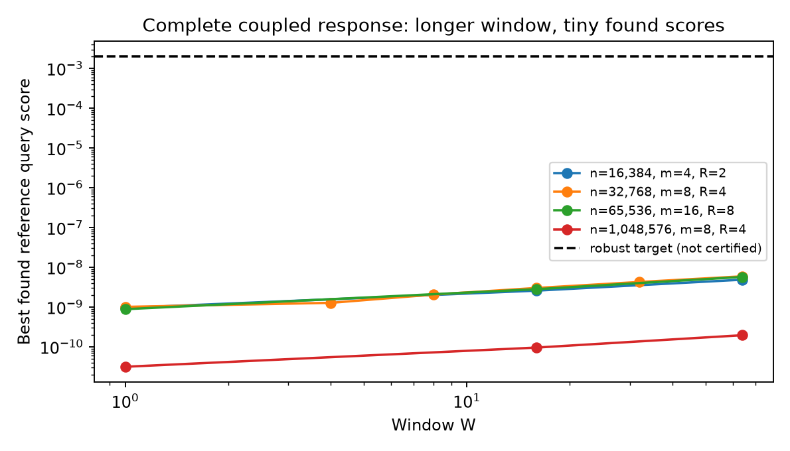
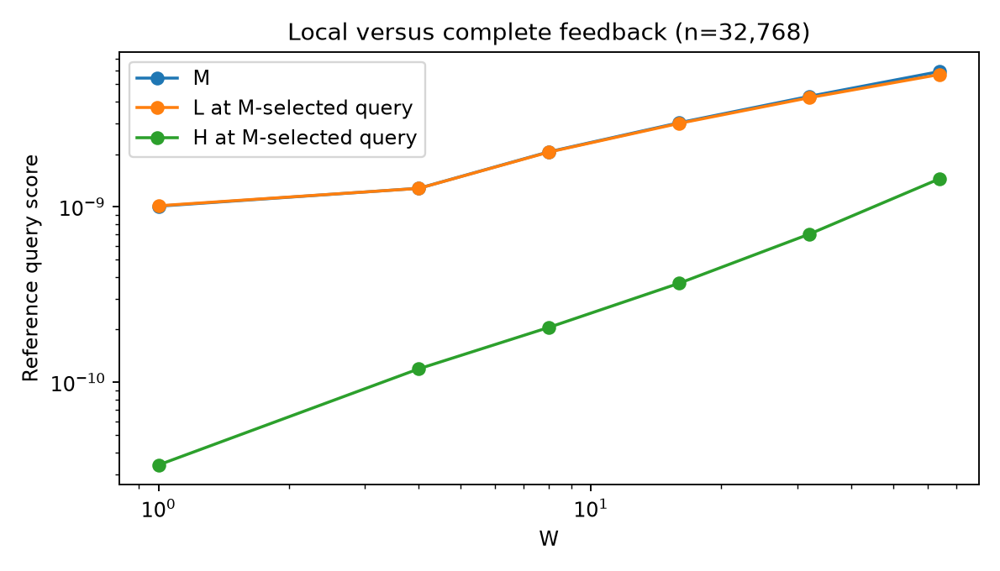
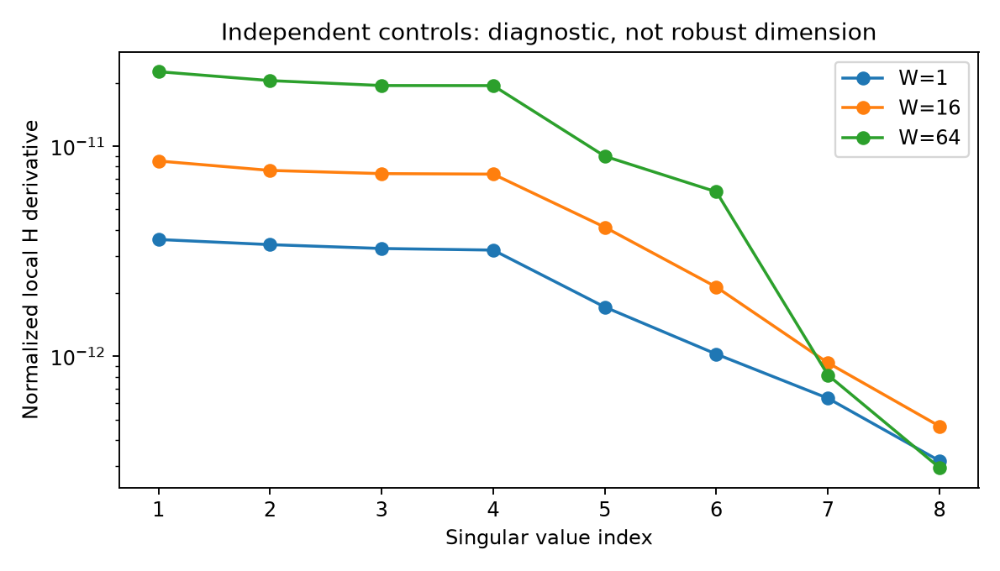

# Long-window numerical evidence

Status: finite reference-model experiments; NOT a robust-dimension certificate.

## Setup and reproducibility

CPU NumPy float64; fixed seeds; g_H=1-n^-2 (historical W=1 regression additionally uses .99999). One fixed feature uses sigma=.05. Complete rank-two chronological feedback is retained. Capture is at the final high step, before trace compensation. Main cohorts evolve autonomously. The held-high variant is separately labeled.

Run from the repository with Python and NumPy (Matplotlib for plots):

```powershell
$env:OPENBLAS_NUM_THREADS="1"
python theory/astra_route7a_long_window_20261008/run_experiments.py
python theory/astra_route7a_long_window_20261008/extra_checks.py
python theory/astra_route7a_long_window_20261008/diagnose_feedback.py
python theory/astra_route7a_long_window_20261008/scaling_cases.py
python theory/astra_route7a_long_window_20261008/plot_results.py
python theory/astra_route7a_long_window_20261008/make_experiment_report.py
```

The main runner resumes completed cases from results.json. For a fresh reproduction use a copy of this folder without result files; preserve the archived outputs. --quick omits million-width cases. Three starts and two vertex updates per start at small widths; two starts and one update at million width. Horizons 1,2,4 for small widths and 1,4 for million width. Only the first future gate is optimized; remaining future gates are high. This is a legal subset search, not a global optimizer.

Complete matrices are evaluated through exact forward/transpose products; dense n-by-n matrices are not materialized. Query scores below are full-parameter response norms. M, L and H are separately evaluated, with H=M-L.

## Main sweep

| n | m | R | W | precharge | N | pair | strong geometry | best found M | L at selected query | H at selected query | seconds |
|---:|---:|---:|---:|---:|---:|---|---|---:|---:|---:|---:|
| 32768 | 8 | 4 | 1 | 256 | 269 | random | False | 1.00951e-09 | 1.01529e-09 | 3.38513e-11 | 0.9 |
| 32768 | 8 | 4 | 4 | 256 | 281 | random | False | 1.27699e-09 | 1.2757e-09 | 1.19541e-10 | 1.0 |
| 32768 | 8 | 4 | 8 | 256 | 297 | random | False | 2.06208e-09 | 2.05421e-09 | 2.05958e-10 | 1.2 |
| 32768 | 8 | 4 | 16 | 256 | 329 | random | False | 3.01801e-09 | 2.99294e-09 | 3.67388e-10 | 2.7 |
| 32768 | 8 | 4 | 32 | 256 | 393 | random | False | 4.2673e-09 | 4.19274e-09 | 7.00046e-10 | 3.0 |
| 32768 | 8 | 4 | 64 | 256 | 521 | random | False | 5.90866e-09 | 5.68257e-09 | 1.44653e-09 | 4.1 |
| 16384 | 4 | 2 | 1 | 128 | 135 | random | False | 9.52772e-10 | 9.6088e-10 | 4.84357e-11 | 0.8 |
| 16384 | 4 | 2 | 16 | 128 | 165 | random | False | 2.58446e-09 | 2.56557e-09 | 2.24582e-10 | 1.0 |
| 16384 | 4 | 2 | 64 | 128 | 261 | random | False | 4.87225e-09 | 4.56217e-09 | 1.5812e-09 | 1.6 |
| 65536 | 16 | 8 | 1 | 256 | 281 | random | False | 8.82942e-10 | 8.82613e-10 | 9.59338e-12 | 3.1 |
| 65536 | 16 | 8 | 16 | 256 | 401 | random | False | 2.81273e-09 | 2.81712e-09 | 1.22248e-10 | 4.4 |
| 65536 | 16 | 8 | 64 | 256 | 785 | random | False | 5.71658e-09 | 5.65213e-09 | 8.04409e-10 | 9.2 |
| 32768 | 8 | 4 | 1 | 256 | 269 | aligned | False | 1.73988e-09 | 1.7469e-09 | 1.00942e-10 | 2.2 |
| 32768 | 8 | 4 | 64 | 256 | 521 | aligned | False | 1.24131e-08 | 1.20155e-08 | 2.48176e-09 | 4.2 |
| 1048576 | 8 | 4 | 1 | 2048 | 2061 | random | True | 3.14891e-11 | 3.1523e-11 | 3.15811e-13 | 451.4 |
| 1048576 | 8 | 4 | 16 | 2048 | 2121 | random | True | 9.56839e-11 | 9.5695e-11 | 3.04687e-12 | 362.0 |
| 1048576 | 8 | 4 | 64 | 2048 | 2313 | random | True | 1.95574e-10 | 1.9551e-10 | 7.42513e-12 | 342.3 |

Random means independent R-by-m Rademacher control signs versus their negatives, seed 812. Aligned means all-positive versus all-negative. Different W changes total duration and public track geometry; ratios are schedule comparisons, not an isolated causal estimate at equal total cost. All cases obey basic no-wrap. Small widths do not meet the stronger inherited large-n/spacing regime.

## Numerical legality and regression

Maximum endpoint disagreement: 0.
Maximum live trace-neutrality residual: 1.22782e-11.
Maximum measured driven/capture inverse-lift input: 0.120699.
Gate range over main cases: [-2.22045e-16, 0.99999999999996658]. Zero gates at a saturated front are floating-point tanh rounding, not a prescribed illegal donor gate.

Regression details:

```json
{
  "W1_previous_gate_error": 3.3306690738754696e-16,
  "cases": [
    {
      "W": 1,
      "dense_sparse_gate_error": 4.440892098500626e-16,
      "pairing_relative": 3.6588393135168556e-14,
      "full_local_trace_error": 0.0,
      "dense_adjoint_pairing_absolute": 5.551115123125783e-16
    },
    {
      "W": 4,
      "dense_sparse_gate_error": 4.440892098500626e-16,
      "pairing_relative": 1.4657542072934108e-14,
      "full_local_trace_error": 0.0,
      "dense_adjoint_pairing_absolute": 6.661338147750939e-16
    },
    {
      "W": 64,
      "dense_sparse_gate_error": 4.440892098500626e-16,
      "pairing_relative": 7.05630015854198e-14,
      "full_local_trace_error": 0.0,
      "dense_adjoint_pairing_absolute": 1.0408340855860843e-15
    }
  ],
  "DC_identity_error": 4.885328253045884e-14,
  "constant_field_unmatched_initial_response": -0.003900536442723035
}
```

An initial result-reporting TypeError (abs applied to a Python list) was fixed before any main case was checkpointed. The passed regression results were reused; no superseded scientific measurement was promoted. [RUN_LOG.txt](RUN_LOG.txt) preserves this event and the completed run.

## Deterministic public bath/front certificate

These values come from the support-bound proof in RESEARCH.md, not empirical maxima. They certify the stated reference bath/front premises for the three listed geometries; dense lifting and source/query assumptions remain separate.

| n | m | N | bath-gate upper | first-front upper | certified |
|---:|---:|---:|---:|---:|---|
| 1048576 | 8 | 2061 | 0.998357534 | 1.3484e-20 | True |
| 1048576 | 8 | 2121 | 0.998376055 | 2.6175e-20 | True |
| 1048576 | 8 | 2313 | 0.998434616 | 2.1863e-19 | True |

## Same forcing versus actual coupled feedback

The exact stage decomposition was tested on a stationary donor parameter column, including the actual difference in J between histories. Largest reconstruction residual: 2.5806e-17.
The common-field difference term can dominate the same-forcing filter term; it was not dropped. Full per-block values are in feedback_diagnostics.json.

| W | H-targeted best component score | complete M at that legal query |
|---:|---:|---:|
| 1 | 9.56199e-11 | 7.3238e-10 |
| 16 | 5.00787e-10 | 2.35268e-09 |
| 64 | 1.58974e-09 | 1.5913e-09 |

H is a decomposition component, not a separately observable gradient block. The complete physical score remains M. The algebraic unmatched-initial constant-input example is not claimed to be reachable by a legal RNN history.

## Independent-control spectra

Central differences at zero control with step .01, n=16384,m=4,R=2,precharge=128; one fixed random legal one-step query. Each row of the saved matrix is the normalized full parameter response derivative for a different control. These are local singular values, not antipodal separation or dimension proofs.

| W | M singular values | H singular values |
|---:|---|---|
| 1 | 1.04e-10, 8.99e-11, 8.94e-11, 7.69e-11, 6.95e-11, 5.21e-11, 5.18e-11, 2.48e-12 | 3.6e-12, 3.4e-12, 3.26e-12, 3.2e-12, 1.72e-12, 1.02e-12, 6.32e-13, 3.18e-13 |
| 16 | 3.93e-10, 3.86e-10, 1.06e-10, 7.71e-11, 5.38e-11, 5.12e-11, 4.13e-11, 2.94e-11 | 8.5e-12, 7.67e-12, 7.4e-12, 7.36e-12, 4.12e-12, 2.14e-12, 9.31e-13, 4.65e-13 |
| 64 | 6.34e-10, 5.92e-10, 3.63e-10, 3.39e-10, 9.67e-11, 7.72e-11, 4.75e-11, 3.85e-11 | 2.26e-11, 2.05e-11, 1.94e-11, 1.94e-11, 8.96e-12, 6.06e-12, 8.15e-13, 2.95e-13 |

## Explicit held-high public-bank alternative

Same small n=32768,m=8,R=4,precharge=256, independent sign pair. Public cohorts are now held high between captures. This is the full-query theorem variant, not the autonomous prototype.

| W | best found M |
|---:|---:|
| 1 | 1.00951e-09 |
| 16 | 3.01799e-09 |
| 64 | 5.90841e-09 |

## Matched width / donor-count / stage-count comparisons

Additional runs hold precharge=256 and use the same random control rule. Compare n=32768 versus 65536 at m=8,R=4; m=8 versus 16 at n=32768,R=4; and R=4 versus 8 at n=65536,m=16.

| n | m | R | W | best found M |
|---:|---:|---:|---:|---:|
| 65536 | 8 | 4 | 1 | 4.80472e-10 |
| 65536 | 8 | 4 | 64 | 2.89695e-09 |
| 32768 | 16 | 4 | 1 | 1.41219e-09 |
| 32768 | 16 | 4 | 64 | 9.90669e-09 |
| 65536 | 16 | 4 | 1 | 7.02678e-10 |
| 65536 | 16 | 4 | 64 | 4.85894e-09 |

For one independent W=64 control column, halving central-difference step .02 -> .01 -> .005 changes the H derivative by relative amounts [None, 2.685700496757208e-10, 1.210439332334688e-09]. This is a numerical conditioning check, not a dimension proof.

## Interpretation and limitations

Longer windows increased some found signals and local derivative singular values. No sampled query approached .002, and no jointly robust linear-dimensional section was constructed. Found small scores are not upper bounds on all legal queries. The small number of controls in the million-width cases does not test D=Theta(n).

The exact source root (sigma in (.0499,.051)) and dense perturbed model were not reconstructed numerically. The inherited comparison is a separate conditional theorem input. Query search, local spectra and finite endpoint agreement cannot substitute for it.

The mathematical recent-block donor code is uniform in W and does not rely on these small scores. The full autonomous public-cohort compression remains the principal open obligation.






